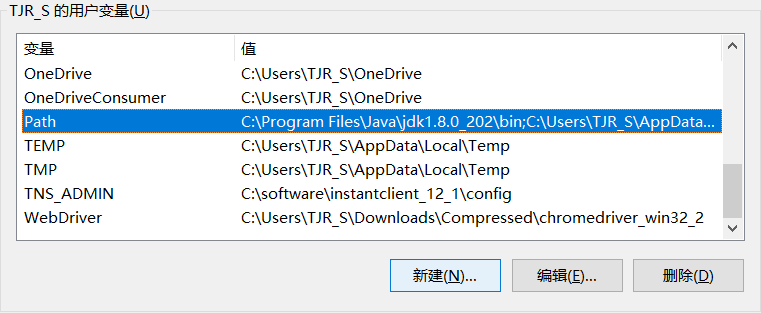

# 介绍

## .exe、.com和.bat文件

 我们通常利用“dir”命令查看磁盘上的文件时，可以发现文件后缀（即文件扩展名）有很多种，而不同后缀有着不同的含义。这里我简要地介绍三种windows下常见的文件格式（.exe、.com和.bat），这三种格式也是windows。

## 三种格式文件的区别

​    后缀为.exe、.com或.bat的文件都是可以直接执行的文件。其中后缀为.exe的文件，称为可执行文件；后缀为.com的文件，称为命令文件；后缀为.bat的文件，称为批处理文件。后缀为.exe的文件一般大于64KB，执行效率较低，但功能丰富；后缀为.com的文件最大不超过64KB，执行效率较高，但功能单一；后缀为.bat的文件是将若干后缀为.com或.exe等文件组合在一起，使其依次执行，从而不必一一输入命令和参数，即使用批处理文件可以按照顺序执行多条命令，例如当需要计算机完成一系列经常执行的任务时，可以使用批处理文件，将这些命令一次执行完毕。学会编辑并使用批处理文件，无疑可以刻更大程度地提高计算机的使用效率。

## 三种格式文件的执行优先级

​    执行上述文件，首先在提示符下输入文件名，然后按下回车即可，一般无需加上文件后缀，其执行的优先顺序为.com>.exe>.bat，也就是说，如果同时存在主文件名相同，但扩展名分别为.com、.exe和.bat的文件，直接输入主文件名并按下回车键后，如果有后缀为.com的文件，则只执行该命令文件；如果没有后缀为.com的文件，才会执行后缀为.exe的可执行文件；只有既没有后缀为.com的文件，也没有后缀为.exe的文件时，才会执行后缀为.bat的批处理文件。

# bat

bat文件是dos下的批处理文件。批处理文件是无格式的文本文件，它包含一条或多条命令。它的文件扩展名为 .bat 或 .cmd。在命令提示下键入批处理文件的名称，或者双击该批处理文件，**系统就会调用cmd.exe按照该文件中各个命令出现的顺序来逐个运行它们。**

实际上cmd的命令也就是bat中的命令

```bat
@echo off 
Rem This is for listing down all the files in the directory Program files 
dir "C:\Program Files" > C:\lists.txt  # The ‘>’ command is used to redirect the output to the file C:\lists.txt.
echo "The program has completed"
% 
```

```bat
%0 表示运行该批处理的 完整路径(bat文件本身)
start 打开另外一个窗口运行程序或指令 
Start %0 打开另外一个窗口运行该批处理 （不断死循环）
```

```bat
start cmd /k "cd/d E:\工作目录\2017工作目录\NewUnityProject1 &&scene.exe -batchmode &&taskkill /f /t /im cmd.exe"  
# 一堆cmd命令用&&表示 
# 用bat脚本打开windows的cmd命令界面并且执行命令语句，用不用cmd / k 有区别
```

```bat
@echo on # 输出状态信息
java  # 执行命令
pause  # 暂停，通常用于执行完命令不退出
@cmd /k # 等待用户输入自定义命令
start C:\Users\TJR_S\AppData\Local\SourceTree\SourceTree.exe  # 直接执行命令，等待
start /d "C:\Program Files\PremiumSoft\Navicat Premium 15" navicat.exe  # 新建窗口执行命令，不必等待
start "C:\Program Files (x86)\Google\Chrome\Application" chrome.exe #直接执行命令，等待，分隔路径和命令
```

## 	常用变量值

| %SystemDrive%        | 当前启动的系统所在的分区。如 C:                              |
| -------------------- | ------------------------------------------------------------ |
| %SystemRoot%         | 当前启动的系统所在的目录。如 C:\WINDOWS                      |
| %windir%             | 当前启动的系统所在的目录。如 C:\WINDOWS                      |
| %allusersprofile%    | 本地：返回“所有用户”配置文件的位置，如：C:\ProgramData       |
| %userprofile%        | 当前用户数据变量                                             |
| %userdomain%         | 本地：返回包含用户账户的域的名称                             |
| %appdata%            | 本地：返回默认情况下应用程序存储数据的位置，如：C:\Users\Elic\AppData\Roaming |
| %localappdata%       | 本地：返回appdata中的local目录，如：C:\Users\Elic\AppData\Local |
| %temp%或是%tmp%      | 系统和用户：返回对当前登录用户可用的应用程序更新所使用的临时目录。 |
| %ProgramFiles%       | 程序默认安装目录，相当于 C:\Program Files                    |
| %programfiles(x86)%  | 程序安装目录，在64位系统上适用，相当于c:\Program Files (x86) |
| %CommonProgramFiles% | 相当于 C:\Program Files\Common Files                         |
| %homedrive%          | 当前启动系统所在的分区。如：C:                               |
| %homepath%           | 相当于 \Documents and Settings\用户目录                      |
| %userprofile%        | 相当于 C:\Documents and Settings\用户目录                    |
| %cd%                 | 当前的目录                                                   |
| %cmdcmdline%         | 本地：返回用来启动当前的cmd.exe的准确命令行，如：C:\Windows\system32\cmd.exe |
| %cmdextversion%      | 系统：返回当前的”命令处理程序扩展“的版本号                   |
| %computername%       | 系统：返回计算机名称                                         |
| %username%           | 本地：返回当前登录的用户名称                                 |
| %comspec%            | 系统：返回命令行解释器可执行程序的准确路径，同%cmdcmdline%，这个命令可以直接在运行框中输入，结果是直接打开命令行编辑器 |
| %date%               | 系统：返回当前日期                                           |
| %time%               | 系统：返回当前时间                                           |
| %os%                 | 系统：返回操作系统名称                                       |
| %**Path**%           | 系统：指定可执行文件的搜索路径                               |
| %pathext%            | 系统：返回操作系统认为可执行的文件扩展名列表                 |

注意大小写



## kill progress

```bash
taskkill /F /IM <processname>.exe 
```


# 参考文章

https://www.tutorialspoint.com/batch_script/index.htm

https://en.wikipedia.org/wiki/List_of_DOS_commands

https://en.wikipedia.org/wiki/DOS

https://www.w3cschool.cn/dosmlxxsc1/