# [IO系列(一)之硬件原理](https://mp.weixin.qq.com/s/4h_s-PZSNIv2SR5q8FitRw)

## 前言

IO是影响系统性能的一个重要因素，一般我们说的IO包含了文件IO、网络IO等。作为开发人员有必要了解IO相关的原理，从而达到对性能系统更全面把控，通过对IO的优化进一步提升系统整体性能。 IO系列将和大家一起从硬件原理到Java NIO、再到Java Netty，了解IO从底层到应用上层的实现机制。

本文主要是该系列第一篇，重点说说IO的硬件原理，本文将从以下几个方面展开介绍：

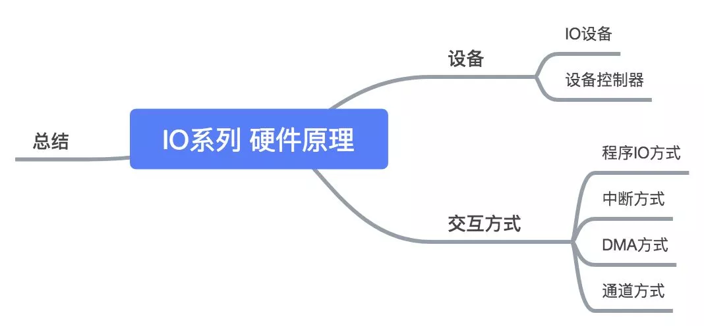

## 一.设备

### 1.1 IO设备

平时我们经常说的I/O是Input和Output的缩写，表示输入和输出的一个过程。即**输入/输出（Input/Output ,简称I/O），指的是一切操作、程序或设备与计算机之间发生的数据传输过程**。

计算机处理器需要与外部设备进行交互，需要从外部硬件中输入数据或将数据输出到外部硬件设备。如从获取从键盘输入的数据，或将数据输出并打印到显示屏上。这些**可以与计算机进行数据传输的硬件，我们称为输入/输出设备**。最常见的I/O设备有打印机、硬盘、网卡、鼠标等。

### 1.2 设备控制器

这些设备千差万别，它们是如何与计算机或CPU进行交互的呢？这个就要归功于计算机的接口设计。设计模式中有一个重要的设计原则就是依赖倒置原则，上层与下层不直接依赖，而是依赖于接口。这种设计使得计算机很多设备都可以做到可插拔。

为了与外部设计进行交互，计算机内部提供了设备控制器，它根据处理机规定的输入输出的标准格式要求控制外围设备的操作，**统一操作接口**，管理处理机与外围设备之间的数据传送。计算机也会根据IO操作类型的不同提供了多种设备控制器，如外存设备控制器，输入设备控制器、通讯设备控制器等。 如下图所示：

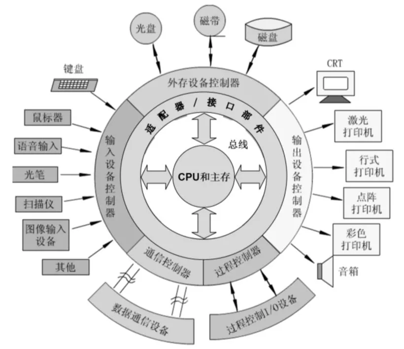

设备控制器的功能不言而喻，主要是接收和识别CPU传递的指令，并负责作为CPU和设备之间数据交换的桥梁，为了解决CPU和低速设备的速度不匹配问题，内置了数据缓存设计。设备控制器的大致结构如下：

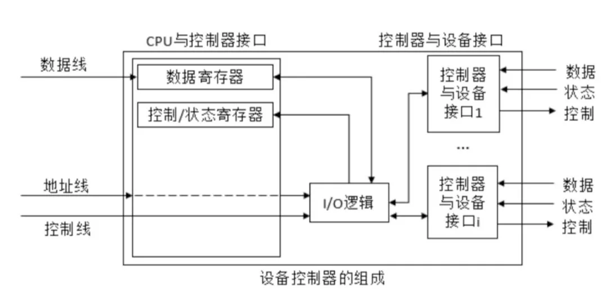

## 二. 交互方式

有了设备控制器这个中间桥梁以后，CPU就可以愉快地和外部的各种设备进行交互了。最粗暴简单的方式就是CPU直接控制设备控制器，告诉控制器需要输入什么数据或输出什么数据，这种方式称为IO程序直接控制方式。

### 2.1 IO程序直接控制方式

程序直接控制方式也称**询问方式**，它是早期计算机系统中的一种I/O操作控制方式。由于早期计算机系统缺乏**中断机构**，无法通过异步手段获取IO结果，因此CPU需要主动轮询设备控制器得知读写结果。我们可以想象这样一个画面，去一个老式小餐馆吃饭但是餐馆生意很好、人很多、上菜速度慢需要排队等候，但是因为没有报号系统你只能隔几分钟去询问是否到号了，这期间只能干等又不敢走开。

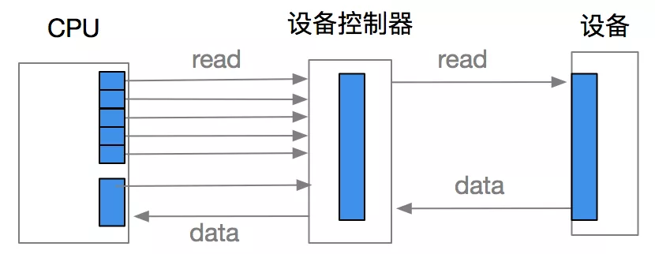

对于CPU也是，由于CPU的高速性和I/O设备的低速性，致使CPU的绝大部分时间都处于等待I/O设备完成数据I/O的循环测试中，造成对CPU的极大浪费。

### 2.2 中断驱动I/O控制方式

继续以小餐馆吃饭为例，为了考虑用户体验问题小餐馆新增了提醒功能，当排号快到你时可以提前发个短信或打电话告诉你。这样你就可以不用在餐馆门口干等，可以先逛逛商场。当收到小餐馆通知时，中断当前的逛商场直接去吃饭即可。

当某进程要启动某个I/O设备工作时，便由CPU向相应的设备控制器发出一条I/O命令，然后立即返回继续执行原来的任务，设备控制器于是按照该命令的要求去控制指定I/O设备，此时，CPU与I/O设备并行操作。一旦数据进入数据寄存器，设备控制器便通过控制线向CPU发送一个**中断信号**，由CPU检查输入过程中是否出错，若无错，便由控制器发送取走数据的信号，再通过控制器及数据线将数据写入内存指定单元中。

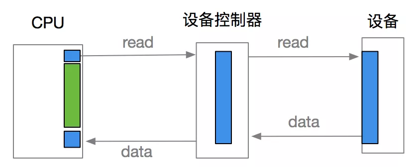

在I/O设备输入每个数据的过程中，由于无需CPU干预，因而可使CPU与I/O设备并行工作，仅当完成一个数据输入时，才需CPU花费极短的时间去做一些中断处理。

### 2.3直接存储器访问控制(DMA)方式 

虽然中断驱动I/O比程序I/O方式更有效，可以避免CPU忙等问题，但是它仍是以**字（节）为单位进行I/O的**，每当完成一个字（节）的I/O时，控制器便要向CPU请求一次中断，换言之，采用中断驱动I/O方式时的CPU是以字（节）为单位进行干预的，将这种方式用于块设备的I/O是非常低效的，例如，为了从磁盘读取1KB的数据块，需要中断CPU 1K次，为了进一步减少CPU对I/O的干预而引入了直接存储器访问方式。

**DMA控制方式的基本思想是在外围设备和内存之间开辟直接的数据交换通路**。在DMA控制方式中，I/O控制器具有更强的功能，在它的控制下，设备和内存之间可以**成批地进行数据交换，而不用CPU干预**。这样既大大减轻了CPU的负担，也使I/O数据传送速度大大提高。这种方式一般用于块设备（块设备处理信息的基本单位是字符块。一般块的大小为512B~8KB）的数据传输。

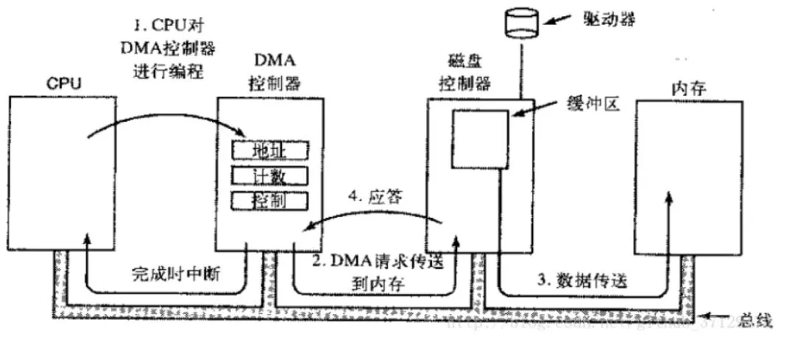

DMA方式具有以下特点:

- 数据传输的**基本单位是数据块**，即在CPU与I/O设备之间，每次传送至少一个数据块。
- 所传送的数据是从设备**直接送入内存**的，或者相反。
- 仅在传送一个或多个数据块的开始和结束时，**需要CPU干预**，整块数据的传送是在控制器的控制下完成的。

DMA控制方式下进行数据输入的过程如下：

- 当进程要求设备输入一批数据时，CPU将准备存放输入数据的内存始址以及要传送的字节数分别送入DMA控制器中的内存地址寄存器和传送字节计数器；另外，还要将中断位和启动位设置为1，以启动设备开始进行数据输入，并允许中断。
- 发出数据请求的进程进入等待状态，进程调度程序调度其他进程占据CPU。
- 此后，整个数据传送过程便由DMA控制器进行控制.将数据寄存器中的数据源源不断地写入内存，直到所要求的字节全部传送完毕。
- DMA控制器在传送字节数完成时通过中断请求线发出中断信号，CPU收到中断信号后转去执行中断处理程序，唤醒等待输入完成的进程，并返回被中断程序。
- 在以后的某个时刻，进程调度程序选中提出请求输入的进程；该进程从指定的内存单元取出数据并做进一步的处理。

### 2.4 通道控制方式

通道控制方式与DMA控制方式类似，也是一种以内存为中心，实现设备与内存直接交换数据的控制方式。与DMA控制方式相比，虽然DMA方式比起中断方式已经显著地减少CPU的干预，即已由以字（节）为单位的干预减少到了以数据块为单位进行干预，但CPU每次发出一条I/O指令，也**只能去读（或写）一个连续的数据块**，而当我们需要一次去读多个数据块且将他们分别传送到不同的内存区域，或者相反时，则须由CPU分别发出多条I/O指令及进行多次中断才能完成。

I/O通道方式是DMA的发展，可以做到一个通道控制多台设备，它可以进一步减少CPU的干预，即**一个数据块的读（或写）为单位的干预减少为对一组数据块的读（或写）及有关的控制和管理为单位的干预**。同时，可以实现CPU、通道、I/O设备的并行操作，提高资源利用率。

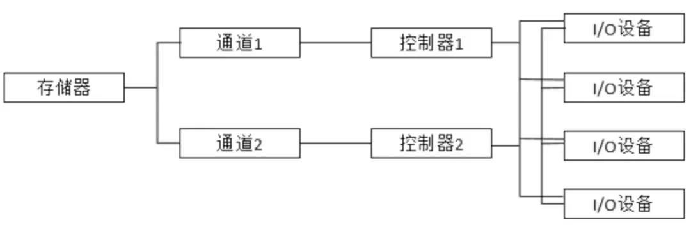

在设置了通道后，CPU只需要向通道发送一条I/O指令，通道在收到该指令后，便从内存中取出本次要执行的通道程序，然后执行该通道程序，仅当通道完成了规定的I/O任务后，才向CPU发中断信号。I/O通道是一种特殊的处理机，具有执行I/O指令的能力，并通过执行通道（I/O）程序来控制I/O操作，但I/O通道与一般的处理机不同，因为其指令类型单一同时没有自己的内存，与CPU共享主内存。

## 总结

I/O操作是计算机处理中非常重要的操作,如何实现对I/O设备的有效控制，以更好地满足用户的输入/输出要求，是设备管理中非常重要的问题之一。在计算机技术的发展过程中,I/O控制方式也在不断地发展，对I/O控制的要求主要是基于尽量减少主机对I/O控制的干预，把主机从繁杂的I/O控制事务中解脱出来，以更多地完成其数据处理任务。

- **IO程序直接控制方式**虽然简单，但导致CPU处于忙等状态，CPU利用率不高。
- **中断驱动I/O控制方式**，采用中断机制，等到读写完成后通知CPU，避免忙等。但每次传输单位为字节，在数据量大时CPU经常被中断。
- **DMA方式，**开辟了设备到内存直接的通道。每次数据操作以块为单位，直接进行设备和内存之间的数据交互操作，减少CPU参与。当我们需要一次去读多个数据块时，则须由CPU分别发出多条I/O指令及进行多次中断才能完成。
- **通道**是在DMA的升级版，进一步减少了CPU的干预。通道实现了对一组数据块的读写操作，提高资源利用率。

## 参考文章

https://mp.weixin.qq.com/s/4h_s-PZSNIv2SR5q8FitRw

# [IO系列(二)之linux IO模型](https://mp.weixin.qq.com/s/DI1gY9UhJFjr7563yOoHOQ)

## 前言

上文我们主要讲的是IO的硬件基础，讲解CPU如何和外部IO硬件设备之间进行数据交换操作。 本文是IO系列的第二篇，主要说说linux IO模型。 **大部分语言的IO底层都是基于这些linux IO模型，例如java的nio 底层采用的是linux  epoll 方式。** 所以了解linux IO 有助于我们理解语言层面的IO原理。

## 一. Kernel IO

用户进程进行I/O操作的时候实际上交给了kernel进行执行，kernel执行的I/O操作可以分为两个阶段：

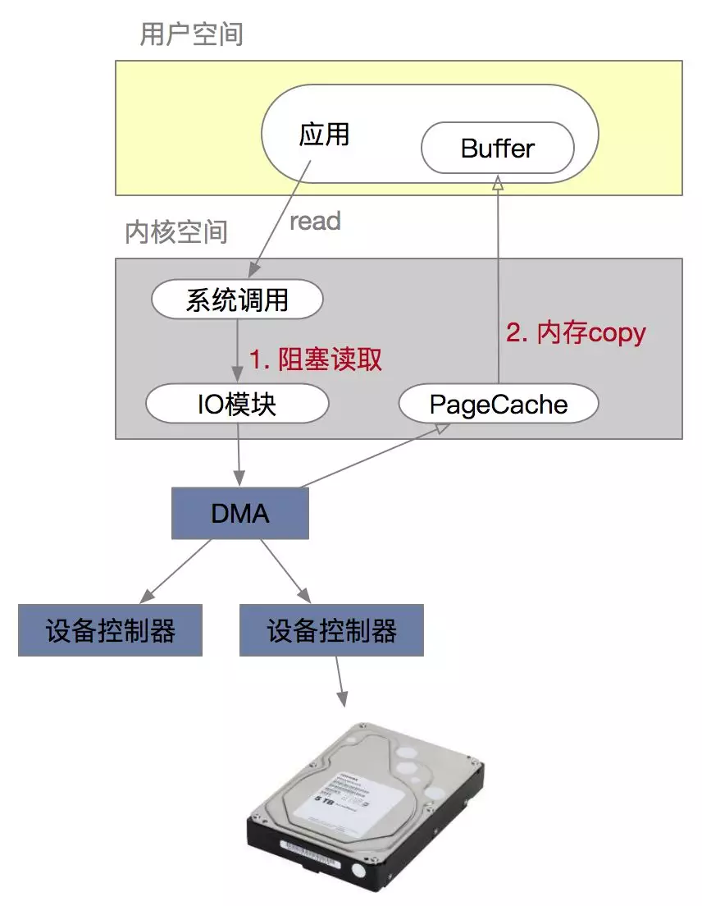

- **准备阶段**：在执行I/O操作的时候需要等待I/O是否就绪，因为此刻IO设备在忙状态。以网络IO为例，在读取远程数据时，需要阻塞等待远程将数据发送过来，很多时候数据在一开始还没有到达（比如，还没有收到一个完整的UDP包），这个时候kernel就要等待足够的数据到来。

- **用户进程空间和内核空间的数据拷贝** : 当等到数据准备好了，kernel就会将数据从从kernel中拷贝到用户内存，然后kernel返回结果，用户进程才解除block的状态，重新运行起来。

  

准备阶段时，CPU内容发送指令给IO通道，让IO通道负责执行IO的读写操作。CPU不用一直阻塞可以继续执行别的逻辑，但此刻IO线程会挂起，等待IO通道读写操作完成通知。 IO通道将操作交给DMA，DMA直接连接设备控制器负责将设备控制器中的数据直接读入到内核内存中。读完成后通知通道告知IO处理完成，IO通道发送中断给CPU，原内核IO线程醒来继续执行后续工作.

## 二. I/O 模型

根据IO对kernel IO操作两个阶段的感知能力可以分为一下四种IO模型：

- **阻塞（Blocking）**：阻塞等待IO就绪，这期间用户线程不可以做其他事情。
- **非阻塞（Non-blocking）**：轮询感知IO就绪，用户线程可以做其他事情。
- **同步（Synchronous）**：同步等待读IO读写结果。
- **异步（Asynchronous）**：异步等待kernel通知IO读写结果。

**IO阻塞和非阻塞主要关注IO的就绪状态的感知方式，同步和异步关注IO读写操作的结果获取方式**。同步是指函数完成之前会一直等待；阻塞是指系统调用的时候进程会被设置为Sleep状态直到等待的事件发生（比如有新的数据）。

### 2.1 阻塞和非阻塞

阻塞和非阻塞是一种**调用机制**，用来描述进程处理调用的方式。在IO中两者的**区别主要体现在I/O未准备好时，用户线程是否可以做其他事情**。比如网络读操作，根据是否需要等待kernel数据准备好。

阻塞是等待某个事件的就绪/发生，当前线程会被**挂起**，一直处于等待消息通知，不能执行其他业务。**阻塞通信意味着通信方法在尝试访问套接字或者读写数据时阻塞了对套接字的访问**。以网络读操作为例，用户线程在socket中调用recv函数时，如果缓冲区中没有数据，则需要一直阻塞等待服务端发来的数据，这时候线程会挂起等待。

非阻塞和阻塞的概念相对应，指在不能立刻得到结果之前，该函数不会阻塞当前线程，而会立刻返回。非阻塞IO是用户线程不会一直阻塞待待IO就绪，通过不断轮询的方式来查看就绪状态。

### 2.2 同步和异步

同步和异步是一种**通信机制**，涉及到调用方和被调用方，**关注的是IO操作结果的获知方式，主要区别在于IO结果未返回时用户线程是否可以做其他事情**：

- **同步**是调用方需要保持等待直到IO操作完成，进而通过返回获得结果；
- **异步**则调用方在IO操作的执行过程中不需要保持等待，而是在操作完成后被动的接受（通过消息或回调）被调用方推送的结果。

以下是同步和异步定义：

> **A synchronous I/O** operation causes the requesting process to be blocked until that I/O operation completes;**An asynchronous I/O** operation does not cause the requesting process to be blocked;

同步和异步的区别也在于在进行整个IO操作的时候会用户进程**是否会阻塞等待结果**，linux中IO模型中blocking IO，non-blocking IO，IO multiplexing都属于synchronous IO。

## 三. linux IO 模型

linux根据用户进程对这个两个阶段的感知方式分为5中I/O模型：

- 阻塞I/O（bloking IO）
- 非阻塞I/O（non-blocking IO）
- 多路复用IO（multiplexing IO）
- 信号驱动式IO（signal-driven IO）
- 异步IO（asynchronous IO）

### 3.1阻塞IO(Blocking IO) 

默认情况下所有的socket都是blocking

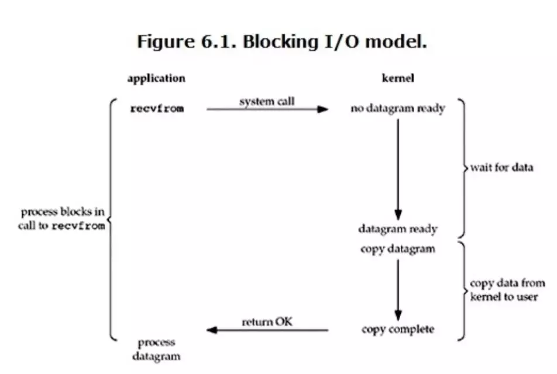

当用户进程调用了recvfrom这个系统调用，就**阻塞等待结果**。kernel负责完成IO操作，完成后返回给用户。用户进程需要阻塞等待kernel完成两个阶段操作：**准备数据(wait for data)**、 **数据拷贝到用户进程空间(copy data from kenel to user)**。 阻塞IO是同步阻塞IO, 准备数据阶段会阻塞并同步等待I/O结果。在准备阶段和数据拷贝阶段中，用户线程都会被阻塞。

使用linux中进行网络编程时，一般都从listen()、send()、recv() 等接口开始，这些接口都是阻塞型。使用这些接口可以方便构建服务器/客户机模型。下面是一个简单地“一问一答”服务器。 整体流程如下:

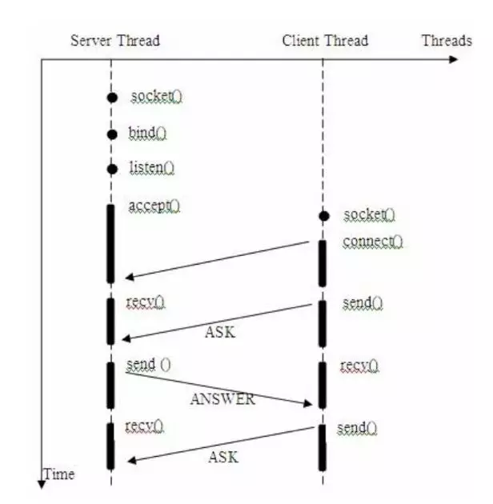

**服务器实现模式为一个连接一个线程，即客户端有连接请求时服务器端就需要启动一个线程进行处理**，如果这个连接不做任何事情会造成不必要的线程开销。通常会对它的线程模型进行优化，后端通过一个线程池来处理多个客户端的请求接入。通过“线程池”减少创建和销毁线程的频率，其维持一定合理数量的线程，并让空闲的线程重新承担新的执行任务，提高系统性能。

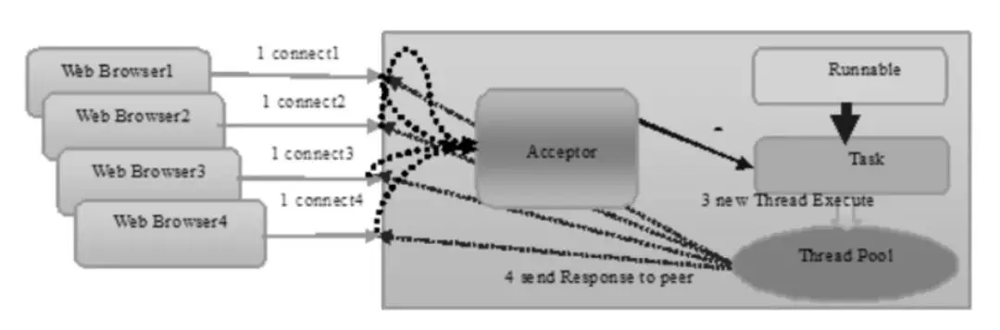

java 的BIO就是采用这种模式实现的。

### 3.2 非阻塞IO(non-blocking IO)

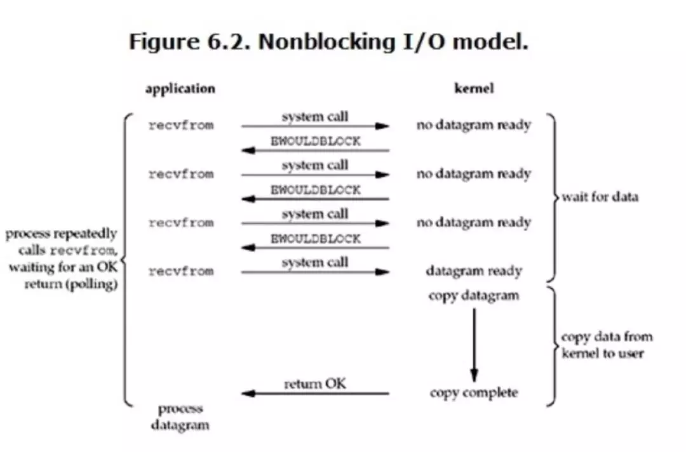

当用户进程发出read操作时，如果kernel中的数据还没有准备好，那么它**并不会block用户进程，而是立刻返回一个error**。整体流程是：

1. 用户线程轮询查看kernel是否准备好数据（datagram ready）。这个过程kernel主要处于wait for data阶段。
2. 当用户调用read, kernel已准备好数据，则执行数据拷贝操作，**用户线程阻塞直到数据读取完成**。kernel读取数据完成后，返回给用户数据。

从用户进程角度讲 ，它发起一个read操作后，并不需要等待，而是马上就得到了一个结果。用户进程判断结果是一个error时，它就知道数据还没有准备好，于是它可以再次发送read操作。一旦kernel中的数据准备好了，并且又再次收到了用户进程的system call，那么它马上就将数据拷贝到了用户内存，然后返回。

**在非阻塞式IO中，用户进程其实是需要不断的主动询问kernel数据准备好了没有，非阻塞的接口相比于阻塞型接口的显著差异在于，在被调用之后立即返回。**

**non-blocking IO在执行recvfrom这个系统调用的时候，如果kernel的数据没有准备好，这时候不会block进程。但是当kernel中数据准备好的时候，recvfrom会将数据从kernel拷贝到用户内存中，这个时候进程是被block了，在这段时间内进程是被block的**，因此属于同步IO。

优点：

1. 用户进程不会被阻塞，可以在期间做一些别的事情。

缺点：

1. 用户线程不知道什么时候完成，需要不断的轮询查看I/O操作结果。看是否已经读取完成，增加了用户使用的复杂度。

2. 在数据copy部分用户进程还是需要阻塞。

   

### 3.3 多路复IO(IO multiplexing)

IO multiplexing，也称这种IO方式为**事件驱动IO(event driven IO)**。非阻塞IO（non-blocking IO）模式需要用户自己去轮询查看是否数据准备好，如果准备好则阻塞调用kernel进行copy。多路复用IO就是解决这种轮询问题，linux内部提供了select/poll/epoll来完成IO复用。

select/poll/epoll的好处就在于单个process就可以同时处理多个网络连接的IO。它的基本原理就是select/poll这个function会不断的轮询所负责的所有socket，当某个socket有数据到达了，就通知用户进程。它的流程如图：

epoll 采用事件注册和通知方式，性能比select 和poll 高，我们在后面继续介绍这三者的区别。

### 3.4 信号驱动式 I/O

当用户进程发出read操作时，如果kernel中的数据还没有准备好，那么它**并不会block用户进程，而是立刻返回一个, 用户进程可以执行自己的程序不用轮询结果。kernel在IO就绪时会发送一个信号给用户进程告知IO准备好，可以执行后续操作**。整体流程是：

1. 用户线程调用read, kernel执行IO准备阶段，这个过程不阻塞用户线程。
2. 数据就绪后内核给用户线程发signal。
3. 当用户调用read, kernel执行数据拷贝操作，**用户线程阻塞直到数据读取完成**。kernel读取数据完成后，返回给用户数据。

应用进程使用 sigaction 系统调用，内核立即返回，应用进程可以继续执行，也就是说等待数据阶段应用进程是非阻塞的。内核在数据到达时向应用进程发送 SIGIO 信号，应用进程收到之后在信号处理程序中调用 recvfrom 将数据从内核复制到应用进程中。

相比于非阻塞式 I/O 的轮询方式，信号驱动 I/O 的 CPU 利用率更高。这样避免了用户线程进行不断轮询的操作。

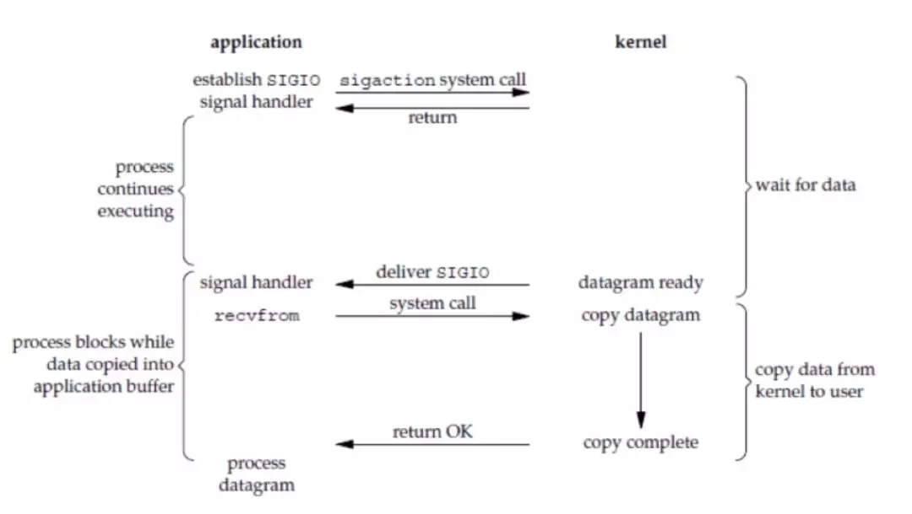

### 3.5 异步IO (Asynchronous I/O)

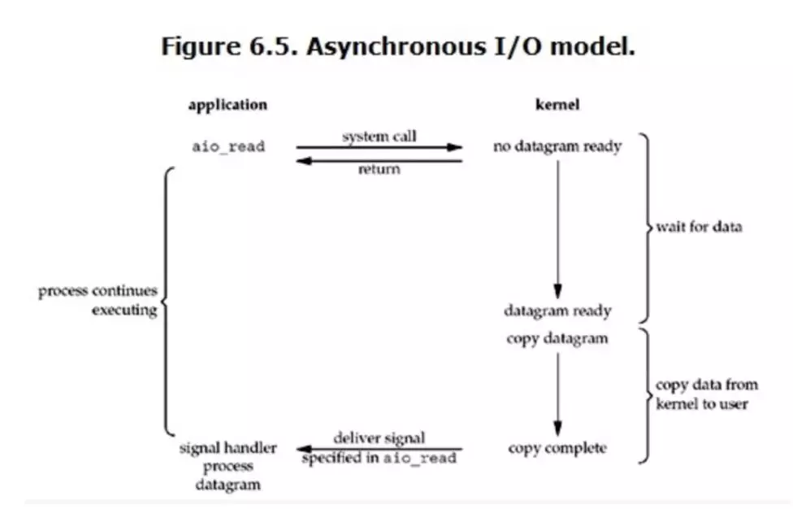

用户进程发起read操作之后，立刻就可以开始去做其它的事。而另一方面，从kernel的角度，当它受到一个asynchronous read之后，首先它会立刻返回，所以**不会对用户进程产生任何block**。然后，kernel会等待数据准备完成，然后将数据拷贝到用户内存，**当这一切都完成之后，kernel会给用户进程发送一个signal，告诉它read操作完成了**。

和同步方式不同，kernel的数据准备好以后不需要用户进程再次发送拷贝指令并阻塞等待kernel拷贝完成。

## 四. select/poll/epoll

### 4.1 select

select的调用过程如下所示：

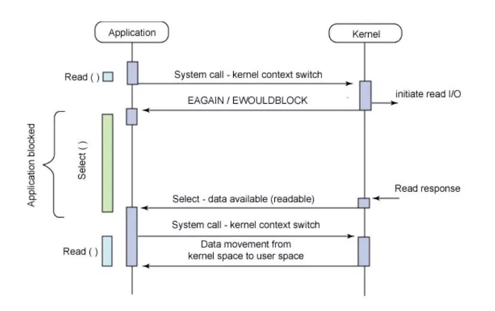

select负责管理多个FD文件描述符，kernel就会**轮询**检查所有select负责的fd，看是否有一个FD的数据已准备好。select会返回kernel数据准备就绪的FD， FD调用read操作让kernel完成数据的拷贝。 select解决了非阻塞状态下用户进程需要自己轮询的问题，同时可以用一个线程管理多个用户进程的读写操作。

select的缺点：

- 单个进程能够监视的文件描述符的**数量存在最大限制**，**通常是1024**，当然可以更改数量。
- 对socket进行扫描时是线性扫描，即采用轮询的方法，效率较低。
- 内核/用户空间内存拷贝问题。每次调用select，**都需要把fd集合从用户态拷贝到内核态**，这个开销在fd(客户端套接字)很多时会很大。

### 4.2 poll

**poll本质上和select没有区别，它将用户传入的数组拷贝到内核空间**。然后查询每个fd对应的设备状态，如果设备就绪则在设备等待队列中加入一项并继续遍历，如果遍历完所有fd后没有发现就绪设备，则挂起当前进程，直到设备就绪或者主动超时，被唤醒后它又要再次遍历fd。这个过程经历了多次无谓的遍历。

**它没有最大连接数的限制，原因是它是基于链表来存储的**，但是同样有一个缺点：

- 1）大量的fd的数组被整体复制于用户态和内核地址空间之间，而不管这样的复制是不是有意义。
- 2）poll还有一个特点是“水平触发”，如果报告了fd后，没有被处理，那么下次poll时会再次报告该fd。

### 4.3 epoll

在linux 没有实现epoll事件驱动机制之前，我们一般选择用select或者poll等IO多路复用的方法来实现并发服务程序。epoll是在2.6内核中提出的，是之前的select和poll的增强版本。相对于select和poll来说，epoll更加灵活，没有描述符限制。**epoll使用一个文件描述符管理多个描述符，将用户关系的文件描述符的事件存放到内核的一个事件表中**，这样在用户空间和内核空间的copy只需一次。

基本原理：epoll支持水平触发和边缘触发，最大的特点在于边缘触发，它只告诉进程哪些fd刚刚变为就绪态，并且只会通知一次。还有一个特点是，**epoll使用“事件”的就绪通知方式**，通过epoll_ctl注册fd，一旦该fd就绪，内核就会采用类似**callback的回调机制来激活该fd**，epoll_wait便可以收到通知。

三个epoll相关的系统调用：

- int epoll_create(int size) epoll_create建立一个epoll对象。参数size是内核保证能够正确处理的最大句柄数，多于这个最大数时内核可不保证效果。
- int epoll_ctl(int epfd, int op, int fd, struct epoll_event event) epoll_ctl可以操作epoll_create创建的epoll，如将socket句柄加入到epoll中让其监控，或把epoll正在监控的某个socket句柄移出epoll。
- int epoll_wait(int epfd, struct epoll_event events,int maxevents, int timeout) epoll_wait在调用时，在给定的timeout时间内，所监控的句柄中有事件发生时，就返回用户态的进程。

epoll内部实现大概如下：

- epoll初始化时，会向内核注册一个文件系统，用于存储被监控的句柄文件，调用epoll_create时，会在这个文件系统中创建一个file节点。同时epoll会开辟自己的内核高速缓存区，以红黑树的结构保存句柄，以支持快速的查找、插入、删除。还会再建立一个list链表，用于存储准备就绪的事件。
- 当执行epoll_ctl时，除了把socket句柄放到epoll文件系统里file对象对应的红黑树上之外，还会给内核中断处理程序注册一个回调函数，告诉内核，如果这个句柄的中断到了，就把它放到准备就绪list链表里。所以，当一个socket上有数据到了，内核在把网卡上的数据copy到内核中后，就把socket插入到就绪链表里。
- 当epoll_wait调用时，仅仅观察就绪链表里有没有数据，如果有数据就返回，否则就sleep，超时时立刻返回。

epoll的优点：

1. **没有最大并发连接的限制**，能打开的FD的上限远大于1024（1G的内存上能监听约10万个端口）。
2. **效率提升，不是轮询的方式，不会随着FD数目的增加效率下降**。只有活跃可用的FD才会调用callback函数；即Epoll最大的优点就在于它只管你“活跃”的连接，而跟连接总数无关，因此在实际的网络环境中，Epoll的效率就会远远高于select和poll。
3. **内存拷贝，利用mmap()文件映射内存加速与内核空间的消息传递**；即epoll使用mmap减少复制开销。

# 参考文献

[linux五种IO模型与事件驱动模型](https://www.cnblogs.com/Yunya-Cnblogs/p/13246517.html)

