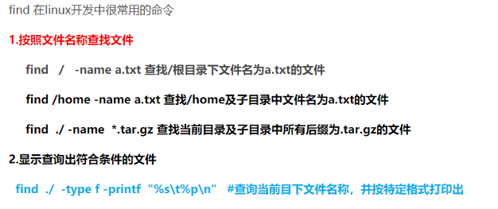
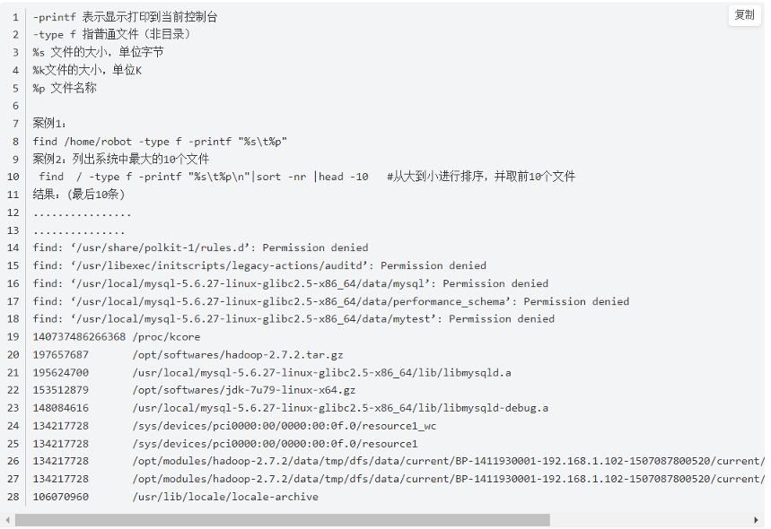

# 内存

[Linux查看内存使用情况方法](https://www.jianshu.com/p/e9e0ce23a152)

# [tar: Error is not recoverable: exiting now](https://stackoverflow.com/questions/3950839/tar-error-is-not-recoverable-exiting-now)

```
mv Doctrine-1.2.0.tgz Doctrine-1.2.0.tar.gz
gunzip Doctrine-1.2.0.tar.gz
tar xf Doctrine-1.2.0.tar
```

[看完这篇Linux基本的操作就会了](https://juejin.cn/post/6844903605296726030)

# 命令

## Find : 文件查找命令

只能查找文件，不能查找文件夹





注意事项：用find查找文件时，find的能够搜索查询的目录只是当前用户的权限目录，所以有些非当前用户的目录是检索不到的，如果想查全部目录，则要用root用户登录查找。

## tar : 压缩解压缩

<https://www.cnblogs.com/jyaray/archive/2011/04/30/2033362.html>

-c: 建立压缩档案

-x：解压

-t：查看内容

-r：向压缩归档文件末尾追加文件

-u：更新原压缩包中的文件

这五个是独立的命令，压缩解压都要用到其中一个，可以和别的命令连用但只能用其中一个。

下面的参数是根据需要在压缩或解压档案时可选的。

-z：有gzip属性的

-j：有bz2属性的

-Z：有compress属性的

-v：显示所有过程

-O：将文件解开到标准输出

参数-f是必须的

-f: 使用档案名字，切记，这个参数是最后一个参数，后面只能接档案名。

\# tar -cf all.tar *.jpg 这条命令是将所有.jpg的文件打成一个名为all.tar的包。-c是表示产生新的包，-f指定包的文件名。

\# tar -rf all.tar *.gif 这条命令是将所有.gif的文件增加到all.tar的包里面去。-r是表示增加文件的意思。 

\# tar -uf all.tar logo.gif 这条命令是更新原来tar包all.tar中logo.gif文件，-u是表示更新文件的意思。 

\# tar -tf all.tar 这条命令是列出all.tar包中所有文件，-t是列出文件的意思 

\# tar -xf all.tar 这条命令是解出all.tar包中所有文件，-x是解开的意思

**查看**

tar -tf aaa.tar.gz   在不解压的情况下查看压缩包的内容

**压缩**

tar –cvf jpg.tar *.jpg //将目录里所有jpg文件打包成tar.jpg

tar –czf jpg.tar.gz *.jpg //将目录里所有jpg文件打包成jpg.tar后，并且将其用gzip压缩，生成一个gzip压缩过的包，命名为jpg.tar.gz

tar –cjf jpg.tar.bz2 *.jpg //将目录里所有jpg文件打包成jpg.tar后，并且将其用bzip2压缩，生成一个bzip2压缩过的包，命名为jpg.tar.bz2

tar –cZf jpg.tar.Z *.jpg   //将目录里所有jpg文件打包成jpg.tar后，并且将其用compress压缩，生成一个umcompress压缩过的包，命名为jpg.tar.Z

**解压**

tar –xvf file.tar //解压 tar包

tar -xzvf file.tar.gz //解压tar.gz

tar -xjvf file.tar.bz2   //解压 tar.bz2tar –xZvf file.tar.Z //解压tar.Z

tar –xvf xxx.tar.gz –C /usr/local/java -c地址

**总结**

1、*.tar 用 tar –xvf 解压

2、*.gz 用 gzip -d或者gunzip 解压

3、*.tar.gz和*.tgz 用 tar –xzf 解压

4、*.bz2 用 bzip2 -d或者用bunzip2 解压

5、*.tar.bz2用tar –xjf 解压

6、*.Z 用 uncompress 解压

7、*.tar.Z 用tar –xZf 解压

 

##  sudo命令语法

 简单的说，sudo 是一种权限管理机制，管理员可以授权于一些普通用户去执行一些 root 执行的操作，而不需要知道 root 的密码。

严谨些说，sudo 允许一个已授权用户以超级用户或者其它用户的角色运行一个命令。当然，能做什么不能做什么都是通过安全策略来指定的。sudo 支持插件架构的安全策略，并能把输入输出写入日志。第三方可以开发并发布自己的安全策略和输入输出日志插件，并让它们无缝的和 sudo 一起工作。默认的安全策略记录在 /etc/sudoers 文件中。而安全策略可能需要用户通过密码来验证他们自己。也就是在用户执行 sudo 命令时要求用户输入自己账号的密码。如果验证失败，sudo 命令将会退出。(注意，本文介绍的 sudo 命令运行在 ubuntu 14.04中。)


或

sudo [-klv]

参数

  -b  在后台执行指令。

  -h  显示帮助。

  -H  将HOME环境变量设为新身份的HOME环境变量。

  -k  结束密码的有效期限，也就是下次再执行sudo时便需要输入密码。

  -l  列出目前用户可执行与无法执行的指令。

  -p  改变询问密码的提示符号。

  -s  执行指定的shell。

  -u  <用户>  以指定的用户作为新的身份。若不加上此参数，则预设以root作为新的身份。

  -v  延长密码有效期限5分钟。

  -V  显示版本信息。

  -S  从标准输入流替代终端来获取密码

**sudo** **程序相关文件**

/etc/sudoers

/etc/init.d/sudo

/etc/pam.d/sudo

/var/lib/sudo

/usr/share/doc/sudo

/usr/share/lintian/overrides/sudo

/usr/share/bash-completion/completions/sudo

/usr/bin/sudo

/usr/lib/sudo

**基本配置**

系统默认创建了一个名为 sudo 的组。只要把用户加入这个组，用户就具有了 sudo 的权限。

至于如何把用户加入 sudo 组，您可以直接编辑 /etc/group 文件，当然您得使用一个有 sudo 权限的用户来干这件事：

$ sudo vim /etc/group

在 sudo 组中加入新的用户，要使用逗号分隔多个用户。

![img](data:image/png;base64,iVBORw0KGgoAAAANSUhEUgAAAO0AAAA4CAIAAACe3OhEAAAAAXNSR0IArs4c6QAAAARnQU1BAACxjwv8YQUAAAAJcEhZcwAADsMAAA7DAcdvqGQAAAlDSURBVHhe7Z2/ixRJFMcnMnOzyRaE5UAjIxFEjDYYZTkRNFjWwGgPdPHY5IJlg81kmEs2ksPIxND0kEtMLjcwMLi/4f6Gu6r3ql6/evWquqene7pnpoYPy3RVdU/3e99+/bp+sJO79+4XCptO0XFhGyg6LmwDqo5vv/84+Ru5vnUka+9eXWdq8zzZn3/Ye/0kKt9cnr56dvkbcnTyUNYCD07eUJtnpzNRW+iCSMePb302Ar26DZsg2UCsvCSureVk+seHGxcnUflmggKdPYXNwxdHipQfHp4b+b45POSFhc6ROj69MoF2ekolIOv3L/3my6kJw8nNerZKx7NZGF9B1q8eVQ2KiNeGpmMeYkHHn9/exc2jtzcDlUMGQrVZbEZxw4g4hHKMO68XYdXlAe44O9vDkvnZHbwNAJGchLv7fXvG6pgHYNAxUy2kHKlko9ApNe95EJ6riCujNWbSLglpQtN4fHARyNFuzi+n81Dc/jjQ+MP0mDVmm47zj99/fPv+48u757yc3gRuXj32OZWFX2NqXwmEZxaPnaxPKIFWAnOzIxdqyekYom8g07XpGOLrYn/mNkGa1abl+NKJFb6E4Rliv43fVJJTjM3y/SXg44iqHA3UhimEz5UBer3DwkenipSLjjsiqWMUscgZVsgrkIyO48Qj1LHQJYRkI98oISGWyC5QvvbvEvdkhZ4Ho45ZXiHz6UJ3qDp2PWvKC1xf73lQzpS6bDyWWcTyYN+LKGwAdFOEr3dBFYvQRcf9EekYpCkTRAaGrrb9bhB0Scc+plZfsBykGcXjy+mFFzrmx073GMiZyrF2iXjsnirR06YOSBVy0rQNzl88wE147eOJR6E7hI7pvScgzBxctLYsJ2IEQi9BmnbaBeZnB5QtQAOXVziBWrL9FYYweBtSmajSsQjvfNTAoO/LRkAYMrtwWgdiEZf8uCNy73njQcmPl0VVjHv4GER/RZgs9ae2ouOO2BkdF7aa0euY5RLAmsY4CpvFZsTj7ebf/Z8KK1J0PDzCJYUWFB0Pj3BJoQVFx8NDzhDlO8Lkv0kG0VhApis6Hh5yhijfEYRwBaKxgEyntmOjIdpIB8wWajcI0gXUgzGKnrjkehCc/iZQpry11jGOHOmTVRLQYNNSe0XgqJMYimrN5M+J+/wiRWwQjQVkuqgdjgW46TJy5NnNgEtLfF1oM9rWD84EcqN0cj2InE0BA3vaNIw16tjSdMphho51jJLtVscQa9kcAzFs62gxs6JbRqFjqVSQtapUQ2aSEDlDlPdDBzruFifZ7nXMBQo6jmZmttUxn0QB4D0N09ksMG2tmsDJ73g2g2KxP4t0HAyXRJMr+sFKM7cehJObJETOcCXeSsYaoWU8/GL1m5lPYlnsH5v2ZBOm4/R8FZ3Iffx+iKa4xCNW+lk5yZKO/4Hv+Lluq2MBpsLdxGOwQuUPMGJlvmwtuJM84YXuXSgec/pTT5/JQG8CPawH4aSSCjgyOaMqB2vszRfOIHYzvjkTDyXct7p8NJemY2Hz5aiJ6+AyJuX0WUkdY7ps/kK5b69Dpsu1i9eDeNrrGJEi87W6jqUJDGBE50LFoNKIhrQW7bX0sR6EkUwq8jqmSxb3vEPVsVIIN3akY/sTqwzy1+g4/NHcWQU6RhFjSSc6VteDeFrmFfSU9NB15nQcWgRhdoGWMqiIo9WB8rV/O1wPUlEz85icURWmrcFQdWzlFbXkgP6QtAobEOsYzocObgluntRZOcnSJ8ySRWMBmU5tBzLNLfRomx8z8OlfuSHjOUWUYESmY2EjTfo14BWJwgZk1oN40j0VCDmjKlxNx5FAbUt/NNfAx5TWIVn8EPMIELogd1ZOsqhgA35W1XHdehCgjY6t4QKjh9cWhFV3Z3vP4WZl8YOLxR5zId4SlZtBBJHXM/S2HgTI9FQg5IyqsL2OI2v4EqFjKo9v+LNPJon69v3rnBdGKO4TLuBHzpxVoGPz5Rq+m4954Wur45r1IEH/cVSbJ0oqIse4izfgyyx895biu0+PndDhO+wLdvQNtEicynFFx2Ln60GiVXoBan5c2QGujl+atUZ17QFc0IE1DN4gdGTNqm7fe/fffa15GQCiEMtO25yMWNFjSZyVMg5CUXnSOh5vK6oWx7EehJwhawfh+fwvc7GffpXlEjVVaIPTbgLRWECm2xkdjxhyhigfhJ9//9LojoXoW2U+KyCEKxCNBWS6ouPhIWeI8kGwyXEiGPt82tGJiA1CuALRWECmKzoeHnKGKN8RhHAForGATFd0PDzkDFG+IwjhCkRjAZmu6Hh4yBmivFALma7oeHjIGYXWFB0Pj3BJoQWqjvPrQWpWi/QOdaeLoSzsh++iR7M7kqtFADemLVxSaEGkYxwLSKwHqaldH9qQ7Nh0nF0t4kXsxqthplHN+Han6GPam4vUMUw4Tq4HydeukQ1wg5xWIVaLyEn3NnKnZ8x1zi7oOArANIMiX5tH9KKH835cIXStV/MH4mklwEKuB+ED96pvgpF9bfZFD9SsFtF0rOUeEpZTwcgwQIZqYkkgrWM+TSLaN3TiKtOXO6bmPQ8CcDLi5mvzgMWZIcQ4JygvdA/pz7tHukH3DZqeDiU2HfoMil5Xi/C8wiXKMrVIHNlaI/3fUvKW9CR0XO+FqlZsDktOx+n1IJZ8bS2gJxYaMxaEqtATEIoa6ViZziJvIUNai/YdwF8jPo6oytFAx6nVIihurFKmd2Z0LJ4q3Hor6xiRuyheSBxkCJI6zq4HqalNAJftzQQ00rFUvEW1oFYIx5ExQ/xWHShf+7fVTVu3WgRpmlcYIB4rl+lEtoqOfZRlOMuHGQVnFNmFquP8epB8bQoZQZeNx6HsGsdjzYvajVED9syIwga4hCG3WgSIso4cPcbjEKddbKZ4YUREOs6vB2m0WkRDWBOMEjgDGngzgZWr9rhZ3fdiPYhH9w06Q/x05NcM/a4WMaCIm3dWQDxO/beUvCUJ3VZRpOdZGR5Kumyc8Ti/HiRfW4fTLqCuF6gaLLUepPoewP3hLI5okTiV44qOxQ5Xi2DvsiOh9Ux+bK6OXZSUadKSNbbiRkbEkaPsYrnHWn/k3vN2CFUx41gtktQxKykUHW8eRccxRccbBkuQDKPITcdA0XFhGyg6LmwDRceFbaDouLD53Lv/P1RRj+4XNYOmAAAAAElFTkSuQmCC)

或者您可以使用 usermod 命令把用户添加到一个组中：

$ sudo usermod -a -G sudo jack

上面的设置中我们把用户 jack 添加到了 sudo 组中，所以当用户 jack 登录后就可以通过 sudo 命令以 root 权限执行命令了！

**详细配置**

在前面的配置中我们只是把用户 jack 加入了 sudo 组，他就具有了通过 root 权限执行命令的能力。

现在我们想问一下，这是怎么发生的？是时候介绍如何配置 sudo 命令了！

sudo 命令的配置文件为 /etc/sudoers。(注意，/etc/sudoers 的配置内容十分丰富，我们仅做简单的介绍。要了解更多信息，请参考 man sudoers。)

编辑这个文件是有单独的命令的 visudo(这个文件我们最好不要使用 vim 命令来打开)，是因为一旦你的语法写错会造成严重的后果，这个工具会替你检查你写的语法，这个文件的语法遵循以下格式：

**who where whom command**

说白了就是哪个用户在哪个主机以谁的身份执行那些命令，那么这个 where, 是指允许在那台主机 ssh 连接进来才能执行后面的命令，文件里面默认给 root 用户定义了一条规则：

root    ALL=(ALL:ALL)       ALL

root　　　　表示 root 用户。

ALL　　 　　表示从任何的主机上都可以执行，也可以这样 192.168.100.0/24。

(ALL:ALL) 　 是以谁的身份来执行，ALL:ALL 就代表 root 可以任何人的身份来执行命令。

ALL 　　　　表示任何命令。

那么整条规则就是 root 用户可以在任何主机以任何人的身份来执行所有的命令。

现在我们可以回答 jack 为什么具有通过 root 权限执行命令的能力了。打开 /etc/sudoers 文件：

![img](data:image/png;base64,iVBORw0KGgoAAAANSUhEUgAAAhgAAAA4CAIAAAAw1RZYAAAAAXNSR0IArs4c6QAAAARnQU1BAACxjwv8YQUAAAAJcEhZcwAADsMAAA7DAcdvqGQAAAjzSURBVHhe7Z1Lbhs5EIbnRLMKcotZZW4RwMgpDAO+hDa5Q+CNjpBFFnOdqeKzWCSLpKiWLPsHPgR2k6wnu0psSc5ff3/5CgAAAFwMGgkAAIAt0EgAAABsgUYCAABgCzQSAAAAW6CRAAAA2AKNBAAAwBZoJAAAALZAIwEAALAFGgkAAIAt0EgAAABsgUYCAABgCzQSAAAAW6CRAAAA2EI0kh+nPz+fwr/pIgAAAGCSG8k/r7/eXv+9diN5Ov33+4+Dha+NPhjffz62I7QBfC4cv56/6QlA8Xz+IFsXAGJnPzcayZIgXz0jp+/VBE8QXl332KMPxAM78u3lrZ8+0OOaGacUnF/0xQ/MZ/P3Ebh4P+dGQi3h9ONSQe4c4yXoIYct9oHrb8kDO4K7+iKumXE0EnBvLt7PrpFQG8inikCvJTQJLYTkdHbGhY2Etlo2KT9s8Uewwsjkgv1czk87vwQJ/j0hJap3zJpYGxxJxlTnROsAJ6UlCTKeRTROp37bbtCJZDUUmN9M5HJcRWLDs8pg2JpH2aogM86MKsIEH0OyUKhePI93ImnrLS8y3oZCtRFni/yMN6NupQslM/1dl/Q6gVlFnmPtWKaw/PQaesMokmN/R3r7FIEqC0LYhKfvYo64icpo0JU0bfZpfzsagWYGvUm9qmKPNsQu+csM9vM0+kTi/00XpyArY7yez+0tbtvXHuUoCGkuFsm2hiJhhoWT49W59Lg9yrrCZuXI6mTEfTyx9u1MiYnz3bTkmiU5Eu+ftM+e4gTeozk1vHY6Uzy5G8l8cSZ6JexRWuXEFoocXY9sqyp7ZMZDnMUEGecRZiRHepVSf/uFKzNxNqhUZzYkD3cdexEncLKEDYO12gxXRtNyM5JM39+hzfMoj2Ktj5awCyqwpZGkumOkxo6GkUH3c7eq2KMVS/4O9vMKuZH4NJMdC1vfQdYk3XoHROScmuao3SpoibeTnfcXJ9/dEULI2bCE4+sTQ3GvMkRp804N1jr3RWIcSaApOcL7oBVAt7wKyBx2JLtXxlQecSi0rp5HA6sqe+R8M85DzEhaehsq8jaYjLNBf/KG5FZYmrvu/FJlarBW+t7AzCDTdWHK5lm0FhJelDhllQ9F+pXKy2Q9tKNhZVBYmIXQRR8Ee7RGzHcY/jbiPMhpH24kHDvuWpKOlQ3Y0OHa9UbS2kzyot9YLmo+NOTFVMrtxPAPyh3HTMo7bobM2ZIjlhfkslhoxLNkFEmPcG2WxhISq2+Yjkcjqyrh8la04lxebGNE0tDbCpGwZC7OBt0UbEgmmcLTTKUovyBLjNYO7jgjkp6ev9M2d6DIGAt13Kptw8uDXyvdy4yGmUERh0ZVsUeZS/0VkhN2oTZIJ5Kgb+Fu9FSxzt4KbPtm60Lh+dPp/OIX+n+fz0W8ugwS00x5ZLCWHam2exJoSo6QWOvmzJC0yZnDSHaujKk84lBoXT2PBlZV9sj5HGd9h0+Ft0UZSUtvQ4Xc7VNxNuhP3pA8ExaOgL+PyleBg7XS9wZmBpmuCzM292Bfiv2mtWjhdWzTXdwIex87GlYGhYVZCF30dtqjW/424jzIaZ/dRmIFSOBrvbqYaI9SiyrlqGMmdY43r501/qqVthkkpqE3bazhWnbEeHZvSI6Q2GbZ5Zll6Zw/dA8jyQjX5lFW8ava6UYysIqjKnd8IZn10hWhmiPf32CSQSSHekulZIaR34UcEWIjBdVJ145ke9exUiGKJssMjteKySEg8YoZyThh1t9CrwXJSTL9r6snEoJXnX4uPkyzo2FkkBbGoUZVsUf3/GULjf28gmgkrF5rNXFGe4Sr4YrbnfLXTDTdHiW8YwnlodxblJUp//k+8dI4msEA0siJCRdpmtIbtIzWvsW3quTyhs1xiBEpb0RDjOqFi/lWy4u12a/MfPmTZr+9vshHW7ZHhGVVOUr2UIrTHBqiHwr5pWSDYSQNvYRSGibHTauEK8lD5HLDqnrURq3NsSq3dNzJTNoA3bUesaQelWvrSKoJtr/z+VX7mT86xT+4sqb8FRWspT3v5Fmmo0EEjYOqkmiOOgv3/LX38zyxkZBl7PZSIwFAQftn/fZbh7a7uvMBuCJcT9eL6WcmnUgA2IZeAc2/ctwAjQQcyY1eD30k0EjAHsUZ/BbH2eIwjpeN4HoUW0s83wND0EgAAABsgUYCAABgCzQSAAAAW6CRAAAA2AKNBAAAwBahkaSPKxz6qcr6G0mfmlt9WPaO0L5CugH48LhGQhUtfoxy9U+krPIevgFQfsiv/MRq+TVRovgIoD26hv6s+r2sOlYvfzj4ks8Ev48cAQCm+IyNJOC8poLVKjT2N/yv8P1//ups8zhyL6sO00syL8/4XXMEAJhk7tFW+aWzd/A/yl2BUJ6oVDUK+kVFikRlXwrqOtj742DXtyoRzGsH+WC95oQ+B1oFALge5Zvtsqzn7wzTPSlKoatH+VdaUt7k+q9LilH9HgmLEnXNac+SD0WY3fnzn0cWKfa0VdAPtcolrt1IDtXbc3bIfXMEAJiGG4k8NLTqON2T/UIg7naPuOcbNzO9xkyNpFEdKmkHIQ9G7L7+SxsHF6nOi/R7WXWwXppwyeuDe0UDALBKcSLh21UfRxzhxWwg3d6M0UhaXUFUh+atfpv7n0ub9Kgq69qMsud1RssoSXQZbTeSY6wSVzocrZflrzeSo60CAFwN0UhE3Q/PptNQQVkXHvFEQnW87JTSKsfBRYrcrA9597LqaL1NZ4fcPUcAgGnGjaR+qvD8Tv5HuUtp1BTdwA4vUvWb7YdbRdEus+O5id5iwgyHWwUAuB7jR1v5YkRVQDmB2oB6R516UhqlthEmR/lKuJJ8AFRfsjH+orSQ/3/NNKHAlaFQi2uWixQ7nsviTaxqNJJb6CWBi2l9LzkCAExSNBJwQ6hcfoLSxgfW5eMIAOCxQCO5H/TaOR9KPibrxxEAwOOBRgIAAGALNBIAAABboJEAAADYAo0EAADAFmgkAAAAtkAjAQAAsAUaCQAAgC3QSAAAAGyBRgIAAGALNBIAAABboJEAAADY4MvX/wF58luoz4EDjwAAAABJRU5ErkJggg==)

sudo 组中的所有用户都具有通过 root 权限执行命令的能力！

再看个例子：

nick   192.168.10.0/24=(root) /usr/sbin/useradd

上面的配置只允许 nick 在 192.168.10.0/24 网段上连接主机并且以 root 权限执行 useradd 命令。

**设置** **sudo** **时不需要输入密码**

执行 sudo 命令时总是需要输入密码事件很不爽的事情(抛开安全性)。有些应用场景也需要在执行 sudo 时避开输入密码的交互过程。

那么需要如何设置呢？其实很简单，只需要在配置行中添加 NOPASSWD: 就可以了：

******    ALL=(ALL) NOPASSWD: ALL

再试试看，是不是已经不需要输入密码了？

**sudo** **的日志**

在 ubuntu 中，sudo 的日志默认被记录在 /var/log/auth.log 文件中。当我们执行 sudo 命令时，相关日志都是会被记录下来的。比如下图中显示的就是一次执行 sudo　命令的日志：

![img](data:image/png;base64,iVBORw0KGgoAAAANSUhEUgAAA68AAAAkCAIAAADpZZs4AAAAAXNSR0IArs4c6QAAAARnQU1BAACxjwv8YQUAAAAJcEhZcwAADsMAAA7DAcdvqGQAABEuSURBVHhe7Z1Ljhw5Dob7RL1q9C1mNXMLA4ZPYRjwJXLTdzB6U0eYxSzmODOkHiGK4kNSRlZlRhH4FuUIiSJ/kgpl1MO//f7Hn0EQBEEQBEHwOYnTcBAEQRAEQfB5idNwEHwWvr/9+++f/2IXg9MJnecJrYLg0Txnlz2bV89xGv7nj7//a+qSBvwn89dXftdAs/ztVqw1bl/YmAkgnerEXZ//8fNXmfX2g936/Y+vt8PmlsOZ5PY5hVi8FVx9V06M6MKcsPtA4zwm11fK4Ak6D3z565rl/QitXp29XmgPDuTX93/yAcGHAJ374TvbRpetPdm3ngszXm30gnGCsnfRfBqmZ6zCOyWvnEp/ff9501ZMsa33tm0Z7nYnVFBg+XCJjr39Eidu+lxslhTi19TJFNHtGxl5x4EYpp+WYjj3P+aEtMSZEQUy0CYPfMpGBi3w0/V+vwevxXIvRHm8A7tPulfd2WbjfaLnAgxWT1CA2Sbt3fD3ty6e9/7I/k05DW995ujQLFP44XgClBUUk47R+z5/vfUTWVIY9l2bM/tzd484l1fdcV4HutE8gsigzVVfDwcjy73wHJvwxdkV+VV3trl4n+m54J+gjF1UPQ2z835+218ZD9cwuA24/VwvGuXMCofy423oJhOnYYhOWCW9i9Ve8dZPC8Jp2PdZswzF1x/KZccSqyWI42uCwPOuwmDdegthHwyKt8mT+nW3dO0ZsoQsmkC39O1W4y2m6irVcmfWigjoLEv+mPkVyV2Q16qW+9bSlMxrvf3I3/fB61TVY7qCo0YxdftCVu/NtvbsvO1uJWvNgvABWv6E/JwZVLzKOLuZOde8a+ic0CLyM3gME/JSMNSwuaRWBoplv7sNNSa8spV0esGgC6dZUAb05VHcTq7Wr7u9XaF4a3a3mX1TjV2vEHeuoYZ1t5VrY9KlpA9m5PCnS1C/A8OVwwf3DV0xuLfzZ7q4+MkNzKZ/kuIcFBueCxO14XhFlsMBRT24RQRklKjBYfcEhUbkXdQ4DaOh7AQ6R9dg5lImyJIp1OlCKYBNIfdgChcqZwg1oyayZUpZhV8v0gvpR0FKgOPcCZ81y3C91+1IQeOo+xWFicNI9k0TE/epwXjdvKrP3752BXCMp9d9sFRa5SRZ2j+p2QQtUSciNEXk5SWa0PNrgJ35xpeeUjL5kEcmb1PZoA9S7Y2YamQlWyy4lhAXOi+5iv7UHhGzj8g2nzODlle4rrGb2RE5dwuyzjjYiGgig3IKKskZSQ2bi2qlYVpGZ/TunlFD88qei3eNXpgBlhPb1lESsfZ2g2HFcUfSsu8piWx6lVDn2mq4Wmkie5S6IjHSukoLUemSJ7MLTfUCOjCWEw8wmaLr0ng1/cUV6cTEeLwERK/u6oVBN6gEPleRCLBOw9VX0IhXKq5aq1lYbwNikIBLw2fKw35XQ5PIlgnuAEan5ijOHT7P5LKCDd8P1hEyaGVtKGUAl9NUKuNhlXmXMjBFrkvE6ignIqH3pKA2YL2aEJwp0EXJ181VuKjNZVhqACg+3bjnd59MLicry1CcgqvPmUHDKylZ3Q5gRuTcLYg6exGBZTeDfMwZGBHBrdfVSsa2bHb3jBqaV/Zc4S7thSmU7vCURKyuNxjs9GtBUFpSXCWRTa8S2lxbDV8rRWQX96mBDpMBcGaYbnOw4/eC2GV+jZV4cYnB/wokbsymUxsFySuhNnw/D8CZfl1pLlfswHk3jHMgMPzwMVBXLcPIxB2GZkikNHTX+c+F+MiWG6v+Y2VTHRCavzt8HmrI9m3Wc6mH+0JMPlOG8dZaR4WYOstgL7V1u8I1OsqJSOgo5eIy4rZCekdXkvgMYhYjKN2cV4YaCI9uevdp4KfwQdWGuOsBz5lBzSsUvF1vUGeMiNy7CUlnN6KZDMKYMzZbxjW1EnEsW93tq6F7Zc91emEOyYgbb2b1CVgYVuRZuKeutr1KKHNtNSa0kkX2seqq/BMWqj6DbgtPUu622AuiA77CR6YMfzDLg25ubSQErySF27C+oiglkGG6FCORusc6DdcrYpU0YL1R6GWUChiMn34adqLzEKbf4fNUZR9MK287CXf74pAqEsarnYM9g/an/dHoPbE6ypFd0E0KagPozKGcDmdMJcnXzdUqXRljYKkBcEHEyhH3xAR6DrcwOs0fdNWqxkSvgOUzdxh4WAapV8K6Jn1EHPmuqLMXEXdMHj/xtvU+rqKVgm3Z625bDcMre65wd3kvVbrDUxKBtfSs6Qx2zCxAjGt1telVQptrq+FrpYjsgnXFJ3IRjjGmjCPcjjhd7DK/xiDeZNwaiWM83Ra8urMXJtQQHU6op+HOUThQ9rF12R2s493VXVs7s/bGV76DULFPw0NoDbiFHzvsQKTGdn3WLXPZiedQE9TVJPKwtAIOJqbS3KPCWAjwT/4xHdD2F4SU/sKPhQxeAZ1WnYzJK6KYGZGQ1qUsGOSF2NJTShKVWntjjHNJNNUYloZ4hbiIqwS0TMRBWWRNxuSyLADPkEHHq8Eyjq9X7LmO5QoME3R2IprIIMarV4uihs1ltdIwLaPPoCFxu3PPVMPxakXJ7IYgiwHZXjocJRFrbzdY6W6gW9dREtn0KqHOtdVwtcKQjxSnkPsYNSC6id82QYO3v+yXdyNTvYAOjOXUZRBJhUeukKKSHC4It8zaOBC9Qh/u6IXOJiR0FBMuKrtoPg1nd3v6ssg+aXdT8PpdAzYxISmr3DKYsUzPJSOoGswSspiBIqiWB3Ftn03Lhtk+C3JGNSDSNvftRzGVa6X4U8BfLMUviv1uYobkt9jJVxYzxYtqmEUHwK6UlTnGWBENxlezoAFmwRRbug3QlGzXcbkyHVwtik35oKrRG6ftnKMWMgjw1Ke5JIPj4wQd6FubiQwwnVWf090HZXDJK2SsZwKda9+1dJamt7leBjNgnwXSoahhc1WtDFTL6Rb8k5XlcTcPaLfo3Qmv1LkJuxcs2tIN2rxGvEIWeq9sqGXW3TzYITuGGvd45c411HDvsgHjXZHsEgx256YBK/3rVZ2gBkCLih2TiFbF23zFfLLjyCFBNFhWG65X3YClXkjktRLCGQmMi+ID7d1wEAQu0JlaL30CYLddO2wFp4EPpLUPwMEqn7u7gw8Gj33TZ75n4nWeC+YuGqfhIFjgsz8vv/FvJgbvg/FKIziLOA0HH8crv2t4keeCvYvGaTgIZum+g/OSH+KDIJCJ7g4+hK7wpB9RC96HOA0HwUfDfniLEe9igyAIguCRxGk4CIIgCIIg+LzEaTgIgiAIgiD4vMRpOAiCIAiCIPi8xGk4CD4L31f+b5Rgm9B5ntAqCIJn4DlOw+m3iKw9kf6a0dJv+2qWhb9YvvO3PNPfeVYm7vlMZqmCbKtRyX+e+pSHEP6JRHDjo3/T68SILswJJ4+H/SWdK2XwBJ0HrvoX1h6h1R0I/2vG+7PXC2UrLsTfBQ+CNfJpuG0BB++0F5RT6a/vP2/aiqnJ13vbtgx3u3MkKLB8GkbH3n6JEzd9Tsfc+gdWMCmj55uWB8DOaSkGt5/g7x6cGVEg89i/iBkZtMDNYecTe7DBh5fisgNRHu/AczzpggfR3g2z/976vT+yf1NOw/e/i9IsU/jheALcfUAx6Ri96zPfAcfeu1+Nypnb/XPsEXGWejSg8EO/CRAZtLnq6+En5MNLcdmBOKi9AyHypVFPw+w9UP8HosfPoPgi8xhw+7leNMqZFQ7l9/4x6onTMEQnrAJHTwxHfhlWPy0Ip2HfZ9NyYzij36MGHmVqgsDzbrfFk325hbAPBsXbtHT9ujsV1T2CLOGFdtAtfbvVRBRTdZVquTNrRQR0liV/JrNAyF2Q16qW+wOKpmRe6+0HZLBcp6oe0xUcNYqp2xeyem+2tWfnbXcrWWsWhPdMteb768+ZQcWrjLObmXPNu4bOCS0iP4PHMCEvBUMNm0tqZdGWxrnS04qX4oHmlXB3TUmnFwy6RZsFZUDvcxEz+Vm/7vZ2heKt2d37aux6hbhzFzJI73Y1U5h0KXgRjNMw1mtuKqx1ekLCIiPlmwqIFHqqm9VCAZvsEIaAKVyonCG0fdNGtkwpq/DrpZeGhsmClADHuRM+65YJW5YViMNItqBNx31qSF/dvKrP374236AAjvH0ug9ERConydL+Sc0maIk6EaEpIi8v0cRUFjiw7t9vfOkpJZMPeWTyNiUXfWBZVjDVyEq2WHAtIS50XnIV/ak9ImYfkW0+ZwYtr3BdYzezI3LuFmSdcbAR0UQG5RRUkjOSGjYX1UpDNDUU/LZXWry2knjX6IUZwBmxbR2fEWtvNxhWHHekPTUym14l1Lm2Gq5WmsjBJbBOw3VHgLIeHthQN+Txuda3IsQgAZeGz5SHfePkoSJbJrgDGNgkh1ajOGf4PPYhsm1ZyKCVNanncX/RVCrjYZXVT0EwhVddY3CDlKgT0VjMYlAbsOdWQnCmQBclXzdX4aI2l2GpAaD4tGAEBVpH8+sA5vfth5VlfFSMrj5nBg2vpGR1O4AZkXO3IOrsRQSW3QzyMWdgRAS3XlcrGVpjBrteaW7YSgp3J/1sKN3h+YxYXW8w2OnX2lajsOlVQptrq+FrpYgcXAPn3TDuOFAB+DFroJZFGUYm7jA0QwLahpX119tqOcqWG6v+43mI6oDQ3r7bZxRc3Ed2LUs93G/3yTJlGG+pdFSIqbMMZOdYlL0OGdxuJepEJO228sVlvMekriTxGcQsRlC6Oa8MNRAenbCzK84f4BupQdUGZkpy9TkzqHmFgrfrDeqMEZF7NyHp7EY0k0EYc8Zmy7imVjKTu/2WV7tKOr0wh2RkyuftJ/iwIs/CPXW17VVCmWurMaGVLHJwEazTcL0iVkmjPdrvATpHOksNxk8/DTvReQjT7/IZdxB1Z9+1bDsJd/u9Q+p5GK/uTbi7of3BvVV6T6zd1pFdeDqetJHBU2oop8MZU0nydXO1SlfGGFhqAFwQQQHrEYuewy2MTvMHXVUrs9IrYPnMHQYelkHqlbCuSR8RR74r6uxFxB2Tx/spuJOraKUwuUdtecWYV1K4u7yXKp7M+Axr6VnTGeyYWZhXo7DpVUKba6vha6WIHFwD9TTcbQdwROuLAJ+axxUokX6Pxruru7Z2Zu2Nf9/4NTL7NDyE1sCDKXxmtQORGtv1WbGcdCPWxt7bVQMtExHSQsduy0LAbWvUxNqbiJ/TP7yBMK+ALqIu2OQVid2MSEjrfBZs8kJs6SkliUrtUYcx+g8GxFRjWBriFeIirhLQMhEHZZE1GZPLsgA8QwYdrwbLOL5esec6liswTNDZiWgigxivXi2KGjaX1Uqjq0kE/ZRKaNUrJ94VJZNLCxspAnH19guOksj+abjp5nQ3MK9G5hGnYUcNVysM+Si8FHIfY/DS5NNwLuWesVj1u6lK9LsGbGKC7wJkzMIGMWOZnktGoDdwlrrPQqtUy8MjyvZZsUwMVkYl99RIkVKzJaG5mYs/Bfwla/yiBNVNzBCvip18ZdE3XlTDLDoAdqWszzHGimgwPp8FGzALptjSbYCmZLuOy5Xp4GpRbMoHVY3eOG3nHLWQQYCnPs0lGRwfJ+hAX5BMZIDprPqc7j4og0teIWM9E+hc+66lszS9zfUymAH7LJAORQ2bq2plQYocIRHte+XFKwzoW8nuBYsmSIM2r+GzEG/vlQ21zLr7HjXu8cqda6jh3mUDxrvBS9PeDQdB4AK74SfeBOHksXbYCk4Dz3D6i+EgCILgDuI0HAQLfO7TcHoRtfL2KDiLL6s/SBoEQRBME6fhIJil+zbczDcxgyAIgiB4euI0HAQfDftBRka8iw2CIAiCR4Kn4d/+95sBHR0EQRAEQRAE1+GPP/8PtGaqDgtlf9YAAAAASUVORK5CYII=)

 

来自 <<https://www.cnblogs.com/sparkdev/p/6189196.html>> 

##  防火墙

```shell
 1.  查看已打开的端口  # netstat -anp
 2. 查看想开的端口是否已开 # firewall-cmd --query-port=666/tcp
  若此提示 FirewallD is not running 
  表示为不可知的防火墙 需要查看状态并开启防火墙

 3. 查看防火墙状态  # systemctl status firewalld
 running 状态即防火墙已经开启
 dead 状态即防火墙未开启
 4. 开启防火墙，# systemctl start firewalld  没有任何提示即开启成功
 5. 开启防火墙 # service firewalld start  
   关闭防火墙 # systemctl stop firewalld
   centos7.3 上述方式可能无法开启，可以先#systemctl unmask firewalld.service 然后 # systemctl start firewalld.service

 6. 查看想开的端口是否已开 # firewall-cmd --query-port=666/tcp    提示no表示未开
 7. 开永久端口号 firewall-cmd --add-port=666/tcp --permanent   提示    success 表示成功
 8. 重新载入配置  # firewall-cmd --reload    比如添加规则之后，需要执行此命令
 9. 再次查看想开的端口是否已开  # firewall-cmd --query-port=666/tcp  提示yes表示成功
 10. 若移除端口 # firewall-cmd --permanent --remove-port=666/tcp

 11. 修改iptables  有些版本需要安装iptables-services # yum install iptables-services 然后修改进目录 /etc/sysconfig/iptables   修改内容

```


 

来源：<https://blog.csdn.net/qq_24232123/article/details/79781527>

## Http请求：curl和wget


**Linux命令发送Http的get或post请求(curl和wget两种方法)**

2016年10月18日 16:54:04 [cyl937](https://me.csdn.net/cyl937) 阅读数 110444 文章标签： [linux](https://so.csdn.net/so/search/s.do?q=linux&t=blog)[curl](https://so.csdn.net/so/search/s.do?q=curl&t=blog)[wget http post get](https://so.csdn.net/so/search/s.do?q=wget http post get&t=blog) 更多

分类专栏： [linux](https://blog.csdn.net/cyl937/article/category/1353212)

版权声明：本文为博主原创文章，遵循 [CC 4.0 BY-SA ](http://creativecommons.org/licenses/by-sa/4.0/)版权协议，转载请附上原文出处链接和本声明。

本文链接：<https://blog.csdn.net/cyl937/article/details/52850304>



​    **Http请求指的是客户端向服务器的请求消息，Http请求主要分为get或post两种，在Linux系统下可以用curl和wget命令来模拟Http的请求。下面就来介绍一下Linux系统如何模拟Http的get或post请求。**

**一、get请求：**

1、使用curl命令：

curl “<http://www.baidu.com>” 如果这里的URL指向的是一个文件或者一幅图都可以直接下载到本地

curl -i “<http://www.baidu.com>” 显示全部信息

curl -l “<http://www.baidu.com>” 只显示头部信息

curl -v “<http://www.baidu.com>” 显示get请求全过程解析

curl -XGET '<http://192.168.1.102:45000/produce/test>'

2、使用wget命令：

wget “<http://www.baidu.com”也可以>

 

 

**二、post请求**

1、使用curl命令（通过-d参数，把访问参数放在里面）：

curl -d “param1=value1¶m2=value2” “<http://www.baidu.com>”

2、使用wget命令：（--post-data参数来实现）

wget --post-data ‘user=foo&password=bar’ <http://www.baidu.com>

以上就是Linux模拟Http的get或post请求的方法了，这样一来Linux系统也能向远程服务器发送消息了。  

 

​       示例：wget --post-data=""  <http://mcs-inner.99bill.com/mcs-gateway/mcs/task/clear>

 

**三、**curl (可直接发送格式化请求例如json)

​     示例：目标[url:*http://fsc-inner.99bill.com/acs/deposit/**{**srcRef*](http://fsc-inner.99bill.com/acs/deposit/{srcRef)*}*

​     *命令：curl -H "Content-type: application/json" -X POST -d '{"srcRef":"1002"}'*[*http://fsc-inner.99bill.com/acs/deposit/1002*](http://fsc-inner.99bill.com/acs/deposit/1002)

 

**如需将输出指定到文件可以通过重定向进行操作.**

# 注意

1. 不在环境变量里的命令有两种用法:

# 参考文献

https://blog.csdn.net/f641385712/category_8544782.html

https://blog.csdn.net/m0_64768308/article/details/129330451 | Linux各个系统版本及区别（Ubuntu,CentOS..）_linux版本-CSDN博客