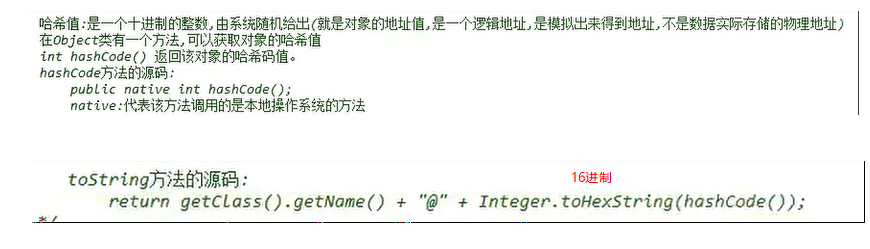

数据存储的常用结构有：栈、队列、数组、链表和红黑树。我们分别来了解一下：


## 栈  stack

### 介绍

* **栈**：**stack**,又称堆栈，它是运算受限的线性表，其限制是仅允许在标的一端进行插入和删除操作，不允许在其他任何位置进行添加、查找、删除等操作。

**特点**

* **先进后出（FILO, First In Last Out）**。例如，子弹压进弹夹，先压进去的子弹在下面，后压进去的子弹在上面，当开枪时，先弹出上面的子弹，然后才能弹出下面的子弹。

* 向栈中添加/删除数据时，只能从**栈顶**进行操作。。（记录位置也可以，如何实现）

  

* **压栈**：push，把元素**存储到栈的顶端位置**，栈中已有元素依次向栈底方向移动一个位置。
* **弹栈**：pop ，把栈的顶端位置元素取出并删除栈顶元素，栈中已有元素依次向栈顶方向移动一个位置。

- peek：返回栈顶元素。

### 实现

#### 顺序存储实现

**1. 数组实现的栈，能存储任意类型的数据**

由于堆栈的操作都在栈顶完成，因此在顺序栈的实现中需要附设一个指针 top 来动态的指示栈顶元素在数组中的位置。通常 top 可以用栈顶元素所在数组下标来表示， top= -1 时表示空栈。图 4-1 就可以看成是一个顺序栈。
堆栈在使用过程中所需的最大空间很难估计，因此，一般来说在构造堆栈时不应设定堆栈的最大容量。一种合理的做法和线性表的实现类似，先为堆栈分配一个基本容量，然后在实际的使用过程中，当堆栈的空间不够时再倍增存储空间，这个过程所需的时间均摊到每个数据元素时间为Θ (1)，不会影响操作实现的时间复杂度。

```java
/**
 * Java : 数组实现的栈，能存储任意类型的数据
 *
 * @author skywang
 * @date 2013/11/07
 */
import java.lang.reflect.Array;

public class GeneralArrayStack<T> {

    private static final int DEFAULT_SIZE = 12;
    private T[] mArray;
    private int count;

    public GeneralArrayStack(Class<T> type) {
        this(type, DEFAULT_SIZE);
    }

    public GeneralArrayStack(Class<T> type, int size) {
        // 不能直接使用mArray = new T[DEFAULT_SIZE];
        mArray = (T[]) Array.newInstance(type, size);
        count = 0;
    }

    // 将val添加到栈中
    public void push(T val) {
        mArray[count++] = val;
    }

    // 返回“栈顶元素值”
    public T peek() {
        return mArray[count-1];
    }

    // 返回“栈顶元素值”，并删除“栈顶元素”
    public T pop() {
        T ret = mArray[count-1];
        count--;
        return ret;
    }

    // 返回“栈”的大小
    public int size() {
        return count;
    }

    // 返回“栈”是否为空
    public boolean isEmpty() {
        return size()==0;
    }

    // 打印“栈”
    public void PrintArrayStack() {
        if (isEmpty()) {
            System.out.printf("stack is Empty\n");
        }

        System.out.printf("stack size()=%d\n", size());

        int i=size()-1;
        while (i>=0) {
            System.out.println(mArray[i]);
            i--;
        }
    }

    public static void main(String[] args) {
        String tmp;
        GeneralArrayStack<String> astack = new GeneralArrayStack<String>(String.class);

        // 将10, 20, 30 依次推入栈中
        astack.push("10");
        astack.push("20");
        astack.push("30");

        // 将“栈顶元素”赋值给tmp，并删除“栈顶元素”
        tmp = astack.pop();
        System.out.println("tmp="+tmp);

        // 只将“栈顶”赋值给tmp，不删除该元素.
        tmp = astack.peek();
        System.out.println("tmp="+tmp);

        astack.push("40");
        astack.PrintArrayStack();    // 打印栈
    }
}
```

**2. Java的 Collection集合 中自带的"栈"(stack)的示例 **

#### 链式存储实现

链栈即采用链表作为存储结构实现的栈。当采用单链表存储线性表后，根据单链表的操作特性选择单链表的头部作为栈顶，此时，入栈、出栈等操作可以在Ο (1)内完成。由于堆栈的操作只在线性表的一端进行，在这里使用带头结点的单链表或不带头结点的单链表都可以。使用带头结点的单链表时，结点的插入和删除都在头结点之后进行；使用不带头结点的单链表时，结点的插入和删除都在链表的首结点上进行。  

## 队列  queue

### 介绍

* **队列**：**queue**,简称队，它同堆栈一样，也是一种运算受限的线性表，其限制是仅允许在表的一端进行插入，而在表的另一端进行删除。

**特点**

* **先进先出**（即，存进去的元素，要在后它前面的元素依次取出后，才能取出该元素）。例如，小火车过山洞，车头先进去，车尾后进去；车头先出来，车尾后出来。
* 队列的入口、出口各占一侧。例如，下图中的左侧为入口，右侧为出口。


## 数组  Array

### 介绍

* **数组**:**Array**,是有序的元素序列，数组是在**内存中开辟一段连续**的空间，并在此空间存放元素。就像是一排出租屋，有100个房间，从001到100每个房间都有固定编号，通过编号就可以快速找到租房子的人。

**特点**

* 查找元素快：通过索引，可以快速访问指定位置的元素

  

* 增删元素慢

  * **指定索引位置增加元素**：需要创建一个新数组，将指定新元素存储在指定索引位置，再把原数组元素根据索引，复制到新数组对应索引的位置。如下图
  * **指定索引位置删除元素：**需要创建一个新数组，把原数组元素根据索引，复制到新数组对应索引的位置，原数组中指定索引位置元素不复制到新数组中。如下图


##  链表  Linked List

### 介绍

* **链表**:**linked list**,由一系列**结点node**（链表中每一个元素称为结点）组成，结点可以在运行时动态生成。每个结点包括两个部分：一个是存储数据元素的数据域，另一个是存储下一个结点地址的指针域。我们常说的链表结构有单向链表与双向链表，那么这里给大家介绍的是**单向链表**。
* **头节点**：在使用单链表实现线性表的时候，为了使程序更加简洁，我们通常在单链表的最前面添加一个哑元结点，也称为头结点。在头结点中不存储任何实质的数据对象，其 next 域指向线性表中 0 号元素所在的结点，头结点的引入可以使线性表运算中的一些边界条件更容易处理。
* 

**特点**

1. 多个结点之间，通过地址进行连接，内存空间不连续。


2. 查找元素慢：想查找某个元素，需要通过连接的节点，依次向后查找指定元素

3. 增删元素快：

* 增加元素：只需要修改连接下个元素的地址即可。

  

* 删除元素：只需要修改连接下个元素的地址即可。

  

## 树 **tree**

### 介绍

* **二叉树**：**binary tree** ,是每个结点不超过2的有序**树（tree）** 。

简单的理解，就是一种类似于我们生活中树的结构，只不过每个结点上都最多只能有两个子结点。

二叉树是每个节点最多有两个子树的树结构。顶上的叫根结点，两边被称作“左子树”和“右子树”。

如图：


我们要说的是二叉树的一种比较有意思的叫做**红黑树**，红黑树本身就是一颗二叉查找树，将节点插入后，该树仍然是一颗二叉查找树。也就意味着，树的键值仍然是有序的。

红黑树的约束:

1. 节点可以是红色的或者黑色的


2. 根节点是黑色的


3. 叶子节点(特指空节点)是黑色的
4. 每个红色节点的子节点都是黑色的
5. 任何一个节点到其每一个叶子节点的所有路径上黑色节点数相同

红黑树的特点:

​	速度特别快,趋近平衡树,查找叶子元素最少和最多次数不多于二倍

## 哈希表

在**JDK1.8**之前，哈希表底层采用数组+链表实现，即使用链表处理冲突，同一hash值的链表都存储在一个链表里。但是当位于一个桶中的元素较多，即hash值相等的元素较多时，通过key值依次查找的效率较低。而JDK1.8中，哈希表存储采用数组+链表+红黑树实现，当链表长度超过阈值（8）时，将链表转换为红黑树，这样大大减少了查找时间。

简单的来说，哈希表是由数组+链表+红黑树（JDK1.8增加了红黑树部分）实现的，如下图所示。

看到这张图就有人要问了，这个是怎么存储的呢？

为了方便大家的理解我们结合一个存储流程图来说明一下：


总而言之，**JDK1.8**引入红黑树大程度优化了HashMap的性能，那么对于我们来讲保证HashSet集合元素的唯一，其实就是根据对象的hashCode和equals方法来决定的。如果我们往集合中存放自定义的对象，那么保证其唯一，就必须复写hashCode和equals方法建立属于当前对象的比较方式。



## 跳跃表 skip list

[Skip List--跳表（全网最详细的跳表文章没有之一）---看这个](https://www.jianshu.com/p/9d8296562806)

> Redis 中的有序集合(zset) 支持的操作：
>
> 1. 插入一个元素
> 2. 删除一个元素
> 3. 查找一个元素
> 4. 有序输出所有元素
> 5. 按照范围区间查找元素（比如查找值在 [100, 356] 之间的数据）
>
> 其中，前四个操作红黑树也可以完成，且时间复杂度跟跳表是一样的。但是，按照区间来查找数据这个操作，红黑树的效率没有跳表高。按照区间查找数据时，跳表可以做到 O(logn) 的时间复杂度定位区间的起点，然后在原始链表中顺序往后遍历就可以了，非常高效。
>
> 作者：fanrui
>
> 链接：https://www.jianshu.com/p/9d8296562806
>
> 来源：简书
>
> 著作权归作者所有。商业转载请联系作者获得授权，非商业转载请注明出处。


[浅析SkipList跳跃表原理及代码实现](https://blog.csdn.net/ict2014/article/details/17394259) 

[跳表(SkipList)|会跳的链表真的非常diao](https://juejin.cn/post/6910476641990868999)

[Redis为什么用跳表而不用平衡树？](https://zhuanlan.zhihu.com/p/23370124)

# 优先队列

其实是用二叉树增删最大最小来实现的。

https://zhuanlan.zhihu.com/p/39615266