# [树](https://www.cnblogs.com/songwenjie/p/8878851.html)

## 树的定义

> 树（Tree）是n(n>=0)个结点的有限集。n=0时称为空树。
>
> 在任意一颗非空树中：
>
> (1)**有且仅有一个**特定的称为根（Root）的结点。
>
> (2)当n>1时，其余结点可分为m(m>0)个**互不相交的有限集**T1、T2、.....、Tm,其中每一个集合本身又是一棵树，并且称为根的子树（SubTree）。

下图就符合树的定义：

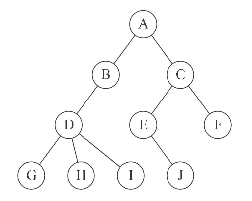

其中根结点A有两个子树：


需要注意的是虽然子树的个数没有限制，但是它们一定是互不交互的。下面的图明显不符合**互不交互**的原则，所以不是树。


## 树的结点

**树的结点包含一个数据元素及若干指向其子树的分支**。结点拥有的子树数称为结点的**度（Degree）**。**树的度是树内各结点度的最大值。**

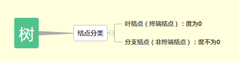


结点的层次从根开始定义起，根为第一层，根的孩子为第二层，以此类推。**树的深度（Depth）或高度是树中结点的最大层次。**


## 树的存储结构

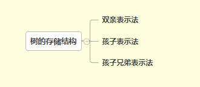

# 二叉树

## 二叉树的定义

又名二叉搜索树

> 二叉树（Binary Tree）是n(n>=0)个结点的有限集合，该集合或者为空集（空二叉树），或者由一个根结点和两棵互不相交的、分别称为根结点的左子树和右子树的二叉树组成（子树也为二叉树）。

## 二叉树的特点

- 每个结点最多有两棵子树，所以**二叉树中不存在度大于2的结点**。
- 左子树和右子树是有顺序的，次序不能任意颠倒。
- 即使树中某结点只有一棵子树，也要区分它是左子树还是右子树。

## 二叉树五种基本形态

1. 空二叉树
2. 只有一个根结点
3. 根结点只有左子树
4. 根结点只有右子树
5. 根结点既有左子树又有右子树

## 几种特殊的二叉树

### **斜树**

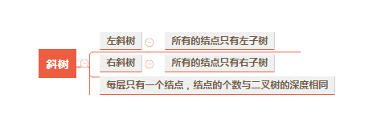

​																																	左斜树：右斜树：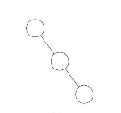

### **满二叉树**

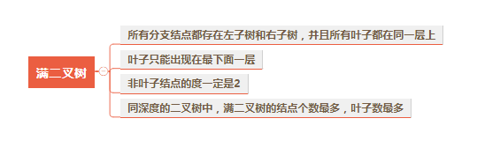

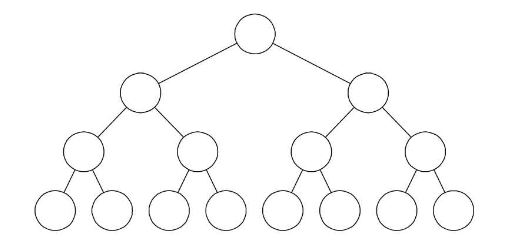

### **完全二叉树**

是特殊的平衡二叉树


用一张图对比下“完全二叉树”和“满二叉树”：


### **平衡二叉树 **

特殊的二叉树

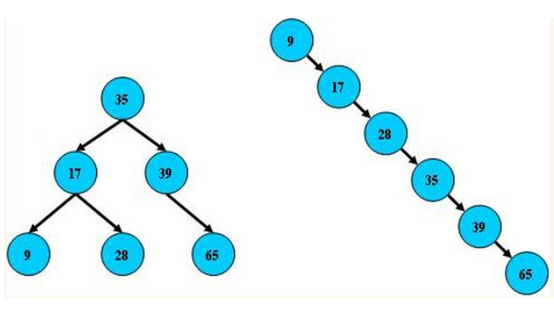

 平衡树的层级结构：因为平衡二叉树查询性能和树的层级（h高度）成反比，h值越小查询越快、为了保证树的结构左右两端数据大致平衡降低二叉树的查询难度一般会采用一种算法机制实现节点数据结构的平衡，实现了这种算法的有比如[Treap](https://link.zhihu.com/?target=http%3A//baike.baidu.com/item/Treap)、红黑树，使用平衡二叉树能保证数据的左右两边的节点层级相差不会大于1.，通过这样避免树形结构由于删除增加变成线性链表影响查询效率，保证数据平衡的情况下查找数据的速度近于二分法查找； 

> ​	总结平衡二叉树特点：
>
> （1）非叶子节点最多拥有两个子节点；
>
> （2）非叶子节值大于左边子节点、小于右边子节点；
>
> （3）树的左右两边的层级数相差不会大于1;
>
> （4）没有值相等重复的节点;

也就是说，树的两个左子树的高度差别不会太大。

那我们接着看前面的极端情况的二叉排序树，现在用它来构造一棵平衡二叉树。

以 12 为根节点，当添加 24 为它的右子树后，根节点的左右子树高度差为 1，这时还算平衡，这时再添加一个元素 28：


这时根节点 12 觉得不平衡了，我左孩子一个都没有，右边都有俩了，超过了之前说的最大为 1，不行，给我调整！

于是我们就需要调整当前的树结构，让它进行旋转。

因为最后一个节点加到了右子树的右子树，就要想办法给右子树的左子树加点料，因此需要逆时针旋转，将 24 变成根节点，12 右旋成 24 的左子树，就变成了这样（有点丑哈哈）：

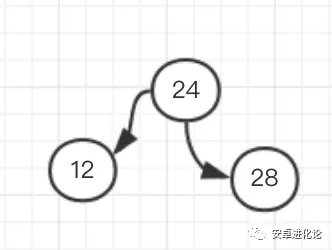

这时又恢复了平衡，再添加 37 到 28 的右子树，还算平衡：

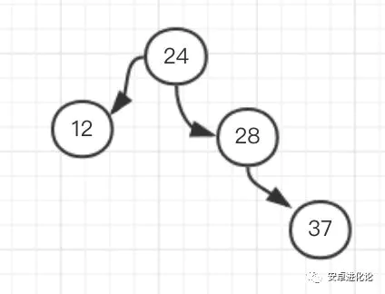

这时如果再添加一个 30，它就需要在 37 的左子树：

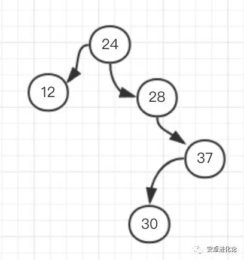

这时我们可以看到这个树又不平衡了，以 24 为根节点的树，明显右边太重，左边太稀，想要保持平衡就 24 得让位给 28，然后变成这样：


丑了点，但的确保持了平衡。

依次类推，平衡二叉树在添加和删除时需要进行旋转保持整个树的平衡，内部做了这么复杂的工作后，我们在使用它时，插入、查找的时间复杂度都是 O(logn)，性能已经相当好了。


## 二叉树的性质

> 性质1：在二叉树的第i层上**至多**有2i-1个结点（i>=1）
>
> 性质2：深度为k的二叉树**至多**有2k-1个结点（k>=1）
>
> 性质3：对任何一棵二叉树T，如果其终端结点数为n0,度为2的结点数为n2，则n0 = n2+1。
>
> > 一棵二叉树，除了终端结点（叶子结点），就是度为1或2的结点。假设n1度为1的结点数，则数T 的结点总数n=n0+n1+n2。我们再换个角度，看一下树T的连接线数，由于根结点只有分支出去，没有分支进入，所以连接线数为结点总数减去1。也就是n-1=n1+2n2，可推导出n0+n1+n2-1 = n1+2n2，继续推导可得n0 = n2+1。
> >
>
> 性质4：具有n个结点的完全二叉树的深度为[log2n ] + 1([X]表示不大于X的最大整数)。
>
> > 由性质2可知，满二叉树的结点个数为2k-1，可以推导出满二叉树的深度为k=log2(n + 1)。对于完全二叉树，它的叶子结点只会出现在最下面的两层，所以它的结点数一定少于等于同样深度的满二叉树的结点数2k-1，但是一定多于2k-1 -1。因为n是整数，所以2k-1 <= n < 2k，不等式两边取对数得到：k-1 <= log2n <k。因为k作为深度也是整数，因此 k= [log2n ]+ 1。
> >
>
> 性质5：如果对一颗有n个结点的完全二叉树（其深度为[log2n ] + 1）的结点按层序编号（从第1层到第[log2n ] + 1层，每层从左到右），对任一结点i(1<=i<=n)有：
>
> > 1. 如果i=1，则结点i是二叉树的根，无双亲；如果i>1，则其双亲是结点[i/2]。
> > 2. 如果2i>n,则结点i无左孩子（结点i为叶子结点）；否则其左孩子是结点i。
> > 3. 如果2i+1>n,则结点i无右孩子；否则其右孩子是结点2i+1。

结合下图很好理解：

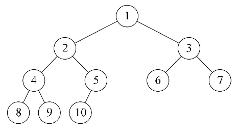

## 二叉树的存储结构


^代表不存在的结点。

对于右斜树，顺序存储结构浪费存储空间：

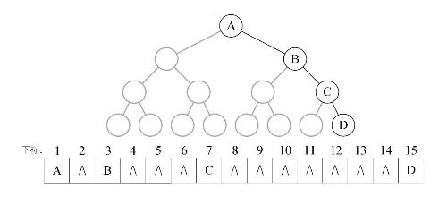

二叉树的顺序存储结构缺点很明显：不能反应逻辑关系；对于特殊的二叉树（左斜树、右斜树），浪费存储空间。**所以二叉树顺序存储结构一般只用于完全二叉树。**

**二叉链表**

**链表每个结点包含一个数据域和两个指针域：**


其中data是数据域，lchild和rchild都是指针域，分别指向左孩子和右孩子。

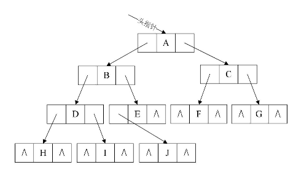

**二叉树的二叉链表结点结构定义:**

```
/*二叉树的二叉链表结点结构定义*/
typedef struct BiNode
{
    char data;      /*结点数据*/
    struct BiNode *lchild, *rchild;     /*左右孩子指针*/
}BiNode,*BiTree;
```

参考：《大话数据结构》

# [二叉树遍历](https://www.cnblogs.com/songwenjie/p/8955856.html)

## 二叉树遍历原理

> 二叉树的遍历是指从根结点出发，按照某种次序依次访问二叉树中所有结点，使得每个结点被访问一次且仅被访问一次。

为什么研究二叉树的遍历？

因为计算机只会处理线性序列，而我们研究遍历，就是把树中的结点变成某种意义的线性序列，这给程序的实现带来了好处。

## 二叉树的创建

遍历二叉树之前，首先我们要有一个二叉树。要创建一个如下图的二叉树，就要先进行二叉树的扩展，也就是将二叉树每个结点的空指针引出一个虚结点，其值为一个特定值，比如'#'。处理后的二叉树称为原二叉树的扩展二叉树。扩展二叉树的每个遍历序列可以确定一个一颗二叉树，我们采用前序遍历创建二叉树。前序遍历序列：124##5##36##7##。


**定义二叉链表结点**:

```java
/// <summary>
/// 二叉链表结点类
/// </summary>
/// <typeparam name="T"></typeparam>
public class TreeNode<T>
{
    /// <summary>
    /// 数据域
    /// </summary>
    public T Data { get; set; }
    /// <summary>
    /// 左孩子   
    /// </summary>
    public TreeNode<T> LChild { get; set; } 
    /// <summary>
    /// 右孩子
    /// </summary>
    public TreeNode<T> RChild { get; set; } 

    public TreeNode(T val, TreeNode<T> lp, TreeNode<T> rp)
    {
        Data = val;
        LChild = lp;
        RChild = rp;
    }

    public TreeNode(TreeNode<T> lp, TreeNode<T> rp)
    {
        Data = default(T);
        LChild = lp;
        RChild = rp;
    }

    public TreeNode(T val)
    {
        Data = val;
        LChild = null;
        RChild = null;
    }

    public TreeNode()
    {
        Data = default(T);
        LChild = null;
        RChild = null;
    }
}
```

**先序递归创建二叉树:**

```java
/// <summary>
/// 先序创建二叉树
/// </summary>
/// <param name="node"></param>
public static void CreateTree(TreeNode<char> node)
{
    node.Data = Console.ReadKey().KeyChar;

    if (node.Data == '#')
    {
        return;
    }

    node.LChild = new TreeNode<char>();

    CreateTree(node.LChild);

    if (node.LChild.Data == '#')
    {
        node.LChild = null;
    }

    node.RChild = new TreeNode<char>();

    CreateTree(node.RChild);

    if (node.RChild.Data == '#')
    {
        node.RChild = null;
    }
}
```

## 二叉树遍历

	


### 前序遍历


#### 递归方式实现前序遍历

> 具体过程：
>
> 1. 先访问根节点
> 2. 再序遍历左子树
> 3. 最后序遍历右子树

**代码实现：**

```java
public static void PreOrderRecur(TreeNode<char> treeNode)
 {
     if (treeNode == null)
     {
         return;
     }
     Console.Write(treeNode.Data); 
     PreOrderRecur(treeNode.LChild);
     PreOrderRecur(treeNode.RChild);
 }
```

#### 非递归方式实现前序遍历

> 具体过程：
>
> 1. 首先申请一个新的栈，记为stack；
> 2. 将头结点head压入stack中；
> 3. 每次从stack中弹出栈顶节点，记为cur，然后打印cur值，如果cur右孩子不为空，则将右孩子压入栈中；如果cur的左孩子不为空，将其压入stack中；
> 4. 重复步骤3，直到stack为空.

**代码实现：**

```java
 public static void PreOrder(TreeNode<char> head)
{
    if (head == null)
    {
        return;
    }
    Stack<TreeNode<char>> stack = new Stack<TreeNode<char>>();
    stack.Push(head);
    while (!(stack.Count == 0))
    {
        TreeNode<char> cur = stack.Pop();
        Console.Write(cur.Data);

        if (cur.RChild != null)
        {
            stack.Push(cur.RChild);
        }
        if (cur.LChild != null)
        {
            stack.Push(cur.LChild);
        }
    }
}
```

**过程模拟：**


**执行结果：**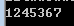

### 中序遍历

#### 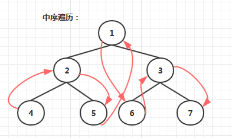

#### 递归方式实现中序遍历

> 具体过程：
>
> 1. 先中序遍历左子树
> 2. 再访问根节点
> 3. 最后中序遍历右子树

**代码实现：**

```java
public static void InOrderRecur(TreeNode<char> treeNode)
{
    if (treeNode == null)
    {
        return;
    }  
    InOrderRecur(treeNode.LChild);
    Console.Write(treeNode.Data); 
    InOrderRecur(treeNode.RChild);
}
```

#### 非递归方式实现中序遍历

> 具体过程：
>
> 1. 申请一个新栈，记为stack，申请一个变量cur，初始时令cur为头节点；
> 2. 先把cur节点压入栈中，对以cur节点为头的整棵子树来说，依次把整棵树的左子树压入栈中，即不断令cur=cur.left，然后重复步骤2；
> 3. 不断重复步骤2，直到发现cur为空，此时从stack中弹出一个节点记为node，打印node的值，并让cur = node.right，然后继续重复步骤2；
> 4. 当stack为空并且cur为空时结束。

**代码实现：**

```
public static void InOrder(TreeNode<char> treeNode)
{
    if (treeNode == null)
    {
        return;
    }
    Stack<TreeNode<char>> stack = new Stack<TreeNode<char>>();

    TreeNode<char> cur = treeNode;

    while (!(stack.Count == 0) || cur != null)
    {
        while (cur != null)
        {
            stack.Push(cur);
            cur = cur.LChild;
        }
        TreeNode<char> node = stack.Pop();
        Console.WriteLine(node.Data);
        cur = node.RChild;
    }
}
```

**过程模拟：**


**执行结果：**

### 后序遍历


#### 递归方式实现后序遍历

> 1. 先后序遍历左子树
> 2. 再后序遍历右子树
> 3. 最后访问根节点

**代码实现：**

```
public static void PosOrderRecur(TreeNode<char> treeNode)
{
    if (treeNode == null)
    {
        return;
    }
    PosOrderRecur(treeNode.LChild);
    PosOrderRecur(treeNode.RChild);
    Console.Write(treeNode.Data); 
}
```

#### 非递归方式实现后序遍历一

> 具体过程：
>
> 使用两个栈实现
>
> 1. 申请两个栈stack1，stack2，然后将头结点压入stack1中；
> 2. 从stack1中弹出的节点记为cur，然后先把cur的左孩子压入stack1中，再把cur的右孩子压入stack1中；
> 3. 在整个过程中，每一个从stack1中弹出的节点都放在第二个栈stack2中；
> 4. 不断重复步骤2和步骤3，直到stack1为空，过程停止；
> 5. 从stack2中依次弹出节点并打印，打印的顺序就是后序遍历的顺序；

**代码实现：**

```
public static void PosOrderOne(TreeNode<char> treeNode)
{
    if (treeNode == null)
    {
        return;
    }

    Stack<TreeNode<char>> stack1 = new Stack<TreeNode<char>>();
    Stack<TreeNode<char>> stack2 = new Stack<TreeNode<char>>();

    stack1.Push(treeNode);
    TreeNode<char> cur = treeNode;

    while (!(stack1.Count == 0))
    {
        cur = stack1.Pop();
        if (cur.LChild != null)
        {
            stack1.Push(cur.LChild);
        }
        if (cur.RChild != null)
        {
            stack1.Push(cur.RChild);
        }
        stack2.Push(cur);
    }

    while (!(stack2.Count == 0))
    {
        TreeNode<char> node = stack2.Pop();
        Console.WriteLine(node.Data); ;
    }
}
```

**过程模拟：**


**执行结果：**

#### 非递归方式实现后序遍历二

> 具体过程：
>
> 使用一个栈实现
>
> 1. 申请一个栈stack，将头节点压入stack，同时设置两个变量 h 和 c，在整个流程中，h代表最近一次弹出并打印的节点，c代表当前stack的栈顶节点，初始时令h为头节点，，c为null；
> 2. 每次令c等于当前stack的栈顶节点，但是不从stack中弹出节点，此时分一下三种情况：
>
> (1)如果c的左孩子不为空，并且h不等于c的左孩子，也不等于c的右孩子，则吧c的左孩子压入stack中
>
> (2)如果情况1不成立，并且c的右孩子不为空，并且h不等于c的右孩子，则把c的右孩子压入stack中；
>
> (3)如果情况1和2不成立，则从stack中弹出c并打印，然后令h等于c；
>
> 1. 一直重复步骤2，直到stack为空.

**代码实现：**

```
public static void PosOrderTwo(TreeNode<char> treeNode)
{
    if (treeNode == null)
    {
        return;
    }

    Stack<TreeNode<char>> stack = new Stack<TreeNode<char>>();
    stack.Push(treeNode);

    TreeNode<char> h = treeNode;
    TreeNode<char> c = null;
    while (!(stack.Count == 0))
    {
        c = stack.Peek();
        //c结点有左孩子 并且 左孩子没被遍历（输出）过 并且 右孩子没被遍历过
        if (c.LChild != null && h != c.LChild && h != c.RChild)
            stack.Push(c.LChild);
        //c结点有右孩子 并且 右孩子没被遍历（输出）过
        else if (c.RChild != null && h != c.RChild)
            stack.Push(c.RChild);
        //c结点没有孩子结点 或者孩子结点已经被遍历（输出）过
        else
        {
            TreeNode<char> node = stack.Pop();
            Console.WriteLine(node.Data);
            h = c;
        }
    }
}

```

**过程模拟：**


**执行结果：**

### 层序遍历


> 具体过程：
>
> 1. 首先申请一个新的队列，记为queue；
> 2. 将头结点head压入queue中；
> 3. 每次从queue中出队，记为node，然后打印node值，如果node左孩子不为空，则将左孩子入队；如果node的右孩子不为空，则将右孩子入队；
> 4. 重复步骤3，直到queue为空。

**代码实现：**

```
public static void LevelOrder(TreeNode<char> treeNode)
{
    if(treeNode == null)
    {
         return;
    }
    Queue<TreeNode<char>> queue = new Queue<TreeNode<char>>();
    queue.Enqueue(treeNode);

    while (queue.Any())
    {
        TreeNode<char> node = queue.Dequeue();
        Console.Write(node.Data);

        if (node.Left != null)
        {
            queue.Enqueue(node.Left);
        }

        if (node.Right != null)
        {
            queue.Enqueue(node.Right);
        }
    }
}

```

**执行结果：**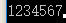

参考：《大话数据结构》

# **B树(B-tree)**

注意：之前有看到有很多文章把B树和B-tree理解成了两种不同类别的树，其实这两个是同一种树；

**普通平衡多路查找树**

### **概念：**

B树和平衡二叉树稍有不同的是B树属于多叉树又名平衡多路查找树（查找路径不只两个），数据库索引技术里大量使用者B树和B+树的数据结构，让我们来看看他有什么特点;

### **规则：**

（1）排序方式：所有节点关键字是按递增次序排列，并遵循左小右大原则；

（2）子节点数：（这里是箭头的末端），非叶节点的子节点数>1，且<=M ，且M>=2，空树除外（注：M阶代表一个树节点最多有多少个查找路径，M=M路,当M=2则是2叉树,M=3则是3叉）；

（3）关键字数：（这里是英文字母），节点的关键字数量大于等于ceil(m/2)-1个且小于等于M-1（保证最小和最大关键字数）个（注：ceil()是个朝正无穷方向取整的函数 如ceil(1.1)结果为2);

（4）**所有叶子节点均在同一层、叶子节点除了包含了关键字和关键字记录的指针外也有指向其子节点的指针,只不过其指针地址都为null对应下图最后一层节点的空格子;**

最后我们用一个图和一个实际的例子来理解B树（这里为了理解方便我就直接用实际字母的大小来排列C>B>A）


### **B树的查询流程：**


如上图我要从上图中找到E字母，查找流程如下

（1）获取根节 点的关键字进行比较，当前根节点关键字为M，E<M（26个字母顺序），所以往左找到指向左边的子节点（二分法规则，左小右大，左边放小于当前节点值的子节点、右边放大于当前节点值的子节点）；

（2）拿到关键字D和G，D<E<G 所以直接找到D和G中间的节点；

（3）拿到E和F，因为E=E 所以直接返回关键字和指针信息（如果树结构里面没有包含所要查找的节点则返回null）；


### **B树的插入节点流程**

定义一个5阶树（平衡5路查找树），现在我们要把3、8、31、11、23、29、50、28 这些数字构建出一个5阶树出来;

遵循规则：

（1）节点拆分规则：当前是要组成一个5路查找树，那么此时m=5,关键字数必须<=5-1（这里关键字数>4就要进行节点拆分）；

（2）排序规则：满足节点本身比左边节点大，比右边节点小的排序规则;


先插入 3、8、31、11


再插入23、29


再插入50、28


### **B树节点的删除**

**规则：**

（1）节点合并规则：当前是要组成一个5路查找树，那么此时m=5,关键字数必须大于等于ceil（5/2）（这里关键字数<2就要进行节点合并）；

（2）满足节点本身比左边节点大，比右边节点小的排序规则;

（3）关键字数小于二时先从子节点取，子节点没有符合条件时就向向父节点取，取中间值往父节点放；


**特点：**

B树相对于平衡二叉树的不同是，每个节点包含的关键字增多了，特别是在B树应用到数据库中的时候，数据库充分利用了磁盘块的原理（磁盘数据存储是采用块的形式存储的，每个块的大小为4K，每次IO进行数据读取时，同一个磁盘块的数据可以一次性读取出来）把节点大小限制和充分使用在磁盘快大小范围；把树的节点关键字增多后树的层级比原来的二叉树少了，减少数据查找的次数和复杂度;

------

# B+树

**优化了具体记录位置的b树**

- **概念**

B+树是B树的一个升级版，相对于B树来说B+树更充分的利用了节点的空间，让查询速度更加稳定，其速度完全接近于二分法查找。为什么说B+树查找的效率要比B树更高、更稳定；我们先看看两者的区别

- **B+跟B树不同**

（1）B+树的**非叶子节点不保存关键字记录的指针，只进行数据索引**，这样使得B+树每个**非叶子**节点所能保存的关键字大大增加；

（2）B+树**叶子节点保存了父节点的所有关键字记录的指针，所有数据地址必须要到叶子节点才能获取到。所以每次数据查询的次数都一样**；

（3）B+树叶子节点的关键字从小到大有序排列，**左边结尾数据都会保存右边节点开始数据的指针**（紫色的空格箭头）。

（4）非叶子节点的子节点数=关键字数（来源百度百科）（根据各种资料 这里有两种算法的实现方式，另一种为非叶节点的关键字数=子节点数-1（来源维基百科)，虽然他们数据排列结构不一样，但其原理还是一样的Mysql 的B+树是用第一种方式实现）;

mysql层数不一定是三层，从1层开始，也就是没有非叶子节点，只有一个页。


**（百度百科算法结构示意图）**非叶子节点的子节点数=关键字数


**（维基百科算法结构示意图）**非叶节点的关键字数=子节点数-1


- **特点**


1、B+**树的层级更少**：相较于B树B+每个**非叶子**节点存储的关键字数更多，树的层级更少所以查询数据更快；

2、B+**树查询速度更稳定**：B+所有关键字数据地址都存在**叶子**节点上，所以每次查找的次数都相同所以查询速度要比B树更稳定;

3、B+**树天然具备排序功能：**B+树所有的**叶子**节点数据构成了一个有序链表，在查询大小区间的数据时候更方便，数据紧密性很高，缓存的命中率也会比B树高。

4、B+**树全节点遍历更快：**B+树遍历整棵树只需要遍历所有的**叶子**节点即可，，而不需要像B树一样需要对每一层进行遍历，这有利于数据库做全表扫描。

**B树**相对于**B+树**的优点是，如果经常访问的数据离根节点很近（数据量比较少），而**B树**的**非叶子**节点本身存有关键字其数据的地址，所以这种数据检索的时候会要比**B+树**快。

------

# B\*树

**优化了分裂的b+树**

- **规则**


B*树是B+树的变种，相对于B+树他们的不同之处如下：

（1）首先是关键字个数限制问题，B+树初始化的关键字初始化个数是cei(m/2)，b*树的初始化个数为（cei(2/3*m)）

（2）B+树节点满时就会分裂，而B*树节点满时会检查兄弟节点是否满（因为每个节点都有指向兄弟的指针），如果兄弟节点未满则向兄弟节点转移关键字，如果兄弟节点已满，则从当前节点和兄弟节点各拿出1/3的数据创建一个新的节点出来；


- **特点**

在B+树的基础上因其初始化的容量变大，使得节点空间使用率更高，而又存有兄弟节点的指针，可以向兄弟节点转移关键字的特性使得B*树额分解次数变得更少；


# 总结


**1、相同思想和策略**

从平衡二叉树、B树、B+树、B*树总体来看它们的贯彻的思想是相同的，都是采用二分法和数据平衡策略来提升查找数据的速度；


**2、不同的方式的磁盘空间利用**


不同点是他们一个一个在演变的过程中，通过IO从磁盘读取数据的原理进行一步步的演变，每一次演变都是为了让节点的空间更合理的运用起来，从而使树的层级减少达到快速查找数据的目的；


如果还没理解的话推荐以下资料描叙的很详细：

补充概念：

附（二分法查找）：[二分法查找原理 - 知乎专栏](https://zhuanlan.zhihu.com/p/27597160)

附（B、B+、B*树）：[从B树、B+树、B*树谈到R 树](https://link.zhihu.com/?target=http%3A//blog.csdn.net/v_JULY_v/article/details/6530142/)

附（B、B+、B*树）：[end's coding life](https://link.zhihu.com/?target=http%3A//blog.csdn.net/endlu/article/details/51720299)

附：[B树和B+树的插入、删除图文详解 - nullzx - 博客园](https://link.zhihu.com/?target=https%3A//www.cnblogs.com/nullzx/p/8729425.html)

​	[B树和B+树的插入、删除图文详解](https://www.cnblogs.com/nullzx/p/8729425.html)

# 参考文献

[平衡二叉树、B树、B+树、B*树 理解其中一种你就都明白了](https://zhuanlan.zhihu.com/p/27700617)


