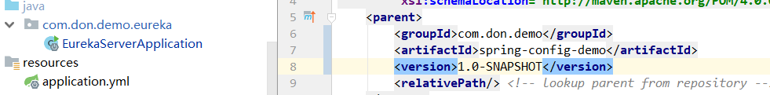

1. 根Package name 应该和groupID一样，以下再细分

2. 先画流程图然后再写代码，不要对着代码想流程图。
3. 先搞定业务算法流程，然后抽象，然后写具体行为
4. 读源码先从包名开始读起
5. 代码尽量无状态，不要全局变量，全局变量也是只读而不是修改，可以多线程启动，尽量不要设置为单体程序
6. 需要写的代码剥离出去，给其他模块的接口的实现类写，然后通过manager统一管理，依次调用

# 代码心得

1. 加锁一定要在try里面，这样才能保证finally块可以解锁
2. 根据生命周期划分功能模块，遵循开闭原则，想好各个生命周期之间的关系，以类替代方法。
3. 时间不对，查看电脑的时间是否同步好，mysql和java的时间毫秒是否处理好，代码的先后顺序，