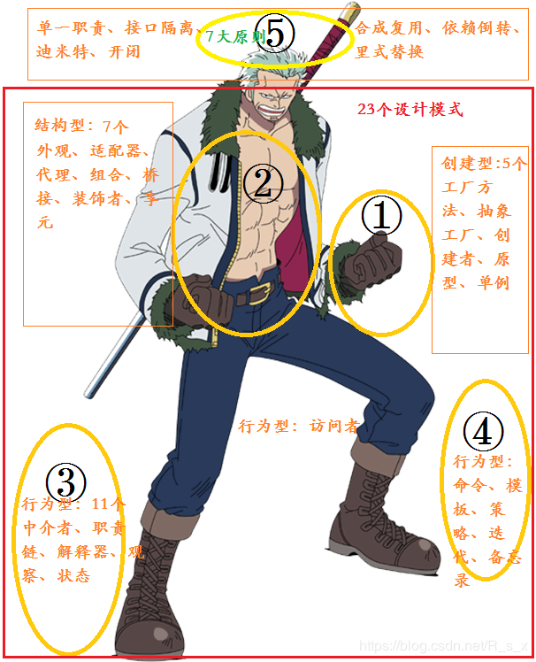

# [设计模式](https://blog.csdn.net/R_s_x/article/details/100533332)

https://www.runoob.com/design-pattern/design-pattern-intro.html#:~:text=%E8%AE%BE%E8%AE%A1%E6%A8%A1%E5%BC%8F%E6%98%AF%E8%BD%AF%E4%BB%B6%E5%BC%80%E5%8F%91,%E7%90%86%E8%A7%A3%E3%80%81%E4%BF%9D%E8%AF%81%E4%BB%A3%E7%A0%81%E5%8F%AF%E9%9D%A0%E6%80%A7%E3%80%82

按照每个模式的特点通常会将其分为3大类：

**创建型**： 抽象工厂、工厂方法、建造者、原型、单例
**结构型**： 外观、适配器、代理、组合、享元、桥接、装饰器
**行为型**： 中介者、职责链、解释器、观察、状态、命令、模板方法、策略、迭代器、备忘录、访问者

- **七大原则**

原则： 开闭原则、接口隔离原则、迪米特原则、单一职责、合成复用、依赖倒转、里式替换


**内化法和图表法**

首先要通过一个具体的事物作为基础，在此基础上展开遐想，这次我们以烟男为原型，使用大脑、手、脚与我们的设计模式进行关联和映射。

 


- **故事一（创建型）**

  此处是指挥的动作，用①处的手来表示。

  **工厂方法**让**抽象工厂**使用**原型**创建出一个**单例**来。

- **故事二（结构型）**

  此处为结构型，用烟男有型的上身（②）表示。

  烟男的六块腹肌是男士们都想要的外观，同样还有时尚和合适的衣服适配他，他的衣服上有一组（组合）口袋（代理），还有非常低调的腰带（桥接）来装饰。最后还有其聚集力量的元气、丹田（享元）处。

- **故事三（行为型）**
  此处行为用脚（③④）来表示。

  XX要租房子，所以找到中介者表示要租房，中介通过链式的一条线（职责链）同事找到卖家，再找到房东，将XX带到小区展示房源，向租客解释房子的基本信息和周边情况。房子租好之后，房东每两个月都会回来观察房子的状态。

  XX开始入住新房之后第一件事就是召集小伙伴开始打扫卫生，XX命令小伙伴们使用不同的模板，对不同情况使用不同的策略打扫不同的房间，尤其是厨房的抽油烟机处要反复迭代的打扫干净，XX将大家的值日情况用备忘录记录下来。
  一切准备就绪之后就要开新房宴了，准备好饭菜迎接访问。

- **故事四（原则）**
  原则可以称之为思想，大脑是管理思维的地方，我们将大脑（⑤）分为左脑和右脑，负责简单和复杂。
  分为：单一、开闭、接口隔离、迪米特与合成复用、依赖倒转、里式替换


————————————————
版权声明：本文为CSDN博主「不专业得Cook」的原创文章，遵循 CC 4.0 BY-SA 版权协议，转载请附上原文出处链接及本声明。
原文链接：https://blog.csdn.net/R_s_x/article/details/100533332

# 职责链模式

https://www.runoob.com/design-pattern/chain-of-responsibility-pattern.html

org.springframework.aop.framework.ReflectiveMethodInvocation#proceed

有2种用法：

一种是类似于菜鸟那样剥离出前中后方法，把next置于对象field种，不断next就可以。

另一种是把next放在方法参数中，filter都采用这种。需要一个工具类来做中间层，更第几个节点，并且维系一个数字，现在排第几个节点。

> 可以像fitler那样使用一个变化的field来查找下一个，每次传入this就行，对象少。

```java
tool 
Object interceptorOrInterceptionAdvice =
				this.interceptorsAndDynamicMethodMatchers.get(++this.currentInterceptorIndex);
((MethodInterceptor) interceptorOrInterceptionAdvice).invoke(this);
```

> 也可以为每个节点提供一个工具类，这样每次调用就不用新建一个工具类。避免每次新建对象，可以提前构造工具类集合，里面就是包含一个数字指明第几个节点。

```java
privcate tool[] tools;
private int no;
Object interceptorOrInterceptionAdvice =
				this.interceptorsAndDynamicMethodMatchers.get(no);
((MethodInterceptor) interceptorOrInterceptionAdvice).invoke(tool[no+1]);
```

> 都是用工具类包裹分配节点，只是前者一个工具类内部维护节点offset变化，后者直接更换下一个工具类。

# 装饰器模式

[重点解释](https://blog.csdn.net/xu__cg/article/details/53024490)

[次要解释](https://blog.csdn.net/zhaoyanjun6/article/details/56488020)

# 策略模式

https://github.com/coderbruis/JavaSourceCodeLearning/blob/master/note/Spring/%E4%BB%8ESpring%E6%BA%90%E7%A0%81%E4%B8%AD%E5%AD%A6%E4%B9%A0%E2%80%94%E2%80%94%E7%AD%96%E7%95%A5%E6%A8%A1%E5%BC%8F.md