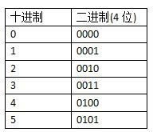
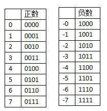
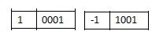
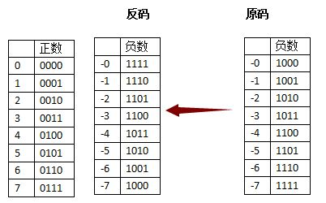
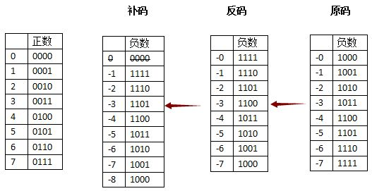
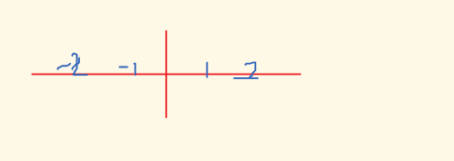

# 原码、反码、补码的产生

作者：插画-李俊达

链接：https://www.zhihu.com/question/20159860/answer/71256667

来源：知乎

著作权归作者所有。商业转载请联系作者获得授权，非商业转载请注明出处。

 

我尝试硬生生的把它们串起来哈 ，结合疯狂Java讲义看

## 介绍

### 正数

数字在自然界中抽象出来的时候，一棵树，两只猪，是没有正数和负数的概念的

计算机保存最原始的数字，也是没有正和负的数字，叫没符号数字

如果我们在内存分配4位（bit）去存放无符号数字，是下面这样子的



后来在生活中为了表示“欠别人钱”这个概念，就从无符号数中，划分出了“正数”和“负数”

正如上帝一挥手，从混沌中划分了“白天”与“黑夜”

 

### 原码

为了表示正与负，**人们发明了"原码"，把生活应该有的正负概念，原原本本的表示出来**

把左边第一位腾出位置，存放符号，正用0来表示，负用1来表示



但使用“原码”储存的方式，方便了看的人类，却苦了计算机



我们希望 （+1）和（-1）相加是0，但计算机只能算出0001+1001=1010 (-2)

这不是我们想要的结果 (╯' - ')╯︵ ┻━┻

另外一个问题，这里有一个（+0）和（-0）

 

### 反码

**为了解决“正负相加等于0”的问题，在“原码”的基础上，人们发明了“反码”**

“反码”表示方式是用来处理负数的，符号位置不变，其余位置相反



当“原码”变成“反码”时，完美的解决了“正负相加等于0”的问题

过去的（+1）和（-1）相加，变成了0001+1110=1111，刚好反码表示方式中，1111象征-0

人们总是进益求精，历史遗留下来的问题—— 有两个零存在，+0 和 -0

 

### **补码**

**我们希望只有一个0，所以发明了"补码"**，同样是针对"负数"做处理的

"补码"的意思是，从原来"反码"的基础上，补充一个新的代码，（+1）

我们的目标是，没有蛀牙（-0）



有得必有失，在补一位1的时候，要丢掉最高位

我们要处理"反码"中的"-0",当1111再补上一个1之后，变成了10000，丢掉最高位就是0000，刚好和左边正数的0，完美融合掉了

这样就解决了+0和-0同时存在的问题

另外"正负数相加等于0"的问题，同样得到满足

举例，3和（-3）相加，0011 + 1101 =10000，丢掉最高位，就是0000（0）

同样有失必有得，我们失去了(-0) , 收获了（-8）

以上就是"补码"的存在方式

**结论：保存正负数，不断改进方案后，选择了最好的"补码"方案**	

### 总结

**原码**：方便人脑

**反码**：方便计算机计算，5和-12相加可以看成12 和-12 相加，然后得到的数都是1111，再减去7，得到相应的负数，其他类似。反码就是负数从最小开始表示，符号位为1。已经不对称了，应该是重复。

**补码**：反码加1，把1111变成10000，结果非负数，去掉最高位，5+（-4）=0000+1=0001，结果负数，继续减，得到对称的。



考虑16位有符号整数时，-32768只有补码[1000000000000000],没有原码，只是硬性规定补码[1000000000000000]表示

 

来自 <https://blog.csdn.net/nodeathphoenix/article/details/5883260> 

java中：int32位，无符号右移32位>>>32，是原来的数。

# 移位运算

##  左移运算符<<

左移运算符<<使指定值的所有位都左移指定的次数。

1）通用格式
value << num
num 指定要移位值value 移动的位数。
左移的规则只记住一点：丢弃最高位，0补最低位
如果移动的位数超过了该类型的最大位数，那么编译器会对移动的位数取模。如对int型移动33位，实际上只移动了33%32=1位。

2）运算规则
按二进制形式把所有的数字向左移动对应的位数，高位移出(舍弃)，低位的空位补零。
当左移的运算数是int 类型时，每移动1位它的第31位就要被移出并且丢弃；
当左移的运算数是long 类型时，每移动1位它的第63位就要被移出并且丢弃。
当左移的运算数是byte 和short类型时，将自动把这些类型扩大为 int 型。

3）数学意义
左移一位相当于乘以2，左移n位相当于乘以2的n次方。（没有丢弃有效位的情况下，正数丢弃的都是0，负数丢弃的都是1）

## 右移运算符>>

右移运算符<<使指定值的所有位都右移指定的次数。

1）通用格式
value >> num
num 指定要移位值value 移动的位数。
右移的规则只记住一点：符号位不变，左边补上符号位

2）运算规则
按二进制形式把所有的数字向右移动对应的位数，低位移出(舍弃)，高位的空位补符号位，即正数补零，负数补1
当右移的运算数是byte 和short类型时，将自动把这些类型扩大为 int 型。
例如，如果要移走的值为负数，每一次右移都在左边补1，如果要移走的值为正数，每一次右移都在左边补0，这叫做符号位扩展（保留符号位）（sign extension ），在进行右移
操作时用来保持负数的符号。

3）数学意义
右移一位相当于除2，右移n位相当于除以2的n次方。小数结果取整加1（3右移一位得2）

## 无符号右移>>>

1) 通用格式
value >>> num
num 指定要移位值value 移动的位数。

2) 运算规则
无符号右移的规则只记住一点：忽略了符号位扩展，0补最高位
无符号右移运算符>>> 只是对32位和64位的值有意义

对于正数移位来说等同于：>>，负数通过此移位运算符能移位成正数。

## 中间位

1~N：中间位是（int）（N+1）/2

​		奇：（N+1）/ 2 ；7～4

​		偶：N/2；8～4，5（取左）

 

0～N：奇：N/ 2 ；7～3，4（取左）

​      		偶：N/2 ；6～3

 

有符号右移两位相当于/2 ，奇数自动去掉1

奇数的中间位置也是偶数的，并且是取左

## 代码

```java
@Test
public void test(){
//左移<<规则：移除的高位丢弃，低位补0 ， 左移n位就相当于在原来值的基础上乘以2的n次方
short v1 = -3;
//原码：1000 0000 0000 0000 0000 0000 0000 0011
//取反~
//反码：1111 1111 1111 1111 1111 1111 1111 1100   
//加1
//补码：1111 1111 1111 1111 1111 1111 1111 1101
 //左移3位后
 //补码：1111 1111 1111 1111 1111 1111 1110 1000
 //减1
 //反码：1111 1111 1111 1111 1111 1111 1110 0111
 //取反
 //原码：1000 0000 0000 0000 0000 0000 0001 1000 ->值：-24
 Assert.assertTrue(v1<<3 == -24);
 short v2 = 3;
 //正数原码，反码，补码相同
 //原码： 0000 0000 0000 0000 0000 0000 0000 0011 
 //反码： 0000 0000 0000 0000 0000 0000 0000 0011
 //补码： 0000 0000 0000 0000 0000 0000 0000 0011
 //补码： 0000 0000 0000 0000 0000 0000 0001 1000 
 //反码： 0000 0000 0000 0000 0000 0000 0001 1000
 //原码： 0000 0000 0000 0000 0000 0000 0001 1000 ->值：24
 Assert.assertTrue(v2<<3 == 24);
 short v3 = -100;
 //原码： 1000 0000 0000 0000 0000 0000 0110 0100 
 //取反~
 //反码： 1111 1111 1111 1111 1111 1111 1001 1011
 //加1
 //补码： 1111 1111 1111 1111 1111 1111 1001 1100
 //左移3位后
 //补码： 1111 1111 1111 1111 1111 1100 1110 0000
 //减1：
 //反码： 1111 1111 1111 1111 1111 1100 1101 1111
 //取反~
 //原码： 1000 0000 0000 0000 0000 0011 0010 0000 ->值：-800
 Assert.assertTrue(v3<<3 == -800);
 //右移>>规则：移除的低位丢弃，高位根据原符号位补相应的值，如原为负值，符号位为1，则补1，否则补0 
 //-3
 //原码：1000 0000 0000 0000 0000 0000 0000 0011
 //取反~
 //反码：1111 1111 1111 1111 1111 1111 1111 1100   
 //加1
 //补码：1111 1111 1111 1111 1111 1111 1111 1101
 //右移3位，高位补1
 //补码：1111 1111 1111 1111 1111 1111 1111 1111
 //减1
 //反码：1111 1111 1111 1111 1111 1111 1111 1110
 //取反~
 //原码：1000 0000 0000 0000 0000 0000 0000 0001 ->值：-1
 Assert.assertTrue(v1>>3 == -1);
 //3
 //正数原码，反码，补码相同
 //原码： 0000 0000 0000 0000 0000 0000 0000 0011 
 //反码： 0000 0000 0000 0000 0000 0000 0000 0011
 //补码： 0000 0000 0000 0000 0000 0000 0000 0011
 //右移3位，高位补0
 //补码： 0000 0000 0000 0000 0000 0000 0000 0000 
 //反码： 0000 0000 0000 0000 0000 0000 0000 0000  
 //原码： 0000 0000 0000 0000 0000 0000 0000 0000 ->值：0
 Assert.assertTrue(v2>>3 == 0);
 //-100
 //原码： 1000 0000 0000 0000 0000 0000 0110 0100 
 //反码： 1111 1111 1111 1111 1111 1111 1001 1011 
 //补码： 1111 1111 1111 1111 1111 1111 1001 1100
 //左移3位，高位补1
 //补码： 1111 1111 1111 1111 1111 1111 1111 0011  
 //反码： 1111 1111 1111 1111 1111 1111 1111 0010
 //原码： 1000 0000 0000 0000 0000 0000 0000 1101 ->值：-13
 Assert.assertTrue(v3>>3 == -13);
 //右移>>>规则：移除的低位丢弃，高位补0 
 //-3
 //原码：1000 0000 0000 0000 0000 0000 0000 0011
 //取反~
 //反码：1111 1111 1111 1111 1111 1111 1111 1100   
 //加1
 //补码：1111 1111 1111 1111 1111 1111 1111 1101
 //右移3位，高位补0
 //补码：0001 1111 1111 1111 1111 1111 1111 1111
 //符号位为0，则表正数，补码和反码相同
 //反码：0001 1111 1111 1111 1111 1111 1111 1111
 //符号位为0，则表正数，原码和反码相同
 //原码：0001 1111 1111 1111 1111 1111 1111 1111 ->值：536870911
 Assert.assertTrue(v1>>>3 == 536870911);
 //3
 //原码： 0000 0000 0000 0000 0000 0000 0000 0011 
 //反码： 0000 0000 0000 0000 0000 0000 0000 0011
 //补码： 0000 0000 0000 0000 0000 0000 0000 0011
 //右移3位，高位补0
 //补码： 0000 0000 0000 0000 0000 0000 0000 0000 
 //反码： 0000 0000 0000 0000 0000 0000 0000 0000  
 //原码： 0000 0000 0000 0000 0000 0000 0000 0000 ->值：0
 Assert.assertTrue(v2>>>3 == 0);
 //-100
 //原码： 1000 0000 0000 0000 0000 0000 0110 0100 
 //反码： 1111 1111 1111 1111 1111 1111 1001 1011 
 //补码： 1111 1111 1111 1111 1111 1111 1001 1100
 //左移3位，高位补0
 //补码： 0001 1111 1111 1111 1111 1111 1111 0011  
 //符号位为0，则表正数，补码和反码相同
 //反码： 0001 1111 1111 1111 1111 1111 1111 0011
 //符号位为0，则表正数，原码和反码相同
 //原码： 0001 1111 1111 1111 1111 1111 1111 0011 ->值：536870899
 Assert.assertTrue(v3>>>3 == 536870899);
 }</span>

```

来自 <https://blog.csdn.net/xianymo/article/details/47026327> 
https://zhuanlan.zhihu.com/p/30108890