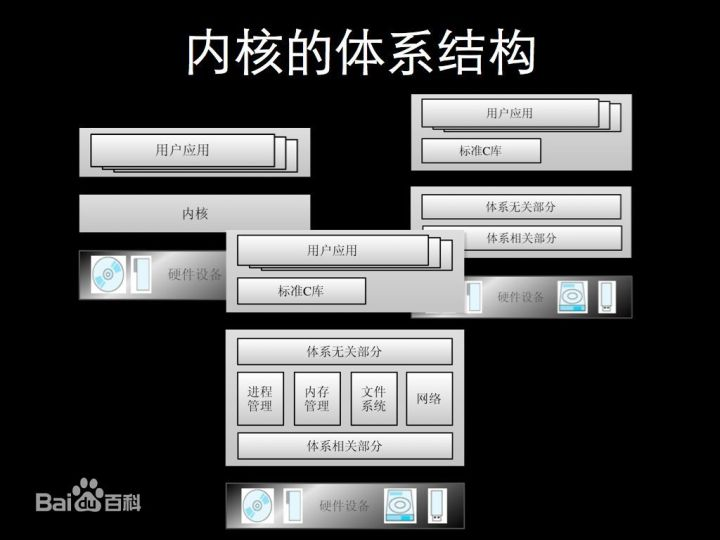

 

# 系统

### 内核

内核是操作系统最基本的部分。它是为众多应用程序提供对计算机硬件的安全访问的一部分软件，这种访问是有限的，并且内核决定一个程序在什么时候对某部分硬件操作多长时间。内核的分类可分为单内核和双内核以及微内核。严格地说，
内核并不是计算机系统中必要的组成部分
内核并不是计算机系统中必要的组成部分
内核并不是计算机系统中必要的组成部分
重要的事情要说三遍，是这样吗？
我不懂Linux，对内核了解不多不敢误人子弟，附上百科链接：[内核_百度百科](https://link.zhihu.com/?target=http%3A//baike.baidu.com/link%3Furl%3DR_MN2OlaOF356X8OhUWJtz9Qs9_8AD7fr0KeXRwSD_BJ4RTY7l9m2htWzWQHzxHibzZZVW9FASEKq2ysTnif9q)

 


**DOS**

| 命令             | 操作符号    |
| ---------------- | ----------- |
| 盘符切换命令     | 盘符名:     |
| 查看当前文件夹   | dir         |
| 进入文件夹命令   | cd 文件夹名 |
| 退出文件夹命令   | cd..        |
| 退出到磁盘根目录 | cd\         |
| 清屏             | cls         |

# 硬件

### cpu

#### 介绍

中央处理器（Central Processing Unit）是一块超大规模的集成电路，是一台计算机的运算核心（Core）和控制核心（ Control Unit）。CPU与内部存储器（Memory）和输入/输出（I/O）设备合称为电子计算机三大核心部件。

CPU主要包括:

 	1. **运算器**（算术逻辑运算单元，ALU，Arithmetic Logic Unit）
      	2. 寄存器
         	3. **高速缓冲存储器**（Cache）
                  	4. 实现1、2之间联系的数据（Data）
               	5. 控制及状态的总线（Bus）

#### 作用

cpu的功能主要是解释计算机指令以及处理计算机软件中的数据，主要就是处理各种指令，运算、跳转、存取内存之内的。这些指令所需的数据以及指令本身一般都是存储在ram中的。cpu必须将ram中的指令和数据取到cpu中的**各种寄存器**中，指令才能执行。

指令的地址存储在一个叫做**PC的寄存器**中，注意这边的PC不是个人电脑的意思，而是pointer of code的意思，即指令指针，而数据可以放在各种**通用寄存器**中。cpu中还有很多其他寄存器，控制着cpu各种功能。如果你学过汇编，便会知道汇编语言即是操作这些寄存器，完成各种运算任务。

CPU <--- > 寄存器<--- > 缓存<--- >内存

#### 寄存器

寄存器是中央处理器内的组成部份。它跟CPU有关。寄存器是有限存贮容量的高速存贮部件，它们可用来**暂存指令、数据和位址**。在中央处理器的控制部件中，包含的寄存器有指令寄存器(IR)和程序计数器(PC)。在中央处理器的算术及逻辑部件中，包含的寄存器有累加器(ACC)。

寄存器的工作方式很简单，只有两步：（1）找到相关的位，（2）读取这些位。

寄存器拥有非常高的读写速度，所以在寄存器之间的数据传送非常快。

寄存器是最贴近CPU的，而且CPU只与寄存器中进行存取。

#### 缓存CACHE

##### 介绍

现代高性能cpu内部一般都会有缓存，一般分为指令缓存和数据缓存。**即高速缓冲存储器，是位于寄存器与主内存间的一种容量较小但速度很高的存储器**。由于寄存器的速度远高于主内存，老是操作内存中的同一址地的数据，就会影响速度。于是就在寄存器与内存之间设置一个缓存。

Cache中保存着CPU刚用过或循环使用的一部分数据，当CPU再次使用该部分数据时可从Cache中直接调用，这样就减少了CPU的等待时间,提高了系统的效率。

##### 原理

在缓存中的数据是内存中的一小部分，但这一小部分是短时间内CPU即将访问的，当CPU调用大量数据时，就可避开内存直接从缓存中调用，从而加快读取速度。

缓存的工作原理是当CPU要读取一个数据时，首先从缓存中查找，如果找到就立即读取并送给CPU处理；如果没有找到，就用相对慢的速度内存中读取并送给CPU处理，同时把这个数据所在的数据块调入缓存中，可以使得以后对整块数据的读取都从缓存中进行，不必再调用内存。正是这样的读取机制使CPU读取缓存的命中率非常高（大多数CPU可达90%左右），也就是说CPU下一次要读取的数据90%都在缓存中，大约10%需要从内存读取。

这大大节省了CPU直接读取内存的时间，也使CPU读取数据时基本无需等待。总的来说，CPU读取数据的顺序是先缓存后内存。

##### 命中率

寄存器并不每次数据都可以从缓存中取得数据，万一不是同一个内存地址中的数据，那寄存器还必须直接绕过缓存从内存中取数据。所以并不每次都得到缓存中取数据，这就是缓存的命中率，从缓存中取就命中，不从缓存中取从内存中取，就没命中。当然关于缓存命中率又是一门学问，哪些留在缓存中，哪些不留在缓存中，都是命中的算法。


### 内存

#### 介绍

 **内存包含的范围非常广，一般分为只读存储器（ROM）、随机存储器（RAM）和高速缓存存储器（cache）。**

#### 工作方式

（1）找到数据的指针。（指针可能存放在寄存器内，所以这一步就已经包括寄存器的全部工作了。）

（2）将指针送往**内存管理单元**（MMU），由MMU将虚拟的内存地址翻译成实际的物理地址。

（3）将物理地址送往**内存控制器**（memory controller），由内存控制器找出该地址在哪一根**内存插槽**（bank）上。

（4）确定数据在哪一个**内存块**（chunk）上，从该块读取数据。

（5）数据先送回内存控制器，再送回CPU，然后开始使用。

内存的工作流程比寄存器多出许多步。每一步都会产生延迟，累积起来就使得内存比寄存器慢得多。

为了缓解寄存器与内存之间的巨大速度差异，硬件设计师做出了许多努力，包括在CPU内部设置缓存、优化CPU工作方式，尽量一次性从内存读取指令所要用到的全部数据等等。

Cache缓存则是为了弥补CPU与内存之间运算速度的差异而设置的的部件。

#### rom

可以被称作rom的东西很多，如pc主板上的rom芯片，pc关机后，rom的数据不会丢失，开机时先运行其中的bios程序，完成硬件配置和检测，之后会将磁盘第一个扇区中操作系统的引导程序装入内存，然后徐跳到引导程序。引导程序会进一步将操作系统存储在磁盘上的内核装入内存，最后执行内核程序。内核加载文件系统，并执行gui程序，便可以看到pc的桌面了。

# 多线程

多线程的适用场景，为啥要用多线程呢？

多线程编程的目的,就是"最大限度地利用CPU资源",当某一线程的处理不需要占用CPU而只和I/O,OEMBIOS等资源打交道时,让需要占用CPU资源的其它线程有机会获得CPU资源。

```
假设你的公司从上到下都不知道多线程有什么用，就你知道。你刚进公司。

比如你的机器是intel i7 4核，你要跑一个运算4万次，每次都独立，不考虑IO负担。那么，单线程你只能用到一个核，耗时40分钟，你打开任务管理器，看到CPU利用率一直是25%。

你修改程序，开4个线程，每个算1万次，你看到CPU利用率一直是100%，耗时10分钟。

你告诉老板40分钟后完成任务，10分钟后你检查完毕起身去买了杯咖啡，回来开始刷知乎。30分钟过后刷过瘾了，你发信息告诉老板任务完成。老板说：Good job.
```


# 位运算

位运算直接对内存数据进行操作，不需要转成十进制，因此处理速度非常快。

## 应用

https://www.cnblogs.com/ktyanny/archive/2009/12/25/1632297.html

# 网址

https://www.zhihu.com/question/24565362

https://blog.csdn.net/hellojoy/article/details/54744231

https://blog.csdn.net/csuyishuan/article/details/52073421


# 书籍

《深入理解计算机系统》