# 重点

资料还是看wiki。这里只是概括而且不全。

# **字符编码**

[Character encoding](https://zh.wikipedia.org/wiki/%E5%AD%97%E7%AC%A6%E7%BC%96%E7%A0%81#%E7%8E%B0%E4%BB%A3%E7%BC%96%E7%A0%81%E6%A8%A1%E5%9E%8B)

体系、各种基础概念模型

**抽象字符表**（Abstract character repertoire）

**编码字符集**（CCS:Coded Character Set）

**字符编码表**（CEF:Character Encoding Form）

**字符编码方案**（CES:Character Encoding Scheme）

**传输编码语法**（transfer Encoding syntax）

**自己总结**：

计算机的位只有两种状态，`1` 和 `0`，也就是说，在计算机中，只有数字。这些数字，要执行成代码，就得对命令编码；要显示出颜色，就得对颜色编码；要显示成文字，就得对文字编码。

对命令编码：比如汇编语言；对颜色编码：比如 CSS 用的 24 位色 RGB。对字符编码：通俗的讲，就是规定哪个数字代表哪个字符。比如在 GB 18030 中，规定 `B0A1` 代表字符“啊”。

### 字符编码

计算机中储存的信息都是用二进制数表示的，而我们在屏幕上看到的数字、英文、标点符号、汉字等字符是二进制数转换之后的结果。按照某种规则，将字符存储到计算机中，称为**编码** 。反之，将存储在计算机中的二进制数按照某种规则解析显示出来，称为**解码** 。比如说，按照A规则存储，同样按照A规则解析，那么就能显示正确的文本符号。反之，按照A规则存储，再按照B规则解析，就会导致乱码现象。

编码:字符(能看懂的)--字节(看不懂的)

解码:字节(看不懂的)-->字符(能看懂的)

* **字符编码`Character Encoding`** : 就是一套自然语言的字符与二进制数之间的对应规则。

  编码表:生活中文字和计算机中二进制的对应规则

### 字符集

* **字符集 `Charset`**：也叫编码表。是一个系统支持的所有字符的集合，包括各国家文字、标点符号、图形符号、数字等。

计算机要准确的存储和识别各种字符集符号，需要进行字符编码，一套字符集必然至少有一套字符编码。常见字符集有ASCII字符集、GBK字符集、Unicode字符集等。

可见，当指定了**编码**，它所对应的**字符集**自然就指定了，所以**编码**才是我们最终要关心的。

* **ASCII字符集** ：
  * ASCII（American Standard Code for Information Interchange，美国信息交换标准代码）是基于拉丁字母的一套电脑编码系统，用于显示现代英语，主要包括控制字符（回车键、退格、换行键等）和可显示字符（英文大小写字符、阿拉伯数字和西文符号）。
  * 基本的ASCII字符集，使用7位（bits）表示一个字符，共128字符。ASCII的扩展字符集使用8位（bits）表示一个字符，共256字符，方便支持欧洲常用字符。基本的ASCII字符集也是八位，首位是0；扩展首位是1
* **ISO-8859-1字符集**：
  * 拉丁码表，别名Latin-1，用于显示欧洲使用的语言，包括荷兰、丹麦、德语、意大利语、西班牙语等。
  * ISO-8859-1使用单字节编码，兼容ASCII编码。
* **GBxxx字符集**：
  * GB就是国标的意思，是为了显示中文而设计的一套字符集。
  * **GB2312**：简体中文码表。一个小于127的字符的意义与原来相同。但两个大于127的字符连在一起时，就表示一个汉字，这样大约可以组合了包含7000多个简体汉字，此外数学符号、罗马希腊的字母、日文的假名们都编进去了，连在ASCII里本来就有的数字、标点、字母都统统重新编了两个字节长的编码，这就是常说的"全角"字符，而原来在127号以下的那些就叫"半角"字符了。
  * **GBK**：最常用的中文码表。是在GB2312标准基础上的扩展规范，使用了双字节编码方案，共收录了21003个汉字，完全兼容GB2312标准，同时支持繁体汉字以及日韩汉字等。GBK默认中文编码表，windows系统用的。
  * **GB18030**：最新的中文码表。收录汉字70244个，采用多字节编码，每个字可以由1个、2个或4个字节组成。支持中国国内少数民族的文字，同时支持繁体汉字以及日韩汉字等。
* **Unicode字符集** ：
  * Unicode编码系统为表达任意语言的任意字符而设计，是业界的一种标准，也称为统一码、标准万国码。
  * 它最多使用4个字节的数字来表达每个字母、符号，或者文字。有三种编码方案，UTF-8、UTF-16和UTF-32。最为常用的UTF-8编码。
  * UTF-16编码，使用2或者4个字节存储，大小尾。很复杂。
  * UTF-8编码，可以用来表示Unicode标准中任何字符，它是电子邮件、网页及其他存储或传送文字的应用中，优先采用的编码。互联网工程工作小组（IETF）要求所有互联网协议都必须支持UTF-8编码。所以，我们开发Web应用，也要使用UTF-8编码。它使用一至四个字节为每个字符编码，编码规则：
    1. 128个US-ASCII字符，只需一个字节编码。
    2. 拉丁文等字符，需要二个字节编码。 
    3. 大部分常用字（含中文），使用三个字节编码。
    4. 其他极少使用的Unicode辅助字符，使用四字节编码。


# **字节**

字节是我们常见的计算机中最小存储单元。计算机存储任何的数据，都是以字节的形式存储，右键点击文件属性，我们可以查看文件的字节大小。

8个bit（二进制位） 0000-0000表示为1个字节，写成1 byte或者1 B。等于两个16进制单位。
8 bit = 1 B
1024 B =1 KB
1024 KB =1 MB
1024 MB =1 GB
1024 GB = 1 TB  

# **ASCII 码表**

https://tool.oschina.net/commons?type=4

| ASCII 值 | 控制字符 | ASCII 值 | 控制字符 | ASCII 值 | 控制字符 | ASCII 值 | 控制字符 |
| -------- | -------- | -------- | -------- | -------- | -------- | -------- | -------- |
| 0        | NUT      | 32       | (space)  | 64       | @        | 96       | 、       |
| 1        | SOH      | 33       | ！       | 65       | A        | 97       | a        |
| 2        | STX      | 34       | ”        | 66       | B        | 98       | b        |
| 3        | ETX      | 35       | #        | 67       | C        | 99       | c        |
| 4        | EOT      | 36       | $        | 68       | D        | 100      | d        |
| 5        | ENQ      | 37       | %        | 69       | E        | 101      | e        |
| 6        | ACK      | 38       | &        | 70       | F        | 102      | f        |
| 7        | BEL      | 39       | ,        | 71       | G        | 103      | g        |
| 8        | BS       | 40       | (        | 72       | H        | 104      | h        |
| 9        | HT       | 41       | )        | 73       | I        | 105      | i        |
| 10       | LF       | 42       | *        | 74       | J        | 106      | j        |
| 11       | VT       | 43       | +        | 75       | K        | 107      | k        |
| 12       | FF       | 44       | ,        | 76       | L        | 108      | l        |
| 13       | CR       | 45       | -        | 77       | M        | 109      | m        |
| 14       | SO       | 46       | .        | 78       | N        | 110      | n        |
| 15       | SI       | 47       | /        | 79       | O        | 111      | o        |
| 16       | DLE      | 48       | 0        | 80       | P        | 112      | p        |
| 17       | DCI      | 49       | 1        | 81       | Q        | 113      | q        |
| 18       | DC2      | 50       | 2        | 82       | R        | 114      | r        |
| 19       | DC3      | 51       | 3        | 83       | X        | 115      | s        |
| 20       | DC4      | 52       | 4        | 84       | T        | 116      | t        |
| 21       | NAK      | 53       | 5        | 85       | U        | 117      | u        |
| 22       | SYN      | 54       | 6        | 86       | V        | 118      | v        |
| 23       | TB       | 55       | 7        | 87       | W        | 119      | w        |
| 24       | CAN      | 56       | 8        | 88       | X        | 120      | x        |
| 25       | EM       | 57       | 9        | 89       | Y        | 121      | y        |
| 26       | SUB      | 58       | :        | 90       | Z        | 122      | z        |
| 27       | ESC      | 59       | ;        | 91       | [        | 123      | {        |
| 28       | FS       | 60       | <        | 92       | /        | 124      | \|       |
| 29       | GS       | 61       | =        | 93       | ]        | 125      | }        |
| 30       | RS       | 62       | >        | 94       | ^        | 126      | ~        |
| 31       | US       | 63       | ?        | 95       | —        | 127      | DEL      |

| 字符 | 含义     | 字符 | 含义       | 字符 | 含义           |
| ---- | -------- | ---- | ---------- | ---- | -------------- |
| NUL  | 空       | VT   | 垂直制表   | SYN  | 空转同步       |
| SOH  | 标题开始 | FF   | 走纸控制   | ETB  | 信息组传送结束 |
| STX  | 正文开始 | CR   | 回车       | CAN  | 作废           |
| ETX  | 正文结束 | SO   | 移位输出   | EM   | 纸尽           |
| EOY  | 传输结束 | SI   | 移位输入   | SUB  | 换置           |
| ENQ  | 询问字符 | DLE  | 空格       | ESC  | 换码           |
| ACK  | 承认     | DC1  | 设备控制 1 | FS   | 文字分隔符     |
| BEL  | 报警     | DC2  | 设备控制 2 | GS   | 组分隔符       |
| BS   | 退一格   | DC3  | 设备控制 3 | RS   | 记录分隔符     |
| HT   | 横向列表 | DC4  | 设备控制 4 | US   | 单元分隔符     |
| LF   | 换行     | NAK  | 否定       | DEL  | 删除           |

# iso-8859-1，Latin1码表

**Latin1**是[ISO-8859-1](https://baike.baidu.com/item/ISO-8859-1)的别名，有些环境下写作Latin-1。ISO-8859-1编码是单[字节](https://baike.baidu.com/item/字节/1096318)编码，向下兼容[ASCII](https://baike.baidu.com/item/ASCII)，其编码范围是0x00-0xFF，0x00-0x7F之间完全和ASCII一致，0x80-0x9F之间是[控制字符](https://baike.baidu.com/item/控制字符/6913704)，0xA0-0xFF之间是文字符号。

ISO-8859-1收录的[字符](https://baike.baidu.com/item/字符)除ASCII收录的字符外，还包括西欧语言、希腊语、泰语、阿拉伯语、希伯来语对应的文字符号。[欧元符号](https://baike.baidu.com/item/欧元符号)出现的比较晚，没有被收录在ISO-8859-1当中。

因为ISO-8859-1编码范围使用了单[字节](https://baike.baidu.com/item/字节)内的所有空间，在支持ISO-8859-1的系统中传输和存储其他任何编码的[字节流](https://baike.baidu.com/item/字节流)都不会被抛弃。换言之，把其他任何编码的字节流当作ISO-8859-1编码看待都没有问题。这是个很重要的特性，MySQL数据库默认编码是Latin1就是利用了这个特性。ASCII编码是一个7位的容器，ISO-8859-1编码是一个8位的容器。

https://www.haomeili.net/Code/ASCIIMa/iso-8859-1

iso-8859-1码表“iso-8859-1码”通常可以分为以下三部分组成: 

**1**（0-31）非打印控制字符；

 **2**（32-127）可打印字符；

**3**（128-255）扩展iso-8859-1字符　本地不一定支持。

 **4** 高位显示?或空格表示本地不支持该字符显示。

```java
//无法识别的时候把该字节转换为？ "士大夫是"????
"sfd士大夫是0".getBytes(StandardCharsets.ISO_8859_1) //[115, 102, 100, 63, 63, 63, 63, 48]  sfd????0
```


# 字节序

[又称**端序**或**尾序**（英语：**Endianness**）](https://zh.wikipedia.org/wiki/%E5%AD%97%E8%8A%82%E5%BA%8F#%E5%A4%A7%E7%AB%AF%E5%BA%8F)

在哪种字节顺序更合适的问题上，人们表现得非常情绪化，实际上，就像鸡蛋的问题一样，没有技术上的原因来选择字节顺序规则，因此，争论沦为关于社会政治问题的争论，只要选择了一种规则并且始终如一地坚持，其实对于哪种字节排序的选择是任意的。

对于单一的字节（*a byte*），大部分[处理器](https://zh.wikipedia.org/wiki/处理器)以相同的顺序处理[位元](https://zh.wikipedia.org/wiki/位元)（bit），因此单字节的存放方法和传输方式一般相同。

对于多字节数据，如整数（32位机中一般占4字节），在不同的处理器的存放方式主要有两种

小端模式更适合系统内部，大端模式更适合网络数据传递，加上一些历史引领的原因，导致现在两种字节序方式并存。

处理器读取外部数据的时候，必须知道数据的字节序，将其转成正确的值。然后，就正常使用这个值，完全不用再考虑字节序。

即使是向外部设备写入数据，也不用考虑字节序，正常写入一个值即可。外部设备会自己处理字节序的问题。

https://blog.erratasec.com/2016/11/how-to-teach-endian.html#.X2RL12j7REY

https://betterexplained.com/articles/understanding-big-and-little-endian-byte-order/


```java
//为什么 UTF-8 不存在字节序的问题？
对于一个32位整数1，不同的CPU架构会有不同的存储方式：
    00000000 00000000 00000000 00000001
    或者
    00000001 00000000 00000000 00000000
故字节序问题是说对于超过8位的整数如何排布的问题，而对于像double和char数组这类类型，其实并没有影响。double一般是遵从IEEE标准的，对于各CPU都一致，而char数组更是由C代码计算地址的，不受字节序影响。
 所以首先要搞清楚，不是所有的东西都有字节序，而且字节序是以单字节为单位的顺序问题，不是字节内部的。
这样问题其实就一目了然了，UTF16和UTF32的处理单元分别是2个字节和4个字节，在C语言中的定义就决定了这两个超过8位的整数需要考虑存储和网络传输的字节序。而UTF8的编码是以1个字节为单位处理的，需要考虑下一位时就地址+1，不会受CPU大小端的影响

//因为utf-8是1234字节变长编码，所以根本不知道多少字节，每次都是读一个字节，看头部几位按需读下一位，因此每次处理单元都是不定性，不需要几个字节一起处理
    
作者：孙笑凡
链接：https://www.zhihu.com/question/55140986/answer/142938758
来源：知乎
著作权归作者所有。商业转载请联系作者获得授权，非商业转载请注明出处。
```


# 通用字符集

[（英语：Universal Character Set, UCS）是由ISO制定的**ISO 10646**（或称**ISO/IEC 10646**）标准所定义的标准字符集。](https://zh.wikipedia.org/wiki/%E9%80%9A%E7%94%A8%E5%AD%97%E7%AC%A6%E9%9B%86)

# Unicode

[（中文：万国码、国际码、统一码、单一码）是计算机科学领域里的一项业界标准。它对世界上大部分的文字系统进行了整理、编码，使得电脑可以用更为简单的方式来呈现和处理文字。](https://zh.wikipedia.org/wiki/Unicode)

[Unicdoe【真正的完整码表】对照表（一）](https://blog.csdn.net/hherima/article/details/9045765)

## 平面（Plane）

Unicode 使用的数字是从 `0` 到 `0x10ffff`，这些数字都对有相对应的字符（当然，有的还没有编好，有的用作私人自定义）。每一个数字，就是一个代码点（Code Point）。

这些代码点，分为 17 个平面（Plane）。其实就是17 组，只是名字高大上而已：

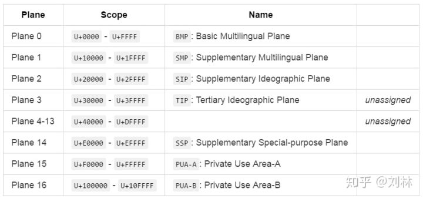

Plane 3 到 Plane 14 还没有使用，TIP(Plane 3) 准备用来映射甲骨文、金文、小篆等表意文字。PUA-A, PUA-B 为私人使用区，是用来给大家自己玩儿的——存储自定义的一些字符。

Plane 0，习惯上称作基本平面（Basic Plane）；剩余的称作扩展平面（Supplementary Plane）。

顺便说下字体文件。通俗的讲，字体文件中存放的就是代码点对应的图形，以便计算机将代码点渲染成该对应的图形，然后人就可以阅读了。有的字体，里边没有存储中文，这些字体就渲染不了中文。

## UTF

Unicode 的实现方式称为 **Unicode转换格式**（Unicode Transformation Format，简称为 UTF）。

## UTF-32


UTF-32 使用四个字节来表示存储代码点：把代码点转换为 32 位二进制，位数不够的左边充 0。

示例：

```java
var s1 = "A";                         // Plane 0
var s2 = codePoint2String(0x10000);   // Plane 1
var s3 = codePoint2String(0x10ffff);  // Plane 16

binStr(s1, "UTF-32");  // => `00000000 00000000 00000000 01000001`
binStr(s2, "UTF-32");  // => `00000000 00000001 00000000 00000000`
binStr(s3, "UTF-32");  // => `00000000 00010000 11111111 11111111`
```

可以发现，空间的浪费极大，在 Plane 0，利用率那是少得可怜，就算是 Plane 16，利用率也不到 3/4。而我们使用的大多数字符，都在 Plane 0。连存储都非常不划算，更不用说网络传输了。所以这种实现用得极少。

## [UTF-16](https://zh.wikipedia.org/wiki/UTF-16)

**从U+0000至U+D7FF以及从U+E000至U+FFFF的码位**，包含了最常用的字符。该平面被称为基本多语言平面

**从U+10000到U+10FFFF的码位**，辅助平面（Supplementary Planes）中的码位，在UTF-16中被编码为**一对**16比特长的码元（即32位，4字节），称作*代理对*（Surrogate Pair）

**从U+D800到U+DFFF的码位**，Unicode标准规定U+D800...U+DFFF的值不对应于任何字符。

UTF-16比起UTF-8，好处在于大部分字符都以固定长度的字节（2字节）存储，但UTF-16却无法兼容于[ASCII](https://zh.wikipedia.org/wiki/ASCII)编码。

## [UTF-8](https://zh.wikipedia.org/wiki/UTF-8)

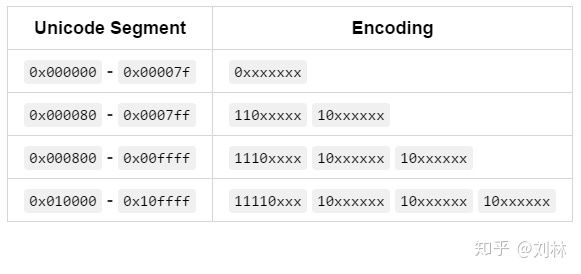

编码方法，将代码点转为二进制，依次填入，位数不够的，左边充 0。

可以看出，不同段的代码点会以不同的长度存储，计算机解析时，只用读取前面若干位，就知道该字符占几个字节，位于哪一段。

对于西文，该编码方式非常节约空间，因为西文的编码通常都小于 `0x0007ff`，尤其是 ASCII 字符，更是一个字符只占一个字节的程度。对于中文，常用的汉字通常位于 `0x000800` - `0x00ffff` 这一段，需要三个字节的存储，比起 UTF-16 的存储消耗要大一些。

```JAVA
String s1   = codePoint2String(0x7f);
String s2_1 = codePoint2String(0x80);
String s2_2 = codePoint2String(0x7ff);
String s3_1 = codePoint2String(0x800);
String s3_2 = codePoint2String(0xffff);
String s4_1 = codePoint2String(0x10000);
String s4_2 = codePoint2String(0x10ffff);

binStr(s1, "UTF-8");    // => "01111111"
binStr(s2_1, "UTF-8");  // => "11000010 10000000"
binStr(s2_2, "UTF-8");  // => "11011111 10111111"
binStr(s3_1, "UTF-8");  // => "11100000 10100000 10000000"
binStr(s3_2, "UTF-8");  // => "11101111 10111111 10111111"
binStr(s4_1, "UTF-8");  // => "11110000 10010000 10000000 10000000"
binStr(s4_2, "UTF-8");  // => "11110100 10001111 10111111 10111111"
```

需要特别说明的是，UNICDOE 中的前 0x7f 个字符编码，和 ANSI 编码的前 0x7f 个字符编码是完全相同的。

## 字节顺序标记（BOM）

Byte Order Mark(BOM)，即字节顺序标记，通常叫做大小端。位于文件开始的地方。用于标记高位在前，还是低位在前。

BOM 有两种形式： BE: Big-Endian, 高位在前，低位在后 LE: Little-Endian, 低位在前，高位在后 其中，UTF-8 的 BOM 可有可无，但如果读到 `EF BB BF`，好了，这就是 UTF-8 的文件。

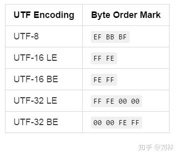

LE:

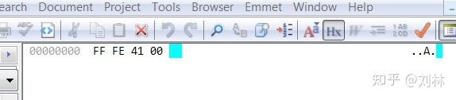

BE:

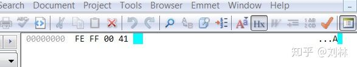


这个就不详细说了，知道有这么个东西，处理相应编码的文本时时知道要处理这个就行了。

## Unicode 的其他属性

Unicode Block: [https://en.wikipedia.org/wiki/Unicode_block](https://link.zhihu.com/?target=https%3A//en.wikipedia.org/wiki/Unicode_block)

Character Property: [https://en.wikipedia.org/wiki/Unicode_character_property](https://link.zhihu.com/?target=https%3A//en.wikipedia.org/wiki/Unicode_character_property)

Unicode Script: [http://www.unicode.org/Public/UNID](https://link.zhihu.com/?target=http%3A//www.unicode.org/Public/UNIDATA/Scripts.txt) 

## 代码实践

```java
//unicode 查询网站
char c =0x5ff0; // '忰' 24560;  00000000 00000000 01011111 11110000  ; 24560 ; U+5FF0 

//utf-8 
"忰".getBytes("utf-8"); // [-27, -65, -80]  11100101 10111111 10110000 ; E5BFB0
    
//utf-16 test.getBytes("UTF-16BE");
"忰".getBytes("utf-16"); // [-2, -1, 95, -16]  大小端：11111110 11111111 (0xFE 0xFF); 01011111 11110000 ; 0x5FF0 

//utf-32
"忰".getBytes("utf-32");  // [0, 0, 95, -16] 00000000 00000000 01011111 11110000 ; 0x00005FF0 
```

[解释utf-16多了开头两个字节](https://stackoverflow.com/questions/51230191/java-utf-16-string-always-use-4-bytes-instead-of-2-bytes)

string.getBytes() 是用于获取输出的字节，并不是内部jvm储存的字节，有多个重载，默认的字符集和一个jvm参数息息相关: -Dfile.encoding=UTF-8。一般从IDEA启动程序都是显式设置这个参数。

```java
SortedMap<String, Charset> stringCharsetSortedMap = Charset.availableCharsets();
Charset charset = Charset.defaultCharset();//如果没有设置 -Dfile.encoding=UTF-8，那么就是os的默认编码，中文一般是gbk
```

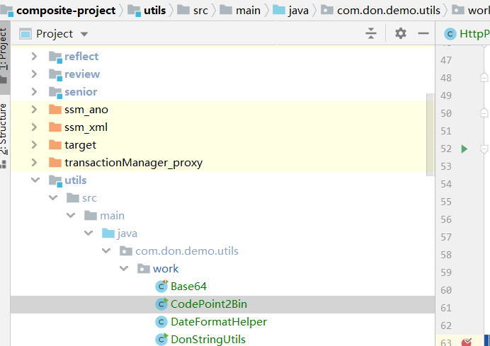

## java

### 原理

java采用unicode编码字符集、utf-16字符编码表，并不是使用char。char只是一种类型，和int一样。（int只有21亿个，为什么java能表示long长的数字，因为有long型啊）

unicode编码字符集一共有111万多个字符，utf常用有3种，java采用utf-16。wiki的原话

```txt
UTF-16 is used internally by systems such as[Microsoft Windows](https://en.wikipedia.org/wiki/Microsoft_Windows "Microsoft Windows"), the[Java programming language](https://en.wikipedia.org/wiki/Java_programming_language "Java programming language")and[JavaScript](https://en.wikipedia.org/wiki/JavaScript "JavaScript")/ECMAScript. It is also often used for[plain text](https://en.wikipedia.org/wiki/Plain_text "Plain text")and for word-processing data files on MS Windows. It is rarely used for files on Unix/Linux or[macOS](https://en.wikipedia.org/wiki/MacOS "MacOS").
```

utf-16可以表示所有的unicode，111万多个，并且utf-16编码采用4个或者8个 16进制数字表示。

char只表示常用的字符，确实是6万多个。还有上面的答案“？”是包含在char中，整型大概是63000多。

```java
String 𪚥 = "\uD869\uDEA5";//𪚥，非基本平面，只能使用unicode编码
String str = "\uD801\uDC37\uD869\uDEA5";//𐐷𪚥
String sd = "\uDd69";	//string也可以储存字符的
char s1 ='\uD869\uDEA5';//𪚥 ，报错，非基本平面
System.out.println(𪚥.length());
```

### string

**`String`的编码也是java的编码 unicode**

使用`字符常量`构建和`new String`出来的都是使用java的编码`utf-16`保存。

`new string`是使用**字节数组**和特定的**编码类型**转化为内部的`utf-16`编码。

获取string对应的字节可以选定编码类型，**Idea默认是utf-8**

```java
new String("sdf".getBytes(StandardCharsets.UTF_16), StandardCharsets.UTF_16) //sdf
new String("sdf".getBytes(), StandardCharsets.UTF_16)//獤�
```

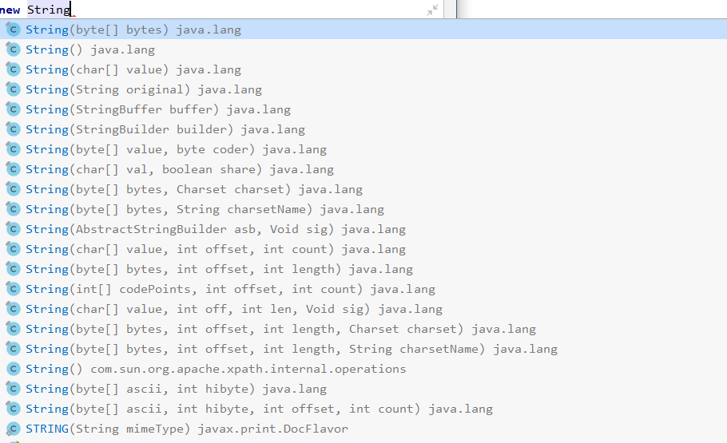

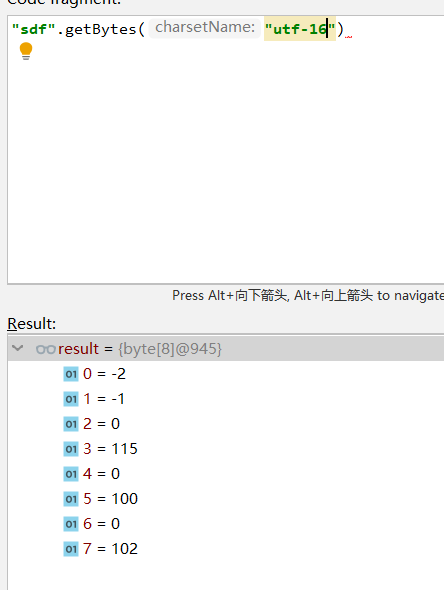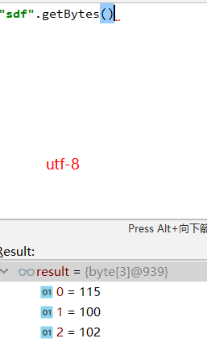

### 转码

hutool工具框架

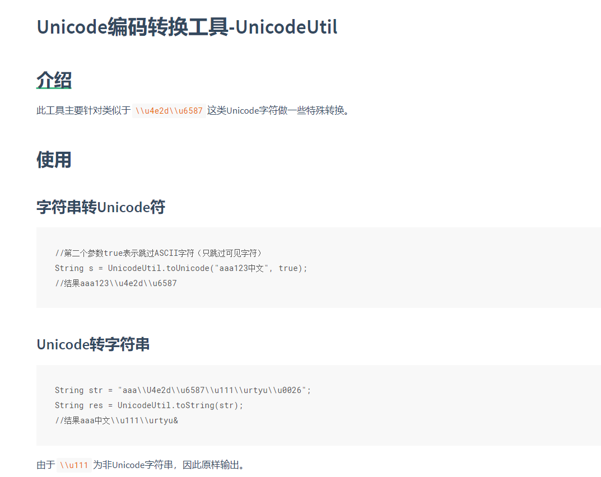

# urlEncode

## [为什么要对url进行encode](http://www.blogjava.net/donghang73/archive/2011/08/10/356208.html)

发现现在几乎所有的网站都对url中的汉字和特殊的字符，进行了urlencode操作，也就是：http://hi.baidu.com/%BE%B2%D0%C4%C0%CF%C8%CB/creat/blog/ 这个样子，中间%形式的，肯定就是我的登录用户名称了吧。

**url转义其实也只是为了符合url的规范而已。因为在标准的url规范中中文和很多的字符是不允许出现在url中的。**

## 哪些字符是需要转化的呢？

**1. ASCII 的控制字符**

这些字符都是不可打印的，自然需要进行转化。

**2. 一些非ASCII字符**

这些字符自然是非法的字符范围。转化也是理所当然的了。

**3. 一些保留字符**

很明显最常见的就是“&”了，这个如果出现在url中了，那你认为是url中的一个字符呢，还是特殊的参数分割用的呢？

**4. 就是一些不安全的字符了。**

例如：空格。为了防止引起歧义，需要被转化为“+”。

## 转化规则

明白了这些，也就知道了为什么需要转化了，而转化的规则也是很简单的。

不是符合我们范围的，按照每个字符对应的字符编码，统统的转化为%的形式也就是了。自然也是16进制的形式。

**urlEncode后要进行urlDecode**

## **和字符编码无关**

通过urlencode的转化规则和目的，我们也很容易的看出，urleocode是**基于字符编码**的。同样的一个汉字，不同的编码类型，肯定对应不同的urleocode的串。gbk编码的有gbk的encode结果。

apache等服务器，接受到字符串后，可以进行decode，但是还是无法解决编码的问题。编码问题，还是需要靠约定或者字符编码的判断解决。

因此，urleocode只是为了url中一些非ascii字符，可以正确无误的被传输，至于使用哪种编码，就不是eocode所关心和解决的问题了。

## get ，post ，tomcat

分析一下这篇[文章](https://blog.csdn.net/u013833031/article/details/78828539)。

第一部分博主转发的，正确。

第二部分get，大部分推理正确，写得不完整，但是对我挺有启发，但是博主怎么实践起来就错了呢？！下面给出正确分析原理。

1. 现在假定http协议约定使用 iso-8859-1 字符编码表，这里根据博主推敲的，其实即便是Ascii或者其他字符编码表也不影响推论，重要是客户端和服务端遵守约定，有兴趣可以看看http协议的相关约定。
2. 客户端需要先把原始报文全部转化为iso-8859-1编码字符集中的字符，这个过程叫做urlEncode("charset")，否则iso-8859-1编码解码器会把无法识别的字符转化为"?"63或者空格，会丢失信息。然后才会使用iso-8859-1编码，最后把编码后的字节流写入socket。
3. 服务端（例如tomcat）把socket的字节流进行iso-8859-1解码（约定很重要，不然谁知道用什么解码），然后解析报文（此时就是一堆字符串），获取参数、header之类的，之后需要urlDecode（还原原始报文中的非iso-8859-1字符集的字符，这个过程就是乱码出现的根源，http协议没有规定使用urlencode，服务器不会自动urlDecode，因此需要手动urlDecode

4. 根据以上推论，那么我们在tomcat web应用中使用该方法 `URLDecoder.decode(request.getParameter("param"),"charset")` 就能拿到中文value 。记住charset要对应客户端。

5. 错误：`new String(request.getParameter("name").getBytes("iso-8859-1"),"客户端指定的URL encode编码方式")` 
博主实践错误的原因就在这里。我这里解释一下吧。request.getParameter("name")拿到urlDeocde前的value；getBytes("iso-8859-1")拿到socket的字节流，因为jvm内部字节表示和http传输的字节是不一样的（两者用的编码不一样）；然后再new String（"客户端指定的URL encode编码方式"），相对于直接使用URL encode 编码socket里面的字节，肯定错啊。

第三部分post我没看，大家审慎地对待吧。其实原理搞懂了就很容易了，底层就是socket发送接收前后的编码解码对应。落到各种服务器，最好就是查官方文档或者debug看源码。

我之前看到说tomcat9自动帮我们处理get的urlDecode，我都忘记了是不是真的，但是真的小道信息害死人。

## java例子

工具网 ： https://tool.chinaz.com/tools/urlencode.aspx

```sql
-- 原来的url，也就是urlDecode解码的结果，但是使用不同的编码集就需要使用对应的解码：
https://www.w3schools.com/tags/tryit.asp?filename=tryhtml5_form_autocomplete好的
-- utf-8的urlEncode编码
https%3a%2f%2fwww.w3schools.com%2ftags%2ftryit.asp%3ffilename%3dtryhtml5_form_autocomplete%e5%a5%bd%e7%9a%84
-- gb2312的urlEncode
https%3a%2f%2fwww.w3schools.com%2ftags%2ftryit.asp%3ffilename%3dtryhtml5_form_autocomplete%ba%c3%b5%c4
```

## js例子

作者：大黄
链接：https://www.zhihu.com/question/21861899/answer/20300871
来源：知乎
著作权归作者所有。商业转载请联系作者获得授权，非商业转载请注明出处。


**一、escape和它们不是同一类**

简单来说，escape是对字符串(string)进行编码(而另外两种是对URL)，作用是让它们在所有电脑上可读。
编码之后的效果是%XX或者%uXXXX这种形式。
其中 ASCII字母  数字  @*/+   这几个字符***不会***被编码，其余的都会。
最关键的是，当你需要对URL编码时，请忘记这个方法，这个方法是针对字符串使用的，不适用于URL。

**二、最常用的encodeURI和encodeURIComponent**

对URL编码是常见的事，所以这两个方法应该是实际中要特别注意的。

它们都是编码URL，唯一区别就是编码的字符范围，其中

encodeURI方法***不会***对下列字符编码  **ASCII字母  数字  ~!@#$&\*()=:/,;?+'**

encodeURIComponent方法***不会***对下列字符编码 **ASCII字母  数字  ~!\*()'**

所以encodeURIComponent比encodeURI编码的范围更大。

实际例子来说，encodeURIComponent会把 http://  编码成  http%3A%2F%2F 而encodeURI却不会。


**三、最重要的，什么场合应该用什么方法**

**1、如果只是编码字符串，不和URL有半毛钱关系，那么用escape。**

**2、如果你需要编码整个URL，然后需要使用这个URL，那么用encodeURI。**

比如

```js
encodeURI("http://www.cnblogs.com/season-huang/some other thing");
```

编码后会变为

```js
"http://www.cnblogs.com/season-huang/some%20other%20thing";
```

其中，空格被编码成了%20。但是如果你用了encodeURIComponent，那么结果变为

```js
"http%3A%2F%2Fwww.cnblogs.com%2Fseason-huang%2Fsome%20other%20thing"
```

看到了区别吗，连 "/" 都被编码了，整个URL已经没法用了。

**3、当你需要编码URL中的参数的时候，那么encodeURIComponent是最好方法。**

```js
var param = "http://www.cnblogs.com/season-huang/"; //param为参数
param = encodeURIComponent(param);
var url = "http://www.cnblogs.com?next=" + param;
console.log(url) //"http://www.cnblogs.com?next=http%3A%2F%2Fwww.cnblogs.com%2Fseason-huang%2F"
```

~~看到了把，参数中的 "/" 可以编码，如果用encodeURI肯定要出问题，因为后面的/是需要编码的.~~

> 实验看来两者都没有区别 

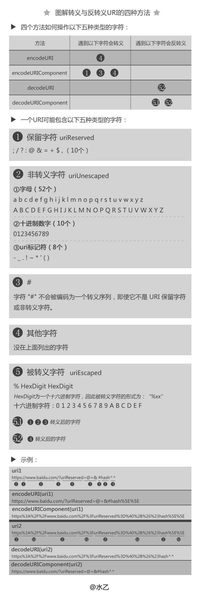

# /r /n  /r/n

#### 介绍

`\r`就是"回到行首"，`\n`就是"到下一行"

即:`\r`是**回车**，`\n`是**换行**，前者**使光标到行首**，后者**使光标下移一格**。
通常用的`Enter`是两个加起来的，即`\r\n`

```java
System.out.println("aaaaaa\r\nbbbbbb");
System.out.println("cccccc\neeeee");
System.out.println("fffffff\rggggg");
//aaaaaa
//bbbbbb
//cccccc
//eeeee
//ggggg
```

#### 由来:

在计算机还没有出现之前，有一种叫做电传打字机（Teletype Model 33）的玩意，每秒钟可以打10个字符。但是它有一个问题，就是打完一行换行的时候，要用去0.2秒，正好可以打两个字符。要是在这0.2秒里面，又有新的字符传过来，那么这个字符将丢失。

于是，研制人员想了个办法解决这个问题，就是在每行后面加两个表示结束的字符。一个叫做**“回车”**，告诉打字机把打印头定位在左边界；另一个叫做**“换行”**，告诉打字机把纸向下移一行。

这就是“换行”和“回车”的来历，从它们的英语名字上也可以看出一二。

后来，计算机发明了，这两个概念也就被般到了计算机上。那时，存储器很贵，一些科学家认为在每行结尾加两个字符太浪费了，加一个就可以。于是，就出现了分歧。

- Unix系统里，每行结尾只有“**<换行>**”，即“`\n`”；
- Windows系统里面，每行结尾是“**<换行><回车>**”，即“`\n\r`”；
- Mac系统里，每行结尾是“**<回车>**”。

一个直接后果是，Unix/Mac系统下的文件在Windows里打开的话，所有文字会变成一行；而Windows里的文件在Unix/Mac下打开的话，在每行的结尾可能会多出一个`^M`符号。

编程时（无论是windows系统还是linux系统)
 `\r` 就是return 回到本行行首,这就会**把这一行以前的输出覆盖掉,具体内部细节就像是输出缓冲区重新开始缓冲了一样**
 而`\n` 是换行＋回车，把光标先移到下一行,然后换到行首->也就是下一行的行首

所以若是看到代码里面本来应该换行的地方变成了整行、

本来该输出整行的时候却只输出了一部分、

那么，查一查是不是你的`\r`,`\n`,`\r\n`哪个用错了吧！（换平台尤其要注意）

CRLF就是CarriageReturn&LineFeed（回车换行键，两个字符）


# base64编码

> Base64编码要求把3个8位字节（3*8=24）转化为4个6位的字节（4*6=24），之后在6位的前面补两个0，形成8位一个字节的形式。 如果剩下的字符不足3个字节，则用0填充，输出字符使用‘=’，因此编码后输出的文本末尾可能会出现1或2个‘=’。
>
> 为了保证所输出的编码位可读字符，Base64制定了一个编码表，以便进行统一转换。编码表的大小为2^6=64，这也是Base64名称的由来。


作用：用文本表示二进制

https://zh.wikipedia.org/wiki/Base64

**Base64是一种基于64个可打印字符来表示[二进制数据](https://zh.wikipedia.org/wiki/二进制)的表示方法。**由于`{\displaystyle \log _{2}64=6}`，所以每6个[比特](https://zh.wikipedia.org/wiki/位元)为一个单元，对应某个可打印字符。3个[字节](https://zh.wikipedia.org/wiki/字节)有24个比特，对应于4个Base64单元，即3个字节可由4个可打印字符来表示。它可用来作为[电子邮件](https://zh.wikipedia.org/wiki/电子邮件)的传输[编码](https://zh.wikipedia.org/wiki/字符编码)。在Base64中的可打印字符包括[字母](https://zh.wikipedia.org/wiki/拉丁字母)`A-Z`、`a-z`、[数字](https://zh.wikipedia.org/wiki/数字)`0-9`，这样共有62个字符，此外两个可打印符号在不同的系统中而不同。一些如[uuencode](https://zh.wikipedia.org/wiki/Uuencode)的其他编码方法，和之后[BinHex](https://zh.wikipedia.org/w/index.php?title=BinHex&action=edit&redlink=1)的版本使用不同的64字符集来代表6个二进制数字，但是不被称为Base64。

Base64常用于在通常处理文本[数据](https://zh.wikipedia.org/wiki/数据)的场合，表示、传输、存储一些二进制数据，包括[MIME](https://zh.wikipedia.org/wiki/MIME)的[电子邮件](https://zh.wikipedia.org/wiki/电子邮件)及[XML](https://zh.wikipedia.org/wiki/XML)的一些复杂数据。

> This method uses the "A-Z", "a-z", "0-9", "+", "/" and "=" characters to encode the string.


## MIME[[编辑](https://zh.wikipedia.org/w/index.php?title=Base64&action=edit&section=1)]

在[MIME](https://zh.wikipedia.org/wiki/MIME)格式的[电子邮件](https://zh.wikipedia.org/wiki/电子邮件)中，Base64可以用来将binary的字节序列数据[编码](https://zh.wikipedia.org/wiki/字符编码)成[ASCII](https://zh.wikipedia.org/wiki/ASCII)字符序列构成的文本。使用时，在传输编码方式中指定Base64。使用的字符包括大小写[拉丁字母](https://zh.wikipedia.org/wiki/拉丁字母)各26个、数字10个、加号`+`和斜杠`/`，共64个字符，等号`=`用来作为后缀用途。

完整的Base64定义可见RFC 1421和RFC 2045。编码后的数据比原始数据略长，为原来的{\displaystyle {\frac {4}{3}}}。在电子邮件中，根据RFC 822规定，每76个字符，还需要加上一个回车换行。可以估算编码后数据长度大约为原长的135.1%。

转换的时候，将3[字节](https://zh.wikipedia.org/wiki/字节)的数据，先后放入一个24位的[缓冲区](https://zh.wikipedia.org/wiki/缓冲区)中，先来的[字节](https://zh.wikipedia.org/wiki/字节)占高位。数据不足3字节的话，于缓冲器中剩下的比特用0补足。每次取出6比特（因为{\displaystyle 2^{6}=64}），按照其值选择`ABCDEFGHIJKLMNOPQRSTUVWXYZabcdefghijklmnopqrstuvwxyz0123456789+/`中的字符作为编码后的输出，直到全部输入数据转换完成。

若原数据长度不是3的[倍数](https://zh.wikipedia.org/wiki/倍數)时且剩下1个输入数据，则在编码结果后加2个`=`；若剩下2个输入数据，则在编码结果后加1个`=`。

### 例子[[编辑](https://zh.wikipedia.org/w/index.php?title=Base64&action=edit&section=2)]

举例来说，一段引用自[托马斯·霍布斯](https://zh.wikipedia.org/wiki/托马斯·霍布斯)《[利维坦](https://zh.wikipedia.org/wiki/利维坦_(霍布斯))》的文句：

Man is distinguished, not only by his reason, but by this singular passion from other animals, which is a lust of the mind, that by a perseverance of delight in the continued and indefatigable generation of knowledge, exceeds the short vehemence of any carnal pleasure.

经过Base64编码之后变成：

```
TWFuIGlzIGRpc3Rpbmd1aXNoZWQsIG5vdCBvbmx5IGJ5IGhpcyByZWFzb24sIGJ1dCBieSB0aGlz
IHNpbmd1bGFyIHBhc3Npb24gZnJvbSBvdGhlciBhbmltYWxzLCB3aGljaCBpcyBhIGx1c3Qgb2Yg
dGhlIG1pbmQsIHRoYXQgYnkgYSBwZXJzZXZlcmFuY2Ugb2	YgZGVsaWdodCBpbiB0aGUgY29udGlu
dWVkIGFuZCBpbmRlZmF0aWdhYmxlIGdlbmVyYXRpb24gb2Yga25vd2xlZGdlLCBleGNlZWRzIHRo
ZSBzaG9ydCB2ZWhlbWVuY2Ugb2YgYW55IGNhcm5hbCBwbGVhc3VyZS4=
```

## Base64索引表

| 数值  | 字符 |      | 数值 | 字符 |      | 数值 | 字符 |      | 数值 | 字符 |
| :---: | :--: | :--: | :--: | :--: | :--: | :--: | :--: | ---- | ---- | ---- |
| **0** |  A   |  16  |  Q   |  32  |  g   |  48  |  w   |      |      |      |
|   1   |  B   |  17  |  R   |  33  |  h   |  49  |  x   |      |      |      |
|   2   |  C   |  18  |  S   |  34  |  i   |  50  |  y   |      |      |      |
|   3   |  D   |  19  |  T   |  35  |  j   |  51  |  z   |      |      |      |
|   4   |  E   |  20  |  U   |  36  |  k   |  52  |  0   |      |      |      |
|   5   |  F   |  21  |  V   |  37  |  l   |  53  |  1   |      |      |      |
|   6   |  G   |  22  |  W   |  38  |  m   |  54  |  2   |      |      |      |
|   7   |  H   |  23  |  X   |  39  |  n   |  55  |  3   |      |      |      |
|   8   |  I   |  24  |  Y   |  40  |  o   |  56  |  4   |      |      |      |
|   9   |  J   |  25  |  Z   |  41  |  p   |  57  |  5   |      |      |      |
|  10   |  K   |  26  |  a   |  42  |  q   |  58  |  6   |      |      |      |
|  11   |  L   |  27  |  b   |  43  |  r   |  59  |  7   |      |      |      |
|  12   |  M   |  28  |  c   |  44  |  s   |  60  |  8   |      |      |      |
|  13   |  N   |  29  |  d   |  45  |  t   |  61  |  9   |      |      |      |
|  14   |  O   |  30  |  e   |  46  |  u   |  62  |  +   |      |      |      |
|  15   |  P   |  31  |  f   |  47  |  v   |  63  |  /   |      |      |      |

末尾有可能还有一个=

## java例子

```java
    public static void main(String[] args) {
        byte[] encode = Base64.getEncoder().encode("abc".getBytes());
        String s1 = new String(encode, StandardCharsets.US_ASCII);//YWJj
        String s2 = new String(encode, StandardCharsets.UTF_8);//YWJj
        String s3 = cn.hutool.core.codec.Base64.encode("abc");//YWJj
        System.out.println(s1==s2&&s2==s3);
    }
```

# ANSI

**ANSI并不是某一种特定的字符编码，而是在不同的系统中，ANSI表示不同的编码。**

 

你的美国同事Bob的系统中ANSI编码其实是ASCII编码（ASCII编码不能表示汉字，所以汉字为乱码），

而你的系统中（“汉字”正常显示）ANSI编码其实是GBK编码，

而韩文系统中（“한국어”正常显示）ANSI编码其实是EUC-KR编码。

 

**那么Windows系统是如何区分ANSI背后的真实编码的呢？**

微软用一个叫“[Windows code pages](https://en.wikipedia.org/wiki/Code_page)”（在命令行下执行chcp命令可以查看当前code page的值）的值来判断系统默认编码，比如：简体中文的code page值为936（它表示GBK编码，win95之前表示GB2312，详见：[Microsoft Windows' Code Page 936](https://en.wikipedia.org/wiki/Code_page_1386)），繁体中文的code page值为950（表示Big-5编码）。

 

**我们能否通过修改Windows code pages的值来改变“ANSI编码”呢？**

命令提示符下，我们可以通过chcp命令来修改当前终端的active code page，例如：

(1) 执行：chcp 437，code page改为437，当前终端的默认编码就为ASCII编码了（汉字就成乱码了）；

(2) 执行：chcp 936，code page改为936，当前终端的默认编码就为GBK编码了（汉字又能正常显示了）。

上面的操作只在当前终端起作用，并不会影响系统默认的“ANSI编码”。（更改命令行默认codepage参看：[设置cmd的codepage的方法](http://www.cnblogs.com/SunWentao/archive/2010/05/26/1744382.html)）。

Windows下code page是根据当前系统区域（locale）来设置的，要想修改系统默认的“ANSI编码”，我们可以通过修改系统区域来实现（“控制面板” =>“时钟、语言和区域”=>“区域和语言”=>“管理”=>“更改系统区域设置...”）：

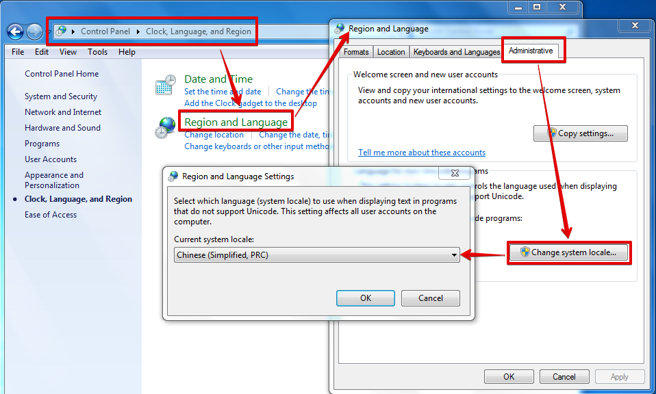

图中的系统locale为简体中文，意味着当前“ANSI编码”实际是GBK编码。当你把它改成Korean(Korea)时，“ANSI编码”实际是EUC-KR编码，“한국어”就能正常显示了；当你把它改成English(US)时，“ANSI编码”实际是ASCII编码，“汉字”和“한국어”都成乱码了。（改了之后需要重启系统的。。。）

说明：locale是国际化与本地化中重要的概念，本文不深入讲解该内容。

 

# 额外文献

[通用字符集](https://zh.wikipedia.org/wiki/%E9%80%9A%E7%94%A8%E5%AD%97%E7%AC%A6%E9%9B%86)		