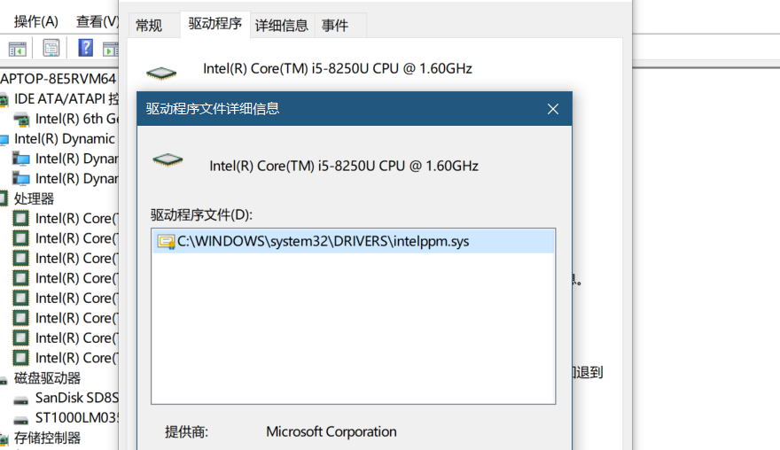

# 介绍

1. 驱动是什么？
2. 驱动是否一定要有一个单独的文件？

驱动是指**操作系统跟硬件交互的代码**，驱动**可以是一个单独的文件，也可以不是**。

明确了这个定义，那么CPU和内存是否需要驱动的答案就已经很明确的：**需要，肯定需要**。

大多数情况下，这部分内容都是做进内核里的，所以我们看不到一个单独的CPU/内存驱动，但不代表这部分功能不存在。

但某些高级功能就需要额外的支持的，比如高级电源管理

真正的Windows内核是一个很小的东西，它是c:\windows\system32\ntoskrnl.exe，这个文件才几M大小，而安装一个Windows需要几G甚至十几G的大小，其中有接近一半，甚至超过一半的内容都是驱动相关的。

你按下键盘上的按键到软件收到按键信息，需要很多驱动的支持，你动一下鼠标，同样需要很多驱动来支持，甚至你在打开网页的这段时间里，也有无数的驱动参与工作。

驱动程序的最大作用就是让你的应用软件不直接操作硬件。你不需要知道你的磁盘是什么型号的，用什么接口，接在什么上面，你只需要知道盘符、路径、文件就可以访问文件，这就是驱动的意义，把各种差异化的硬件特性隐藏起来，封装成统一的接口供你使用（当然，这少不了硬件的支持）

**硬件厂商通过驱动这个中间层，使得操作系统无需知道硬件的工作原理之类细节统一调度硬件**；操作系统通过API这个中间层，使得应用程序员不必知道如何和硬件通信，告诉它打印就行；应用程序员则通过美图秀秀这个中间层，使得傻瓜用户——说你呢——什么都不必懂，点一个按钮就能成为照骗达人……

另一个方向，我们可以在PC上跑PS2模拟器、Android模拟器；这个模拟器负责把PC机的CPU、磁盘文件等等模拟成游戏机或手机——把arm或其他异种CPU指令翻译成x86指令，从而在PC上模拟运行游戏机/手机上的程序。

这个中间层的作用也非常非常类似“驱动程序”；只是它是PC上所有硬件到PS环境的驱动——我们叫它“模拟器”。

因为“我们只把操作系统和硬件设备之间的中间层叫驱动程序”，而操作系统必须以CPU自己的指令集指挥CPU——不然性能太差。

举例来说，当年微内核和宏内核之争，最终谁都没赢：微内核想法虽好，但它需要太多太多的执行权切换，这种性能代价几乎无法承受。

因此，操作系统是必须针对特定CPU指令集开发的——比如X86、X86-64、ARM等，就是所谓的CPU指令集；而i3、i5……以及AMD的锐龙等等，都支持X86-64指令集。

甚至，现代CPU，对外提供X86/X86-64指令集，其实内部会翻译成一堆op code——从而对外表现为支持X86的复杂指令集计算机；但内部却吸收了精简指令集计算机的大量长处……这是不是可以看作“硬件自带驱动”呢？

类似的，大多打印机不需要专门装驱动。因为它们都支持那套“打印控制指令”——打印机可以直接接受控制指令，然后通过打印机内置的微处理器翻译执行。这就是所谓的“免驱设备”。只是装了驱动还可以支持厂商提供的其他特色功能而已（这些特色功能并不在标准的打印指令支持范围内）。

但另一方面，对性能要求苛刻的场景里，我们可能需要直接指挥CPU，以便充分压榨它的性能——比如，我们可以先侦测它是不是支持SSE/MMX，然后决定是不是执行SIMD版的find函数：通过内嵌汇编实现。

内存为何没有驱动？

答：内存太基本了，直接地址读写就完了，无需翻译，所以不需要驱动。

# 基础驱动

显卡的bios加载是在你开机显示器启动的一刹那就加载上的，如果没有安装显卡驱动，你在设备管理器里面能够看到一个叫兼容vga设备，这就是一个你可以理解为一个最小显卡

# 参考资料

[为什么显卡、声卡甚至鼠标键盘有驱动，而CPU、内存没有驱动？驱动程序又是什么？](https://www.zhihu.com/question/26119207)

[为什么没有显卡驱动可以点亮屏幕，没有网卡驱动就不能上网？为什么所有的网卡不能共同支持一个基础驱动？](https://www.zhihu.com/question/57992102)