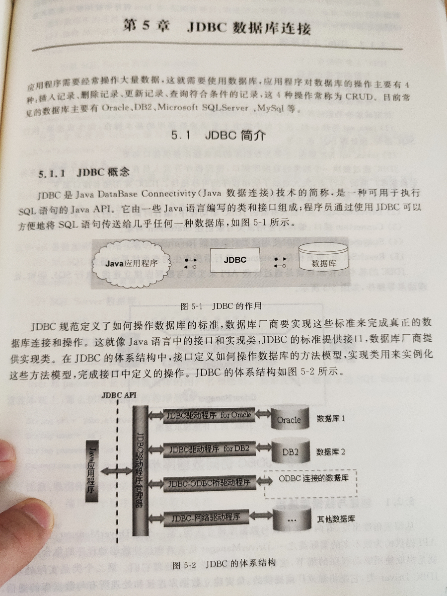
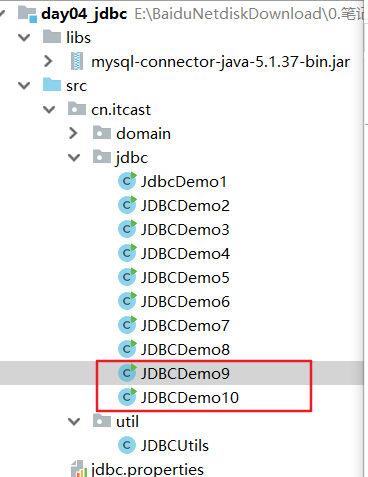
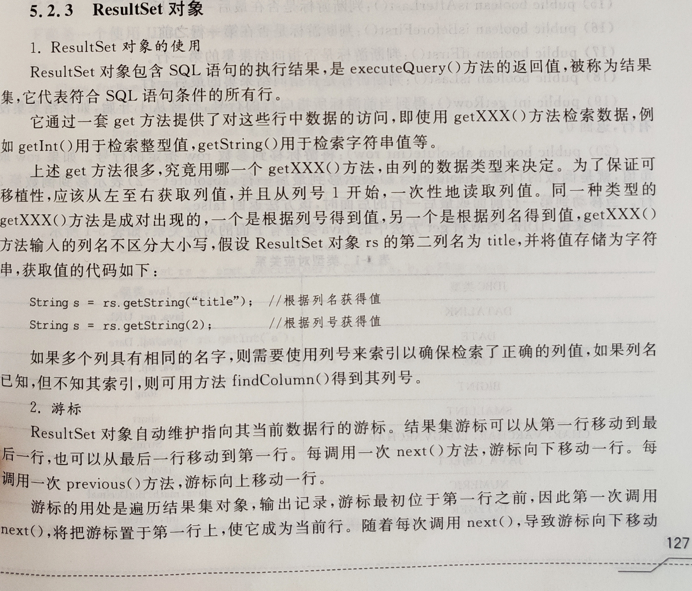
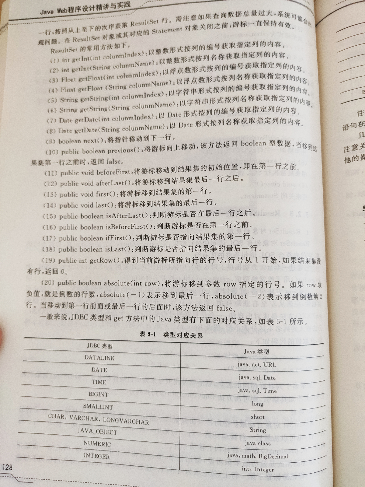
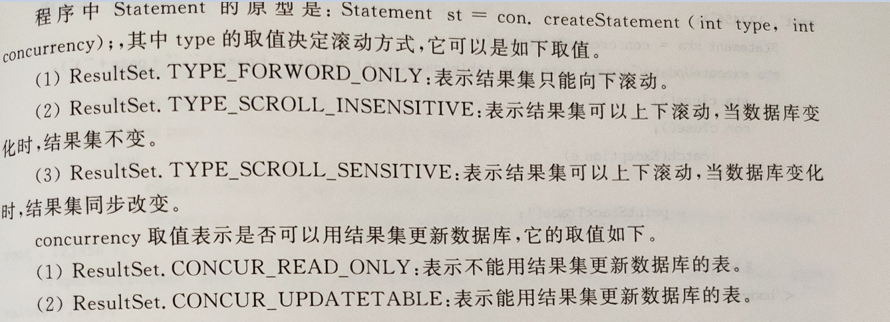
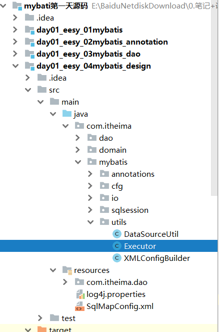
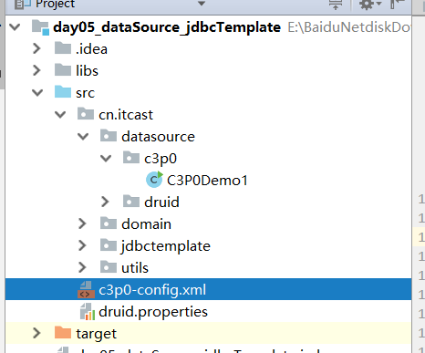
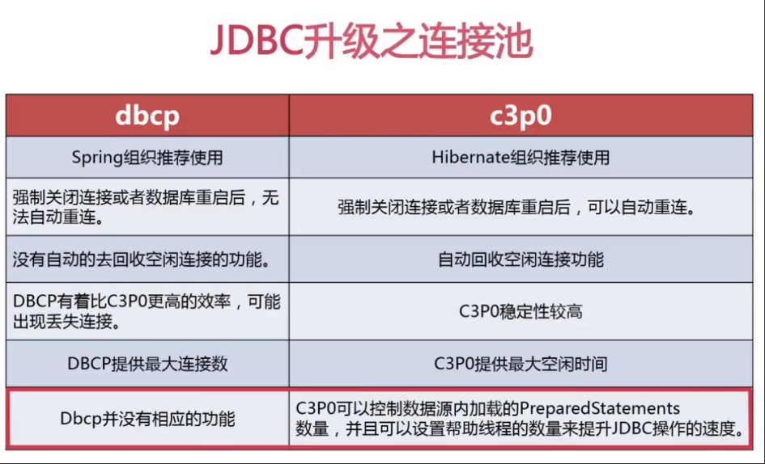
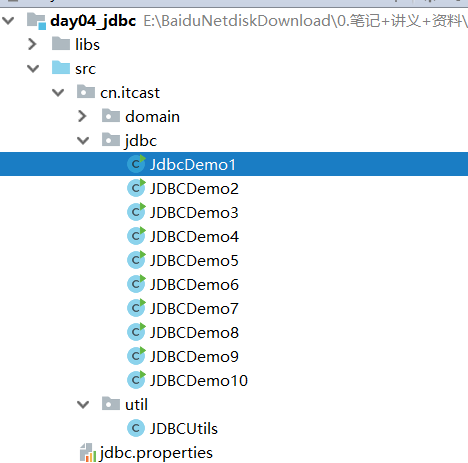
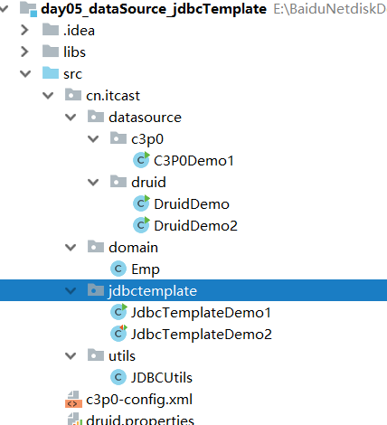

# 介绍

Java DataBase Connectivity  Java 数据库连接， Java语言操作数据库

**JDBC本质**：其实是官方（sun公司）定义的一套操作所有关系型数据库的规则，即接口。各个数据库厂商去实现这套接口，提供数据库驱动jar包。我们可以使用这套接口（JDBC）编程，真正执行的代码是驱动jar包中的实现类。



# 快速入门

```java
//1. 导入驱动jar包，runtime
//2.注册驱动
Class.forName("com.mysql.jdbc.Driver");
//3.获取数据库连接对象
Connection conn = DriverManager.getConnection("jdbc:mysql://localhost:3306/db3", "root", "root");
//4.定义sql语句
String sql = "update account set balance = 500 where id = 1";
//5.获取执行sql的对象 Statement
Statement stmt = conn.createStatement();
//6.执行sql
int count = stmt.executeUpdate(sql);
//7.处理结果
System.out.println(count);
//8.释放资源
stmt.close();
conn.close();
```


# DriverManager

## 注册驱动

告诉程序该使用哪一个数据库驱动jar

```java
static void registerDriver(Driver driver) :注册与给定的驱动程序 DriverManager 。 
```

注意：mysql5之后的驱动jar包可以省略注册驱动的步骤。

```java
Class.forName("com.mysql.jdbc.Driver");
```

```java
//通过查看源码发现：在com.mysql.jdbc.Driver类中存在静态代码块
static {
    try {
        java.sql.DriverManager.registerDriver(new Driver());
    } catch (SQLException E) {
        throw new RuntimeException("Can't register driver!");
    }
}
```

## 获取连接

```java
static Connection getConnection(String url, String user, String password) ;
// url：指定连接的路径
// 		语法：jdbc:mysql://ip地址(域名):端口号/数据库名称
// 		例子：jdbc:mysql://localhost:3306/db3
// 		如果连接的是本机mysql服务器，并且mysql服务默认端口是3306，则url可以简写为：jdbc:mysql:///数据库名称
// user：用户名
// password：密码 
```

# Connection

```java
			1. 获取执行sql 的对象
				* Statement createStatement()
				* PreparedStatement prepareStatement(String sql)  
			2. 管理事务：
				* 开启事务：setAutoCommit(boolean autoCommit) ：调用该方法设置参数为false，即开启事务
				* 提交事务：commit() 
				* 回滚事务：rollback() 
```

# Statement

简单statement

```java
boolean execute(String sql); //可以执行任意的sql 了解 
int executeUpdate(String sql);//执行DML（insert、update、delete）语句、DDL(create，alter、drop)语句 
//返回值：影响的行数，可以通过这个影响的行数判断DML语句是否执行成功 返回值>0的则执行成功，反之，则失败。
ResultSet executeQuery(String sql);  //执行DQL（select)语句
```


# PreparedStatement

预编译statement

## 优势

1. 简化Statement中的操作

2. 提高执行语句的性能，大部分数据库都会对预编译语句进行优化，并且缓存起来再次复用，之后便不需要编译，直接使用。

   如果为每个查询或数据库更新提交新的完整SQL语句，则数据库必须解析SQL，并为查询创建查询计划。通过重用现有的PreparedStatement，可以为后续查询重用SQL解析和查询计划。这通过减少每个执行的解析和查询计划开销来加速查询执行。

   **两个潜在的重用（复用）级别。**

   - JDBC驱动程序重新使用PreparedStatement。
   - 数据库重用PreparedStatement。

3. 可读性和可维护性更好

4. 安全性更好。 注入只对SQL语句的编译过程有破坏作用，而执行阶段只是把输入串作为数据处理，不再需要对SQL语句进行解析，因此也就避免了类似`select * from user where name='aa' and password='bb' or 1=1`的sql注入问题的发生。

## 区别

- 关系：PreparedStatement继承自Statement,都是接口
- 区别：PreparedStatement可以使用占位符，是预编译的，批处理比Statement效率高

```java
//执行sql不需要再次传入sql语句，因为已经包含在PreparedStatement中，而且PreparedStatement也已经设置过参数了
preparedStatement.setString(1,"Fant.J");
preparedStatement.setInt(2,27);
rs = PreparedStatement.executeQuery();//查询
PreparedStatement.executeUpdate();
```

## 代码



# CallableStatement

```java
// The interface used to execute SQL stored procedures.
public interface CallableStatement extends PreparedStatement {
```

# ResultSet







```java
	4. ResultSet：结果集对象,封装查询结果
		* boolean next(): 游标向下移动一行，判断当前行是否是最后一行末尾(是否有数据)，如果是，则返回false，如果不是则返回true
		* getXxx(参数):获取数据
			* Xxx：代表数据类型   如： int getInt() ,	String getString()
			* 参数：
				1. int：代表列的编号,从1开始   如： getString(1)
				2. String：代表列名称。 如： getDouble("balance")
		
		* 注意：
			* 使用步骤：
				1. 游标向下移动一行
				2. 判断是否有数据
				3. 获取数据

			   //循环判断游标是否是最后一行末尾。
	            while(rs.next()){
	                //获取数据
	                //6.2 获取数据
	                int id = rs.getInt(1);
	                String name = rs.getString("name");
	                double balance = rs.getDouble(3);
	
	                System.out.println(id + "---" + name + "---" + balance);
	            }
```

一些比较复杂的方法

```java
    public <E> List<E> selectList(Mapper mapper, Connection conn) {
        PreparedStatement pstm = null;
        ResultSet rs = null;
        try {
            //1.取出mapper中的数据
            String queryString = mapper.getQueryString();//select * from user
            String resultType = mapper.getResultType();//com.itheima.domain.User
            Class domainClass = Class.forName(resultType);
            //2.获取PreparedStatement对象
            pstm = conn.prepareStatement(queryString);
            //3.执行SQL语句，获取结果集
            rs = pstm.executeQuery();
            //4.封装结果集
            List<E> list = new ArrayList<E>();//定义返回值
            while(rs.next()) {
                //实例化要封装的实体类对象
                E obj = (E)domainClass.newInstance();

                //取出结果集的元信息：ResultSetMetaData
                ResultSetMetaData rsmd = rs.getMetaData();
                //取出总列数
                int columnCount = rsmd.getColumnCount();
                //遍历总列数
                for (int i = 1; i <= columnCount; i++) {
                    //获取每列的名称，列名的序号是从1开始的
                    String columnName = rsmd.getColumnName(i);
                    //根据得到列名，获取每列的值
                    Object columnValue = rs.getObject(columnName);
                    //给obj赋值：使用Java内省机制（借助PropertyDescriptor实现属性的封装）
                    PropertyDescriptor pd = new PropertyDescriptor(columnName,domainClass);//要求：实体类的属性和数据库表的列名保持一种
                    //获取它的写入方法
                    Method writeMethod = pd.getWriteMethod();
                    //把获取的列的值，给对象赋值
                    writeMethod.invoke(obj,columnValue);
                }
                //把赋好值的对象加入到集合中
                list.add(obj);
            }
            return list;
        } catch (Exception e) {
            throw new RuntimeException(e);
        } finally {
            release(pstm,rs);
        }
    }
```



# DataSource

## 介绍

```java
1. 概念：其实就是一个容器(集合)，存放数据库连接的容器。
	    当系统初始化好后，容器被创建，容器中会申请一些连接对象，当用户来访问数据库时，从容器中获取连接对象，用户访问完之后，会将连接对象归还给容器。

2. 好处：
	1. 节约资源
	2. 用户访问高效

3. 实现：
	1. 标准接口：DataSource   javax.sql包下的
		1. 方法：
			* 获取连接：getConnection()
			* 归还连接：Connection.close()。如果连接对象Connection是从连接池中获取的，那么调用Connection.close()方法，则不会再关闭连接了。而是归还连接

	2. 一般我们不去实现它，有数据库厂商来实现
    
```

**类型**

- 通用型数据源（javax.sql.DataSource）
  - 主要使用场景：通用型数据库，本地事务，一般通过Socket方式连接。
- 分布式数据源（javax.sql.XADataSource）
  - 主要使用场景：通用型数据库，分布式事务，一般通过Socket方式连接。
- 嵌入式数据源（org.springframework.jdbc.datasource.embedded.EmbeddedDatabase）
  - 主要使用场景：本地文件系统数据库，如：HSQL、H2、Derby等。
  - 枚举：org.springframework.jdbc.datasource.embedded.EmbeddedDatabaseType

## 实现厂商

#### DBCP

aphahe的，略，也是控制反转，xml里面配置

#### C3P0

```java
4. C3P0：数据库连接池技术
	* 步骤：
		1. 导入jar包 (两个) c3p0-0.9.5.2.jar mchange-commons-java-0.2.12.jar ，
			* 不要忘记导入数据库驱动jar包
		2. 定义配置文件：
			* 名称： c3p0.properties 或者 c3p0-config.xml
			* 路径：直接将文件放在src目录下即可。

		3. 创建核心对象 数据库连接池对象 ComboPooledDataSource
		4. 获取连接： getConnection
	* 代码：
		 //1.创建数据库连接池对象
        DataSource ds  = new ComboPooledDataSource();
        //2. 获取连接对象
        Connection conn = ds.getConnection();
```



#### Druid

```java
1. 导入jar包 druid-1.0.9.jar
    2. 定义配置文件：
    * 是properties形式的
    * 可以叫任意名称，可以放在任意目录下
    3. 加载配置文件。Properties
    4. 获取数据库连接池对象：通过工厂来来获取  DruidDataSourceFactory
    5. 获取连接：getConnection
    * 代码：
    //3.加载配置文件
    Properties pro = new Properties();
InputStream is = DruidDemo.class.getClassLoader().getResourceAsStream("druid.properties");
pro.load(is);
//4.获取连接池对象
DataSource ds = DruidDataSourceFactory.createDataSource(pro);
//5.获取连接
Connection conn = ds.getConnection();
```

#### 区别



# 关闭连接

最后resultset、connection、statement都要关闭

# 代码



# JDBC简单工具

## # Commons-dbutils

Apache组织提供的一个开源JDBC工具类库对传统操作数据库的类进行二次封装，可以把结果集转化成List.

## Spring JdbcTemplate

Spring框架对JDBC的简单封装。提供了一个JDBCTemplate对象简化JDBC的开发

1. 导入jar包

2. 创建JdbcTemplate对象。依赖于数据源DataSource
   
```java
    JdbcTemplate template = new JdbcTemplate(ds);
```

3. 调用JdbcTemplate的方法来完成CRUD的操作
   
    ```java
    update()  		//执行DML语句。增、删、改语句
    queryForMap()  //查询结果将结果集封装为map集合，将列名作为key，将值作为value 将这条记录封装为一个map集合，这个方法查询的结果集长度只能是1
    queryForList()  //查询结果将结果集封装为list集合 ，注意：将每一条记录封装为一个Map集合，再将Map集合装载到List集合中
    query()  //查询结果，将结果封装为JavaBean对象
     	//query的参数：RowMapper
      	//一般我们使用BeanPropertyRowMapper实现类。可以完成数据到JavaBean的自动封装
     	//new BeanPropertyRowMapper<类型>(类型.class)
    queryForObject  //查询结果，将结果封装为对象，一般用于聚合函数的查询
    ```




# jdbc 问题分析

为什么使用框架

1. 数据库链接创建、释放频繁造成系统资源浪费从而影响系统性能，如果使用数据库链接池可解决此问题。
2. Sql 语句在代码中硬编码，造成代码不易维护，实际应用 sql 变化的可能较大， sql 变动需要改变 java代码。
3. 使用 preparedStatement 向占有位符号传参数存在硬编码，因为 sql 语句的 where 条件不一定，可能多也可能少，修改 sql 还要修改代码，系统不易维护。
4. 对结果集解析存在硬编码（查询列名）， sql 变化导致解析代码变化，系统不易维护，如果能将数据库记录封装成 pojo 对象解析比较方便。  

