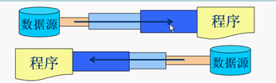
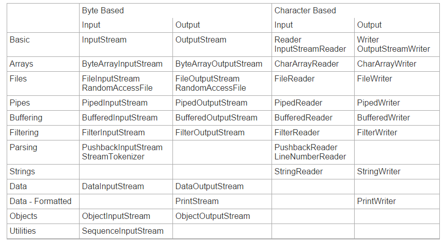
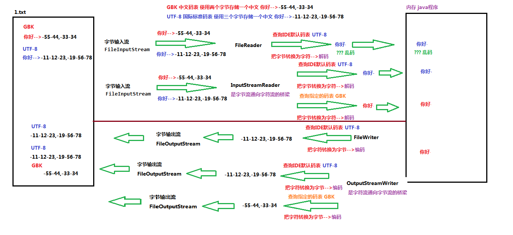
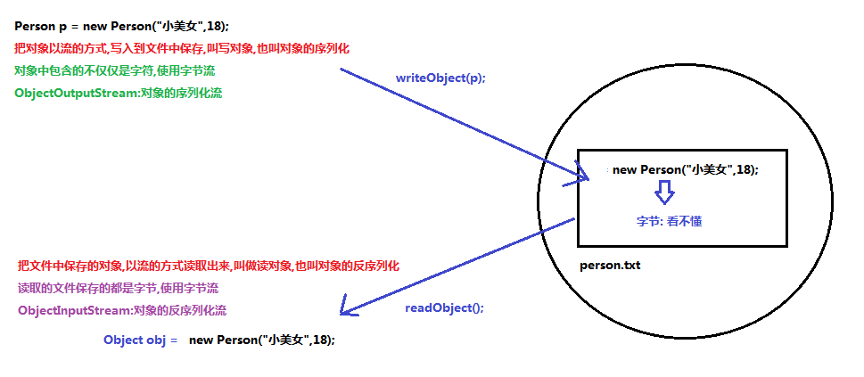
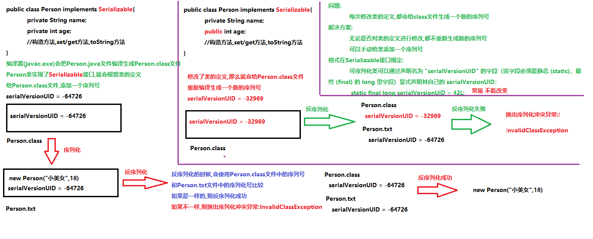
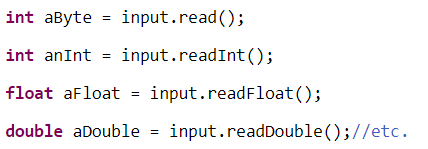
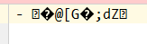
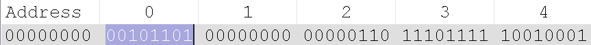

# 介绍

## Java.io 包

 **Java.io 包的范围**

java.io 包并没有涵盖所有输入输出类型。例如，并不包含GUI或者网页上的输入输出，这些输入和输出在其它地方都涉及，比如Swing工程中的JFC (Java Foundation Classes) 类，或者J2EE里的Servlet和HTTP包。

Java.io 包主要涉及文件，网络数据流，内存缓冲等的输入输出。

**更多的Java IO工具，提示等**

这个手册也被称为” [Java How To’s and Utilities](http://tutorials.jenkov.com/java-howto/index.html) ”，包含一些Java IO的工具，例如替换流数据中的字符串，使用缓冲来反复处理流数据。

### 输入和输出

输入和输出和数据源和目标媒介相关联。

输入流可以理解为向内存输入，输出流可以理解为从内存输出。

程序就是一个操作内存的东西，因此，操作程序就是操作内存，向内存输入就是向程序输入，从内存输出就是向另一个程序输入。（输入到另一块内存）

Java的IO包主要关注的是从原始数据源的读取以及输出原始数据到目标媒介。以下是最典型的数据源和目标媒介：

- 文件

- 管道

- 网络连接

- 内存缓存

- System.in, System.out, System.error（注：Java标准输入、输出、错误输出）

  

## 流

在Java IO中，流是一个核心的概念。**流从概念上来说是一个连续的数据流**，是对数据传输的总称或抽象。即**数据在两设备间的传输称为流**，流的本质是数据传输，根据数据传输特性将流抽象为各种类，方便更直观的进行数据操作。

你既可以从流中读取数据，也可以往流中写数据。流与数据源或者数据流向的媒介相关联。在Java IO中流既可以是字节流(以字节为单位进行读写)，也可以是字符流(以字符为单位进行读写)。

## IO流的分类

- 根据处理数据类型的不同分为：字符流和字节流
- 根据数据流向不同分为：输入流和输出流

#### 字符流、字节流

**字符流的由来**： 因为数据编码的不同，而有了对字符进行高效操作的流对象。本质其实就是基于字节流读取时，去查了指定的码表。 字节流和字符流的区别：

- 读写单位不同：字节流以字节（8bit）为单位，字符流以字符为单位，根据码表映射字符，一次可能读多个字节。


- 处理对象不同：字节流能处理所有类型的数据（如图片、avi等），而字符流只能处理字符类型的数据。


- 字节流：一次读入或读出是8位二进制。


- 字符流：一次读入或读出是16位二进制。

设备上的数据无论是图片或者视频，文字，它们都以二进制存储的。二进制的最终都是以一个8位为数据单元进行体现，所以计算机中的最小数据单元就是字节。意味着，字节流可以处理设备上的所有数据，所以字节流一样可以处理字符数据。在操作流的时候，我们要时刻明确，无论使用什么样的流对象，底层传输的始终为二进制数据。

**结论：只要是处理纯文本数据，就优先考虑使用字符流。 除此之外都使用字节流。**

#### 输入流、输出流

输入流只能进行读操作，输出流只能进行写操作，程序中需要根据待传输数据的不同特性而使用不同的流。

#### 节点流、处理流

##### 节点流

节点流：直接与数据源相连，读入或读出。
直接使用节点流，读写不方便，为了更快的读写文件，才有了处理流。


- 父　类 ：`InputStream` 、`OutputStream`、 `Reader`、 `Writer`
- 文　件 ：`FileInputStream` 、 `FileOutputStrean` 、`FileReader` 、`FileWriter` 文件进行处理的节点流
- 数　组 ：`ByteArrayInputStream`、 `ByteArrayOutputStream`、 `CharArrayReader` 、`CharArrayWriter` 对数组进行处理的节点流（对应的不再是文件，而是内存中的一个数组）
- 字符串 ：`StringReader`、 `StringWriter` 对字符串进行处理的节点流
- 管　道 ：`PipedInputStream` 、`PipedOutputStream` 、`PipedReader` 、`PipedWriter` 对管道进行处理的节点流

##### 处理流

处理流和节点流一块使用，在节点流的基础上，再套接一层，套接在节点流上的就是处理流。如`BufferedReader`.处理流的构造方法总是要带一个其他的流对象做参数。一个流对象经过其他流的多次包装，称为流的链接。



- 缓冲流：BufferedInputStrean 、BufferedOutputStream、 BufferedReader、 BufferedWriter 增加缓冲功能，避免频繁读写硬盘。
- 转换流：InputStreamReader 、OutputStreamReader实现字节流和字符流之间的转换。
- 数据流： DataInputStream 、DataOutputStream 等-提供将基础数据类型写入到文件中，或者读取出来。

#### 转换流

`InputStreamReader` 、`OutputStreamWriter` 要`InputStream`或`OutputStream`作为参数，实现从字节流到字符流的转换。

```java
InputStreamReader(InputStream);        //通过构造函数初始化，使用的是本系统默认的编码表GBK。
InputStreamReader(InputStream,String charSet);   //通过该构造函数初始化，可以指定编码表。
OutputStreamWriter(OutputStream);      //通过该构造函数初始化，使用的是本系统默认的编码表GBK。
OutputStreamwriter(OutputStream,String charSet);   //通过该构造函数初始化，可以指定编码表。
```


## Java IO的用途和特征

Java IO中包含了许多InputStream、OutputStream、Reader、Writer的子类。这样设计的原因是让每一个类都负责不同的功能。这也就是为什么IO包中有这么多不同的类的缘故。各类用途汇总如下：

- 文件访问
- 网络访问
- 内存缓存访问
- 线程内部通信(管道)
- 缓冲
- 过滤
- 解析
- 读写文本 (Readers / Writers)
- 读写基本类型数据 (long, int etc.)
- 读写对象

## Java IO类概述表

已经讨论了数据源、目标媒介、输入、输出和各类不同用途的Java IO类，接下来是一张通过输入、输出、基于字节或者字符、以及其他比如缓冲、解析之类的特定用途划分的大部分Java IO类的表格。



## 装饰者模式

静态代理的一种

首先是输入流的最高超类-InputStream，该类也可以算是装饰者模式的最高级超类(装饰者模式-装饰者组合被装饰者类，调用被装饰者类的方法实现具体功能，装饰者则对其实现适当增加功能(如果是减少功能则可理解为适配器模式))。

然后有一个FilterInputStream类，继承InputStream，则可算是装饰者模式的装饰者超类。

## 注意

在实际的项目中，所有的IO操作都应该放到子线程中操作，避免堵住主线程。


# InputStreamReader、OutputStreamWriter

## 2.1 字符编码和字符集

### 字符编码

计算机中储存的信息都是用二进制数表示的，而我们在屏幕上看到的数字、英文、标点符号、汉字等字符是二进制数转换之后的结果。按照某种规则，将字符存储到计算机中，称为**编码** 。反之，将存储在计算机中的二进制数按照某种规则解析显示出来，称为**解码** 。比如说，按照A规则存储，同样按照A规则解析，那么就能显示正确的文本符号。反之，按照A规则存储，再按照B规则解析，就会导致乱码现象。

编码:字符(能看懂的)--字节(看不懂的)

解码:字节(看不懂的)-->字符(能看懂的)

* **字符编码`Character Encoding`** : 就是一套自然语言的字符与二进制数之间的对应规则。

  编码表:生活中文字和计算机中二进制的对应规则

### 字符集

* **字符集 `Charset`**：也叫编码表。是一个系统支持的所有字符的集合，包括各国家文字、标点符号、图形符号、数字等。

计算机要准确的存储和识别各种字符集符号，需要进行字符编码，一套字符集必然至少有一套字符编码。常见字符集有ASCII字符集、GBK字符集、Unicode字符集等。

可见，当指定了**编码**，它所对应的**字符集**自然就指定了，所以**编码**才是我们最终要关心的。

* **ASCII字符集** ：
  * ASCII（American Standard Code for Information Interchange，美国信息交换标准代码）是基于拉丁字母的一套电脑编码系统，用于显示现代英语，主要包括控制字符（回车键、退格、换行键等）和可显示字符（英文大小写字符、阿拉伯数字和西文符号）。
  * 基本的ASCII字符集，使用7位（bits）表示一个字符，共128字符。ASCII的扩展字符集使用8位（bits）表示一个字符，共256字符，方便支持欧洲常用字符。基本的ASCII字符集也是八位，首位是0；扩展首位是1
* **ISO-8859-1字符集**：
  * 拉丁码表，别名Latin-1，用于显示欧洲使用的语言，包括荷兰、丹麦、德语、意大利语、西班牙语等。
  * ISO-8859-1使用单字节编码，兼容ASCII编码。
* **GBxxx字符集**：
  * GB就是国标的意思，是为了显示中文而设计的一套字符集。
  * **GB2312**：简体中文码表。一个小于127的字符的意义与原来相同。但两个大于127的字符连在一起时，就表示一个汉字，这样大约可以组合了包含7000多个简体汉字，此外数学符号、罗马希腊的字母、日文的假名们都编进去了，连在ASCII里本来就有的数字、标点、字母都统统重新编了两个字节长的编码，这就是常说的"全角"字符，而原来在127号以下的那些就叫"半角"字符了。
  * **GBK**：最常用的中文码表。是在GB2312标准基础上的扩展规范，使用了双字节编码方案，共收录了21003个汉字，完全兼容GB2312标准，同时支持繁体汉字以及日韩汉字等。GBK默认中文编码表，windows系统用的。
  * **GB18030**：最新的中文码表。收录汉字70244个，采用多字节编码，每个字可以由1个、2个或4个字节组成。支持中国国内少数民族的文字，同时支持繁体汉字以及日韩汉字等。
* **Unicode字符集** ：
  * Unicode编码系统为表达任意语言的任意字符而设计，是业界的一种标准，也称为统一码、标准万国码。
  * 它最多使用4个字节的数字来表达每个字母、符号，或者文字。有三种编码方案，UTF-8、UTF-16和UTF-32。最为常用的UTF-8编码。
  * UTF-8编码，可以用来表示Unicode标准中任何字符，它是电子邮件、网页及其他存储或传送文字的应用中，优先采用的编码。互联网工程工作小组（IETF）要求所有互联网协议都必须支持UTF-8编码。所以，我们开发Web应用，也要使用UTF-8编码。它使用一至四个字节为每个字符编码，编码规则：
    1. 128个US-ASCII字符，只需一个字节编码。
    2. 拉丁文等字符，需要二个字节编码。 
    3. 大部分常用字（含中文），使用三个字节编码。
    4. 其他极少使用的Unicode辅助字符，使用四字节编码。

## 2.2 编码引出的问题

> writer的问题，读取字符才需要用

在IDEA中，使用`FileReader` 读取项目中的文本文件。由于IDEA的设置，都是默认的`UTF-8`编码，所以没有任何问题。但是，当读取Windows系统中创建的文本文件时，由于Windows系统的默认是GBK编码，就会出现乱码。

```java
public class ReaderDemo {
    public static void main(String[] args) throws IOException {
        FileReader fileReader = new FileReader("E:\\File_GBK.txt");
        int read;
        while ((read = fileReader.read()) != -1) {
            System.out.print((char)read);
        }
        fileReader.close();
    }
}
输出结果：
���

```



那么如何读取GBK编码的文件呢？ 

## 2.3 InputStreamReader类

转换流`java.io.InputStreamReader`，是Reader的子类，是从字节流到字符流的桥梁。它读取字节，并使用指定的字符集将其解码为字符。它的字符集可以由名称指定，也可以接受平台的默认字符集。 

> 有一个中间过程，把GBK的编码转化为jvm的utf-16编码

### 构造方法

* `InputStreamReader(InputStream in)`: 创建一个使用默认字符集的字符流。 
* `InputStreamReader(InputStream in, String charsetName)`: 创建一个指定字符集的字符流。

构造举例，代码如下： 

```java
InputStreamReader isr = new InputStreamReader(new FileInputStream("in.txt"));
InputStreamReader isr2 = new InputStreamReader(new FileInputStream("in.txt") , "GBK");

```

### 指定编码读取

```java
public class ReaderDemo2 {
    public static void main(String[] args) throws IOException {
      	// 定义文件路径,文件为gbk编码
        String FileName = "E:\\file_gbk.txt";
      	// 创建流对象,默认UTF8编码
        InputStreamReader isr = new InputStreamReader(new FileInputStream(FileName));
      	// 创建流对象,指定GBK编码
        InputStreamReader isr2 = new InputStreamReader(new FileInputStream(FileName) , "GBK");
		// 定义变量,保存字符
        int read;
      	// 使用默认编码字符流读取,乱码
        while ((read = isr.read()) != -1) {
            System.out.print((char)read); // ��Һ�
        }
        isr.close();
      
      	// 使用指定编码字符流读取,正常解析
        while ((read = isr2.read()) != -1) {
            System.out.print((char)read);// 大家好
        }
        isr2.close();
    }
}

```

## 2.4 OutputStreamWriter类

转换流`java.io.OutputStreamWriter` ，是Writer的子类，是从字符流到字节流的桥梁。使用指定的字符集将字符编码为字节。它的字符集可以由名称指定，也可以接受平台的默认字符集。 

### 构造方法

- `OutputStreamWriter(OutputStream in)`: 创建一个使用默认字符集的字符流。 
- `OutputStreamWriter(OutputStream in, String charsetName)`: 创建一个指定字符集的字符流。

构造举例，代码如下： 

```java
OutputStreamWriter isr = new OutputStreamWriter(new FileOutputStream("out.txt"));
OutputStreamWriter isr2 = new OutputStreamWriter(new FileOutputStream("out.txt") , "GBK");

```

### 指定编码写出

```java
public class OutputDemo {
    public static void main(String[] args) throws IOException {
      	// 定义文件路径
        String FileName = "E:\\out.txt";
      	// 创建流对象,默认UTF8编码
        OutputStreamWriter osw = new OutputStreamWriter(new FileOutputStream(FileName));
        // 写出数据
      	osw.write("你好"); // 保存为6个字节
        osw.close();
      	
		// 定义文件路径
		String FileName2 = "E:\\out2.txt";
     	// 创建流对象,指定GBK编码
        OutputStreamWriter osw2 = new OutputStreamWriter(new FileOutputStream(FileName2),"GBK");
        // 写出数据
      	osw2.write("你好");// 保存为4个字节
        osw2.close();
    }
}

```

### 转换流理解图解

**转换流是字节与字符间的桥梁！**

## 2.5 练习：转换文件编码

将GBK编码的文本文件，转换为UTF-8编码的文本文件。

### 案例分析

1. 指定GBK编码的转换流，读取文本文件。
2. 使用UTF-8编码的转换流，写出文本文件。

### 案例实现

```java
public class TransDemo {
   public static void main(String[] args) {      
    	// 1.定义文件路径
     	String srcFile = "file_gbk.txt";
        String destFile = "file_utf8.txt";
		// 2.创建流对象
    	// 2.1 转换输入流,指定GBK编码
        InputStreamReader isr = new InputStreamReader(new FileInputStream(srcFile) , "GBK");
    	// 2.2 转换输出流,默认utf8编码
        OutputStreamWriter osw = new OutputStreamWriter(new FileOutputStream(destFile));
		// 3.读写数据
    	// 3.1 定义数组
        char[] cbuf = new char[1024];
    	// 3.2 定义长度
        int len;
    	// 3.3 循环读取
        while ((len = isr.read(cbuf))!=-1) {
            // 循环写出
          	osw.write(cbuf,0,len);
        }
    	// 4.释放资源
        osw.close();
        isr.close();
  	}
}

```

# ObjectOutputStream 、ObjectInputStream

## 3.1 概述

Java 提供了一种对象**序列化**的机制。用一个字节序列可以表示一个**对象**，该字节序列包含该`对象的数据`、`对象的类型`和`对象中存储的属性`等信息。字节序列写出到文件之后，相当于文件中**持久保存**了一个对象的信息。 

反之，该字节序列还可以从文件中读取回来，重构对象，对它进行**反序列化**。`对象的数据`、`对象的类型`和`对象中存储的数据`信息，都可以用来在内存中创建对象。看图理解序列化： 

> 注意 ：
>
> ​		仅仅是对象，static不可以
>
> ​		静态优先于非静态加载到内存中(静态优先于对象进入到内存中
>
> ​		被static修饰的成员变量不能被序列化的,序列化的都是对象

## 3.2 ObjectOutputStream类

`java.io.ObjectOutputStream ` 类，将Java对象的原始数据类型写出到文件,实现对象的持久存储。

### 构造方法

* `public ObjectOutputStream(OutputStream out) `： 创建一个指定OutputStream的ObjectOutputStream。

构造举例，代码如下：  

```java
FileOutputStream fileOut = new FileOutputStream("employee.txt");
ObjectOutputStream out = new ObjectOutputStream(fileOut);

```

### 序列化操作

1. 一个对象要想序列化，必须满足两个条件:

* 该类必须实现`java.io.Serializable ` 接口，`Serializable` 是一个标记接口，不实现此接口的类将不会使任何状态序列化或反序列化，会抛出`NotSerializableException` 。
* 该类的所有属性必须是可序列化的。如果有一个属性不需要可序列化的，则该属性必须注明是瞬态的，使用`transient` 关键字修饰。

```java
public class Employee implements java.io.Serializable {
    public String name;
    public String address;
    public transient int age; // transient瞬态修饰成员,不会被序列化
    public void addressCheck() {
      	System.out.println("Address  check : " + name + " -- " + address);
    }
}

```

2.写出对象方法

* `public final void writeObject (Object obj)` : 将指定的对象写出。

```java
public class SerializeDemo{
   	public static void main(String [] args)   {
    	Employee e = new Employee();
    	e.name = "zhangsan";
    	e.address = "beiqinglu";
    	e.age = 20; 
    	try {
      		// 创建序列化流对象
          ObjectOutputStream out = new ObjectOutputStream(new FileOutputStream("employee.txt"));
        	// 写出对象
        	out.writeObject(e);
        	// 释放资源
        	out.close();
        	fileOut.close();
        	System.out.println("Serialized data is saved"); // 姓名，地址被序列化，年龄没有被序列化。
        } catch(IOException i)   {
            i.printStackTrace();
        }
   	}
}
输出结果：
Serialized data is saved

```



## 3.3 ObjectInputStream类

ObjectInputStream反序列化流，将之前使用ObjectOutputStream序列化的原始数据恢复为对象。 

### 构造方法

* `public ObjectInputStream(InputStream in) `： 创建一个指定InputStream的ObjectInputStream。

### 反序列化操作1

如果能找到一个对象的class文件，我们可以进行反序列化操作，调用`ObjectInputStream`读取对象的方法：

- `public final Object readObject ()` : 读取一个对象。

```java
public class DeserializeDemo {
   public static void main(String [] args)   {
        Employee e = null;
        try {		
             // 创建反序列化流
             FileInputStream fileIn = new FileInputStream("employee.txt");
             ObjectInputStream in = new ObjectInputStream(fileIn);
             // 读取一个对象
             e = (Employee) in.readObject();
             // 释放资源
             in.close();
             fileIn.close();
        }catch(IOException i) {
             // 捕获其他异常
             i.printStackTrace();
             return;
        }catch(ClassNotFoundException c)  {
        	// 捕获类找不到异常
             System.out.println("Employee class not found");
             c.printStackTrace();
             return;
        }
        // 无异常,直接打印输出
        System.out.println("Name: " + e.name);	// zhangsan
        System.out.println("Address: " + e.address); // beiqinglu
        System.out.println("age: " + e.age); // 0
    }
}

```

**对于JVM可以反序列化对象，它必须是能够找到class文件的类。如果找不到该类的class文件，则抛出一个 `ClassNotFoundException` 异常。**  

### **反序列化操作2**

**另外，当JVM反序列化对象时，能找到class文件，但是class文件在序列化对象之后发生了修改，那么反序列化操作也会失败，抛出一个`InvalidClassException`异常。**发生这个异常的原因如下：

* 该类的序列版本号与从流中读取的类描述符的版本号不匹配 
* 该类包含未知数据类型 
* 该类没有可访问的无参数构造方法 

`Serializable` 接口给需要序列化的类，提供了一个序列版本号。`serialVersionUID` 该版本号的目的在于验证序列化的对象和对应类是否版本匹配。

```java
public class Employee implements java.io.Serializable {
     // 加入序列版本号
     private static final long serialVersionUID = 1L;
     public String name;
     public String address;
     // 添加新的属性 ,重新编译, 可以反序列化,该属性赋为默认值.
     public int eid; 

     public void addressCheck() {
         System.out.println("Address  check : " + name + " -- " + address);
     }
}

```



## 3.4 练习：序列化集合

1. 将存有多个自定义对象的集合序列化操作，保存到`list.txt`文件中。
2. 反序列化`list.txt` ，并遍历集合，打印对象信息。

### 案例分析

1. 把若干学生对象 ，保存到集合中。
2. 把集合序列化。
3. 反序列化读取时，只需要读取一次，转换为集合类型。
4. 遍历集合，可以打印所有的学生信息

### 案例实现

```java
public class SerTest {
	public static void main(String[] args) throws Exception {
		// 创建 学生对象
		Student student = new Student("老王", "laow");
		Student student2 = new Student("老张", "laoz");
		Student student3 = new Student("老李", "laol");

		ArrayList<Student> arrayList = new ArrayList<>();
		arrayList.add(student);
		arrayList.add(student2);
		arrayList.add(student3);
		// 序列化操作
		// serializ(arrayList);
		
		// 反序列化  
		ObjectInputStream ois  = new ObjectInputStream(new FileInputStream("list.txt"));
		// 读取对象,强转为ArrayList类型
		ArrayList<Student> list  = (ArrayList<Student>)ois.readObject();
		
      	for (int i = 0; i < list.size(); i++ ){
          	Student s = list.get(i);
        	System.out.println(s.getName()+"--"+ s.getPwd());
      	}
	}

	private static void serializ(ArrayList<Student> arrayList) throws Exception {
		// 创建 序列化流 
		ObjectOutputStream oos = new ObjectOutputStream(new FileOutputStream("list.txt"));
		// 写出对象
		oos.writeObject(arrayList);
		// 释放资源
		oos.close();
	}
}

```


# RandomAccessFile

正如我所提到的，你可以通过RandomAccessFile对文件进行随机存取。

随机存取并不意味着你可以在真正随机的位置进行读写操作，它只是意味着你可以跳过文件中某些部分进行操作，并且支持同时读写，不要求特定的存取顺序。这使得RandomAccessFile可以覆盖一个文件的某些部分、或者追加内容到它的末尾、或者删除它的某些内容，当然它也可以从文件的任何位置开始读取文件。

RandomAccessFile允许你来回读写文件，也可以替换文件中的某些部分。FileInputStream和FileOutputStream没有这样的功能。

### **创建一个RandomAccessFile**

在使用RandomAccessFile之前，必须初始化它。这是例子：

```java
RandomAccessFile file = new RandomAccessFile("c:\\data\\file.txt", "rw");
```

请注意构造函数的第二个参数：“rw”，表明你以读写方式打开文件。请查阅Java文档获知你需要以何种方式构造RandomAccessFile。

#### Access Modes

The Java RandomAccessFile supports the following access modes:

| Mode | Description                                                  |
| :--- | :----------------------------------------------------------- |
| r    | Read mode. Calling write methods will result in an IOException. |
| rw   | Read and write mode.                                         |
| rwd  | Read and write mode - synchronously. All updates to file content is written to the disk synchronously. |
| rws  | Read and write mode - synchronously. All updates to file content or meta data is written to the disk synchronously. |

### **在RandomAccessFile中来回读写**

在RandomAccessFile的某个位置读写之前，必须把文件指针指向该位置。通过seek()方法可以达到这一目标。可以通过调用getFilePointer()获得当前文件指针的位置。例子如下：

```java
RandomAccessFile file = new RandomAccessFile("c:\\data\\file.txt", "rw");

file.seek(200);

long pointer = file.getFilePointer();

file.close();
```

### 文件和目录信息的获取

有时候你可能需要读取文件的信息而不是文件的内容，举个例子，如果你需要知道文件的大小和文件的属性。对于目录来说也是一样的，比如你需要获取某个目录下的文件列表。通过File类可以获取文件和目录的信息。

# PipedOutputStream、PipedInputStream

Java IO中的管道为运行在同一个JVM中的两个线程提供了通信的能力。所以管道也可以作为数据源以及目标媒介。

你不能利用管道与不同的JVM中的线程通信(不同的进程)。在概念上，Java的管道不同于Unix/Linux系统中的管道。在Unix/Linux中，运行在不同地址空间的两个进程可以通过管道通信。在Java中，通信的双方应该是运行在同一进程中的不同线程。

## 通过Java IO创建管道

可以通过Java IO中的PipedOutputStream和PipedInputStream创建管道。一个PipedInputStream流应该和一个PipedOutputStream流相关联。一个线程通过PipedOutputStream写入的数据可以被另一个线程通过相关联的PipedInputStream读取出来。

## Java IO管道示例

这是一个如何将PipedInputStream和PipedOutputStream关联起来的简单例子：

```java
public class PipeExample {

    public static void main(String[] args) throws IOException {

        final PipedOutputStream output = new PipedOutputStream();
        final PipedInputStream  input  = new PipedInputStream(output);


        Thread thread1 = new Thread(new Runnable() {
            @Override
            public void run() {
                try {
                    output.write("Hello world, pipe!".getBytes());
                } catch (IOException e) {
                }
            }
        });


        Thread thread2 = new Thread(new Runnable() {
            @Override
            public void run() {
                try {
                    int data = input.read();
                    while(data != -1){
                        System.out.print((char) data);
                        data = input.read();
                    }
                } catch (IOException e) {
                }
            }
        });

        thread1.start();
        thread2.start();

    }
}
```

注：本例忽略了流的关闭。请在处理流的过程中，务必保证关闭流，或者使用jdk7引入的try-resources代替显示地调用close方法的方式。

你也可以使用两个管道共有的connect()方法使之相关联。PipedInputStream和PipedOutputStream都拥有一个可以互相关联的connect()方法。

## 管道和线程

请记得，当使用两个相关联的管道流时，务必将它们分配给不同的线程。read()方法和write()方法调用时会导致流阻塞，这意味着如果你尝试在一个线程中同时进行读和写，可能会导致线程死锁。

## 管道的替代

除了管道之外，一个JVM中不同线程之间还有许多通信的方式。实际上，**线程在大多数情况下会传递完整的对象信息而非原始的字节数据**。但是，如果你需要在线程之间传递字节数据，Java IO的管道是一个不错的选择。

## PipedOutputStream

所有方法都需要先connnect。

```
It must be connected to a piped input stream, either by the receiver or the sender, before being used.
```

### constructer

```java
	
	public PipedOutputStream() {
    }
    public PipedOutputStream(PipedInputStream snk)  throws IOException {
        connect(snk);
    }
```

### connect

先connect才可以write

```java
    public synchronized void connect(PipedInputStream snk) throws IOException {
        if (snk == null) {
            throw new NullPointerException();
        } else if (sink != null || snk.connected) {
            throw new IOException("Already connected");
        }
        sink = snk;
        snk.in = -1;
        snk.out = 0;
        snk.connected = true;
    }
```

### write

所有write方法都调用PipedInputStream的receive方法传递。

## PipedInputStream

[待解决](https://zhuanlan.zhihu.com/p/28008754)

# system流

System.in, System.out, System.err这3个流同样是常见的数据来源和数据流目的地。使用最多的可能是在控制台程序里利用System.out将输出打印到控制台上。

JVM启动的时候通过Java运行时初始化这3个流，所以你不需要初始化它们(尽管你可以在运行时替换掉它们)。

## System.in

System.in是一个典型的连接控制台程序和键盘输入的InputStream流。通常当数据通过命令行参数或者配置文件传递给命令行Java程序的时候，System.in并不是很常用。图形界面程序通过界面传递参数给程序，这是一块单独的Java IO输入机制。

```java
import java.util.Scanner;  // Import the Scanner class

class Main {
  public static void main(String[] args) {
    Scanner myObj = new Scanner(System.in);  // Create a Scanner object
    System.out.println("Enter username");

    String userName = myObj.nextLine();  // Read user input
    System.out.println("Username is: " + userName);  // Output user input
  }
}
```


## System.out

System.out是一个PrintStream流。System.out一般会把你写到其中的数据输出到控制台上。System.out通常仅用在类似命令行工具的控制台程序上。System.out也经常用于打印程序的调试信息(尽管它可能并不是获取程序调试信息的最佳方式)。

## System.err

System.err是一个PrintStream流。System.err与System.out的运行方式类似，但它更多的是用于打印错误文本。一些类似Eclipse的程序，为了让错误信息更加显眼，会将错误信息以红色文本的形式通过System.err输出到控制台上。

System.out和System.err的简单例子：
这是一个System.out和System.err结合使用的简单示例：

```java
try {
  InputStream input = new FileInputStream("c:\\data\\...");
  System.out.println("File opened...");

} catch (IOException e){
  System.err.println("File opening failed:");
  e.printStackTrace();
}
```

## 替换系统流

尽管System.in, System.out, System.err这3个流是java.lang.System类中的静态成员(译者注：这3个变量均为final static常量)，并且已经预先在JVM启动的时候初始化完成，你依然可以更改它们。只需要把一个新的InputStream设置给System.in或者一个新的OutputStream设置给System.out或者System.err，之后的数据都将会在新的流中进行读取、写入。

可以使用System.setIn(), System.setOut(), System.setErr()方法设置新的系统流(译者注：这三个方法均为静态方法，内部调用了本地native方法重新设置系统流)。例子如下：

```java
OutputStream output = new FileOutputStream("c:\\data\\system.out.txt");
PrintStream printOut = new PrintStream(output);

System.setOut(printOut);
```

现在所有的System.out都将重定向到”c:\\data\\system.out.txt”文件中。请记住，务必在JVM关闭之前冲刷System.out(译者注：调用flush())，确保System.out把数据输出到了文件中。

# DataInputStream,DataOutputStream








​	前面1字节8位就是45，后面4字节32位就是454545。修改了源码。

依然输入的是字节，然后读出来是乱码。那么一次性写多个字节有什么意思。这是傻逼？难道这个文件仅仅用字节读取，不用作文本吗？

# 其他字节流

## **PushbackInputStream**

PushbackInputStream用于解析InputStream内的数据。有时候你需要提前知道接下来将要读取到的字节内容，才能判断用何种方式进行数据解析。PushBackInputStream允许你这么做，你可以把读取到的字节重新推回到InputStream中，以便再次通过read()读取。代码如下：

```java
PushbackInputStream input = new PushbackInputStream(new FileInputStream("c:\\data\\input.txt"));

int data = input.read();

input.unread(data);
```

## **SequenceInputStream**

SequenceInputStream把一个或者多个InputStream整合起来，形成一个逻辑连贯的输入流。当读取SequenceInputStream时，会先从第一个输入流中读取，完成之后再从第二个输入流读取，以此推类。代码如下：

```java
InputStream input1 = new FileInputStream("c:\\data\\file1.txt");

InputStream input2 = new FileInputStream("c:\\data\\file2.txt");

InputStream combined = new SequenceInputStream(input1, input2);
```

通过SequenceInputStream，例子中的2个InputStream使用起来就如同只有一个InputStream一样(译者注：SequenceInputStream的read()方法会在读取到当前流末尾时，关闭流，并把当前流指向逻辑链中的下一个流，最后返回新的当前流的read()值)。

## **PrintStream**

### 介绍

，System.out和System.err都是PrintStream类型的变量

PrintStream允许你把格式化数据写入到底层OutputStream中。比如，写入格式化成文本的int，long以及其他原始数据类型到输出流中，而非它们的字节数据。代码如下：

```java
PrintStream output = new PrintStream(outputStream);

output.print(true);

output.print((int) 123);

output.print((float) 123.456);

output.printf(Locale.UK, "Text + data: %1$", 123);

output.close();
```

通过SequenceInputStream，例子中的2个InputStream使用起来就如同只有一个InputStream一样(译者注：SequenceInputStream的read()方法会在读取到当前流末尾时，关闭流，并把当前流指向逻辑链中的下一个流，最后返回新的当前流的read()值)。

PrintStream包含2个强大的函数，分别是format()和printf()(这两个函数几乎做了一样的事情，但是C程序员会更熟悉printf())。

```java
public PrintStream printf(String format, Object ... args) {

    return format(format, args);

}
```

### 特点

1. 只负责数据的输出,不负责数据的读取

2. 与其他输出流不同， PrintStream 永远不会抛出 IOException

3. 有特有的方法,print,println
   void print(任意类型的值)
    		void println(任意类型的值并换行)  

### 构造方法

```java
PrintStream(File file):输出的目的地是一个文件
PrintStream(OutputStream out):输出的目的地是一个字节输出流
PrintStream(String fileName) :输出的目的地是一个文件路径
PrintStream extends OutputStream
```

### 继承自父类的成员方法  

```java
public void close() ：关闭此输出流并释放与此流相关联的任何系统资源。
public void flush() ：刷新此输出流并强制任何缓冲的输出字节被写出。
public void write(byte[] b)：将 b.length 字节从指定的字节数组写入此输出流。
public void write(byte[] b, int off, int len) ：从指定的字节数组写入 len 字节，从偏移量 off 开始输 出到此输出流。
public abstract void write(int b) ：将指定的字节输出流。
```


### 改变打印流向

`System.out`就是`PrintStream`类型的，只不过它的流向是系统规定的，打印在控制台上。不过，既然是流对象，我们就可以玩一个"小把戏"，改变它的流向。

```java
public class PrintDemo {
    public static void main(String[] args) throws IOException {
		// 调用系统的打印流,控制台直接输出97
        System.out.println(97);
      
		// 创建打印流,指定文件的名称
        PrintStream ps = new PrintStream("ps.txt");
      	
      	// 设置系统的打印流流向,输出到ps.txt
        System.setOut(ps);
      	// 调用系统的打印流,ps.txt中输出97
        System.out.println(97);
    }
}

```


> 注意:
> 	如果使用继承自父类的 write 方法写数据,那么查看数据的时候会查询编码表 97->a
> 	如果使用自己特有的方法 print/println 方法写数据,写的数据原样输出 97->97  	

# 其他字符流

## **PipedReader**

PipedReader能够从管道中读取字符流。与PipedInputStream类似，不同的是PipedReader读取的是字符而非字节。换句话说，PipedReader用于读取管道中的文本。

## **PipedWriter**

PipedWriter能够往管道中写入字符流。与PipedOutputStream类似，不同的是PipedWriter处理的是字符而非字节，PipedWriter用于写入文本数据。

## **CharArrayReader**

CharArrayReader能够让你从字符数组中读取字符流。

## **CharArrayWriter**

CharArrayWriter能够把字符写入到字符输出流writer中，并且能够将写入的字符转换成字符数组。

## **PushbackReader**

PushbackReader与PushbackInputStream类似，唯一不同的是PushbackReader处理字符，PushbackInputStream处理字节。

```java
CharArrayWriter writer = new CharArrayWriter();

//write characters to writer.

char[] chars = writer.toCharArray();
```

当你需要以字符数组的形式访问写入到writer中的字符流数据时，CharArrayWriter是个不错的选择。

待解决：好奇怪，通过数组写入数组？估计是用来作包装类？没看出有社么用

## **LineNumberReader**

LineNumberReader是记录了已读取数据行号的BufferedReader。默认情况下，行号从0开始，当LineNumberReader读取到行终止符时，行号会递增(译者注：换行\n，回车\r，或者换行回车\n\r都是行终止符)。

你可以通过getLineNumber()方法获取当前行号，通过setLineNumber()方法设置当前行数(译者注：setLineNumber()仅仅改变LineNumberReader内的记录行号的变量值，不会改变当前流的读取位置。流的读取依然是顺序进行，意味着你不能通过setLineNumber()实现流的跳跃读取)。

```java
LineNumberReader reader = new LineNumberReader(new FileReader("c:\\data\\input.txt"));

int data = reader.read();

while(data != -1){

    char dataChar = (char) data;

    data = reader.read();

    int lineNumber = reader.getLineNumber();

}
```

## **StreamTokenizer**

对底层的reader输入流进行分词

## **PrintWriter**

与[PrintStream](http://ifeve.com/java-io-其他字节流/)类似，PrintWriter可以把格式化后的数据写入到底层writer中。由于内容相似，不再赘述。

值得一提的是，PrintWriter有更多种构造函数供使用者选择，除了可以输出到文件、Writer以外，还可以输出到OutputStream中(译者注：PrintStream只能把数据输出到文件和OutputStream)。

## **StringReader**

StringReader能够将原始字符串转换成Reader，代码如下

```java
String input = "Input String... ";
StringReader stringReader = new StringReader(input);

int data = stringReader.read();
while(data != -1) {
  //do something with data...
  doSomethingWithData(data);

  data = stringReader.read();
}
stringReader.close();
```

## **StringWriter**

StringWriter能够以字符串的形式从Writer中获取写入到其中数据，代码如下

```java
StringWriter writer = new StringWriter();
//write characters to writer.
String data = writer.toString();
StringBuffer dataBuffer = writer.getBuffer();
```

toString()方法能够获取StringWriter中的字符串数据。

getBuffer()方法能够获取StringWriter内部构造字符串时所使用的StringBuffer对象。

# IO Exception

## 介绍

流与Reader和Writer在结束使用的时候，需要正确地关闭它们。通过调用close()方法可以达到这一点。不过这需要一些思考。请看下边的代码：

```java
InputStream input = new FileInputStream("c:\\data\\input-text.txt");

int data = input.read();
while(data != -1) {
  //do something with data...
  doSomethingWithData(data);

  data = input.read();
}
input.close();
```

第一眼看这段代码时，可能觉得没什么问题。可是如果在调用doSomethingWithData()方法时出现了异常，会发生什么呢？没错，这个InputStream对象就不会被关闭。

为了避免异常造成流无法被关闭，我们可以把代码重写成这样:

```java
InputStream input = null;

try{
  input = new FileInputStream("c:\\data\\input-text.txt");

  int data = input.read();
  while(data != -1) {
      //do something with data...
      doSomethingWithData(data);

      data = input.read();
  }
}catch(IOException e){
  //do something with e... log, perhaps rethrow etc.
} finally {
  if(input != null) input.close();
}
```

注意到这里把InputStream的关闭代码放到了finally块中，无论在try-catch块中发生了什么，finally内的代码始终会被执行，所以这个InputStream总是会被关闭。

但是如果close()方法抛出了异常，告诉你流已经被关闭过了呢？为了解决这个难题，你也需要把close()方法写在try-catch内部，就像这样：

```java
} finally {
  try{
    if(input != null) input.close();
  } catch(IOException e){
    //do something, or ignore.
  }
}
```

这段解决了InputStream(或者OutputStream)流关闭的问题的代码，确实是有一些不优雅，尽管能够正确处理异常。如果你的代码中重复地遍布了这段丑陋的异常处理代码，这不是很好的一个解决方案。如果一个匆忙的家伙贪图方便忽略了异常处理呢？

此外，想象一下某个异常最先从doSomethingWithData方法内抛出。第一个catch会捕获到异常，然后在finally里程序会尝试关闭InputStream。但是如果还有异常从close()方法内抛出呢？这两个异常中得哪个异常应当往调用栈上传播呢？

幸运的是，有一个办法能够解决这个问题。这个解决方案称作“异常处理模板”。创建一个正确关闭流的模板，能够在代码中做到一次编写，重复使用，既优雅又简单。详情参见[Java异常处理模板](http://tutorials.jenkov.com/java-exception-handling/exception-handling-templates.html)。

```java
    Input       input            = null;
    IOException processException = null;
    try{
        input = new FileInputStream(fileName);

        //...process input stream...
    } catch (IOException e) {
        processException = e;
    } finally {
       if(input != null){
          try {
             input.close();
          } catch(IOException e){
             if(processException != null){
                throw new MyException(processException, e,
                  "Error message..." +
                  fileName);
             } else {
                throw new MyException(e,
                    "Error closing InputStream for file " +
                    fileName;
             }
          }
       }
       if(processException != null){
          throw new MyException(processException,
            "Error processing InputStream for file " +
                fileName;
    }
```

## JDK7前处理

之前的入门练习，我们一直把异常抛出，而实际开发中并不能这样处理，建议使用`try...catch...finally` 代码块，处理异常部分，代码使用演示：

```java  
public class HandleException1 {
    public static void main(String[] args) {
      	// 声明变量
        FileWriter fw = null;
        try {
            //创建流对象
            fw = new FileWriter("fw.txt");
            // 写出数据
            fw.write("黑马程序员"); //黑马程序员
        } catch (IOException e) {
            e.printStackTrace();
        } finally {
            try {
                if (fw != null) {
                    fw.close();
                }
            } catch (IOException e) {
                e.printStackTrace();
            }
        }
    }
}
```

## JDK7的处理

从Java7开始，一种新的被称作“try-with-resource”的异常处理机制被引入进来。这种机制旨在解决针对InputStream和OutputStream这类在使用完毕之后需要关闭的资源的异常处理。可以浏览[Try with Resource in Java 7](http://tutorials.jenkov.com/java-exception-handling/try-with-resources.html)获得更多信息。

还可以使用JDK7优化后的`try-with-resource` 语句，该语句确保了每个资源在语句结束时关闭。所谓的资源（resource）是指在程序完成后，必须关闭的对象。

格式：

```java
try (创建流对象语句，如果多个,使用';'隔开) {
	// 读写数据
} catch (IOException e) {
	e.printStackTrace();
}
```

代码使用演示：

```java
public class HandleException2 {
    public static void main(String[] args) {
      	// 创建流对象
        try ( FileWriter fw = new FileWriter("fw.txt"); ) {
            // 写出数据
            fw.write("黑马程序员"); //黑马程序员
        } catch (IOException e) {
            e.printStackTrace();
        }
    }
}
```

## JDK9的改进

JDK9中`try-with-resource` 的改进，对于**引入对象**的方式，支持的更加简洁。被引入的对象，同样可以自动关闭，无需手动close，我们来了解一下格式。

改进前格式：

```java
// 被final修饰的对象
final Resource resource1 = new Resource("resource1");
// 普通对象
Resource resource2 = new Resource("resource2");
// 引入方式：创建新的变量保存
try (Resource r1 = resource1;
     Resource r2 = resource2) {
     // 使用对象
}
```

改进后格式：

```java
// 被final修饰的对象
final Resource resource1 = new Resource("resource1");
// 普通对象
Resource resource2 = new Resource("resource2");

// 引入方式：直接引入
try (resource1; resource2) {
     // 使用对象
}
```

改进后，代码使用演示：

```java
public class TryDemo {
    public static void main(String[] args) throws IOException {
       	// 创建流对象
        final  FileReader fr  = new FileReader("in.txt");
        FileWriter fw = new FileWriter("out.txt");
       	// 引入到try中
        try (fr; fw) {
          	// 定义变量
            int b;
          	// 读取数据
          	while ((b = fr.read())!=-1) {
            	// 写出数据
            	fw.write(b);
          	}
        } catch (IOException e) {
            e.printStackTrace();
        }
    }
}
```

