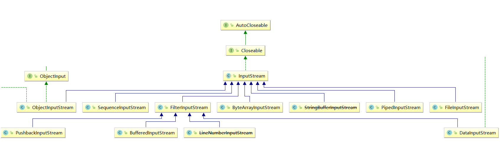
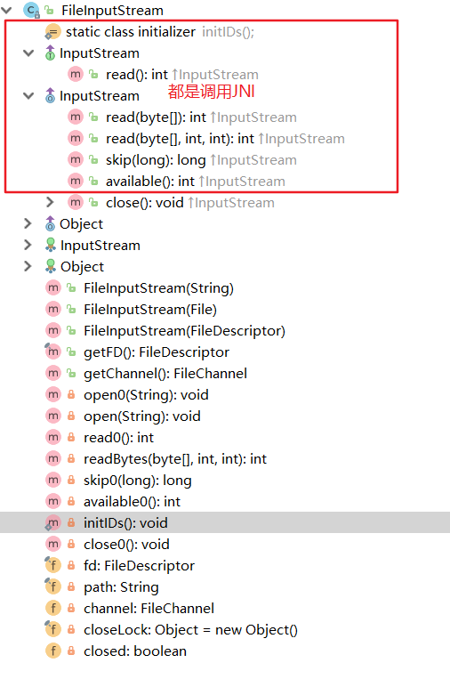
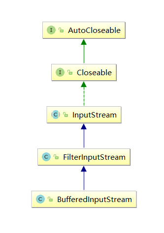

# InputStream


### 介绍



- `InputStream` 是所有的输入字节流的父类，它是一个抽象类。
- `ByteArrayInputStream`、`StringBufferInputStream`、`FileInputStream` 是三种基本的介质流，它们分别从`Byte 数组、StringBuffer、和本地文件`中读取数据。
- `PipedInputStream` 是从与其它线程共用的管道中读取数据，与Piped 相关的知识后续单独介绍。
- `ObjectInputStream` 和所有`FilterInputStream` 的子类都是装饰流（装饰器模式的主角）。

### field

只有mark和reset方法是synchronized的，其他不是，可能是因为调用底层原因

```java
//输入流超类-装饰者模式超类 ,实现可关闭接口
public abstract class InputStream implements Closeable {
    //最大可跳过缓冲数组大小
    private static final int MAX_SKIP_BUFFER_SIZE = 2048;
}
```

### 方法

#### Read

```java
//没有实现
public abstract int read() throws IOException;
```

#### ArrayRead

```java
    public int read(byte b[]) throws IOException {
        //调用重载的方法，读取传入 字节数组大小的字节 无偏移的读取
        return read(b, 0, b.length);
    }
  
    /*
    	b - the buffer into which the data is read.
		off - the start offset in array b at which the data is written.
		len - the maximum number of bytes to read.
	*/
    public int read(byte b[], int off, int len) throws IOException {
        //1. 一堆判断
        if (b == null) { //如果存储读取到的字节的字节数组b[]为空，抛出异常
            throw new NullPointerException();
        } else if (off < 0 || len < 0 || len > b.length - off) {  //如果 off 或 len 不符合规范，过大或过小，则抛出下标超出范围异常
            throw new IndexOutOfBoundsException();
        } else if (len == 0) {            //如果要读取的长度为0，则返回0
            return 0;
        }
        //2. 调用读取方法()进行读取一个字节，c表示读取到的字节
        int c = read();
        //3. 如果读取到的字节数为-1，表示没有可读字节，则返回-1，同样告知调用者，没有可读字节
        if (c == -1) {
            return -1;
        }
        
        //4. 循环读取剩余的
        b[off] = (byte)c;
        //因为上面调用了一次read(),所以设置i为1，表示读取了1个字节
        int i = 1;
        try {
            for (; i < len ; i++) {
                c = read();
                //一旦为-1，表示没读取到，跳出循环
                if (c == -1) {
                    break;
                }
                b[off + i] = (byte)c;
            }
        } catch (IOException ee) {
        }
        //5. 返回读取到了的字节数
        return i;
    }
```

#### skip

跳过n个字节,所谓的跳过也就是读取后抛弃

```java
	public long skip(long n) throws IOException {
        
        long remaining = n;//剩余跳过字节数
        int nr;

        if (n <= 0) {
            return 0;
        }
		
        //所用数组的大小，选最小的，节省空间
        int size = (int)Math.min(MAX_SKIP_BUFFER_SIZE, remaining);
        byte[] skipBuffer = new byte[size];
        while (remaining > 0) { // 循环读取，直到全部跳过，最后一次应该比remaining小
            nr = read(skipBuffer, 0, (int)Math.min(size, remaining));
            if (nr < 0) {
                break;
            }
            remaining -= nr; // 每跳过MAX_SKIP_BUFFER_SIZE长度，减少一部分
        }

        return n - remaining;//真实的跳过字节shu
    }
```

#### 其他

```java
   //返回可读字节数
    public int available() throws IOException {
        return 0;
    }

    //标记该位置，以便使用reset()方法回滚回该位置
    public synchronized void mark(int readlimit) {}

    //回滚回mark()标记的位置
    public synchronized void reset() throws IOException {
        throw new IOException("mark/reset not supported");
    }
    //测试是否支持mark()、reset()方法
    public boolean markSupported() {
        return false;
    }

	//close空实现
	public void close() throws IOException {}
```

# FilterInputStream

```java
//装饰者模式 装饰者超类
//组合了一个 被装饰者
protected volatile InputStream in;

//所有方法都是间接调用被装饰者
```

# ByteArrayInputStream

### 介绍

**节点流**，用于解析读取一个字节数组

```java
    protected byte buf[];
    //从buf[]中读取的下一个字节的索引，不能为负数，不能大于count;buf[pos]是要读取的下一个字节,
    protected int pos;
    //流中，当前标记的位置；如果构造函数中传入了off(偏移量)，则为偏移量，否则为0，
    protected int mark = 0;
    //The index one greater than the last valid character in the input stream buffer.是应该读取的字节，不一定是最后一位
    protected int count;
```

### 父类方法

#### Read

> 待解决：加了同步锁 why？

```java
    public synchronized int read() {
        return (pos < count) ? (buf[pos++] & 0xff) : -1;//只读取需要读取的字节，位运算提升为int型
    }
```

#### ArrayRead

```java
    //复制数组的一部分到参数数组，然后修改域
    public synchronized int read(byte b[], int off, int len) {...}
```

#### 其他

看源码就可以了，支持reset，很简单，jdk9之后增加了一些方法


# FileInputStream

### 介绍

read不会阻塞，因为一定有可读取的content，不像网络，管道那些需要等待数据传递

```java
	//关闭锁,该对象只在close()方法中使用，只是为了多个线程调用关闭方法的时候同步
    // 并将关闭方法和其他同步块区分开来,在其他同步块阻塞时，依然可以调用关闭方法    
private final Object closeLock = new Object();
```

#### constructor

```java
    //String name 创建
	public FileInputStream(String name) throws FileNotFoundException {
        this(name != null ? new File(name) : null);
    }

	//File创建
	public FileInputStream(File file) throws FileNotFoundException {
        String name = (file != null ? file.getPath() : null);//构建file的哪个路径，并非绝对路径
        SecurityManager security = System.getSecurityManager();
        if (security != null) {
            security.checkRead(name);//确保有该路径或文件的读取权限
        }
        if (name == null) { //没有name
            throw new NullPointerException();
        }
        if (file.isInvalid()) {		//文件无效
            throw new FileNotFoundException("Invalid file path");
        }
        fd = new FileDescriptor();
        fd.attach(this);
        path = name;
        open(name);//JNI打开文件
    }

	//FileDescriptor创建
    public FileInputStream(FileDescriptor fdObj) {
        SecurityManager security = System.getSecurityManager();
        if (fdObj == null) {
            throw new NullPointerException();
        }
        if (security != null) {
            security.checkRead(fdObj);
        }
        fd = fdObj;
        path = null;

        /*
         * FileDescriptor is being shared by streams.
         * Register this stream with FileDescriptor tracker.
         */
        fd.attach(this);
    }
```

### 父类方法

#### JNI

API说会有阻塞情况，事实上文件流并不会有阻塞，读完了就没有了。

```java
			System.out.println(len = bis.read(bytes));//-1
			System.out.println(len = bis.read(bytes));//-1
```



#### close

```java
	//Closes this file input stream and releases any system resources associated with the stream.
	//If this stream has an associated channel then the channel is closed as well.
	public void close() throws IOException {
        //1. double check关闭
        if (closed) {
            return;
        }
        synchronized (closeLock) {
            if (closed) {
                return;
            }
            closed = true;
        }

        //2. 如果 操作文件的通道不为空，关闭
        FileChannel fc = channel;
        if (fc != null) {
            // possible race with getChannel(), benign since
            // FileChannel.close is final and idempotent
            fc.close();
        }
		//3. FileDescriptor关闭
        fd.closeAll(new Closeable() {
            public void close() throws IOException {
               close0();
           }
        });
    }

```


1. **读取字节**：`read`方法，每次可以读取一个字节的数据，提升为int类型，读取到文件末尾，返回`-1`，代码使用演示：

```java
public class FISRead {
    public static void main(String[] args) throws IOException{
      	// 使用文件名称创建流对象
       	FileInputStream fis = new FileInputStream("read.txt");
      	// 定义变量，保存数据
        int b ；
        // 循环读取
        while ((b = fis.read())!=-1) {
            System.out.println((char)b);
        }
		// 关闭资源
        fis.close();
    }
}
输出结果：
a
b
c
d
e
```

> 注意：
>
> 1. 虽然读取了一个字节，但是会自动提升为int类型。
> 2. （char）int 转化为字符，因此如果是多个字节的字符，就会出现乱码
> 3. 流操作完毕后，必须释放系统资源，调用close方法，千万记得。

2. **使用字节数组读取**：`read(byte[] b)`，每次读取b的长度个字节到数组中，返回读取到的有效字节个数，读取到末尾时，返回`-1` ，代码使用演示：

```java
public class FISRead {
    public static void main(String[] args) throws IOException{
      	// 使用文件名称创建流对象.
       	FileInputStream fis = new FileInputStream("read.txt"); // 文件中为abcde
      	// 定义变量，作为有效个数
        int len ；
        // 定义字节数组，作为装字节数据的容器   
        byte[] b = new byte[2];
        // 循环读取
        while (( len= fis.read(b))!=-1) {
           	// 每次读取后,把数组的有效字节部分，变成字符串打印
            System.out.println(new String(b，0，len));//  len 每次读取的有效字节个数
        }
		// 关闭资源
        fis.close();
    }
}

输出结果：
ab
cd
e
```

> 注意：
>
> 使用数组读取，每次读取多个字节，减少了系统间的IO操作次数，从而提高了读写的效率，建议开发中使用。

# SequenceInputStream

**一个可以顺序读取多个流的类，简单包装了一个有序的输入流集合**

read一定读到下一个，循环下一个stream，不然返回-1。

readArray读到一个stream的最后不会接着下一个stream，需要再次调用本方法。

close全部底层流

```java
    public int read(byte b[], int off, int len) throws IOException {
        if (in == null) {
            return -1;
        } else if (b == null) {
            throw new NullPointerException();
        } else if (off < 0 || len < 0 || len > b.length - off) {
            throw new IndexOutOfBoundsException();
        } else if (len == 0) {
            return 0;
        }
        do {
            int n = in.read(b, off, len);
            if (n > 0) {
                return n;
            }
            nextStream();
        } while (in != null);
        return -1;
    }
```

# 字节流练习

复制图片文件，代码使用演示：

```java
public class Copy {
    public static void main(String[] args) throws IOException {
        // 1.创建流对象
        // 1.1 指定数据源
        FileInputStream fis = new FileInputStream("D:\\test.jpg");
        // 1.2 指定目的地
        FileOutputStream fos = new FileOutputStream("test_copy.jpg");

        // 2.读写数据
        // 2.1 定义数组
        byte[] b = new byte[1024];
        // 2.2 定义长度
        int len;
        // 2.3 循环读取
        while ((len = fis.read(b))!=-1) {
            // 2.4 写出数据
            fos.write(b, 0 , len);
        }

        // 3.关闭资源
        fos.close();
        fis.close();
    }
}
```

> 注意：
>
> 流的关闭原则：先开后关，后开先关。

# BufferedInputStream

### 介绍

**缓冲输入流类—处理流—装饰者**

缓冲流的基本原理，是在创建流对象时，会创建一个内置的默认大小的缓冲区数组，通过缓冲区读写，减少系统IO次数，从而提高读写的效率。

要注意这个缓冲流并不一定比节点流快，如果用字节数组读，节点流快



```java
    private static int DEFAULT_BUFFER_SIZE = 8192;

	//The maximum size of array to allocate. Some VMs reserve some header words in an array.
	//Attempts to allocate larger arrays may result in OutOfMemoryError: Requested array size exceeds VM limit
    private static int MAX_BUFFER_SIZE = Integer.MAX_VALUE - 8;

	//The internal buffer array where the data is stored
    protected volatile byte buf[];
	
	//Atomic updater to provide compareAndSet for buf. This is necessary because closes can be asynchronous.
	//We use nullness of buf[] as primary indicator that this stream is closed. (The "in" field is also nulled out on close.)
    private static final AtomicReferenceFieldUpdater<BufferedInputStream, byte[]> bufUpdater =
        	AtomicReferenceFieldUpdater.newUpdater (BufferedInputStream.class,  byte[].class, "buf");
	
	//指示field，针对缓存数组buff
    protected int count;	//  buffer中的有效字节数（比index+1），buffer并不是必须填满的，因此需要一个标记
    protected int pos;	 	// The current position in the buffer. This is the index of the next character to be read from the buf array.
    protected int markpos = -1; // The value of the pos field at the time the last mark method was called.
    protected int marklimit;    //mark后最大可读字节数 ，调用mark()方法后，pos - markpos 不能超过该值，否则reset()会失败，且markpos重置为-1

```

### construtor

```java
    public BufferedInputStream(InputStream in) {
        this(in, DEFAULT_BUFFER_SIZE);
    }
    
    public BufferedInputStream(InputStream in, int size) {
        super(in);//传给装饰者 FilterInputStream 的in
        if (size <= 0) {
            throw new IllegalArgumentException("Buffer size <= 0");
        }
        buf = new byte[size];
    }
```

### 父类方法

#### read a byte

```java
    // synchronized , 
    public synchronized int read() throws IOException {
        if (pos >= count) {
            fill();//没有了要fill
            if (pos >= count)
                return -1;
        }
        return getBufIfOpen()[pos++] & 0xff;//从buff中拿出一个byte，需要位运算提升类型	
    }
```

#### Read array

```java
    public synchronized int read(byte b[], int off, int len)
        throws IOException
    {	
        //1. 检测参数是否合法
        getBufIfOpen(); //Check for closed stream
        if ((off | len | (off + len) | (b.length - (off + len))) < 0) { // 位或运算，必须全部大于等于0，且偏移量+要读取的长度不能大于数组长度，否则抛出异常
            throw new IndexOutOfBoundsException();
        } else if (len == 0) { //len = 0 不读取 
            return 0;
        }
		
        //2. 循环从buff读取，最多循环两次
        int n = 0;
        for (;;) {
            int nread = read1(b, off + n, len - n);
            if (nread <= 0)            //如果没有可读的字节了
                return (n == 0) ? nread : n;// 如果是第一次循环，就直接返回读取到的字节数
            n += nread;
            if (n >= len)//如果读取到的字节数大于(应该不会大于)等于要读取的字节数，则直接返回
                return n;
            // if not closed but no bytes available, return
            InputStream input = in;
            if (input != null && input.available() <= 0)//调用被装饰者，如果流没有关闭，且可读字节数没了，也直接返回
                return n;
        }
    }
```

#### skip

```java
/*
Skips over and discards n bytes of data from this input stream. The skip method may, for a variety of reasons, end up skipping over some smaller number of bytes, possibly 0. This may result from any of a number of conditions; reaching end of file before n bytes have been skipped is only one possibility. The actual number of bytes skipped is returned. If n is negative, the skip method for class InputStream always returns 0, and no bytes are skipped. Subclasses may handle the negative value differently.
The skip method implementation of this class creates a byte array and then repeatedly reads into it until n bytes have been read or the end of the stream has been reached. Subclasses are encouraged to provide a more efficient implementation of this method. For instance, the implementation may depend on the ability to seek.
*/
	//并不一定跳过n的字节，有可能小于n
	// 跳过buff的字节，buff没有字节，就跳过in中的字节
	public synchronized long skip(long n) throws IOException {
        getBufIfOpen(); // Check for closed stream
        if (n <= 0) {
            return 0;
        }
        long avail = count - pos;
		
        //1. buff没有字节，就需要处理填充后才可以skip
        if (avail <= 0) {
            // If no mark position set then don't keep in buffer
            if (markpos <0)
                return getInIfOpen().skip(n);  // a. 而且，如果mark()未被使用，则直接使用 被装饰者的skip()方法即可

            // Fill in buffer to save bytes for reset
            fill(); //b. 填充buff
            avail = count - pos;
            if (avail <= 0)
                return 0; //如果可用的字节数还是没有，则返回跳过0个字节
        }

        long skipped = (avail < n) ? avail : n;
        pos += skipped;
        return skipped;
    }
```

#### available

```
最大不超过maxInteger
```

#### close

cas加锁关闭底层

### 其他内部方法

#### buff、in

```java
    /**
     * Check to make sure that underlying input stream has not been
     * nulled out due to close; if not return it;
     */
    private InputStream getInIfOpen() throws IOException {
        InputStream input = in;
        if (input == null)
            throw new IOException("Stream closed");
        return input;
    }

    /**
    	流关闭后，buff为null，不能在读取了
     * Check to make sure that buffer has not been nulled out due to
     * close; if not return it;
     */
    private byte[] getBufIfOpen() throws IOException {
        byte[] buffer = buf;
        if (buffer == null)
            throw new IOException("Stream closed");
        return buffer;
    }
```

#### read1 from buffer

```java
   /**
    从buff中读取，如果buff有剩余，则按需读取全部或部分剩余的部分，否则调用底层读取。
     * Read characters into a portion of an array, reading from the underlying
     * stream at most once if necessary.
     */
    private int read1(byte[] b, int off, int len) throws IOException {
        int avail = count - pos;//buff剩余可读字节数
        if (avail <= 0) {//1. buff没有了，从流中补充
            /* If the requested length is at least as large as the buffer, and
               if there is no mark/reset activity, do not bother to copy the
               bytes into the local buffer.  In this way buffered streams will
               cascade harmlessly. */
            if (len >= getBufIfOpen().length && markpos < 0) {// 如果读取的长度大于等于缓冲区大小，且没有使用mark，则不通过缓冲区，直接从流中读取
                return getInIfOpen().read(b, off, len);
            }
            fill(); //否则就补充缓冲区
            avail = count - pos;
            if (avail <= 0) return -1; //如果还是没有表示流中也读完了，则返回-1
            
        }//2. buff还有，按需读取，最多读完剩下的部分
        int cnt = (avail < len) ? avail : len;
        System.arraycopy(getBufIfOpen(), pos, b, off, cnt);
        pos += cnt;
        return cnt;
    }
```

#### fill the buffer

```java
    /**
     * Fills the buffer with more data, taking into account shuffling and other tricks for dealing with marks.
     * Assumes that it is being called by a synchronized method.
     * This method also assumes that all data has already been read in, hence pos > count.所有数据已经被读取
     */
    private void fill() throws IOException {
        byte[] buffer = getBufIfOpen();
        //1. no mark: throw away the buffer, pos = 0;，重新填充
        if (markpos < 0)
            pos = 0;
        //2. 有mark，并且上一次没有从流中读取足够的字节填满buffer，那么false，跳过，继续尝试读取填充；如果已经满了，true，就需要进入if，修改buffer的元素位置，或许需要扩容（都是为了保存marklimit考虑）
        else if (pos >= buffer.length)  /* no room left in buffer */
            //a. 第一次，调整markpos的位置到0位
            if (markpos > 0) {  /* can throw away early part of the buffer */
                int sz = pos - markpos;
                System.arraycopy(buffer, markpos, buffer, 0, sz);
                pos = sz;
                markpos = 0;
         // 以下的操作尽量让数组的长度不超过marklimit
          	//b. 这是第二次，经过上面第一次，markpos = 0，缓冲区也用尽，这时：如果已经超过了marklimit，那么说明读过头了，参数没用，不需要维护之前的，清空再来
            } else if (buffer.length >= marklimit) {
                markpos = -1;   /* buffer got too big, invalidate mark */
                pos = 0;        /* drop buffer contents */
            //c. 下面准备扩容以容纳更多的buff（marklimit需要），超过就抛出异常，说明marklimit不能设置过大
            } else if (buffer.length >= MAX_BUFFER_SIZE) {
                throw new OutOfMemoryError("Required array size too large");
            //d. 第三次，正式扩容
            } else {            /* grow buffer */
                int nsz = (pos <= MAX_BUFFER_SIZE - pos) ?//一半以内，可以扩容，pos用位移更容易理解，集合框架的习惯思维
                        pos * 2 : MAX_BUFFER_SIZE;
                if (nsz > marklimit)//扩容是为了缓存marklimit的数据，尽量节省空间，刚好marklimit大小就够了
                    nsz = marklimit;
                byte nbuf[] = new byte[nsz];//转移新数组，cas，如果流关闭了那么异常
                System.arraycopy(buffer, 0, nbuf, 0, pos);
                if (!bufUpdater.compareAndSet(this, buffer, nbuf)) {
                    // Can't replace buf if there was an async close.
                    // Note: This would need to be changed if fill()
                    // is ever made accessible to multiple threads.
                    // But for now, the only way CAS can fail is via close.
                    // assert buf == null;
                    throw new IOException("Stream closed");
                }
                buffer = nbuf;//新数组
            }
        count = pos;
        int n = getInIfOpen().read(buffer, pos, buffer.length - pos);//填充buffer数组， 注意，这里未必能够完全填满buff，因此才有2的判断
        if (n > 0)
            count = n + pos;
    }
```
