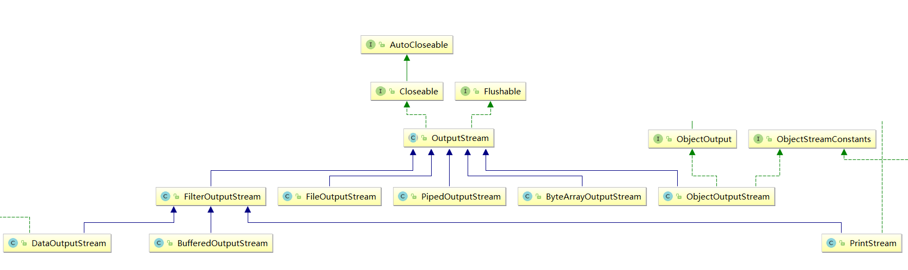
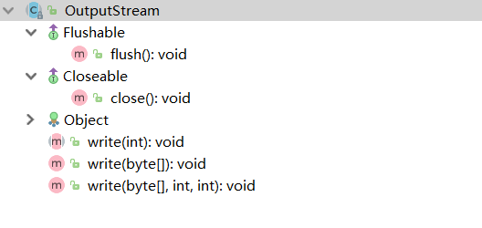

# OutputStream



- `OutputStream` 是所有的输出字节流的父类，它是一个抽象类。
- `ByteArrayOutputStream`、`FileOutputStream` 是两种基本的介质流，它们分别向Byte 数组、和本地文件中写入数据。
- `PipedOutputStream` 是向与其它线程共用的管道中写入数据。
- `ObjectOutputStream` 和所有`FilterOutputStream` 的子类都是装饰流。

> 注意：
>
> close方法，当完成流的操作时，必须调用此方法，释放系统资源。



flush和close是空方法。

# FileOutputStream

- **constructor**

  

  ```
  If the second argument is true, then bytes will be written to the end of the file rather than the beginning.
  A new FileDescriptor object is created to represent this file connection.
  First, if there is a security manager, its checkWrite method is called with the path represented by the file argument as its argument.
  If the file exists but is a directory rather than a regular file, does not exist but cannot be created, or cannot be opened for any other reason then a FileNotFoundException is thrown.
  ```

-  **其他方法**

  都是调用JNI，注意写入的字节是什么编码的就行。

  ```java
  byte[] b = "黑马程序员".getBytes();// 把字符串转换为字节数组，默认编码集UTF-8（Idea设置）  
  fos.write(b);
  ```

- **写出换行**

  Windows系统里，换行符号是`\r\n` 。把

> 注意：
>
> * 回车符`\r`和换行符`\n` ：
>   * 回车符：回到一行的开头（return）。
>   * 换行符：下一行（newline）。
> * 系统中的换行：
>   * Windows系统里，每行结尾是 `回车+换行` ，即`\r\n`；
>   * Unix系统里，每行结尾只有 `换行` ，即`\n`；
>   * Mac系统里，每行结尾是 `回车` ，即`\r`。从 Mac OS X开始与Linux统一。

-  **flush()**

  OutputStream的flush()方法将所有写入到OutputStream的数据冲刷到相应的目标媒介中。比如，如果输出流是FileOutputStream，那么写入到其中的数据可能并没有真正写入到磁盘中。即使所有数据都写入到了FileOutputStream，这些数据还是有可能保留在内存的缓冲区中。通过调用flush()方法，可以把缓冲区内的数据刷新到磁盘(或者网络，以及其他任何形式的目标媒介)中。

# FilterOutputStream

基本都是调用被装饰流out的方法，close()需要先调用flush()。两个方法都需要注意有没有异常处理，处理的顺序。

```java
    @Override
    public void close() throws IOException {
        //是否已经关闭
        if (closed) {
            return;
        }
        closed = true;

        Throwable flushException = null;
        //开始flush
        try {
            flush();
        } catch (Throwable e) {
            //处理flush异常
            flushException = e;
            throw e;
        } finally {
            if (flushException == null) {
                //开始close
                out.close();
            } else {
                try {
                    out.close();
                } catch (Throwable closeException) {
                   // evaluate possible precedence of flushException over closeException
                   if ((flushException instanceof ThreadDeath) &&
                       !(closeException instanceof ThreadDeath)) {
                       flushException.addSuppressed(closeException);
                       throw (ThreadDeath) flushException;
                   }

                    if (flushException != closeException) {
                        closeException.addSuppressed(flushException);
                    }

                    throw closeException;
                }
            }
        }
    }
```

# BufferedOutputStream

和BufferedInputStream原理差不多，内置数组缓存，数据量小先写入数组。

多次写快；否则直接用节点流的writeArray会更快。


**flush在buffer类中才有用**

```java
    @Override
    public synchronized void flush() throws IOException {
        flushBuffer();
        out.flush();
    }
    
	private void flushBuffer() throws IOException {
        if (count > 0) {
            out.write(buf, 0, count);
            count = 0;
        }
    }

```


