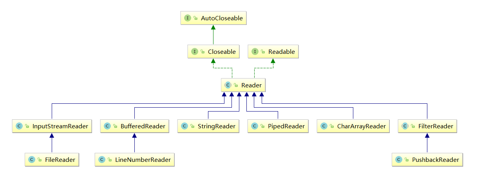

# 介绍

[以下各个类的源码](https://blog.csdn.net/qq_32166627/article/details/72828985)

和其他的差不多，所有不看了



# Reader

```java
/**
 * 用于读取字符流的抽象类。
 * 子类必须实现的方法只有 read(char[], int, int) 和 close()。
 * 但是，多数子类将重写此处定义的一些方法，以提供更高的效率和/或其他功能。
 */
```

# InputStreamReader

```java
/**
 * InputStreamReader 是字节流通向字符流的桥梁
 * 它使用指定的 charset 读取字节并将其解码为字符。
 * 它使用的字符集可以由名称指定或显式给定，或者可以接受平台默认的字符集。
 * 每次调用 InputStreamReader 中的一个 read() 方法都会导致从底层输入流读取一个或多个字节。
 * 要启用从字节到字符的有效转换，可以提前从底层流读取更多的字节，使其超过满足当前读取操作所需的字节。 
 * 为了达到最高效率，可要考虑在 BufferedReader 内包装 InputStreamReader，如：
 * BufferedReader in = new BufferedReader(new InputStreamReader(System.in));
 */
————————————————
版权声明：本文为CSDN博主「name_s_Jimmy」的原创文章，遵循 CC 4.0 BY-SA 版权协议，转载请附上原文出处链接及本声明。
原文链接：https://blog.csdn.net/qq_32166627/article/details/72828985
```


# FileReader

```java
/**
 * 用来读取字符文件的便捷类。
 * 此类的构造方法假定默认字符编码和默认字节缓冲区大小都是适当的。
 * 要自己指定这些值，可以先在 FileInputStream 上构造一个 InputStreamReader。
 * FileReader 用于读取字符流。要读取原始字节流，请考虑使用 FileInputStream。 
 */
————————————————
版权声明：本文为CSDN博主「name_s_Jimmy」的原创文章，遵循 CC 4.0 BY-SA 版权协议，转载请附上原文出处链接及本声明。
原文链接：https://blog.csdn.net/qq_32166627/article/details/72828985
```

#### 构造方法

- `FileReader(File file)`： 创建一个新的 FileReader ，给定要读取的File对象。   
- `FileReader(String fileName)`： 创建一个新的 FileReader ，给定要读取的文件的名称。  

当你创建一个流对象时，必须传入一个文件路径。类似于FileInputStream 。

- 构造举例，代码如下：

```java
public class FileReaderConstructor throws IOException{
    public static void main(String[] args) {
   	 	// 使用File对象创建流对象
        File file = new File("a.txt");
        FileReader fr = new FileReader(file);
      
        // 使用文件名称创建流对象
        FileReader fr = new FileReader("b.txt");
    }
}
```

#### 读取字符数据

1. **读取字符**：`read`方法，

   返回一个包含了读取到的字符内容的int类型变量(译者注：0~65535)。如果方法返回-1，表明Reader中已经没有剩余可读取字符，此时可以关闭Reader。-1是一个int类型，不是byte或者char类型，这是不一样的。

   每次可以读取一个字符的数据，提升为int类型，读取到文件末尾，返回`-1`，循环读取，代码使用演示：

```java
public class FRRead {
    public static void main(String[] args) throws IOException {
      	// 使用文件名称创建流对象
       	FileReader fr = new FileReader("read.txt");
      	// 定义变量，保存数据
        int b ；
        // 循环读取
        while ((b = fr.read())!=-1) {
            System.out.println((char)b);
        }
		// 关闭资源
        fr.close();
    }
}
输出结果：
黑
马
程
序
员
```

> 注意：虽然读取了一个字符，但是会自动提升为int类型。

2. **使用字符数组读取**：`read(char[] cbuf)`，每次读取b的长度个字符到数组中，返回读取到的有效字符个数，读取到末尾时，返回`-1` ，代码使用演示：

```java
public class FRRead {
    public static void main(String[] args) throws IOException {
      	// 使用文件名称创建流对象
       	FileReader fr = new FileReader("read.txt");
      	// 定义变量，保存有效字符个数
        int len ；
        // 定义字符数组，作为装字符数据的容器
         char[] cbuf = new char[2];
        // 循环读取
        while ((len = fr.read(cbuf))!=-1) {
            System.out.println(new String(cbuf));
        }
		// 关闭资源
        fr.close();
    }
}
输出结果：
黑马
程序
员序
```

获取有效的字符改进，代码使用演示：

```java
public class FISRead {
    public static void main(String[] args) throws IOException {
      	// 使用文件名称创建流对象
       	FileReader fr = new FileReader("read.txt");
      	// 定义变量，保存有效字符个数
        int len ；
        // 定义字符数组，作为装字符数据的容器
        char[] cbuf = new char[2];
        // 循环读取
        while ((len = fr.read(cbuf))!=-1) {
            System.out.println(new String(cbuf,0,len));
        }
    	// 关闭资源
        fr.close();
    }
}

输出结果：
黑马
程序
员
```

# BufferedReader

## 源码

```java
/**
 * 从字符输入流中读取文本，缓冲各个字符，从而实现字符、数组和行的高效读取。 
 * 可以指定缓冲区的大小，或者可使用默认的大小。
 * 通常，Reader 所作的每个读取请求都会导致对底层字符或字节流进行相应的读取请求。
 * 建议用 BufferedReader包装所有其read操作可能开销很高的Reader，如FileReader和 InputStreamReader）。
 * 例如，BufferedReader in = new BufferedReader(new FileReader("foo.in"));
 */
————————————————
版权声明：本文为CSDN博主「name_s_Jimmy」的原创文章，遵循 CC 4.0 BY-SA 版权协议，转载请附上原文出处链接及本声明。
原文链接：https://blog.csdn.net/qq_32166627/article/details/72828985
```

## 字符缓冲流

### 构造方法

* `public BufferedReader(Reader in)` ：创建一个 新的缓冲输入流。 
* `public BufferedWriter(Writer out)`： 创建一个新的缓冲输出流。

构造举例，代码如下：

```java
// 创建字符缓冲输入流
BufferedReader br = new BufferedReader(new FileReader("br.txt"));
// 创建字符缓冲输出流
BufferedWriter bw = new BufferedWriter(new FileWriter("bw.txt"));
```

### 特有方法

字符缓冲流的基本方法与普通字符流调用方式一致，不再阐述，我们来看它们具备的特有方法。

* BufferedReader：`public String readLine()`: 读一行文字。 
* BufferedWriter：`public void newLine()`: 写一行行分隔符,由系统属性定义符号。 

`readLine`方法演示，代码如下：

```java
public class BufferedReaderDemo {
    public static void main(String[] args) throws IOException {
      	 // 创建流对象
        BufferedReader br = new BufferedReader(new FileReader("in.txt"));
		// 定义字符串,保存读取的一行文字
        String line  = null;
      	// 循环读取,读取到最后返回null
        while ((line = br.readLine())!=null) {
            System.out.print(line);
            System.out.println("------");
        }
		// 释放资源
        br.close();
    }
}
```

`newLine`方法演示，代码如下：

  ```java
public class BufferedWriterDemo throws IOException {
    public static void main(String[] args) throws IOException  {
      	// 创建流对象
		BufferedWriter bw = new BufferedWriter(new FileWriter("out.txt"));
      	// 写出数据
        bw.write("黑马");
      	// 写出换行
        bw.newLine();
        bw.write("程序");
        bw.newLine();
        bw.write("员");
        bw.newLine();
		// 释放资源
        bw.close();
    }
}
输出效果:
黑马
程序
员
  ```

## 文本排序

请将文本信息恢复顺序。

```
3.侍中、侍郎郭攸之、费祎、董允等，此皆良实，志虑忠纯，是以先帝简拔以遗陛下。愚以为宫中之事，事无大小，悉以咨之，然后施行，必得裨补阙漏，有所广益。
8.愿陛下托臣以讨贼兴复之效，不效，则治臣之罪，以告先帝之灵。若无兴德之言，则责攸之、祎、允等之慢，以彰其咎；陛下亦宜自谋，以咨诹善道，察纳雅言，深追先帝遗诏，臣不胜受恩感激。
4.将军向宠，性行淑均，晓畅军事，试用之于昔日，先帝称之曰能，是以众议举宠为督。愚以为营中之事，悉以咨之，必能使行阵和睦，优劣得所。
2.宫中府中，俱为一体，陟罚臧否，不宜异同。若有作奸犯科及为忠善者，宜付有司论其刑赏，以昭陛下平明之理，不宜偏私，使内外异法也。
1.先帝创业未半而中道崩殂，今天下三分，益州疲弊，此诚危急存亡之秋也。然侍卫之臣不懈于内，忠志之士忘身于外者，盖追先帝之殊遇，欲报之于陛下也。诚宜开张圣听，以光先帝遗德，恢弘志士之气，不宜妄自菲薄，引喻失义，以塞忠谏之路也。
9.今当远离，临表涕零，不知所言。
6.臣本布衣，躬耕于南阳，苟全性命于乱世，不求闻达于诸侯。先帝不以臣卑鄙，猥自枉屈，三顾臣于草庐之中，咨臣以当世之事，由是感激，遂许先帝以驱驰。后值倾覆，受任于败军之际，奉命于危难之间，尔来二十有一年矣。
7.先帝知臣谨慎，故临崩寄臣以大事也。受命以来，夙夜忧叹，恐付托不效，以伤先帝之明，故五月渡泸，深入不毛。今南方已定，兵甲已足，当奖率三军，北定中原，庶竭驽钝，攘除奸凶，兴复汉室，还于旧都。此臣所以报先帝而忠陛下之职分也。至于斟酌损益，进尽忠言，则攸之、祎、允之任也。
5.亲贤臣，远小人，此先汉所以兴隆也；亲小人，远贤臣，此后汉所以倾颓也。先帝在时，每与臣论此事，未尝不叹息痛恨于桓、灵也。侍中、尚书、长史、参军，此悉贞良死节之臣，愿陛下亲之信之，则汉室之隆，可计日而待也。
```

### 案例分析

1. 逐行读取文本信息。
2. 解析文本信息到集合中。
3. 遍历集合，按顺序，写出文本信息。

### 案例实现

```java
public class BufferedTest {
    public static void main(String[] args) throws IOException {
        // 创建map集合,保存文本数据,键为序号,值为文字
        HashMap<String, String> lineMap = new HashMap<>();

        // 创建流对象
        BufferedReader br = new BufferedReader(new FileReader("in.txt"));
        BufferedWriter bw = new BufferedWriter(new FileWriter("out.txt"));

        // 读取数据
        String line  = null;
        while ((line = br.readLine())!=null) {
            // 解析文本
            String[] split = line.split("\\.");
            // 保存到集合
            lineMap.put(split[0],split[1]);
        }
        // 释放资源
        br.close();

        // 遍历map集合
        for (int i = 1; i <= lineMap.size(); i++) {
            String key = String.valueOf(i);
            // 获取map中文本
            String value = lineMap.get(key);
          	// 写出拼接文本
            bw.write(key+"."+value);
          	// 写出换行
            bw.newLine();
        }
		// 释放资源
        bw.close();
    }
}

```

