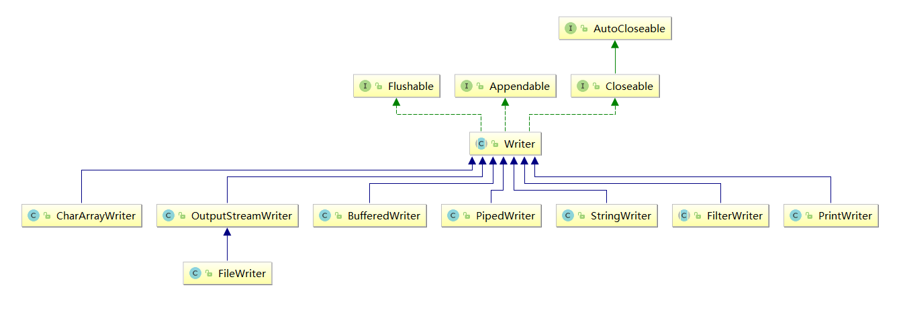
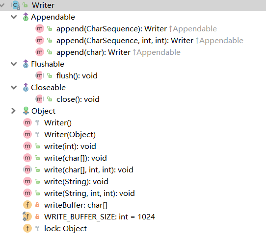
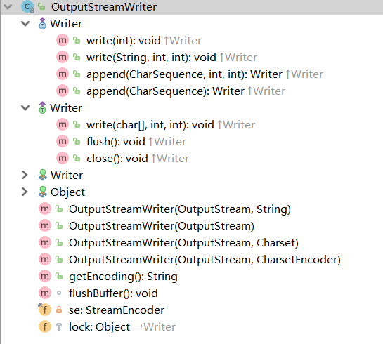
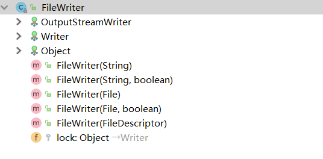

https://blog.csdn.net/qq_32166627/article/details/72823416

# 前言

设计Reader和Writer继承层次结构主要是为了国际化。老的IO流继承层次结构仅支持8位的字节流，并且不能很好的处理16位的Unicode字符，所以添加Reader和Writer继承层次结构就是为了在所有的IO操作中都支持Unicode。

然而在某些场合，我们不得不面临着字符编码的问题，即字符和字节之间按照什么编码方式（GBK，UTF-8，ISO-8859-1等）来编解码的问题。这时我们将用到OutputStreamWriter和InputStreamReader这两个字符流，它们分别是字符通向字节的桥梁和字节通向字符的桥梁。

关于“装饰者模式”，字符流Reader和Writer的类继承层次结构沿用与字节流相同的思想，但是并不完全相同。造成这种差异的原因是因为类的组织形式不同，尽管BufferedOutputStream是FilterOutputStream的子类，但是BufferedWriter并不是FilterWriter的子类，但它仍然是其他Writer类的装饰器类。尽管FilterWriter是抽象类，但是没有任何子类，把它放在那里也只是把它作为一个占位符，或者仅仅让我们不会对它所在的地方产生疑惑。

# 介绍




# Writer

## 介绍




```java
package java.io;
/**
 * Writer是写入字符流的抽象类。定义了流的最基本的功能。
 * 子类必须实现的方法仅有 write(char[], int, int)、flush() 和 close()。
 * 但是，多数子类将重写此处定义的一些方法，以提供更高的效率和/或其他功能。
 */
public abstract class Writer implements Appendable, Closeable, Flushable {

	/**有一个同步锁，构造器传入
     * The object used to synchronize operations on this stream.  For
     * efficiency, a character-stream object may use an object other than
     * itself to protect critical sections.  A subclass should therefore use
     * the object in this field rather than {@code this} or a synchronized
     * method.
     */
    protected Object lock;

   /** 所有方法都是写入这个buffer，然后再把这个buff写入
     * Temporary buffer used to hold writes of strings and single characters
     */
    private char[] writeBuffer; //两处地方初始化
```

## 方法

```java
    public void write(int c) throws IOException {
        synchronized (lock) {
            if (writeBuffer == null){
                writeBuffer = new char[WRITE_BUFFER_SIZE];
            }
            writeBuffer[0] = (char) c;
            write(writeBuffer, 0, 1);//传入buff，写入buff，该方法是抽象方法
        }
    }

    public void write(String str, int off, int len) throws IOException {
        synchronized (lock) {
            char cbuf[];
            if (len <= WRITE_BUFFER_SIZE) {
                if (writeBuffer == null) {
                    writeBuffer = new char[WRITE_BUFFER_SIZE];
                }
                cbuf = writeBuffer;
            } else {    // Don't permanently allocate very large buffers.
                cbuf = new char[len];
            }
            str.getChars(off, (off + len), cbuf, 0);
            write(cbuf, 0, len);//抽象方法
        }
    }
```

# OutputStreamWriter

## 介绍



```java
/**
 * OutputStreamWriter是字符流通向字节流的桥梁：可使用指定的charset将要写入流中的字符编码成字节。
 * 它使用的字符集可以由名称指定或显式给定，否则将接受平台默认的字符集。
 * 每次调用 write() 方法都会导致在给定字符（或字符集）上调用编码转换器。
 * 在写入底层输出流之前，得到的这些字节将在缓冲区中累积。
 * 为了获得最高效率，可考虑将OutputStreamWriter包装到BufferedWriter中，以避免频繁调用转换器。
 * 例如：Writer out = new BufferedWriter(new OutputStreamWriter(System.out));
 */

public class OutputStreamWriter extends Writer {

    /**
     * 本类所实现的由字符到字节的编码严重依赖StreamEncoder类及其方法。
     * 本文并不打算讲解StreamEncoder类，只介绍其方法达到什么目的。
     */
    private final StreamEncoder se;

  
    /**
     * 返回此流使用的字符编码的名称。 
     */
    public String getEncoding() {
        return se.getEncoding();
    }

    void flushBuffer() throws IOException {
        se.flushBuffer();
    }
```

## constructor

各个构造器都是为了构建StreamEncoder，需要一个outputStream和一个字符集，底层再转换然后写入

```java
  /**
     * 创建使用指定字符集的 OutputStreamWriter。 
     */
    public OutputStreamWriter(OutputStream out, String charsetName)
        throws UnsupportedEncodingException
    {
        super(out);
        if (charsetName == null)
            throw new NullPointerException("charsetName");
        se = StreamEncoder.forOutputStreamWriter(out, this, charsetName);
    }

    /**
     * 创建使用默认字符编码的 OutputStreamWriter
     */
    public OutputStreamWriter(OutputStream out) {
        super(out);
        try {
            se = StreamEncoder.forOutputStreamWriter(out, this, (String)null);
        } catch (UnsupportedEncodingException e) {
            throw new Error(e);
        }
    }

    /**
     * 创建使用给定字符集的 OutputStreamWriter。
     */
    public OutputStreamWriter(OutputStream out, Charset cs) {
        super(out);
        if (cs == null)
            throw new NullPointerException("charset");
        se = StreamEncoder.forOutputStreamWriter(out, this, cs);
    }

    /**
     * 创建使用给定字符集编码器的 OutputStreamWriter。
     */
    public OutputStreamWriter(OutputStream out, CharsetEncoder enc) {
        super(out);
        if (enc == null)
            throw new NullPointerException("charset encoder");
        se = StreamEncoder.forOutputStreamWriter(out, this, enc);
    }

```

## 父类方法

都是调用StreamEncoder的方法

```java
    @Override
    public Writer append(CharSequence csq, int start, int end) throws IOException {
        if (csq == null) csq = "null";
        return append(csq.subSequence(start, end));
    }

    @Override
    public Writer append(CharSequence csq) throws IOException {
        if (csq instanceof CharBuffer) {
            se.write((CharBuffer) csq);
        } else {
            se.write(String.valueOf(csq));
        }
        return this;
    }

	public void write(int c) throws IOException {
        se.write(c);
    }


    public void write(char cbuf[], int off, int len) throws IOException {
        se.write(cbuf, off, len);
    }

    public void write(String str, int off, int len) throws IOException {
        se.write(str, off, len);
    }

	//刷新该流的缓冲。
    public void flush() throws IOException {
        se.flush();
    }
 	//关闭此流，但要先刷新它。
    public void close() throws IOException {
        se.close();
    }
}
```

## write(int c)

```JAVA
    //StreamEncoder的方法，可以看出只写出int的低16位，转化为char
	public void write(int c) throws IOException {
        char cbuf[] = new char[1];
        cbuf[0] = (char) c;
        write(cbuf, 0, 1);
    }
```

#  FileWriter

## 介绍

该类实现了特定的目的和write形式，同样的类还有：CharArrayWriter，StringWriter。




```java
/**
 * 1，用来写入字符文件的便捷类。
 * 2，此类的构造方法假定默认字符编码和默认字节缓冲区大小都是可接受的。要自己指定这些值，可以先在 FileOutputStream 上构造一个 OutputStreamWriter。
 * 3，FileWriter 用于写入字符流。要写入原始字节流，请考虑使用 FileOutputStream。
 */


没什么好讲，只是传入一个目的地，然后内部新建一个字节流，调用父类构造器。

该类没有自己的方法，均是继承自父类OutputStreamWriter和Writer。
```


## 基本写出数据

**写出字符**：`write(int b)` 方法，每次可以写出一个字符数据，代码使用演示：

```java
public class FWWrite {
    public static void main(String[] args) throws IOException {
        // 使用文件名称创建流对象
        FileWriter fw = new FileWriter("fw.txt");     
      	// 写出数据
      	fw.write(97); // 写出第1个字符
      	fw.write('b'); // 写出第2个字符
      	fw.write('C'); // 写出第3个字符
      	fw.write(30000); // 写出第4个字符，中文编码表中30000对应一个汉字。
      
      	/*
        【注意】关闭资源时,与FileOutputStream不同。
      	 如果不关闭,数据只是保存到缓冲区，并未保存到文件。
        */
        // fw.close();
    }
}
输出结果：
abC田
```

> 注意：
>
> 1. 虽然参数为int类型四个字节，但是只会保留一个字符的信息写出。
> 2. 未调用close方法，数据只是保存到了缓冲区，并未写出到文件中。

## 关闭和刷新

因为内置缓冲区的原因，如果不关闭输出流，无法写出字符到文件中。但是关闭的流对象，是无法继续写出数据的。如果我们既想写出数据，又想继续使用流，就需要`flush` 方法了。

* `flush` ：刷新缓冲区，流对象可以继续使用。
* `close `:先刷新缓冲区，然后通知系统释放资源。流对象不可以再被使用了。

代码使用演示：

```java
public class FWWrite {
    public static void main(String[] args) throws IOException {
        // 使用文件名称创建流对象
        FileWriter fw = new FileWriter("fw.txt");
        // 写出数据，通过flush
        fw.write('刷'); // 写出第1个字符
        fw.flush();
        fw.write('新'); // 继续写出第2个字符，写出成功
        fw.flush();
      
      	// 写出数据，通过close
        fw.write('关'); // 写出第1个字符
        fw.close();
        fw.write('闭'); // 继续写出第2个字符,【报错】java.io.IOException: Stream closed
        fw.close();
    }
}
```

> 注意：即便是flush方法写出了数据，操作的最后还是要调用close方法，释放系统资源。

## 例子

1. **写出字符数组** ：`write(char[] cbuf)` 和 `write(char[] cbuf, int off, int len)` ，每次可以写出字符数组中的数据，用法类似FileOutputStream，代码使用演示：

```java
public class FWWrite {
    public static void main(String[] args) throws IOException {
        // 使用文件名称创建流对象
        FileWriter fw = new FileWriter("fw.txt");     
      	// 字符串转换为字节数组
      	char[] chars = "黑马程序员".toCharArray();
      
      	// 写出字符数组
      	fw.write(chars); // 黑马程序员
        
		// 写出从索引2开始，2个字节。索引2是'程'，两个字节，也就是'程序'。
        fw.write(b,2,2); // 程序
      
      	// 关闭资源
        fos.close();
    }
}
```

2. **写出字符串**：`write(String str)` 和 `write(String str, int off, int len)` ，每次可以写出字符串中的数据，更为方便，代码使用演示：

```java
public class FWWrite {
    public static void main(String[] args) throws IOException {
        // 使用文件名称创建流对象
        FileWriter fw = new FileWriter("fw.txt");     
      	// 字符串
      	String msg = "黑马程序员";
      
      	// 写出字符数组
      	fw.write(msg); //黑马程序员
      
		// 写出从索引2开始，2个字节。索引2是'程'，两个字节，也就是'程序'。
        fw.write(msg,2,2);	// 程序
      	
        // 关闭资源
        fos.close();
    }
}
```

3. **续写和换行**：操作类似于FileOutputStream。

```java
public class FWWrite {
    public static void main(String[] args) throws IOException {
        // 使用文件名称创建流对象，可以续写数据
        FileWriter fw = new FileWriter("fw.txt"，true);     
      	// 写出字符串
        fw.write("黑马");
      	// 写出换行
      	fw.write("\r\n");
      	// 写出字符串
  		fw.write("程序员");
      	// 关闭资源
        fw.close();
    }
}
输出结果:
黑马
程序员
```

> 注意：字符流，只能操作文本文件，不能操作图片，视频等非文本文件。
>
> ​		当我们单纯读或者写文本文件时  使用字符流 其他情况使用字节流

# BufferedWriter

和BufferedInputStream差不多

[源码](https://blog.csdn.net/qq_32166627/article/details/72823416)

```java
/**
 * 将文本写入字符输出流，缓冲各个字符，从而提供单个字符、数组和字符串的高效写入。
 * 可以指定缓冲区的大小，或者接受默认的大小。在大多数情况下，默认值就足够大了。
 * 该类提供了 newLine() 方法，它使用平台自己的行分隔符概念。
 * 
 */
     /**
     * 写入一个行分隔符。行分隔符字符串由系统属性 line.separator 定义
     */
    public void newLine() throws IOException {
        write(lineSeparator);
    }
```

