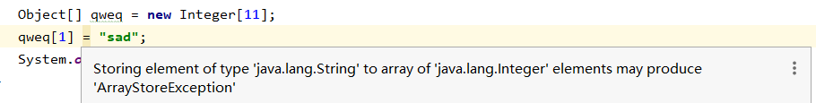
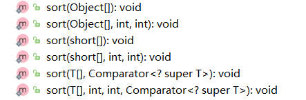

# 介绍

​	是一种容器，可以同时存放多个数据值。

- **特点**

1. 数组是一种引用数据类型，也可以赋予null
2. 数组当中的多个数据，类型必须统一
3. 数组的长度在程序运行期间不可改变

# 初始化

在定义数组时，有两种定义方法：`int[] a` 和 `int a[]` ；第二种是C/C++对数组定义方式，对于JAVA建议采用第一种定义方式。

总的原则：任何对象在被调用之前必须先被初始化！

1. **动态初始化（指定长度）**

   ```java
   数据类型[] 数组名称 = new 数据类型[数组长度];
    int[] arrayA = new int[300];
   ```

2. **静态初始化（指定内容）**

   虽然静态初始化没有直接告诉长度，但是根据大括号里面的元素具体内容，也可以自动推算出来长度。

   ```java
   数据类型[] 数组名称 = new 数据类型[] { 元素1, 元素2, ... };
   //省略格式：
   数据类型[] 数组名称 = { 元素1, 元素2, ... };
   ```

- **tostring**

  ```java
  int[]  		// [I@50cbc42f
  double[] 	// [D@75412c2f
  String[]	// [Ljava.lang.String;@282ba1e
  ```

  

  直接打印数组名称，得到的是数组对应的：内存地址哈希值。

- **默认值**

  使用动态初始化数组的时候，其中的元素将会自动拥有一个默认值。规则如下：
  如果是整数类型，那么默认为0；
  如果是浮点类型，那么默认为0.0；
  如果是字符类型，那么默认为'\u0000'；
  如果是布尔类型，那么默认为false；
  如果是引用类型，那么默认为null。

  注意事项：
  静态初始化其实也有默认值的过程，只不过系统自动马上将默认值替换成为了大括号当中的具体数值。


# **强类型**

```java
//即便赋值给不同类型的变量，数组的元素也不能更改。只能赋给该类和子类

public class ArrayTypeLimit {

	//不可以把元素设为类型的父类
	@Test
	public void test1() {
		User[] users = new User[]{
				new User(),
				new User(),
				new User()
		};

		Object[] target = users;
		System.out.println(target.getClass());  // class [Ltest.User;
		target[0] = new Object();   // 异常java.lang.ArrayStoreException: java.lang.Object，数组会记住它的元素类型
	}

	//可以把元素设为类型的子类
	@Test
	public void test2() {
		Object[] target = new Object[11];
		target[0] = new User();
		System.out.println(target);
	}

	private static class User {
	}

}}
}
```



# Arryas

`java.util.Arrays`

Arrays包含了一系列操作数组的方法

## 公有static方法

### asList

```java
    @SafeVarargs
    @SuppressWarnings("varargs")
    public static <T> List<T> asList(T... a) {
        return new ArrayList<>(a);
    }
```

1.  This method acts as bridge between array-based and collection-based APIs, in combination with `Collection.toArray().`
2. 返回一个受指定数组支持的大小固定的列表；
3. 传入数组如果是一个基本类型数组（如int[]），那么将返回一个大小为1的列表，且列表元素就是传入的这个数组；
4. 返回的列表不可添加或删除元素，没有重写这些方法，`throw new UnsupportedOperationException();`。可以对列表中数据做替换操作（即不可更改列表的大小）；
5. 更改列表中元素内容即更改传入数组的内容（返回的列表持有传入数组参数的引用，不是单独的两个对象）。

### binarySearch

```java
    public static int binarySearch(byte[] a, byte key) {
        return binarySearch0(a, 0, a.length, key);
    }
```

1. 序列必须有序
2. 如果存在，返回key在该数组中的位置，如果不存在，返回负数，值为：-插入点-1
3. 不包括toIndex的值，因此传入的toIndex应比实际下标大1；
4. 很多不同重载

###  copy

1. 复制指定的数组，截取或用默认值填充，以使副本具有指定的长度；
2. Arrays.copyOf调用System.arraycopy方法，copy出来的每个副本都是单独的对象。但是内部元素是一样的。
3. 如果传入的数小于原来的数组长度，则直接把原数组多余的部分剪掉，如果传入的值大于原数组，则新数组多余的部分补默认值（对于int类型的，补0）。

```java
//1. 构建定长空数组 2. copy
	//全部复制
	public static int[] copyOf(int[] original, int newLength) {
        int[] copy = new int[newLength];
        System.arraycopy(original, 0, copy, 0,
                         Math.min(original.length, newLength));
        return copy;
    }
	//范围内复制
    public static int[] copyOfRange(int[] original, int from, int to) {
        int newLength = to - from;
        if (newLength < 0)
            throw new IllegalArgumentException(from + " > " + to);
        int[] copy = new int[newLength];
        System.arraycopy(original, from, copy, 0,
                         Math.min(original.length - from, newLength));
        return copy;
    }
```

- **复制obeject对象时。转换数组的实际元素的类型**

  ```java
  public static <T,U> T[] copyOf(U[] original, int newLength, Class<? extends T[]> newType) {
      @SuppressWarnings("unchecked")
      T[] copy = ((Object) newType == (Object) Object[].class) //提升类型比较
          ? (T[]) new Object[newLength]
          : (T[]) Array.newInstance(newType.getComponentType(), newLength);
      System.arraycopy(original, 0, copy, 0, Math.min(original.length, newLength));
      return copy;
  }
  ```


### fill

1. 将指定的值分配给指定数组的每一个元素；
2. 指定范围时，替换值时不包括toIndex下标值，因此作为下标需要+1。

```java
    public static void fill(byte[] a, byte val) {
        for (int i = 0, len = a.length; i < len; i++)
            a[i] = val;
    }
    public static void fill(byte[] a, int fromIndex, int toIndex, byte val) {
        rangeCheck(a.length, fromIndex, toIndex);
        for (int i = fromIndex; i < toIndex; i++)
            a[i] = val;
    }
```

### parallel

#### parallelPrefix

1. 对数组使用二元运算法，继承函数式接口，`新的left` operant`旧的right` = `新的right`
2. jdk8开始

```java
    public static void parallelPrefix(int[] array, IntBinaryOperator op) {
        Objects.requireNonNull(op);
        if (array.length > 0)
            new ArrayPrefixHelpers.IntCumulateTask
                    (null, op, array, 0, array.length).invoke();
    }
```

#### parallelSetAll

#### parallelSort

### setAll

根据index生成数组的值。函数式接口

```java
    public static void setAll(int[] array, IntUnaryOperator generator) {
        Objects.requireNonNull(generator);
        for (int i = 0; i < array.length; i++)
            array[i] = generator.applyAsInt(i);
    }
```

### sort

#### 介绍

排序

对象可以使用comparator或者实现comparable接口



#### 原理

发现所有的基本排序都是直接使用DualPivotQuicksort.sort()进行的，因此，我们有必要了解一下DualPivotQuicksort的原理。基本思想就是：
元素个数从1-47，则直接使用插入排序进行排序。

元素个数从47-286，则使用多路快速排序。

元素个数大于286，则使用归并排序。

在JDK1.8中，对引用类型的排序，采用的归并排序的算法。

### spliterator

> 待解决

好像时用于遍历的

### stream

> 待解决，好像是用于遍历的

### equals

#### deepEquals

1. 如果两个指定数组彼此是深层相等的，则返回true；
2. this method is appropriate for use with nested arrays of arbitrary depth.
3. 不支持基本数据类型数组；用于比较`Object[]`的

```java
public static boolean deepEquals(Object[] a1, Object[] a2) {..}
static boolean deepEquals0(Object e1, Object e2) {..}
```

#### equals

基本类型的==就是比较值

`object[]`如果元素还是数组不会深比较

### HashCode

和equals一样用法

#### hashCode

#### deepHashCode

```
public static int deepHashCode(Object a[]) {
```

### toString

#### deepToString

## 私有类

### LegacyMergeSort

1. sort可能会用到，外部无法调用；
2. 可在运行代码前设置java.util.Arrays.useLegacyMergeSort参数来控制Arrays.sort方法是否使用老版的排序方法。

```java
    public static void sort(Object[] a) {
        if (LegacyMergeSort.userRequested)
            legacyMergeSort(a);
        else
            ComparableTimSort.sort(a, 0, a.length, null, 0, 0);// JDK1.8新增排序方法
    }
```

### NaturalOrder

一个比较器，它实现了一组相互比较的元素的自然排序。当未提供或提供的比较器为空时使用。

```java
    public static <T> void parallelSort(T[] a, Comparator<? super T> cmp) {
        if (cmp == null)
            cmp = NaturalOrder.INSTANCE;
        int n = a.length, p, g;
        if (n <= MIN_ARRAY_SORT_GRAN ||
            (p = ForkJoinPool.getCommonPoolParallelism()) == 1)
            TimSort.sort(a, 0, n, cmp, null, 0, 0);
        else
            new ArraysParallelSortHelpers.FJObject.Sorter<T>
                (null, a,
                 (T[])Array.newInstance(a.getClass().getComponentType(), n),
                 0, n, 0, ((g = n / (p << 2)) <= MIN_ARRAY_SORT_GRAN) ?
                 MIN_ARRAY_SORT_GRAN : g, cmp).invoke();
    }
```

### ArrayList

没有重写remove和add方法，原方法抛出异常

# 反射Array


The point is that, as we mentioned earlier, a Java array remembers the type of its
entries—that is, the element type used in the new expression that created it. It is
legal to cast an Employee[] temporarily to an Object[] array and then cast
it back, but an array that started its life as an Object[] array can never be cast
into an Employee[] array. To write this kind of generic array code, we need to
be able to make a new array of the same type as the original array.  

`java.lang.reflect.Array`，属于反射包

反射创建泛型数组

```java
public <T> T[] get(Class<? extends T> componentClass) {
    return (T[]) Array.newInstance(componentClass, 1);
}

//java.lang.reflect.Array 
//一维数组
public static Object newInstance(Class<?> componentType, int length) throws NegativeArraySizeException {
    return newArray(componentType, length);
}

private static native Object newArray(Class<?> componentType, int length) throws NegativeArraySizeException;

//二维数组
public static Object newInstance(Class<?> componentType, int... dimensions) throws IllegalArgumentException, NegativeArraySizeException {
    return multiNewArray(componentType, dimensions);
}

private static native Object multiNewArray(Class<?> componentType,int[] dimensions) throws IllegalArgumentException, NegativeArraySizeException;
```

# System copy

`java.lang.System`

系统级别的复制，速度很快

System.arraycopy()确实是浅拷贝，不会进行递归拷贝，所以产生的结果是基本数据类型是值拷贝，对象只是引用拷贝，但是数组是新的。

https://blog.csdn.net/chenqianleo/article/details/77480407

```java
public static native void arraycopy(Object src,  int  srcPos, Object dest, int destPos,int length);
```

# 参考

 [Java之美[从菜鸟到高手演练]之Arrays类及其方法分析](https://blog.csdn.net/zhangerqing/article/details/42750027)