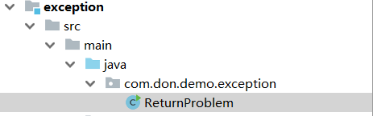

# 第一章    异常

## 1.1 异常概念

异常，就是不正常的意思。在生活中:医生说,你的身体某个部位有异常,该部位和正常相比有点不同,该部位的功能将受影响.在程序中的意思就是：

* **异常** ：指的是程序在执行过程中，出现的非正常的情况，最终会导致JVM的非正常停止。

在Java等面向对象的编程语言中，异常本身是一个类，产生异常就是创建异常对象并抛出了一个异常对象。Java处理异常的方式是中断处理。

> 异常指的并不是语法错误,语法错了,编译不通过,不会产生字节码文件,根本不能运行.

## 1.2 异常体系

异常机制其实是帮助我们**找到**程序中的问题，异常的根类是`java.lang.Throwable`，其下有两个子类：`java.lang.Error`与`java.lang.Exception`，平常所说的异常指`java.lang.Exception`。


**Throwable体系：**

* **Error**:严重错误Error，无法通过处理的错误，只能事先避免，好比绝症。
* **Exception**:表示异常，异常产生后程序员可以通过代码的方式纠正，使程序继续运行，是必须要处理的。好比感冒、阑尾炎。

**Throwable中的常用方法：**

* `public void printStackTrace()`:打印异常的详细信息。

  *包含了异常的类型,异常的原因,还包括异常出现的位置,在开发和调试阶段,都得使用printStackTrace。*

* `public String getMessage()`:获取发生异常的原因。

  *提示给用户的时候,就提示错误原因。*

* `public String toString()`:获取异常的类型和异常描述信息(不用)。

***出现异常,不要紧张,把异常的简单类名,拷贝到API中去查。***


## 1.3 异常分类

我们平常说的异常就是指Exception，因为这类异常一旦出现，我们就要对代码进行更正，修复程序。

**异常(Exception)的分类**:根据在编译时期还是运行时期去检查异常?

* **编译时期异常**:checked异常。在编译时期,就会检查,如果没有处理异常,则编译失败。(如日期格式化异常)
* **运行时期异常**:runtime异常。在运行时期,检查异常.在编译时期,运行异常不会编译器检测(不报错)。(如数学异常)

​    

## 1.4     异常的产生过程解析

先运行下面的程序，程序会产生一个数组索引越界异常ArrayIndexOfBoundsException。我们通过图解来解析下异常产生的过程。

 工具类

~~~java
public class ArrayTools {
    // 对给定的数组通过给定的角标获取元素。
    public static int getElement(int[] arr, int index) {
        int element = arr[index];
        return element;
    }
}
~~~

 测试类

~~~java
public class ExceptionDemo {
    public static void main(String[] args) {
        int[] arr = { 34, 12, 67 };
        intnum = ArrayTools.getElement(arr, 4)
        System.out.println("num=" + num);
        System.out.println("over");
    }
}
~~~

上述程序执行过程图解：

 

# 第二章 异常的处理

Java异常处理的五个关键字：**try、catch、finally、throw、throws**

## 2.1 	抛出异常throw

在编写程序时，我们必须要考虑程序出现问题的情况。比如，在定义方法时，方法需要接受参数。那么，当调用方法使用接受到的参数时，首先需要先对参数数据进行合法的判断，数据若不合法，就应该告诉调用者，传递合法的数据进来。这时需要使用抛出异常的方式来告诉调用者。

在java中，提供了一个**throw**关键字，它用来抛出一个指定的异常对象。那么，抛出一个异常具体如何操作呢？

1. 创建一个异常对象。封装一些提示信息(信息可以自己编写)。

2. 需要将这个异常对象告知给调用者。怎么告知呢？怎么将这个异常对象传递到调用者处呢？通过关键字throw就可以完成。throw 异常对象。

   throw**用在方法内**，用来抛出一个异常对象，将这个异常对象传递到调用者处，并结束当前方法的执行。

**使用格式：**

~~~
throw new 异常类名(参数);
~~~

 例如：

~~~java
throw new NullPointerException("要访问的arr数组不存在");

throw new ArrayIndexOutOfBoundsException("该索引在数组中不存在，已超出范围");
~~~

学习完抛出异常的格式后，我们通过下面程序演示下throw的使用。

~~~java
public class ThrowDemo {
    public static void main(String[] args) {
        //创建一个数组 
        int[] arr = {2,4,52,2};
        //根据索引找对应的元素 
        int index = 4;
        int element = getElement(arr, index);

        System.out.println(element);
        System.out.println("over");
    }
    /*
     * 根据 索引找到数组中对应的元素
     */
    public static int getElement(int[] arr,int index){ 
       	//判断  索引是否越界
        if(index<0 || index>arr.length-1){
             /*
             判断条件如果满足，当执行完throw抛出异常对象后，方法已经无法继续运算。
             这时就会结束当前方法的执行，并将异常告知给调用者。这时就需要通过异常来解决。 
              */
             throw new ArrayIndexOutOfBoundsException("哥们，角标越界了~~~");
        }
        int element = arr[index];
        return element;
    }
}
~~~

> 注意：如果产生了问题，我们就会throw将问题描述类即异常进行抛出，也就是将问题返回给该方法的调用者。
>
> 那么对于调用者来说，该怎么处理呢？一种是进行捕获处理，另一种就是继续讲问题声明出去，使用throws声明处理。

## 2.2 Objects非空判断

还记得我们学习过一个类Objects吗，曾经提到过它由一些静态的实用方法组成，这些方法是null-save（空指针安全的）或null-tolerant（容忍空指针的），那么在它的源码中，对对象为null的值进行了抛出异常操作。

* `public static <T> T requireNonNull(T obj)`:查看指定引用对象不是null。

查看源码发现这里对为null的进行了抛出异常操作：

~~~java
public static <T> T requireNonNull(T obj) {
    if (obj == null)
      	throw new NullPointerException();
    return obj;
}
~~~

## 2.3  声明异常throws

**声明异常**：将问题标识出来，报告给调用者。如果方法内通过throw抛出了编译时异常，而没有捕获处理（稍后讲解该方式），那么必须通过throws进行声明，让调用者去处理。

关键字**throws**运用于方法声明之上,用于表示当前方法不处理异常,而是提醒该方法的调用者来处理异常(抛出异常).

**声明异常格式：**

~~~
修饰符 返回值类型 方法名(参数) throws 异常类名1,异常类名2…{   }	
~~~

声明异常的代码演示：

~~~java
public class ThrowsDemo {
    public static void main(String[] args) throws FileNotFoundException {
        read("a.txt");
    }

    // 如果定义功能时有问题发生需要报告给调用者。可以通过在方法上使用throws关键字进行声明
    public static void read(String path) throws FileNotFoundException {
        if (!path.equals("a.txt")) {//如果不是 a.txt这个文件 
            // 我假设  如果不是 a.txt 认为 该文件不存在 是一个错误 也就是异常  throw
            throw new FileNotFoundException("文件不存在");
        }
    }
}
~~~

throws用于进行异常类的声明，若该方法可能有多种异常情况产生，那么在throws后面可以写多个异常类，用逗号隔开。

~~~java
public class ThrowsDemo2 {
    public static void main(String[] args) throws IOException {
        read("a.txt");
    }

    public static void read(String path)throws FileNotFoundException, IOException {
        if (!path.equals("a.txt")) {//如果不是 a.txt这个文件 
            // 我假设  如果不是 a.txt 认为 该文件不存在 是一个错误 也就是异常  throw
            throw new FileNotFoundException("文件不存在");
        }
        if (!path.equals("b.txt")) {
            throw new IOException();
        }
    }
}
~~~

## 2.4  try…catch

**捕获异常**

1. 该方法不处理,而是声明抛出,由该方法的调用者来处理(throws)。
2. 在方法中使用try-catch的语句块来处理异常。

~~~java
try{
     编写可能会出现异常的代码
}catch(异常类型  e){
     处理异常的代码
     //记录日志/打印异常信息/继续抛出异常
}
~~~

* `public String getMessage()`:获取异常的描述信息,原因(提示给用户的时候,就提示错误原因。


* `public String toString()`:获取异常的类型和异常描述信息(不用)。
* `public void printStackTrace()`:打印异常的跟踪栈信息并输出到控制台。

​            *包含了异常的类型,异常的原因,还包括异常出现的位置,在开发和调试阶段,都得使用printStackTrace。*

**捕获顺序**

一般我们是使用**一次捕获多次处理**方式，格式如下：

```java
try{
     编写可能会出现异常的代码
}catch(异常类型A  e){  当try中出现A类型异常,就用该catch来捕获.
     处理异常的代码
     //记录日志/打印异常信息/继续抛出异常
}catch(异常类型B  e){  当try中出现B类型异常,就用该catch来捕获.
     处理异常的代码
     //记录日志/打印异常信息/继续抛出异常
}
```

> 注意:这种异常处理方式，要求多个catch中的异常不能相同，并且若catch中的多个异常之间有子父类异常的关系，那么子类异常要求在上面的catch处理，父类异常在下面的catch处理。

## 2.4 finally 

**finally**：有一些特定的代码无论异常是否发生，都需要执行。另外，因为异常会引发程序跳转，导致有些语句执行不到。而finally就是解决这个问题的，在finally代码块中存放的代码都是一定会被执行的。

什么时候的代码必须最终执行？

当我们在try语句块中打开了一些物理资源(磁盘文件/网络连接/数据库连接等),我们都得在使用完之后,最终关闭打开的资源。

finally的语法:

 try...catch....finally:自身需要处理异常,最终还得关闭资源。

> 注意:finally不能单独使用。

比如在我们之后学习的IO流中，当打开了一个关联文件的资源，最后程序不管结果如何，都需要把这个资源关闭掉。

finally代码参考如下：

~~~java
public class TryCatchDemo4 {
    public static void main(String[] args) {
        try {
            read("a.txt");
        } catch (FileNotFoundException e) {
            //抓取到的是编译期异常  抛出去的是运行期 
            throw new RuntimeException(e);
        } finally {
            System.out.println("不管程序怎样，这里都将会被执行。");
        }
        System.out.println("over");
    }
    /*
     *
     * 我们 当前的这个方法中 有异常  有编译期异常
     */
    public static void read(String path) throws FileNotFoundException {
        if (!path.equals("a.txt")) {//如果不是 a.txt这个文件 
            // 我假设  如果不是 a.txt 认为 该文件不存在 是一个错误 也就是异常  throw
            throw new FileNotFoundException("文件不存在");
        }
    }
}
~~~

> 当只有在try或者catch中调用退出JVM的相关方法,此时finally才不会执行,否则finally永远会执行。

## return执行顺序

### 介绍

1. 不管有没有出现异常，有没有return，finally块中代码都会执行；
2. finally块中的内容会先于try、catch中的return语句执行，如果finally语句块中也有return语句的话，那么直接从finally中返回了，finally 里面的return会覆盖前面try、catch的return，这也是不建议在finally中return的原因；
3. try、catch的 return的是本地变量表的新的变量（i的复制），提前入栈，但并不返回，先执行finally，如果是基本类型，那么finally无法改变（没有指针），除非是引用变量，改变实际对象。可以通过查看反编译来证明



## throw执行顺序


```java
Exception in thread "main" com.don.demo.exception.ThrowProblem$MyException
	at com.don.demo.exception.ThrowProblem.main(ThrowProblem.java:13)
```

个人分析：与try或catch中发生return的同时，finally又发生return的情况差不多一样。 也就是说，finally的throw也像return也像一样具有使程序提前结束的作用。因为try或catch中发生return的时候实际还未真正的return（如果有finally块的话），还要等finally块执行完成，此时如果finally块中有return语句的话就直接return了，就使程序结束了（也不管前面的try或catch中发生的return）。

同理，如果存在finally语句而且catch发生抛出异常（并未真正抛出，还要等待finally块执行之后），此时finally如果正好也抛出了异常，**则真正抛出的异常就是finally中的异常，同时程序也就结束。**所以catch发生抛出异常并未真正抛出。


## 异常栈怎么看

#### 例子

```java
public class ExceptionStackInformation {
	public void ex1() {
		throw new RuntimeException("1");
	}

	public void ex2() {
		try {
			ex1();
		} catch (Exception e) {
			throw new RuntimeException("2", e);
		}

	}

	public void ex3() {
		try {
			ex2();
		} catch (Exception e) {
			throw new RuntimeException("3", e);
		}

	}

	public static void main(String[] args) {
		ExceptionStackInformation nestedException = new ExceptionStackInformation();
		nestedException.ex3();
	}
}

//异常栈  
 Exception in thread "main" java.lang.RuntimeException: 3 //造成程序结束的最外面的异常
	at com.don.review.exception.ExceptionStackInformation.ex3(ExceptionStackInformation.java:33) //异常最开始抛出的位置 ： ex3()的28行，没有处理，接着往上抛
	at com.don.review.exception.ExceptionStackInformation.main(ExceptionStackInformation.java:40) //抛出异常的方法在哪里被调用：main函数调用了ex3(),位置是35行
Caused by: java.lang.RuntimeException: 2 // 上面异常是由本异常引起抛出的
	at com.don.review.exception.ExceptionStackInformation.ex2(ExceptionStackInformation.java:24)
	at com.don.review.exception.ExceptionStackInformation.ex3(ExceptionStackInformation.java:31)
	... 1 more
Caused by: java.lang.RuntimeException: 1
	at com.don.review.exception.ExceptionStackInformation.ex1(ExceptionStackInformation.java:17)
	at com.don.review.exception.ExceptionStackInformation.ex2(ExceptionStackInformation.java:22)
	... 2 more
```

​	

# 第三章 自定义异常

## 3.1 概述

**为什么需要自定义异常类:**

我们说了Java中不同的异常类,分别表示着某一种具体的异常情况,那么在开发中总是有些异常情况是SUN没有定义好的,此时我们根据自己业务的异常情况来定义异常类。例如年龄负数问题,考试成绩负数问题等等。

在上述代码中，发现这些异常都是JDK内部定义好的，但是实际开发中也会出现很多异常,这些异常很可能在JDK中没有定义过,例如年龄负数问题,考试成绩负数问题.那么能不能自己定义异常呢？

**什么是自定义异常类:**

在开发中根据自己业务的异常情况来定义异常类.

自定义一个业务逻辑异常: **RegisterException**。一个注册异常类。

**异常类如何定义:**

1. 自定义一个编译期异常: 自定义类 并继承于`java.lang.Exception`。
2. 自定义一个运行时期的异常类:自定义类 并继承于`java.lang.RuntimeException`。

## 3.2 自定义异常的练习

要求：我们模拟注册操作，如果用户名已存在，则抛出异常并提示：亲，该用户名已经被注册。

首先定义一个登陆异常类RegisterException：

~~~java
// 业务逻辑异常
public class RegisterException extends Exception {
    /**
     * 空参构造
     */
    public RegisterException() {
    }

    /**
     *
     * @param message 表示异常提示
     */
    public RegisterException(String message) {
        super(message);
    }
}
~~~

模拟登陆操作，使用数组模拟数据库中存储的数据，并提供当前注册账号是否存在方法用于判断。

~~~java
public class Demo {
    // 模拟数据库中已存在账号
    private static String[] names = {"bill","hill","jill"};
   
    public static void main(String[] args) {     
        //调用方法
        try{
              // 可能出现异常的代码
            checkUsername("nill");
            System.out.println("注册成功");//如果没有异常就是注册成功
        }catch(RegisterException e){
            //处理异常
            e.printStackTrace();
        }
    }

    //判断当前注册账号是否存在
    //因为是编译期异常，又想调用者去处理 所以声明该异常
    public static boolean checkUsername(String uname) throws LoginException{
        for (String name : names) {
            if(name.equals(uname)){//如果名字在这里面 就抛出登陆异常
                throw new RegisterException("亲"+name+"已经被注册了！");
            }
        }
        return true;
    }
}
~~~

# JVM如何处理Exception

通过上面简单的介绍，对于Exception的基本概念，相信大家至少有了一定了解。接下来我们看看JVM是如何处理Exception的。

首先，我们需要定义一个会抛异常的方法，和对应try/catch代码块对该异常方法的处理，具体代码如下所示：

```java
public class OneExceptionService {

    public void createSomeException() {
        throw new IllegalArgumentException("Have some exception");
    }
}

public class MiddleService {

    private OneExceptionService oneExceptionService;
    
    public void catchException() {
        try {
            oneExceptionService.createSomeException();
        } catch (Exception e) {
            throw new RuntimeException(e);
        }
    }
}
```

对于我们接下来讲解的内容来说，上面的代码会显得繁琐，是因为我们后面还会继续用到这一组代码。接下来我们仅仅需要关注catchException方法对应字节码，如下所示：

```java
  public void catchException();
    Code:
       0: aload_0
       1: getfield      #2                  // Field oneExceptionService:Lme/hergootian/exception/OneExceptionService;
       4: invokevirtual #3                  // Method me/hergootian/exception/OneExceptionService.createSomeException:()V
       7: goto          20
      10: astore_1
      11: new           #7                  // class java/lang/RuntimeException
      14: dup
      15: aload_1
      16: invokespecial #8                  // Method java/lang/RuntimeException."<init>":(Ljava/lang/Throwable;)V
      19: athrow
      20: return
    Exception table:
       from    to  target type
           0     7    10   Class java/lang/Exception
```

在编译生成的字节码中，我们会看到下方有一个异常表（Exception table）。异常表中包含4个属性，from和to代表异常监控范围，target表示异常处理的开始，type表示异常处理所捕获的异常类型。这个异常表存储在Non-Heap空间上的PermGen/Metaspace区域。

那么当我们的程序出现异常的时候，JVM会如何处理这个异常表呢？

1. 首先查找出现异常的方法对应异常表，如果当前方法异常表不为空，对异常表其中一个条目进行判断，异常是否发生在该条目from到to监控的代码行，同时type匹配，则JVM调用位于target指向的处理逻辑进行处理；
2. 如果上述过程未找到符合条件的处理者，则继续查找异常表中的其他条目；
3. 当遍历完整个方法的异常表仍未找到符合条件的处理者，则向上查找（弹栈）；
4. 查找当前方法的调用方法的异常表，重复上述1-3的逻辑；
5. 如果所有栈帧均被弹出，却仍未找到合适的处理者，则抛给当前执行线程，线程则会终止；
6. 如果当前线程是最后一个非守护线程，且异常仍未得到处理，则会导致JVM终止运行。

# Exception真的影响性能么

> **catch异常会影响性能**

我相信一定有人听到过这样的说法。如果说catch异常会影响性能，那么我们对所有的异常都不处理，在程序最外层统一处理异常是不是更好呢？按照上面JVM处理异常的方式可知，当异常无法被处理时，会将方法逐个弹栈遍历，那么这个遍历过程是不是更慢呢？

接下来我们通过例子试着给这个说法一个解释，我们完善上边的代码，增加一个unCatchException方法，代码如下所示：

```java
public class MiddleService {

    private OneExceptionService oneExceptionService;

    public MiddleService(OneExceptionService oneExceptionService) {
        this.oneExceptionService = oneExceptionService;
    }

    public void unCatchException() {
        oneExceptionService.createSomeException();
    }

    public void catchException() {
        try {
            oneExceptionService.createSomeException();
        } catch (Exception e) {
            throw new RuntimeException(e);
        }
    }
}
```

之后我们再增加一个服务，调用我们的MiddleService，一方面好方便我们做性能测试，另一方面符合最外层统一异常处理的场景，同时，为了查看实例化Exception是否真的有性能开销，我们再增加一层try/catch，代码示例如下：

```java
@Slf4j
public class FacadeService {

    private MiddleService middleService;

    public FacadeService(MiddleService middleService) {
        this.middleService = middleService;
    }

    public void callUnCatchException() {
        try {
            middleService.unCatchException();
        } catch (Exception e) {
            log.error("Catch Exception:", e);
        }
    }

    public void callCatchException() {
        try {
            middleService.catchException();
        } catch (Exception e) {
            log.error("Catch Exception:", e);
        }
    }
    
    public void callMoreCatchException() {
        try {
            addOneLayerCatch();
        } catch (Exception e) {
            log.error("Catch Exception:", e);
        }
    }
    
    private void addOneLayerCatch() {
        try {
            middleService.catchException();
        } catch (Exception e) {
            throw new RuntimeException(e);
        }
    }
}
```

之后我们通过JMH对FacadeService的两个方法做测试，性能测试结果如下所示：

```java
Benchmark                                    Mode  Cnt   Score   Error   Units
ExceptionBenchmark.callCatchException       thrpt   80  25.897 ± 0.232  ops/ms
ExceptionBenchmark.callUnCatchException     thrpt   80  28.128 ± 2.608  ops/ms
ExceptionBenchmark.callMoreCatchException   thrpt   80  21.477 ± 1.234  ops/ms
复制代码
```

通过测试报告我们可以看到更少被try/catch包裹的方法调用栈，性能确实会更好一些。异常处理真正耗时的地方是对Exception实例的构建，因为需要对栈进行快照，这是相对很重的操作。

知道了异常处理耗时较多的部分。我们换一个角度思考，如果一个程序已经出现异常，毕竟程序已经不可正确运行了，那么还有必要追求性能么？或者说这个性能在真实场景下影响的是什么？

我们知道一段逻辑的处理如果慢，那么单位时间内的处理次数一定会受到影响，那么我们再用JMH做一次测试，先看测试报告：

```java
Benchmark                                                                     Mode       Cnt    Score   Error  Units
ExceptionBenchmark.callCatchException                                       sample  10184827    0.314 ± 0.001  ms/op
ExceptionBenchmark.callCatchException:callCatchException·p0.00              sample              0.043          ms/op
ExceptionBenchmark.callCatchException:callCatchException·p0.50              sample              0.084          ms/op
ExceptionBenchmark.callCatchException:callCatchException·p0.90              sample              0.443          ms/op
ExceptionBenchmark.callCatchException:callCatchException·p0.95              sample              2.118          ms/op
ExceptionBenchmark.callCatchException:callCatchException·p0.99              sample              3.936          ms/op
ExceptionBenchmark.callCatchException:callCatchException·p0.999             sample             10.355          ms/op
ExceptionBenchmark.callCatchException:callCatchException·p0.9999            sample             16.007          ms/op
ExceptionBenchmark.callCatchException:callCatchException·p1.00              sample            369.623          ms/op
ExceptionBenchmark.callUnCatchException                                     sample  10231220    0.313 ± 0.001  ms/op
ExceptionBenchmark.callUnCatchException:callUnCatchException·p0.00          sample              0.046          ms/op
ExceptionBenchmark.callUnCatchException:callUnCatchException·p0.50          sample              0.083          ms/op
ExceptionBenchmark.callUnCatchException:callUnCatchException·p0.90          sample              0.421          ms/op
ExceptionBenchmark.callUnCatchException:callUnCatchException·p0.95          sample              2.097          ms/op
ExceptionBenchmark.callUnCatchException:callUnCatchException·p0.99          sample              3.969          ms/op
ExceptionBenchmark.callUnCatchException:callUnCatchException·p0.999         sample             10.682          ms/op
ExceptionBenchmark.callUnCatchException:callUnCatchException·p0.9999        sample             16.663          ms/op
ExceptionBenchmark.callUnCatchException:callUnCatchException·p1.00          sample            500.695          ms/op
复制代码
```

单纯的针对异常场景谈性能真的意义不大，但是放到真实环境下，由于单位时间内的处理次数的降低，意味着你的系统吞吐量上不去，那也就是部分异常场景，影响到了正常场景下的体验。

回到上面的问题，因为异常处理会影响性能，最终反应到系统层面是降低了系统整体吞吐量。那么，我们就任其抛出而不做处理么？相信每一个在日志中排查过问题的软件工程师，都不能完全认同这个观点，那要如何如何处理？在回答这个问题之前，我们先把性能问题说完。Exception实例化耗时的地方在于构建StackTrace，JDK源码如下：

```java
public synchronized Throwable fillInStackTrace() {
    if (stackTrace != null || backtrace != null) {
        fillInStackTrace(0);
        stackTrace = UNASSIGNED_STACK;
    }
    return this;
}
```

那么有没有办法不构建StackTrace呢？如果你使用的版本是JDK1.7或更高版本，那我们可以通过重写构造方法来达到这个目的，在JDK1.7中对Exception类增加了如下方法：

```java
/**
 * Constructs a new exception with the specified detail message,
 * cause, suppression enabled or disabled, and writable stack
 * trace enabled or disabled.
 *
 * @param  message the detail message.
 * @param cause the cause.  (A {@code null} value is permitted,
 * and indicates that the cause is nonexistent or unknown.)
 * @param enableSuppression whether or not suppression is enabled
 *                          or disabled
 * @param writableStackTrace whether or not the stack trace should
 *                           be writable
 * @since 1.7
 */
protected Exception(String message, Throwable cause,
                    boolean enableSuppression,
                    boolean writableStackTrace) {
    super(message, cause, enableSuppression, writableStackTrace);
}
```

上述构造方法可以通过参数指定是否构建StackTrace，那么我们定义自己的异常类，完善上面的测试用例，异常类如下所示：

```java
public class MyException extends RuntimeException {

    public MyException(Throwable cause, String message) {
        super(message, cause, false, false);
    }
}
```

之后我们在MiddleService中增加一个新方法，如下代码所示：

```java
public class MiddleService {

    public void catchMyException() {
        try {
            oneExceptionService.createSomeException();
        } catch (Exception e) {
            throw new MyException(e);
        }
    }
}
```

同时在FacadeService中同样增加一个新方法，代码如下所示：

```java
@Slf4j
public class FacadeService {

    public void callCatchMyException() {
        try {
            middleService.catchMyException();
        } catch (Exception e) {
            log.error("Catch Exception:", e);
        }
    }
}
复制代码
```

再通过JMH进行一轮测试，测试报告如下所示：

```java
Benchmark                                    Mode  Cnt   Score   Error   Units
ExceptionBenchmark.callCatchException       thrpt   80  25.897 ± 0.232  ops/ms
ExceptionBenchmark.callUnCatchException     thrpt   80  28.128 ± 2.608  ops/ms
ExceptionBenchmark.callMoreCatchException   thrpt   80  21.477 ± 1.234  ops/ms
ExceptionBenchmark.callCatchMyException     thrpt   80  29.445 ± 0.370  ops/ms
复制代码
```

通过报告我们能看到很明显的性能提升。但是在实际开发中为什么很少会这样使用？因为StackTrace可以帮助我们定位问题，缺失的StackTrace会让你在排查问题时丧失很多关键信息，所以不建议使用。

同时，针对同类型异常短时间内频繁出现的情况（这个默认次数其实很高），为了提升性能，JVM本身也做了类似的优化处理，会导致异常堆栈的信息并不完全。需要指定参数**-XX:-OmitStackTraceInFastThrow**，才可以取消优化，让异常对栈信息完整呈现。

# 处理Exception的正确姿势

在讨论处理Exception的正确姿势之前，让我们回到上面案例代码FacadeService中，看一下callCatchException和callUnCatchException以及callMoreCatchException的异常堆栈信息的区别。

```java
- callUnCatchException -
java.lang.IllegalArgumentException: Have some exception
	at me.hergootian.exception.OneExceptionService.createSomeException(OneExceptionService.java:9)
	at me.hergootian.exception.MiddleService.unCatchException(MiddleService.java:15)
	at me.hergootian.exception.FacadeService.and(FacadeService.java:63)
	at me.hergootian.exception.FacadeService.callUnCatchException(FacadeService.java:16)
	......


- callCatchException -
java.lang.RuntimeException: java.lang.IllegalArgumentException: Have some exception
	at me.hergootian.exception.MiddleService.catchException(MiddleService.java:30)
	at me.hergootian.exception.FacadeService.then(FacadeService.java:59)
	at me.hergootian.exception.FacadeService.callCatchException(FacadeService.java:24)
	at me.hergootian.exception.ExceptionTest.testCallCatchException(ExceptionTest.java:15)
    ......
Caused by: java.lang.IllegalArgumentException: Have some exception
	at me.hergootian.exception.OneExceptionService.createSomeException(OneExceptionService.java:9)
	at me.hergootian.exception.MiddleService.catchException(MiddleService.java:28)
	... 25 common frames omitted
	
	
- callMoreCatchException -
java.lang.Exception: java.lang.RuntimeException: java.lang.IllegalArgumentException: Have some exception
    at me.hergootian.exception.FacadeService.more(FacadeService.java:50)
    at me.hergootian.exception.FacadeService.callMultiCatchException(FacadeService.java:40)
    at me.hergootian.exception.ExceptionTest.testCallMultiCatchException(ExceptionTest.java:27)
    ......
Caused by: java.lang.RuntimeException: java.lang.IllegalArgumentException: Have some exception
    at me.hergootian.exception.MiddleService.catchException(MiddleService.java:30)
    at me.hergootian.exception.FacadeService.more(FacadeService.java:48)
    ... 24 common frames omitted
Caused by: java.lang.IllegalArgumentException: Have some exception
    at me.hergootian.exception.OneExceptionService.createSomeException(OneExceptionService.java:9)
    at me.hergootian.exception.MiddleService.catchException(MiddleService.java:28)
    ... 25 common frames omitted
复制代码
```

通过日志中的堆栈信息，不仅仅从性能上考虑，其实按照堆栈清晰度来讲，我们都不要过多的catch并再次包装异常。

> **切记不要在系统内每个层级均捕获且重新包装异常**

虽然我们前面探讨了catch异常，以及实例化Exception是非常耗时的操作，但是我们通过上面的异常堆栈信息，以及我们日常系统维护、排查问题时，也知道不清晰的异常堆栈对我们定位问题的干扰。

每一层都捕获异常看起来好似让系统更健壮了，但是性能是其次，混乱复杂的异常堆栈会让你回来点赞的。其实每一层均尝试补货异常，本身的问题在于你对自身系统分层的不明确，编码时考虑不全面所造成的。

> **Throw early, Catch late**

对于异常处理有一个原则就是**Throw early， Catch late**，意思就是对于系统运行时可能发生异常的地方我们要尽早的判断/捕获，将更明确可能引起系统问题的错误暴露出来。在系统合适的地方，或者说能够处理这个异常的地方捕获异常做相应处理。

> **不要拿异常做分支**

在部分系统中会有那异常流做分支的，仅仅站在性能上考虑，这种方式都不会比if/else更好。

但是有时我们会针对入参做校验，然后以参数类异常的方式告知方法的调用方。那么最后在系统的最外层做好防御性校验，如果这种异常很明确，不需要额外的异常堆栈，可尝试重写Exception的构造方法，取消StackTrace的构建，从而提升性能增强系统负载。


作者：Hergootian
链接：https://juejin.cn/post/6844904100493000711
来源：掘金
著作权归作者所有。商业转载请联系作者获得授权，非商业转载请注明出处。
