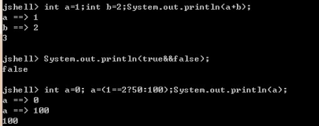
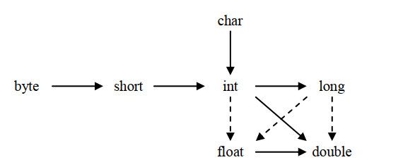
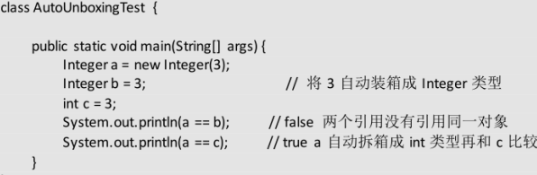
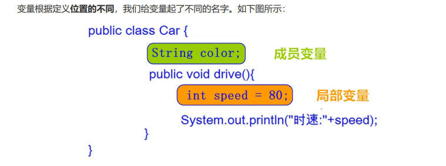
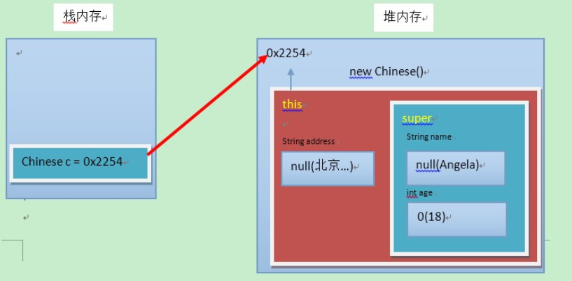

# 运算符

**三元运算符格式**  

```
数据类型 变量名 = 布尔类型表达式？结果1：结果2  
```

**& 和 && 的区别**  

&运算符有两种用法： (1)按位与； (2)逻辑与。

&&运算符是短路与运算。逻辑与跟短路与的差别是非常巨大的，虽然二者都要求运算符左右两端的布尔值都是true 整个表达式的值才是 true。

&&之所以称为短路运算是因为，如果&&左边的表达式的值是 false，右边的表达式会被直接短路掉，不会进行运算。很多时候我们可能都需要用&&而不是&，例如在验证用户登录时判定用户名不是 null 而且不是空字符串，应当写为 username != null &&!username.equals("")，二者的顺序不能交换，更不能用&运算符，因为第一个条件如果不成立，根本不能进行字符串的 equals 比较，否则会产生 NullPointerException 异常。

**注意**：逻辑或运算符（|）和短路或运算符（||）的差别也是如此。  

# 流程控制

## switch

```java
switch (表达式) {
    case 常量值1:
        语句体1;
        break;
    case 常量值2:
        语句体2;
        break;
        ...
    default:
        语句体n + 1;
        break;
}
```

> switch语句中，表达式的数据类型，可以是byte，short，int，char，enum（枚举），JDK7后可以接收字符串。

> 注意：
>
> ​		在switch语句中，如果case的后面不写break，将出现穿透现象，也就是不会在判断下一个case的值，直接向后运行，直到遇到break，或者整体switch结束。
>
> ​		default 分支，该分支一般是 switch 语句的最后一个分支（可以在任何位置，但建议在最后一个）。default 在没有 case 语句的值和变量值相等的时候执行。default 分支不需要 break 语句

```java
public class Test {
   public static void main(String args[]){
      //char grade = args[0].charAt(0);
      char grade = 'C';
 
      switch(grade)
      {
         case 'A' :
            System.out.println("优秀"); 
            break;
         case 'B' :
         case 'C' :
            System.out.println("良好");
            break;
         case 'D' :
            System.out.println("及格");
            break;
         case 'F' :
            System.out.println("你需要再努力努力");
            break;
         default :
            System.out.println("未知等级");
      }
      System.out.println("你的等级是 " + grade);
   }
}
```


## 循环

for

while

do...while

break

continue

## 带标记break，continue

在最外层循环前加一个标记如 A，然后用 break A;可以跳出多重循环。（Java 中支持带标签的 break 和 continue语句，作用有点类似于 C 和 C++中的 goto 语句，但是就像要避免使用 goto 一样，应该避免用带标签的 break和 continue，因为它不会让你的程序变得更优雅，很多时候甚至有相反的作用） 。  

# Jshell

jdk9




# 基本数据类型

## 介绍

https://blog.csdn.net/qq_36098284/article/details/80709524 

| 数据类型     | 关键字               | 内存占用 | 取值范围                            |
| ------------ | -------------------- | -------- | ----------------------------------- |
| 字节型       | byte                 | 1个字节  | -128~127                            |
| 短整型       | short（很少用）      | 2个字节  | -2^15~2^15-1（32767）               |
| 整型         | int（默认）          | 4个字节  | -2^31~2^31-1 （21亿）2147483647     |
| 长整型       | long（次常用，L，l） | 8个字节  | -2^63~2^63-1（9223372036854775807） |
| 单精度浮点数 | float（F，f）        | 4个字节  | [-3.4E38,3.4E38]                    |
| 双精度浮点数 | double（默认）       | 8个字节  | [-1.7E308,1.7E308]                  |
| 字符型       | char                 | 2个字节  | 0-65535，Unicode 字符               |
| 布尔类型     | boolean              | 1个字节  | true，false                         |

> Java中的默认类型：整数类型是 int 、浮点类型是 double 。定义的 long 型数据后面加 L或 l。  

## 整型

四种整数类型(byte、short、int、long)：  

`int i=5`; // 5 叫直接量（或字面量），即 直接写出的常数。 整数字面量默认都为 int 类型，所以在定义的 long 型数据后面加 L或 l。  

小于 32 位数的变量，都按 int 结果计算。byte和short可以隐式转换成int，但是long不可以。所以会发生类型提升。

强转符比数学运算符优先级高。

对于byte/short/char三种类型来说，如果右侧赋值的数值没有超过范围，那么javac编译器将会自动隐含地为我们补上一个(byte)(short)(char)。如果右侧超过了左侧范围，那么直接编译器报错。


## 浮点数

> 待解决

1. 二 进 制 浮 点 数 ：

   1010100010=101010001.0*2=10101000.10*2^10（2次方)=1010100.010*2^11(3次方)= . 1010100010*2^1010(10次方)   

    尾数：1010100010   

    指数：1010  

    基数：2    

2. 浮点数字面量默认都为 double 类型，所以在定义的 float 型数据后面加F 或 f；double 类型可不写后缀，但在小数计算中一定要写 D 或 X.X  

3. float  的精度没有 long 高，有效位数（尾数短）。 float  的范围大于 long指数可以很大。 


## 字符型

 char：16 位，是整数类型，用单引号括起来的 1 个字符（可以是一个中文字符），使用 Unicode 码代表字符，0~2^16-1（65535） 。  

  注意事项：   

1. 不能为 0个字符。   

2. 转义字符：\n  换行  \r  回车  \t Tab 字符  \" 双引号  \\ 表示一个\    

3. 两字符 char 中间用“+”连接，内部先把字符转成 int 类型，再进行加法运算，**char 本质就是个数！二进制的，显示的时候，经过“处理”显示为字符。**

例如IO流write一个数字会转换成字符。

```java
//byte和char的转换
byte BYTE_LBRACKET = (byte) '[';
```


## 布尔型

true ；false

# 类型转换

#### 隐式转换



中六个实箭头表示无信息损失的转换，而三个虚箭头表示的转换则可能会丢失精度。  

#### 强制转换

直接砍掉其他字节。①会损失精度，产生误差，小数点以后的数字全部舍弃。②容易超过取值范围。

#### long变float

为什么作为64位的long可以隐式转换成32位的float？（因为一般你会发现，隐式转换都是位数小转位数大的） 

解答：

  最为一个常识，我们都知道浮点型在内存中占用的是4个字节的空间，而long型占用的是8个字节的空间。可是为什么4个字节的float型的最大值会大于long型的最大值呢？
　　我们都知道，float类型的范围是：一3.403E38~3.403E38。而long类型的范围是：-2^63~2^63-1（大概是9*10^18）。
　　我以前也是简单的记住就算完事了，对于它为什么会这样却没有考虑过。
　　下面给大家分享一下我现在的理解：
　　long整型数，在内存中占用8个字节共64位，它表示的数值有2的64次方，平分正负，数值范围是负2的63次方到正2的63次方-1。

　　而float在内存中占4个字节，共32位，

   但是浮点数在内存中是这样的：

　　V=(-1)^s * M * 2^E
　　 667x190
　　浮点数的32位不是简单的直接表示大小，而是按照一定的标准分配的。
　　其中第1位，符号位，即S。
　　接下来的8位，指数域，即E。
　　剩下的23位，小数域，即M，M的取值范围为[1，2）或[0，1）。
　　也就是说，浮点数在内存中的二进制值不是直接转换为十进制数值的，而是按照上述公式计算而来，通过这个公式，虽然只用到了4个字节，但是浮点数却比长整型的最大值要大。

　　这也就是为什么在数据转换的时候，long类型转换为float类型的根本原因所在！
[Java中float和double转换的问题？](https://blog.csdn.net/dianyueneo/article/details/7754763)

# 自动装箱和拆箱

1. 当 "=="运算符的两个操作数都是 包装器类型的引用，则是比较指向的是否是同一个对象，而如果其中有一个操作数是表达式（即包含算术运算）则比较的是数值（即会触发自动拆箱的过程）。

2. 另外，对于包装器类型，equals方法并不会进行类型转换。

3. 注意，Integer、Short、Byte、Character、Long这几个类的valueOf方法的实现是类似的。Double、Float的valueOf方法的实现是类似的。

### Integer



```java
public class Main {
    public static void main(String[] args) {
         
        Integer i1 = 100;
        Integer i2 = 100;
        Integer i3 = 200;
        Integer i4 = 200;
         
        System.out.println(i1==i2);//true
        System.out.println(i3==i4);//false
    }
}
```

```java
//自动装箱，有缓存区域    
	public static Integer valueOf(int i) {
        if (i >= IntegerCache.low && i <= IntegerCache.high)
            return IntegerCache.cache[i + (-IntegerCache.low)];
        return new Integer(i);
    }
//算术运算会引发自动拆箱
	public int intValue() {
        return value;
    }
```

### Double

```java
public class Main {
    public static void main(String[] args) {
         
        Double i1 = 100.0;
        Double i2 = 100.0;
        Double i3 = 200.0;
        Double i4 = 200.0;
         
        System.out.println(i1==i2);//false
        System.out.println(i3==i4);//false
    }
}
```

```java
//Double的自动装箱，在某个范围内的整型数值的个数是有限的，而浮点数却不是。
	public Double(double value) {
        this.value = value;
    }
```

### Bollean

```java
	public static Boolean valueOf(boolean b) {
        return (b ? TRUE : FALSE);
    }	
	    /**
     * The {@code Boolean} object corresponding to the primitive
     * value {@code true}.
     */
    public static final Boolean TRUE = new Boolean(true);

    /**
     * The {@code Boolean} object corresponding to the primitive
     * value {@code false}.
     */
    public static final Boolean FALSE = new Boolean(false);
```

### equals

```java
public class Main {
    public static void main(String[] args) {
         
        Integer a = 1;
        Integer b = 2;
        Integer c = 3;
        Integer d = 3;
        Integer e = 321;
        Integer f = 321;
        Long g = 3L;
        Long h = 2L;
         
        System.out.println(c==d);
        System.out.println(e==f);
        System.out.println(c==(a+b));
        System.out.println(c.equals(a+b));
        System.out.println(g==(a+b));
        System.out.println(g.equals(a+b));//false，不可比较类型
        System.out.println(g.equals(a+h));//true，对于a+h，先自动触发拆箱，就变成了int类型和long类型相加，这个会触发类型晋升，结果是long类型的，然后会触发装箱过程，就变成Long了。因此比较结果是true。
    }
}
```

```java
    public boolean equals(Object obj) {
        if (obj instanceof Long) {
            return value == ((Long)obj).longValue();
        }
        return false;
    }
```

# 常量与变量

## 常量

指在Java程序中固定不变的数据。 **字面量，直接量。**

| 类型       | 含义                                   | 数据举例                    |
| ---------- | -------------------------------------- | --------------------------- |
| 整数常量   | 所有的整数                             | 0，1， 567， -9             |
| 小数常量   | 所有的小数                             | 0.0， -0.1， 2.55           |
| 字符常量   | 单引号引起来,只能写一个字符,必须有内容 | 'a' ， ' '， '好'           |
| 字符串常量 | 双引号引起来,可以写多个字符,也可以不写 | "A" ，"Hello" ，"你好" ，"" |
| 布尔常量   | 只有两个值（流程控制中讲解）           | true ， false               |
| 空常量     | 只有一个值（引用数据类型中讲解）       | null                        |

## 变量

常量是固定不变的数据，那么在程序中可以变化的量称为变量  

**数据类型分类**

基本数据类型：包括 整数 、 浮点数 、 字符 、 布尔 。泛型不可以使用这些。比如`java.util.Arrays#asList`
引用数据类型：包括 类 、 数组 、 接口 。泛型包括数组类型。

数组：

```java
 int[][][][] ints = new int[5][6][7][];//最里面的5是最外层
```


## 常量和变量的运算

```java
public static void main(String[] args){
    byte b1=1;
    byte b2=2;
    byte b3=1 + 2;
    byte b4=b1 + b2;
    System.out.println(b3);
    System.out.println(b4);
}
```

分析： b3 = 1 + 2 ， 1 和 2 是常量，**为固定不变的数据，在编译的时候（编译器javac）**，已经确定了 1+2 的结果并没有超过byte类型的取值范围，可以赋值给变量 b3 ，因此 b3=1 + 2 是正确的。
反之， b4 = b2 + b3 ， b2 和 b3 是变量，**变量的值是可能变化的，在编译的时候，编译器javac不确定b2+b3的结果是什么，因此会将结果以int类型进行处理**，所以int类型不能赋值给byte类型，因此编译失败。  

## 问题

#### 1. 如果一个数大于maxInt会如何转化为int，截取后面32位

```java
public class ExtraMaxInt {
	public static void main(String[] args) {

		System.out.println(Integer.MAX_VALUE);

		int j = (int) (1L << 32);
		System.out.println(j);//

		long i = (1L << 32) * 43 + 7987;
		System.out.println(i);//打印处准确的long
		System.out.println((int) i); // 截取后面32位

	}
}
```

#### 2. short s1 = 1; s1 = s1 + 1; 有错吗?short s1 = 1; s1 += 1 有错吗？

前者不正确，后者正确。 对于 short s1 = 1; s1 = s1 + 1;由于 1 是 int 类型，因此 s1+1 运算结果也是 int 型，需要强制转换类型才能赋值给 short 型。而 short s1 = 1; s1 += 1;可以正确编译，因为 s1+= 1;相当于 s1 =(short)(s1 + 1);其中有隐含的强制类型转换。  

#### 3.int类型的数计算后如果超过范围，则会转化为负数

```java
		System.out.println(Integer.MAX_VALUE);//    2147483647
		System.out.println(Integer.MAX_VALUE*2);//  -2
		System.out.println(Integer.MAX_VALUE*2L);// 4294967294
```


# 面向对象

面向对象是前提，继承、重写、多态三者层层上升，并且依赖前者。

封装是习惯、编程思想。

## 对象

### field默认值

|          | 数据类型                       | 默认值   |
| -------- | ------------------------------ | -------- |
| 基本类型 | 整数（byte，short，int，long） | 0        |
|          | 浮点数（float，double）        | 0.0      |
|          | 字符（char）                   | '\u0000' |
|          | 布尔（boolean）                | false    |
| 引用类型 | 数组，类，接口                 | null     |

### 成员变量和局部变量区别



- 在类中的位置不同 重点
  - 成员变量：类中，方法外
  - 局部变量：方法中或者方法声明上(形式参数)
- 作用范围不一样 重点
  - 成员变量：类中
  - 局部变量：方法中
- 初始化值的不同 重点
  - 成员变量：有默认值
  - 局部变量：没有默认值。必须先定义，赋值，最后使用
- 在内存中的位置不同 了解
  - 成员变量：堆内存
  - 局部变量：栈内存
- 生命周期不同 了解
  - 成员变量：随着对象的创建而存在，随着对象的消失而消失
  - 局部变量：随着方法的调用而存在，随着方法的调用完毕而消失  


## 抽象

抽象类本质还是一个类，需要被继承,不能显式new而已。但是接口不是类，是方法集合

1. 抽象类不能创建对象，如果创建，编译无法通过而报错。只能创建其非抽象子类的对象。

   > 理解：假设创建了抽象类的对象，调用抽象的方法，而抽象方法没有具体的方法体，没有意义。

2. 抽象类中，可以有构造方法，是供子类创建对象时，初始化父类成员使用的。

   > 理解：子类的构造方法中，有默认的super()，需要访问父类构造方法。
   >
   > 抽象类也是有成员field的，

3. 抽象类中，不一定包含抽象方法，但是有抽象方法的类必定是抽象类。  

   > 理解：未包含抽象方法的抽象类，目的就是不想让调用者创建该类对象，通常用于某些特殊的类结构设计。

4. 抽象类的子类，必须重写抽象父类中所有的抽象方法，否则，编译无法通过而报错。除非该子类也是抽象类。

   > 理解：假设不重写所有抽象方法，则类中可能包含抽象方法。那么创建对象后，调用抽象的方法，没有意义。  

## 接口

接口，是Java语言中一种引用类型，是方法的集合  包含抽象方法（JDK 7及以前），默认方法和静态方法（JDK 8），私有方法（JDK 9）。  

接口中，没有构造方法，不能创建对象。
接口中，没有静态代码块。  

- 抽象方法

  不能同时是静态方法，没有类会重写。不能私有，没有人实现

  ```java
      // 这是一个抽象方法
      public abstract void methodAbs1();
  
      // 这也是抽象方法
      abstract void methodAbs2();
  
      // 这也是抽象方法
      public void methodAbs3();
  
      // 这也是抽象方法
      void methodAbs4();
  ```

- 默认方法

  ```java
  可以通过接口实现类对象，直接调用
  也可以被接口实现类进行覆盖重写。
  当一个类，既继承一个父类，又实现若干个接口时，父类中的成员方法与接口中的默认方法重名，子类就近选择执行父类的成员方法。
  	// 新添加的方法，改成默认方法
  	public default void methodDefault() {
  		System.out.println("这是新添加的默认方法");
  	}
  ```

- 静态方法

  供接口直接调用

- 私有方法

  ```java
  解决多个默认方法之间重复代码问题
  格式：
  private 返回值类型 方法名称(参数列表) {
      方法体
  }
  ```

- 私有静态方法

  ```java
  解决多个静态方法之间重复代码问题
  格式：
  private static 返回值类型 方法名称(参数列表) {
      方法体
   }
  ```

- 常量

  ```java
  /*
  接口当中也可以定义“成员变量”，但是必须使用public static final三个关键字进行修饰。
  从效果上看，这其实就是接口的【常量】。
  格式：
  public static final 数据类型 常量名称 = 数据值;
  备注：
  一旦使用final关键字进行修饰，说明不可改变。
  
  注意事项：
  1. 接口当中的常量，可以省略public static final，注意：不写也照样是这样。
  2. 接口当中的常量，必须进行赋值；不能不赋值。
  3. 接口中常量的名称，使用完全大写的字母，用下划线进行分隔。（推荐命名规则）
   */
      public static final int NUM_OF_MY_CLASS = 12;
  ```

  

## 封装

### 介绍

将属性隐藏起来，若需要访问某个属性，提供公共方法对其访问。  

1. 使用 **private** 关键字来修饰成员变量。

2. 对需要访问的成员变量，提供对应的一对 getXxx 方法 、 setXxx 方法。  

### this

this代表所在类的当前对象的引用（地址值），即对象自己的引用。

记住 ：方法被哪个对象调用，方法中的this就代表那个对象。即谁在调用，this就代表谁。  

```java
this.成员变量名;
outClass.this.// 内部类对象使用内部类对象
```

## 继承

### 介绍

继承：就是子类继承父类的属性和行为，使得子类对象具有与父类相同的属性、相同的行为。子类可以直接访问父类中的**非私有**的属性和行为。  

1. 提高代码的复用性。
2. 类与类之间产生了关系，是多态的前提。  

### this

内部类中的this是的类是内部类，外部类.this才是外部类的对象


### super

代表父类的存储空间标识(可以理解为父亲的引用)。  

子父类中出现了同名的成员变量时，在子类中需要访问父类中非私有成员变量时，需要使用 super 关键字，修饰父类成员变量  

构造方法的作用是初始化成员变量的。所以子类的初始化过程中，必须先执行父类的初始化动作。子类的构造方法中默认有一个 super() ，表示调用父类的构造方法，父类成员变量初始化后，才可以给子类使用。  

### 父类空间优先于子类对象产生

在每次创建子类对象时，先初始化父类空间，再创建其子类对象本身。目的在于子类对象中包含了其对应的父类空间，便可以包含其父类的成员，如果父类成员非private修饰，则子类可以随意使用父类成员。代码体现在子类的构造方法调用时，一定先调用父类的构造方法。理解图解如下：  



### field

以下说的都是基于 `instance.field` 的用法。如果是bean方法，那么直接看方法内部调用什么field就好了。

#### static field

static field、method 属于class的，**没有继承，更加没有多态**，按照赋值类型执行对应的 method 或者 field

#### instance field

1. 多态：**所有 instance field 没有多态，按照赋值类型取值，与实际类型无关**，只能获取对应的赋值类型的field，没有就会报错

2. 继承：父类   instance field 可以被继承并且直接使用，**前提是子类可以有该父类 field 的访问权限**（不局限于public ） ，如果没有访问权限表示与自己无关，父类私有，必须使用super指针。注解不可继承

3. 重写：field没有重写的概念，可以但是在声明会隐藏**自己有访问权限的父类field**，这时在子类对象内部使用 `super.父类field` 才能访问 `父类field`。

   ```
   Within a class, a field that has the same name as a field in the superclass hides the superclass's field, even if their types are different. Within the subclass, the field in the superclass cannot be referenced by its simple name. Instead, the field must be accessed through super, which is covered in the next section. Generally speaking, we don't recommend hiding fields as it makes code difficult to read.
   ```

```java
package com.don.demo.basic.grammar;

/**
 * 没有方法时的field
 * <p>
 * 说明feild 的 继承 、 重写、 多态 行为
 */
public class InheritFiled {

    static class Father {
        // face没有多态行为
        private String face = "father_face";

        // 子类有访问权限，可以继承直接使用 head ; foot 为 private ，无法继承 就需要super指向父类 ; compound 被重写，需要 super指向父类
        private String foot = "father_hand";
        String head = "father_head";
        public String compound = "father_compound";
    }

    static class Son extends Father {
        private String face = "son_face";
        public String compound = head + super.foot + super.compound;
    }

    public static void main(String[] args) {
        Son son = new Son();
        Father father = new Father();
        Father _son = new Son();

        // instance field 没有多态，按照赋值类型取值，与实际类型无关
        System.out.println(son.face);
        System.out.println(father.face);
        System.out.println(_son.face);

        System.out.println();

        // 继承和不继承field
        System.out.println(son.compound);
    }
}

```


## 重写

重写要求子类被重写方法与父类被重写方法有相同的返回类型（子类）

比父类被重写方法更好访问

不能比父类被重写方法声明更多的异常（里氏代换原则）  

子类可以重写父类的具体方法为抽象方法。

接口可以重写Object类的方法为抽象方法。


## 多态

继承是多态的前提。

扩展性和便利性

重点：**只有对实例方法的访问才是多态，实例field不存在多态，只会按照赋值类型调用。**

```java
父类、接口类型 变量名 = new 子类对象、接口实现类；
变量名.方法名(); //该行为被称为虚拟方法调用，该方法被称为虚拟方法。
```

当使用多态方式调用方法时，首先检查父类中是否有该方法，如果没有，则编译错误；如果有，执行的是子类重写后方法。  

instanceOf关键字

## final

不可改变。可以用于修饰类、方法和变量。
类：被修饰的类，不能被继承。
方法：被修饰的方法，不能被重写。
变量：被修饰的变量，不能被重新赋值 。 

## 访问权限

|                            | public | protected | default（空的） | private |
| -------------------------- | ------ | --------- | --------------- | ------- |
| 同一类中                   | √      | √         | √               | √       |
| 同一包中(包括子类与无关类) | √      | √         | √               |         |
| 不同包的子类               | √      | √         |                 |         |
| 不同包中的无关类           | √      |           |                 |         |

## 内部类

### 匿名内部类

### 静态内部类和普通内部类

**静态**嵌套类： 

> ​		Static Nested Class 是被声明为静态（static）的内部类，它可以不依赖于外部类实例被实例化。主要用来简化包级别。
>
> ​		static只能使用static的东西，非static的东西都需要先创建对象。可以并且只可以访问外部类的**静态成员**（只能静态）。
>
> ​		其实就是以直接调用static构造器。
>
> ​		

**普通**内部类： 

> ​		需要在外部类实例化后才能实例化，其语法看起来挺诡异的。  静态方法中没有 this，也就是说没有所谓的外部类对象，因此**无法调用普通构造器**（类似普通方法），也就无法创建内部类对象 。
>
> ​		其实就是相当于对象调用实例构造器。
>
> ```java
> 外部类名.内部类名 对象名 = new 外部类型().new 内部类型()  
> ```
>
> ​		外部类对象的创建先于普通内部类的建立，因此普通内部类可以访问外部类的实例成员。静态成员更不必说。值得一提的是普通内部类不能定义静态成员和方法。
>
> ​		静态、普通外部类要访问内部类的实例成员，必须要建立内部类的对象。  

**总结**
尽量不要使用普通内部类。

```java
public class InnerClass {
	class CommonInnerClass {
	}
    static class StaticInnerClass {
    }

    public static void foo() {
        //new CommonInnerClass();  静态方法不能使用普通内部类，报错
    }
    public  void foo2() {
        new CommonInnerClass();
    }

    public static void main(String[] args) {
        //new CommonInnerClass(); 报错
        new InnerClass().new CommonInnerClass();
        new StaticInnerClass(); // 普通类使用
    }
}
```


## 问题

1. 抽象的(abstract)方法是否可同时是静态的(static), 是否可同时是本地方法(native)，是否可同时被 synchronized？

   都不能。抽象方法需要子类重写，而静态的方法是无法被重写的，因此二者是矛盾的。本地方法是由本地代码（如 C 代码）实现的方法，而抽象方法是没有实现的，也是矛盾的。 synchronized 和方法的实现细节有关，抽象方法不涉及实现细节，因此也是相互矛盾的。  

2. ==和 equals 的区别  ？

   equals 和== 最大的区别是一个是方法一个是运算符。

   - ==：如果比较的对象是基本数据类型，则比较的是数值是否相等；如果比较的是引用数据类型，则比较的是对象的地址值是否相等。

   - equals()：用来比较方法两个对象的内容是否相等。

     注意： equals 方法不能用于基本数据类型的变量，如果没有对 equals 方法进行重写，则比较的是引用类型的变量所指向的对象的地址。  

# 新特性

https://blog.csdn.net/f641385712/article/details/81286231

# 模块化

https://www.51cto.com/article/620291.html

https://www.zhihu.com/question/610866431

# 文件

# [Java实现监听文件变化的三种方法，推荐第三种](https://segmentfault.com/a/1190000041913336)