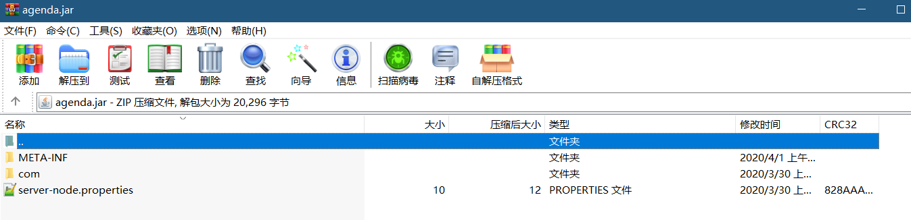
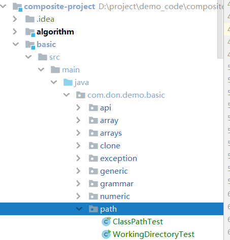

# 工作目录

### 获取

可以看看io文件夹下的 [File、递归.md](C:/Users/TJR_S/OneDrive/%E7%BC%96%E7%A8%8B/1.%20javaSE/IO/File%E3%80%81%E9%80%92%E5%BD%92.md)

```java
//工作目录就是下面的目录，可以在代码中拿到。
new File("").getAbsolutePath()
```

### class

如果是运行class文件，那么工作目录是全路径的上一层。

```java
//cmd下运行
java com.don.demo.basic.path.WorkingDirectoryTest;
//工作目录是com所在目录
//IDEA可以改变工作目录 `%MODULE_WORKING_DIR%`比较好，默认project_Dir
```

### jar

如果是运行jar包，那么就是jar包所在的目录

**jar目录获取的其他方法，并不是很好用**

```java
//获取类所在jar包的绝对路径 ../**.jar
//this.getClass().getProtectionDomain().getCodeSource().getLocation().getPath(); 因为程序已经被打包成jar包，所以getPath()和getFile()在这里的返回值是一样的。
String jarWholePath = JWCrawler.class.getProtectionDomain().getCodeSource().getLocation().getFile(); 
// jarWholePath 如果路径包含Unicode字符，还需要将路径转码
try {
    jarWholePath = java.net.URLDecoder.decode(jarWholePath, "UTF-8");
} catch (UnsupportedEncodingException e) {
    System.out.println(e.toString());
}
//获取jar包的目录，也就是父路径
String jarPath = new File(jarWholePath).getParentFile().getAbsolutePath();
```

# 类路径，内部路径

### 获取

1. 使用 getResource 获取 URL
2. 使用 getResourceAsStream 直接获取 URL 代表的 stream 
3. 底层都是依靠classLoader
4. 如果是properties文件那么，获取stream后可以直接注入properties集合
5. 注意URLEncode

### class

如果是运行class文件，很简单，就是IDEA的 target下面的classes路径或者部署后的类路径


### jar

如果是运行jar文件，获取内部类路径和运行class时一样。

```java
Properties properties = new Properties();
InputStream resourceAsStream = Agenda.class.getResourceAsStream("/server-node.properties");
properties.load(resourceAsStream);

//打成jar包的时候，注意需要把资源打进jar包里面
jar cvfm agenda.jar manifest-addition.MF com server-node.properties
```



# web应用路径

```java
//Web应用程序 中，得到Web应用程序的根目录的绝对路径。这样，我们只需要提供相对于Web应用程序根目录的路径，就可以构建出定位资源的绝对路径。 底层应该也是差不多的
ServletActionContext.getServletContext().getRealPath(“/”)
```

# 代码

