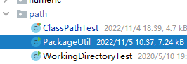

# File的基地址

工作目录和getResource完全不是同一个概念，分开来看。

By default the classes in the java.io package always resolve relative pathnames against the current user directory. This 
directory is named by the `system property user.dir,` and is typically the directory in which the Java virtual machine was invoked.

```java

new File("").getAbsolutePath()
```

# jar所在目录

**并不是很好用**

```java
//获取类所在jar包的绝对路径 ../**.jar
//this.getClass().getProtectionDomain().getCodeSource().getLocation().getPath(); 因为程序已经被打包成jar包，所以getPath()和getFile()在这里的返回值是一样的。
String jarWholePath = JWCrawler.class.getProtectionDomain().getCodeSource().getLocation().getFile(); 
// jarWholePath 如果路径包含Unicode字符，还需要将路径转码
try {
    jarWholePath = java.net.URLDecoder.decode(jarWholePath, "UTF-8");
} catch (UnsupportedEncodingException e) {
    System.out.println(e.toString());
}
//获取jar包的目录，也就是父路径
String jarPath = new File(jarWholePath).getParentFile().getAbsolutePath();
```

# getResource

一般使用class或者classloader，用getResource 来获取时，返回的是一个URL，不同的资源有不用的protocol。

### 获取

1. 使用 getResource 获取 URL
2. 使用 getResourceAsStream 直接获取 URL 代表的 stream 
3. 底层都是依靠classLoader.getResource()，注意不要使用"/"开头，为null；class.getResource()如果用“/”则会去掉，如果不使用则会加上当前包路径。
4. 如果是properties文件那么，获取stream后可以直接注入properties集合
5. 注意URLEncode，默认encoding就行了
6. 注意jar的打包方式，生成目录结构。

### 运行class

如果是运行class文件，很简单，就是IDEA的 target下面的classes路径或者部署后的类路径


### 运行jar

如果是运行jar文件，获取内部类路径和运行class时一样。

注意不要用classLoader.getResource("")来获取jar路径，jar没有路径，直接获取详细一层的路径。如ClassPathTest.class.getResource("")

```java
Properties properties = new Properties();
InputStream resourceAsStream = Agenda.class.getResourceAsStream("/server-node.properties");//从class加载是相对class，加/能变成相对工作路径。
properties.load(resourceAsStream);

//打成jar包的时候，注意需要把资源打进jar包里面
jar cvfm agenda.jar manifest-addition.MF com server-node.properties
```


# web应用路径

```java
//Web应用程序 中，得到Web应用程序的根目录的绝对路径。这样，我们只需要提供相对于Web应用程序根目录的路径，就可以构建出定位资源的绝对路径。 底层应该也是差不多的
ServletActionContext.getServletContext().getRealPath(“/”)
```

# 代码


# 包路径

Java遍历包中所有类 https://blog.csdn.net/wangpeng047/article/details/8124390

Java遍历jar包所有类-后续 http://blog.csdn.net/wangpeng047/article/details/8202353

Java遍历包中所有类-终续 http://blog.csdn.net/wangpeng047/article/details/8206427

