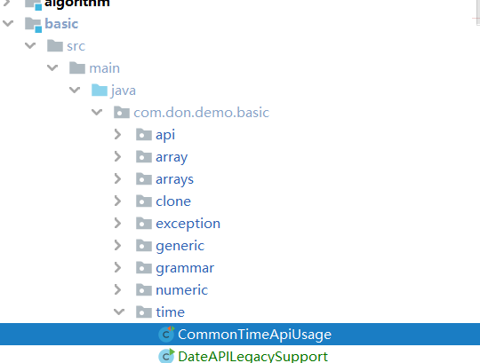

# 旧的

**总结**： Calendar设置时间，Date是显示时间，Dateformat是转换Date和String

#### Date

表示特定的瞬间，精确到毫秒。  

```java
public Date() 
// 时间戳和日期的转换
public Date(long date) 

public long getTime() 
```

#### DateFormat

https://docs.oracle.com/javase/6/docs/api/java/text/SimpleDateFormat.html?is-external=true

是日期/时间格式化子类的抽象类，我们通过这个类可以帮我们完成日期和文本之间的转换,也就是可以在Date对象与String对象之间进行来回转换  

| 标识字母（区分大小写） | 含义 |
| ---------------------- | ---- |
| y                      | 年   |
| M                      | 月   |
| d                      | 日   |
| H                      | 时   |
| m                      | 分   |
| s                      | 秒   |

```
new SimpleDateFormat("yyyy-MM-dd HH:mm:ss")
```

#### Calendar

`java.util.Calendar` 是日历类，在Date后出现，替换掉了许多Date的方法。该类将所有可能用到的时间信息封装为静态成员变量，方便获取。日历类就是方便获取各个时间属性，**设置时间**。  

#### 用法

```
获取现在的年月日时分秒
从 1970 年 1 月 1 日 0 时 0 分 0 秒到现在的毫秒数,时间戳
某月的一天
打印昨天的当前时刻
格式化日期
```




# 新的

看[pdf](file:///C:/Users/TJR_S/OneDrive/%E7%BC%96%E7%A8%8B/1.%20javaSE/%E5%9F%BA%E7%A1%80/%E6%97%A5%E6%9C%9F%E5%92%8C%E6%97%B6%E9%97%B4.pdf)

