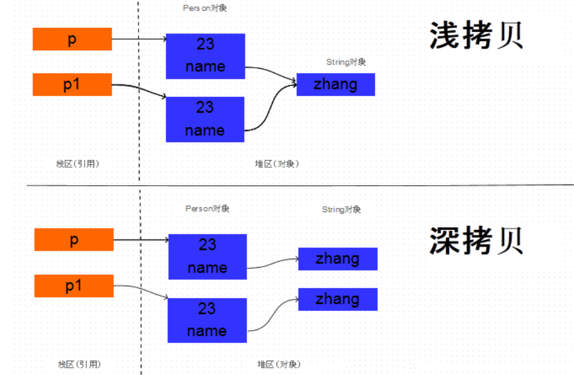

## 1.cloneable实现

clone（）方法是克隆中最简单，也是最高效的手段  

实现 Cloneable 接口并重写 Object 类中的 clone()方法。

浅clone，只会clone八大基本类型，对象只会clone指针，递归重写实现深度clone。

String是不变类，没必要多创建一个对象，用同一个对象就可以。



```java
public class CloneByCloneable {
	//clone
	@Test
	public void test1() throws CloneNotSupportedException {
		Person p1 = new Person("awesome", 12, new Head(10, "头"));
		Person p2 = (Person) p1.clone();

		System.out.println(p1);
		System.out.println(p2);

		System.out.println(p1.getName() == p2.getName());//对象只会clone指针，因此是相等的
		System.out.println(p1.getHead() == p2.getHead());
	}

	@Data
	@ToString
	@NoArgsConstructor
	@AllArgsConstructor
	public static class Person implements Cloneable {

		private String name;
		private int age;
		private Head head;

		@Override
		public Object clone() throws CloneNotSupportedException {
			//自身需要clone，浅clone，只会clone八大基本类型，对象只会clone指针，String是不变类，没必要多创建一个对象，用同一个对象就可以
			Person clone2 = (Person) super.clone();

			//以下是深度clone需要的
			Object clone1 = head.clone();
			clone2.setHead((Head) clone1);

			return clone2;
		}

	}

	@Data
	@ToString
	@AllArgsConstructor
	@NoArgsConstructor
	public static class Head implements Cloneable {
		private int size;
		private String string;

		@Override
		public Object clone() throws CloneNotSupportedException {
			return super.clone();
		}

	}
}
```


## 2.serializable实现

递归实现 Serializable 接口，通过对象的序列化和反序列化(IO流)实现克隆，可以实现真正的深度克隆。

注意：基于序列化和反序列化实现的克隆不仅仅是深度克隆，更重要的是通过泛型限定，可以检查出要克隆的对象是否支持序列化，这项检查是编译器完成的，不是在运行时抛出异常，这种是方案明显优于使用 Object 类的 clone方法克隆对象。让问题在编译的时候暴露出来总是好过把问题留到运行时。

```java
public class CloneBySerializable {
	public CloneBySerializable() {

	}

	@Test
	public void test1() {
		try {
			Person p1 = new Person("Hao LUO", 33, new Car("Benz", 300));
			Person p2 = clone(p1); // 深度克隆
			p2.getCar().setBrand("BYD");
			// 修改克隆的 Person 对象 p2 关联的汽车对象的品牌属性
			// 原来的 Person 对象 p1 关联的汽车不会受到任何影响
			// 因为在克隆 Person 对象时其关联的汽车对象也被克隆了
			System.out.println(p1);
			System.out.println(p2);
		} catch (Exception e) {
			e.printStackTrace();
		}
	}

	@SuppressWarnings("unchecked")
	public static <T extends Serializable> T clone(T obj) throws Exception {
		ByteArrayOutputStream bout = new ByteArrayOutputStream();
		ObjectOutputStream oos = new ObjectOutputStream(bout);
		oos.writeObject(obj);

		ByteArrayInputStream bin = new ByteArrayInputStream(bout.toByteArray());
		ObjectInputStream ois = new ObjectInputStream(bin);
		return (T) ois.readObject();
		// 说明：调用 ByteArrayInputStream 或 ByteArrayOutputStream 对象的 close 方法没有任何意义
		// 这两个基于内存的流只要垃圾回收器清理对象就能够释放资源，这一点不同于对外部资源（如文件流）的释放
	}

	@Data
	@ToString
	@AllArgsConstructor
	@NoArgsConstructor
	static class Person implements Serializable {
		private static final long serialVersionUID = -9102017020286042305L;
		private String name; // 姓名
		private int age; // 年龄
		private Car car; // 座驾
	}

	@Data
	@ToString
	@AllArgsConstructor
	@NoArgsConstructor
	static class Car implements Serializable {
		private static final long serialVersionUID = -5713945027627603702L;
		private String brand; // 品牌
		private int maxSpeed; // 最高时速
	}
}

```

#