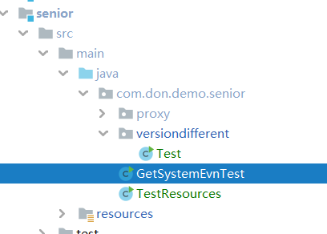
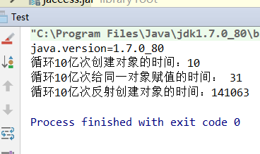
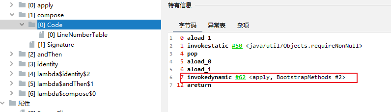

# Math

`java.lang.Math` 类包含用于执行基本数学运算的方法，如初等指数、对数、平方根和三角函数。类似这样的工具类，其所有方法均为静态方法，并且不会创建对象，调用起来非常简单。  

# Objects

在JDK7添加了一个Objects工具类，它提供了一些方法来操作对象，它由一些静态的实用方法组成，这些方法是nullsave（空指针安全的）或null-tolerant（容忍空指针的），用于计算对象的hashcode、返回对象的字符串表示形式、比较两个对象。  

# DigDecimal

### 使用

```java
    //四则运算
    @Test
    public void test1() {
        BigDecimal a = new BigDecimal("123");
        BigDecimal b = new BigDecimal("456");

        BigDecimal c = a.add(b);// 加
        BigDecimal d = a.subtract(b);// 减
        BigDecimal e = a.multiply(b);// 乘

        // 除
        // 参数2:指定精度,保留6位小数 ; 参数3: 选择舍入模式,此处为 四舍五入
        BigDecimal f = a.divide(b, 6, BigDecimal.ROUND_HALF_UP);

        // jdk 1.9中第三个参数 被RoundingMode取代
        //        BigDecimal f = a.divide(b, RoundingMode.DOWN);//舍弃小数位
        //        BigDecimal f = a.divide(b, 2, RoundingMode.HALF_DOWN);//2位小数;舍入模式为大于0.5进1，否则舍弃。


    }

    //比较大小
    @Test
    public void test2() {
        // 结果 : 1 表示 大于; 0 表示 等于; -1 表示 小于 .
        BigDecimal a1 = new BigDecimal(0.5);
        BigDecimal b1 = new BigDecimal(0.2);
        int c1 = a1.compareTo(b1); // 结果 C = 1
    }

    //正负
    @Test
    public void sign() {
        //返回 1 表示值 为正值 ;  0 表示 为 0 ;  -1 表示 负数 。
        BigDecimal a = new BigDecimal("123");
        int b = a.signum(); // 结果是 1
    }

    //构造器
    @Test
    public void constructTest() {
        //当我们用double类型的数据作为参数时，构造出的BigDecimal 对象value1并不能保证数据的准确性。
        //而用String作为参数时构造对象时，数据的准确性是有保证的。
        BigDecimal value1 = new BigDecimal(10.511);
        System.out.println("value1: " + value1);
        BigDecimal value2 = new BigDecimal("10.511");
        System.out.println("value2: " + value2);

    }


    //不可变
    @Test
    public void immutableTest() {
        BigDecimal count = new BigDecimal("1.3");
        BigDecimal add = count.add(new BigDecimal("9.2"));
        System.out.println("count:" + count);
        System.out.println("add:" + add);

    }
```

# [系统属性和环境变量](http://blog.xiayf.cn/2019/06/25/java-prop-env/)

2019-06-25 TueBy [xiayf](http://blog.xiayf.cn/author/xiayf.html)

原文：[Java System.getProperty vs System.getenv](https://www.baeldung.com/java-system-get-property-vs-system-getenv)

## 1、简介

Java 应用代码中会自动引入 `java.lang` 包。这个包包含很多常用的类，包括 `NullPointerException`、`Object`、`Math`、`String` 等等。

其中 `java.lang.System` 类是一个 final 类，这意味着开发者无法继承它，其所有方法都是静态的（static）。

System 类中有两个方法，分别来**读取系统属性（system properties）和环境变量（environment variables）**，下面我们来看看这两者的区别。

## System.getProperty()

Java 平台使用一个 `Properties` 对象来提供**本地系统相关的信息和配置**，我们称之为 **系统属性**。

系统属性包括当前用户、当前 Java 运行时版本 以及 文件路径分隔符诸如此类的信息。

如下代码中，我们使用 `System.getProperty("log_dir")` 来读取 *log_dir* 属性值。我们也会使用默认值参数，这样如果属性不存在，`getProperty` 则返回 */tmp/log*：

```
String log_dir = System.getProperty("log_dir", "/tmp/log");
```

如果希望在运行时变更系统属性，则可以使用 `System.setProperty` 方法：

```
System.setProperty("log_dir", "/tmp/log");
```

我们可以以如下格式使用命令行参数向应用传递指定属性或配置值：

```
java -jar jarName -DpropertyName=value
```

比如 将 app.jar 的 foo 属性值设置为 bar：

```java
java -jar app -Dfoo="bar"
```

System.getProperty 返回的一定是一个字符串。

## System.getenv()

环境变量是类似 Properties 的一些 键/值 对。许多操作系统都提供环境变量的方式向应用传递配置信息。

设置环境变量的方式，各操作系统之间有所不同。例如，Windows 中，我们使用控制面板中的系统工具（System Utility）应用来设置，而 Unix 系统则使用 shell 脚本。

**创建一个进程时，该进程默认会从其父进程继承一个克隆的上下文环境**。

如下代码片段演示：使用一个 lambda 表达式来输出所有环境变量。

```
System.getenv().forEach((k, v) -> {
    System.out.println(k + ":" + v);
});
```

**getenv() 返回一个只读的 `Map`**。尝试向该映射中添加值，会抛出 `UnsupportedOperationException` 异常。

可以使用变量名称作为参数调用 `getenv` 来获取单个变量值：

```
String log_dir = System.getenv("log_dir");
```

此外，我们可以在应用中创建一个新进程，并向其上下文环境中添加新的环境变量。

Java 中，我们使用 `ProcessBuilder` 类来创建新进程，该类有一个名为 `environment` 的方法，此方法返回一个 `Map`，不过这个映射不是只读的，这样就可以向其添加新元素：

```java
ProcessBuilder pb = new ProcessBuilder(args);
Map<String, String> env = pb.environment();
env.put("log_dir", "/tmp/log");
Process process = pb.start();
```

## 4、区别

这两者本质上都是提供 字符串类型 键值 信息的映射，区别在于：

1. 我们可以在运行时变更 系统属性（Properties），但是 环境变量（Environment Variables）仅是操作系统环境变量的一个不可变拷贝。（**cmd也体现了不可变，修改环境变量后需要重启cmd**）
2. 仅 Java 平台包含这个 系统属性 特性，而 环境变量 则是操作系统层面提供，全局可用的 - 运行在同一个机器上的所有应用都可以访问。
3. 系统属性 在打包应用时就必须存在[1](http://blog.xiayf.cn/2019/06/25/java-prop-env/#fn-1)，而 环境变量 则任意时刻都可以在操作系统中创建。

## 5、总结一下

虽然这两者在概念上比较相似，但是 系统属性 和 环境变量 的应用方式差别很大。

二选一通常考量的是生效范围。使用 环境变量，同一个应用可以部署到多个机器上运行不同的实例，并在操作系统级别或者在 AWS / Azure 云平台控制台中进行配置，以免更新配置时还得重新构建应用（**译注：其实使用 系统属性 也可以实现这个效果，比如在 shell 脚本中获取系统环境变量，然后作为系统属性通过 Java 命令行参数传递给应用**）。

`getProperty` 方法名称是驼峰风格，但 `getenv` 不是，谨记！

原文是这么写的，但我认为这句话有问题。系统属性明明可以在应用运行时通过命令行参数指定，也可以将属性文件打包到应用包中，在运行时加载（通过 System.getProperties().load 方法）。  

## 代码



# Class.isAssignableFrom与 instanceof 区别

1. isAssignableFrom 是用来判断一个类Class1和另一个类Class2是否相同或是另一个类的超类或接口。 

   通常调用格式是：Class1.isAssignableFrom (Class2) 

   	调用者和参数都是  java.lang.Class  类型。 

2. 而  instanceof  是用来判断一个对象实例是否是一个类或接口的或其子类子接口的实例。 

   格式是：  oo  instanceof  TypeName  

   ​	  第一个参数是对象实例名，第二个参数是具体的类名或接口名

```java
public class TestCase {  
    public static void main(String[] args) {  
        TestCase test = new TestCase();  
        test.testIsAssignedFrom1();  
        test.testIsAssignedFrom2();  
        test.testIsAssignedFrom3();  
        test.testInstanceOf1();  
        test.testInstanceOf2();  
    }  
  
    public void testIsAssignedFrom1() {  
        System.out.println(String.class.isAssignableFrom(Object.class));  
    }  
  
    public void testIsAssignedFrom2() {  
        System.out.println(Object.class.isAssignableFrom(Object.class));  
    }  
  
    public void testIsAssignedFrom3() {  
        System.out.println(Object.class.isAssignableFrom(String.class));  
    }  
  
    public void testInstanceOf1() {  
        String ss = "";  
        System.out.println(ss instanceof Object);  
    }  
  
    public void testInstanceOf2() {  
        Object o = new Object();  
        System.out.println(o instanceof Object);  
    }  
  
}  
//false  
//true  
//true  
//true  
//true  
```

# 执行外部程序和命令

### Runtime

[Java获取Windows系统指定软件进程号及启动软件](https://blog.csdn.net/loongshawn/article/details/53009445)

[Runtime.getRuntime().exec()](https://www.cnblogs.com/xinmengwuheng/p/5970255.html)

```java
public Process Runtime.getRuntime().exec(String[] cmdArray,String envp,File  dir) throws IOException; // 多个重载

//cmdarray - 包含所调用命令及其参数的数组。
//envp - 字符串数组，其中每个元素的环境变量的设置格式为 name=value，如果子进程应该继承当前进程的环境，或该参数为 null。
//dir - 子进程的工作目录；如果子进程应该继承当前进程的工作目录，则该参数为 null。
```

**bin/sh**

```java
Process p = Runtime.getRuntime().exec(new String[]{"/bin/sh","-c", "javap -l xxx > output.txt"});
```

**cmd**

```java
//打开记事本
String cmd = "cmd /k start notepad";
Process exec2 = Runtime.getRuntime().exec(cmd);
exec2.destroy();
```

> cmd /c dir 是执行完dir命令后关闭命令窗口。 
>
> cmd /k dir 是执行完dir命令后不关闭命令窗口。 
>
> cmd /c start dir 会打开一个新窗口后执行dir指令，原窗口会关闭。 
>
> cmd /k start dir 会打开一个新窗口后执行dir指令，原窗口不会关闭。 

### **Process**

```java
destroy()    //杀掉子进程
exitValue()    //返回子进程的出口值，值 `0` 表示正常终止
getErrorStream()    //获取子进程的错误流
getInputStream()    //获取子进程的输入流
getOutputStream()    //获取子进程的输出流
waitFor()    //导致当前线程等待，如有必要，一直要等到由该 `Process` 对象表示的进程已经终止。如果已终止该子进程，此方法立即返回。如果没有终止该子进程，调用的线程将被阻塞，直到退出子进程，根据惯例，`0` 表示正常终止
```

# main函数中args参数传递

.运行Java程序的同时，可以通过输入参数给main函数中的接收参数数组args[]，供程序内部使用

```java
package org.test;
public class Test {
	public static void main(String[] args) {
		System.out.println(args[0]);
		System.out.println(args[1]);
		System.out.println(args[2]);
	}
}

//运行： java org.test.Test aaa bbb ccc
```

# 退出程序

```java
//do something before terminate the jvm, if jvm process is kill , then won't help
Runtime.getRuntime().addShutdownHook(new Thread() {
    @Override
    public void run() {
        seleniumPool.close();
    }
});

//terminate the jvm
Runtime.getRuntime().exit(status);
```

# Stream

[Java 8 Stream(1)-流的使用及技巧](https://blog.csdn.net/weixin_45505313/article/details/103749552)

[Java 8 Stream(2)-原理解析](https://blog.csdn.net/weixin_45505313/article/details/106150967)

[13万字详细分析JDK中Stream的实现原理](https://www.throwx.cn/2021/10/06/stream-of-jdk/)

[Java Stream源码分析及知识点总结](https://blog.csdn.net/qq_36263268/article/details/113175067)

[google](https://www.google.com.hk/search?q=java+stream+%E6%9E%B6%E6%9E%84&newwindow=1&ei=NtO-Y970FIWhhwOw_L-gCg&ved=0ahUKEwje59-S6L_8AhWF0GEKHTD-D6QQ4dUDCA8&uact=5&oq=java+stream+%E6%9E%B6%E6%9E%84&gs_lcp=Cgxnd3Mtd2l6LXNlcnAQAzIFCCEQoAEyBQghEKABOgoIABBHENYEELADOgUIABCABEoECEEYAEoECEYYAFCOBViQEmCNFGgBcAF4AIABuAKIAdILkgEHMC40LjIuMZgBAKABAcgBAcABAQ&sclient=gws-wiz-serp)

[恕我直言你可能真的不会java第6篇：Stream性能差？不要人云亦云](https://zhuanlan.zhihu.com/p/150396560)

[Java 8 Stream的性能到底如何？](https://segmentfault.com/a/1190000004171551)

  

# 可变参数

可以采取数组方式传入或者多个参数。如果传入的是Object[] 数组的方式，那么JDK 拿到数组后就会拆分，这个时候new String[]{“1”,”2”}，就会拆分成了两个String类型的参数。因此想要传入数组参数的时候

```java
method.invoke(null,new String[]{"1","2"});

//改成：

method.invoke(null,new Object[]{new String[]{"1","2"}});
```

# Timer

[深入 Java Timer 定时调度器实现原理](https://juejin.cn/post/6844903741565435918)

[java.util.concurrent之ScheduledExecutorService——替代Timer，实现多线程任务调度](https://blog.csdn.net/weixin_41888813/article/details/90767979?depth_1-utm_source=distribute.pc_relevant.none-task-blog-BlogCommendFromMachineLearnPai2-6&utm_source=distribute.pc_relevant.none-task-blog-BlogCommendFromMachineLearnPai2-6)

[Java 中的定时任务：Timer基础 Timer的缺陷 ScheduledExecutorService优势](https://blog.csdn.net/u010003835/article/details/71480565)

# hashcode

[浅谈Java中的hashcode方法 ](https://www.cnblogs.com/dolphin0520/p/3681042.html)


# 代理

https://blog.csdn.net/sbc1232123321/article/details/79334130

# JNDI

https://www.iteye.com/blog/shitou521-696006 | JNDI到底是什么，有什么作用 - 石头 - ITeye博客
https://blog.csdn.net/w372426096/article/details/80449710 | [分布式]：关于命名服务的知识点都在这里了_Franco蜡笔小强的博客-CSDN博客
https://www.zhihu.com/question/505406778 | 各种java中间件为什么要提供jndi的支持？ - 知乎
https://blog.csdn.net/wanxiaoderen/article/details/106638603 | b java 之JNDI介绍--- SPI机制 & Java.Util.serviceLoader_jndi spi_舞动的痞老板的博客-CSDN博客

# SecurityManager

https://nicky-chen.github.io/2018/07/13/java-securitymanager/ | Java安全之SecurityManager
https://www.cnblogs.com/yiwangzhibujian/p/6207212.html | java安全管理器SecurityManager入门 - 已往之不谏 - 博客园

# 新特性

https://blog.csdn.net/f641385712/article/details/81286231

# 模块化

https://www.51cto.com/article/620291.html

https://www.zhihu.com/question/610866431

# 文件

# [Java实现监听文件变化的三种方法，推荐第三种](https://segmentfault.com/a/1190000041913336)

# 其他

[JAVA版本号的问题 Java版本号与JDK版本](https://blog.csdn.net/qq_37499840/article/details/89041335)

[Java静态类](https://www.cnblogs.com/Alex--Yang/p/3386863.html)

# 字节码操作

字节码随用随创建，随用随加载。
它与静态代理的区别也在于此。因为静态代理是字节码一上来就创建好，并完成加载。
装饰者模式就是静态代理的一种体现  

## 动态代理  

提供者： JDK 官方的 Proxy 类。
要求：被代理类最少实现一个接口。  

```java
public class Client {

	public static void main(String[] args) {
		final Producer producer = new Producer();

		/**
		 *  如何创建代理对象：
		 *      使用Proxy类中的newProxyInstance方法
		 *  创建代理对象的要求：
		 *      被代理类最少实现一个接口，如果没有则不能使用
		 *  newProxyInstance方法的参数：
		 *      ClassLoader：类加载器
		 *          它是用于加载代理对象字节码的。和被代理对象使用相同的类加载器。固定写法。
		 *      Class[]：字节码数组
		 *          它是用于让代理对象和被代理对象有相同方法。固定写法。
		 *      InvocationHandler：用于提供增强的代码
		 *          它是让我们写如何代理。我们一般都是写一个该接口的实现类，通常情况下都是匿名内部类，但不是必须的。
		 *          此接口的实现类都是谁用谁写。
		 */
		IProducer proxyProducer = (IProducer) Proxy.newProxyInstance(producer.getClass().getClassLoader(),
				producer.getClass().getInterfaces(),
				new InvocationHandler() {
					/**
					 * 作用：执行被代理对象的任何接口方法都会经过该方法
					 * 方法参数的含义
					 * @param proxy   代理对象的引用
					 * @param method  当前执行的方法
					 * @param args    当前执行方法所需的参数
					 * @return 和被代理对象方法有相同的返回值
					 * @throws Throwable
					 */
					@Override
					public Object invoke(Object proxy, Method method, Object[] args) throws Throwable {
						//提供增强的代码
						Object returnValue = null;

						//1.获取方法执行的参数
						Float money = (Float) args[0];
						//2.判断当前方法是不是销售
						if ("saleProduct".equals(method.getName())) {
							returnValue = method.invoke(producer, money * 0.8f);
						}
						return returnValue;
					}
				});
		proxyProducer.saleProduct(10000f);
	}
}

```

[JDK动态代理[4\]----ProxyGenerator生成代理类的字节码文件解析](https://www.cnblogs.com/liuyun1995/p/8144706.html)

[Java 学习：WeakCache 类](https://blog.csdn.net/dilixinxixitong2009/article/details/88362066)

## 字节码增强

提供者：第三方的 CGLib，如果报 asmxxxx 异常，需要导入 asm.jar。
要求：被代理类不能用 final 修饰的类（最终类）。  


```xml
   <dependencies>
        <dependency>
            <groupId>cglib</groupId>
            <artifactId>cglib</artifactId>
            <version>2.1_3</version>
        </dependency>
    </dependencies>
```


```java
/**
 * 基于子类的动态代理
 */
public class Client {

	public static void main(String[] args) {
		final Producer producer = new Producer();

		/**
		 *  如何创建代理对象：
		 *      使用Enhancer类中的create方法
		 *  创建代理对象的要求：
		 *      被代理类不能是最终类
		 *  create方法的参数：
		 *      Class：字节码
		 *          它是用于指定被代理对象的字节码。
		 *
		 *      Callback：用于提供增强的代码
		 *          它是让我们写如何代理。我们一般都是些一个该接口的实现类，通常情况下都是匿名内部类，但不是必须的。
		 *          此接口的实现类都是谁用谁写。
		 *          我们一般写的都是该接口的子接口实现类：MethodInterceptor
		 */
		Producer cglibProducer = (Producer) Enhancer.create(producer.getClass(), new MethodInterceptor() {
			/**
			 * 执行北地阿里对象的任何方法都会经过该方法
			 *    以上三个参数和基于接口的动态代理中invoke方法的参数是一样的
			 * @param methodProxy ：当前执行方法的代理对象
			 */
			@Override
			public Object intercept(Object proxy, Method method, Object[] args, MethodProxy methodProxy) throws Throwable {
				//提供增强的代码
				Object returnValue = null;

				//1.获取方法执行的参数
				Float money = (Float) args[0];
				//2.判断当前方法是不是销售
				if ("saleProduct".equals(method.getName())) {
					returnValue = method.invoke(producer, money * 0.8f);
				}
				return returnValue;
			}
		});
		cglibProducer.saleProduct(12000f);
	}
}

```


## 代码


# ClassLoader

[java类加载器不完整分析](https://blog.csdn.net/yangcheng33/article/details/52464898)

[真正理解线程上下文类加载器（多案例分析）](https://blog.csdn.net/yangcheng33/article/details/52631940)

[tomcat类加载机制了解一下](https://cloud.tencent.com/developer/article/1687353)

[深入探究JVM之类加载与双亲委派机制](https://www.cnblogs.com/yewy/p/13414144.html)

# JDK8

反射创建对象加快了。


****

# 错误

## Java找不到或无法加载主类

1. java执行class文件是根据CLASSPATH指定的地方来找，不是我们理解当前目录。如果希望它查询当前目录，需要在CLASSPATH中加入`.;`,代表当前目录。

   ```bash
   java -classpath . HelloWorld
   .;%JAVA_HOME%\lib\tools.jar;%JAVA_HOME%\lib\dt.jar
   ```

   

2. java执行class文件对package的路径是强依赖的。它在执行的时候会严格以当前用户路径为基础，按照package指定的包路径转化为文件路径去搜索class文件。

   **java文件**

   

   **目录**

   

   **编译运行**

   

   

   

来自 <https://www.cnblogs.com/wangxiaoha/p/6293340.html> 


## JAVA 编译出现编码GBK的不可映射字符

### 原因

由于JDK是国际版的，在编译的时候，如果我们没有用-encoding参数指定我们的JAVA源程序的编码格式，则javac.exe首先获得我们**操作系统默认采用的编码格式**。

在编译java程序时，若我们不指定源程序文件的编码格式：

> 1. JDK首先获得操作系统的file.encoding参数(它保存的就是操作系统默认的编码格式，如WIN2k，它的值为GBK)
>
> 2. 然后JDK就把我们的java源程序从file.encoding编码格式转化为JAVA内部默认的UNICODE格式放入内存中。
> 3. 然后，javac把转换后的unicode格式的文件进行编译成.class类文件，此时.class文件是UNICODE编码的，它暂放在内存中

对我们来说，我们最终获得的.class文件是内容以**UNICODE**编码格式保存的类文件，它内部包含我们源程序中的中文字符串，只不过此时它己经由file.encoding格式转化为UNICODE格式了。当我们不加设置就编译时，相当于使用了参数：`javac -encoding gbk XX.java`，当然就会出现不兼容的情况。

### 解决方法

1. 使用-encoding 指定字符集

```bash
javac -encoding utf-8 xx.java
```


2. 把源文件编码修改成ASCII，使用`notepad++`就可以

# 线程变量

线程传入的变量不会消失，尤其是内部类，从gc dump中可以看到属于线程变量。

> 主要对象不会消失，有可能发生内存泄露，因此需要设为null，或者注意线程的生命周期。

```java
// object[0]外部传进来，不会消失
new Thread() {
            public void run() {
                while (isRun) {
                    Object obj = null;
                    try {
                        obj = referenceQueue.remove();
                    } catch (InterruptedException e) {
                        e.printStackTrace();
                    }
                    if (obj != null) {
                        try {
                            Field rereferent = Reference.class
                                    .getDeclaredField("referent");
                            rereferent.setAccessible(true);
                            Object result = rereferent.get(obj);
                            System.out.println("gc will collect："
                                    + result.getClass() + "@"
                                    + result.hashCode() + "\t"
                                    + result);

                            //线程对象，复活PhantomReference引用对象
                            object[0] = result;
                        } catch (Exception e) {
                            e.printStackTrace();
                        }
                    } else {
                        System.out.println("没有");
                        try {
                            Thread.sleep(1000);
                        } catch (InterruptedException e) {
                        }
                    }
                }
            }
        }.start();
```

# 桥接方法

因为jvm的重写方法是返回类型和参数和方法名字一致，桥接方法是编译器生成的重写方法，原因有多种多样，结果都是为了代理给其他目标方法。

因为在 JVM 方法中，返回类型也是方法签名的一部分，

[Java底层知识：什么是 “桥接方法” ？](https://www.51cto.com/article/703055.html)

桥接方法被用于“改变”基类可见性。

> 这种桥接方法似乎是由于这个 bug （在 Java 6 被修复）才引入的。这意味着在 Java 6 之前是不会生成这样桥接方法的，那么 C#foo 就不能够在它所在包之外使用反射调用，以致于下面这样的代码在 Java 版本小于 1.6 时会报 IllegalAccessException 异常。
>
> ```
> package samplefive;
> ...
> SampleFour.C.class.getMethod("foo").invoke(new SampleFour.C());
> ...
> ```
>
> 代码不使用反射机制，正常调用的话是起作用的。
>
> 作者：kezhenxu94
> 链接：https://juejin.cn/post/6844903603723829255
> 来源：稀土掘金
> 著作权归作者所有。商业转载请联系作者获得授权，非商业转载请注明出处。

[如何查找桥接方法的实际方法](https://www.cnblogs.com/heihaozi/p/14142671.html)

> 桥接方法只能反射的时候检测到。绝对不可能，因为桥接方法不是自己写的，绝对不会自己检测自己，检测函数肯定写在自己的方法内部，而不是桥接方法体内

## lambda中的桥接方法

每一个lambda都会生成一个桥接方法。

生成lambda的地方使用`invokeDynamic`这个命令。



之后执行的时候先进入lambda，然后进入桥接方法，然后就是执行我们的代码了，桥接方法的参数要满足执行所需参数。lamda对应的line是-1，不存在的，桥接方法是我们写的代码的开始地方


# 内存

http://ashkrit.blogspot.com/2013/07/which-memory-is-faster-heap-or.html

http://ashkrit.blogspot.com/2013/07/arraylist-using-memory-mapped-file.html