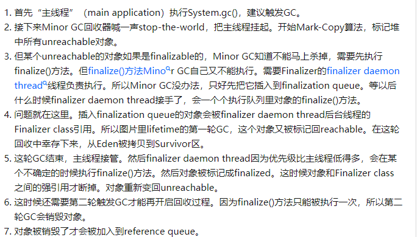
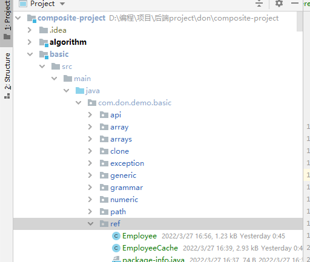

# reference

简介

1. 另外要注意区分的是引用和被引用的对象，他们是分开的，如果引用先于被引用的对象被清理，那么也是没有加入引用队列的这一步，Finalizer的做法是用一个[静态变量](https://www.zhihu.com/search?q=静态变量&search_source=Entity&hybrid_search_source=Entity&hybrid_search_extra={"sourceType"%3A"answer"%2C"sourceId"%3A1901221078})组成一个链表，把所有的引用串起来。引用对象本身需要是强可达的，否则就和普通对象没有差别了。那就是说，引用对象不能先被gc掉，否则referent就完全没有引用了。引用gc了，被引用对象也会随机gc
2. soft和weak先把被引用对象=null，再enqueue，phantom则不是，但是程序内部不让你访问，可以反射访问。
4. phontom和finalize是同一个机制。
5. `java.lang.ref.Reference` 属于关键的源码，分配reference
6. `finalze()`包装成 `java.lang.ref.FinalReference`，给`java.lang.ref.Finalizer`处理
7. java.lang.ref.ReferenceQueue是消费者生产者模式
8. `sun.misc.Cleaner`简单实现的 phontom，优先级很高，不要多用。
8. enqueue可能不是异步，但从queue中获取一定是异步（消费者模式），因此referent是null时不一定能获取reference，需要延时
9. gc的最后一定是回收内存，finalize不是回收内存，finalize和reference之后才会`有可能`回收内存。
10. finalize都很重，也就是reference很重，耗资源，通过主动释放资源并且unreachable reference，就可以做到不会进入queue。postmortem 作最终手段。

[Java中各种引用(Reference)解析](https://www.cnblogs.com/cord/p/11546303.html)

> finalize的机制和finalizer的源码。
>
> 所有源码解析。
>
> reference.tryHandlePending把各种reference发配到各自的队列，核心。

[Understanding Phantom reference vs weak reference with respect to Reference queue](https://stackoverflow.com/questions/26211657/understanding-phantom-reference-vs-weak-reference-with-respect-to-reference-queu)

> Both WeakReference and PhantomReference will be enqueued after their referent (referenced object) not strongly-reachable, if they have a non-null reference-queue registered when they were created.
>
> Before it is passed for enqueuing, WeakReference clears (nullifies) the referent field to make the referent completely unreachable.
>
> WeakReferences are processed before finalization.
>
> The referent is only cleared by the application explicitly after it dequeues the reference-queue. 
>
> PhantomReferences are processed after finalization

[Package java.lang.ref](https://docs.oracle.com/javase/8/docs/api/index.html)

> A program may use a reference object to maintain a reference to some other object in such a way that the latter object may still be reclaimed by the collector.
>
>  Some time after the garbage collector determines that the reachability of the referent has changed to the value corresponding to the type of the reference, it will add the reference to the associated queue. At this point, the reference is considered to be *enqueued*. 
>
> Soft and weak references are automatically cleared by the collector before being added to the queues with which they are registered, if any.

`java.lang.ref.Reference`使用 `next` ，`queue` ，`discoverd` 来与`collector`作交互。 

next作状态判断，避免每次都处理reference。collector扫描内存，根据next是否为null作差异化对待，然后视情况加入到queue中或者不做处理，同时修改next，下次不处理这个reference。

queue用于判断是否在队列中。

[Java中的Reference类使用 ](https://www.cnblogs.com/54chensongxia/p/14115503.html)

> 软引用对象具体的回收策略 `_max_interval`

[Java篇 - 四种引用(Reference)实战](https://blog.csdn.net/u014294681/article/details/86511451)

> 介绍
>
> 例子
>
> 源码	

# WeakHashMap

[一文搞懂WeakHashMap工作原理](https://baijiahao.baidu.com/s?id=1666368292461068600&wfr=spider&for=pc)

> WeakHashMap内部有一个expungeStaleEntries函数，在这个函数内部实现移除其内部不用的entry从而达到的自动释放内存的目的。因此我们每次访问WeakHashMap的时候，都会调用这个expungeStaleEntries函数清理一遍

# PhantomReference

传入队列不销毁对象，特殊操作还可以活下来。和finalize类似

 虚引用：只有当对象被GC销毁（指经历过finalize()步骤，对象还存在），才插入ReferenceQueue。The Garbage Collector adds a phantom reference to a reference queue **after the finalize method of its referent is executed**. It implies that the instance is still in the memory.

[利用虚引用PhantomReference实现对象被回收时收到一个系统通知](https://blog.csdn.net/zmx729618/article/details/79423255)

[在Java中使用PhantomReference析构资源对象](https://zhuanlan.zhihu.com/p/55114919)

> **为什么要避免使用finalize**
>
> **对于一个引用，如果GC线程发现除了Reference实例以外，没有任何其它引用指向它，就把它放入该Reference实例相关联的ReferenceQueue中**。
>
> **要保证GC线程能把不可达的对象放入到相关联的引用队列，持有对象的Reference对象本身必须是强可达的**，否则就和一般的对象没区别。
>
> **PhantomReference进入队列之后JVM不会自动回收，需要人为调用clear方法后才最终释放，这是使用PhantomReference的关键。**如果PhantomReference没有引用，那也是可以释放的。
>
> 具体的例子 `PhantomReferenceTest`
>
> 使用要点

> `finalize()`和`PhantomReference`的实现机制一样，都是同一个系统。效率为什么不一样？

> 由于`PhantomReference`有完全的自控能力处理`ReferenceQueue`中`reference`，可以设置任意个用户线程处理`reference`。速度不可同日而语。
>
> 有些情况下用户线程的优先级比`Finalizer`线程要高。当然如果系统忽略线程优先级除外。
>
> 即便只有一个线程，由于所有的`finalize()`都由`Finalizer`线程处理，一旦数量太多，那么就会处理不过来。而每一种具体的`PhantomReference`都可以分给不同的`ReferenceQueue`，相当于并发执行，速度也要比`finalizer`线程快。
>
> 最后一点就是`finalize()`方法太过简单，用户即使对其实现机制不懂也可以使用，导致一些意外情况出现。但是如果对PhantomReference的实现机制不懂是很难使用这个类的，因此完全了解reference实现机制的程序员会很小心地处理`ReferenceQueue`。
>
> 还有就是这是要看具体jvm实现对他们的处理，如果采用了不同的机制也说不定。
>
> 实质上就是如果jvm处理好finalize()的执行速度，就不需要PhantomReference了，PhantomReference实际上是程序员对finalize()的显式实现。把finalize()功能下放到编码层面。
>
> PhantomReference的对象通过反射也是可能复活的，因此需要小心。
>

# SoftReference

先销毁对象再传入queue

[java softReference 详解](https://www.cnblogs.com/xingmeng/archive/2012/05/23/2514354.html)

> 软引用可以和一个引用队列（ReferenceQueue）联合使用，如果软引用所引用的对象被垃圾回收器回收，Java虚拟机就会把这个软引用加入到与之关联的引用队列中。
>
> 虚引用必须和引用队列 （ReferenceQueue）联合使用。当垃圾回收器准备回收一个对象时，如果发现它还有虚引用，就会在回收对象的内存之前，把这个虚引用加入到与之 关联的引用队列中。
>
> SoftReference的特点是它的一个实例保存对一个Java对象的软引用，该软引用的存在不妨碍垃圾收集线程对该Java对象的回收。
>
> Java虚拟机的垃圾收集线程对软可及对象和其他一般Java对象进行了区别对待:软可及对象的清理是由垃圾收集线程根据其特定 算法按照内存需求决定的。也就是说，垃圾收集线程会在虚拟机抛出OutOfMemoryError之前回收软可及对象，而且虚拟机会尽可能优先回收长时间 闲置不用的软可及对象，对那些刚刚构建的或刚刚使用过的“新”软可反对象会被虚拟机尽可能保留。
>
> **当这个SoftReference所软引用的aMyOhject被垃圾收集器回收的同时，ref所强引用的SoftReference 对象被列入ReferenceQueue。也就是说，ReferenceQueue中保存的对象是Reference对象，而且是已经失去了它所软引用的 对象的Reference对象。**另外从ReferenceQueue这个名字也可以看出，它是一个队列，当我们调用它的poll()方法的时候，如果这个 队列中不是空队列，那么将返回队列前面的那个Reference对象。
>
> 在任何时候，我们都可以调用ReferenceQueue的poll()方法来检查是否有它所关心的非强可及对象被回收。如果队列为空，将返回一个 null,否则该方法返回队列中前面的一个Reference对象。利用这个方法，我们可以检查哪个SoftReference所软引用的对象已经被回 收。于是我们可以把这些失去所软引用的对象的SoftReference对象清除掉。

[Java软引用究竟什么时候被回收](https://www.jianshu.com/p/e46158238a77)

[Java虚拟机究竟是如何处理SoftReference的](https://blog.csdn.net/zxm317122667/article/details/105416239)

> 被 软引用 对象关联的对象会自动被[垃圾回收](https://so.csdn.net/so/search?q=垃圾回收&spm=1001.2101.3001.7020)器回收，但是软引用对象本身也是一个对象，并且是一个 强引用
>
> ##### 内存足够，软引用也能被GC回收
>
> GC对于存活时间大于 _max_interval 的软引用会进行回收
>
> Android官方在对SoftReference的介绍中，也已经不建议使用它来实现缓存功能。不高效。

# WeakReference

先销毁对象再传入queue

弱引用：一旦探测对象只有弱引用，就会被插入ReferenceQueue。

> weak和finalize配合，第一次gcreferent=null，无论是否拯救对象，但是对象还没销毁，然后enqueue，然后执行finalize()，几乎同时。

```java
public class WeakReferenceAndFinalize {


    public static void main(String[] args) throws InterruptedException {
        ReferenceQueue<Object> rq = new ReferenceQueue<>();
        final Object[] object = new Object[1];
        WeakReference<Object> pr = new WeakReference<>(new Object()
        {
            @Override
            protected void finalize() throws Throwable {
                super.finalize();
                object[0] = this;
                System.out.println("finalize，"+this);
            }
        }
        , rq);
        System.out.println(pr + ", " + pr.get() + ", " + rq.poll());
        System.gc();
        System.out.println(pr + ", " + pr.get() + ", " + rq.poll());
        // 延迟
        Thread.sleep(1000);
        System.out.println(pr + ", " + pr.get() + ", " + rq.poll());
    }


}
java.lang.ref.WeakReference@7f31245a, com.don.demo.basic.ref.WeakReferenceAndFinalize$1@6d6f6e28, null
java.lang.ref.WeakReference@7f31245a, null, null
finalize，com.don.demo.basic.ref.WeakReferenceAndFinalize$1@6d6f6e28
java.lang.ref.WeakReference@7f31245a, null, java.lang.ref.WeakReference@7f31245a

```

> WeakReference加入到queue有一定延迟，但referent一定为null

```java
public class WeakReferenceTest {

    public static void main(String[] args) throws InterruptedException {
        ReferenceQueue<Object> rq = new ReferenceQueue<>();
        // final Object[] object = new Object[1];
        WeakReference<Object> pr = new WeakReference<>(new Object()
       /* {
            @Override
            protected void finalize() throws Throwable {
                super.finalize();
                object[0] = this;
                System.out.println("finalize"+this);
            }
        }*/
                , rq);

        System.out.println(pr + ", " + pr.get() + ", " + rq.poll());
        System.gc();
        System.out.println(pr + ", " + pr.get() + ", " + rq.poll());

        //WeakReference加入到queue有一定延迟
        Thread.sleep(100);
        System.out.println(pr + ", " + pr.get() + ", " + rq.poll());
    }


}
```


# finalizable

> *finalizable object* `obj` -- that is, an object whose class has a nontrivial finalizer.

[JAVA虚引用为什么在重载finalize后不会在回收时被置入引用队列?](https://www.zhihu.com/question/49760047/answer/123486092)

> **是由于Minor GC对finarable对象的处理是一个复杂的并发过程**
>
> finalizer处理的速度跟不上系统产生finalizable object的速度。
>
> Reference有四个子类，Soft Weak Final Phantom，都是在gc的Remark阶段处理的，它们的处理顺序依次是 Soft Weak Final Phantom。而题主加上finalize，导致对象被包装成FinalReference，同时被FinalReference和PhantomReference所引用。
>
> 值得注意的是process_discovered_reflist的第三个参数clear_referent，他代表被引用的对象需不需要清除。Soft Weak Cleaner都是true，而Final Phantom是false，这代表Soft Weak不会影响后续的处理，而Final在Phantom之前，并且会保持对象存活，所以这里需要两轮gc Phantom才会被处理。
>
> 作者：茶盒装
>
> 链接：https://www.zhihu.com/question/49760047/answer/1901221078
>
> 来源：知乎
>
> 著作权归作者所有。商业转载请联系作者获得授权，非商业转载请注明出处。

[How to Handle Java Finalization's Memory-Retention Issues](https://www.oracle.com/technical-resources/articles/javase/finalization.html)

> Java Finalization problem:
>
> 1. slow allocate
>
> 2. the garbage collector needs a minimum of two cycles to reclaim `obj` and needs to retain all other objects reachable from `obj` during this process. 
>
> Avoid Memory-Retention Problems When Subclassing
>
> 1. uses composition instead of inheritance
> 2.  Explicit nulling of fields is rarely good practice, but this is one of the rare occasions when it is justified.
>
> Shield Users From Memory-Retention Problems
>
> The best way to do so is to split such classes into two -- one to hold the data that need postmortem cleanup, the other to hold everything else -- and define a finalizer only on the former.
>
>  Instances of inner classes have an implicit reference to the instance of the outer class that created them. Instances of inner classes have an implicit reference to the instance of the outer class that created them
>
> An Alternative to Finalization: reference 。
>
> **ou should also use finalization only when it is absolutely necessary. Finalization is a nondeterministic -- and sometimes unpredictable -- process.** 
>
> This article covered only two types of issues that arise when using finalization: memory- and resource-retention issues. The use of finalization and the `Reference` classes can also cause very subtle synchronization problems.

[The Secret Life Of The Finalizer: page 2 of 2](http://www.fasterj.com/articles/finalizer2.shtml)

> This article was primarily about seeing how finalizable objects are processed。
>
> two gc, finalizer object, finalizer thread ,
>
> You could also take explicit control over finalization by removing the finalize() method and using your own explicit queue using your own Reference objects in a very similar way that the Finalizer class processes the objects and their finalize() methods (see for example [Tony Printezis' article](http://java.sun.com/developer/technicalArticles/javase/finalization/)). That way you control your finalization processing thread's priority and schedule.
>
> Note that neither of these techniques reduce the overheads in having finalizable objects, they just avoid the queue building up because of the lower priority thread. Bear in mind that: the vast majority of apps using finalizers will never see a significant queue build up; but that the overheads of having finalizable objects are significant. It's a good idea to try to keep the number of finalizable objects to a minimum. A few finalizable objects normally don't matter; too many can seriously stress the GC.

[Understanding Phantom reference vs weak reference with respect to Reference queue](https://stackoverflow.com/questions/26211657/understanding-phantom-reference-vs-weak-reference-with-respect-to-reference-queu)



> 不对，加入phantomreference的时候还没被销毁。

[JVM 源码分析之 FinalReference 完全解读](https://www.infoq.cn/article/jvm-source-code-analysis-finalreference)

> 先执行 new 分配好对象空间，然后再执行 invokespecial 调用构造函数，JVM 里其实可以让用户在这两个时机中选择一个，将当前对象传递给`Finalizer.register`方法来注册到`Finalizer`对象链里，这个选择取决于是否设置了`RegisterFinalizersAtInit`这个 vm 参数，默认值为 true，也就是在构造函数返回之前调用`Finalizer.register`方法，如果通过`-XX:-RegisterFinalizersAtInit`关闭了该参数，那将在对象空间分配好之后将这个对象注册进去。
>
> 另外需要提醒的是，当我们通过 clone 的方式复制一个对象时，如果当前类是一个 f 类，那么在 clone 完成时将调用`Finalizer.register`方法进行注册。
>
> hotspot 如何实现 f 类对象在构造函数执行完毕后调用 Finalizer.register
>
> 这个实现比较有意思，在这简单提一下，我们知道执行一个构造函数时，会去调用父类的构造函数，主要是为了初始化继承自父类的属性，那么任何一个对象的初始化最终都会调用到`Object`的空构造函数里（任何空的构造函数其实并不空，会含有三条字节码指令，如下代码所示），为了不对所有类的构造函数都埋点调用`Finalizer.register`方法，hotspot 的实现是，在初始化`Object`类时将构造函数里的`return`指令替换为`_return_register_finalizer`指令，该指令并不是标准的字节码指令，是 hotspot 扩展的指令，这样在处理该指令时调用`Finalizer.register`方法，以很小的侵入性代价完美地解决了这个问题。

> 缺点
> f 对象因为Finalizer的引用而变成了一个临时的强引用，即使没有其他的强引用，还是无法立即被回收；
> f 对象至少经历两次 GC 才能被回收，因为只有在FinalizerThread执行完了 f 对象的finalize方法的情况下才有可能被下次 GC 回收，而有可能期间已经经历过多次 GC 了，但是一直还没执行 f 对象的finalize方法；
> CPU 资源比较稀缺的情况下FinalizerThread线程有可能因为优先级比较低而延迟执行 f 对象的finalize方法；
> 因为 f 对象的finalize方法迟迟没有执行，有可能会导致大部分 f 对象进入到 old 分代，此时容易引发 old 分代的 GC，甚至 Full GC，GC 暂停时间明显变长；
> f 对象的finalize方法被调用后，这个对象其实还并没有被回收，虽然可能在不久的将来会被回收。

# cleaner

# 代码

com.don.demo.basic.ref

