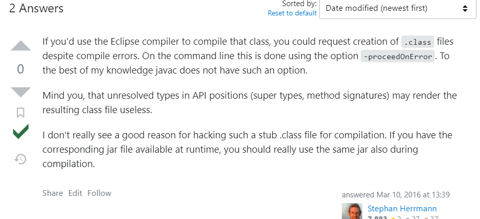
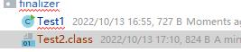

# 安装

## jre

仅仅需要设置bin的path位置，当然直接写命令的完整路径也是可以的。path就是为了方便检索java命令的位置

# java命令

## idea运行java程序命令解析

```bash
"C:\Program Files\Java\jdk1.8.0_202\bin\java.exe" 
-agentlib:jdwp=transport=dt_socket,address=127.0.0.1:59726,suspend=y,server=n  #jvm properties
-XX:TieredStopAtLevel=1 
-noverify 
-Dspring.profiles.active=dev  #使用的配置文件
-Dspring.output.ansi.enabled=always 
-Dcom.sun.management.jmxremote 
-Dspring.jmx.enabled=true 
-Dspring.liveBeansView.mbeanDomain 
-Dspring.application.admin.enabled=true 
-javaagent:C:\Users\TJR_S\.IntelliJIdea2019.3\system\captureAgent\debugger-agent.jar 
-Dfile.encoding=UTF-8  #与java读写使用的编码有关
-classpath ".;...很多绝对路径jar包" 
com.dc.crawl.CrawlApplication # 入口main类
sd df fd #program arguments
```

> 注意：PowerShell需要把命令的各个分支用""包含起来，cmd则不需要。

## idea运行参数设置

vm options：jvm properties 例如：`-Dcom.sun.management.jmxremote` 

program arguments : `public static void main(String[] args){}`中的数组 https://blog.csdn.net/zolalad/article/details/11519327

environment variables ：临时修改系统环境参数


## jvm properteis

system properties

-D=value


Set a system property value. If value is a string that contains spaces, you must enclose the string in double quotes:

如果value中有空格，则需要用双引号将该值括起来，如：-Dname=”kazaf f”。

该参数通常用于设置系统级全局变量值，如配置文件路径，保证该属性在程序中任何地方都可访问。

**注意事项**

（1）需要设置的是JVM参数而不是program参数；
（2）使用此参数的参数优先级最高，会覆盖项目中配置的此项；

```cmd
 -Ddubbo.reference.com.foo.BarService.check=false
 -Ddubbo.reference.check=false
 -Ddubbo.consumer.check=false 
 -Ddubbo.registry.check=false
 -Djdk.http.auth.tunneling.disabledSchemes="" 
 -Djdk.http.auth.proxying.disabledSchemes="" 
```

在虚拟机的系统属性中设置属性名/值对，运行在此虚拟机上的应用程序可用：

```
 System.setProperty("jdk.http.auth.tunneling.disabledSchemes", "");
System.getProperty("属性名")
```

#### **-Dfile.encoding=UTF-8**

指定JVM使用的字符集

It sets a property which defines in which encoding will Java save and read files by default. It must be set at JVM startup.

There are multiple encodings - ways to represent characters on computers. UTF-8 is one of the best to use, as it contains all special characters in many languages.

Once you don't have this property, Java might save files in a different encoding which might lead to strange characters when opening the file with text editor. You can avoid this issue by manually setting the desired encoding to your `OutputStream`

This can be overridden on runtime.

在自己读写文件的demo类就很能体现出来。


```
System.getProperty(key);
System.getenv(key);
```

# jar

JAR（Java Archive，Java 归档文件）是与平台无关的文件格式，它允许将许多文件组合成一个压缩文件，可以使用Java软件打开。

为 J2EE 应用程序创建的 JAR 文件是 EAR 文件（企业 JAR 文件）。

JAR 文件格式以流行的 ZIP 文件格式为基础。

与 ZIP 文件不同的是，JAR 文件不仅用于压缩和发布，而且还用于部署和封装库、组件和插件程序，并可被像编译器和 JVM 这样的工具直接使用。

在 JAR 中包含特殊的文件，如 manifests 和部署描述符，用来指示工具如何处理特定的 JAR。

> **jar的目录entry**
>
> 这种默认方式（eclipse）生成的jar包中，只含有class文件，而并没有我们大众所知的文件夹目录结构。可能我们大多数人认为**com.test.Student类，Student类文件就应该在com文件夹下的test文件夹里**，这其实是片面的，是一个误区！
>
> com.test真正的含义是package**包域名**，就好比.net里的命名空间，它只是为了区分、汇总、唯一标识不同的类而提出的概念，跟文件夹目录层次结构是两回事，我们只是习惯上用文件夹目录来展示package而已。但package却不一定非要用过文件夹目录来展示。

## 启动jar包

```java
java -jar demo.jar
// Linux下 加上 nohup 和 &。代表不挂断运行命令，当账户退出或终端关闭时，程序仍然运行。
nohup java -jar springboot.jar &
    // windows下 javaw 启动的命令代表后台运行，关闭窗口后仍然运行，在任务管理器可查看到相关服务。
    javaw -jar springboot.jar
    
    //（1）找到jar包的 PID
    ps -ef | grep springboot.jar
    //（2）kill命令终止进程，使用以下命令发送 SIGTERM 信号（信号 15）来优雅地停止 Spring Boot 项目：
    Kill -15 <PID>
```

## maven创建jar包

```xml
<plugin>
    <groupId>org.apache.maven.plugins</groupId>
    <artifactId>maven-compiler-plugin</artifactId>
    <configuration>
        <target>1.8</target>
        <source>1.8</source>
        <encoding>UTF-8</encoding>
        <showWarnings>true</showWarnings>
    </configuration>
</plugin>
```

直接package只是一个jar包，没有main函数入口，并且不会把依赖的包打进去，只会打入pom文件，也就是路径，这种jar包需要配合maven插件使用。运行的时候再查找jar具体依赖jar包。


打包的时候打入具体的依赖，并且运行

```xml
  <build>
        <plugins>
            <plugin>
                <groupId>org.apache.maven.plugins</groupId>
                <artifactId>maven-compiler-plugin</artifactId>
                <configuration>
                    <target>1.8</target>
                    <source>1.8</source>
                    <encoding>UTF-8</encoding>
                    <showWarnings>true</showWarnings>
                </configuration>
            </plugin>
            <plugin>
                <groupId>org.apache.maven.plugins</groupId>
                <artifactId>maven-assembly-plugin</artifactId>
                <configuration>
                    <archive>
                        <manifest>
                            <mainClass>com.dc.mall.JWCrawler</mainClass>
                        </manifest>
                    </archive>
                    <descriptorRefs>
                        <descriptorRef>
                            jar-with-dependencies
                        </descriptorRef>
                    </descriptorRefs>
                </configuration>
            </plugin>
        </plugins>
    </build>
```


## 创建

https://zq99299.github.io/java-tutorial/deployment/jar/

https://docs.oracle.com/javase/tutorial/deployment/index.html

最简单的

```java
jar cvfm jar-file manifest-addition input-file(s)
```

```java
c : 创建 jar 文件
f : 输出到一个 jar 文件中
m : 希望把指定文件中的信息合并到默认清单文件中
jar-file : 输出的 jar 名称
manifest-addition : 指定文件名称或路径，该文件的内容要添加到 JAR 文件清单的内容中。（必须是 utf-8 编码）
input-file(s) : 空格分隔的一个或多个要加入到jar中的文件
```

# cmd执行乱码

```bash
# 把cmd控制台设置为utf-8编码
chcp 65001
# 把java 程序使用的编码设置为utf-8 
java -Dfile.encoding=utf-8 -jar project.jar
```

# jmx

## 文档

https://docs.oracle.com/en/java/javase/17/jmx/jmx-connectors.html#GUID-89B47AE8-B4FA-44EA-BB90-8F8C9D0710E1 | JMX Connectors
https://docs.oracle.com/en/java/javase/17/management/using-platform-mbean-server-and-platform-mxbeans.html#GUID-6239456C-FD46-46EA-96EF-DC02800D58EC | Using the Platform MBean Server and Platform MXBeans

 [技术笔记-JMX与RMI](https://mp.weixin.qq.com/s/CEa4xEncZlFWSfuO7Db5Rw)

> 使用了mimc jmx手动
>
> jxmUrl=service:jmx:rmi://localhost:0/jndi/rmi://localhost:1099/jmxrmi 
>
> 说明了，默认使用rmi协议创建jmx connector，并且jconsole也是使用rmi协议。
>
> rmi的部分可有可无

一开始我认为JMX只有一个端口，实际是开了三个端口，分别是：

一个是JMX端口（需要指定），JMX远程连接端口。
一个是RMI端口（默认随机），实际通信用的端口。
一个是本地服务端口（随机），用于本地jstat、jconsole连接用，本地使用，我们不用理会。
程序连接，是先连上JMX端口，获取RMI端口，再连接RMI端口，问题就出在RMI端口上，一般没有配置指定端口号，程序默认会随机分配一个端口，容易让人忽略，在配置防火墙时只配了JMX端口，导致JMX连接不上。而且RMI端口是随机的，也不好配防火墙。

其实这个RMI端口是可以指定的，而且可以指定与JMX一致的端口，这样在配置防火墙时就方便多了，只需开放一个端口。
具体的配置是启动参数增加 -Dcom.sun.management.jmxremote.rmi.port=xxxx,目前常见的开源软件都支持这个配置，如Kafka，Tomcat等。

The initial connection from the client (e.g. `jconsole` or `visualvm`) is established to `com.sun.management.jmxremote.host` on port `com.sun.management.jmxremote.port`. Then the connecting client obtains `com.sun.management.jmxremote.rmi.port` (it is dynamically assigned by Java from a pool of unused ports if not explicitly specified) and further communication and data exchange goes over Java RMI connecting to `java.rmi.server.hostname` on port `com.sun.management.jmxremote.rmi.port`.

If you don't use JMX authentication or SSL I'd recommend configuring both hosts as localhost (see configuration example below).

```
java.rmi.server.hostname=127.0.0.1
com.sun.management.jmxremote
com.sun.management.jmxremote.port=9091
com.sun.management.jmxremote.host=127.0.0.1
com.sun.management.jmxremote.rmi.port=9092
com.sun.management.jmxremote.ssl=false
com.sun.management.jmxremote.authenticate=false
```

> 至于内部是怎么用的还不清楚，有可能是`jcom.sun.management.jmxremote.port=9091` `com.sun.management.jmxremote.host=127.0.0.1`是jmx的连接配置，里面配了rmi registry，可能也就是这些ip 和port。
>
> 然后rmi registry注册remote server stub的时候需要拿一个`java.rmi.server.hostname`  ，没有的话就本地解释， [RMI在双网卡环境下的配置-CSDN博客](https://blog.csdn.net/feng413/article/details/83256915 )，还需要一个`com.sun.management.jmxremote.rmi.port`,没有的话随机指定。
>
> 需要对rmi有一定的认识。

## 介绍

JConsole是JDK自带的Java性能分析器，用来监听Java应用程序性能和跟踪代码。默认安装在JDK的bin目录（例如：C:\Program Files\Java\jdk1.8.0_144\bin），直接双击运行即可。
 JConsole可以监听本地的应用，也可以监听远程的应用。在新建连接界面上选择本地应用，或者输入远程连接地址，格式是ip:port，**注意这个port是监听端口不是服务端口**。

```shell
java 
-Dcom.sun.management.jmxremote 　　　　　　　　　　　　// 　远程开启开关，默认开启
-Djava.rmi.server.hostname=111.111.111.111 　　　　　// 远程服务器所在ip地址或者域名， 本地输入时用, 注意要能够访问
-Dcom.sun.management.jmxremote.port=9090 　　　　　　// 监听的端口, 本地输入, 注意防火墙
-Dcom.sun.management.jmxremote.ssl=false 　　　　　　
-Dcom.sun.management.jmxremote.authenticate=true 　// 使用密码, 如果写成false， 下面一句就不用了, 后面的配置密码也不用了
-Dcom.sun.management.jmxremote.password.file=/usr/java/jdk1.6.0_43/jre/lib/management/jmxremote.password // 很明显, 配置密码的地儿
-jar 
app-1.0.jar
```

同时还需要注意服务器的端口是否被屏蔽，hosts是否配置了实际IP。可以使用hostname -i命令来查询ip是否生效。例如实际ip是10.10.10.101，计算机名是mycomputer。hosts配置如下：

```java
10.10.10.101   mycomputer
10.10.10.101   localhost localhost.localdomain localhost4 localhost4.localdomain4
```

配置访问用户名和口令

转到： /usr/java/jdk1.6.0_43/jre/lib/management/ （安装JDK的目录）

编辑jmxremote.access文件, 在最后加上

```
1 userName      readwrite \
2               create javax.management.monitor.*,javax.management.timer.* \
3               unregister
```

userName随便写， 就是你连接时需要 用到的

编辑jmxremote.password, 复制jmxremote.password.template, 改名去掉template

在最后添加

```
1 userName    userPassword
```

这里就是在设置密码。

## 参考文献

[JConsole远程连接Linux下java程序](https://www.cnblogs.com/harvard/articles/2993125.html)

## 问题

1. [JConsole is not showing any local processes ： probably have a permission issue](http://jtuts.com/2017/02/04/jconsole-not-showing-local-processes/)

   C:\Users\Username\AppData\Local\Temp

   

2. [Jconsole 开启远程连接遇到的一些坑](https://blog.csdn.net/qq_42700121/article/details/131306004)

   > rmi没有配置，使用随机分配，导致防火墙没通过
   >
   > tomcat 启动添加了配置之后，关闭 tomcat 服务时，就报错

3. [Differences between java.rmi.server.hostname and com.sun.management.jmxremote.host](https://stackoverflow.com/questions/66324951/differences-between-java-rmi-server-hostname-and-com-sun-management-jmxremote-ho)

4. https://www.cnblogs.com/grey-wolf/p/9235073.html jvisualvm/jconsole jmx方式连接远程tomcat应用终于成功，附踩大坑记录！

# jhat

## 参考文献

https://blog.gceasy.io/2015/08/28/jhat-heap-dump-analysis/

https://docs.oracle.com/javase/8/docs/technotes/tools/unix/jhat.html

[JAVA8-线上内存泄漏分析](https://www.jianshu.com/p/09778780338a)

备份chatgpt、有参照

# javac编译

javac会检查要编译的类所引用的类是否在类路径，一定程度上表明你写的symbol都是正确有效的。在一定程度上保证你写的项目和类是正确的（要引用的符号和类都是存在的，可以找到的）。

[Ignore unresolved symbols when compiling java with javac](https://stackoverflow.com/questions/35865108/ignore-unresolved-symbols-when-compiling-java-with-javac)

> Java isn't memory aware, there's no static allocation so no need what data are we talking about. After all, all ArrayLists are just `List<Object>` and the actual `<Something>` is not important at compile time. Do not mistake Java for other languages that actually do something during compilation.
>
> 

错误: 找不到符号


test1依赖2，2依赖3，我编译2需要3，编译好了之后，把3删除，只要你不用3，就可以编译1成功。1可以用2，这个可以编译成功。



所以可以编译成功，只要你不引用spring-boot中的红色的类就可以编译成功

[javac错误: 找不到符号或程序包XXX不存在](https://blog.csdn.net/gao_zhennan/article/details/118612051)

[关于Javac命令和类文件之间的依赖问题](https://blog.csdn.net/octopusflying/article/details/53791661)

[maven的scope值runtime是干嘛用的?](https://www.zhihu.com/question/338722003)

> provided用于中间jar包，不最终打包，runtime用于解耦

# rmi

https://blog.csdn.net/feng413/article/details/83256915 | RMI在双网卡环境下的配置-CSDN博客
https://blog.csdn.net/dnc8371/article/details/106704977 | 使用Java RMI时要记住的两件事-CSDN博客
https://goodapple.top/archives/520 | Java安全学习——利用RMI进行攻击 - 枫のBlog

https://docs.oracle.com/javase/7/docs/technotes/guides/rmi/faq.html

[RMI Server vs. RMI Registry](https://stackoverflow.com/questions/32913180/rmi-server-vs-rmi-registry)

> The relationship between an RMI server and RMI registry is analogous to the relationship between a web server and a DNS server that is authoritative for it.

differences between java.rmi.server.hostname and java.rmi.server

> It seems like you might have a slight confusion.
>
> - `java.rmi.server.hostname`
>
>   is a system property that you can set to specify the hostname that the RMI server should use for its remote references.
>
> - `java.rmi.server`
>
>   is a package in the Java API that provides classes and interfaces for implementing RMI servers.
>
> Here's a breakdown of the difference:
>
> `java.rmi.server.hostname`:
>
> - This property is used to override the default hostname that RMI uses for the server.
>
> - By default, RMI uses the IP address of the server host as the server name for remote references.
>
>   
>
>   
>
> - Setting this property is crucial when your server is behind a firewall or NAT, or when its hostname is not resolvable by clients.
>
> - You can set it using:
>
>   - **Code:** `System.setProperty("java.rmi.server.hostname", "your_server_hostname");`
>   - **Command line:** `-Djava.rmi.server.hostname=your_server_hostname`
>
> `java.rmi.server` package:
>
> - This package contains classes and interfaces that are essential for building RMI servers, such as:
>   - `UnicastRemoteObject`: A base class for remote objects that use unicast communication.
>   - `RMISecurityManager`: A security manager for RMI applications.
>   - `RMIClassLoader`: A class loader for loading classes from remote locations.
>   - `RemoteServer`: An interface that represents a remote server object.
>
> In short:
>
> - `java.rmi.server.hostname` is a property used to configure the hostname used in RMI remote references.
> - `java.rmi.server` is a package that provides classes and interfaces for developing RMI servers.

# Client Server

[JVM学习笔记之Client Server端区别](https://segmentfault.com/a/1190000038153507)

# 官方文档

https://docs.oracle.com/en/java/javase/17/docs/specs/ | Java® Platform, Standard Edition & Java Development Kit Specifications Version 17
https://docs.oracle.com/en/java/javase/17/security/general-security1.html#GUID-475E6316-283A-4A59-9B11-2479348C4629 | General Security
https://docs.oracle.com/en/java/javase/17/docs/specs/man/keytool.html | The keytool Command
https://docs.oracle.com/en/java/javase/17/docs/specs/man/index.html | Java Development Kit Version 17 Tool Specifications

https://docs.oracle.com/en/java/javase/17/ | JDK 17 Documentation - Home
https://docs.oracle.com/en/java/javase/17/core/java-core-libraries1.html | Java Core Libraries

