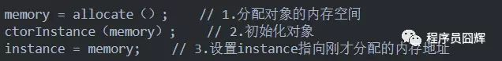
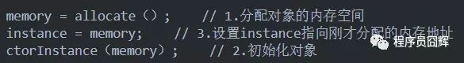

[原文链接]:（https://www.cnblogs.com/dolphin0520/p/3920373.html#!comments）

## 介绍

​		volatile这个关键字可能很多朋友都听说过，或许也都用过。在Java 5之前，它是一个备受争议的关键字，因为在程序中使用它往往会导致出人意料的结果。在Java 5之后，volatile关键字才得以重获生机。

　　volatile关键字虽然从字面上理解起来比较简单，但是要用好不是一件容易的事情。由于volatile关键字是与Java的内存模型有关的，因此在讲述volatile关键之前，我们先来了解一下与内存模型相关的概念和知识，然后分析了volatile关键字的实现原理，最后给出了几个使用volatile关键字的场景。

## ~~并发编程中的三个概念~~

想并发程序正确地执行，必须要保证原子性、可见性以及有序性。只要有一个没有被保证，就有可能会导致程序运行不正确。

> 删除 2021-08-01 10:01:51 
>
> 这三个性都有各自的意义，但是相互柔和，很难理解，根据定义，原子性已经保证了可见性和有序性。
>
> 原子性抄袭了mysqld的原子性，原子性如果应用在多线程上，也有同步的意思，是一种更为上层的概念，已经包含了可见性和有序性。
>
> jmm保证正确同步的线程也满足了内存可见性。
>
> 当然这里的原子性还糅杂了jvm保证的最小原子性。但是那和多线程并发无关，只是用来保证数据正确性。
>
> 把代码做成原子性是为了程序的正确性，64位写，一段代码互斥执行。	
>
> 那并发的时候考虑哪种原子性呢？
>
> 
>
> 而可见性是保证有序性的前提，有序一定可见。因为java是通过内存来进行通信的。所以必须先有可见性，才有有序性。
>
> java并发通过可见性来保证有序性。可见性是内存的问题。并发不单单只有内存，还有cpu等等东西。
>
> 
>
> 正确的原子性是指java基本操作得有原子性，不用考虑给他们加锁这样。
>
> 并发只需要通信和同步：
>
> 1. 通信使用内存模型，需要考虑内存可见性。
>
> 2. 同步需要考虑顺序一致性模型，由于看到顺序通过内存来传递，看到顺序了就代表可见了，因此最终只需要考虑如何保证顺序一致性就可。
>
>    单条线程执行一段代码在自己看来代码无序，结果有序的；但是在另一条线程眼中 代码和结果都是无序的，需要同步工具来保证可见进而有序。
>
>    简化为happen before原则。

### 原子性

#### 介绍

~~**定义**：一个操作或一系列是不可中断的。即使是在**多个线程**的情况下，操作一旦开始，就不会被其他线程干扰。~~

**~~解释**：假定有两个操作A和B，如果从执行A的线程来看，当另一个线程执行B时，要么将B完全执行完，要么完全不执行B，那么A和B对彼此来说是原子的。~~

~~原子操作其实有不同层面的原子操作（比方说处理器层面的）。原子操作和原子操作之间，看到操作要么是已经完成的，要么是没有完成的。~~

~~一个加锁的方法对于一个非加锁的方法来说不是原子操作，是普通方法，但是对于同一个加锁的方法来说就是原子操作。~~

~~**实现**：一段代码，或者一个变量的操作，在没有执行完之前，不能被其他线程执行。（这里不包括把结果写入主存）~~

> 删除 2021-08-01 10:05:19 
>
> 不知道怎么理解，操作肯定是不可中断的，如果从结果来看，其他线程已经看到，那么岂不是也包含了可见性和有序性。
>
> 感觉像是剽窃了mysql的原子性的概念，但是mysql的原子性是由事务保证的，java代码随时可以中断。
>
> 多线程中如果有可见性，那么也保证了有序性。
>
> 每个性都有其意义，满足所有都正确并发，但是概念模糊重叠无法理解。


#### 行账户转账

　　一个很经典的例子就是银行账户转账问题：

　　比如从账户A向账户B转1000元，那么必然包括2个操作：从账户A减去1000元，往账户B加上1000元。

　　试想一下，如果这2个操作不具备原子性，会造成什么样的后果。假如从账户A减去1000元之后，操作突然中止。然后又从B取出了500元，取出500元之后，再执行 往账户B加上1000元 的操作。这样就会导致账户A虽然减去了1000元，但是账户B没有收到这个转过来的1000元。

　　所以这2个操作必须要具备原子性才能保证不出现一些意外的问题。

> ​		mysql的事务的原子性只考虑了一个线程的情况（**全部执行**），排他锁和共享锁针对多线程操作数据库。（执行的过程不会被其他线程打断，或者所操作的东西不会被其他线程操作，排他）

#### 并发编程

　　举个最简单的例子，大家想一下假如为一个32位的变量赋值过程不具备原子性的话，会发生什么后果？

```java
i = 9
```

 　假若一个线程执行到这个语句时，我暂且假设为一个32位的变量赋值包括两个过程：为低16位赋值，为高16位赋值。

　那么就可能发生一种情况：当将低16位数值写入之后，突然被中断，而此时又有一个线程去读取i的值，那么读取到的就是错误的数据。

比如，对于一个静态变量int x两条线程同时对其赋值，线程A赋值为1，而线程B赋值为2，不管线程如何运行，最终x的值要么是1，要么是2，要么A先赋值，要么B先赋值。线程A和线程B间的操作是没有干扰的，这就是原子性操作，不可被中断的。

> 注意：和mysql事务的原子性不一样

### 可见性（内存）

- **介绍**

　　可见性是指当**多个线程**访问同一个变量时，一个线程修改了这个变量的值，其他线程能够立即看得到修改的值。（立即写回）

- **原因**

  缓存一致性：由于现代可共享内存的多处理器架构可能导致一个线程无法马上（甚至永远）看到另一个线程操作产生的结果。所以 Java 内存模型规定了 JVM 的一种最小保证：什么时候写入一个变量对其他线程可见。

- **例子**

```java
//线程1执行的代码
int i = 0;
i = 10;
 
//线程2执行的代码
j = i;
```

 　	假若执行线程1的是CPU1，执行线程2的是CPU2。由上面的分析可知，当线程1执行 i =10这句时，会先把i的初始值加载到CPU1的高速缓存中，然后赋值为10，那么在CPU1的高速缓存当中i的值变为10了，**却没有立即写入到主存当中**。

​		此时线程2执行 j = i，它会先去主存读取i的值并加载到CPU2的缓存当中，注意此时内存当中i的值还是0，那么就会使得j的值为0，而不是10。

　　**这就是可见性问题，线程1对变量i修改了之后，却没有立即写入到主存当中线程2没有立即看到线程1修改的值。**

### 有序性

#### 介绍

对于单线程的执行代码，执行是按顺序依次进行的。

在Java内存模型中有序性可归纳为这样一句话：如果在**本线程**内观察，所有操作都是有序（结果有序）的，如果在一个线程中观察**另一个线程**，所有操作都是无序的。

#### 例子

```java
int i = 0;              
boolean flag = false;
i = 1;                //语句1  
flag = true;          //语句2
```

上面代码定义了一个int型变量，定义了一个boolean类型变量，然后分别对两个变量进行赋值操作。从代码顺序上看，语句1是在语句2前面的，那么JVM在真正执行这段代码的时候会保证语句1一定会在语句2前面执行吗？不一定，为什么呢？这里可能会发生**指令重排序**（Instruction Reorder）。

#### 指令重排序

- **介绍**

  一般来说，处理器和编译器为了提高程序运行效率，可能会对输入代码进行优化，它不保证程序中各个语句的执行先后顺序同代码中的顺序一致，但是它会保证程序最终执行结果和代码顺序执行的结果是一致的

- **重排序有哪些？**

  - 编译器优化的重排序。编译器在不改变单线程程序语义的前提下，可以重新安排语句的执行顺序。
  - 指令级并行的重排序。现代处理器采用了指令级并行技术来将多条指令重叠执行。如果不存在数据依赖性，处理器可以改变语句对应机器指令的执行顺序。
  - 内存系统的重排序。由于处理器使用缓存和读/写缓冲区，这使得加载和存储操作看上去可能是在乱序执行。改变写入提交到主内存的变量的次序。

- **如何保证程序最终结果会和代码顺序执行结果相同**？

  ```java
  int a = 10;    //语句1
  int r = 2;    //语句2
  a = a + 3;    //语句3
  r = a*a;     //语句4
  ```

  这段代码有4个语句，那么可能的一个执行顺序是：

   

  那么可不可能是这个执行顺序呢： 语句2  语句1  语句4  语句3 ？

  不可能，因为处理器在**进行重排序时是会考虑指令之间的数据依赖性**，如果一个指令Instruction 2必须用到Instruction 1的结果，那么处理器会保证Instruction 1会在		Instruction 2之前执行。

- **重排序会导致不正确的结果吗？**

  重排序保证在单线程下不会改变执行结果，但在多线程下可能会改变执行结果。

```java
//线程1:
context = loadContext();   //语句1
inited = true;             //语句2
 
//线程2:
while(!inited ){
  sleep()
}
doSomethingwithconfig(context);
```

 　上面代码中，**由于语句1和语句2没有数据依赖性，因此可能会被重排序。**假如发生了重排序，在线程1执行过程中先执行语句2，而此是线程2会以为初始化工作已经完成，那么就会跳出while循环，去执行`doSomethingwithconfig(context)`方法，而此时context并没有被初始化，就会导致程序出错。

 　从上面可以看出，**指令重排序不会影响单个线程的执行，但是会影响到线程并发执行的正确性。**


## ~~Java内存模型~~

### 介绍

　　在Java虚拟机规范中试图定义一种Java内存模型（Java Memory Model，JMM）来屏蔽各个硬件平台和操作系统的内存访问差异，以实现让Java程序在各种平台下都能达到一致的内存访问效果。

那么Java内存模型规定了哪些东西呢，它定义了程序中变量的访问规则，即在虚拟机中将变量存储到内存和从内存中取出变量这样的底层细节，往大一点说是定义了程序执行的次序。此处的变量（Variables）与Java编程中所说的变量有所区别，它包括了实例字段、静态字段和构成数组对象的元素，但不包括局部变量与方法参数，因为后者是线程私有的，不会被共享，自然就不会存在竞争问题。

注意，为了获得较好的执行性能，Java内存模型并没有限制执行引擎使用处理器的寄存器或者高速缓存来提升指令执行速度，也没有限制编译器对指令进行重排序。也就是说，在java内存模型中，也会存在缓存一致性问题和指令重排序的问题。

　　Java内存模型规定了所有的变量都存储在主内存（Main Memory）中。每条线程还有自己的工作内存（Working Memory，可与前面讲的处理器高速缓存类比），线程的工作内存中保存了被该线程使用到的变量的主内存副本拷贝，线程对变量的所有操作（读取、赋值等）都必须在工作内存中进行，而不能直接读写主内存中的变量。不同的线程之间也无法直接访问对方工作内存中的变量，线程间变量值的传递均需要通过主内存来完成，线程、主内存、工作内存三者的交互关系如图所示。


主内存直接对应于物理硬件的内存，而为了获取更好的运行速度，虚拟机（甚至是硬件系统本身的优化措施）可能会让工作内存优先存储于寄存器和高速缓存中，因为程序运行时主要访问读写的是工作内存。

**例子**

```java
i = 10;
```

 　执行线程必须先在自己的工作线程中对变量i所在的缓存行进行赋值操作，然后再写入主存当中。而不是直接将数值10写入主存当中。

### 内存间交互操作

注：该部分内容可以作为了解简单的看一下，下面会介绍该部分内容的等效判断原则——先行发生规则（happens-before），先行发生规则更常问，并且更容易理解。

1. 关于主内存与工作内存之间具体的交互协议，即一个变量如何从主内存拷贝到工作内存、如何从工作内存同步回主内存之类的实现细节，Java内存模型中定义了以下8种操作来完成，**虚拟机实现时必须保证下面提及的每一种操作都是原子的、不可再分的**（对于double和long类型的变量来说，load、store、read和write操作在某些平台上允许有例外）。

   | 操作           | 描述                                                         |
   | -------------- | ------------------------------------------------------------ |
   | lock（锁定）   | 作用于主内存的变量，它把一个变量标识为一条线程独占的状态。   |
   | unlock（解锁） | 作用于主内存的变量，它把一个处于锁定状态的变量释放出来，释放后的变量才可以被其他线程锁定。 |
   | read（读取）   | 作用于主内存的变量，它把一个变量的值从主内存传输到线程的工作内存中，以便随后的load动作使用。 |
   | load（载入）   | 作用于工作内存的变量，它把read操作从主内存中得到的变量值放入工作内存的变量副本中。 |
   | use（使用）    | 作用于工作内存的变量，它把工作内存中一个变量的值传递给执行引擎，每当虚拟机遇到一个需要使用到变量的值的字节码指令时将会执行这个操作。 |
   | assign（赋值） | 作用于工作内存的变量，它把一个从执行引擎接收到的值赋给工作内存的变量，每当虚拟机遇到一个给变量赋值的字节码指令时执行这个操作。 |
   | store（存储）  | 作用于工作内存的变量，它把工作内存中一个变量的值传送到主内存中，以便随后的write操作使用。 |
   | write（写入）  | 作用于主内存的变量，它把store操作从工作内存中得到的变量的值放入主内存的变量中。 |

2. 如果要把一个变量从主内存复制到工作内存，那就要顺序地执行read和load操作，如果要把变量从工作内存同步回主内存，就要顺序地执行store和write操作。注意，Java内存模型只要求上述两个操作必须**按顺序执行，而没有保证是连续执行**。也就是说，read与load之间、store与write之间是可插入其他指令的，如对主内存中的变量a、b进行访问时，一种可能出现顺序是read a、read b、load b、load a。

3. 除此之外，Java内存模型还规定了在执行上述8种基本操作时必须满足如下规则：

   - 不允许read和load、store和write操作之一单独出现，即不允许一个变量从主内存读取了但工作内存不接受，或者从工作内存发起回写了但主内存不接受的情况出现。
   - 不允许一个线程丢弃它的最近的assign操作，即变量在工作内存中改变了之后必须把该变化同步回主内存。
   - 不允许一个线程无原因地（没有发生过任何assign操作）把数据从线程的工作内存同步回主内存中。
   - 一个新的变量只能在主内存中“诞生”，不允许在工作内存中直接使用一个未被初始化（load或assign）的变量，换句话说，就是对一个变量实施use、store操作之前，必须先执行过了assign和load操作。
   - 一个变量在同一个时刻只允许一条线程对其进行lock操作，但lock操作可以被同一条线程重复执行多次，多次执行lock后，只有执行相同次数的unlock操作，变量才会被解锁。
   - 如果对一个变量执行lock操作，那将会清空工作内存中此变量的值，在执行引擎使用这个变量前，需要重新执行load或assign操作初始化变量的值。
   - 如果一个变量事先没有被lock操作锁定，那就不允许对它执行unlock操作，也不允许去unlock一个被其他线程锁定住的变量。
   - 对一个变量执行unlock操作之前，必须先把此变量同步回主内存中（执行store、write操作）。

   这8种内存访问操作以及上述规则限定，再加上稍后介绍的对volatile的一些特殊规定，就已经完全确定了Java程序中哪些内存访问操作在并发下是安全的。由于这种定义相当严谨但又十分烦琐，实践起来很麻烦，所以在下文将介绍这种定义的一个等效判断原则——先行发生原则，用来确定一个访问在并发环境下是否安全。

### 原子性

- **介绍**

　　在Java中，对基本数据类型的变量的读取和赋值操作是原子性操作，即这些操作是不可被中断的，要么执行，要么不执行。

- **列子**

　　上面一句话虽然看起来简单，但是理解起来并不是那么容易。看下面一个例子i：

　　请分析以下哪些操作是原子性操作： z

```java
x = 10;         //语句1
y = x;         //语句2
x++;           //语句3
x = x + 1;     //语句4
```

 　咋一看，有些朋友可能会说上面的4个语句中的操作都是原子性操作。其实只有语句1是原子性操作，其他三个语句都不是原子性操作。

　　语句1是直接将数值10赋值给x，也就是说线程执行这个语句的会直接将数值10写入到工作内存中。

　　语句2实际上包含2个操作，它先要去读取x的值，再将x的值写入工作内存，虽然读取x的值以及 将x的值写入工作内存 这2个操作都是原子性操作，但是合起来就不是原子性操作了。

　　同样的，x++和 x = x+1包括3个操作：读取x的值，进行加1操作，写入新的值。

 　所以上面4个语句只有语句1的操作具备原子性。

　　也就是说，**只有简单的读取、赋值**（而且必须是将数字赋值给某个变量，变量之间的相互赋值不是原子操作）才是原子操作。

　　不过这里有一点需要注意：在32位平台下，对64位数据的读取和赋值是需要通过两个操作来完成的，不能保证其原子性。但是好像在最新的JDK中，JVM已经保证对64位数据的读取和赋值也是原子性操作了。

　　从上面可以看出，**Java内存模型只保证了基本读取和赋值是原子性操作**，如果要实现更大范围操作的原子性，可以通过synchronized和Lock来实现。由于synchronized和Lock能够保证任一时刻只有一个线程执行该代码块，那么自然就不存在原子性问题了，从而保证了原子性。（锁住一个对象，对对象的操作只有一个线程能操作，因此只有开始和成功两种状态，因此使原子操作）

### **可见性**

　　对于可见性，Java提供了volatile关键字来保证可见性。

　　当一个共享变量被volatile修饰时，它会保证修改的值会立即被更新到主存，当有其他线程**需要读取**时以及每次使用前立即从主内存刷新。

　　而普通的共享变量不能保证可见性，因为普通共享变量被修改之后，什么时候被写入主存是不确定的，当其他线程去读取时，此时内存中可能还是原来的旧值，因此无法保证可见性。

　　另外，通过synchronized和Lock也能够保证可见性，synchronized和Lock能保证同一时刻只有一个线程获取锁然后执行同步代码，并且在释放锁之前会将对变量的修改刷新到主存当中。因此可以保证可见性。

### **有序性**

#### 介绍

　　在Java内存模型中，允许编译器和处理器对指令进行重排序，但是重排序过程不会影响到单线程程序的执行，却会影响到多线程并发执行的正确性。

#### java解决

　　在Java里面，可以通过volatile关键字来保证一定的“有序性”（具体原理在下一节讲述）。另外可以通过synchronized和Lock来保证有序性，很显然，synchronized和Lock保证每个时刻是有一个线程执行同步代码，相当于是让线程顺序执行同步代码，自然就保证了有序性。

#### synchronized 的有序性

Java 里的操作无序现象：《深入理解 Java 虚拟机》- P374：如果在一个线程观察另一个线程，所有操作都是无序的指的是 “指令重排序” 和 “工作内存与主内存同步延迟” 现象。

Java 里只有 volatile 变量是能实现禁止指令重排的。synchronized 虽然不能禁止指令重排，但也能保证有序性？

这个有序性是相对语义来看的，线程与线程间，每一个 synchronized 块可以看成是一个原子操作，它保证每个时刻只有一个线程执行同步代码，它可以解决上面引述的工作内存和主内存同步延迟现象引发的无序。

- synchronized     靠操作系统内核互斥锁实现的，相当于 JMM 中的 lock 和 unlock。退出代码块时一定会刷新变量回主内存
- volatile     靠插入内存屏障指令防止其后面的指令跑到它前面去了，变量前后之间的指令与指令之间有序可见。

总而言之就是， synchronized 块里的非原子操作依旧可能发生指令重排。

#### happens-before 原则

　另外，**Java内存模型具备一些先天的“有序性”，即不需要通过任何手段就能够得到保证的有序性，这个通常也称为 happens-before 原则。如果两个操作的执行次序无法从happens-before原则推导出来，那么它们就不能保证它们的有序性，虚拟机可以随意地对它们进行重排序。**

| 先行发生原则                               | 描述                                                         |
| ------------------------------------------ | ------------------------------------------------------------ |
| 程序次序规则（Program Order Rule）         | 一个线程内，按照代码顺序，书写在前面的操作先行发生于书写在后面的操作 |
| 锁定规则（Monitor Lock Rule）              | 一个unLock操作先行发生于后面对同一个锁额lock操作。这里必须强调的是同一个锁，而“后面”是指时间上的先后顺序。 |
| volatile变量规则（Volatile Variable Rule） | 对一个变量的写操作先行发生于后面对这个变量的读操作           |
| 传递规则（Transitivity）                   | 如果操作A先行发生于操作B，而操作B又先行发生于操作C，则可以得出操作A先行发生于操作C |
| 线程启动规则（Thread Start Rule）          | Thread对象的start()方法先行发生于此线程的每个一个动作        |
| 线程中断规则（Thread Interruption Rule）   | 对线程interrupt()方法的调用先行发生于被中断线程的代码检测到中断事件的发生 |
| 线程终结规则（Thread Termination Rule）    | 线程中所有的操作都先行发生于线程的终止检测，我们可以通过Thread.join()方法结束、Thread.isAlive()的返回值手段检测到线程已经终止执行 |
| 对象终结规则（Finalizer Rule）             | 一个对象的初始化完成先行发生于他的finalize()方法的开始       |

　　这8条原则摘自《深入理解Java虚拟机》。

　　这8条规则中，前4条规则是比较重要的，后4条规则都是显而易见的。

　　下面我们来解释一下前4条规则：

　　对于程序次序规则来说，我的理解就是一段程序代码的执行在单个线程中看起来是有序的。注意，虽然这条规则中提到“书写在前面的操作先行发生于书写在后面的操作”，这个应该是程序**看起来**执行的顺序是按照代码顺序执行的，因为虚拟机可能会对程序代码进行指令重排序。虽然进行重排序，但是最终执行的结果是与程序顺序执行的结果一致的，**它只会对不存在数据依赖性的指令进行重排序**。因此，在单个线程中，程序执行看起来是有序执行的，这一点要注意理解。事实上，这个规则是用来保证程序在单线程中执行结果的正确性，**但无法保证程序在多线程中执行的正确性。**

　　第二条规则也比较容易理解，也就是说无论在单线程中还是多线程中，同一个锁如果出于被锁定的状态，那么必须先对锁进行了释放操作，后面才能继续进行lock操作。

　　第三条规则是一条比较重要的规则，也是后文将要重点讲述的内容。直观地解释就是，如果一个线程先去写一个变量，然后一个线程去进行读取，那么写入操作肯定会先行发生于读操作。

　　第四条规则实际上就是体现happens-before原则具备传递性。	

#### 演示

下面演示一下如何使用这些规则去判定操作间是否具备顺序性，对于读写共享变量的操作来说，就是线程是否安全，读者还可以从下面这个例子中感受一下“时间上的先后顺序”与“先行发生”之间有什么不同。

```java
private int value = 0;
pubilc void setValue(int value) { 
    this.value = value;
}
public int getValue() { 
    return value;
}
```

上面的代码是一组再普通不过的getter/setter方法，假设存在线程A和B，线程A先（时间上的先后）调用了“setValue(1)”，然后线程B调用了同一个对象的“getValue()”，那么线程B收到的返回值是什么？

我们依次分析一下先行发生原则中的各项规则，由于两个方法分别由线程A和线程B调用，不在一个线程中，所以程序次序规则在这里不适用；由于没有同步块，自然就不会发生lock和unlock操作，所以管程锁定规则不适用；由于value变量没有被volatile关键字修饰，所以volatile变量规则不适用；后面的线程启动、终止、中断规则和对象终结规则也和这里完全没有关系。因为没有一个适用的先行发生规则，所以最后一条传递性也无从谈起，因此我们可以判定尽管线程A在操作时间上先于线程B，但是无法确定线程B中“getValue()”方法的返回结果，换句话说，这里面的操作不是线程安全的。

那怎么修复这个问题呢？我们至少有两种比较简单的方案可以选择：要么把getter/setter方法都定义为synchronized方法，这样就可以套用管程锁定规则；要么把value定义为volatile变量，由于setter方法对value的修改不依赖value的原值，满足volatile关键字使用场景，这样就可以套用volatile变量规则来实现先行发生关系。

通过上面的例子，我们可以得出结论：一个操作“时间上的先发生”不代表这个操作会是“先行发生”，那如果一个操作“先行发生”是否就能推导出这个操作必定是“时间上的先发生”呢？很遗憾，这个推论也是不成立的，一个典型的例子就是多次提到的“指令重排序”，演示例子如下代码所示。

```java
//以下操作在同一个线程中执行 
int i = 1;
int j = 2;
```

代码清单的两条赋值语句在同一个线程之中，根据程序次序规则，“int i=1”的操作先行发生于“int j=2”，但是“int j=2”的代码完全可能先被处理器执行，这并不影响先行发生原则的正确性，因为我们在这条线程之中没有办法感知到这点。

上面两个例子综合起来证明了一个结论：时间先后顺序与先行发生原则之间基本没有太大的关系，所以我们衡量并发安全问题的时候不要受到时间顺序的干扰，一切必须以先行发生原则为准。

## volatile特性

volatile和缓存一致性

两年前之前看过这个问题，当时想了好久，现在勉强懂了一点。试想一下，如果cpu有缓存一致性协议，并且时时生效，那么和没有缓存有什么区别，从内存拿回来了还要时刻保持一致，这性能还不如直接加锁呢。既然没有缓存或者缓存都一致了，那还需要volatile吗？

有些书介绍jmm的时候会顺带些底层cpu的实现，但都不好理解，仔细推敲，感觉是哪里缺了点东西，逻辑不通，cpu和主板都够复杂的了，估计三言两语介绍不清楚，缺了很多关键信息，反过来误导了读书人。所以看jmm就看看jmm就行了，反正屏蔽了底层实现，java语言层面实现好了jmm语义，那就没问题，底层估计很复杂，你得拿好几本电子书看

### 介绍

1. **保证可见性**

   使用该变量必须重新去主内存读取，修改了该变量必须立刻刷新主内存。并且由于先行原则，其他线程的读会马上拿到新值。

   保证了不同线程对这个变量进行操作时的可见性，即一个线程修改了某个变量的值，这新值对其他线程来说是立即可见的。而普通变量不能做到这一点，普通变量的值在线程间传递均需要通过主内存来完成，例如，线程A修改一个普通变量的值，然后向主内存进行回写，另外一条线程B在线程A回写完成了之后再从主内存进行读取操作，新变量值才会对线程B可见。

   顺序一致性是体现在可见性上，volatile保证顺序一致性。

2. **禁止进行指令重排序**

   普通的变量仅仅会保证在该方法的执行过程中所有依赖赋值结果的地方都能获取到正确的结果，而不能保证变量赋值操作的顺序与程序代码中的执行顺序一致。

   因为在一个线程的方法执行过程中无法感知到这点，这也就是Java内存模型中描述的所谓的“线程内表现为串行的语义”。

3. **原子性**

   对任意单个 volatile 变量的读 / 写具有原子性，但类似于 volatile++ 这种复合操作不具有原子性。

- **启示**

  写程序的时候要考虑可见性问题，是否会一直读缓存而不去主存读取。

### 保证自身可见性

- **例子**

```java
//线程1
boolean stop = false;//stop就是不能往下进行，因此是false
while(!stop){
    doSomething();
}
 
//线程2
stop = true;
```

- **问题**

  也许在大多数时候，这个代码能够把线程中断，但是也有可能会导致无法中断线程（虽然这个可能性很小，但是只要一旦发生这种情况就会造成死循环了）。

- **解释**

  每个线程在运行过程中都有自己的工作内存，那么线程1在运行的时候，会将stop变量的值拷贝一份放在自己的工作内存当中。那么当线程2更改了stop变量的值之后，**但是还没来得及写入主存当中，线程2转去做其他事情了**，那么线程1由于不知道线程2对stop变量的更改，因此会多循环几次。

- **volatile修饰** （java内存模型的主存）

  1. 保证写volatile变量会强制把CPU写缓存区的数据刷新到内存
  
  2. 读volatile变量时，使缓存失效，强制从内存中读取最新的值
  
  3. 由于内存屏障的存在，volatile变量还能阻止重排序

> 注意：
>
> 12 我觉得是java内存模型的规定，但是底层如何实现由硬件平台、os系统、jvm决定。
>
> 第二和第三是一种可能实现，缓存一致性协议和volatile的结合，保证了性能。volatile防止线程把stop变量存储在寄存器、store buffer（或者其他一些中间元件），直接刷新到缓存和主存，刷新到缓存时，缓存一致性协议生效（可能延迟生效），线程2缓存行失效，去主存拿新值；刷新到主存时，其他线程也能在主存拿到新值。（这里的主存是物理上的内存条）
>
> （这里有一个问题，可见性的即时性有多强？先行发生关系第三点：对一个volatile变量的写操作先行发生于后面对这个变量的读操作。那么在底层是发生在主存上还是缓存上？）
>
> > 为什么是可能实现？
> >
> > 1. 因为缓存一致性协议只是一个协议，不同cpu实现程度不一样。这种类似分布式的协议有多强的一致性？而且所有缓存都有这个协议岂不是很浪费性能？
> > 2. 并且volatile可以保证立即从寄存器存回主存，也可以保证直接从主存读取，绕过缓存（变量不一定放在缓存，有命中率的），缓存一致性协议也就没用。具体实现还是看专业书吧。
>
> 并且很多人都发现这段解释和下文逻辑混乱，原因是因为作者把缓存一致性协议和volatile混淆，两者没有半毛钱关系！volatile上层语言保证，缓存一致性协议是底层硬件协议。
>
> 可见性有点鸡肋，必须需要配合原子操作。

关于volatile的可见性，JMM规范里只有一条，要求同一个线程里的所有同步原语（lock，unlock，volatile读写 ，开启线程，线程开始执行等）是全序（total order）关系，即这些同步原语之间不能乱序执行，其它线程看到的顺序必须是一致的。这里并没有说一个线程的volatile写能被其它线程马上看到，事实上也做不到，没有哪个系统能做到这种严格一致性模型。事实上只要最终能看到，且看到的顺序一致，就不会影响程序的正确性，这也就是顺序一致性模型。

多线程会写入到同一个共享的volatile变量了，如果对于这个volatile变量的写入不是基于他目前的值，换句话说，如果线程写入到一个共享的volatile变量不会首先去读取它的值去弄清楚它接下来的值。也就是还是可以同时写入到缓存或者主存中。

### 对可见性的影响

#### 例子

**volatile修饰对象和数组能保证其内部元素的可见性**

- **数组内部元素可见**

  `ThreadA`在读取`ints[0]`时，首先要读取`ints`引用，这个引用是`volatile`修饰的，在读取这个`ints`引用时，所有变量都会从主存读取，其中就包含`ints[0]`。

  ```java
  public static volatile int[] ints = new int[5]; //volatile
  public static void main(String[] args) throws Exception {
      Object o = new Object();
      
      new Thread(() -> {
          try {
              TimeUnit.MILLISECONDS.sleep(100);
          } catch (InterruptedException e) {
              e.printStackTrace();
          }
         ints[0] = 2; //volatile修饰数组后，会立马写回主存；即便没有，线程结束也会写回主存，慢一点而已。----可见性
      }).start();
      
      new Thread(() -> {            
          while (true) {
              //System.out.println(1); 
              /*  
              1. 普通变量的时候，JMM和cpu在空闲时刷新主存， cpu在空闲的时候也会将int[0]的值从线程缓存刷新到主存，只是while(true)太快了，导致cpu一直没空，
              开放上一句注释减慢速度就可以，cpu会以为缓存过期。
              2. volatile就可以强制每次从主存读取，注意要从ints[]这样的volatile修饰的根目录开始查找变量才可以
              */
              if (ints[0] == 2) {      
                  System.out.println("结束");
                  break;
              }
          }
      }).start();
  }
   // https://segmentfault.com/q/1010000017341320
  ```

  数组元素是对象也是一样的道理

  ```java
  public class VolatileArray2 {
  	//public static  Object[] objects = new Object[5];
  	public static volatile Object[] objects = new Object[5];
  
  	public static void main(String[] args) throws Exception {
  
  		new Thread(() -> {
  			try {
  				TimeUnit.MILLISECONDS.sleep(1000);
  			} catch (InterruptedException e) {
  				e.printStackTrace();
  			}
  			objects[0] = new Object();
  		}).start();
  
  		new Thread(() -> {
  			//Object[] objects = VolatileArray2.objects; //放开注释不会退出，没有访问volatile变量，并且循环太快了，缓存来不及更新
  			while (true) {
  				if (objects[0] != null) {
  					System.out.println("结束");
  					break;
  				}
  			}
  		}).start();
  	}
  }
  ```

  

- **前置语句**

  ```java
  //前置例子，为后面两个例子作基础
  public class VolatileObjectTest implements Runnable {
  
  	public VolatileObjectTest(ObjectA a) {
  		this.a = a;
  	}
  
  	public ObjectA getA() {
  		return a;
  	}
  
  	public void setA(ObjectA a) {
  		this.a = a;
  	}
      
      static class ObjectA {
  		private boolean flag = true;
  
  		public boolean isFlag() {
  			return flag;
  		}
  
  		public void setFlag(boolean flag) {
  			this.flag = flag;
  		}
  
  	}
      
      public static void main(String[] args) throws InterruptedException {
  		// 如果启动的时候加上-server 参数则会 输出 Java HotSpot(TM) Server VM
  		System.out.println(System.getProperty("java.vm.name"));
  
  		VolatileObjectTest test = new VolatileObjectTest(new ObjectA());
  		new Thread(test).start();
  
  		Thread.sleep(1000);
  		test.stop();//即便没有volatile修饰，过一段时间也会同步到主存
  		Thread.sleep(1000);
  		System.out.println("Main Thread " + test.getA().isFlag());
  	}
  }
  ```

- **对象内部元素可见**

  加上volatile 就可以正常结束While循环了；或者解除注释，让a重新去主存拿

  ```java
  	private ObjectA a;
  	
  	@Override
  	public void run() {
  		long i = 0;
  		while (a.isFlag()) {//如果没有volatile，就不会取读主存的新值，重复读缓存
  			i++;
  			//System.out.println("------------------");
  		}
  		System.out.println("stop My Thread " + i);
  	}
  
  	public void stop() {
  		System.out.println("stop");
  		a.setFlag(false);
  	}
  ```

  从volatile的修饰的变量出发才可以

  ```java
  	private volatile ObjectA a;
  	
  	@Override
  	public void run() {
  		long i = 0;
  		ObjectA b =a ;  //b是不行的
  		while (b.isFlag()) {//b没有volatile，就不会取读主存的新值，重复读缓存
  			i++;
  			//System.out.println("------------------");
  		}
  		System.out.println("stop My Thread " + i);
  	}
  
  	public void stop() {
  		System.out.println("stop");
  		a.setFlag(false);
  	}
  ```

- **对可见性的影响可能很重要**

  1. b为非volatile变量，如果不读取volatile变量a，不会去主存读取，循环不结束。对a的读取改变可见性。

  2. `b = null`在前面，大部分时候从while循环判断结束；`b = null`在后面，大部分从后面break退出。

     误区：volatile保证可见性，但是jvm也会尽量保证可见性，并不是只有读a时才知道。所以我们需要假设都有可见的可能性，而不是排除。

  ```java
  	public volatile ObjectA a;
  	public Object b = new Object();
  	public Object c;
  
  	@Override
  	public void run() {
  		long i = 0;
  		while (b != null) {
  			//c = a;i++ // 保证可见性，可以退出，打印i=2
              
  			//if (a == null) { //保证可见性，可以退出，打印i不一定
  			//	i = 1;
  			//	break;
  			//}
              
  			i++;
  		}
  		System.out.println("stop My Thread " + i);
  	}
  
  	public void stop() {
  		System.out.println("stop");
  		//b = null;
  		a = null;
  		b = null;
  
  	}
  ```

- **对可见性的影响很重要，volatile修饰域**

  1. 对象a和域flag都没有使用volatile，因此不可退出循环，很好理解，一直读缓存，不可见。
  2. flag加上volatile
     - `if(a.isFlag())`注释掉，很大概率不会退出循环
     - 不注释，i 结果大多时候是1，没有空指针，退出循环（唯一）
       - a很可能不去读主存的null，但一旦运行`a.setFlag(true);a.isFlag()`**之后**，也就是读`volatile`变量**之后**，主线程的其他变量对另一线程立马可见，a肯定为 `null`，所以下一次必定循环退出。
       - **但是这个程序设计很有启发，需要考虑可见性，volatile放在域上，二次判断，也可以保证可见性，排除a重复读缓存的因素**

  ```java
  public class VolatileObjectTest3 implements Runnable {
  	private ObjectA a;
  
  	@Override
  	public void run() {
  		long i = 0;
  		while (a != null) {
  			if(a.isFlag())
  			i++;
  		}
  		System.out.println("stop My Thread " + i);
  	}
  
  	public void stop() {
  		System.out.println("stop");
  		a.setFlag(true);
  		a = null;
  	}
  
  	public static void main(String[] args) throws InterruptedException {
  		// 如果启动的时候加上-server 参数则会 输出 Java HotSpot(TM) Server VM
  		System.out.println(System.getProperty("java.vm.name"));
  
  		VolatileObjectTest3 test = new VolatileObjectTest3(new ObjectA());
  		new Thread(test).start();
  
  		Thread.sleep(1000);
  		test.stop();
  		Thread.sleep(1000);
  		System.out.println("Main Thread ");
  	}
  
  	static class ObjectA {
  		private  boolean flag = false;//如果不加volatile，就会不可见，线程不结束
  
  		public boolean isFlag() {
  			return flag;
  		}
  
  		public void setFlag(boolean flag) {
  			this.flag = flag;
  		}
  
  	}
  
  	public VolatileObjectTest3(ObjectA a) {
  		this.a = a;
  	}
  
  	public ObjectA getA() {
  		return a;
  	}
  
  	public void setA(ObjectA a) {
  		this.a = a;
  	}
  }
  ```

  

#### 解释

volatile修饰对象和数组时，只是保证其引用地址的可见性，可为什么我加了volatile之后下面的代码会马上打印“结束”，如果不给数组加volatile就永远不会打印。


线程在创建工作内存也就是向载入CPU载入缓存的时候是按需加载。 cache缓存的只是对象的地址。如果涉及到域值的操作，会不太一样。 一个实例的域在JVM的堆中也必然有一个地址，当某个线程加载工作内存的时候，如果该线程要访问这个对象的这个域，它并不是将该对象整个copy一份到工作内存当中，而只是缓存这个域的值以及该对象的地址而已。这里因为线程要用的是a.flag，所以线程工作内存（也就是CPU缓冲区）中保存的是a.flag的缓存，下面call a.isFlag()时候，如果a不用volatile修饰，那么CPU会直接访问a.flag在工作内存中的缓存。

那么这时候对于该域就可以有两种保证可见性的volatile声明方式。 

第一种：对对象引用变量（`Volatile Object a`）声明volatile。那么一旦某个线程需要通过该引用变量a对堆中该对象内存的访问（如a.flag），那么它为了防止引用变量a的引用发生改变而导致不可见（比如a在某个线程被设置为null了），所以它一定会重新去主存中确认a引用的地址，然后找到对象，然后顺便就更新了线程中所有对该对象域的缓存，因此a.flag拿到的必然是最新更新到主内存中的值。换句话说就是**对于该对象任何域的访问都一定是最新的值。** （等价于上图所说）

第二种：对对象某个域(a.flag)声明volatile。那么就等价于CPU不会缓存该域对应的内存块，对该域的访问永远是到主内存该地址（域的地址）去获取。当然如果a还有个域叫做flag2，这个域没有声明volatile，它自然也就不能保证可见性。

### 不能保证原子性

　　从上面知道volatile关键字保证了操作的可见性，但是volatile能保证对变量的操作是原子性吗？

- **例子**

```java
public class Test {
    public volatile int inc = 0;
     
    public void increase() {
        inc++;
    }
     
    public static void main(String[] args) {
        final Test test = new Test();
        for(int i=0;i<10;i++){
            new Thread(){
                public void run() {
                    for(int j=0;j<1000;j++)
                        test.increase();
                }
            }.start();
        }
         
        while(Thread.activeCount()>2)  //保证前面的线程都执行完
            Thread.yield();
        System.out.println(test.inc);
    }
}
```

- **问题** 　

  事实上运行它会发现每次运行结果都不一致，都是一个小于10000的数字。

- **解析**

  volatile 只能保证 “可见性”，不能保证 “原子性”。

  count++; 这条语句由3条指令组成：
      （1）将 count 的值从内存加载到 cpu 的某个寄存器r
      （2）将 寄存器r 的值 +1，结果存放在 寄存器s
      （3）将 寄存器s 中的值写回缓存和内存

  所以，如果有多个线程同时在执行 count++;，在某个线程执行完第（3）步之前，其它线程是看不到它的执行结果的。

  在没有 volatile 的时候，执行完 count++;，执行结果其实是写到寄存器或者CPU缓存中，没有马上写回到内存中，后续在某些情况下（比如CPU缓存不够用）再将CPU缓存中的值flush到内存。正因为没有马上写到内存，所以不能保证其它线程可以及时见到执行的结果。

  在有 volatile 的时候，执行完 count++;，执行结果写到CPU缓存中，并且同时写回到内存，因为已经写回内存了，所以可以保证其它线程马上看到执行的结果。

  但是，volatile 并没有保证原子性，在某个线程执行（1）（2）（3）的时候，volatile 并没有锁定 count 的值，也就是并不能阻塞其他线程也执行（1）（2）（3）。可能有两个线程同时执行（1），所以（2）计算出来一样的结果，然后（3）存回的也是同一个值。

  > 这种是多cpu情况；另一种两个线程在同一个CPU执行，这种情况也是有可能的：线程1执行完（1），然后发生线程切换，线程1的CPU现场被保存。（此时 count 的值已经被加载到寄存器并在线程线切换的时候被保存在相应的上下文中。当线程1重新执行时，使用的 count 的值是之前加载到CPU寄存器的，没有重新从内存读取。）
  > 切换到线程2执行，线程2把 count 的值从内存加载到CPU，这样线程1和线程2执行 count++; 时使用的是同样的值，计算出来的结果一样，写入内存的值也一样。

  > 好，在这里我们知道volatile关键字不管用了，我们看看缓存一致性协议。
  >
  > 没有volatile的时候，cpu到缓存还有很多层架构，就算cpu改了inc，如果没到缓存，缓存一致性也不能生效。
  >
  > 如果两个cpu同时改了，然后同时存回去缓存，或者有volatile，同时村回去缓存，两者都是新值，在写回去主存还是有问题；除非缓存一致性协议还有像事务的回滚功能。开玩笑，寄存器的指令都已经执行了，回滚个毛线。而且缓存一致性协议也有时效性，也不能锁定缓存不给另一个线程读取啊。
  
  作者对缓存行失效解释不好。

　　根源就在这里，自增操作不是原子性操作，而且volatile也无法保证对变量的任何操作都是原子性的。（大家都还是可以同时操作inc变量，操作上面三个步骤的代码）

​		把上面的代码改成以下任何一种都可以达到效果：

1. 采用synchronized：

   ```java
   public class Test {
       public  int inc = 0;
       
       public synchronized void increase() {
           inc++;
       }
       
       public static void main(String[] args) {
           final Test test = new Test();
           for(int i=0;i<10;i++){
               new Thread(){
                   public void run() {
                       for(int j=0;j<1000;j++)
                           test.increase();
                   };
               }.start();
           }
           
           while(Thread.activeCount()>2)  //保证前面的线程都执行完
               Thread.yield();
           System.out.println(test.inc);
       }
   }
   ```

2. 采用Lock：

   ```java
   public class Test {
       public  int inc = 0;
       Lock lock = new ReentrantLock();
       
       public  void increase() {
           lock.lock();
           try {
               inc++;
           } finally{
               lock.unlock();
           }
       }
       
       public static void main(String[] args) {
           final Test test = new Test();
           for(int i=0;i<10;i++){
               new Thread(){
                   public void run() {
                       for(int j=0;j<1000;j++)
                           test.increase();
                   };
               }.start();
           }
           
           while(Thread.activeCount()>2)  //保证前面的线程都执行完
               Thread.yield();
           System.out.println(test.inc);
       }
   }
   ```

3. 采用AtomicInteger：

   ```java
   public class Test {
       public  AtomicInteger inc = new AtomicInteger();
        
       public  void increase() {
           inc.getAndIncrement();
       }
       
       public static void main(String[] args) {
           final Test test = new Test();
           for(int i=0;i<10;i++){
               new Thread(){
                   public void run() {
                       for(int j=0;j<1000;j++)
                           test.increase();
                   };
               }.start();
           }
           
           while(Thread.activeCount()>2)  //保证前面的线程都执行完，至少有两条线程
               Thread.yield();
           System.out.println(test.inc);
       }
   }
   ```

   在java 1.5的java.util.concurrent.atomic包下提供了一些原子操作类，即对基本数据类型的 自增（加1操作），自减（减1操作）、以及加法操作（加一个数），减法操作（减一个数）进行了封装，保证这些操作是原子性操作。atomic是利用CAS来实现原子性操作的（Compare And Swap），CAS实际上是利用处理器提供的CMPXCHG指令实现的，而处理器执行CMPXCHG指令是一个原子性操作。

### 保证有序性

　　在前面提到volatile关键字能禁止指令重排序，所以volatile能在**一定程度**上保证有序性。

　　volatile关键字禁止指令重排序有两层意思：

　　1）当程序执行到volatile变量的读操作或者写操作时，在其前面的操作肯定全部已经进行，且结果已经对后面的操作可见；在其后面的操作肯定还没有进行；

　　2）在进行指令优化时，不能将在对volatile变量访问的语句放在其后面执行，也不能把volatile变量后面的语句放到其前面执行。

　　可能上面说的比较绕，举个简单的例子：

```java
//x、y为非volatile变量
//flag为volatile变量
 
x = 2;        //语句1
y = 0;        //语句2
flag = true;  //语句3
x = 4;         //语句4
y = -1;       //语句5
```

 　由于flag变量为volatile变量，那么在进行指令重排序的过程的时候，不会将语句3放到语句1、语句2前面，也不会讲语句3放到语句4、语句5后面。但是要注意语句1和语句2的顺序、语句4和语句5的顺序是不作任何保证的。

　　并且volatile关键字能保证，执行到语句3时，语句1和语句2必定是执行完毕了的，且语句1和语句2的执行结果对语句3、语句4、语句5是可见的。

　　那么我们回到前面举的一个例子：

```java
//线程1:
context = loadContext();   //语句1
inited = true;             //语句2
 
//线程2:
while(!inited ){
  sleep()
}
doSomethingwithconfig(context);
```

 　前面举这个例子的时候，提到有可能语句2会在语句1之前执行，那么久可能导致context还没被初始化，而线程2中就使用未初始化的context去进行操作，导致程序出错。

　　这里如果用volatile关键字对inited变量进行修饰，就不会出现这种问题了，因为当执行到语句2时，必定能保证context已经初始化完毕。

## 使用场景

### 介绍

　　synchronized关键字是防止多个线程同时执行一段代码，那么就会很影响程序执行效率，而volatile关键字在某些情况下性能要优于synchronized，但是要注意volatile关键字是无法替代synchronized关键字的，因为volatile关键字无法保证操作的原子性。通常来说，使用volatile必须具备以下2个条件：

　　1）对变量的写操作不依赖于当前值

　　2）该变量没有包含在具有其他变量的不变式中

　　实际上，这些条件表明，可以被写入 volatile 变量的这些有效值独立于任何程序的状态，包括变量的当前状态。

　　事实上，我的理解就是上面的2个条件需要保证操作是原子性操作，才能保证使用volatile关键字的程序在并发时能够正确执行。

**用法**

1. 当两个线程同时读取与写入到一个变量时，使用volatile关键字是不够的，你还是需要给它上个锁来保证这个变量的**原子性**。读取与写入一个volatile变量不会暂停一个线程的读取与写入，所以你需要利用synchronized关键字来保证准确的行动。
2. 在只利用一个线程读取和写入volatile变量（保证了写的原子性），而其他线程只读取变量时，那么这个读取的线程就保证能够看到这个volatile值的最终值。

### 1.状态标记量

作用：保证可见性

```java
volatile boolean flag = false;
 
while(!flag){
    doSomething();
}
 
public void setFlag() {
    flag = true;
}
```


作用：禁止指令重排序

```java
volatile boolean inited = false;
//线程1:
context = loadContext();  
inited = true;            
 
//线程2:
while(!inited ){
sleep()
}
doSomethingwithconfig(context);
```

 

### 2.double check

作用：禁止指令重排序

```java

class Singleton{
    private  static Singleton instance = null;//如果不用volatile修饰
     
    private Singleton() {
         
    }
     
    public static Singleton getInstance() {
        if(instance==null) {
            synchronized (Singleton.class) {//synchronized中的变量从主存中拿，保证内部变量的可见性
                if(instance==null)
                    instance = new Singleton();
            }
        }
        return instance;
    }
}
```

这段代码是单例的双重检测机制实现，相信很多人都用过，并且觉得这个代码是没问题的。在大多数情况，这段代码确实没问题，但在极端的情况下，有个隐藏的问题。

**例子分析：**

假设有两个线程同时访问这段代码，此时线程A走到15行开始初始化对象，线程B则刚走到12行进行第一次检测。这时要介绍下15行初始化这行代码，这行代码虽然只有一句话，但是被编译后会变成以下3条指令：



正常情况下，这3条执行时按顺序执行，双重检测机制就没有问题。但是CPU内部会在保证不影响最终结果的前提下对指令进行重新排序（**不影响最终结果只是针对单线程，切记**），指令重排的主要目的是为了提高效率。在本例中，如果这3条指令被重排成以下顺序：



如果线程A执行完1和3，instance对象还未完成初始化，但是已经不再指向null（主存中）。此时线程B抢占到CPU资源，执行第12行的检测结果为false，则执行第19行，从而返回一个还未初始化完成的instance对象，从而出导致问题出现。

**解决问题**

要解决这个问题，只需要使用volatile关键字修饰instance对象即可。防止指令重排序，保证别的线程读到的时候一定是状态和引用正常的、一个完整的对象，防止其他线程看到的是类似引用有了，内存资源却还没分配的对象。

**注意对象逃逸**

javap -v 编译出来的字节码指令还不是全部指令，它里面的 new 指令还是能更细分的，因为 volatile 的内存屏障指令还要深入到汇编的层次插入的

　　《Java 中的双重检查（Double-Check）》http://www.iteye.com/topic/652440

　　参考资料：

　　《Java编程思想》

　　《深入理解Java虚拟机》

　　http://jiangzhengjun.iteye.com/blog/652532

　　http://blog.sina.com.cn/s/blog_7bee8dd50101fu8n.html

　　http://ifeve.com/volatile/

　　http://blog.csdn.net/ccit0519/article/details/11241403

　　http://blog.csdn.net/ns_code/article/details/17101369

　　http://www.cnblogs.com/kevinwu/archive/2012/05/02/2479464.html

　　http://www.cppblog.com/elva/archive/2011/01/21/139019.html

　　http://ifeve.com/volatile-array-visiblity/

　　http://www.bdqn.cn/news/201312/12579.shtml

　　http://exploer.blog.51cto.com/7123589/1193399

　　http://www.cnblogs.com/Mainz/p/3556430.html

​        https://zhuanlan.zhihu.com/p/34362413

## 性能

读取与写入一个volatile变量会从主存里面直接获取。而对注册你的操作是更低效于Cpu的cache的，同样使用volatile关键字会减少JVM自带的调整命令顺序调优性能这一黑科技。**所以你应该在你真正需要这个关键字的时候再去使用它！**

## 总结

1. 每个Java线程都有自己的工作内存，工作内存中的数据并不会实时刷新回主内存，因此在并发情况下，有可能线程A已经修改了成员变量k的值，但是线程B并不能读取到线程A修改后的值，这是因为线程A的工作内存还没有被刷新回主内存，导致线程B无法读取到最新的值。

2. 在工作内存中，每次使用volatile修饰的变量前都必须先从主内存刷新最新的值，这保证了当前线程能看见其他线程对volatile修饰的变量所做的修改后的值。

3. 在工作内存中，每次修改volatile修饰的变量后都必须立刻同步回主内存中，这保证了其他线程可以看到自己对volatile修饰的变量所做的修改。

4. volatile修饰的变量不会被指令重排序优化，保证代码的执行顺序与程序的顺序相同。

5. volatile保证可见性，不保证原子性，部分保证有序性（仅保证被volatile修饰的变量）。

6. 指令重排序的目的是为了提高性能，指令重排序仅保证在单线程下不会改变最终的执行结果，但无法保证在多线程下的执行结果。

7. 为了实现volatile的内存语义，编译器在生成字节码时，会在指令序列中插入内存屏障来禁止重排序。

8. 待解决：内存屏障是什么东西

   

## 新的感悟 2021-08-29 17:48:54

两年前之前看过这个问题，当时想了好久，现在勉强懂了一点。试想一下，如果cpu有缓存一致性协议，并且时时生效，那么和没有缓存有什么区别，从内存拿回来了还要时刻保持一致，这性能还不如直接加锁呢。既然没有缓存或者缓存都一致了，那还需要volatile吗？

有些书介绍jmm的时候会顺带些底层cpu的实现，但都不好理解，仔细推敲，感觉是哪里缺了点东西，逻辑不通，cpu和主板都够复杂的了，估计三言两语介绍不清楚，缺了很多关键信息，反过来误导了读书人。所以看jmm就看看jmm就行了，反正屏蔽了底层实现，java语言层面实现好了jmm语义，那就没问题，底层估计很复杂，你得拿好几本电子书看

。这三个特性从博客看来的，现在书上也没有这几个概念，定义也很模糊，应该是别人总结的吧，而且不正确。我想了一下，原子性其实和并发关系不大，原子性在并发中也是为了顺序一致性。原子性实现了可见性和有序性。有序性的前提是可见性。非常复杂。可见这几个都不是并发正确的判断点。
并发考虑的是通信和同步，最重要的还是同步。如果是内存模型，那么就是首先保证可见性，然后顺序一致性。本线程的执行顺序，本线程的执行顺序在其他线程的眼中是怎么样的。简单到java就是happen before原则。