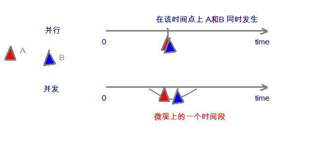
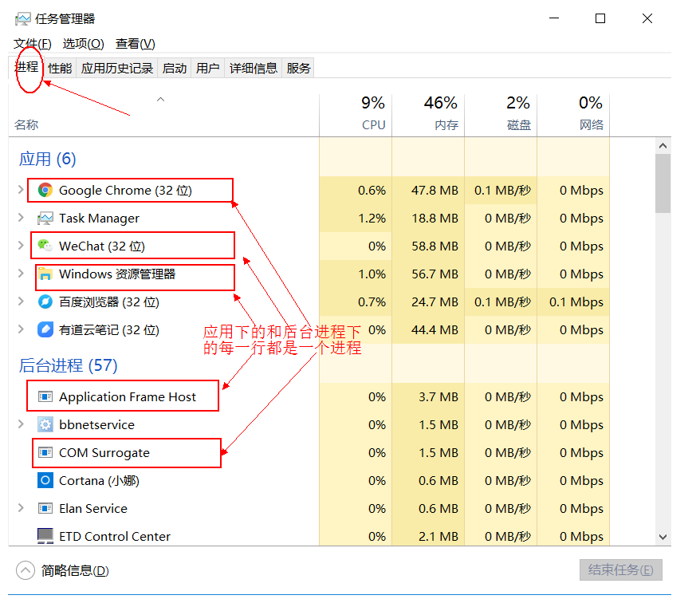
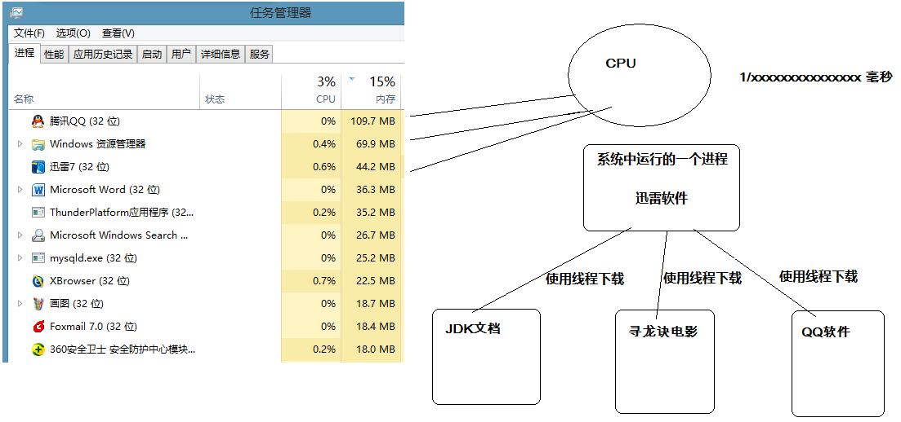
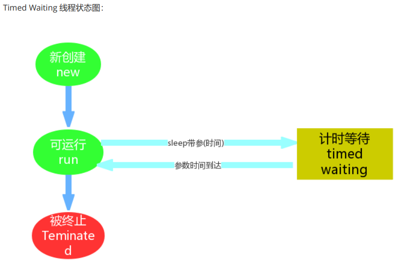
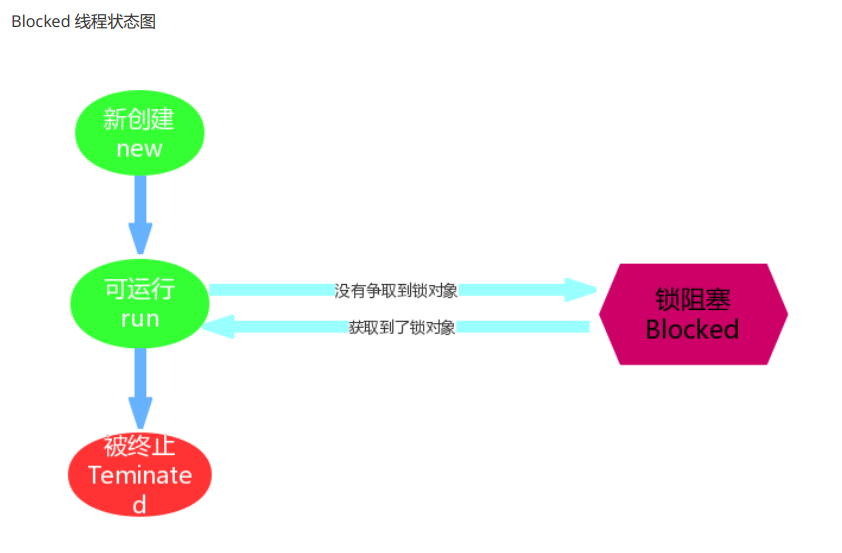
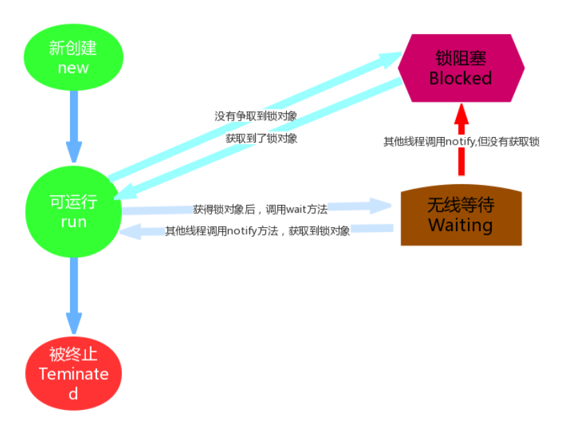
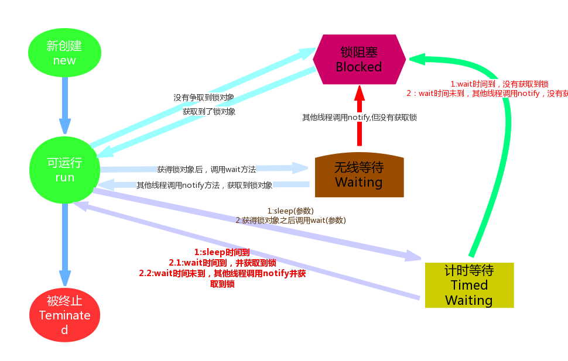

# 线程与进程

## 并发与并行

* **并发**：指两个或多个事件在**同一个时间段内**发生。
* **并行**：指两个或多个事件在**同一时刻**发生（同时发生）。



在操作系统中，安装了多个程序，并发指的是在一段时间内宏观上有多个程序同时运行，这在单 CPU 系统中，每一时刻只能有一道程序执行，即微观上这些程序是分时的交替运行，只不过是给人的感觉是同时运行，那是因为分时交替运行的时间是非常短的。

而在多个 CPU 系统中，则这些可以并发执行的程序便可以分配到多个处理器上（CPU），实现多任务并行执行，即利用每个处理器来处理一个可以并发执行的程序，这样多个程序便可以同时执行。目前电脑市场上说的多核 CPU，便是多核处理器，核 越多，并行处理的程序越多，能大大的提高电脑运行的效率。

> 注意：单核处理器的计算机肯定是不能并行的处理多个任务的，只能是多个任务在单个CPU上并发运行。同理,线程也是一样的，从宏观角度上理解线程是并行运行的，但是从微观角度上分析却是串行运行的，即一个线程一个线程的去运行，当系统只有一个CPU时，线程会以某种顺序执行多个线程，我们把这种情况称之为线程调度。

## 线程与进程

* **进程**：是指一个内存中运行的应用程序，每个进程都有一个独立的内存空间，一个应用程序可以同时运行多个进程；进程也是程序的一次执行过程，是系统运行程序的基本单位；系统运行一个程序即是一个进程从创建、运行到消亡的过程。

* **线程**：线程是进程中的一个执行单元，负责当前进程中程序的执行，一个进程中至少有一个线程。一个进程中是可以有多个线程的，这个应用程序也可以称之为多线程程序。 

  简而言之：一个程序运行后至少有一个进程，一个进程中可以包含多个线程 。
  
  多线程可以共享内存、 充分利用 CPU， 通过提高资源(内存和 CPU)使用率从而提高程序
  的执行效率。 CPU 使用抢占式调度模式在多个线程间进行着随机的高速的切换。   （如下图的cpu使用率只有9%，内存使用率只有46%）

我们可以再电脑底部任务栏，右键----->打开任务管理器,可以查看当前任务的进程：

### **进程**



### **线程**


### **线程调度:**

- 分时调度

  所有线程轮流使用 CPU 的使用权，平均分配每个线程占用 CPU 的时间。

- 抢占式调度

  优先让优先级高的线程使用 CPU，如果线程的优先级相同，那么会随机选择一个(线程随机性)，Java使用的为抢占式调度。

  - 设置线程的优先级

  

  - 抢占式调度详解

    大部分操作系统都支持多进程并发运行，现在的操作系统几乎都支持同时运行多个程序。比如：现在我们上课一边使用编辑器，一边使用录屏软件，同时还开着画图板，dos窗口等软件。此时，这些程序是在同时运行，”感觉这些软件好像在同一时刻运行着“。

    实际上，CPU(中央处理器)使用抢占式调度模式在多个线程间进行着高速的切换。对于CPU的一个核而言，某个时刻，只能执行一个线程，而 CPU的在多个线程间切换速度相对我们的感觉要快，看上去就是在同一时刻运行。
    其实，多线程程序并不能提高程序的运行速度，但能够提高程序运行效率，让CPU的使用率更高。

    

## java多线程

jvm是一个进程，main是主线程，然后Thread.start()是开一个新的线程。

多线程执行时，在栈内存中，其实每一个执行线程都有一片自己所属的栈内存空间。进行方法的压栈和弹栈。

> 注意： 
>
> 在java中，每次程序运行至少启动2个线程。一个是main线程，一个是垃圾收集线程。因为每当使用java命令执行一个类的时候，实际上都会启动一个JVM，每一个JVM其实在就是在操作系统中启动了一个进程。  


当执行线程的任务结束了，线程自动在栈内存中释放了。但是当所有的执行线程都结束了，那么进程就结束了。

# 创建线程

## Thread类

`java.lang.Thread` 

### 构造方法

```java
public Thread() :分配一个新的线程对象。
public Thread(String name) :分配一个指定名字的新的线程对象。
public Thread(Runnable target) :分配一个带有指定目标新的线程对象。
public Thread(Runnable target,String name) :分配一个带有指定目标新的线程对象并指定名字。
```

### 常用方法

```java
public String getName() :获取当前线程名称。
public void start() :导致此线程开始执行; Java虚拟机调用此线程的run方法。
public void run() :此线程要执行的任务在此处定义代码。
public static void sleep(long millis) :使当前正在执行的线程以指定的毫秒数暂停（暂时停止执行）。
public static Thread currentThread() :返回对当前正在执行的线程对象的引用
public final void join() ： Waits for this thread to die.
```


## 继承Thread 创建

Java使用`java.lang.Thread`类代表**线程**，所有的线程对象都必须是Thread类或其子类的实例。每个线程的作用是完成一定的任务，实际上就是执行一段程序流即一段顺序执行的代码。Java使用线程执行体来代表这段程序流。

Java中通过继承Thread类来**创建**并**启动多线程**的步骤如下：

> 1. 定义Thread类的子类，并重写该类的run()方法，该run()方法的方法体就代表了线程需要完成的任务,因此把run()方法称为线程执行体。
> 2. 创建Thread子类的实例，即创建了线程对象
> 3. 调用线程对象的start()方法来启动该线程
>

代码如下：

测试类：

~~~java
public class Demo01 {
	public static void main(String[] args) {
		//创建自定义线程对象
		MyThread mt = new MyThread("新的线程！");
		//开启新线程
		mt.start();
		//在主方法中执行for循环
		for (int i = 0; i < 10; i++) {
			System.out.println("main线程！"+i);
		}
	}
}
~~~

自定义线程类：

~~~java
public class MyThread extends Thread {
	//定义指定线程名称的构造方法
	public MyThread(String name) {
		//调用父类的String参数的构造方法，指定线程的名称
		super(name);
	}
	/**
	 * 重写run方法，完成该线程执行的逻辑
	 */
	@Override
	public void run() {
		for (int i = 0; i < 10; i++) {
			System.out.println(getName()+"：正在执行！"+i);
		}
	}
}
~~~

##  实现Runnable  创建

```java
public class MyRunnable implements Runnable {
	@Override
	public void run() {
		for (int i = 0; i < 20; i++) {
			System.out.println(Thread.currentThread().getName() + " " + i);
		}
	}

	public static void main(String[] args) {
		//创建自定义类对象 线程任务对象
		MyRunnable mr = new MyRunnable();
		//创建线程对象
		Thread t = new Thread(mr, "小强");
		t.start();
		for (int i = 0; i < 20; i++) {
			System.out.println("旺财 " + i);
		}
	}
}
/*
步骤如下：
		1. 定义Runnable接口的实现类，并重写该接口的run()方法，该run()方法的方法体同样是该线程的线程执行体。
		2. 创建Runnable实现类的实例，并以此实例作为Thread的target来创建Thread对象，该Thread对象才是真正的线程对象。
		3. 调用线程对象的start()方法来启动线程。
```

所有的多线程代码都在run方法里面。  Thread类实际上也是实现了Runnable接口的类。 实际上所有的多线程代码都是通过运行Thread的start()方法来运行的。因此，不管是继承Thread类还是实现Runnable接口来实现多线程，最终还是通过Thread的对象的API来控制线程的，熟悉Thread类的API是进行多线程编程的基础  。

> 匿名内部类 更方便 

## 区别

如果一个类继承Thread，则不适合资源共享。但是如果实现了Runable接口的话，则很容易的实现资源共享。

**实现Runnable接口比继承Thread类所具有的优势：**

	1. 适合多个相同的程序代码的线程去共享同一个资源。
	2. 可以避免java中的单继承的局限性。
	3. 增加程序的健壮性，实现解耦操作，代码可以被多个线程共享，代码和线程独立。
	4. 线程池只能放入实现Runable或Callable类线程，不能直接放入继承Thread的类。  

# 终止线程

有三种方法可以结束线程：

- 1.设置退出标志，使线程正常退出，也就是当run()方法完成后线程终止
- 2.使用interrupt()方法中断线程
- 3.使用stop方法强行终止线程（不推荐使用，Thread.stop, Thread.suspend, Thread.resume 和Runtime.runFinalizersOnExit 这些终止线程运行的方法已经被废弃，使用它们是极端不安全的！）

前两种方法都可以实现线程的正常退出；第3种方法相当于电脑断电关机一样，是不安全的方法。

1. 使用退出标志终止线程
   一般**run()**方法执行完，线程就会正常结束，然而，常常有些线程是伺服线程。它们需要长时间的运行，只有在外部某些条件满足的情况下，才能关闭这些线程。使用一个变量来控制循环，例如：最直接的方法就是设一个**boolean**类型的标志，并通过设置这个标志为true或false来控制while循环是否退出，代码示例：

```java
public class ThreadSafe extends Thread {
    public volatile boolean exit = false; 
        public void run() { 
        while (!exit){
            //do something
        }
    } 
}
```

​	定义了一个退出标志exit，当exit为true时，while循环退出，exit的默认值为false.在定义exit时，使用了一个Java关键字volatile，这个关键字的目的是使exit同步，也就是说在同一时刻只能由一个线程来修改exit的值.

2. 使用interrupt()方法中断当前线程
   使用interrupt()方法来中断线程有两种情况：
   1. 线程处于阻塞状态，如使用了**sleep**,同步锁的**wait**,**socket**中的**receiver**,**accept**等方法时，会使线程处于阻塞状态。当调用线程的**interrupt()**方法时，会抛出**InterruptException**异常。阻塞中的那个方法抛出这个异常，通过代码捕获该异常，然后**break**跳出循环状态，从而让我们有机会结束这个线程的执行。通常很多人认为只要调用interrupt方法线程就会结束，实际上是错的， 一定要先捕获InterruptedException异常之后通过break来跳出循环，才能正常结束run方法。

*代码示例：*

```java
public class ThreadSafe extends Thread {
    public void run() { 
        while (true){
            try{
                    Thread.sleep(5*1000);//阻塞5妙
                }catch(InterruptedException e){
                    e.printStackTrace();
                    break;//捕获到异常之后，执行break跳出循环。
                }
        }
    } 
}
```

		2. 线程未处于阻塞状态，使用isInterrupted()判断线程的中断标志来退出循环。当使用interrupt()方法时，中断标志就会置true，和使用自定义的标志来控制循环是一样的道理。
*代码示例：*

```java
public class ThreadSafe extends Thread {
    public void run() { 
        while (!isInterrupted()){
            //do something, but no throw InterruptedException
        }
    } 
}
```

为什么要区分进入阻塞状态和和非阻塞状态两种情况了，是因为当阻塞状态时，如果有interrupt()发生，系统除了会抛出InterruptedException异常外，还会调用interrupted()函数，调用时能获取到中断状态是true的状态，调用完之后会复位中断状态为false，所以异常抛出之后通过isInterrupted()是获取不到中断状态是true的状态，从而不能退出循环，因此在线程未进入阻塞的代码段时是可以通过isInterrupted()来判断中断是否发生来控制循环，在进入阻塞状态后要通过捕获异常来退出循环。因此使用interrupt()来退出线程的最好的方式应该是两种情况都要考虑：

*代码示例：*

```java
public class ThreadSafe extends Thread {
    public void run() { 
        while (!isInterrupted()){ //非阻塞过程中通过判断中断标志来退出
            try{
                Thread.sleep(5*1000);//阻塞过程捕获中断异常来退出
            }catch(InterruptedException e){
                e.printStackTrace();
                break;//捕获到异常之后，执行break跳出循环。
            }
        }
    } 
}
```

3. 使用stop方法终止线程
   程序中可以直接使用thread.stop()来强行终止线程，但是stop方法是很危险的，就象突然关闭计算机电源，而不是按正常程序关机一样，可能会产生不可预料的结果，不安全主要是：thread.stop()调用之后，创建子线程的线程就会抛出ThreadDeatherror的错误，并且会释放子线程所持有的所有锁。一般任何进行加锁的代码块，都是为了保护数据的一致性，如果在调用thread.stop()后导致了该线程所持有的所有锁的突然释放(不可控制)，那么被保护数据就有可能呈现不一致性，其他线程在使用这些被破坏的数据时，有可能导致一些很奇怪的应用程序错误。因此，并不推荐使用stop方法来终止线程。

# 线程状态

## 线程状态概述

在API中 `java.lang.Thread.State` 这个枚举中给出了六种线程状态：  

| 线程状态                | 导致状态发生条件                                             |
| ----------------------- | ------------------------------------------------------------ |
| NEW(新建)               | 线程刚被创建，但是并未启动。还没调用start方法。              |
| Runnable(可运行)        | 线程可以在java虚拟机中运行的状态，可能正在运行自己代码，也可能没有，这取决于操作系统处理器。 |
| Blocked(锁阻塞)         | 当一个线程试图获取一个对象锁，而该对象锁被其他的线程持有，则该线程进入Blocked状 态；当该线程持有锁时，该线程将变成Runnable状态。 |
| Waiting(无限等待)       | 一个线程在等待另一个线程执行一个（唤醒）动作时，该线程进入Waiting状态。进入这个 状态后是不能自动唤醒的，必须等待另一个线程调用notify或者notifyAll方法才能够唤醒。 |
| Timed Waiting(计时等待) | 同waiting状态，有几个方法有超时参数，调用他们将进入Timed Waiting状态。这一状态 将一直保持到超时期满或者接收到唤醒通知。带有超时参数的常用方法有Thread.sleep 、 Object.wait。 |
| Teminated(被终止)       | 因为run方法正常退出而死亡，或者因为没有捕获的异常终止了run方法而死亡。 |

> 待解决 ：
>
> ​		实现原理

## Timed Waiting（计时等待）  

一个正在限时等待另一个线程执行一个（唤醒）动作的线程处于这一状态。  

```java
Thread.sleep(1000);
```

注意：

> 1. 进入 TIMED_WAITING 状态的一种常见情形是调用的 sleep 方法，单独的线程也可以调用，不一定非要有协作关系。
> 2. 为了让其他线程有机会执行，可以将Thread.sleep()的调用放线程run()之内。这样才能保证该线程执行过程中会睡眠
> 3. sleep与锁无关，线程睡眠到期自动苏醒，并返回到Runnable（可运行）状态。
> 4. sleep()中指定的时间是线程不会运行的最短时间。因此，sleep()方法不能保证该线程睡眠到期后就开始立刻执行。  

 

## BLOCKED（锁阻塞）

一个正在阻塞等待一个监视器锁（锁对象）的线程处于这一状态。  

线程A与线程B代码中使用同一锁，如果线程A获取到锁，线程A进入到Runnable状态，那么线程B就进入到Blocked锁阻塞状态。  

这是由Runnable状态进入Blocked状态。除此Waiting以及Time Waiting状态也会在某种情况下进入阻塞状态  

 

## Waiting（无限等待）

一个正在无限期等待另一个线程执行一个特别的（唤醒）动作的线程处于这一状态。  

一个调用了某个对象的 Object.wait 方法的线程会等待另一个线程调用此对象的`Object.notify()`方法 或 `Object.notifyAll()`方法。  

**锁对象方法调用**

```java
obj.wait(); //无限等待
obj.wait(5000); //计时等待, 5秒 时间到，自动醒来
//调用wait方法，进入waiting状态，释放锁对象
obj.notify()
obj.notifyAll()
```

其实waiting状态并不是一个线程的操作，它体现的是多个线程间的通信，可以理解为多个线程之间的协作关系，多个线程会争取锁，同时相互之间又存在协作关系当多个线程协作时，比如A，B线程，如果A线程在Runnable（可运行）状态中调用了wait()方法那么A线程就进入了Waiting（无限等待）状态，同时失去了同步锁。假如这个时候B线程获取到了同步锁，在运行状态中调用了notify()方法，那么就会将无限等待的A线程唤醒。注意是唤醒，如果获取到锁对象，那么A线程唤醒后就进入Runnable（可运行）状态；如果没有获取锁对象，那么就进入到Blocked（锁阻塞状态）。  

 

 

## 总结

我们在翻阅API的时候会发现Timed Waiting（计时等待） 与 Waiting（无限等待） 状态联系还是很紧密的，比如Waiting（无限等待） 状态中wait方法是空参的，而timed waiting（计时等待） 中wait方法是带参的。这种带参的方法，其实是一种倒计时操作，相当于我们生活中的小闹钟，我们设定好时间，到时通知，可是如果提前得到（唤醒）通知，那么设定好时间在通知也就显得多此一举了，那么这种设计方案其实是一举两得。如果没有得到（唤醒）通知，那么线程就处于Timed Waiting状态,直到倒计时完毕自动醒来；如果在倒计时期间得到（唤醒）通知，那么线程从Timed Waiting状态立刻唤醒。  





# 定时器

定实现时器 Timer 和 TimerTask  : 

```java
//Timer 在实际开发中应用场景不多，一般来说都会用其他第三方库来实现。  
new Timer().schedule(new TimerTask(){..}, 2000+2000*count);
```

# ThreadLocal

线程相关变量

- **作用** 

​	用于实现线程内的数据共享，即对于相同的程序代码，多个模块在同一个线程中运行时要共享一份数据，而在另外线程中运行时又共享另外一份数据。

- **原理**

每个线程调用全局 `ThreadLocal` 对象的 set 方法，在 set 方法中，首先根据当前线程获取**当前线程**的`ThreadLocalMap` 对象，然后往这个 map 中插入一条记录， key 其实是 `ThreadLocal` 对象， value 是各自的 set方法传进去的值。也就是**每个线程其实都有一份自己独享的 `ThreadLocalMap` 对象**，该对象的 Key 是 `ThreadLocal`对象，值是用户设置的具体值。

在线程结束时可以调用 `ThreadLocal.remove()`方法，这样会更快释放内存，不调用也可以，因为线程结束后也可以自动释放相关的 `ThreadLocal` 变量。  

每一种值需要一个`threadLocal`都对象，并且设置成可以在各个需要的地方都拿到相同的对象。最好使用final static保证是同一个对象，并且是可以直接拿到

- **应用场景**

➢ 订单处理包含一系列操作：减少库存量、增加一条流水台账、修改总账，这几个操作要在同一个事务中完成，通常也即同一个线程中进行处理，如果累加公司应收款的操作失败了，则应该把前面的操作回滚，否则，提交所有操作，这要求这些操作使用**相同的数据库连接对象**，而这些操作的代码分别位于不同的模块类中。

➢ 银行转账包含一系列操作： 把转出帐户的余额减少，把转入帐户的余额增加，这两个操作要在同一个事务中完成，它们必须使用**相同的数据库连接对象**，转入和转出操作的代码分别是两个不同的帐户对象的方法。  

➢ Spring security的SecurityContext： 一个请求在一条线程中处理，并且需要相同的Authentication，不断进行处理

- **使用方法**

1. 在关联数据类中创建 private static ThreadLocal  

```java
/*
 * 在下面的类中，私有静态 threadlocal 实例（serialNum）为调用该类的静态 SerialNum.get() 方法的每个线程维护了一个“序列号” ，该方法将返回当前线程的序列号。（线程的序列号是在第一
 * 次调用 SerialNum.get() 时分配的，并在后续调用中不会更改。）
 */

public class SerialNum {
	// The next serial number to be assigned
	private static int nextSerialNum = 0;

	private static ThreadLocal serialNum = new ThreadLocal() {

		@Override
		//因为需要修改nextSerialNum，所以需要同步锁
		protected synchronized Object initialValue() {
			return nextSerialNum++;
		}

	};

	//每个线程都会创建自己的Map，然后把initialValue值塞进去
	public static int get() {
		return (Integer) (serialNum.get());
	}

	//测试
	public static void main(String[] args) {
		for (int i = 0; i < 10; i++) {
			new Thread(() -> {
				//每个线程的SerialNum（i）都是不同的
				System.out.println(Thread.currentThread().getName() + " : " + SerialNum.get());
				try {
					Thread.sleep(1000);
				} catch (InterruptedException e) {
					e.printStackTrace();
				}
			}).start();
		}

	}
}
```

另一种用法

```java
public class ThreadContext {
	private String userId;
	private Long transactionId;

	private static ThreadLocal<ThreadContext> threadLocal = new ThreadLocal() {
		@Override
		protected ThreadContext initialValue() {
			return new ThreadContext();
		}
	};

	public static ThreadContext get() {
		return threadLocal.get();
	}

	//测试
	public static void main(String[] args) {
		for (int i = 0; i < 10; i++) {
			new Thread(() -> {
				//每个线程的ThreadContext都不一样
				ThreadContext threadContext = ThreadContext.get();
				System.out.println(Thread.currentThread().getName() + " : " + threadContext);
				try {
					Thread.sleep(1000);
				} catch (InterruptedException e) {
					e.printStackTrace();
				}
			}).start();
		}

	}
}
```

2. 在 Util 类中创建 ThreadLocal

```java
/**
 * 这是上面用法的扩展，即把 threadlocal 的创建放到工具类中。
 *
 * @author Carl Don
 * @version V1.0
 * @ClassName HibernateUtil
 * @date 2019年08月15日 下午 5:50
 */
public class HibernateUtil {
	private static Log log = LogFactory.getLog(HibernateUtil.class);
	private static final SessionFactory sessionFactory; //定义 SessionFactory

	static {
		try {
			// 通过默认配置文件 hibernate.cfg.xml 创建 SessionFactory
			sessionFactory = new Configuration().configure().buildSessionFactory();
		} catch (Throwable ex) {
			log.error("初始化 SessionFactory 失败！ ", ex);
			throw new ExceptionInInitializerError(ex);
		}
	}

	//创建线程局部变量 session，用来保存 Hibernate 的 Session
	public static final ThreadLocal session = new ThreadLocal();

	/**
	 * 获取当前线程中的 Session
	 */
	public static Session currentSession() throws HibernateException {
		Session s = (Session) session.get();
		// 如果 Session 还没有打开，则新开一个 Session
		if (s == null) {
			s = sessionFactory.openSession();
			session.set(s); //将新开的 Session 保存到线程局部变量中
		}
		return s;
	}

	public static void closeSession() throws HibernateException {
		//获取线程局部变量，并强制转换为 Session 类型
		Session s = (Session) session.get();
		session.set(null);
		if (s != null)
			s.close();
	}
}
```

```java
public class HibernateUtil_copy {
    //threadLocal作为当前线程的连接的代表者,使用final
    private static final ThreadLocal<Connection> threadLocal = new ThreadLocal<>();

    //连接池需要初始化，这里不做要求，使用final
    private static final DataSource dataSource = new DruidDataSource();

    //获取当前线程连接，第一次就从datasource中获取
    public static Connection getConnection() throws SQLException {
        Connection connection = threadLocal.get();
        if (connection == null) {
            connection = dataSource.getConnection();
            threadLocal.set(connection);
        }
        return connection;
    }

    //关闭连接，返回连接池
    public static void closeConnection() throws SQLException {
        Connection connection = threadLocal.get();
        threadLocal.set(null);
        if(connection!=null){
            connection.close();
        }
    }
}
```

3. 在 Runnable 中创建 ThreadLocal

   ①、 在多线程的类（如 ThreadDemo 类）中，创建一个 ThreadLocal 对象 threadXxx，用来保存线程间需要隔离处理的对象 xxx。

   ②、 在 ThreadDemo 类中，创建一个获取要隔离访问的数据的方法 getXxx()，在方法中判断，若ThreadLocal 对象为 null 时候，应该 new()一个隔离访问类型的对象，并强制转换为要应用的类型

   ③、 在 ThreadDemo 类的 run()方法中，通过调用 getXxx()方法获取要操作的数据，这样可以保证每个线程对应一个数据对象，在任何时刻都操作的是这个对象。  

```java
public class ThreadLocalTest implements Runnable {
	ThreadLocal<Student> studentThreadLocal = new ThreadLocal<>();

	@Override
	public void run() {
		String currentThreadName = Thread.currentThread().getName();
		System.out.println(currentThreadName + " is running...");
		Random random = new Random();
		int age = random.nextInt(100);
		System.out.println(currentThreadName + " is set age: " + age);
		//通过这个方法，为每个线程都独立的 new 一个 student 对象，每个线程的的student 对象都可以设置不同的值
		Student student = getStudent();
		student.setAge(age);
		System.out.println(currentThreadName + " is first get age: " + student.getAge());
		try {
			Thread.sleep(500);
		} catch (InterruptedException e) {
			e.printStackTrace();
		}
		System.out.println(currentThreadName + " is second get age: " + student.getAge());
	}

	private Student getStudent() {
		Student student = studentThreadLocal.get();
		if (null == student) {
			student = new Student();
			studentThreadLocal.set(student);
		}
		return student;
	}

	public static void main(String[] args) {
		ThreadLocalTest t = new ThreadLocalTest();
		Thread t1 = new Thread(t, "Thread A");
		Thread t2 = new Thread(t, "Thread B");
		t1.start();
		t2.start();
	}
}
```

# 线程安全

## 介绍

1. **多个线程**访问了**相同的资源**。如，同一内存区（变量，数组，或对象）、系统（数据库，web services等）或文件。

2. **写操作**，只要资源没有发生变化，多个线程读取相同的资源就是安全的。

## 底层原因

### 介绍

线程安全也叫做线程同步，因为线程安全的根源在于**线程切换，线程之间执行顺序混乱**的问题，也就是协同步调。

- **重点** 

  不满足原子性、可见性、有序性有可能导致缓存不一致和业务逻辑混乱。

- **简单操作**

  - 下面的例子：读~写~存不能连贯完成，操作无序，最终表现为**缓存一致性问题**。

- **复杂操作**
  
  - 例如：map的读写，map变量是一个复杂变量，单个读写在java层面也是复杂操作。
    - 简单的成员变量的操作有**缓存一致性问题**。
    - 业务逻辑也有可能有问题：（比如先判断map的size为1，然后写入。但是数据没有问题）
    - 需要保证更大范围的原子性、可见性、有序性。
  
- mysql应该也是差不多

### 缓存不一致

多线程同时执行下面的代码可能会出错：原因是缓存不一致。

```java
public class Counter {
    protected long count = 0;

    public void add(long value){
        this.count = this.count + value;  
    }
}

```

想象下线程A和B同时执行同一个Counter对象的add()方法，我们无法知道操作系统何时会在两个线程之间切换。JVM并不是将这段代码视为单条指令来执行的，而是按照下面的顺序：

```
从主存获取 this.count 的值放到高速缓存，再到寄存器
将寄存器中的值增加 value
将寄存器中的值写回高速缓存，再到主存
```

观察线程A和B交错执行会发生什么：

```java
   this.count = 0;
   A:   读取 this.count 到一个寄存器 (0)
   B:   读取 this.count 到一个寄存器 (0)
   B:   将寄存器的值加2
   B:   回写寄存器值(2)到内存. this.count 现在等于 2
   A:   将寄存器的值加3
   A:   回写寄存器值(3)到内存. this.count 现在等于 3
```

两个线程分别加了2和3到count变量上，两个线程执行结束后count变量的值应该等于5。然而由于两个线程是交叉执行的，两个线程从内存中读出的初始值都是0。然后各自加了2和3，并分别写回内存。最终的值并不是期望的5，而是最后写回内存的那个线程的值，上面例子中最后写回内存的是线程A，但实际中也可能是线程B。如果没有采用合适的同步机制，**线程间的交叉执行情况就无法预料**。

### 竞态条件 & 临界区

当两个线程竞争同一资源时，如果对资源的访问顺序敏感，就称存在**竞态条件**。导致竞态条件发生的代码区称作**临界区**。上例中`add()`方法就是一个临界区,它会产生竞态条件。在临界区中使用适当的同步就可以避免竞态条件。

 **共享资源**

允许被多个线程同时执行的代码称作线程安全的代码。线程安全的代码不包含竞态条件。当多个线程同时更新共享资源时会引发竞态条件。因此，了解Java线程执行时共享了什么资源很重要。

**局部变量**

局部变量存储在线程自己的栈中。也就是说，局部变量永远也不会被多个线程共享。所以，基础类型的局部变量是线程安全的。下面是基础类型的局部变量的一个例子：

```java
public void someMethod(){
  long threadSafeInt = 0;
  threadSafeInt++;
}
```

## 线程同步

### 介绍

> 保证每个线程都能正常执行原子操作，Java引入了线程同步机制 ： 协同步调。对需要同步（互斥）的操作加锁。锁的粒度尽量可能细。

**互斥和同步**：

​		线程之间的步调协同问题，前者没有规定哪个先哪个后，后者规定哪个先哪个后。同步包括互斥，互斥其实是一种特殊的同步。  

​		互斥：一个系统中的多个线程必然要共享某种系统资源，如共享 CPU，共享 I/O 设备，所谓间接相互制约即源于这种资源共享，打印机就是最好的例子，线程 A 在使用打印机时，其它线程都要等待。  

​		同步：这种制约主要是因为线程之间的合作，如有线程 A 将计算结果提供给线程 B 作进一步处理，那么线程 B 在线程 A 将数据送达之前都将处于阻塞状态。  

​		同步锁：监视器

### 同步代码块

只对这个区块的资源实行互斥访问。  

```java
synchronized(同步锁){
	需要同步操作的代码
}
```

 **同步锁**

对象的同步锁只是一个概念,可以想象为在对象上标记了一个锁.

1. 锁对象 可以是任意类型。
2. 多个线程对象 要使用同一把锁  

> 注意：
>
> ​		在任何时候,最多允许一个线程拥有同步锁,谁拿到锁就进入代码块,其他的线程只能在外等着(BLOCKED)。  
>
> ```java
> //尽量使用static final，保证监视器不会变化
> //不要使用基本类型包装类和String，因为会变换
> ```
>


### 同步方法

使用synchronized修饰的方法,就叫做同步方法,保证A线程执行该方法的时候,其他线程只能在方法外等着。  

```java
public synchronized void method(){
	可能会产生线程安全问题的代码
}
```

**同步锁是谁**

1. 对于非static方法,同步锁就是this。不同的对象很少出现线程安全问题,只要不要操作静态变量
2. 对于static方法,我们使用当前方法所在类的字节码对象(类名.class)。  
3. 

### Lock锁

`java.util.concurrent.locks.Lock` 机制提供了比`synchronized`代码块和`synchronized`方法更广泛的锁定操作,同步代码块/同步方法具有的功能Lock都有,除此之外更强大,更体现面向对象。

Lock锁也称同步锁，加锁与释放锁方法化了，如下：

```java
public void lock() :加同步锁。
public boolean tryLock(long timeout,TimeUnit unit)： 限时获取锁
public void unlock() :释放同步锁  
```

```java
public class Ticket implements Runnable {
	private int ticket = 100;
	Lock lock = new ReentrantLock();

	/*
	 * 执行卖票操作
	 */
	@Override
	public void run() {
		//每个窗口卖票的操作
		//窗口 永远开启
		while (true) {
			lock.lock();
			if (ticket > 0) {//有票 可以卖
				//出票操作
				//使用sleep模拟一下出票时间
				try {
					Thread.sleep(50);
				} catch (InterruptedException e) {
					// TODO Auto‐generated catch block
					e.printStackTrace();
				}
				//获取当前线程对象的名字
				String name = Thread.currentThread().getName();
				System.out.println(name + "正在卖:" + ticket--);
			}
			lock.unlock();
		}
	}
}
```

> 注意：
>
> ​		**不释放锁的后果** 
>
> ```java
> An unrecoverable stack overflow has occurred.
> #
> # A fatal error has been detected by the Java Runtime Environment:
> #
> #  EXCEPTION_STACK_OVERFLOW (0xc00000fd) at pc=0x000000006a364e67, pid=153492, tid=0x000000000007acb0
> #
> # JRE version: Java(TM) SE Runtime Environment (8.0_202-b08) (build 1.8.0_202-b08)
> # Java VM: Java HotSpot(TM) 64-Bit Server VM (25.202-b08 mixed mode windows-amd64 compressed oops)
> # Problematic frame:
> # V  [jvm.dll+0x214e67]Exception in thread "main" 
> ```

### Semaphore

### 其他

使用java.util.concurrent.atomic 包中的原子类，例如 AtomicInteger

使用java.util.concurrent.locks 包中的锁

使用线程安全的集合ConcurrentHashMap

使用volatile关键字，保证变量可见性（直接从内存读，而不是从线程cache读）


## 死锁

- **死锁的定义**

所谓死锁是指多个线程因竞争资源而造成的一种僵局（互相等待），若无外力作用，这些进程都将无法向前推进。

- **死锁产生的必要条件**

互斥条件：线程要求对所分配的资源（如打印机）进行排他性控制，即在一段时间内某 资源仅为一个线程所占有。此时若有其他线程请求该资源，则请求线程只能等待。

不剥夺条件：线程所获得的资源在未使用完毕之前，不能被其他线程强行夺走，即只能由获得该资源的线程自己来释放（只能是主动释放)。

请求和保持条件：线程已经保持了至少一个资源，但又提出了新的资源请求，而该资源已被其他线程占有，此时请求进程被阻塞，但对自己已获得的资源保持不放。

循环等待条件：存在一种线程资源的循环等待链，链中每一个线程已获得的资源同时被链中下一个线程所请求。即存在一个处于等待状态的线程集合{Pl, P2, ..., pn}， 其中 Pi 等待的资源被 P(i+1)占有（i=0, 1, ..., n-1)，Pn 等待的资源被 P0 占有，如图 2-15 所示。  

 

- **如何避免死锁**

1. 加锁顺序 ，让另一个线程先完成

    

   

2. 在外围加上一层lock锁控制时间（线程尝试获取锁的时候加上一定的时限，超过时限则放弃对该锁的请求，并释放自己占有的锁）

> 代码可以看项目

## 问题

1. 同一个类中的 2 个方法都加了同步锁，多个线程能同时访问同一个类中的这两个方法吗  ？

   `synchronized`看监视器是不是同一个；lock看是不是同一个lock

# 线程并发库

## 介绍

1. **java.util.concurrent 包 (多线程并发库)**  

   目的是实现 Collection 框架对数据结构所执行的并发操作。通过提供一组可靠的、高性能并发构建块，开发人员可以提高并发类的线程安全、可伸缩性、性能、可读性和可靠性 。

2. **java.util.concurrent.atomic 包 (多线程的原子性操作提供的工具类)**  

   1. 可以对多线程的基本数据、数组中的基本数据和对象中的基本数据进行多线程的操作（AtomicInteger、 AtomicIntegerArray、AtomicIntegerFieldUpDater…）

   2. 通过如下两个方法快速理解 atomic 包的意义：

       AtomicInteger 类的 boolean compareAndSet(expectedValue, updateValue);

       AtomicIntegerArray 类的 int addAndGet(int i, int delta);

   3. 顺带解释 volatile 类型的作用，需要查看 java 语言规范。

       volatile 修饰的变量，线程在每次使用变量的时候，都会读取变量修改后的最的值。（具有可见性）
       volatile 没有原子性。  

3. **java.util.concurrent.lock 包 (多线程的锁机制)**  

   为锁和等待条件提供一个框架的接口和类，它不同于内置同步和监视器。该框架允许更灵活地使用锁和条件。  

   本包下有三大接口，下面简单介绍下：

   1. Lock 接口： 支持那些语义不同（重入、公平等）的锁规则，可以在非阻塞式结构的上下文（包括 handover-hand 和锁重排算法）中使用这些规则。主要的实现是 ReentrantLock。

   2. ReadWriteLock 接口： 以类似方式定义了一些读取者可以共享而写入者独占的锁。此包只提供了一个实现，即 ReentrantReadWriteLock，因为它适用于大部分的标准用法上下文。但程序员可以创建自己的、适用于非标准要求的实现。

   3. Condition 接口： 描述了可能会与锁有关联的条件变量。这些变量在用法上与使用 Object.wait 访问的隐式监视器类似，但提供了更强大的功能。需要特别指出的是，单个 Lock 可能与多个 Condition 对象关联。为了避免兼容性问题， Condition 方法的名称与对应的 Object 版本中的不同。  

## java.util.concurrent 包

### 线程池

#### 介绍

* **线程池：**其实就是一个容纳多个线程的容器，其中的线程可以反复使用，省去了频繁创建线程对象的操作，无需反复创建线程而消耗过多资源。

  一个任务执行完毕，再从队列的中取最前面的任务开始执行。若队列中没有等待进程，线程池的这一资源处于等待。当一个新任务需要运行时，如果线程池中有等待的工作线程，就可以开始运行了；否则进入等待队列。  

  

- **合理利用线程池的好处**

1. 降低资源消耗。减少了创建和销毁线程的次数，每个工作线程都可以被重复利用，可执行多个任务。
2. 提高响应速度。当任务到达时，任务可以不需要的等到线程创建就能立即执行。
3. 提高线程的可管理性。可以根据系统的承受能力，调整线程池中工作线线程的数目，防止因为消耗过多的内存，而把服务器累趴下(每个线程需要大约1MB内存，线程开的越多，消耗的内存也就越大，最后死机)。

#### 线程池的启动策略  

官方对线程池的执行过程描述如下：  

> ```java
> 26. /*
> 27. * Proceed in 3 steps:
> 28. *
> 29. * 1. If fewer than corePoolSize threads are running, try to
> 30. * start a new thread with the given command as its first
> 31. * task. The call to addWorker atomically checks runState and
> 32. * workerCount, and so prevents false alarms that would add
> 33. * threads when it shouldn't, by returning false.
> 34. *
> 35. * 2. If a task can be successfully queued, then we still need
> 36. * to double-check whether we should have added a thread
> 37. * (because existing ones died since last checking) or that
> 38. * the pool shut down since entry into this method. So we
> 39. * recheck state and if necessary roll back the enqueuing if
> 40. * stopped, or start a new thread if there are none.
> 41. *
> 42. * 3. If we cannot queue task, then we try to add a new
> 43. * thread. If it fails, we know we are shut down or saturated
> 44. * and so reject the task.
> 45. */
> ```

1. 线程池刚创建时，里面没有一个线程。任务队列是作为参数传进来的。不过，就算队列里面有任务，线程池也不会马上执行它们。

2. 当调用 execute() 方法添加一个任务时，线程池会做如下判断：

   ```
   a. 如果正在运行的线程数量小于 corePoolSize，那么马上创建线程运行这个任务；
   b. 如果正在运行的线程数量大于或等于 corePoolSize，那么将这个任务放入队列。
   c. 如果这时候队列满了，而且正在运行的线程数量小于 maximumPoolSize，那么还是要创建线程运行这个任务；
   d. 如果队列满了，而且正在运行的线程数量大于或等于 maximumPoolSize，那么线程池会抛出异常，告诉调用者“我不能再接受任务了”。
   ```

3. 当一个线程完成任务时，它会从队列中取下一个任务来执行。
4. 当一个线程无事可做，超过一定的时间（keepAliveTime）时，线程池会判断，如果当前运行的线程数大于corePoolSize，那么这个线程就被停掉。所以线程池的所有任务完成后，它最终会收缩到 corePoolSize 的大小。  


#### Executors 线程池工厂类  

Java里面线程池的顶级接口是`java.util.concurrent.Executor`，但是严格意义上讲`Executor`并不是一个线程池，而只是一个执行线程的工具。真正的线程池接口是`java.util.concurrent.ExecutorService`。

要配置一个线程池是比较复杂的，尤其是对于线程池的原理不是很清楚的情况下，很有可能配置的线程池不是较优的，因此在`java.util.concurrent.Executors`线程工厂类里面提供了一些静态工厂，生成一些常用的线程池。官方建议使用Executors工厂类来创建线程池对象。

- **固定大小连接池**

  不管 execute 执行几次，线程池始终都会使用 2 个线程来处理。不会再去创建出其他线程来处理run 方法执行。这就是固定大小线程池。  

  ```java
  ExecutorService pool = Executors.newFixedThreadPool(2);
  
  //将线程放入池中进行执行
  pool.execute(t1);  
  
  //关闭线程池
  pool.shutdown();  
  ```

- ##### 单任务连接池

  单任务线程池在执行 execute 方法来执行 Thread 类中的 run 方法。不管 execute 执行几次，线程池始终都会使用单个线程来处理。 

  在 java 的多线程中，一但线程关闭，就会成为死线程。关闭后死线程就没有办法在启动了。再次启动就会出现异常信息： Exception in thread "main" java.lang.IllegalThreadStateException。  

  ```java
  //创建一个使用单个 worker 线程的 Executor，以无界队列方式来运行该线程。
  ExecutorService pool = Executors.newSingleThreadExecutor();
  ```

- ##### 可变连接池

  这里 execute 执行多次，线程池就会创建出多个线程来处理 Thread 类中 run 方法。

  ```java
  //创建一个使用单个 worker 线程的 Executor，以无界队列方式来运行该线程。
  ExecutorService pool = Executors.newCachedThreadPool();
  ```

- ##### 延迟连接池

  ```java
  //创建一个线程池，它可安排在给定延迟后运行命令或者定期地执行。
  ScheduledExecutorService pool = Executors.newScheduledThreadPool(2);
  
  pool.execute(t3);
  //使用定时执行风格的方法
  pool.schedule(t4, 10, TimeUnit.MILLISECONDS); //t4 和 t5 在 10 秒后执行
  pool.schedule(t5, 10, TimeUnit.MILLISECONDS);
  ```

#### ExecutorService执行器服务

##### 简介

java.util.concurrent.ExecutorService 接口表示一个异步执行机制，使我们能够在后台执行任务。因此一个 ExecutorService 很类似于一个线程池。实际上，存在于 java.util.concurrent 包里的 ExecutorService 实现就是一个线程池实现。  

异步的一种实现方式是多线程

 

两个实现类


 

 

##### 使用

```java
1. void execute(Runnable command);

//特点： 没有办法得知被执行的 Runnable 的执行结果。如果有需要的话你得使用一个 Callable(以下将做介绍)。
```

```java
2. Future<?> submit(Runnable task);

//submit(Runnable) 方法也要求一个 Runnable 实现类，但它返回一个 Future 对象。这个 Future 对象可以用来检查 Runnable 是否已经执行完毕。注意： get到结果前会阻塞，等待线程完成

Future future = executorService.submit(new Runnable() {
    public void run() {
        System.out.println("Asynchronous task");
    }
});
future.get(); //获得执行完 run 方法后的返回值，这里使用的 Runnable，所以这里没有返回值，返回的是 null。
executorService.shutdown();
```

```java
3. <T> Future<T> submit(Callable<T> task);
   <T> Future<T> submit(Runnable task, T result);//类似

//submit(Callable) 方法类似于 submit(Runnable) 方法，除了它所要求的参数类型之外。 Callable 实例除了它的 call() 方法能够返回一个结果之外和一个 Runnable 很相像。Runnable.run() 不能够返回一个结果。Callable 的结果可以通过 submit(Callable) 方法返回的 Future 对象进行获取。

Future future = executorService.submit(new Callable(){
    public Object call() throws Exception {
        System.out.println("Asynchronous Callable");
        return "Callable Result";
    }
  }
);
System.out.println("future.get() = " + future.get());
```

```java
4. <T> T invokeAny(Collection<? extends Callable<T>> tasks)
	<T> T invokeAny(Collection<? extends Callable<T>> tasks,long timeout, TimeUnit unit)
/*
	 invokeAny() 方法要求一系列的 Callable 或者其子接口的实例对象。调用这个方法并不会返回一个 Future，但它返回其中一个 Callable 对象的结果。无法保证返回的是哪个 Callable 的结	果 – 只能表明其中一个已执行结束。如果其中一个任务执行结束(或者抛了一个异常)，其他 Callable 将被取消。
*/
    
Set<Callable<String>> callables = new HashSet<Callable<String>>();
callables.add(new Callable<String>() {
	public String call() throws Exception {
		return "Task 1";
	}
});
callables.add(new Callable<String>() {
	public String call() throws Exception {
		return "Task 2";
	}
});
callables.add(new Callable<String>() {
	public String call() throws Exception {
		return "Task 3";
	}
});
String result = executorService.invokeAny(callables);
System.out.println("result = " + result)
//上述代码将会打印出给定 Callable 集合中的一个的执行结果。我自己试着执行了它几次，结果始终在变。有时是 “Task 1″，有时是 “Task 2″ 等等。
```

```java
5. <T> List<Future<T>> invokeAll(Collection<? extends Callable<T>> tasks)
	<T> List<Future<T>> invokeAll(Collection<? extends Callable<T>> tasks,long timeout, TimeUnit unit)
/*
invokeAll() 方法将调用你在集合中传给 ExecutorService 的所有 Callable 对象。 invokeAll() 返回一系列的 Future 对象，通过它们你可以获取每个 Callable 的执行结果。记住，一个任务可能会由于一个异常而结束，因此它可能没有 "成功"。无法通过一个 Future 对象来告知我们是两种结束中的哪一种。
*/
    
List<Future<String>> futures = executorService.invokeAll(callables);
for(Future<String> future : futures){
	System.out.println("future.get = " + future.get());
}
```

##### 关闭

使用 `shutdown` 和 `shutdownNow` 可以关闭线程池

两者的区别：

shutdown 只是将空闲的线程 interrupt() 了， shutdown（）之前提交的任务可以继续执行直到结束。

shutdownNow 是 interrupt 所有线程， 因此大部分线程将立刻被中断。之所以是大部分，而不是全部 ，是因为 interrup()方法能力有限。  

#### ThreadPoolExecutor 线程池执行者  

java.util.concurrent.ThreadPoolExecutor 是 ExecutorService 接口的一个实现。 ThreadPoolExecutor 使用其内部池中的线程执行给定任务(Callable 或者 Runnable)。ThreadPoolExecutor 包含的线程池能够包含不同数量的线程。池中线程的数量由以下变量决定：

corePoolSize

maximumPoolSize

当一个任务委托给线程池时，如果池中线程数量低于 corePoolSize，一个新的线程将被创建，即使池中可能尚有空闲线程 。 

如 果 内 部 任 务 队 列 已 满 ， 而 且有至少 corePoolSize 正 在 运 行 ， 但 是 运 行 线 程 的 数 量 低 于maximumPoolSize，一个新的线程将被创建去执行该任务。  

```java
int corePoolSize = 5;
int maxPoolSize = 10;
long keepAliveTime = 5000;
ExecutorService threadPoolExecutor =
		new ThreadPoolExecutor(
				corePoolSize,
				maxPoolSize,
				keepAliveTime,
				TimeUnit.MILLISECONDS,
				new LinkedBlockingQueue<Runnable>()
		);
/*
构造方法参数列表解释：
corePoolSize - 池中所保存的线程数，包括空闲线程。
maximumPoolSize - 池中允许的最大线程数。
keepAliveTime - 当线程数大于核心时，此为终止前多余的空闲线程等待新任务的最长时间。
unit - keepAliveTime 参数的时间单位。
workQueue - 执行前用于保持任务的队列。此队列仅保持由 execute 方法提交的 Runnable 任务。
*/
```

#### ScheduledPoolExecutor 定时线程池执行者  

java.util.concurrent.ScheduledExecutorService 是一个 ExecutorService的子接口， 它能够将任务延后执行，或者间隔固定时间多次执行。 任务由一个工作者线程异步执行，而不是由提交任务给 ScheduledExecutorService 的那个线程执行。  

```java
ScheduledExecutorService scheduledExecutorService = Executors.newScheduledThreadPool(5);
ScheduledFuture scheduledFuture = scheduledExecutorService.schedule(new Callable() {
	public Object call() throws Exception {
		System.out.println("Executed!");
		return "Called!";
	}
}, 5, TimeUnit.SECONDS);//5 秒后执行
//首先一个内置 5 个线程的 ScheduledExecutorService 被创建。之后一个 Callable 接口的匿名类示例被创建然后传递给 schedule() 方法。后边的俩参数定义了 Callable 将在 5 秒钟之后被执行。
```

**实现类**

ScheduledExecutorService  

**使用**

```java
schedule (Callable task, long delay, TimeUnit timeunit)
schedule (Runnable task, long delay, TimeUnit timeunit)
scheduleAtFixedRate (Runnable, long initialDelay, long period, TimeUnit timeunit)
/*
	这一方法规划一个任务将被定期执行。该任务将会在首个 initialDelay 之后得到执行，然后每个 period 时间之后重复执行。
	如果给定任务的执行抛出了异常，该任务将不再执行。如果没有任何异常的话，这个任务将会持续循环执行到ScheduledExecutorService 被关闭。
	如果一个任务占用了比计划的时间间隔更长的时候，下一次执行将在当前执行结束执行才开始。计划任务在同一时间不会有多个线程同时执行。
*/
  
scheduleWithFixedDelay (Runnable, long initialDelay, long period, TimeUnit timeunit)
/*
    scheduleAtFixedRate() 方法中，period 被解释为前一个执行的开始和下一个执行的开始之间的间隔时间。
    而在本方法中， period 则被解释为前一个执行的结束和下一个执行的结束之间的间隔。因此这个延迟是执行结束之间的间隔，而不是执行开始之间的间隔。
*/
```

#### ForkJoinPool 合并和分叉（线程池）

> 待解决，看面试宝典


##### 简介

ForkJoinPool 在 Java 7 中被引入。它和 ExecutorService 很相似，除了一点不同。 ForkJoinPool 让我们可以很方便地把任务分裂成几个更小的任务，这些分裂出来的任务也将会提交给 ForkJoinPool。任务可以继续分割成更小的子任务，只要它还能分割。可能听起来有些抽象，因此本节中我们将会解释 ForkJoinPool 是如何工作的，还有任务分割是如何进行的。  

所以我们可以将 ForkJoinPool 是一个特殊的线程池，它的设计是为了更好的配合 分叉-和-合并 任务分割的工作。 ForkJoinPool 也在 java.util.concurrent 包中，其完整类名为 java.util.concurrent.ForkJoinPool。  

##### 分叉

一个使用了分叉和合并原理的任务可以将自己分叉(分割)为更小的子任务，这些子任务可以被并发执行。如下图所示  

 

通过把自己分割成多个子任务，每个子任务可以由不同的 CPU 并行执行，或者被同一个 CPU 上的不同线程执行。只有当给的任务过大，把它分割成几个子任务才有意义。把任务分割成子任务有一定开销，因此对于小型任务，这个分割的消耗可能比每个子任务并发执行的消耗还要大。	

什么时候把一个任务分割成子任务是有意义的，这个界限也称作一个阀值。这要看每个任务对有意义阀值的决定。很大程度上取决于它要做的工作的种类。  

##### 合并

当一个任务将自己分割成若干子任务之后，该任务将进入等待所有子任务的结束之中。一旦子任务执行结束，该任务可以把所有结果合并到同一个结果。图示如下：  

 

当然，并非所有类型的任务都会返回一个结果。如果这个任务并不返回一个结果，它只需等待所有子任务执行完毕。也就不需要结果的合并啦。  

##### 使用

> 待解决：未看


### BlockingQueue

> 常用的并发队列（Collection）有阻塞队列和非阻塞队列，前者使用锁实现，后者则使用 CAS 非阻塞算法实现。  

#### 介绍

阻塞队列 (`BlockingQueue`)是 Java util.concurrent 包下重要的数据结构， BlockingQueue 提供了线程安全的队列访问方式：

当阻塞队列进行插入数据时，如果队列已满，线程将会阻塞等待直到队列非满；从阻塞队列取数据时，如果队列已空，线程将会阻塞等待直到队列非空。并发包下很多高级同步类的实现都是基于 BlockingQueue 实现的。  

BlockingQueue 通常用于一个线程生产对象，而另外一个线程消费这些对象的场景。下图是对这个原理的阐述：

 

一个线程往里边放，另外一个线程从里边取的一个 BlockingQueue。  

一个线程将会持续生产新对象并将其插入到队列之中，直到队列达到它所能容纳的临界点。也就是说，它是有限的。如果该阻塞队列到达了其临界点，负责生产的线程将会在往里边插入新对象时发生阻塞。它会一直处于阻塞之中，直到负责消费的线程从队列中拿走一个对象。负责消费的线程将会一直从该阻塞队列中拿出对象。如果消费线程尝试去从一个空的队列中提取对象的话，这个消费线程将会处于阻塞之中，直到一个生产线程把一个对象丢进队列。  

#### 方法

BlockingQueue 具有 4 组不同的方法用于插入、移除以及对队列中的元素进行检查。如果请求的操作不能得到立即执行的话，每个方法的表现也不同。这些方法如下：

| 方法\处理方式 | 抛出异常  | 返回特殊值 | 一直阻塞 | 超时退出           |
| ------------- | --------- | ---------- | -------- | ------------------ |
| 插入方法      | add(e)    | offer(e)   | put(e)   | offer(e,time,unit) |
| 移除方法      | remove()  | poll()     | take()   | poll(time,unit)    |
| 检查方法      | element() | peek()     | 不可用   | 不可用             |

四组不同的行为方式解释：

抛异常： 如果试图的操作无法立即执行，抛一个异常。

特定值： 如果试图的操作无法立即执行，返回一个特定的值(常常是 true / false)。

阻塞： 如果试图的操作无法立即执行，该方法调用将会发生阻塞，直到能够执行。

超时： 如果试图的操作无法立即执行，该方法调用将会发生阻塞，直到能够执行，但等待时间不会超过给定值。返回一个特定值以告知该操作是否成功(典型的是 true / false)。  

> 注意：
>
> ​		无法向一个 BlockingQueue 中插入 null。如果你试图插入 null， BlockingQueue 将会抛出一个NullPointerException。

#### 实现类

BlockingQueue 是个接口，你需要使用它的实现之一来使用 BlockingQueue， Java.util.concurrent 包下具有以下 BlockingQueue 接口的实现类：  

- **ArrayBlockingQueue**

  ArrayBlockingQueue 是一个有界的阻塞队列，其内部实现是将对象放到一个数组里。有界也就意味着，它不能够存储无限多数量的元素。它有一个同一时间能够存储元素数量的上限。你可以在对其初始化的时候设定这个上限，但之后就无法对这个上限进行修改了(译者注：因为它是基于数组实现的，也就具有数组的特性：一旦初始化，大小就无法修改)。

  

- **DelayQueue**

  DelayQueue 对元素进行持有直到一个特定的延迟到期。注入其中的元素必须实现java.util.concurrent.Delayed 接口。

  

- **LinkedBlockingQueue** 

  LinkedBlockingQueue 内部以一个链式结构(链接节点)对其元素进行存储。如果需要的话，这一链式结构可以选择一个上限。如果没有定义上限，将使用 Integer.MAX_VALUE 作为上限。

  

- **PriorityBlockingQueue**

  PriorityBlockingQueue 是 一 个 无 界 的 并 发 队 列 。 它 使 用 了 和 类java.util.PriorityQueue 一 样 的 排 序 规 则 。 你 无 法 向 这 个 队 列 中 插 入 null 值 。 所 有 插 入 到PriorityBlockingQueue 的元素必须实现 java.lang.Comparable 接口。因此该队列中元素的排序就取决于你自己的 Comparable 实现。

  

- **SynchronousQueue**

  SynchronousQueue 是一个特殊的队列，它的内部同时只能够容纳单个元素。如果该队列已有一元素的话，试图向队列中插入一个新元素的线程将会阻塞，直到另一个线程将该元素从队列中抽走。同样，如果该队列为空，试图向队列中抽取一个元素的线程将会阻塞，直到另一个线程向队列中插入了一条新的元素。据此，把这个类称作一个队列显然是夸大其词了。它更多像是一个汇合点。

#### ArrayBlockingQueue

 

​	    如上图 ArrayBlockingQueue 内部有个数组 items 用来存放队列元素， putindex 下标标示入队元素下标，takeIndex 是出队下标， count 统计队列元素个数，从定义可知道并没有使用 volatile 修饰，这是因为访问这些变量使用都是在锁块内，并不存在可见性问题。另外有个独占锁 lock 用来对出入队操作加锁，这导致同时只有一个线程可以访问入队出队，另外 notEmpty， notFull 条件变量用来进行出入队的同步。

​	另外构造函数必须传入队列大小参数，所以为有界队列， 默认是 Lock 为非公平锁。

```java
public ArrayBlockingQueue(int capacity) {
    this(capacity, false);
}

public ArrayBlockingQueue(int capacity, boolean fair) {
    if (capacity <= 0)
        throw new IllegalArgumentException();
    this.items = new Object[capacity];
    lock = new ReentrantLock(fair);
    notEmpty = lock.newCondition();
    notFull = lock.newCondition();
}
```


### UnBlockingQueue

> 待解决：
>
> ​		未看


## java.util.concurrent.lock 包

# 线程通信

## 共享数据

**共同点**：

​			将共享数据封装在另外一个对象中，每个线程对共享数据的操作方法也分配到那个对象身上去完成。

​			总之，要同步互斥的几段代码最好是分别放在几个独立的方法中，这些方法再放在同一个类中，这样比较容易实现它们之间的同步互斥和通信 。

- **多个线程行为一致，共同操作一个数据源。**

也就是每个线程执行的代码相同，可以使用同一个 Runnable 对象，这个 Runnable 对象中有那个共享数据，例如，卖票系统就可以这么做。  

```java
public class ShareData {
	private int num = 1;

	//对每个线程进行处理
	public synchronized void edit() {
		num++;
		System.out.println(Thread.currentThread().getName() + ": invoke edit method num =" + num);
		try {
			Thread.sleep(1000);
		} catch (InterruptedException e) {
			e.printStackTrace();
		}
	}
}

public class RunnableCusToInc implements Runnable {
	private ShareData shareData;

	public RunnableCusToInc(ShareData data) {
		this.shareData = data;
	}

	@Override
	public void run() {
		//每个线程对shareData处理五次,shareData是同一个对象
		for (int i = 0; i < 50; i++) {
			shareData.edit();
		}
	}

	/**
	 * 结果并不是随机切换的
	 **/
	public static void main(String[] args) {
		ShareData shareData = new ShareData();
		RunnableCusToInc target = new RunnableCusToInc(shareData);
		for (int i = 0; i < 4; i++) {
			new Thread(target, "Thread " + i).start();
		}
	}
}
```

- **多个线程行为不一致共同操作一个数据**  

1. Runnable 对象是一个单独的类，对象data是各个Runnable 对象的一个filed，先传入，再操作

```java
//共享数据类
public class ShareData {
	private int num = 1;

	public synchronized void increase() {
		num++;
		System.out.println(Thread.currentThread().getName() + ": invoke edit method num =" + num);
		try {
			Thread.sleep(1000);
		} catch (InterruptedException e) {
			e.printStackTrace();
		}
	}

	public synchronized void decrease() {
		num++;
		System.out.println(Thread.currentThread().getName() + ": invoke edit method num =" + num);
		try {
			Thread.sleep(1000);
		} catch (InterruptedException e) {
			e.printStackTrace();
		}
	}
}

//线程1
class RunnableCusToDec implements Runnable {
	//封装共享数据
	private ShareData shareData;

	public RunnableCusToDec(ShareData data) {
		this.shareData = data;
	}

	@Override
	public void run() {
		for (int i = 0; i < 5; i++) {
			shareData.decrease();
		}
	}
}

//线程2
class RunnableCusToInc implements Runnable {
	//封装共享数据
	private ShareData shareData;

	public RunnableCusToInc(ShareData data) {
		this.shareData = data;
	}

	@Override
	public void run() {
		for (int i = 0; i < 5; i++) {
			shareData.increase();
		}
	}
}

//test
public class Test {
	public static void main(String[] args) {
		ShareData shareData = new ShareData();
		for (int i = 0; i < 4; i++) {
			if (i % 2 == 0) {
				new Thread(new RunnableCusToInc(shareData), "Thread " + i).start();
			} else {
				new Thread(new RunnableCusToDec(shareData), "Thread " + i).start();
			}
		}
	}
}
```

2.  Runnable 对象是某一个类中的内部类，共享数据作为这个外部类中的成员变量，Runnable 对象可以直接调用外部类的data，不必传入

```java
public class ShareData {

    private int num = 11;

    public synchronized void increase() {
        num++;
        System.out.println(Thread.currentThread().getName() + ": invoke edit method num =" + num);
        try {
            Thread.sleep(1000);
        } catch (InterruptedException e) {
            e.printStackTrace();
        }
    }

    public synchronized void decrease() {
        num--;
        System.err.println(Thread.currentThread().getName() + ": invoke decrease method num =" + num);
        try {
            Thread.sleep(1000);
        } catch (InterruptedException e) {
            e.printStackTrace();
        }
    }

    public static void main(String[] args) {
        //公共数据
        final ShareData shareData = new ShareData();
        for (int i = 0; i < 4; i++) {
            if (i % 2 == 0) {
                new Thread(new Runnable() {
                    @Override
                    public void run() {
                        for (int i = 0; i < 5; i++) {
                            shareData.increase();
                        }
                    }
                }, "Thread " + i).start();
            } else {
                new Thread(new Runnable() {
                    @Override
                    public void run() {
                        for (int i = 0; i < 5; i++) {
                            shareData.decrease();
                        }
                    }
                }, "Thread " + i).start();
            }
        }
    }
}
```

## 等待唤醒机制

### 介绍

**什么是等待唤醒机制**

同步锁的 `wait/notify` 就是线程间的一种协作机制。

**等待唤醒中的方法**

1. wait：线程不再活动，释放锁，进入 wait set 中，因此不会浪费 CPU 资源，这时的线程状态即是 WAITING。它还要等着别的同步锁使用notify把在同步锁上等待的线程从wait set 中释放出来，重新进入到调度队列（ready queue）中
2. notify：则选取所通知对象的 wait set 中的一个线程释放。
3. notifyAll：则释放所通知对象的 wait set 上的全部线程。

>注意：
>
>哪怕只通知了一个等待的线程，被通知线程也不能立即恢复执行，因为它当初中断的地方是在同步块内，而此刻它已经不持有锁，所以她需要再次尝试去获取锁（很可能面临其它线程的竞争），成功后才能在当初调用 wait 方法之后的地方恢复执行。
>
>总结如下：
>
>- 如果能获取锁，线程就从 WAITING 状态变成 RUNNABLE 状态；
>- 否则，从 wait set 出来，又进入 entry set，线程就从 WAITING 状态又变成 BLOCKED 状态

**调用wait和notify方法需要注意的细节**

1. wait方法与notify方法必须要由同一个锁对象调用。因为：对应的锁对象可以通过notify唤醒使用同一个锁对象调用的wait方法后的线程。
2. wait方法与notify方法是属于Object类的方法的。因为：锁对象可以是任意对象，而任意对象的所属类都是继承了Object类的。
3. wait方法与notify方法必须要在同步代码块或者是同步函数中使用。因为：必须要通过锁对象调用这2个方法。

### 案例

等待唤醒机制其实就是经典的“生产者与消费者”的问题。

就拿生产包子消费包子来说等待唤醒机制如何有效利用资源：

~~~java
包子铺线程生产包子，吃货线程消费包子。
当包子没有时（包子状态为false），吃货线程等待，包子铺线程生产包子（即包子状态为true），并通知吃货线程（解除吃货的等待状态）,因为已经有包子了，那么包子铺线程进入等待状态。
接下来，吃货线程能否进一步执行则取决于锁的获取情况。如果吃货获取到锁，那么就执行吃包子动作，包子吃完（包子状态为false），并通知包子铺线程（解除包子铺的等待状态）,吃货线程进入等待。包子铺线程能否进一步执行则取决于锁的获取情况。
~~~

**代码演示：**

包子资源类：

~~~java
public class BaoZi {
     String  pier ;
     String  xianer ;
     boolean  flag = false ;//包子资源 是否存在  包子资源状态
}
~~~

吃货线程类：

~~~java
public class ChiHuo extends Thread{
    private BaoZi bz;

    public ChiHuo(String name,BaoZi bz){
        super(name);
        this.bz = bz;
    }
    @Override
    public void run() {
        while(true){
            //同步锁是包子
            synchronized (bz){
                if(bz.flag == false){//没包子
                    try {
                        bz.wait();
                    } catch (InterruptedException e) {
                        e.printStackTrace();
                    }
                }
                System.out.println("吃货正在吃"+bz.pier+bz.xianer+"包子");
                bz.flag = false;
                bz.notify();
            }
        }
    }
}
~~~

包子铺线程类：

~~~java
public class BaoZiPu extends Thread {

    private BaoZi bz;

    public BaoZiPu(String name,BaoZi bz){
        super(name);
        this.bz = bz;
    }

    @Override
    public void run() {
        int count = 0;
        //造包子
        while(true){
            //同步锁是包子
            synchronized (bz){
                if(bz.flag == true){//包子资源  存在
                    try {

                        bz.wait();

                    } catch (InterruptedException e) {
                        e.printStackTrace();
                    }
                }

                // 没有包子  造包子
                System.out.println("包子铺开始做包子");
                if(count%2 == 0){
                    // 冰皮  五仁
                    bz.pier = "冰皮";
                    bz.xianer = "五仁";
                }else{
                    // 薄皮  牛肉大葱
                    bz.pier = "薄皮";
                    bz.xianer = "牛肉大葱";
                }
                count++;

                bz.flag=true;
                System.out.println("包子造好了："+bz.pier+bz.xianer);
                System.out.println("吃货来吃吧");
                //唤醒等待线程 （吃货）
                bz.notify();
            }
        }
    }
}
~~~

测试类：

~~~java
public class Demo {
    public static void main(String[] args) {
        //等待唤醒案例
        BaoZi bz = new BaoZi();

        ChiHuo ch = new ChiHuo("吃货",bz);
        BaoZiPu bzp = new BaoZiPu("包子铺",bz);

        ch.start();
        bzp.start();
    }
}
~~~

执行效果：

~~~java
包子铺开始做包子
包子造好了：冰皮五仁
吃货来吃吧
吃货正在吃冰皮五仁包子
包子铺开始做包子
包子造好了：薄皮牛肉大葱
吃货来吃吧
吃货正在吃薄皮牛肉大葱包子
包子铺开始做包子
包子造好了：冰皮五仁
吃货来吃吧
吃货正在吃冰皮五仁包子
~~~

## Semaphore

### release和acquire

1. 控制某个方法允许并发访问线程的个数

   ```java
   
   package com.don.demo.concurrent;
   
   import java.util.concurrent.Semaphore;
   
   /**
    * 如何控制某个方法允许并发访问线程的个数
    *
    * @author Carl Don
    * @version V1.0
    * @date 2019年12月08日 下午 5:30
    */
   public class SemaphoreTest {
   
   	private static Semaphore semaphore = new Semaphore(5, true);
   
   	private static void test() {
   		try {
   			//申请一个请求
   			semaphore.acquire();
   		} catch (InterruptedException e1) {
   			e1.printStackTrace();
   		}
   		System.out.println(Thread.currentThread().getName() + "进来了");
   		try {
   			Thread.sleep(1000);
   		} catch (InterruptedException e) {
   			e.printStackTrace();
   		}
   		System.out.println(Thread.currentThread().getName() + "走了");
   		//释放一个请求,如果不释放，后面的线程一直阻塞
   		semaphore.release();
   	}
   
   	public static void main(String[] args) {
   		for (int i = 0; i < 100; i++) {
   			new Thread(new Runnable() {
   				@Override
   				public void run() {
   					test();
   				}
   			}).start();
   		}
   
   	}
   }
   /*
   Thread-0进来了
   Thread-5进来了
   Thread-4进来了
   Thread-2进来了
   Thread-1进来了
   Thread-0走了
   Thread-2走了
   Thread-9进来了
   Thread-5走了
   Thread-4走了
   Thread-7进来了
   Thread-6进来了
   Thread-8进来了
   ...
   进来的不会超过走了的
   ```

2. 三个线程 a、 b、 c 并发运行， b,c 需要 a 线程的数据怎么实现

   现在需要解决两个难题，一是让 ThreadB 和 ThreadC 等待 ThreadA 先执行完，二是 ThreadA 执行完之后给ThreadB 和 ThreadC 发送消息。

   一是使用纯 Java API 的 Semaphore 类来控制线程的等待和释放，二是使用 Android 提供的 Handler 消息机制，三是等待唤醒制度  

   ```java
   package com.don.demo.concurrent.example.threadcommunication;
   
   /**
    * 三个线程 a、 b、 c 并发运行， b,c 需要 a 线程的数据怎么实现
    * <p>
    * 根据问题的描述，我将问题用以下代码演示， ThreadA、 ThreadB、 ThreadC， ThreadA 用于初始化数据 num，只有当 num 初始化完成之后再让 ThreadB 和 ThreadC 获取到初始化后的变量 num。
    * <p>
    * 现在需要解决两个难题，一是让 ThreadB 和 ThreadC 等待 ThreadA 先执行完，二是 ThreadA 执行完之后给ThreadB 和 ThreadC 发送消息。
    *
    * @author Carl Don
    * @version V1.0
    * @ClassName ThreadCommunication_question
    * @date 2019年08月17日 上午 10:57
    */
   public class ThreadCommunication_question {
   	private static int num;//定义一个变量作为数据
   
   	public static void main(String[] args) {
   
   		Thread threadA = new Thread(new Runnable() {
   			@Override
   			public void run() {
   				try {
   					//模拟耗时操作之后初始化变量 num
   					Thread.sleep(1000);
   					num = 1;
   				} catch (InterruptedException e) {
   					e.printStackTrace();
   				}
   			}
   		});
   
   		Thread threadB = new Thread(new Runnable() {
   			@Override
   			public void run() {
   				System.out.println(Thread.currentThread().getName() + "获取到 num 的值为： " + num);
   			}
   		});
   
   		Thread threadC = new Thread(new Runnable() {
   			@Override
   			public void run() {
   				System.out.println(Thread.currentThread().getName() + "获取到 num 的值为： " + num);
   			}
   		});
   
   		//同时开启 3 个线程,这时候三个线程是没有通信的
   		threadA.start();
   		threadB.start();
   		threadC.start();
   
   	}
   }
   
   ```

   ```java
   package com.don.demo.concurrent.example.threadcommunication;
   
   import java.util.concurrent.Semaphore;
   
   /**
    * todo
    *
    * @author Walker_Don
    * @version V1.0
    * @ClassName ThreadCommunication_Semaphore
    * @date 2019年08月17日 上午 10:57
    */
   public class ThreadCommunication_Semaphore {
   
   	private static int num;
   	/**
   	 * 定义一个信号量，该类内部维持了多个线程锁，可以阻塞多个线程，释放多个线程，
   	 * 线程的阻塞和释放是通过 permit 概念来实现的
   	 * 线程通过 semaphore.acquire()方法获取 permit，如果当前 semaphore 有 permit 则分配给该线程，
   	 * 如果没有则阻塞该线程直到 semaphore
   	 * 调用 release（）方法释放 permit。
   	 * 构造函数中参数： permit（允许） 个数，
   	 */
   	private static Semaphore semaphore = new Semaphore(0);
   
   	public static void main(String[] args) {
   
   		Thread threadA = new Thread(() -> {
   			try {
   				//模拟耗时操作之后初始化变量 num
   				Thread.sleep(1000);
   				num = 1;
   
   				//初始化完参数后释放两个 permit
   				semaphore.release(2);
   			} catch (InterruptedException e) {
   				e.printStackTrace();
   			}
   		});
   
   		Thread threadB = new Thread(() -> {
   			try {
   				//获取 permit，如果 semaphore 没有可用的 permit 则等待，如果有则消耗一个
   				semaphore.acquire();
   			} catch (InterruptedException e) {
   				e.printStackTrace();
   			}
   			System.out.println(Thread.currentThread().getName() + "获取到 num 的值为： " + num);
   		});
   
   		Thread threadC = new Thread(() -> {
   			try {
   				//获取 permit，如果 semaphore 没有可用的 permit 则等待，如果有则消耗一个
   				semaphore.acquire();
   			} catch (InterruptedException e) {
   				e.printStackTrace();
   			}
   			System.out.println(Thread.currentThread().getName() + "获取到 num 的值为： " + num);
   		});
   
   		//同时开启 3 个线程
   		threadA.start();
   		threadB.start();
   		threadC.start();
   
   	}
   }
   
   
   ```

## 可见性

# 可重入锁

## 可重入锁

广义上的可重入锁指的是可重复可递归调用的锁，**在外层使用锁之后，在内层仍然可以使用，并且不发生死锁**（前提得是同一个对象或者class），这样的锁就叫做可重入锁。

ReentrantLock和synchronized都是可重入锁

1. synchronized实现的例子

   set()和get()同时输出了线程名称，表明即使递归使用synchronized也没有发生死锁，证明其是可重入的。

   ```java
   public class ReentrantTest implements Runnable {
   
       public synchronized void get() {
           System.out.println(Thread.currentThread().getName());
           set();
       }
   
       public synchronized void set() {
           System.out.println(Thread.currentThread().getName());
       }
   
       public void run() {
           get();
       }
   
       public static void main(String[] args) {
           ReentrantTest rt = new ReentrantTest();
           for(;;){
               new Thread(rt).start();
           }
       }
   }
   //整个过程没有发生死锁的情况，截取一部分输出结果如下：
   Thread-8492
   Thread-8492
   Thread-8494
   Thread-8494
   Thread-8495
   Thread-8495
   Thread-8493
   Thread-8493
   ```

   

2. ReentrantLock演示可重入锁

   ```java
   public class ReentrantByReentrantLock implements Runnable {
   
   	private ReentrantLock reentrantLock = new ReentrantLock();
   
   	public void get() {
   		reentrantLock.lock();
   		System.out.println(Thread.currentThread().getName());
   		set();
   		reentrantLock.unlock();
   	}
   
   	public void set() {
   		reentrantLock.lock();
   		System.out.println(Thread.currentThread().getName());
   		reentrantLock.unlock();
   	}
   
   	public void run() {
   		get();
   	}
   
   	public static void main(String[] args) {
   		ReentrantByReentrantLock rt = new ReentrantByReentrantLock();
   		for (; ; ) {
   			new Thread(rt).start();
   		}
   	}
   
   }
   ```

   

## 不可重入锁

> 待解决：
>
> ​		未看： https://blog.csdn.net/rickiyeat/article/details/78314451	[https://www.google.com/search?q=%E5%8F%AF%E9%87%8D%E5%85%A5%E9%94%81&oq=%E5%8F%AF%E9%87%8D%E5%85%A5%E9%94%81&aqs=chrome..69i57j0.7955j0j7&sourceid=chrome&ie=UTF-8](https://www.google.com/search?q=可重入锁&oq=可重入锁&aqs=chrome..69i57j0.7955j0j7&sourceid=chrome&ie=UTF-8)

# 自旋锁

> 待解决：未看

# System.out.println

下面代码线程不安全

```java
public class ConcurrentProblem implements Runnable {

	private static int hello = 0;//共享变量

	private static void work() {
		//   private synchronized static void work() { // 线程安全
		for (int i = 0; i < 10000; i++) {
			hello++;
			//System.out.println(hello);//解开后有可能会线程安全，可能性大
		}

		System.out.println(hello);
	}

	@Override
	public void run() {
		work();
	}

	public static void main(String[] args) {
		new Thread(new ConcurrentProblem()).start();
		new Thread(new ConcurrentProblem()).start();
	}

}
```

1. 线程安全问题，缓存一致性问题导致线程不安全：hello的新值不能及时写回主内存，因此结果不会是20000
2. 如果去掉循环内的注释语句，System.out.println是加锁的，有可能带来内部锁粗化优化，也有可能不会，达到20000的可能性大大提高，但是不建议使用，不稳定。

- **网上解释：不大可信，没有**！

   https://mhtt1123.com/2019/07/16/system-out-print-lock/

​		对于处在循环内的 sychronized，Java 的锁粗化机制会把它优化为：

```java


/* 优化前 */
for(i) {
  sychonized (obj) {}
}
/* 优化后 */
sychonized (obj) {
  for(i);
}

```


# 总结

多线程，随机性并不高，很多时候有一定的连贯顺序。

# 并发策略

- **`LongAddr`的cells[]只有cpu核心数的桶，为什么和cpu相关？**

  ~~因为cas已经保证了原子操作，哪一个线程操作哪一个桶都是一步的。不对，concurrentHashMap也是原子操作，只不过是加锁的。~~

  前者是只有一个Long变量，并且各个桶都是可取的，后者是需要靠桶来做数据存储优化，性质不一样，要找到精确的node。

