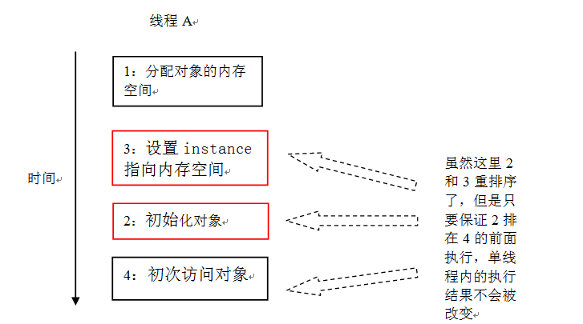
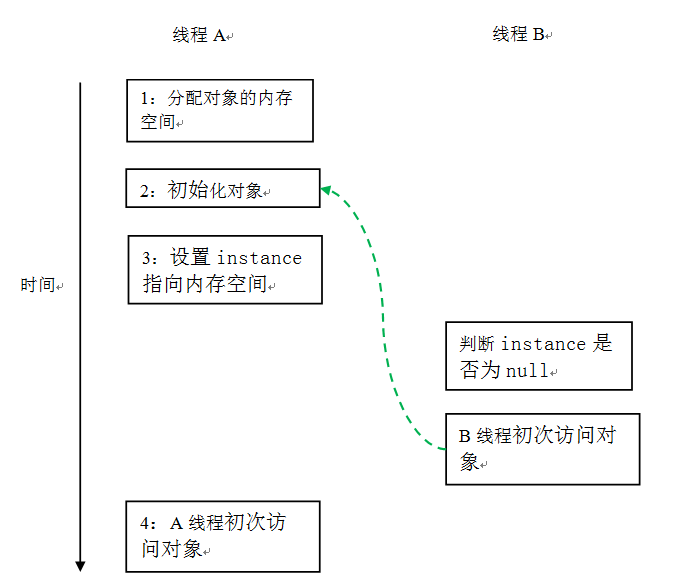
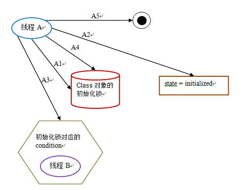
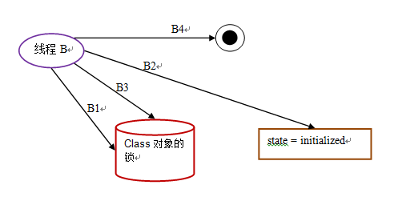
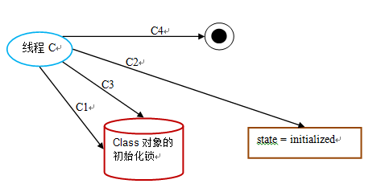

## 介绍

在 java 程序中，有时候可能需要推迟一些高开销的对象初始化操作，并且只有在使用这些对象时才进行初始化。此时程序员可能会采用延迟初始化。但要正确实现线程安全的延迟初始化需要一些技巧，否则很容易出现问题。

1. 比如，下面是非线程安全的延迟初始化对象的示例代码：

```java
public class UnsafeLazyInitialization {
    private static Instance instance;
    
    public static Instance getInstance() {
        if (instance == null) //1：A 线程执行 
        	instance = new Instance(); //2：B 线程执行 
        return instance;
    }
    
}
```

在 UnsafeLazyInitialization 中，假设 A 线程执行代码 1 的同时，B 线程执行代码 2。此时，线程 A 可能会看到 instance 引用的对象还没有完成初始化（出现这种情况的原因见后文的“问题的根源”）。

2. 对于 UnsafeLazyInitialization，我们可以对 getInstance() 做同步处理来实现线程安全的延迟初始化。示例代码如下：

```java
public class SafeLazyInitialization {
    private static Instance instance;

    public synchronized static Instance getInstance() {
        if (instance == null)
            instance = new Instance();
        return instance;
    }
}
```

由于对 getInstance() 做了同步处理，synchronized 将导致性能开销。如果 getInstance() 被多个线程频繁的调用，将会导致程序执行性能的下降。反之，如果 getInstance() 不会被多个线程频繁的调用，那么这个延迟初始化方案将能提供令人满意的性能。

3. 在早期的 JVM 中，synchronized（甚至是无竞争的 synchronized）存在这巨大的性能开销。因此，人们想出了一个“聪明”的技巧：双重检查锁定（double-checked locking）。人们想通过双重检查锁定来降低同步的开销。下面是使用双重检查锁定来实现延迟初始化的示例代码：

```java
public class DoubleCheckedLocking {                 //1
    private static Instance instance;                    //2

    public static Instance getInstance() {               //3
        if (instance == null) {                          //4: 第一次检查 
            synchronized (DoubleCheckedLocking.class) {  //5: 加锁 
                if (instance == null)                    //6: 第二次检查 
                    instance = new Instance();           //7: 问题的根源出在这里 
            }                                            //8
        }                                                //9
        return instance;                                 //10
    }                                                    //11
}                                                        //12
```

如上面代码所示，如果第一次检查 instance 不为 null，那么就不需要执行下面的加锁和初始化操作。因此可以大幅降低 synchronized 带来的性能开销。上面代码表面上看起来，似乎两全其美：

- 在多个线程试图在同一时间创建对象时，会通过加锁来保证只有一个线程能创建对象。
- 在对象创建好之后，执行 getInstance() 将不需要获取锁，直接返回已创建好的对象。

双重检查锁定看起来似乎很完美，但这是一个错误的优化！**在线程执行到第 4 行代码读取到 instance 不为 null 时，instance 引用的对象有可能还没有完成初始化。**

## 问题的根源

前面的双重检查锁定示例代码的第 7 行（instance = new Singleton();）创建一个对象。这一行代码可以分解为如下的三行伪代码：

```java
memory = allocate();   //1：分配对象的内存空间 
ctorInstance(memory);  //2：初始化对象 
instance = memory;     //3：设置 instance 指向刚分配的内存地址
```

上面三行伪代码中的 2 和 3 之间，可能会被重排序（在一些 JIT 编译器上，这种重排序是真实发生的，详情见参考文献 1 的“Out-of-order writes”部分）。2 和 3 之间重排序之后的执行时序如下：

```java
memory = allocate();   //1：分配对象的内存空间 
instance = memory;     //3：设置 instance 指向刚分配的内存地址 
                       // 注意，此时对象还没有被初始化！
ctorInstance(memory);  //2：初始化对象
```

根据《The Java Language Specification, Java SE 7 Edition》（后文简称为 java 语言规范），所有线程在执行 java 程序时必须要遵守 intra-thread semantics。intra-thread semantics 保证重排序不会改变单线程内的程序执行结果。换句话来说，intra-thread semantics 允许那些在单线程内，不会改变单线程程序执行结果的重排序。上面三行伪代码的 2 和 3 之间虽然被重排序了，但这个重排序并不会违反 intra-thread semantics。这个重排序在没有改变单线程程序的执行结果的前提下，可以提高程序的执行性能。

为了更好的理解 intra-thread semantics，请看下面的示意图（假设一个线程 A 在构造对象后，立即访问这个对象）：



如上图所示，只要保证 2 排在 4 的前面，即使 2 和 3 之间重排序了，也不会违反 intra-thread semantics。

下面，再让我们看看多线程并发执行的时候的情况。请看下面的示意图：


由于单线程内要遵守 intra-thread semantics，从而能保证 A 线程的程序执行结果不会被改变。但是当线程 A 和 B 按上图的时序执行时，B 线程将看到一个还没有被初始化的对象。

※注：本文统一用红色的虚箭线标识错误的读操作，用绿色的虚箭线标识正确的读操作。

回到本文的主题，DoubleCheckedLocking 示例代码的第 7 行（instance = new Singleton();）如果发生重排序，另一个并发执行的线程 B 就有可能在第 4 行判断 instance 不为 null。线程 B 接下来将访问 instance 所引用的对象，但此时这个对象可能还没有被 A 线程初始化！下面是这个场景的具体执行时序：

| 时间 | 线程 A                         | 线程 B                                                       |
| ---- | ------------------------------ | ------------------------------------------------------------ |
| t1   | A1：分配对象的内存空间         |                                                              |
| t2   | A3：设置 instance 指向内存空间 |                                                              |
| t3   |                                | B1：判断 instance 是否为空                                   |
| t4   |                                | B2：由于 instance 不为 null，线程 B 将访问 instance 引用的对象 |
| t5   | A2：初始化对象                 |                                                              |
| t6   | A4：访问 instance 引用的对象   |                                                              |

这里 A2 和 A3 虽然重排序了，但 java 内存模型的 intra-thread semantics 将确保 A2 一定会排在 A4 前面执行。因此线程 A 的 intra-thread semantics 没有改变。但 A2 和 A3 的重排序，将导致线程 B 在 B1 处判断出 instance 不为空，线程 B 接下来将访问 instance 引用的对象。此时，线程 B 将会访问到一个还未初始化的对象。

在知晓了问题发生的根源之后，我们可以想出两个办法来实现线程安全的延迟初始化：

1. 不允许 2 和 3 重排序；
2. 允许 2 和 3 重排序，但不允许其他线程“看到”这个重排序。

后文介绍的两个解决方案，分别对应于上面这两点。

## 基于 volatile 的双重检查锁定的解决方案

对于前面的基于双重检查锁定来实现延迟初始化的方案（指 DoubleCheckedLocking 示例代码），我们只需要做一点小的修改（把 instance 声明为 volatile 型），就可以实现线程安全的延迟初始化。请看下面的示例代码：

```java
public class SafeDoubleCheckedLocking {
    private volatile static Instance instance;

    public static Instance getInstance() {
        if (instance == null) {
            synchronized (SafeDoubleCheckedLocking.class) {
                if (instance == null)
                    instance = new Instance();//instance 为 volatile，现在没问题了 
            }
        }
        return instance;
    }
}
```

注意，这个解决方案需要 JDK5 或更高版本（因为从 JDK5 开始使用新的 JSR-133 内存模型规范，这个规范增强了 volatile 的语义）。

当声明对象的引用为 volatile 后，“问题的根源”的三行伪代码中的 2 和 3 之间的重排序，在多线程环境中将会被禁止。上面示例代码将按如下的时序执行：



这个方案本质上是通过禁止上图中的 2 和 3 之间的重排序，来保证线程安全的延迟初始化。

## 基于类初始化的解决方案

JVM 在类的初始化阶段（即在 Class 被加载后，且被线程使用之前），会执行类的初始化。在执行类的初始化期间，JVM 会去获取一个锁。这个锁可以同步多个线程对同一个类的初始化。

基于这个特性，可以实现另一种线程安全的延迟初始化方案（这个方案被称之为 Initialization On Demand Holder idiom）：

```
public class InstanceFactory {
    private static class InstanceHolder {
        public static Instance instance = new Instance();
    }

    public static Instance getInstance() {
        return InstanceHolder.instance ;  // 这里将导致 InstanceHolder 类被初始化 
    }
}
```

假设两个线程并发执行 getInstance()，下面是执行的示意图：


这个方案的实质是：允许“问题的根源”的三行伪代码中的 2 和 3 重排序，但不允许非构造线程（这里指线程 B）“看到”这个重排序。

初始化一个类，包括执行这个类的静态初始化和初始化在这个类中声明的静态字段。根据 java 语言规范，在首次发生下列任意一种情况时，一个类或接口类型 T 将被立即初始化：

- T 是一个类，而且一个 T 类型的实例被创建；
- T 是一个类，且 T 中声明的一个静态方法被调用；
- T 中声明的一个静态字段被赋值；
- T 中声明的一个静态字段被使用，而且这个字段不是一个常量字段；
- T 是一个顶级类（top level class，见 java 语言规范的§7.6），而且一个断言语句嵌套在 T 内部被执行。

在 InstanceFactory 示例代码中，首次执行 getInstance() 的线程将导致 InstanceHolder 类被初始化（符合情况 4）。

由于 java 语言是多线程的，多个线程可能在同一时间尝试去初始化同一个类或接口（比如这里多个线程可能在同一时刻调用 getInstance() 来初始化 InstanceHolder 类）。因此在 java 中初始化一个类或者接口时，需要做细致的同步处理。

Java 语言规范规定，对于每一个类或接口 C，都有一个唯一的初始化锁 LC 与之对应。从 C 到 LC 的映射，由 JVM 的具体实现去自由实现。JVM 在类初始化期间会获取这个初始化锁，并且每个线程至少获取一次锁来确保这个类已经被初始化过了（事实上，java 语言规范允许 JVM 的具体实现在这里做一些优化，见后文的说明）。

对于类或接口的初始化，java 语言规范制定了精巧而复杂的类初始化处理过程。java 初始化一个类或接口的处理过程如下（这里对类初始化处理过程的说明，省略了与本文无关的部分；同时为了更好的说明类初始化过程中的同步处理机制，笔者人为的把类初始化的处理过程分为了五个阶段）：

第一阶段：通过在 Class 对象上同步（即获取 Class 对象的初始化锁），来控制类或接口的初始化。这个获取锁的线程会一直等待，直到当前线程能够获取到这个初始化锁。

假设 Class 对象当前还没有被初始化（初始化状态 state 此时被标记为 state = noInitialization），且有两个线程 A 和 B 试图同时初始化这个 Class 对象。下面是对应的示意图：


下面是这个示意图的说明：

| 时间 | 线程 A                                                       | 线程 B                                                       |
| ---- | ------------------------------------------------------------ | ------------------------------------------------------------ |
| t1   | A1: 尝试获取 Class 对象的初始化锁。这里假设线程 A 获取到了初始化锁 | B1: 尝试获取 Class 对象的初始化锁，由于线程 A 获取到了锁，线程 B 将一直等待获取初始化锁 |
| t2   | A2：线程 A 看到线程还未被初始化（因为读取到 state == noInitialization），线程设置 state = initializing |                                                              |
| t3   | A3：线程 A 释放初始化锁                                      |                                                              |

第二阶段：线程 A 执行类的初始化，同时线程 B 在初始化锁对应的 condition 上等待：


下面是这个示意图的说明：

| 时间 | 线程 A                                           | 线程 B                            |
| ---- | ------------------------------------------------ | --------------------------------- |
| t1   | A1: 执行类的静态初始化和初始化类中声明的静态字段 | B1：获取到初始化锁                |
| t2   |                                                  | B2：读取到 state == initializing  |
| t3   |                                                  | B3：释放初始化锁                  |
| t4   |                                                  | B4：在初始化锁的 condition 中等待 |

第三阶段：线程 A 设置 state = initialized，然后唤醒在 condition 中等待的所有线程：



下面是这个示意图的说明：

| 时间 | 线程 A                                |
| ---- | ------------------------------------- |
| t1   | A1：获取初始化锁                      |
| t2   | A2：设置 state = initialized          |
| t3   | A3：唤醒在 condition 中等待的所有线程 |
| t4   | A4：释放初始化锁                      |
| t5   | A5：线程 A 的初始化处理过程完成       |

第四阶段：线程 B 结束类的初始化处理：



下面是这个示意图的说明：

| 时间 | 线程 B                            |
| ---- | --------------------------------- |
| t1   | B1：获取初始化锁                  |
| t2   | B2：读取到 state == initialized   |
| t3   | B3：释放初始化锁                  |
| t4   | B4：线程 B 的类初始化处理过程完成 |

线程 A 在第二阶段的 A1 执行类的初始化，并在第三阶段的 A4 释放初始化锁；线程 B 在第四阶段的 B1 获取同一个初始化锁，并在第四阶段的 B4 之后才开始访问这个类。根据 java 内存模型规范的锁规则，这里将存在如下的 happens-before 关系：


这个 happens-before 关系将保证：线程 A 执行类的初始化时的写入操作（执行类的静态初始化和初始化类中声明的静态字段），线程 B 一定能看到。

第五阶段：线程 C 执行类的初始化的处理：



下面是这个示意图的说明：

| 时间 | 线程 B                            |
| ---- | --------------------------------- |
| t1   | C1：获取初始化锁                  |
| t2   | C2：读取到 state == initialized   |
| t3   | C3：释放初始化锁                  |
| t4   | C4：线程 C 的类初始化处理过程完成 |

在第三阶段之后，类已经完成了初始化。因此线程 C 在第五阶段的类初始化处理过程相对简单一些（前面的线程 A 和 B 的类初始化处理过程都经历了两次锁获取 - 锁释放，而线程 C 的类初始化处理只需要经历一次锁获取 - 锁释放）。

线程 A 在第二阶段的 A1 执行类的初始化，并在第三阶段的 A4 释放锁；线程 C 在第五阶段的 C1 获取同一个锁，并在在第五阶段的 C4 之后才开始访问这个类。根据 java 内存模型规范的锁规则，这里将存在如下的 happens-before 关系：


这个 happens-before 关系将保证：线程 A 执行类的初始化时的写入操作，线程 C 一定能看到。

※注 1：这里的 condition 和 state 标记是本文虚构出来的。Java 语言规范并没有硬性规定一定要使用 condition 和 state 标记。JVM 的具体实现只要实现类似功能即可。

※注 2：Java 语言规范允许 Java 的具体实现，优化类的初始化处理过程（对这里的第五阶段做优化），具体细节参见 java 语言规范的 12.4.2 章。

通过对比基于 volatile 的双重检查锁定的方案和基于类初始化的方案，我们会发现基于类初始化的方案的实现代码更简洁。但基于 volatile 的双重检查锁定的方案有一个额外的优势：除了可以对静态字段实现延迟初始化外，还可以对实例字段实现延迟初始化。

## 总结

延迟初始化降低了初始化类或创建实例的开销，但增加了访问被延迟初始化的字段的开销。在大多数时候，正常的初始化要优于延迟初始化。如果确实需要对实例字段使用线程安全的延迟初始化，请使用上面介绍的基于 volatile 的延迟初始化的方案；如果确实需要对静态字段使用线程安全的延迟初始化，请使用上面介绍的基于类初始化的方案。

## 参考文献

1. [Double-checked locking and the Singleton pattern](http://www.ibm.com/developerworks/java/library/j-dcl/index.html)
2. [The Java Language Specification, Java SE 7 Edition](http://211.136.10.52/videoplayer/jls7.pdf?ich_u_r_i=65c11c3170e6035516bc2b5112b8d474&ich_s_t_a_r_t=0&ich_e_n_d=0&ich_k_e_y=1345098923751563362465&ich_t_y_p_e=1&ich_d_i_s_k_i_d=2&ich_u_n_i_t=1)
3. [JSR-133: Java Memory Model and Thread Specification](http://www.cs.umd.edu/~pugh/java/memoryModel/jsr133.pdf)
4. [Java Concurrency in Practice](http://www.amazon.com/Java-Concurrency-Practice-Brian-Goetz/dp/0321349601/ref=pd_sim_b_1)
5. [Effective Java (2nd Edition)](http://www.amazon.com/Effective-Java-2nd-Joshua-Bloch/dp/0321356683/ref=sr_11_1?ie=UTF8&qid=1231898916&sr=11-1)
6. [JSR 133 (Java Memory Model) FAQ](http://www.cs.umd.edu/users/pugh/java/memoryModel/jsr-133-faq.html)
7. [The JSR-133 Cookbook for Compiler Writers](http://gee.cs.oswego.edu/dl/jmm/cookbook.html)
8. [Java theory and practice: Fixing the Java Memory Model, Part 2](http://www.ibm.com/developerworks/java/library/j-jtp03304/index.html)