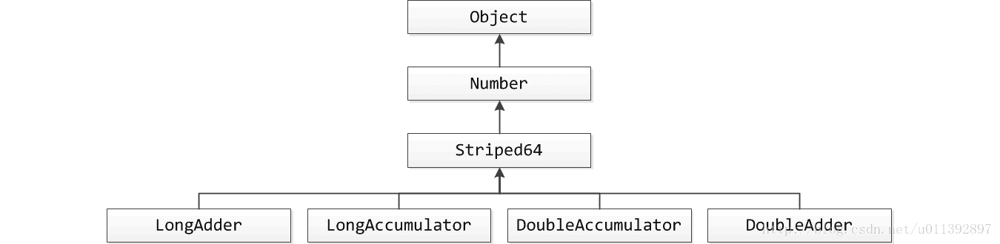
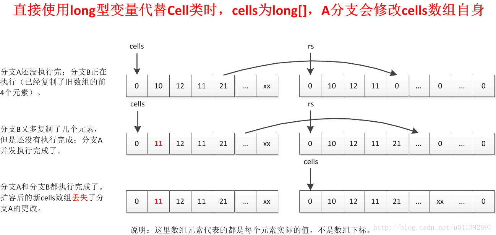
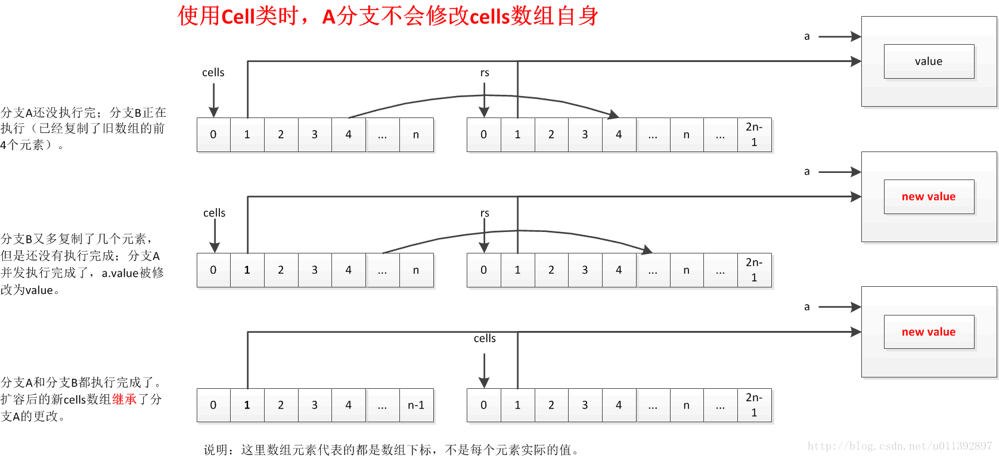

# 介绍

http://blog.csdn.net/javazejian/article/details/72772470
出自【zejian的博客】

关联文章：

> 深入理解Java类型信息(Class对象)与反射机制
>
> 深入理解Java枚举类型(enum)
>
> 深入理解Java注解类型(@Annotation)
>
> 深入理解Java类加载器(ClassLoader)
>
> 深入理解Java并发之synchronized实现原理
>
> Java并发编程-无锁CAS与Unsafe类及其并发包Atomic
>
> 深入理解Java内存模型(JMM)及volatile关键字
>
> 剖析基于并发AQS的重入锁(ReetrantLock)及其Condition实现原理
>
> 剖析基于并发AQS的共享锁的实现(基于信号量Semaphore)
>
> 并发之阻塞队列LinkedBlockingQueue与ArrayBlockingQueue

在前面一篇博文中，我们曾经详谈过有锁并发的典型代表synchronized关键字，通过该关键字可以控制并发执行过程中有且只有一个线程可以访问共享资源，其原理是通过当前线程持有当前对象锁，从而拥有访问权限，而其他没有持有当前对象锁的线程无法拥有访问权限，也就保证了线程安全。但在本篇中，我们将会详聊另外一种**反向而行的并发策略，即无锁并发**，即不加锁也能保证并发执行的安全性。

**思路**

本篇的思路是先阐明无锁执行者CAS的核心算法原理然后分析Java执行CAS的实践者Unsafe类，该类中的方法都是native修饰的，因此我们会以说明方法作用为主介绍Unsafe类，最后再介绍并发包中的Atomic系统使用**CAS原理实现的并发类**，以下是主要内容

# 无锁的概念

在谈论无锁概念时，总会关联起**乐观派与悲观派**，对于乐观派而言，他们认为事情总会往好的方向发展，总是认为坏的情况发生的概率特别小，可以无所顾忌地做事，但对于悲观派而已，他们总会认为发展事态如果不及时控制，以后就无法挽回了，即使无法挽回的局面几乎不可能发生。

这两种派系映射到并发编程中就如同加锁与无锁的策略，即加锁是一种悲观策略，无锁是一种乐观策略，因为对于加锁的并发程序来说，它们总是认为每次访问共享资源时总会发生冲突，因此必须对每一次数据操作实施加锁策略。而无锁则总是假设对共享资源的访问没有冲突，线程可以不停执行，无需加锁，无需等待，**一旦发现冲突，无锁策略则采用一种称为CAS的技术来保证线程执行的安全性**，这项CAS技术就是无锁策略实现的关键，下面我们进一步了解CAS技术的奇妙之处。

# 无锁的执行者-CAS

## CAS

CAS的全称是Compare And Swap 即比较交换，其算法核心思想如下

```java
执行函数：CAS(V,E,N)
```

其包含3个参数

- V表示要更新的变量
- E表示预期值
- N表示新值

如果V值等于E值，则将V的值设为N。若V值和E值不同，则说明已经有其他线程做了更新，则当前线程什么都不做。通俗的理解就是CAS操作需要我们提供一个期望值，当期望值与当前线程的变量值相同时，说明还没线程修改该值，当前线程可以进行修改，也就是执行CAS操作，但如果期望值与当前线程不符，则说明该值已被其他线程修改，此时不执行更新操作，但可以选择重新读取该变量再尝试再次修改该变量，也可以放弃操作，原理图如下


由于CAS操作属于乐观派，它总认为自己可以成功完成操作，当多个线程同时使用CAS操作一个变量时，只有一个会胜出，并成功更新，其余均会失败，但失败的线程并不会被挂起，仅是被告知失败，并且允许再次尝试，当然也允许失败的线d程放弃操作，这点从图中也可以看出来。**基于这样的原理，CAS操作即使没有锁，同样知道其他线程对共享资源操作影响，并执行相应的处理措施。**同时从这点也可以看出，由于无锁操作中没有锁的存在，因此不可能出现死锁的情况，也就是说无锁操作天生免疫死锁。

## CPU指令对CAS的支持

或许我们可能会有这样的疑问，假设存在多个线程执行CAS操作并且CAS的步骤很多，有没有可能在判断V和E相同后，正要赋值时，切换了线程，更改了值。造成了数据不一致呢？答案是否定的，**因为CAS是一种系统原语，原语属于操作系统用语范畴，是由若干条指令组成的，用于完成某个功能的一个过程，并且原语的执行必须是连续的**，在执行过程中不允许被中断，也就是说CAS是一条CPU的原子指令，不会造成所谓的数据不一致问题。

底层也是加锁的，锁总线或者内存地址。

## 问题

待解决：

cas操作缓存还是内存

如果说cas是原子操作，那么怎么会又aba问题。这里矛盾了

#  Unsafe

## 介绍

**鲜为人知的指针类**

Unsafe类存在于`sun.misc`包中，其内部方法操作可以**像C的指针一样直接操作内存**，单从名称看来就可以知道该类是非安全的，毕竟Unsafe拥有着类似于C的指针操作，因此总是不应该首先使用Unsafe类，Java官方也不建议直接使用的Unsafe类，据说Oracle正在计划从Java 9中去掉Unsafe类，但我们还是很有必要了解该类，因为Java中CAS操作的执行依赖于Unsafe类的方法，注意Unsafe类中的所有方法都是native修饰的，也就是说Unsafe类中的方法都直接调用操作系统底层资源执行相应任务，关于Unsafe类的主要功能点如下：


## 方法

### **内存管理**

**Unsafe类中存在直接操作内存的方法**

```java
//分配内存指定大小的内存
public native long allocateMemory(long bytes);
//根据给定的内存地址address设置重新分配指定大d小的内存
public native long reallocateMemory(long address, long bytes);
//用于释放allocateMemory和reallocateMemory申请的内存
public native void freeMemory(long address);
//将指定对象的给定offset偏移量内存块中的所有字节设置为固定值
public native void setMemory(Object o, long offset, long bytes, byte value);
//设置给定内存地址的值
public native void putAddress(long address, long x);
//获取指定内存地址的值
public native long getAddress(long address);

//设置给定内存地址的long值
public native void putLong(long address, long x);
//获取指定内存地址的long值
public native long getLong(long address);
//设置或获取指定内存的byte值
public native byte  getByte(long address);
public native void  putByte(long address, byte x);
//其他基本数据类型(long,char,float,double,short等)的操作与putByte及getByte相同

//操作系统的内存页大小
public native int pageSize();
```

### 创建实例对象

```java
//传入一个对象的class并创建该实例对象，但不会调用构造方法
public native Object allocateInstance(Class cls) throws InstantiationException;
```

### 变量操作

类和实例对象以及变量的操作，主要方法如下

```java
//获取字段f在实例对象中的偏移量
public native long objectFieldOffset(Field f);
//静态属性的偏移量，用于在对应的Class对象中读写静态属性
public native long staticFieldOffset(Field f);
//返回值就是f.getDeclaringClass()
public native Object staticFieldBase(Field f);


//获得给定对象偏移量上的int值，所谓的偏移量可以简单理解为指针指向该变量的内存地址，
//通过偏移量便可得到该对象的域的内存值int，进行各种操作
public native int getInt(Object o, long offset);
//设置给定对象上偏移量的int值
public native void putInt(Object o, long offset, int x);
//其他基本数据类型(long,char,byte,float,double)的操作与getInthe及putInt相同

//获得给定对象偏移量上的引用类型的值
public native Object getObject(Object o, long offset);
//设置给定对象偏移量上的引用类型的值
public native void putObject(Object o, long offset, Object x);


//设置给定对象的int值，使用volatile语义，即设置后立马更新到内存对其他线程可见
public native void  putIntVolatile(Object o, long offset, int x);
//获得给定对象的指定偏移量offset的int值，使用volatile语义，总能获取到最新的int值。
public native int getIntVolatile(Object o, long offset);
//其他基本数据类型(long,char,byte,float,double)的操作与putIntVolatile及getIntVolatile相同，引用类型putObjectVolatile也一样。

/*
	1. 与putIntVolatile一样，但要求被操作字段必须有volatile修饰.
	2. 它能保证写操作的之间的顺序性，立即写回主存，其他线程在写操作时一定能看到这个方法对变量的改变.
	3. 但是不保证能立马被其他线程读取到最新结果，不会使缓存失效。
	4. 是一种lazySet，效率比volatile高，但是只有volatile的“一半”的效果。
	5. 是一种低级别的优化手段，减少不必要的内存屏障，从而提高程序执行的效率。因为有其他锁帮忙解决可见性。https://blog.csdn.net/ITer_ZC/article/details/40744485
	
 	1. 普通的volatile保证写操作的结果能立马被其他线程看到，不论其他线程是读操作还写操作。
	2. 而不加volatile变量的字段，JMM不保证普通变量的修改立刻被所有的线程可见。所以lazySet说白了就是以普通变量的方式来写变量。
*/
public native void putOrderedInt(Object o,long offset,int x);
```

### 例子

下面通过一个简单的Demo来演示上述的一些方法以便加深对Unsafe类的理解

```java
public class UnSafeDemo {

	public static void main(String[] args) throws NoSuchFieldException, IllegalAccessException, InstantiationException {
		// 通过反射得到theUnsafe对应的Field对象
		Field field = Unsafe.class.getDeclaredField("theUnsafe");
		// 设置该Field为可访问
		field.setAccessible(true);
		// 通过Field得到该Field对应的具体对象，传入null是因为该Field为static的
		Unsafe unsafe = (Unsafe) field.get(null);
		System.out.println(unsafe);

		//通过allocateInstance直接创建对象
		User user = (User) unsafe.allocateInstance(User.class);

		Class userClass = user.getClass();
		Field name = userClass.getDeclaredField("name");
		Field age = userClass.getDeclaredField("age");
		Field id = userClass.getDeclaredField("id");

		//获取实例变量name和age在对象内存中的偏移量并设置值
		unsafe.putInt(user, unsafe.objectFieldOffset(age), 18);
		unsafe.putObject(user, unsafe.objectFieldOffset(name), "android TV");

		// 这里返回 User.class，
		Object staticBase = unsafe.staticFieldBase(id);
		System.out.println("staticBase:" + staticBase);

		//获取静态变量id的偏移量staticOffset
		long staticOffset = unsafe.staticFieldOffset(userClass.getDeclaredField("id"));
		//获取静态变量的值
		System..println("设置前的ID:" + unsafe.getObject(staticBase, staticOffset));
		//设置静态变量的值,和对象不一样
		unsafe.putObject(staticBase, staticOffset, "SSSSSSSS");
		//获取静态变量的值
		System.out.println("设置前的ID:" + unsafe.getObject(staticBase, staticOffset));
		//输出USER
		System.out.println("输出USER:" + user.toString());

		long data = 1000;
		byte size = 1;//单位字节

		//调用allocateMemory分配内存,并获取内存地址memoryAddress
		long memoryAddress = unsafe.allocateMemory(size);
		//直接往内存写入数据
		unsafe.putAddress(memoryAddress, data);
		//获取指定内存地址的数据
		long addrData = unsafe.getAddress(memoryAddress);
		System.out.println("addrData:" + addrData);

		/**
		 * 输出结果:
		 sun.misc.Unsafe@6f94fa3e
		 staticBase:class geym.conc.ch4.atomic.User
		 设置前的ID:USER_ID
		 设置前的ID:SSSSSSSS
		 输出USER:User{name='android TV', age=18', id=SSSSSSSS'}
		 addrData:1000
		 */

		//我加的，unsafe指针的方式操纵指针
		int[] ints = new int[119];
		Class<? extends int[]> arrayClass = ints.getClass();
		int scale = unsafe.arrayIndexScale(arrayClass);
		long baseOffset = unsafe.arrayBaseOffset(arrayClass);
		unsafe.putInt(ints, baseOffset + scale *2, 100);//不是putObject(...)，需要使用long
		System.out.println(ints);//ints[2] = 100
	}

	static class User {
		public User() {
			System.out.println("user 构造方法被调用");
		}

		private String name;
		private int age;
		private static String id = "USER_ID";

		@Override
		public String toString() {
			return "User{" +
					"name='" + name + '\'' +
					", age=" + age + '\'' +
					", id=" + id + '\'' +
					'}';
		}
	}
}
```

虽然在Unsafe类中存在getUnsafe()方法，但该方法只提供给高级的Bootstrap类加载器使用，普通用户调用将抛出异常，所以我们在Demo中使用了反射技术获取了Unsafe实例对象并进行相关操作。

```java
public static Unsafe getUnsafe() {
      Class cc = sun.reflect.Reflection.getCallerClass(2);
      if (cc.getClassLoader() != null)
          throw new SecurityException("Unsafe");
      return theUnsafe;
  }
```

### 数组操作

```java
//获取数组第一个元素的偏移地址
public native int arrayBaseOffset(Class arrayClass);
//数组中一个元素占据的内存空间，arrayBaseOffset与arrayIndexScale配合使用，可定位数组中每个元素在内存中的位置
public native int arrayIndexScale(Class arrayClass);
```

### CAS 操作相关

CAS是一些CPU直接支持的指令，也就是我们前面分析的无锁操作，在Java中无锁操作CAS基于以下3个方法实现，在稍后讲解Atomic系列内部方法是基于下述方法的实现的。

```java
//第一个参数o为给定对象，offset为对象内存的偏移量，通过这个偏移量迅速定位字段并设置或获取该字段的值，
//expected表示期望值，x表示要设置的值，下面3个方法都通过CAS原子指令执行操作。
public final native boolean compareAndSwapObject(Object o, long offset,Object expected, Object x);

public final native boolean compareAndSwapInt(Object o, long offset,int expected,int x);

public final native boolean compareAndSwapLong(Object o, long offset,long expected,long x);
```


  这里还需介绍Unsafe类中JDK 1.8新增的几个方法，它们的实现是基于上述的CAS方法，如下

```java
  
   //1.8新增，给定对象o，根据获取内存偏移量指向的字段，将其增加delta，
   //这是一个CAS操作过程，直到设置成功方能退出循环，返回旧值
   public final int getAndAddInt(Object o, long offset, int delta) {
       int v;
       do {
           //获取内存中最新值
           v = getIntVolatile(o, offset);
         //通过CAS操作
       } while (!compareAndSwapInt(o, offset, v, v + delta));
       return v;
   }
  
  //1.8新增，方法作用同上，只不过这里操作的long类型数据
   public final long getAndAddLong(Object o, long offset, long delta) {
       long v;
       do {
           v = getLongVolatile(o, offset);
       } while (!compareAndSwapLong(o, offset, v, v + delta));
       return v;
   }
  
   //1.8新增，给定对象o，根据获取内存偏移量对于字段，将其 设置为新值newValue，
   //这是一个CAS操作过程，直到设置成功方能退出循环，返回旧值
   public final int getAndSetInt(Object o, long offset, int newValue) {
       int v;
       do {
           v = getIntVolatile(o, offset);
       } while (!compareAndSwapInt(o, offset, v, newValue));
       return v;
   }
  
  // 1.8新增，同上，操作的是long类型
   public final long getAndSetLong(Object o, long offset, long newValue) {
       long v;
       do {
           v = getLongVolatile(o, offset);
       } while (!compareAndSwapLong(o, offset, v, newValue));
       return v;
   }
  
   //1.8新增，同上，操作的是引用类型数据
   public final Object getAndSetObject(Object o, long offset, Object newValue) {
       Object v;
       do {
           v = getObjectVolatile(o, offset);
       } while (!compareAndSwapObject(o, offset, v, newValue));
       return v;
   }
```

  上述的方法我们在稍后的Atomic系列分析中还会见到它们的身影。

### 线程挂起与恢复

将一个线程进行挂起是通过park方法实现的，调用 park后，线程将一直阻塞直到超时或者中断等条件出现。unpark可以终止一个挂起的线程，使其恢复正常。Java对线程的挂起操作被封装在 LockSupport类中，LockSupport类中有各种版本pack方法，其底层实现最终还是使用Unsafe.park()方法和Unsafe.unpark()方法

```java
//线程调用该方法，线程将一直阻塞直到超时，或者是中断条件出现。  
public native void park(boolean isAbsolute, long time);  

//终止挂起的线程，恢复正常.java.util.concurrent包中挂起操作都是在LockSupport类实现的，其底层正是使用这两个方法，  
public native void unpark(Object thread); 
```

### 内存屏障

这里主要包括了loadFence、storeFence、fullFence等方法，这些方法是在Java 8新引入的，用于定义内存屏障，避免代码重排序，与Java内存模型相关，感兴趣的可以看博主的另一篇博文全面理解Java内存模型(JMM)及volatile关键字，这里就不展开了

```java
//在该方法之前的所有读操作，一定在load屏障之前执行完成
public native void loadFence();
//在该方法之前的所有写操作，一定在store屏障之前执行完成
public native void storeFence();
//在该方法之前的所有读写操作，一定在full屏障之前执行完成，这个内存屏障相当于上面两个的合体功能
public native void fullFence();
```

### 其他操作

```java
//获取持有锁，已不建议使用
@Deprecated
public native void monitorEnter(Object var1);
//释放锁，已不建议使用
@Deprecated
public native void monitorExit(Object var1);
//尝试获取锁，已不建议使用
@Deprecated
public native boolean tryMonitorEnter(Object var1);

//获取本机内存的页数，这个值永远都是2的幂次方  
public native int pageSize();  

//告诉虚拟机定义了一个没有安全检查的类，默认情况下这个类加载器和保护域来着调用者类  
public native Class defineClass(String name, byte[] b, int off, int len, ClassLoader loader, ProtectionDomain protectionDomain);  

//加载一个匿名类
public native Class defineAnonymousClass(Class hostClass, byte[] data, Object[] cpPatches);
//判断是否需要加载一个类
public native boolean shouldBeInitialized(Class<?> c);
//确保类一定被加载 
public native  void ensureClassInitialized(Class<?> c)
```

## 参考文献

[Java魔法类：Unsafe应用解析](https://tech.meituan.com/2019/02/14/talk-about-java-magic-class-unsafe.html)

[Java中Unsafe类详解](https://www.cnblogs.com/mickole/articles/3757278.html)

> 已保存图片

# Atomic系列

## 介绍

**并发包中的原子操作类**

通过前面的分析我们已基本理解了无锁CAS的原理并对Java中的指针类Unsafe类有了比较全面的认识，下面进一步分析CAS在Java中的应用，即并发包中的原子操作类(Atomic系列)，从JDK 1.5开始提供了`java.util.concurrent.atomic`包，在该包中提供了许多基于CAS实现的原子操作类，用法方便，性能高效，主要分以下4种类型。

**整个包的本质：get和update两个单独的原子操作变成合成原子，保证update前的数据是get的数据**

## 原子更新基本类型

### 介绍

原子更新基本类型主要包括3个类：

- AtomicBoolean：原子更新布尔类型

- AtomicInteger：原子更新整型

- AtomicLong：原子更新长整型

这3个类的实现原理和使用方式几乎是一样的，这里我们以AtomicInteger为例进行分析，AtomicInteger主要是针对int类型的数据执行原子操作，它提供了原子自增方法、原子自减方法以及原子赋值方法等，鉴于AtomicInteger的源码不多，我们直接看源码


### 源码

```java
public class AtomicInteger extends Number implements java.io.Serializable {
    private static final long serialVersionUID = 6214790243416807050L;

    // 获取指针类Unsafe
    private static final Unsafe unsafe = Unsafe.getUnsafe();

    //下述变量value在AtomicInteger实例对象内的内存偏移量
    private static final long valueOffset; 

    static {
        try {
           //通过unsafe类的objectFieldOffset()方法，获取value变量在对象内存中的偏移
           //通过该偏移量valueOffset，unsafe类的内部方法可以获取到变量value对其进行取值或赋值操作
            valueOffset = unsafe.objectFieldOffset
                (AtomicInteger.class.getDeclaredField("value"));
        } catch (Exception ex) { throw new Error(ex); }
    }
   //当前AtomicInteger封装的int变量value，使用volatile是很有必要的，保持可见性和读写操作的原子性
    private volatile int value;

    public AtomicInteger(int initialValue) {
        value = initialValue;
    }
    public AtomicInteger() {
    }
   //获取当前最新值，
    public final int get() {
        return value;
    }
    //设置当前值，具备volatile效果，方法用final修饰是为了更进一步的保证线程安全。
    public final void set(int newValue) {
        value = newValue;
    }
    //最终会设置成newValue，使用该方法后可能导致其他线程在之后的一小段时间内可以获取到旧值，有点类似于延迟加载
    public final void lazySet(int newValue) {
        unsafe.putOrderedInt(this, valueOffset, newValue);
    }
   //设置新值并获取旧值，底层调用的是CAS操作即unsafe.compareAndSwapInt()方法
    public final int getAndSet(int newValue) {
        return unsafe.getAndSetInt(this, valueOffset, newValue);
    }
   //如果当前值为expect，则设置为update(当前值指的是value变量)
    public final boolean compareAndSet(int expect, int update) {
        return unsafe.compareAndSwapInt(this, valueOffset, expect, update);
    }
    //当前值加1返回旧值，底层CAS操作
    public final int getAndIncrement() {
        return unsafe.getAndAddInt(this, valueOffset, 1);
    }
    //当前值减1，返回旧值，底层CAS操作
    public final int getAndDecrement() {
        return unsafe.getAndAddInt(this, valueOffset, -1);
    }
   //当前值增加delta，返回旧值，底层CAS操作
    public final int getAndAdd(int delta) {
        return unsafe.getAndAddInt(this, valueOffset, delta);
    }
    //当前值加1，返回新值，底层CAS操作
    public final int incrementAndGet() {
        return unsafe.getAndAddInt(this, valueOffset, 1) + 1;
    }
    //当前值减1，返回新值，底层CAS操作
    public final int decrementAndGet() {
        return unsafe.getAndAddInt(this, valueOffset, -1) - 1;
    }
   //当前值增加delta，返回新值，底层CAS操作
    public final int addAndGet(int delta) {
        return unsafe.getAndAddInt(this, valueOffset, delta) + delta;
    }
   //省略一些不常用的方法....
}
```

通过上述的分析，可以发现AtomicInteger原子类的内部几乎是基于前面分析过Unsafe类中的CAS相关操作的方法实现的，这也同时证明AtomicInteger是基于无锁实现的。

### incrementAndGet

这里重点分析自增操作实现过程，其他方法自增实现原理一样。

```java
//当前值加1，返回新值，底层CAS操作
public final int incrementAndGet() {
     return unsafe.getAndAddInt(this, valueOffset, 1) + 1;
 }
```


我们发现`AtomicInteger`类中所有自增或自减的方法都间接调用Unsafe类中的`getAndAddInt()`方法实现了CAS操作，从而保证了线程安全，关于`getAndAddInt()`其实前面已分析过，它是Unsafe类中1.8新增的方法，源码如下

```java
//Unsafe类中的getAndAddInt方法
public final int getAndAddInt(Object o, long offset, int delta) {
        int v;
        do {
            v = getIntVolatile(o, offset);//必须是每次从主存拿到最新的值，volatile
        } while (!compareAndSwapInt(o, offset, v, v + delta));//这里底层是锁机制，但不能避免aba问题（5、6行代码之间）
        return v;
    }
```

可看出`getAndAddInt`**通过一个while循环不断的重试更新要设置的值，直到成功为止**，调用的是Unsafe类中的`compareAndSwapInt`方法，是一个CAS操作方法。这里需要注意的是，上述源码分析是基于JDK1.8的，如果是1.8之前的方法，AtomicInteger源码实现有所不同，是基于for死循环的，如下

```java
//JDK 1.7的源码，由for的死循环实现，并且直接在AtomicInteger实现该方法，
//JDK1.8后，该方法实现已移动到Unsafe类中，直接调用getAndAddInt方法即可
public final int incrementAndGet() {
    for (;;) {
        int current = get();
        int next = current + 1;
        if (compareAndSet(current, next))
            return next;
    }
}
```

### 例子

ok~,下面简单看个Demo，感受一下AtomicInteger使用方式

```java
public class AtomicIntegerDemo {
    //创建AtomicInteger,用于自增操作
    static AtomicInteger i=new AtomicInteger();

    public static class AddThread implements Runnable{
        public void run(){
           for(int k=0;k<10000;k++)
               i.incrementAndGet();
        }

    }
    public static void main(String[] args) throws InterruptedException {
        Thread[] ts=new Thread[10];
        //开启10条线程同时执行i的自增操作
        for(int k=0;k<10;k++){
            ts[k]=new Thread(new AddThread());
        }
        //启动线程
        for(int k=0;k<10;k++){ts[k].start();}

        //等待线程结束
        for(int k=0;k<10;k++){ts[k].join();}

        System.out.println(i);//输出结果:100000
    }
}
```

在Demo中，使用原子类型AtomicInteger替换普通int类型执行自增的原子操作，保证了线程安全。至于AtomicBoolean和AtomicLong的使用方式以及实现原理是一样，大家可以自行查阅源码。

## 原子更新引用

### 例子

原子更新引用类型可以同时更新引用类型，这里主要分析一下AtomicReference原子类，即原子更新引用类型。先看看其使用方式，如下

```java
//引用拿到和更新的合并原子操作，比较鸡肋啊，通常不需要改变引用变量的指向 --我的评价
public class AtomicReferenceDemo2 {
	//其他线程有可能随时修改
	static User user = new User("zejian", 18);

	public static AtomicReference<User> atomicUserRef = new AtomicReference<User>();

	public static void main(String[] args) throws InterruptedException {
		atomicUserRef.set(user);//new的时候设置value，也可以现在set更改
		User updateUser = new User("Shine", 25);

		//其他线程随时可能修改user的变量
		new Thread(new Runnable() {
			@Override
			public void run() {
				AtomicReferenceDemo2.user = null;
			}
		}).start();

		Thread.sleep(1000);//执行结果:User{name='zejian', age=18},注释结果：User{name='Shine', age=25}

		atomicUserRef.compareAndSet(user, updateUser);
		System.out.println(atomicUserRef.get().toString());
	}

	static class User {
		public String name;
		private int age;

		public User(String name, int age) {
			this.name = name;
			this.age = age;
		}

		public String getName() {
			return name;
		}

		@Override
		public String toString() {
			return "User{" +
					"name='" + name + '\'' +
					", age=" + age +
					'}';
		}
	}
}
```

### 源码

那么AtomicReference原子类内部是如何实现CAS操作的呢？

```java
public class AtomicReference<V> implements java.io.Serializable {
    private static final Unsafe unsafe = Unsafe.getUnsafe();
    private static final long valueOffset;

    static {
        try {
            valueOffset = unsafe.objectFieldOffset
                (AtomicReference.class.getDeclaredField("value"));
        } catch (Exception ex) { throw new Error(ex); }
    }
    //内部变量value，Unsafe类通过valueOffset内存偏移量即可获取该变量
    private volatile V value;

    //CAS方法，间接调用unsafe.compareAndSwapObject(),它是一个
    //实现了CAS操作的native方法
    public final boolean compareAndSet(V expect, V update) {
            return unsafe.compareAndSwapObject(this, valueOffset, expect, update);
    }

    //设置并获取旧值
    public final V getAndSet(V newValue) {
            return (V)unsafe.getAndSetObject(this, valueOffset, newValue);
        }
        //省略其他代码......
    }

    //Unsafe类中的getAndSetObject方法，实际调用还是CAS操作
    public final Object getAndSetObject(Object o, long offset, Object newValue) {
          Object v;
          do {
              v = getObjectVolatile(o, offset);
          } while (!compareAndSwapObject(o, offset, v, newValue));
          return v;
      }
```

从源码看来，AtomicReference与AtomicInteger的实现原理基本是一样的，最终执行的还是Unsafe类，关于AtomicReference的其他方法也是一样的，如下


红框内的方法是Java8新增的，可以基于Lambda表达式对传递进来的期望值或要更新的值进行其他操作后再进行CAS操作，说白了就是对期望值或要更新的值进行额外修改后再执行CAS更新，在所有的Atomic原子类中几乎都存在这几个方法。


## 原子更新数组

### 介绍

原子更新数组指的是通过原子的方式更新数组里的某个元素，主要有以下3个类

- AtomicIntegerArray：原子更新整数数组里的元素
- AtomicLongArray：原子更新长整数数组里的元素
- AtomicReferenceArray：原子更新引用类型数组里的元素

这里以AtomicIntegerArray为例进行分析，其余两个使用方式和实现原理基本一样，简单案例如下，

```java
public class AtomicIntegerArrayDemo {
    static AtomicIntegerArray arr = new AtomicIntegerArray(10);

    public static class AddThread implements Runnable{
        public void run(){
           for(int k=0;k<10000;k++)
               //执行数组中元素自增操作,参数为index,即数组下标
               arr.getAndIncrement(k%arr.length());
        }
    }
    public static void main(String[] args) throws InterruptedException {

        Thread[] ts=new Thread[10];
        //创建10条线程
        for(int k=0;k<10;k++){
            ts[k]=new Thread(new AddThread());
        }
        //启动10条线程
        for(int k=0;k<10;k++){ts[k].start();}
        for(int k=0;k<10;k++){ts[k].join();}
        //执行结果
        //[10000, 10000, 10000, 10000, 10000, 10000, 10000, 10000, 10000, 10000]
        System.out.println(arr);
    }
}
```

启动10条线程对数组中的元素进行自增操作，执行结果符合预期。使用方式比较简单，

### 源码

接着看看AtomicIntegerArray内部是如何实现，先看看部分源码

```java
public class AtomicIntegerArray implements java.io.Serializable {
    //获取unsafe类的实例对象
    private static final Unsafe unsafe = Unsafe.getUnsafe();
    //获取数组的第一个元素内存起始地址
    private static final int base = unsafe.arrayBaseOffset(int[].class);

    private static final int shift;
    //内部数组
    private final int[] array;

    static {
        //获取数组中一个元素占据的内存空间
        int scale = unsafe.arrayIndexScale(int[].class);
        //判断是否为2的次幂，一般为2的次幂否则抛异常
        if ((scale & (scale - 1)) != 0)
            throw new Error("data type scale not a power of two");
        //
        shift = 31 - Integer.numberOfLeadingZeros(scale);
    }

    private long checkedByteOffset(int i) {
        if (i < 0 || i >= array.length)
            throw new IndexOutOfBoundsException("index " + i);

        return byteOffset(i);
    }
    //计算数组中每个元素的的内存地址
    private static long byteOffset(int i) {
        return ((long) i << shift) + base;
    }
    //省略其他代码......
}
```

通过前面对Unsafe类的分析，我们知道arrayBaseOffset方法可以获取数组的第一个元素起始地址，而arrayIndexScale方法可以获取每个数组元素占用的内存空间，由于这里是Int类型，而Java中一个int类型占用4个字节，也就是scale的值为4，那么如何根据数组下标值计算每个元素的内存地址呢？显然应该是

> 每个数组元素的内存地址=起始地址+元素下标 * 每个元素所占用的内存空间

与该方法原理相同

```java
//计算数组中每个元素的的内存地址
private static long byteOffset(int i) {
     return ((long) i << shift) + base;
 }
```

这是为什么，首先来计算出shift的值

```java
 shift = 31 - Integer.numberOfLeadingZeros(scale);
```

其中Integer.numberOfLeadingZeros(scale)是计算出scale的前导零个数(必须是连续的)，scale=4，转成二进制为
`00000000 00000000 00000000 00000100`
即前导零数为29，也就是shift=2，然后利用shift来定位数组中的内存位置，在数组不越界时，计算出前3个数组元素内存地址

```java
//第一个数组元素，index=0 ， 其中base为起始地址，4代表int类型占用的字节数 
address = base + 0 * 4 即address= base + 0 << 2
//第二个数组元素，index=1
address = base + 1 * 4 即address= base + 1 << 2
//第三个数组元素，index=2
address = base + 2 * 4 即address= base + 2 << 2
//........
```


显然shift=2，替换去就是

```java
address= base + i << shift
```

这就是 byteOffset(int i) 方法的计算原理。因此byteOffset(int)方法可以根据数组下标计算出每个元素的内存地址。至于其他方法就比较简单了，都是间接调用Unsafe类的CAS原子操作方法，如下简单看其中几个常用方法

```java
//执行自增操作，返回旧值，i是指数组元素下标
public final int getAndIncrement(int i) {
      return getAndAdd(i, 1);
}
//指定下标元素执行自增操作，并返回新值
public final int incrementAndGet(int i) {
    return getAndAdd(i, 1) + 1;
}

//指定下标元素执行自减操作，并返回新值
public final int decrementAndGet(int i) {
    return getAndAdd(i, -1) - 1;
}
//间接调用unsafe.getAndAddInt()方法
public final int getAndAdd(int i, int delta) {
    return unsafe.getAndAddInt(array, checkedByteOffset(i), delta);
}

//Unsafe类中的getAndAddInt方法，执行CAS操作
public final int getAndAddInt(Object o, long offset, int delta) {
        int v;
        do {
            v = getIntVolatile(o, offset);
        } while (!compareAndSwapInt(o, offset, v, v + delta));
        return v;
    }
```


至于AtomicLongArray和AtomicReferenceArray原子类，使用方式和实现原理基本一样。

## 原子更新属性

### 介绍

如果我们只需要某个类里的某个字段，也就是说让普通的变量也享受原子操作，可以使用原子更新字段类，如在某些时候由于项目前期考虑不周全，项目需求又发生变化，使得某个类中的变量需要执行多线程操作，由于该变量多处使用，改动起来比较麻烦，而且原来使用的地方无需使用线程安全，只要求新场景需要使用时，可以借助原子更新器处理这种场景，Atomic并发包提供了以下三个类：

- AtomicIntegerFieldUpdater：原子更新整型的字段的更新器
- AtomicLongFieldUpdater：原子更新长整型字段的更新器。
- AtomicReferenceFieldUpdater：原子更新引用类型里的字段。

请注意原子更新器的使用存在比较苛刻的条件如下

- 操作的字段不能是static类型。


- 操作的字段不能是final类型的，因为final根本没法修改。


- 字段必须是volatile修饰的，也就是数据本身是读一致的。


- 属性必须对当前的Updater所在的区域是可见的，如果不是当前类内部进行原子更新器操作不能使用private，protected子类操作父类时修饰符必须是protect权限及以上，如果在同一个package下则必须是default权限及以上，也就是说无论何时都应该保证操作类与被操作类间的可见性。

**可以极大地节约内存**，对象头+指针引用+数据大小，前两者可以取消。

[一直使用AtomicInteger？试一试FiledUpdater](https://zhuanlan.zhihu.com/p/85890273)

### 例子

下面看看AtomicIntegerFieldUpdater和AtomicReferenceFieldUpdater的简单使用方式

```java
public class AtomicIntegerFieldUpdaterDemo {
    public static class Candidate{
        int id;
        volatile int score;
    }

    public static class Game{
        int id;
        volatile String name;

        public Game(int id, String name) {
            this.id = id;
            this.name = name;
        }

        @Override
        public String toString() {
            return "Game{" +
                    "id=" + id +
                    ", name='" + name + '\'' +
                    '}';
        }
    }

    static AtomicIntegerFieldUpdater<Candidate> atIntegerUpdater
        = AtomicIntegerFieldUpdater.newUpdater(Candidate.class, "score");

    static AtomicReferenceFieldUpdater<Game,String> atRefUpdate =
            AtomicReferenceFieldUpdater.newUpdater(Game.class,String.class,"name");


    //用于验证分数是否正确
    public static AtomicInteger allScore=new AtomicInteger(0);


    public static void main(String[] args) throws InterruptedException {
        final Candidate stu=new Candidate();
        Thread[] t=new Thread[10000];
        //开启10000个线程
        for(int i = 0 ; i < 10000 ; i++) {
            t[i]=new Thread() {
                public void run() {
                    if(Math.random()>0.4){
                        atIntegerUpdater.incrementAndGet(stu);
                        allScore.incrementAndGet();
                    }
                }
            };
            t[i].start();
        }

        for(int i = 0 ; i < 10000 ; i++) {  t[i].join();}
        System.out.println("最终分数score="+stu.score);
        System.out.println("校验分数allScore="+allScore);

        //AtomicReferenceFieldUpdater 简单的使用
        Game game = new Game(2,"zh");
        atRefUpdate.compareAndSet(game,game.name,"JAVA-HHH");
        System.out.println(game.toString());

        /**
         * 输出结果:
         * 最终分数score=5976
           校验分数allScore=5976
           Game{id=2, name='JAVA-HHH'}
         */
    }
}

```

我们使用AtomicIntegerFieldUpdater更新候选人(Candidate)的分数score，开启了10000条线程投票，当随机值大于0.4时算一票，分数自增一次，其中allScore用于验证分数是否正确(其实用于验证AtomicIntegerFieldUpdater更新的字段是否线程安全)，当allScore与score相同时，则说明投票结果无误，也代表AtomicIntegerFieldUpdater能正确更新字段score的值，是线程安全的。

对于AtomicReferenceFieldUpdater，我们在代码中简单演示了其使用方式，注意在AtomicReferenceFieldUpdater注明泛型时需要两个泛型参数，一个是修改的类类型，一个修改字段的类型。

至于AtomicLongFieldUpdater则与AtomicIntegerFieldUpdater类似，不再介绍。

### 原理

接着简单了解一下AtomicIntegerFieldUpdater的实现原理，实际就是反射和Unsafe类结合，AtomicIntegerFieldUpdater是个抽象类，实际实现类为AtomicIntegerFieldUpdaterImpl

```java
public abstract class AtomicIntegerFieldUpdater<T> {

    public static <U> AtomicIntegerFieldUpdater<U> newUpdater(Class<U> tclass,
                                                              String fieldName) {
         //实际实现类AtomicIntegerFieldUpdaterImpl                                          
        return new AtomicIntegerFieldUpdaterImpl<U>
            (tclass, fieldName, Reflection.getCallerClass());
    }
 }
```

看看AtomicIntegerFieldUpdaterImpl

```java
 private static class AtomicIntegerFieldUpdaterImpl<T>
            extends AtomicIntegerFieldUpdater<T> {
        private static final Unsafe unsafe = Unsafe.getUnsafe();
        private final long offset;//内存偏移量
        private final Class<T> tclass;
        private final Class<?> cclass;

        AtomicIntegerFieldUpdaterImpl(final Class<T> tclass,
                                      final String fieldName,
                                      final Class<?> caller) {
            final Field field;//要修改的字段
            final int modifiers;//字段修饰符
            try {
                field = AccessController.doPrivileged(
                    new PrivilegedExceptionAction<Field>() {
                        public Field run() throws NoSuchFieldException {
                            return tclass.getDeclaredField(fieldName);//反射获取字段对象
                        }
                    });
                    //获取字段修饰符
                modifiers = field.getModifiers();
            //对字段的访问权限进行检查,不在访问范围内抛异常
                sun.reflect.misc.ReflectUtil.ensureMemberAccess(
                    caller, tclass, null, modifiers);
                ClassLoader cl = tclass.getClassLoader();
                ClassLoader ccl = caller.getClassLoader();
                if ((ccl != null) && (ccl != cl) &&
                    ((cl == null) || !isAncestor(cl, ccl))) {
              sun.reflect.misc.ReflectUtil.checkPackageAccess(tclass);
                }
            } catch (PrivilegedActionException pae) {
                throw new RuntimeException(pae.getException());
            } catch (Exception ex) {
                throw new RuntimeException(ex);
            }

            Class<?> fieldt = field.getType();
            //判断是否为int类型
            if (fieldt != int.class)
                throw new IllegalArgumentException("Must be integer type");
            //判断是否被volatile修饰
            if (!Modifier.isVolatile(modifiers))
                throw new IllegalArgumentException("Must be volatile type");

            this.cclass = (Modifier.isProtected(modifiers) &&
                           caller != tclass) ? caller : null;
            this.tclass = tclass;
            //获取该字段的在对象内存的偏移量，通过内存偏移量可以获取或者修改该字段的值
            offset = unsafe.objectFieldOffset(field);
        }
        }
```

从AtomicIntegerFieldUpdaterImpl的构造器也可以看出更新器为什么会有这么多限制条件了，当然最终其CAS操作肯定是通过unsafe完成的，简单看一个方法

```java
public int incrementAndGet(T obj) {
        int prev, next;
        do {
            prev = get(obj);
            next = prev + 1;
            //CAS操作
        } while (!compareAndSet(obj, prev, next));
        return next;
}

//最终调用的还是unsafe.compareAndSwapInt()方法
public boolean compareAndSet(T obj, int expect, int update) {
            if (obj == null || obj.getClass() != tclass || cclass != null) fullCheck(obj);
            return unsafe.compareAndSwapInt(obj, offset, expect, update);
        }
```

## 并发计数器

[LongAdder](https://blog.csdn.net/qincidong/article/details/82526550)

[LongAdder原理分析](https://blog.csdn.net/u011392897/article/details/60480108)

[LongAdder与AtomicLong性能对比测试](https://blog.csdn.net/li396864285/article/details/78246357)

### 介绍

LongAdder是jdk8新增的用于并发环境的计数器，目的是为了在高并发情况下，代替AtomicLong/AtomicInt，成为一个用于高并发情况下的高效的通用计数器。
高并发下计数，一般最先想到的应该是AtomicLong/AtomicInt，AtmoicXXX使用硬件级别的指令 CAS 来更新计数器的值，这样可以避免加锁，机器直接支持的指令，效率也很高。但是AtomicXXX中的 CAS 操作在出现线程竞争时，失败的线程会白白地循环一次，在并发很大的情况下，因为每次CAS都只有一个线程能成功，竞争失败的线程会非常多。失败次数越多，循环次数就越多，很多线程的CAS操作越来越接近 自旋锁（spin lock）。计数操作本来是一个很简单的操作，实际需要耗费的cpu时间应该是越少越好，AtomicXXX在高并发计数时，大量的cpu时间都浪费会在 自旋 上了，这很浪费，也降低了实际的计数效率。

```java
// jdk1.8的AtomicLong的实现代码，这段代码在sun.misc.Unsafe中
// 当线程竞争很激烈时，while判断条件中的CAS会连续多次返回false，这样就会造成无用的循环，循环中读取volatile变量的开销本来就是比较高的
// 因为这样，在高并发时，AtomicXXX并不是那么理想的计数方式
public final long getAndAddLong(Object o, long offset, long delta) {
    long v;
    do {
        v = getLongVolatile(o, offset);
    } while (!compareAndSwapLong(o, offset, v, v + delta));
    return v;
}
```

- 说LongAdder比在高并发时比AtomicLong更高效，这么说有什么依据呢？

  LongAdder是根据ConcurrentHashMap这类为并发设计的类的基本原理——锁分段，来实现的，它里面**维护一组按需分配的计数单元，并发计数时，不同的线程可以在不同的计数单元上进行计数，这样减少了线程竞争**，提高了并发效率。本质上是用空间换时间的思想，不过在实际高并发情况中消耗的空间可以忽略不计。

  现在，**在处理高并发计数时，应该优先使用LongAdder，而不是继续使用AtomicLong。**当然，线程竞争很低的情况下进行计数，使用Atomic还是更简单更直接，并且效率稍微高一些。
  其他情况，比如序号生成，这种情况下需要准确的数值，全局唯一的AtomicLong才是正确的选择，此时不应该使用LongAdder。

下面简要分析下LongAdder的源码，有了ConcurrentHashMap（LongAdder比较像1.6和1.7的，可以看下1.7的）的基础，这个类的源码看起来也不复杂。

### 一、类的关系



公共父类Striped64是实现中的核心，它实现一些核心操作，处理64位数据，很容易就能转化为其他基本类型，是个通用的类。

二元算术运算累积，指的是你可以给它提供一个二元算术方式，这个类按照你提供的方式进行算术计算，并保存计算结果。二元运算中第一个操作数是累积器中某个计数单元当前的值，另外一个值是外部提供的。
举几个例子：
假设每次操作都需要把原来的数值加上某个值，那么二元运算为 (x, y) -> x+y，这样累积器每次都会加上你提供的数字y，这跟LongAdder的功能基本上是一样的；
假设每次操作都需要把原来的数值变为它的某个倍数，那么可以指定二元运算为 (x, y) -> x*y，累积器每次都会乘以你提供的数字y，y=2时就是通常所说的每次都翻一倍；
假设每次操作都需要把原来的数值变成它的5倍，再加上3，再除以2，再减去4，再乘以你给定的数，最后还要加上6，那么二元运算为 (x, y) -> ((x*5+3)/2 - 4)*y +6，累积器每次累积操作都会按照你说的做；
......

LongAccumulator是标准的实现类，LongAdder是特化的实现类，它的功能等价于`LongAccumulator((x, y) -> x+y, 0L)`。它们的区别很简单，前者可以进行任何二元算术操作，后者只能进行加减两种算术操作。

Double版本是Long版本的简单改装，相对Long版本，主要的变化就是用Double.longBitsToDouble 和Double.doubleToRawLongBits对底层的8字节数据进行long <---> double转换，存储的时候使用long型，计算的时候转化为double型。这是因为CAS是sun.misc.Unsafe中提供的操作，只对int、long、对象类型（引用或者指针）提供了这种操作，其他类型都需要转化为这三种类型才能进行CAS操作。这里的long型也可以认为是8字节的原始类型，因为把它视为long类型是无意义的。java中没有C语言中的 void 无类型（或者叫原始类型），只能用最接近的long类型来代替。

四个实现类的区别就上面这两句话，这里只讲LongAdder一个类。

### 二、核心实现Striped64

四个类的核心实现都在Striped64中，这个类使用分段的思想，来尽量平摊并发压力。类似1.7及以前版本的ConcurrentHashMap.Segment，Striped64中使用了一个叫Cell的类，是一个普通的二元算术累积单元，线程也是通过hash取模操作映射到一个Cell上进行累积。为了加快取模运算效率，也把Cell数组的大小设置为2^n，同时大量使用Unsafe提供的底层操作。基本的实现桶1.7的ConcurrentHashMap非常像，而且更简单。

#### 1、累积单元Cell

看到这里我想了一个看似简单的问题：既然Cell这么简单，只有一个long型变量，为什么不直接用long value？
首先声明下，Unsafe提供的操作很强大，也能对数组的元素进行volatile读写，同时数组计算某个元素的offset偏移量本身就很简单，因此volatile、cas这种站不住脚。这个问题下面一点再进行解答。

```java
// 很简单的一个类，这个类可以看成是一个简化的AtomicLong
// 通过cas操作来更新value的值
// @sun.misc.Contended是一个高端的注解，代表使用缓存行填来避免伪共享，可以自己网上搜下，这个我就不细说了 待解决：
@sun.misc.Contended static final class Cell {
    volatile long value;
    Cell(long x) { value = x; }
    final boolean cas(long cmp, long val) {
        return UNSAFE.compareAndSwapLong(this, valueOffset, cmp, val);
    }
 
    // Unsafe mechanics Unsafe相关的初始化
    private static final sun.misc.Unsafe UNSAFE;
    private static final long valueOffset;
    static {
        try {
            UNSAFE = sun.misc.Unsafe.getUnsafe();
            Class<?> ak = Cell.class;
            valueOffset = UNSAFE.objectFieldOffset (ak.getDeclaredField("value"));
        } catch (Exception e) {
            throw new Error(e);
        }
    }
}
```

#### 2、Striped64主体代码

```java
abstract class Striped64 extends Number {
    @sun.misc.Contended static final class Cell { ... }
 
    /** Number of CPUS, to place bound on table size */
    static final int NCPU = Runtime.getRuntime().availableProcessors();
 
    // cell数组，长度一样要是2^n，可以类比为jdk1.7的ConcurrentHashMap中的segments数组
    transient volatile Cell[] cells;
 
    // 累积器的基本值，在两种情况下会使用：
    // 1、没有遇到并发的情况，直接使用base，速度更快；
    // 2、多线程并发初始化table数组时，必须要保证table数组只被初始化一次，因此只有一个线程能够竞争成功，这种情况下竞争失败的线程会尝试在base上进行一次累积操作
    transient volatile long base;
 
    // 自旋标识，在对cells进行初始化，或者后续扩容时，需要通过CAS操作把此标识设置为1（busy，忙标识，相当于加锁），取消busy时可以直接使用cellsBusy = 0，相当于释放锁
    transient volatile int cellsBusy;
 
    Striped64() {
    }
 
    // 使用CAS更新base的值
    final boolean casBase(long cmp, long val) {
        return UNSAFE.compareAndSwapLong(this, BASE, cmp, val);
    }
 
    // 使用CAS将cells自旋标识更新为1
    // 更新为0时可以不用CAS，直接使用cellsBusy就行
    final boolean casCellsBusy() {
        return UNSAFE.compareAndSwapInt(this, CELLSBUSY, 0, 1);
    }
 
    // 下面这两个方法是ThreadLocalRandom中的方法，不过因为包访问关系，这里又重新写一遍
 
    // probe翻译过来是探测/探测器/探针这些，不好理解，它是ThreadLocalRandom里面的一个属性，
    // 不过并不影响对Striped64的理解，这里可以把它理解为线程本身的hash值
    static final int getProbe() {
        return UNSAFE.getInt(Thread.currentThread(), PROBE);
    }
 
    // 相当于rehash，重新算一遍线程的hash值
    static final int advanceProbe(int probe) {
        probe ^= probe << 13;   // xorshift
        probe ^= probe >>> 17;
        probe ^= probe << 5;
        UNSAFE.putInt(Thread.currentThread(), PROBE, probe);
        return probe;
    }
 
    /**
    操作B：加锁的目的是因为懒初始化操作需要互斥（为什么选择懒加载？hashmap也是？后续每次都要判断，不更浪费性能），懒初始化不希望众多线程一开始就创建数组去cas null，浪费资源，因此会先判断			然后加锁最后再行动

		操作1：第一次填充新元素加锁，不使用cas是因为不希望众多线程先行创建元素，浪费资源；最重要的是与扩容互斥，不然会出现问题，新创建元素没有转移到新数组
	
     * 每次只锁一部分，cellsBusy，极易出现aba问题，因此会锁住后再次判断域是否发生变化
     * 核心方法的实现，此方法建议在外部进行一次CAS操作（cell != null时尝试CAS更新base值，cells != null时，CAS更新hash值取模后对应的cell.value）
     * @param x the value 前面我说的二元运算中的第二个操作数，也就是外部提供的那个操作数
     * @param fn the update function, or null for add (this convention avoids the need for an extra field or function in LongAdder).
     *     外部提供的二元算术操作，实例持有并且只能有一个，生命周期内保持不变，null代表LongAdder这种特殊但是最常用的情况，可以减少一次方法调用
     * @param wasUncontended false if CAS failed before call 如果为false，表明调用者预先调用的一次CAS操作都失败了
     */
    final void longAccumulate(long x, LongBinaryOperator fn, boolean wasUncontended) {
        int h;
        // 这个if相当于给线程生成一个非0的hash值，改变了hash，说明对应index有可能不同了，自然 wasUncontended = true;
        if ((h = getProbe()) == 0) {
            ThreadLocalRandom.current(); // force initialization
            h = getProbe();
            wasUncontended = true;
        }
        boolean collide = false; // True if last slot nonempty 如果hash取模映射得到的Cell单元不是null，则为true，此值也可以看作是扩容意向，感觉这个更好理解
        for (;;) {
            Cell[] as; Cell a; int n; long v;
            
            // A.  cells已经被初始化了，直接在里面操作某一元素,这一步可能进来几次
            if ((as = cells) != null && (n = as.length) > 0) { 
                // 1. hash取模映射得到的Cell单元还为null（为null表示还没有被使用），加锁设置新元素
                if ((a = as[(n - 1) & h]) == null) { 
                    if (cellsBusy == 0) {       // a. Try to attach new Cell 如果没有线程正在执行扩容
                        Cell r = new Cell(x);   // a1. Optimistically create 先创建新的累积单元，尽量减少占用锁的时间
                        if (cellsBusy == 0 && casCellsBusy()) { // a2. 尝试加锁
                            boolean created = false;
                            try {               // a3. Recheck under lock 在有锁的情况下再检测一遍之前的判断
                                Cell[] rs; int m, j;
                                if ((rs = cells) != null && (m = rs.length) > 0 && rs[j = (m - 1) & h] == null) { // 考虑别的线程可能执行了扩容，这里重新赋值重新判断
                                    rs[j] = r; // a4. 对没有使用的Cell单元进行累积操作（第一次赋值相当于是累积上一个操作数，求和时再和base执行一次运算就得到实际的结果）
                                    created = true;
                                }
                            } finally {
                                cellsBusy = 0; // a5. 清空自旋标识，释放锁
                            }
                            if (created) // a6. 如果原本为null的Cell单元是由自己进行第一次累积操作，那么任务已经完成了，所以可以退出循环
                                break;
                            continue;           // Slot is now non-empty 不是自己进行第一次累积操作，重头再来
                        }
                    }
                    collide = false; // b. 执行这一句是因为cells被加锁了，不能往下继续执行第一次的赋值操作（第一次累积），所以还不能考虑扩容
                }
                else if (!wasUncontended) // CAS already known to fail 前面一次CAS更新a.value（进行一次累积）的尝试已经失败了，说明已经发生了线程竞争
                    wasUncontended = true; // Continue after rehash 情况失败标识，后面去重新算一遍线程的hash值
                else if (a.cas(v = a.value, ((fn == null) ? v + x : fn.applyAsLong(v, x)))) // 尝试CAS更新a.value（进行一次累积） ------ 标记为分支A
                    break; // 成功了就完成了累积任务，退出循环
                else if (n >= NCPU || cells != as) // cell数组已经是最大的了，或者中途发生了扩容操作。因为NCPU不一定是2^n，所以这里用 >=
                    collide = false; // At max size or stale 长度n是递增的，执行到了这个分支，说明n >= NCPU会永远为true，下面两个else if就永远不会被执行了，也就永远不会再进行扩容
                                     // CPU能够并行的CAS操作的最大数量是它的核心数（CAS在x86中对应的指令是cmpxchg，多核需要通过锁缓存来保证整体原子性），当n >= NCPU时，再出现几个线
                					//  程映射到同一个Cell导致CAS竞争的情况，那就真不关扩容的事了，完全是hash值的锅了
                else if (!collide) // 映射到的Cell单元不是null，并且尝试对它进行累积时，CAS竞争失败了，这时候把扩容意向设置为true
                                   // 下一次循环如果还是跟这一次一样，说明竞争很严重，那么就真正扩容
                    collide = true; // 把扩容意向设置为true，只有这里才会给collide赋值为true，也只有执行了这一句，才可能执行后面一个else if进行扩容
                else if (cellsBusy == 0 && casCellsBusy()) { // 最后再考虑扩容，能到这一步说明竞争很激烈，尝试加锁进行扩容 ------ 标记为分支B
                    try {
                        if (cells == as) {      // Expand table unless stale 检查下是否被别的线程扩容了（CAS更新锁标识，处理不了ABA问题，这里再检查一遍）
                            Cell[] rs = new Cell[n << 1]; // 执行2倍扩容
                            for (int i = 0; i < n; ++i)
                                rs[i] = as[i];
                            cells = rs;
                        }
                    } finally {
                        cellsBusy = 0; // 释放锁
                    }
                    collide = false; // 扩容意向为false
                    continue; // Retry with expanded table 扩容后重头再来
                }
                h = advanceProbe(h); // 重新给线程生成一个hash值，降低hash冲突，减少映射到同一个Cell导致CAS竞争的情况
            }
            
            // B. cells没有被初始化，并且它没有被加锁，那么就尝试对它进行加锁，加锁成功进入这个else if，有aba问题就主动解锁进行下一个循环（A），没有就初始化那么写入
            else if (cellsBusy == 0 && cells == as && casCellsBusy()) { 
                boolean init = false;
                try {                           // Initialize table
                    if (cells == as) { // CAS避免不了ABA问题，这里再检测一次，as本身是nul，如果cells也是null，或者空数组，那么没有别的线程执行初始化，本线程就执行初始化
                        Cell[] rs = new Cell[2]; // 初始化时只创建两个单元
                        rs[h & 1] = new Cell(x); // 对其中一个单元进行累积操作，另一个不管，继续为null
                        cells = rs; //volatile写入
                        init = true;
                    }
                } finally {
                    cellsBusy = 0; // 清空自旋标识，释放锁
                }
                if (init) // 如果某个原本为null的Cell单元是由自己进行第一次累积操作，那么任务已经完成了，所以可以退出循环
                    break;
            }
            
            // C. cells正在进行初始化时（不一定，但是我们知道在b、c之间，本线程已经无需初始化了），尝试直接在base上进行累加操作
            else if (casBase(v = base, ((fn == null) ? v + x : fn.applyAsLong(v, x)))) // 
                break;                          // Fall back on using base 直接在base上进行累积操作成功了，任务完成，可以退出循环了
        }
    }
 
    // double的不讲，更long的逻辑基本上是一样的
    final void doubleAccumulate(double x, DoubleBinaryOperator fn, boolean wasUncontended);
 
    // Unsafe mechanics Unsafe初始化
    private static final sun.misc.Unsafe UNSAFE;
    private static final long BASE;
    private static final long CELLSBUSY;
    private static final long PROBE;
    static {
        try {
            UNSAFE = sun.misc.Unsafe.getUnsafe();
            Class<?> sk = Striped64.class;
            BASE = UNSAFE.objectFieldOffset
                (sk.getDeclaredField("base"));
            CELLSBUSY = UNSAFE.objectFieldOffset
                (sk.getDeclaredField("cellsBusy"));
            Class<?> tk = Thread.class;
            PROBE = UNSAFE.objectFieldOffset
                (tk.getDeclaredField("threadLocalRandomProbe"));
        } catch (Exception e) {
            throw new Error(e);
        }
    }
 
}
```

看完这个在来看看第一点中我提的问题：既然Cell这么简单，为什么不直接用long value？
先看看我特别标明的两个分支：分支A是用CAS更新对应的cell.value，是个写操作，分支B是进行扩容。
ConcurrentHashMap中，扩容和写操作是会严格处理的，在一个分段锁管辖区内，不会出现扩容和写操作并发：1.6和1.7的扩容操作都是在put内部执行的，put本身就会加锁，因此扩容进行时会阻塞对同一个Segment的写操作；1.8中扩容时，put/remove等方法如果碰见正在其他线程正在执行扩容，会去帮助扩容，扩容完成了之后才会去尝试加锁执行真正的写操作。
虽然B分支会进行”加锁“，但是A操作跟cellsBusy无关，”加锁“并不禁止A操作的执行。AB两个分支是不互斥的， 因此Striped64这里会出现A分支的写操作，和B分支扩容操作并发执行的情况。
那么问题是：为什么这么并发执行没问题？
仔细看看A操作，就明白了。A操作使用CAS更新Cell对象中的某个属性，并不改变数组持有的Cell对象的引用，扩容操作进行的是数组持有的Cell对象引用的复制，复制后引用指向的还是原来的那个Cell对象。
举个例子就是，旧的cell数组，叫作old，old[1] = cellA，cellA.value = 1，扩容后的新数组，叫作new，任然有new[1] = cellA。A分支实际上执行的是cellA.value = 2，无论分支A和B怎么并发执行，执行完成后新数组都能看到分支A对Cell的改变，扩容前后实际上数组持有的是同一群Cell对象。
这下就知道为什么不直接用long变量代替Cell对象了吧。long[]进行复制时，两个数组完完全全分离了，A分支直接作用在旧数组上，B分支扩容后，看不到串行复制执行后对旧数组同一位置的改变。举个例子就是，old[1]=10，A分支要把old[1]更新为11，这时候B分支已经复制到old[5]了，A分支执行完成后，B分支创建的新数组new[1]可能还是10（不管是多少，反正没记录A分支的操作），这样A分支的操作就被遗失了，程序会有问题。
下面简单画了个示意图，可以看看。



### 三、LongAdder

看完了Striped64的讲解，这部分就很简单了，只是一些简单的封装。

```java
public class LongAdder extends Striped64 implements Serializable {
 
    // 构造方法，什么也不做，直接使用默认值，base = 0, cells = null
    public LongAdder() {
    }
 
    // add方法，根据父类的longAccumulate方法的要求，这里要进行一次CAS操作
    // （虽然这里有两个CAS，但是第一个CAS成功了就不会执行第二个，要执行第二个，第一个就被“短路”了不会被执行）
    // 在线程竞争不激烈时，这样做更快
    public void add(long x) {
        Cell[] as; long b, v; int m; Cell a;
        if ((as = cells) != null || !casBase(b = base, b + x)) { // 1. 如果cells为null，就一直使用base，类似AtomicInteger，否者说明多线程修改，直接创建cells，不会再走base
            boolean uncontended = true; // 2. 暂时还没有体现线程竞争激烈，要么有cells分流，要么第一次需要cells
            if (as == null || (m = as.length - 1) < 0 ||  // 3. 前三个判断说明数组或者对应index不存在，要进去创建；最后一个说明该index处线程竞争激烈（false），那么需要进去再cas或者扩容什么的
                (a = as[getProbe() & m]) == null ||		
                !(uncontended = a.cas(v = a.value, v + x)))
                longAccumulate(x, null, uncontended);
        }
    }
 
    public void increment() {
        add(1L);
    }
 
    public void decrement() {
        add(-1L);
    }
 
    // 返回累加的和，也就是“当前时刻”的计数值
    // 此返回值可能不是绝对准确的，因为调用这个方法时还有其他线程可能正在进行计数累加，
    //     方法的返回时刻和调用时刻不是同一个点，在有并发的情况下，这个值只是近似准确的计数值
    // 高并发时，除非全局加锁，否则得不到程序运行中某个时刻绝对准确的值，但是全局加锁在高并发情况下是下下策
    // 在很多的并发场景中，计数操作并不是核心，这种情况下允许计数器的值出现一点偏差，此时可以使用LongAdder
    // 在必须依赖准确计数值的场景中，应该自己处理而不是使用通用的类
    public long sum() {
        Cell[] as = cells; Cell a;
        long sum = base;
        if (as != null) {
            for (int i = 0; i < as.length; ++i) {
                if ((a = as[i]) != null)
                    sum += a.value;
            }
        }
        return sum;
    }
 
    // 重置计数器，只应该在明确没有并发的情况下调用，可以用来避免重新new一个LongAdder
    public void reset() {
        Cell[] as = cells; Cell a;
        base = 0L;
        if (as != null) {
            for (int i = 0; i < as.length; ++i) {
                if ((a = as[i]) != null)
                    a.value = 0L;
            }
        }
    }
 
    // 相当于sum()后再调用reset()
    public long sumThenReset() {
        Cell[] as = cells; Cell a;
        long sum = base;
        base = 0L;
        if (as != null) {
            for (int i = 0; i < as.length; ++i) {
                if ((a = as[i]) != null) {
                    sum += a.value;
                    a.value = 0L;
                }
            }
        }
        return sum;
    }
 
    // 其他的不说了
}
```

### 例子

#### 方法

```java
add()：增加指定的数值；
increament()：增加1；
decrement()：减少1；
intValue()/floatValue()/doubleValue()：得到最终计数后的结果
sum()：求和，得到最终计数结果
sumThenReset()：求和得到最终计数结果，并重置value。
```

#### 示例代码

用法和`AtomicInteger`没有区别

```java
public class LongAdderTest {
    static java.util.concurrent.atomic.LongAdder count = new LongAdder();

    static class AddThread implements Runnable {

        @Override
        public void run() {
            for (int i = 0; i < 100000; i++) {
                count.increment();
            }
        }
    }

    public static void main(String[] args) throws InterruptedException {
        Thread t1 = new Thread(new AddThread());
        Thread t2 = new Thread(new AddThread());
        t1.start();
        t2.start();
        t1.join();
        t2.join();
        System.out.println(count.intValue() == 200000);
    }
}
```


### 总结

简单总结下：
这个类是jdk1.8新增的类，目的是为了提供一个通用的，更高效的用于并发场景的计数器。可以网上搜下一些关于LongAdder的性能测试，有很多现成的，我自己就不写了。
jdk1.8的ConcurrentHashMap中，没有再使用Segment，使用了一个简单的仿造LongAdder实现的计数器，这样能够保证计数效率不低于使用Segment的效率。

# CAS的ABA问题

## 介绍

在多线程场景下`CAS(比较并交换)`会出现ABA问题，比如当有两个线程同时去修改变量的值，线程1和线程2都将变量由A改为B。首先线程1获得CPU的时间片，线程2由于某些原因被挂起，**线程1**经过CAS(Comparent and Swap)将变量的值**从A改为B**，线程1更新完变量的值后，此时恰好有线程3进来了，**线程3**通过CAS(comparent And Swap)将变量的值**由B改为A**，线程3更新完成后，线程2获取时间片继续执行，通过CAS(comparent And Swap)将变量的值由A改为B，而此时的线程2并不知道该变量已经有了A->B->A改变的过程。这就是CAS中的ABA问题。


作者：不喝奶茶的Programmer
链接：https://juejin.cn/post/6991251605215510565
来源：稀土掘金
著作权归作者所有。商业转载请联系作者获得授权，非商业转载请注明出处。


```java
public final int getAndAddInt(Object var1, long var2, int var4) {
        int var5;
        do {
            var5 = this.getIntVolatile(var1, var2);//这一步和下一步之间发生了内存aba的事情，但结果还是正确的  //这是a操作
        } while(!this.compareAndSwapInt(var1, var2, var5, var5 + var4));					//成功后 也是a操作

        return var5;
    }
```

**场景**

> 只要在场景中存在基于动态变化而要做出的操作，ABA问题就会出现，但是如果你的应用只停留在数据表面得到的结果而做的判断，那么ABA问题你就可以不用去关注~
>
> 比如一个栈stack，线程A执行：A进栈、然后B进栈，然后A再进栈，这时线程A停下了，他记录当前栈顶元素为A，这时候来了个线程B，它执行栈顶A出栈，再栈顶B出栈，然后跑路了，这时候A恢复，它判断栈顶还是A，觉得没毛病继续玩耍了，这时这个栈实际已经不是原来的样子了。

因为对象在修改过程中，丢失了状态信息。对象值本身与状态被画上了等号。因此，我们只要能够记录对象在修改过程中的状态值，就可以很好的解决对象被反复修改导致线程无法正确判断对象状态的问题。

这就是典型的CAS的ABA问题，一般情况这种情况发现的概率比较小，可能发生了也不会造成什么问题，比如说我们对某个做加减法，不关心数字的过程，那么发生ABA问题也没啥关系。但是在某些情况下还是需要防止的，那么该如何解决呢？在Java中解决ABA问题，我们可以使用以下两个原子类

## 解决

aba就是因为资源竞争激烈，倒不如加锁更节省性能

### **AtomicStampedReference**

#### 重点

1. AtomicReference和此类很类似，此类可以不只是用来解决aba问题。此类是升级版。

2. `AtomicReference`无法解决上述问题的根本是因为对象在修改过程中，丢失了状态信息。对象值本身与状态被画上了等号。因此，我们只要能够记录对象在修改过程中的状态值，就可以很好的解决对象被反复修改导致线程无法正确判断对象状态的问题。

3. AtomicStampedReference 的文档注释为An AtomicStampedReference maintains an object reference along with an integer "stamp", that can be updated atomically. 同时看过其他文章，发现stamp是为了充当 reference 的状态量（比如说修改的次数），把reference的状态量的修改也纳入整个大范围的原子操作中。

   这里有一个例子https://segmentfault.com/a/1190000004511288

4. 可以用来解决aba问题，只要每次传入的节点都是final的。或者每次都是新建对象，不适用重复引用。
5. 例子：比如说修改一个共享变量的引用地址，`reference==a是并且状态量stamp==特定值并且整个过程没有其他线程修改该变量才可以修改`。

#### 介绍

AtomicStampedReference原子类是一个带有stamp的对象引用，在每次修改后，AtomicStampedReference不仅会设置新值而且还会记录更改的stamp。当AtomicStampedReference设置对象值时，对象值以及stamp都必须满足期望值才能写入成功，这也就解决了反复读写时，无法预知值是否已被修改的窘境，测试demo如下

**问题**：AtomicStampedReference的初始化参数如果是int类型，不能超过缓存区域[-128,127]，不然每次都是新对象，是不会相同的，总是返回false。要么直接使用Integer类

```java
//aba问题很难还原，因为上段代码3、4行之间没有任何能显示中间过程的
public class ABADemo {

	static AtomicInteger atIn = new AtomicInteger(100);

	//初始化时需要传入一个初始值和初始时间
	static AtomicStampedReference<Integer> atomicStampedR = new AtomicStampedReference<Integer>(100, 0);

	/*
	  t1，和t2不一定能证明aba问题存在，也许t1先行执行完成
	 */
	static Thread t1 = new Thread(new Runnable() {
		@Override
		public void run() {
			//更新为200
			atIn.compareAndSet(100, 200);
			//更新为100
			atIn.compareAndSet(200, 100);
		}
	});

	static Thread t2 = new Thread(new Runnable() {
		@Override
		public void run() {
			try {
				TimeUnit.SECONDS.sleep(1);
			} catch (InterruptedException e) {
				e.printStackTrace();
			}
			boolean flag = atIn.compareAndSet(100, 500);
			System.out.println("flag:" + flag + ",newValue:" + atIn);
		}
	});

	/*
	可能结果
	time1: 0; time2: 1; now: 2
	100
	time3：0
	flag1:false,newValue:100
	有可能aba之后失败，也有可能只是单纯被a抢先之后失败，但绝对能避免aba问题
	 */
	static Thread t3 = new Thread(new Runnable() {
		@Override
		public void run() {
			int time1 = atomicStampedR.getStamp();
			//更新为200
			atomicStampedR.compareAndSet(100, 10, time1, time1 + 1);
			//更新为100
			int time2 = atomicStampedR.getStamp();
			atomicStampedR.compareAndSet(10, 100, time2, time2 + 1);
			System.out.println("time1: " + time1 + "; time2: " + time2 + "; now: " + atomicStampedR.getStamp());
			System.out.println(atomicStampedR.getReference());

		}
	});

	static Thread t4 = new Thread(new Runnable() {
		@Override
		public void run() {
			int time3 = atomicStampedR.getStamp();
			try {
				TimeUnit.SECONDS.sleep(1);
			} catch (InterruptedException e) {
				e.printStackTrace();
			}
			boolean flag = atomicStampedR.compareAndSet(100, 27, time3, time3 + 1);
			System.out.println("time3：" + time3);
			System.out.println("flag1:" + flag + ",newValue:" + atomicStampedR.getReference());
		}
	});

	public static void main(String[] args) throws InterruptedException {
		t1.start();
		t2.start();
		t1.join();
		t2.join();

		System.out.println("---------------------");

		t3.start();
		t4.start();
	}
}
/*
ABAdemo是有问题的，首先pair类是引用类型，使用==比较，因此超过integer缓存区域就不是同一个对象了，而是新建对象，exceptation和current永远不可能相等。并且这个类根本不能展示ABA问题，只是有可能罢了。无法证明aba操作在获取变量和cas操作之间，因为这两个操作没有任何打印输出，除非是debug查看走向。 然后就是感觉timestamp有点多余，仅仅是为了显示版本，不用timestamp完全可以，而且timestamp也不能解决aba。关键是因为每次cas都是new一个pair，保证了无法修改后无法还原到原来的原来的pair，杜绝aba，只能有abcdefg....xyz
```

#### 原理

对比输出结果可知，AtomicStampedReference类确实解决了ABA的问题，下面我们简单看看其内部实现原理

```java
public class AtomicStampedReference<V> {
    //通过Pair内部类存储数据和时间戳
    private static class Pair<T> {
        final T reference;
        final int stamp;
        private Pair(T reference, int stamp) {
            this.reference = reference;
            this.stamp = stamp;
        }
        static <T> Pair<T> of(T reference, int stamp) {
            return new Pair<T>(reference, stamp);
        }
    }
    //存储数值和时间的内部类
    private volatile Pair<V> pair;

    //构造器，创建时需传入初始值和时间初始值
    public AtomicStampedReference(V initialRef, int initialStamp) {
        pair = Pair.of(initialRef, initialStamp);
    }
}
```

接着看看其compareAndSet方法的实现：

```java
public boolean compareAndSet(V   expectedReference,
                                 V   newReference,
                                 int expectedStamp,
                                 int newStamp) {
        Pair<V> current = pair;
        return
            expectedReference == current.reference &&
            expectedStamp == current.stamp &&
            ((newReference == current.reference &&
              newStamp == current.stamp) ||
             casPair(current, Pair.of(newReference, newStamp)));//这里是关键，每次都是新的对象，没有aba，只有abcdfrg...xyz
    }
```

同时对当前数据和当前时间进行比较，只有两者都相等是才会执行casPair()方法，单从该方法的名称就可知是一个CAS方法，最终调用的还是Unsafe类中的compareAndSwapObject方法

```java
private boolean casPair(Pair<V> cmp, Pair<V> val) {
        return UNSAFE.compareAndSwapObject(this, pairOffset, cmp, val);
    }
```

到这我们就很清晰AtomicStampedReference的内部实现思想了，通过一个键值对Pair存储数据和时间戳，在更新时对数据和时间戳进行比较，只有两者都符合预期才会调用Unsafe的compareAndSwapObject方法执行数值和时间戳替换，也就避免了ABA的问题。


### AtomicMarkableReference类

> 没看

AtomicMarkableReference与AtomicStampedReference不同的是，AtomicMarkableReference维护的是一个boolean值的标识，也就是说至于true和false两种切换状态，经过博主测试，这种方式并不能完全防止ABA问题的发生，只能减少ABA问题发生的概率。

```java
public class ABADemo {
    static AtomicMarkableReference<Integer> atMarkRef =
              new AtomicMarkableReference<Integer>(100,false);

 static Thread t5 = new Thread(new Runnable() {
        @Override
        public void run() {
            boolean mark=atMarkRef.isMarked();
            System.out.println("mark:"+mark);
            //更新为200
            System.out.println("t5 result:"+atMarkRef.compareAndSet(atMarkRef.getReference(), 200,mark,!mark));
        }
    });

    static Thread t6 = new Thread(new Runnable() {
        @Override
        public void run() {
            boolean mark2=atMarkRef.isMarked();
            System.out.println("mark2:"+mark2);
            System.out.println("t6 result:"+atMarkRef.compareAndSet(atMarkRef.getReference(), 100,mark2,!mark2));
        }
    });

    static Thread t7 = new Thread(new Runnable() {
        @Override
        public void run() {
            boolean mark=atMarkRef.isMarked();
            System.out.println("sleep 前 t7 mark:"+mark);
            try {
                TimeUnit.SECONDS.sleep(1);
            } catch (InterruptedException e) {
                e.printStackTrace();
            }
            boolean flag=atMarkRef.compareAndSet(100,500,mark,!mark);
            System.out.println("flag:"+flag+",newValue:"+atMarkRef.getReference());
        }
    });

    public static  void  main(String[] args) throws InterruptedException {        
        t5.start();t5.join();
        t6.start();t6.join();
        t7.start();

        /**
         * 输出结果:
         mark:false
         t5 result:true
         mark2:true
         t6 result:true
         sleep 前 t5 mark:false
         flag:true,newValue:500 ---->成功了.....说明还是发生ABA问题
         */
    }
}
```

AtomicMarkableReference的实现原理与AtomicStampedReference类似，这里不再介绍。到此，我们也明白了如果要完全杜绝ABA问题的发生，我们应该使用AtomicStampedReference原子类更新对象，而对于AtomicMarkableReference来说只能减少ABA问题的发生概率，并不能杜绝。

# 再谈自旋锁

自旋锁是一种假设在不久将来，当前的线程可以获得锁，因此虚拟机会让当前想要获取锁的线程做几个空循环(这也是称为自旋的原因)，在经过若干次循环后，如果得到锁，就顺利进入临界区。如果还不能获得锁，那就会将线程在操作系统层面挂起，这种方式确实也是可以提升效率的。但问题是当线程越来越多竞争很激烈时，占用CPU的时间变长会导致性能急剧下降，因此Java虚拟机内部一般对于自旋锁有一定的次数限制，可能是50或者100次循环后就放弃，直接挂起线程，让出CPU资源。如下通过AtomicReference可实现简单的自旋锁。

```java
public class SpinLock {
  private AtomicReference<Thread> sign =new AtomicReference<>();

  public void lock(){
    Thread current = Thread.currentThread();
    while(!sign .compareAndSet(null, current)){
    }
  }

  public void unlock (){
    Thread current = Thread.currentThread();
    sign .compareAndSet(current, null);
  }
}
```

使用CAS原子操作作为底层实现，lock()方法将要更新的值设置为当前线程，并将预期值设置为null。unlock()函数将要更新的值设置为null，并预期值设置为当前线程。然后我们通过lock()和unlock来控制自旋锁的开启与关闭，注意这是一种非公平锁。事实上AtomicInteger(或者AtomicLong)原子类内部的CAS操作也是通过不断的自循环(while循环)实现，不过这种循环的结束条件是线程成功更新对于的值，但也是自旋锁的一种。

ok~，到此关于无锁并发的知识点暂且了解到这，本篇到此告一段落。

> 主要参考资料
> 《Java高并发程序设计》
> 《Java编程思想》