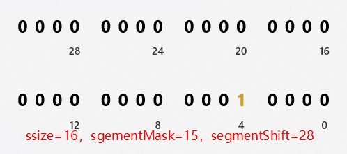
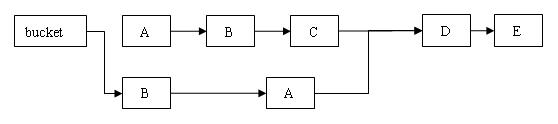
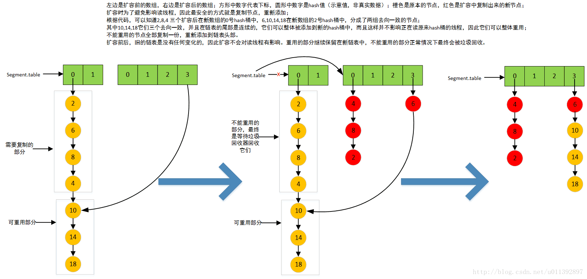
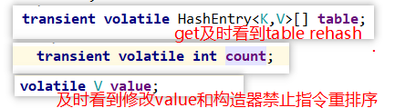
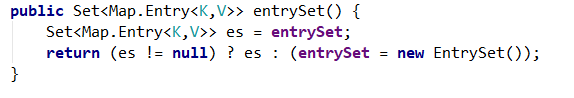
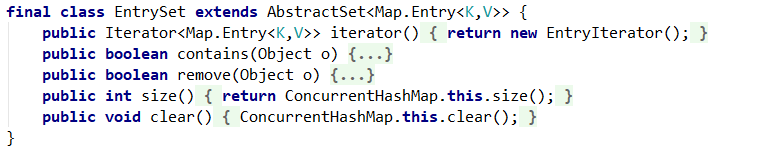
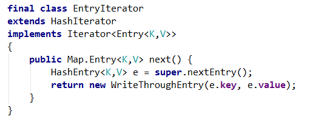
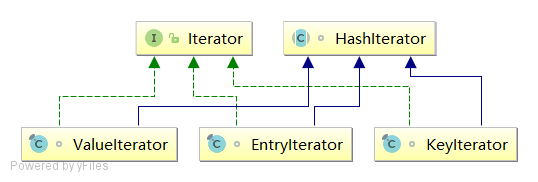
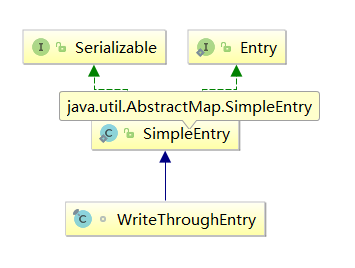
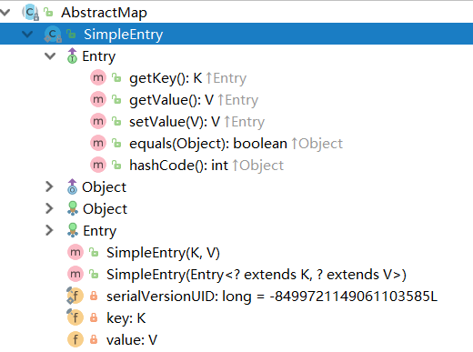

#### doc


**Retrieval operations (including get) generally do not block**, so may **overlap with update operations** (including put and remove). Retrievals reflect the results of the **most** recently completed update operations holding upon their onset. For aggregate operations such as putAll and clear, concurrent retrievals may reflect insertion or removal of **only some entries**. Similarly, Iterators and Enumerations return elements reflecting the state of the hash table a**t some point at or since the creation of the iterator/enumeration.** They do not throw ConcurrentModificationException. However, iterators are designed to be used by only one thread at a time.

The allowed concurrency among update operations is guided by the optional concurrencyLevel constructor argument (default 16), which is used as a hint for internal sizing. The table is internally partitioned to try to permit the indicated number of concurrent updates without contention. Because placement in hash tables is essentially random, the actual concurrency will vary. Ideally, you should **choose a value to accommodate as many threads as will ever concurrently modify the table.** Using a significantly higher value than you need can waste space and time, and a significantly lower value can lead to thread contention. But overestimates and underestimates within an order of magnitude do not usually have much noticeable impact. A value of one is appropriate when it is known that only one thread will modify and all others will only read. Also, resizing this or any other kind of hash table is a relatively slow operation, so, when possible, it is a good idea to provide estimates of expected table sizes in constructors.

This class and its views and iterators implement all of the optional methods of the Map and Iterator interfaces.
Like Hashtable but unlike HashMap, this class does not allow null to be used as a key or value.


#### 介绍

1. A hash table **supporting full concurrency of retrievals and adjustable expected concurrency for updates.** This class obeys the same functional specification as Hashtable, and includes versions of methods corresponding to each method of Hashtable. However, even though all operations are thread-safe, retrieval operations do not entail locking, and there is not any support for locking the entire table in a way that prevents all access. This class is fully interoperable with Hashtable in programs that rely on its thread safety but not on its synchronization details.
2. 不允许null key和null value（1.7之前的代码中，指出非常特殊情况可能会读到null value，但是在jsr133后的新内存模型中是不会发生的，也就是实际中不会读到null value，1.7把这个无用的代码去掉了）。
3. 所有读线程几乎不会因写线程的加锁而阻塞（除非读线程刚好读到这个 Segment 中某个 `HashEntry 的 value 域的值为 null，此时需要加锁后重新读取该值`）。
4. java1.6版本的`ConcurrentHashMap`基于concurrentLevel划分出了多个Segment来对key-value进行存储，从而避免每次锁定整个数组。每个segment有一个自己的数组table，元素是HashEntry。
5. Segment 类继承于 ReentrantLock 类，从而使得 Segment 对象能充当锁的角色。每次所锁住自己的数组。
6. Segments are specialized versions of hash tables
7. 专为并发设计的集合类。它的读操作不加锁（null value的问题不说了），可以和写操作并行，但是读操作**只反映最近完成的结果**，也可能和它开始执行的那一瞬间的状态有出入，这在一般的并发场景中可以接受。基本的写操作加锁，**putAll和clear这两个批量操作没有使用全局锁**，因此并不保证结果和预期的一致（比如clear执行后的一瞬间，可能map中会有其他线程添加的数据）。它**接近线程安全**，但还不是真正意义上的线程安全，记住线程安全的关键：**线程一个个串行**，和多线程并发的执行，产生的效果（对外界可见的影响）一样。很明显ConcurrentHashMap达不到这种程度。一般把它叫作线程安全是因为，它能保证写操作准确无误，能保证读操作不会读取到某个错误的状态下的值，这能满足大多数线程并发的场景。有些要求很高的场景，这个类是无法满足的。
   它的这种并发控制更像是数据库隔离级别。它没有全局锁（数据库进程锁/库锁），使用的是Segment的锁（数据库表级别的锁）。根据写阻塞写不阻塞读这一点，可以认为它具体的隔离级别是"Read uncommitted"这个级别，即不会丢失写操作带来的影响，但是会读取到"中间态数据/脏数据"（写操作方法还没有返回，就能看到写操作带来的部分影响）。至于”不可重复读“、”幻读“这两个，根据具体实现，Segment的读方法都只读一次（加锁读不管），可以认为是没有的。“脏数据”这个，可以认为只在putAll、clear中才会出现。基本的put/remove/replace，因为都只操作一个K-V，因此可以认为它们的执行过程中是没有“脏数据”出现的。
   ConcurrentHashMap在多线程之间可能会存在不一致状态。但是针对简单的读写操作来说，这些不一致的状态，**要么是历史的一致状态，要么是未来的一致状态，**不会出现错误的状态（HashMap多线程操作就会出现错误状态，比如死循环、更新丢失）。在很多程序中还是能接受这种不一致的，当然，如果你需要更高的一致性，比如获取需要同时获取ConcurrentHashMap中某几个key在某个绝对的同一时刻对应的value，那么它自带的方法就不能完成了，这时候就要依赖更外部的范围更大锁。这种差不多就算是通常所**说的事务了，api是基本不提供自带事务性的方法的，**需要你自己控制。
8. ConcurrentHashMap的迭代器是弱一致性的，不是fail-fast快速失败的。即使它在迭代时发现了并发修改，它也是会继续执行下去的，它不会抛出ConcurrentModificationException，因此它的迭代器可能会反映出迭代过程中的并发修改，预期迭代结果可能和调用的瞬间情况有出入。虽然迭代器在并发时不会抛出异常，但是仍然不建议多线程并发使用此迭代器。
9. 不支持clone，不过clone本身用得就很少，用Map拷贝构造创建一个实例能够做到一样的效果。

#### HashEntry


```java
static final class HashEntry<K,V> {
    //key，hash 和 next 域都被声明为 final 型，value 域被声明为 volatile 型。
    final K key;
    final int hash;
    volatile V value;
    final HashEntry<K,V> next;

    HashEntry(K key, int hash, HashEntry<K,V> next, V value) {
        this.key = key;
        this.hash = hash;
        this.next = next;
        this.value = value;
    }

    //初始化一个table
    @SuppressWarnings("unchecked")
    static final <K,V> HashEntry<K,V>[] newArray(int i) {
        return new HashEntry[i];
    }
}
```

HashEntry 用来封装散列映射表中的键值对。

1. HashEntry 中的 key，hash，next 都声明为 final 型。这意味着，不能把节点添加到链接的中间和尾部，也不能在链接的中间和尾部删除节点。

   这个特性可以保证：在访问某个节点时，这个节点之后的链接不会被改变。这个特性可以大大降低处理链表时的复杂性。

   但是这让删除变得复杂了一些，要复制前面的节点并重新添加，删除的效率变低。

   HashMap.Entry只有key和hash是final。

2. HashEntry 类的 value 域被声明为 Volatile 型，Java 的内存模型可以保证：**某个写线程对 value 域的写入马上可以被后续的某个读线程“看”到**。

说几个问题：

1. 为什么使用final修饰next？

   key和hash因为是判别两个hashEntry是否“相等”的重要属性，实际中不允许修改，设置为final合情合理，更重要的原因是扩容时有用到hash值不会改变这个重要的前提。扩容时一部分节点重用，本质上和HashMap1.8中的高低位时一个思想。
   next指针在删除节点时需要被修改，设置为final使得remove操作很麻烦。**这个不是为了remove不影响正在进行在HashEntry链的读操作**，虽然这个类是弱一致的，但是是允许迭代读时看到其他线程的修改的，再对比看下1.7的，可以印证这一点。

   关于这一点，需要知道Java中final的内存语义。关于final的内存语义，可以看下[这篇文章](https://www.infoq.cn/article/java-memory-model-6/)，我这里结合HashEntry简单说下。
   final的内存语义，能够保证读线程读去一个HashEntry节点时，它的next指针在这之前已经被正确初始化了（构造方法中this不提前逸出的情况下，HashEntry满足这一点）。如果使用普通的变量next，处理器重排序后，有可能读线程先读取到这个节点引用，然后通过引用读取next的值。next的初始化赋值因为重排序，可能被放在后面再执行，这种情况下读取到的next是默认值null。因为get/put/remove/replace都需要使用next指针进行链表遍历，在遍历链表时，next == null本身就是一个正常的状态 ，因此这种重排序基本上对所有读写操作都有严重的影响，会造成混淆，所有方法的准确性大大降低。然后，因为next == null是正常状态，不能像value一样，在读取到null时使用readUnderLock再来一次（这也是ConcurrentHashMap为什么不能允许null value的一个原因）。
   为了避免上面说的这种问题，**把next设置为final的，这样就能保证不会读取到未被初始化赋值时的默认值null，遍历时读到null就一定能保证是遍历到了链表末尾。**

2. jdk1.7开始不再使用final next，改为使用volatile next。

   这样在jdk1.5（jsr133内存模型改动）之后也是也是可以的，能够避免读取到未被初始化赋值的next。可以参考下[这篇讲volatile](https://www.infoq.cn/article/java-memory-model-4/)的和[这篇讲双检锁单例](https://www.infoq.cn/article/double-checked-locking-with-delay-initialization/)的。
   这些代码是1.5时写的，1.6基本没变。在写这段代码时作者对内存模型理解有些偏差（看下[这](http://stackoverflow.com/questions/5002428/concurrenthashmap-reorder-instruction/5144515#5144515)里），所以没有使用volatile。1.7开始就改为volatile next，并使用`Unsafe.putOrderedObject`来降低volatile的写开销，尽量提升性能。
   **因为理解上的偏差，所以才有了readUnderLock方法。**readUnderLock是在读取到value == null时重新加锁读一次，避免读取到的value是未执行初始化赋值的默认值null。**在jsr133后的新的内存模型中，读取到value == null是不可能的发生的。**因此1.7开始，这个设计直接去掉了，因为本身就不允许null存进来，所以不会读取到，也谈不上加锁再读一次。
   这个问题本身是1.5中的，但是1.6的代码基本没实质性改动，继承了这个问题，1.7的改进了不少，修复了这个问题。

3. 为什么不允许null value？value好像并不影响Map的特性。网上简单找了下，大概四个原因：

   - 1、最初设计中，null value可以区别是否要加锁读，如果允许null value，那么不好区别要不要加锁，现在这已经不需要了；
   - 2、containsKey方法的有些实现是 get(key) != null，这里也需要区别出 null value，但是可以不这样实现；
   - 3、为了完全替换Hashtable，这个类是不允许null value的；
   - 4、历史原因，最开始是null value，后面的版本也不好改了，就保留下来了。

#### constructor

**参数**

```java
static final int DEFAULT_INITIAL_CAPACITY = 16;//整个map的capacity
static final float DEFAULT_LOAD_FACTOR = 0.75f;//重载因子
static final int DEFAULT_CONCURRENCY_LEVEL = 16;//并发level，也是capacity要分割的分数

final int segmentMask;//segments 的掩码值， key 的散列码的高位用来选择具体的 segment
final int segmentShift;//待解决 ？

final Segment<K,V>[] segments;

transient Set<K> keySet;
transient Set<Map.Entry<K,V>> entrySet;
transient Collection<V> values;
```

**最终构造器**

```java
public ConcurrentHashMap(int initialCapacity,
                         float loadFactor, int concurrencyLevel) {
    if (!(loadFactor > 0) || initialCapacity < 0 || concurrencyLevel <= 0)
        throw new IllegalArgumentException();

    if (concurrencyLevel > MAX_SEGMENTS)
        concurrencyLevel = MAX_SEGMENTS;//最高并发数量 1<<16

    // Find power-of-two sizes best matching arguments，根据并发数量找出相近的数（2的次方）
    int sshift = 0;
    int ssize = 1;
    while (ssize < concurrencyLevel) {
        ++sshift;
        ssize <<= 1;
    }
    segmentShift = 32 - sshift;//这两个都是用来计算hash再segment数组的index，取hash的upper bits，右移的位数
    segmentMask = ssize - 1;   // 可能后续优化使用，或者当concurrencyLevel=1的时候需要使用，因为-1，segmentMask的有效位数为前sshit位
    this.segments = Segment.newArray(ssize);//根据ssize建立第一个Segment数组,确保2的次方

    if (initialCapacity > MAXIMUM_CAPACITY)
        initialCapacity = MAXIMUM_CAPACITY;
    
    //计算每一个segment里面table的大小cap，c = initialCapacity / ssize , c为平均数向上取整，然后取大于c的2次方数cap，
    int c = initialCapacity / ssize; 
    if (c * ssize < initialCapacity)
        ++c;
    int cap = 1;
    while (cap < c)
        cap <<= 1;

    //初始化每一个segment
    for (int i = 0; i < this.segments.length; ++i)
        this.segments[i] = new Segment<K,V>(cap, loadFactor);//初始化每个 Segment
}

Segment(int initialCapacity, float lf) {
    loadFactor = lf; //重载因子
    setTable(HashEntry.<K,V>newArray(initialCapacity));// Segment 内部的数组
}

void setTable(HashEntry<K,V>[] newTable) {
    threshold = (int)(newTable.length * loadFactor); //默认构造器开始threshold是0，因此一开始put就会扩容
    table = newTable;
}
```



#### hash定位

1. 散列算法 ：扰动函数

   兼顾segment（高位bits）和 table的位置（低位bits）

   1. 因为算出来的hash的最高的几位用于定位段，最低的几位用于段内定位hash桶，所以高位低位都需要扰动，要两个方向移位
   2. HashMap中算出来的hash值只有最低的几位会被用到，所以只对需要对低位进行操作，一个方向移位就行 ，不需要下面这种更复杂的hash函数

   ```java
   private static int hash(int h) {
       // Spread bits to regularize both segment and index locations,
       // using variant of single-word Wang/Jenkins hash.
       h += (h <<  15) ^ 0xffffcd7d;
       h ^= (h >>> 10);
       h += (h <<   3);
       h ^= (h >>>  6);
       h += (h <<   2) + (h << 14);
       return h ^ (h >>> 16);
   }
   ```

2. 调用散列算法处理原生hash，得出散列 hash

   ```java
    int hash = hash(key.hashCode());
   ```

3. 找到那个segment，高位按位与运算

   ```java
   final Segment<K,V> segmentFor(int hash) {
       //把hash偏移segmentShift位，取高位的bits，然后和segmentMask做位和运算(segmentMask有点多余，除非concurrencylevel是1)
       return segments[(hash >>> segmentShift) & segmentMask];
   }
   ```

4. 然后找到key在segment的`transient volatile HashEntry<K,V>[] table`的位置，低位按位与运算

   ```java
   HashEntry<K,V>[] tab = table;
   int index = hash & (tab.length - 1);  //hash的低位bits通过和table的（length-1）做位和运算来去掉高位，定位table的index，table的legnth会变化
   HashEntry<K,V> first = tab[index];
   ```

#### put

```java
public V put(K key, V value) {
    if (value == null)
        throw new NullPointerException();//value不能为null
    int hash = hash(key.hashCode()); //key为null会有异常
    return segmentFor(hash).put(key, hash, value, false);
}
```

正式put进去	

```java
V put(K key, int hash, V value, boolean onlyIfAbsent) {
    lock(); // 1. 先调用lock()，lock是ReentrantLock类的一个方法。这里是锁定某个 Segment 对象而非整个 ConcurrentHashMap 
    try {
        int c = count;//2. 先赋值给c，volatile变量
        
        // 先执行扩容，再添加节点，1.6的HashMap是先添加节点，再扩容
        // 并且Segment这里是先用大于号判断大小，再count++，扩容时实际容量会比HashMap中同情况时多一个，会出现put完成后Segment.count > threshold应该扩容但是却没有扩容的情况，这不太符合设计
        // eg：threshold = 12，那么在这个Segment上执行第13次put时，判断语句为 12++ > 12，为false，执行完成后Segment.count = 13，threshold = 12
        // 1.7修改了上面两点，判断语句先让count加1，再用大于号执行判断，同时让table.length 最小值为2，这样第一次put也不会扩容，完善了整体的扩容机制       
        if (c++ > threshold) // 如果需要执行再散列，table 数组的长度将扩充一倍
            rehash();
        HashEntry<K,V>[] tab = table;
        int index = hash & (tab.length - 1);//3. hash的低位bits和table的（length-1）做位运算，去掉高位，定位table的index，table的legnth会变化，rehash
        HashEntry<K,V> first = tab[index];
        HashEntry<K,V> e = first;
        while (e != null && (e.hash != hash || !key.equals(e.key)))//4. 在链表中找到key相等的entry
            e = e.next;

        V oldValue;
        if (e != null) {//4.1 e!=null，找到匹配，根据onlyIfAbsent替换旧值，非结构性修改，put相同的key（相当于replace）不会修改modCount，这降低了containsValue方法的准确性，jdk1.7修复了这一点
            oldValue = e.value;
            if (!onlyIfAbsent)
                e.value = value;
        }
        else {//4.2 e为null，找不到，放在链头
            oldValue = null;
            ++modCount; //结构性修改，modCount+1
            tab[index] = new HashEntry<K,V>(key, hash, first, value);//下面
            count = c; // write-volatile 需要最后写入主存
        }
        return oldValue;
    } finally {
        unlock();
    }	
}
```

因为HashEntry的value是volatile，因此new函数不会发生指令重排序现象，不会让未初始化完成的对象逃逸

#### clear

```java
void clear() {
    if (count != 0) {
        lock();
        try {
            HashEntry<K,V>[] tab = table;
            for (int i = 0; i < tab.length ; i++)
                tab[i] = null; // table是volatile，但是中间赋值了另一个变量，因此有可能缓存不一致，但业务上没有必要保持一致，因为读线程读到可以当还没有clear
            ++modCount;
            count = 0; // write-volatile
        } finally {
            unlock();
        }
    }
}
```


#### remove

```java
V remove(Object key, int hash, Object value) {
    lock();
    try {
        int c = count - 1;
        HashEntry<K,V>[] tab = table;
        int index = hash & (tab.length - 1);  // 根据散列码找到 table 的下标值
        HashEntry<K,V> first = tab[index];
        HashEntry<K,V> e = first;
        while (e != null && (e.hash != hash || !key.equals(e.key)))  //遍历这个链表找到要删除的节点
            e = e.next;

        V oldValue = null;
        if (e != null) {
            V v = e.value;
            if (value == null || value.equals(v)) {
                oldValue = v;
                // All entries following removed node can stay
                // in list, but all preceding ones need to be
                // cloned.
                ++modCount;
                HashEntry<K,V> newFirst = e.next;
                for (HashEntry<K,V> p = first; p != e; p = p.next)
                    newFirst = new HashEntry<K,V>(p.key, p.hash,
                                                  newFirst, p.value);
                tab[index] = newFirst;  //最后才把新链表传到数组上，原链条没有修改，
                count = c; // write-volatile 同步到主存
            }
        }
        return oldValue;
    } finally {
        unlock();
    }
}
```

`和 get 操作一样，首先根据散列码找到具体的链表；然后遍历这个链表找到要删除的节点；最后把待删除节点之后的所有节点原样保留在新链表中，把待删除节点之前的每个节点克隆到新链表中。下面通过图例来说明 remove 操作。`假设写线程执行 remove 操作，要删除链表的 C 节点，另一个读线程同时正在遍历这个链表。

**执行删除之前的原链表**：


**执行删除之后的新链表**



从上图可以看出，删除节点 C 之后的所有节点原样保留到新链表中；删除节点 C 之前的每个节点被克隆到新链表中，*注意：它们在新链表中的链接顺序被反转了*。

#### get

不用加锁，并发写不会影响读。读的时候不出错就可以了，不一定要即时读到写线程的东西。

问题在于旧的内存模型中有可能读到一个未初始化完成的entry ，在 `readValueUnderLock` 那里加锁再读一次

```java
 transient volatile int count;
 
 V get(Object key, int hash) {
     if (count != 0) { // read-volatile 先读count变量
         HashEntry<K,V> e = getFirst(hash);
         while (e != null) {
             if (e.hash == hash && key.equals(e.key)) {
                 V v = e.value;
                 if (v != null)
                     return v;
                 return readValueUnderLock(e); // recheck
             }
             e = e.next;
         }
     }
     return null;
 }
```

#### rehash

只在put中调用

调整大小不是针对整个map的，是针对每个segment单独修改数组大小的

这里根据扩容时节点迁移的性质，最大可能的重用一部分节点，这个性质跟1.8的HashMap中的高低位是一个道理，必须要求hash值是final的

因为`HashEntry.next`是`final`修饰，不能拆散链表，因此每个链表只clone前面hash不等的部分entry，后面 hash相等entry的可以重用

We need to guarantee that any existing reads of old Map can proceed. So we cannot yet null out each bin。只是再最后修改一次table的引用

```java
//java.util.concurrent.ConcurrentHashMap.Segment#rehash
		void rehash() {
            HashEntry<K,V>[] oldTable = table;
            int oldCapacity = oldTable.length;
           
            if (oldCapacity >= MAXIMUM_CAPACITY)  // 1. 数组达到最大范围，不能再扩展，有个缺点，应该顺便更改threshold的大小，不用再进来
                return;

            /*
             * Reclassify nodes in each list to new Map.  Because we are
             * using power-of-two expansion, the elements from each bin
             * must either stay at same index, or move with a power of two
             * offset. We eliminate unnecessary node creation by catching
             * cases where old nodes can be reused because their next
             * fields won't change. Statistically, at the default
             * threshold, only about one-sixth of them need cloning when
             * a table doubles. The nodes they replace will be garbage
             * collectable as soon as they are no longer referenced by any
             * reader thread that may be in the midst of traversing table
             * right now.
             */

            HashEntry<K,V>[] newTable = HashEntry.newArray(oldCapacity<<1); // 2. 新数组扩展1倍
            threshold = (int)(newTable.length * loadFactor);
            int sizeMask = newTable.length - 1;
            for (int i = 0; i < oldCapacity ; i++) {
                // We need to guarantee that any existing reads of old Map can
                //  proceed. So we cannot yet null out each bin.
                HashEntry<K,V> e = oldTable[i];
		
                if (e != null) {   //如果hash是final的，entry只有两个去向，那么要么留在原来的位置n，要么到n+oldtable.length
                    HashEntry<K,V> next = e.next;
                    int idx = e.hash & sizeMask;

                    //  Single node on list  
                    if (next == null)  
                        newTable[idx] = e;

                    else {     //4. 链表分为2部分 ， first ... lastrun ... last (lastrun ... last的index相同，可以一起挪动，前面都要clone)
                        // Reuse trailing consecutive sequence at same slot   
                        HashEntry<K,V> lastRun = e;
                        int lastIdx = idx;        
                        for (HashEntry<K,V> last = next; // 4.1 链表>=2,循环链表找出第2部分，然后整个挪过去
                             last != null;
                             last = last.next) {
                            int k = last.hash & sizeMask;
                            if (k != lastIdx) {
                                lastIdx = k;
                                lastRun = last;
                            }
                        }
                        newTable[lastIdx] = lastRun;

                        // Clone all remaining nodes
                        for (HashEntry<K,V> p = e; p != lastRun; p = p.next) { // 4.2 循环第一部分，clone
                            int k = p.hash & sizeMask;
                            HashEntry<K,V> n = newTable[k];
                            newTable[k] = new HashEntry<K,V>(p.key, p.hash,
                                                             n, p.value);
                        }
                    }
                }
            }
            table = newTable;
        }
```



#### containsValue

```java
// containsValue和size虽然是读操作，但是会批量读取到所有Segment，所以特殊处理
// 先不加锁尝试两次以获得比较近似的结果，如果contains就直接返回（因为有一个存在就是存在，不存在才需要遍历全部），不contains才继续，如果发现modCount被其他线程修改，就全部加锁再执行
// 不加锁读两次时，可能会碰见写操作的中间状态，也可能在循环到后面时有线程修改了前面，所以这个方法不是100%准确的
// 设计成这样主要是为了提高效率，很多业务还是可以接受这种误差，需要更强一致性的时候，可以自己写个方法
// 上面Segment的分析中指出了，put相同的key、replace方法不会修改modCount，但是会改变value，这一点使得后面检测modCount是否改变可能成为无用功，让containsValue方法的准确性降低了，1.7进行了修复
public boolean containsValue(Object value) {
    if (value == null)
        throw new NullPointerException();
 
    final Segment<K,V>[] segments = this.segments;
    int[] mc = new int[segments.length];
 
    // 先不加锁执行RETRIES_BEFORE_LOCK = 2次
    for (int k = 0; k < RETRIES_BEFORE_LOCK; ++k) {
        int sum = 0;
        int mcsum = 0;
        for (int i = 0; i < segments.length; ++i) {
            int c = segments[i].count; // 这个c没哪里用，意义不明
            mcsum += mc[i] = segments[i].modCount; // 就是 mc[i] = segments[i].count; mssum += mc[i]，临时保存一份modCount
            if (segments[i].containsValue(value)) // 碰见contains直接return
                return true;
        }
        boolean cleanSweep = true;
        // mcsum是modCount的和，为0可以认为遍历开始时没有任何put完成过任何HashEntry，即方法开始执行时不包含任何HashEntry，可以认为（近似认为，几率比较大）此时也不包含
        if (mcsum != 0) {
            for (int i = 0; i < segments.length; ++i) {
                int c = segments[i].count;
                if (mc[i] != segments[i].modCount) { // modCount改变，说明有其他线程修改了Segment的结构，退出循环。会有replace的问题，前面说了
                    cleanSweep = false;
                    break;
                }
            }
        }
        if (cleanSweep)
            return false;
    }
    // 如果连续两次都碰见modCount改变的情况，这时候一次性对全部Segment加锁，最大程度保证遍历时的一致性
    // 因为是全部加锁后再遍历，遍历开始后没有线程可以修改任何Segment的结构，可以保证当前线程得到的是准确值
    for (int i = 0; i < segments.length; ++i)
        segments[i].lock();
    boolean found = false;
    try {
        for (int i = 0; i < segments.length; ++i) {
            if (segments[i].containsValue(value)) {
                found = true;
                break;
            }
        }
    } finally {
        for (int i = 0; i < segments.length; ++i)
            segments[i].unlock();
    }
    return found;
}
```

#### isEmpty

```java
  	// 不会加锁，检查两次，并且会在第二次检查modcount，避免aba问题
	/**
     * Returns <tt>true</tt> if this map contains no key-value mappings.
     *
     * @return <tt>true</tt> if this map contains no key-value mappings
     */
    public boolean isEmpty() {
        final Segment<K,V>[] segments = this.segments;
        
        //第一次检查
        /*
         * We keep track of per-segment modCounts to avoid ABA
         * problems in which an element in one segment was added and
         * in another removed during traversal, in which case the
         * table was never actually empty at any point. Note the
         * similar use of modCounts in the size() and containsValue()
         * methods, which are the only other methods also susceptible
         * to ABA problems.
         */
        int[] mc = new int[segments.length];
        int mcsum = 0;
        for (int i = 0; i < segments.length; ++i) {
            if (segments[i].count != 0)
                return false;
            else
                mcsum += mc[i] = segments[i].modCount;
        }
        
        //第二次检查
        // If mcsum happens to be zero, then we know we got a snapshot
        // before any modifications at all were made.  This is
        // probably common enough to bother tracking.
        if (mcsum != 0) {
            for (int i = 0; i < segments.length; ++i) {
                if (segments[i].count != 0 ||
                    mc[i] != segments[i].modCount)
                    return false;
            }
        }
        return true;
    }
```


#### size

```java
// 跟containsValue差不多，但是size不会受put相同的key、replace方法的影响
// 注意最后一个int溢出处理，因为HashMap以及ConcurrentHashMap是个特殊的集合类，我们通常所说的容量是hash桶的数目，这并不是实际容量
// 因为使用链表解决hash冲突的原因，实际的可以容纳得更多，可能会远远超多Integer.MAX_VALUE，这这时返回值就是个错误的值，但还是尽量返回了一个“比较有用”的值。
// 这纯粹是历史原因造成的坑，返回个int，没考虑实际情况，1.8的新增了一个mappingCount方法，返回long型准确数字
public int size() {
    final Segment<K,V>[] segments = this.segments;
    long sum = 0; //第一次count的和
    long check = 0;//第二次count的和
    int[] mc = new int[segments.length];//modcound数组
    
    // 尝试不加锁执行，最大尝试次数为2次
    for (int k = 0; k < RETRIES_BEFORE_LOCK; ++k) {
        check = 0;
        sum = 0;
        int mcsum = 0;
        
        //1. 第一次统计count_sum和每一个modcount
        for (int i = 0; i < segments.length; ++i) {
            sum += segments[i].count;
            mcsum += mc[i] = segments[i].modCount;
        }
        if (mcsum != 0) {//如果modcount=0，那么count_sum就是0
            //2. 第二次统计确认数据，并且比较modcount
            for (int i = 0; i < segments.length; ++i) {
                check += segments[i].count;
                if (mc[i] != segments[i].modCount) {
                    check = -1; // force retry 3. 如果modcount变化，说明有并发写入，把check重置为-1
                    break;
                }
            }
        }
        //4. 比较两次的count_sum(sum,check)，相等就会结束循环，下面返回，把modcount反应为check的变化（事实上两者共同变化，多此一举）
        if (check == sum)
            break;
    }
    //碰到modCount++被修改了，就全部加锁在执行一次，check和sum都是局部变量，和上面的比较结果相同
    if (check != sum) {
        sum = 0;
        for (int i = 0; i < segments.length; ++i)
            segments[i].lock();
        for (int i = 0; i < segments.length; ++i)
            sum += segments[i].count;
        for (int i = 0; i < segments.length; ++i)
            segments[i].unlock();
    }
    if (sum > Integer.MAX_VALUE) // int溢出处理，因此返回值可能会是错误的。
                                 // 并且因为兼容性的原因，这个还无法解决，只能新增一个方法，1.8的ConcurrentHashMap就是新增了一个返回long型的方法
        return Integer.MAX_VALUE;
    else
        return (int)sum;
}
```

#### 集体操作

```java
// putAll和clear都是循环操作，没有全局加锁，在执行期间还是可以执行完成其他的写操作的，事务性比较差的方法，设计成不用全局锁是为了提高效率
public void putAll(Map<? extends K, ? extends V> m) {
    for (Map.Entry<? extends K, ? extends V> e : m.entrySet())
        put(e.getKey(), e.getValue());
}
 
public void clear() {
    for (int i = 0; i < segments.length; ++i)
        segments[i].clear();
}
————————————————
版权声明：本文为CSDN博主「十二页」的原创文章，遵循 CC 4.0 BY-SA 版权协议，转载请附上原文出处链接及本声明。
原文链接：https://blog.csdn.net/u011392897/article/details/60466665
```


#### readValueUnderLock

- **这个方法不应该被调用**。

```java
//put
tab[index] = new HashEntry<K,V>(key, hash, first, value);
count = c; // write-volatile

//remove
tab[index] = newFirst;
count = c; // write-volatile
```

table的元素写入快慢（写入主存；其他线程从主存读取）没有关系，下一次再读也是可以。读延迟可以接受

**问题**：如果写入一个未初始化完成的`HashEntry`的地址，`域value`为null。

以前的jmm模型或者jvm设计不好。现在jmm不会，因为entry的value是volatile的，因此先初始化完成再传递内存地址。

- **注释矛盾之处**： 和final有什么关系？

  Because the value field **is volatile, not final, i**t is legal wrt the Java Memory Model for an unsynchronized reader to see null instead of initial value when read via a data race.  Although a reordering leading to this is not likely to ever actually occur, the Segment.readValueUnderLock method is used as a backup in case a null (pre-initialized) value is ever seen in an unsynchronized access method.

#### 并发写和读

如果能够确保：在读线程遍历一个链表期间，写线程对这个链表所做的结构性修改不影响读线程继续正常遍历这个链表。那么读 / 写线程之间就可以安全并发访问这个 ConcurrentHashMap。

- **非结构性修改操作**

  只是更改某个 HashEntry 的 `value` 域（**volatile修饰**）的值。由于对 **Volatile** 变量的写入操作将与随后对这个变量的读操作进行同步。当一个写线程修改了某个 HashEntry 的 value 域后，另一个读线程读这个值域，Java 内存模型能够保证读线程读取的一定是更新后的值。所以，写线程对链表的非结构性修改能够被后续不加锁的读线程“看到”。

  

- **结构性修改**

  对 ConcurrentHashMap 做结构性修改，实质上是对某个桶指向的链表做结构性修改。结构性修改操作包括 put，remove，clear。

  - clear： 操作只是把 ConcurrentHashMap 中所有的桶“置空”，每个桶之前引用的链表依然存在，只是桶不再引用到这些链表（所有链表的结构并没有被修改）。正在遍历某个链表的读线程依然可以正常执行对该链表的遍历。
  - remove：在执行 remove 操作时，原始链表并没有被修改，也就是说：读线程不会受同时执行 remove 操作的并发写线程的干扰。
  - put ：如果需要插入一个新节点到链表中时 , 会在链表头部插入这个新节点。此时，链表中的原有节点的链接并没有被修改。也就是说：插入新健 / 值对到链表中的操作不会影响读线程正常遍历这个链表。

  综合上面的分析我们可以看出，写线程对某个链表的结构性修改不会影响其他的并发读线程对这个链表的遍历访问。

#### 用 Volatile 变量协调读写线程间的内存可见性

由于内存可见性问题，未正确同步的情况下，写线程写入的值可能并不为后续的读线程可见。

下面以写线程 M 和读线程 N 来说明 ConcurrentHashMap 如何协调读 / 写线程间的内存可见性问题。

**协调读 - 写线程间的内存可见性的示意图：**


假设线程 M 在写入了 volatile 型变量 count 后，线程 N 读取了这个 volatile 型变量 count。

根据 happens-before 关系法则中的程序次序法则，A appens-before 于 B，C happens-before D。

根据 Volatile 变量法则，B happens-before C。

根据传递性，连接上面三个 happens-before 关系得到：A appens-before 于 B； B appens-before C；C happens-before D。也就是说：写线程 M 对链表做的结构性修改，在读线程 N 读取了同一个 volatile 变量后，对线程 N 也是可见的了。

虽然线程 N 是在未加锁的情况下访问链表。Java 的内存模型可以保证：只要之前对链表做结构性修改操作的写线程 M 在退出写方法前写 volatile 型变量 count，读线程 N 在读取这个 volatile 型变量 count 后，就一定能“看到”这些修改。volatile的内存屏障，有些变量有效，有些变量无效

ConcurrentHashMap 中，每个 Segment 都有一个变量 count。它用来统计 Segment 中的 HashEntry 的个数。这个变量被声明为 volatile。

```java
transient volatile int count;
```

所有不加锁读方法，在进入读方法时，首先都会去读这个 count 变量。比如get 方法。

在 ConcurrentHashMap 中，所有执行写操作的方法（put, remove, clear），在对链表做结构性修改之后，在退出写方法前都会去写这个 count 变量。所有未加锁的读操作（get, contains, containsKey）在读方法中，都会首先去读取这个 count 变量。

根据 Java 内存模型，对 同一个 volatile 变量的写 / 读操作可以确保：写线程写入的值，能够被之后未加锁的读线程“看到”。

这个特性和前面介绍的 HashEntry 对象的不变性相结合，使得在 ConcurrentHashMap 中，读线程在读取散列表时，基本不需要加锁就能成功获得需要的值。这两个特性相配合，不仅减少了请求同一个锁的频率（读操作一般不需要加锁就能够成功获得值），也减少了持有同一个锁的时间（只有读到 value 域的值为 null 时 , 读线程才需要加锁后重读）。



#### 实现高并发的总结

##### 基于通常情形而优化

在实际的应用中，散列表一般的应用场景是：除了少数插入操作和删除操作外，**绝大多数都是读取操作**，而且读操作在大多数时候都是成功的。正是基于这个前提，ConcurrentHashMap 针对读操作做了大量的优化。通过 HashEntry 对象的不变性和用 volatile 型变量协调线程间的内存可见性，使得 大多数时候，读操作不需要加锁就可以正确获得值。这个特性使得 ConcurrentHashMap 的并发性能在分离锁的基础上又有了近一步的提高。

##### 总结

ConcurrentHashMap 是一个并发散列映射表的实现，它允许完全并发的读取，并且支持给定数量的并发更新。相比于 `HashTable 和`用同步包装器包装的 HashMap（Collections.synchronizedMap(new HashMap())），ConcurrentHashMap 拥有更高的并发性。在 `HashTable 和由同步包装器包装的 HashMap 中，使用一个全局的锁来同步不同线程间的并发访问。同一时间点，只能有一个线程持有锁，也就是说在同一时间点，只能有一个线程能访问容器。这虽然保证多线程间的安全并发访问，但同时也导致对容器的访问变成串行化的了。`

在使用锁来协调多线程间并发访问的模式下，减小对锁的竞争可以有效提高并发性。有两种方式可以减小对锁的竞争：

1. 减小请求 同一个锁的 频率。

2. 减少持有锁的 时间。

   

ConcurrentHashMap 的高并发性主要来自于三个方面：

1. 用分离锁实现多个线程间的更深层次的共享访问。
2. 用 HashEntery 对象的不变性来降低执行读操作的线程在遍历链表期间对加锁的需求。
3. 通过对同一个 Volatile 变量的写 / 读访问，协调不同线程间读 / 写操作的内存可见性。（写后必定可见，有可能提前可见）

使用分离锁，减小了请求 *同一个锁*的频率。

通过 HashEntery 对象的不变性及对同一个 Volatile 变量的读 / 写来协调内存可见性，使得读操作绝大多数时候不需要加锁就能成功获取到需要的值。由于散列映射表在实际应用中大多数操作都是成功的 读操作，所以 2 和 3 既可以减少请求同一个锁的频率，也可以有效减少持有锁的时间。

通过减小请求同一个锁的频率和尽量减少持有锁的时间 `，使得 ConcurrentHashMap 的并发性相对于 HashTable 和`用同步包装器包装的 HashMap`有了质的提高。`

#### view_iterator

##### view

视图指的的 keySet()、values()、entrySet()、keys()、elements()这几个方法，三个视图属性实质上也是用这几个方法。
视图的操作都是基本上代理给map本身来进行操作，因此视图中进行写操作（一般是remove，没实现add），也会造成map发生更改。
特别注意下values的类型就是Collection，因此操作都很原始，没有任何子类的特性可以使用，平时尽量也不要用这个。

##### 介绍

1.  changes to the map are reflected in the set, and vice-versa. only new once
2.  The set supports element removal, which removes the corresponding mapping from the map, via the Iterator.remove, Set.remove, removeAll, retainAll, and clear operations. It does not support the add or addAll operations.
3.  The view's iterator is a "**weakly consistent**" iterator that will never throw `ConcurrentModificationException`, and guarantees to traverse elements as they existed upon construction of the iterator, and **may (but is not guaranteed to) reflect any modifications subsequent to construction.**
4.  迭代器不使用没有全局加锁，没有使用modCount机制

在迭代过程中不更改集合的要求通常会对许多并发应用程序造成不便。相反，比较好的是它允许并发修改并确保迭代器只要进行合理操作，就可以提供集合的一致视图，










##### 原理

最下面的是抽象内部类`HashIterator`

由于`HashEntry.next`是不可更改的`final`，因此找到每个`table`的`HashEntry`后就不会出错，而并发修改不会影响现在链表的遍历，每次读`table[i]`能保证是最新的（第一个`HashEntry`时），之后的并发修改有可能读到，也有可能读不到。

table是volatile，保证可见性，每次都能拿到最新的table，之后的链表改动不能看见。

从最后一个segment的table的最后一个索引位置开始遍历

```java
abstract class HashIterator {
    int nextSegmentIndex; 
    int nextTableIndex;
    HashEntry<K,V>[] currentTable;
    HashEntry<K, V> nextEntry;
    HashEntry<K, V> lastReturned;

    HashIterator() {
        nextSegmentIndex = segments.length - 1;	//设置为最后一个segment的索引
        nextTableIndex = -1;	//还没开始遍历，因此还不知道当前segment的table
        advance(); 	//寻找第一个可见返回的entry的位置
    }
```

###### hasNext()

```java
	public boolean hasNext() { return nextEntry != null; }
```

###### next()

子类重写

```java
final class EntryIterator
    extends HashIterator
    implements Iterator<Entry<K,V>>
{
    public Map.Entry<K,V> next() {
        HashEntry<K,V> e = super.nextEntry();
        return new WriteThroughEntry(e.key, e.value);
    }
}
```

nextEntry()

获取下一个`HashEntry`后需要推进一位，调用`advance`()

```java
    HashEntry<K,V> nextEntry() {
        if (nextEntry == null)
            throw new NoSuchElementException();
        lastReturned = nextEntry;
        advance();
        return lastReturned;
    }
```

```java
	//该方法用于初始化和next()后准备下一个返回的HashEntry
	final void advance() {
        //1.先看看当前HashEntry后面是否为null，没有就是链条尽了，同一个table的前一个index
        if (nextEntry != null && (nextEntry = nextEntry.next) != null)
            return;
        
		//2. table上一个index的HashEntry是否为null，没有就递归
        while (nextTableIndex >= 0) {
            if ( (nextEntry = currentTable[nextTableIndex--]) != null)
                return;
        }
		
        //3. table尽了，寻找上一个segment
        while (nextSegmentIndex >= 0) {
            Segment<K,V> seg = segments[nextSegmentIndex--];
            if (seg.count != 0) {
                currentTable = seg.table;//table是volatile，保证可见性，每次都能拿到最新的table，之后的链表改动不能看见
                for (int j = currentTable.length - 1; j >= 0; --j) {
                    if ( (nextEntry = currentTable[j]) != null) {
                        nextTableIndex = j - 1;
                        return;
                    }
                }
            }
        }
    }	
```

##### WriteThroughEntry

`next()`返回的包装类型，因为`java.util.concurrent.ConcurrentHashMap.HashEntry`不是 `Map.Entry`的实现了，仅仅是`object`的子类，需要包装一层。



```java
   final class WriteThroughEntry
extends AbstractMap.SimpleEntry<K,V>
   {
       WriteThroughEntry(K k, V v) {
           super(k,v);
       }

       /**
        * Set our entry's value and write through to the map. The
        * value to return is somewhat arbitrary here. Since a
        * WriteThroughEntry does not necessarily track asynchronous
        * changes, the most recent "previous" value could be
        * different from what we return (or could even have been
        * removed in which case the put will re-establish). We do not
        * and cannot guarantee more.
        */
public V setValue(V value) {
           if (value == null) throw new NullPointerException();
           V v = super.setValue(value);
           ConcurrentHashMap.this.put(getKey(), value);
           return v;
       }
   }
//特别的一点，这里会进行一次put操作，保证value所在的hashEntry在当时是一定存在的。这里把setValue 看成是 put相同的key，如果此时value不存在，也会添加一个进去。
//另外，由于读操作不加锁，因此value返回的也是一个过期的值，ConcurrentHashMap本身也保证不了更多。

```

```java
public SimpleEntry(K key, V value) {
    this.key   = key;
           this.value = value;
}
```

#### 参考文献：

https://blog.csdn.net/u011392897/article/details/60466665

