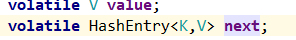
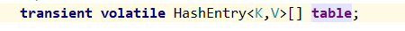

# 介绍

https://blog.csdn.net/u011392897/article/details/60469263

jdk1.7的ConcurrentHashMap整体设计、存储结构、思路，和1.6的基本一样，都是用代理给相应的Segment进行对应的操作。设计实现上一个比较大的改变就HashEntry的next指针不再是final的，改为volatile，并且用Unsafe提供的操作进行有序的延迟写入（lazySet）。
理解1.7的代码，需要对sun.misc.Unsafe有基本的了解，可以看下这里，然后我下面也有说。
零、主要改动
1、jdk1.7开始，集合类大多使用懒初始化，也就是默认构造的集合类，底层的存储结构使用尽量少的空间，等真正添加元素时才真正初始化。1.7的ConcurrentHashMap默认构造时只初始化 index = 0 的Segment，其余的都是put时初始化，另外会出现Segment = null的情况，需要多判断下。
2、大量使用 sun,misc.Unsafe 提供的底层操作方法，代替了一些实现比较简单的方法，稍微强化了方法的在并发上功能（比如对普通变量，也能够进行volatile读写），另外也带来了一些效率的提升。
3、修复1.6的一些小问题（具体看后面的代码分析注释）。

# 一、基本性质

跟1.6基本一样，没涉及这方面的修改。

# 二、常量和变量

### 1、常量

这块因为Unsafe的引入，多了一些相关的常量。





```java
static final int DEFAULT_INITIAL_CAPACITY = 16;
static final float DEFAULT_LOAD_FACTOR = 0.75f;
static final int DEFAULT_CONCURRENCY_LEVEL = 16;
static final int MAXIMUM_CAPACITY = 1 << 30;
static final int MAX_SEGMENTS = 1 << 16;
static final int RETRIES_BEFORE_LOCK = 2;
 
// 每个段的最小容量。段容量必须是2^n，最少是2能够保证在初始化一个Segment后的第一次put时不会立即扩容
// 1.6的Segment最小容量是1，第一次put就会用满结合1.6的构造方法和Segment.put中扩容部分一起看
static final int MIN_SEGMENT_TABLE_CAPACITY = 2;
 
// 下面的全都是Unsafe有关的
// Unsafe mechanics
private static final sun.misc.Unsafe UNSAFE;
 
// Segment数组的每个实例的内存结构中，存储数组第一个元素的地址相对于该对象实例起始地址的偏移量
// 此值和对象指针（对象引用）结合使用，可以得到数组首地址
// java对象会有对象头，数组对象还有length属性，因此Java数组的第一个元素的地址不再是C语言中数组实例的首地址
// 可以理解为C结构体中有个数组，求这个数组的第一个元素的地址相对结构体实例地址的偏移量
private static final long SBASE;
 
// Segment数组的每个元素在Segment实例的内存中占用的空间，基本类型就是基本类型的字节大小，引用类型存储的是指针，具体根据系统环境确定
// 相当于C语言中 *(p+1) 中这个1实际代表多少字节
private static final int SSHIFT;
 
// 同上面两个
private static final long TBASE;
private static final int TSHIFT;
 
// 下面几个相当于C语言结构体中属性相对实例地址的偏移量，知道起始地址、偏移量、变量类型，就能用 * 运算快速读写变量的值
private static final long HASHSEED_OFFSET;
private static final long SEGSHIFT_OFFSET;
private static final long SEGMASK_OFFSET;
private static final long SEGMENTS_OFFSET;
 
static {
    int ss, ts;
    try {
        UNSAFE = sun.misc.Unsafe.getUnsafe();
        Class tc = HashEntry[].class;
        Class sc = Segment[].class;
        TBASE = UNSAFE.arrayBaseOffset(tc);
        SBASE = UNSAFE.arrayBaseOffset(sc);
        ts = UNSAFE.arrayIndexScale(tc);
        ss = UNSAFE.arrayIndexScale(sc);
        HASHSEED_OFFSET = UNSAFE.objectFieldOffset(ConcurrentHashMap.class.getDeclaredField("hashSeed"));
        SEGSHIFT_OFFSET = UNSAFE.objectFieldOffset(ConcurrentHashMap.class.getDeclaredField("segmentShift"));
        SEGMASK_OFFSET = UNSAFE.objectFieldOffset(ConcurrentHashMap.class.getDeclaredField("segmentMask"));
        SEGMENTS_OFFSET = UNSAFE.objectFieldOffset(ConcurrentHashMap.class.getDeclaredField("segments"));
    } catch (Exception e) {
        throw new Error(e);
    }
    if ((ss & (ss-1)) != 0 || (ts & (ts-1)) != 0)
        throw new Error("data type scale not a power of two");
    // 下面的是求 lb(ss)，lb = log2，具体可以看下Integer.numberOfLeadingZeros的实现和注释
    // 这个方法求一个int二进制中从左边开始最长的连续的0的数目（最左边的符号位不算），因为ss是2^n，这里可以看做是求这个n
    // 本人环境 Java(TM) SE Runtime Environment (build 1.8.0_111-b14) Java HotSpot(TM) 64-Bit Server VM (build 25.111-b14, mixed mode)
    //     默认开启指针压缩，一个指针（引用）占用4字节时
    // 那么ss = ts = 4，得到SSHIFT = TSHIFT = 2
 
    // 下面两个值主要是为了用位运算代替乘法提高效率
    SSHIFT = 31 - Integer.numberOfLeadingZeros(ss);
    TSHIFT = 31 - Integer.numberOfLeadingZeros(ts);
}
```

## 2、变量
一点点变化，1.7的HashMap中说了，hashseed不影响基本流程。

```java
// 跟 jdk1.7 的HashMap一样，会根据系统属性生成一个 hashSeed，提高hash随机性。
// 不过Entry的hash值是不会变的，这一点跟1.6的一样
private transient final int hashSeed = randomHashSeed(this);
 
final int segmentMask;
final int segmentShift;
final Segment<K,V>[] segments;
transient Set<K> keySet;
transient Set<Map.Entry<K,V>> entrySet;
transient Collection<V> values;
```

# 三、基本类

## HashEntry

```java
static final class HashEntry<K,V> {
    final int hash; // hash是final的，1.7的HashMap中不是final的，用final对扩容比较友好
    final K key;
    volatile V value;
    volatile HashEntry<K,V> next; // jdk1.7中next指针不再是final的，改为volatile，使用 setNext 方法（内部用Unsafe的提供的方法）更新
 
    HashEntry(int hash, K key, V value, HashEntry<K,V> next) {
        this.hash = hash;
        this.key = key;
        this.value = value;
        this.next = next;
    }
 
    // putOrderedObject，这个方法只有作用于volatile才有效，它能保证写操作的之间的顺序性，但是不保证能立马被其他线程读取到最新结果，是一种lazySet，效率比volatile高，但是只有volatile			的“一半”的效果
    // 普通的volatile保证写操作的结果能立马被其他线程看到，不论其他线程是读操作还写操作
    // putOrderedObject能保证其他线程在写操作时一定能看到这个方法对变量的改变，但是其他线程只是进行读操作时，不一定能看到这个方法对变量的改变
    final void setNext(HashEntry<K,V> n) {
        //直接操作指针修改实例对象的filed：next 内存值
        UNSAFE.putOrderedObject(this, nextOffset, n);
    }
 
    // 初始化执行Unsafe有关的操作
    static final sun.misc.Unsafe UNSAFE;
    static final long nextOffset;
    static {
        try {
            UNSAFE = sun.misc.Unsafe.getUnsafe();
            Class k = HashEntry.class;
            nextOffset = UNSAFE.objectFieldOffset
                (k.getDeclaredField("next"));
        } catch (Exception e) {
            throw new Error(e);
        }
    }
}
```

## Segment

#### 总起

```java
static final class Segment<K,V> extends ReentrantLock implements Serializable {
    private static final long serialVersionUID = 2249069246763182397L;
 
    static final int MAX_SCAN_RETRIES = Runtime.getRuntime().availableProcessors() > 1 ? 64 : 1; // 尝试次数
 
    transient volatile HashEntry<K,V>[] table;
    transient int count;
    transient int modCount;
    transient int threshold;
    final float loadFactor;
 
    Segment(float lf, int threshold, HashEntry<K,V>[] tab) {
        this.loadFactor = lf;
        this.threshold = threshold;
        this.table = tab;
    }
 
    // jdk1.6中的 newArray、setTable 这两个方法因为实现太简单了，直接不用了
    // jdk1.6中的 get、containsKey、containsValue 这几个方法，因为都是读操作，实现基本类似，用 Unsafe 提供的一些底层操作代替了
    // jdk1.6中的 getFirst 虽然实现也很简单，但还是用 Unsafe 提供的一些底层方法强化了这个操作,
    //     保证了对数组元素的volatile读取，1.6的只保证对整个数组的读取是volatile
    // jdk1.6中的 readValueUnderLock 在1.7中彻底去掉了
```

#### put	

```java
	// 1.7多了个scanAndLockForPut的操作，也完善了put触发扩容的机制（见1.6版本我在Segment.put中触发扩容处写的注释），同时处理了超过最大容量的情况，其余的跟1.6差不多
    final V put(K key, int hash, V value, boolean onlyIfAbsent) {
            HashEntry<K,V> node = tryLock() ? null : scanAndLockForPut(key, hash, value); // 看scanAndLockForPut方法的注释
        V oldValue;
        try {
            HashEntry<K,V>[] tab = table;
            int index = (tab.length - 1) & hash;
            HashEntry<K,V> first = entryAt(tab, index);//获取链头，volatile
            
            //开始循环链条
            for (HashEntry<K,V> e = first;;) {
                if (e != null) {
                    K k;
                    if ((k = e.key) == key || (e.hash == hash && key.equals(k))) {//1. 存在相同的，就换value
                        oldValue = e.value;
                        if (!onlyIfAbsent) {
                            e.value = value;
                            ++modCount; // 1.7的put相同的key（这时候相当于replace）时也会修改modCount了，1.6是不会的，能够更大地保证containValue这个方法的准确性
                        }
                        break;
                    }
                    e = e.next;
                }
                else { //2. 都不相同，加一个新的
                    if (node != null)
                        node.setNext(first); // 尝试添加在链表头部
                    else
                        node = new HashEntry<K,V>(hash, key, value, first);
                    int c = count + 1; // 先加1
                    if (c > threshold && tab.length < MAXIMUM_CAPACITY) // 超过最大容量的情况，在put这里一并处理了
                        rehash(node);
                    else
                        setEntryAt(tab, index, node); // 不扩容时，直接让新节点成为头节点
                    ++modCount;
                    count = c;
                    oldValue = null;
                    break;
                }
            }
        } finally {
            unlock();
        }
        return oldValue;
    }

	// 为put方法而编写的，在尝试获取锁的同时时进行一些准备工作的方法
    // 获取不到锁时，会尝试一定次数的准备工作，这个准备工作指的是“遍历并预先创建要被添加的新节点，同时监测链表（链头：null>entry;rehash,remove,put）是否改变”
    // 这样有可能在获取到锁时新的要被put的节点已经创建了，可以在put时少做一些工作
    // 准备工作中也会不断地尝试获取锁，超过最大准备工作尝试次数就直接阻塞等待地获取锁
	// 如果有另一条线程不断修改当前线程岂不是要一直循环下去？
	// 感觉有些浪费性能，一次就够了，反正最后还是要创建一个node
    private HashEntry<K,V> scanAndLockForPut(K key, int hash, V value) {
        HashEntry<K,V> first = entryForHash(this, hash);
        HashEntry<K,V> e = first;
        HashEntry<K,V> node = null;
        int retries = -1; // negative while locating node
        
        while (!tryLock()) {
            HashEntry<K,V> f; // to recheck first below
            
            // 遍历链表
            if (retries < 0) {
                if (e == null) { // 1.1 遍历完都没碰见“相等”，
                    if (node == null) // speculatively create node 1.2 预先创建要被添加的新节点，如果之前还没创建，node=null
                        node = new HashEntry<K,V>(hash, key, value, null);
                    retries = 0; // 1.3 不再遍历了，改为 尝试直接获取锁，没获取到锁时尝试监测链表是否改变
                }
                else if (key.equals(e.key)) // 2. 碰见“相等”，不再遍历了，改为 尝试直接获取锁，没获取到锁时尝试监测链表是否改变
                    retries = 0;
                else             
                    e = e.next;
            }
            
            else if (++retries > MAX_SCAN_RETRIES) { // 超过最大的tryLock次数，放弃准备工作尝试，直接阻塞等待地获取锁
                lock();
                break;
            }
            
            else if ((retries & 1) == 0 && (f = entryForHash(this, hash)) != first) { // 间隔一次判断是否有新节点添加进去
                e = first = f; // re-traverse if entry changed 如果链表改变，就重新遍历一次链表
                retries = -1; // 重置次数
            }
        }
        return node;
    }

	//The nodes they replace will be garbage collectable as soon as they are no longer referenced by any reader thread that may be in the midst of concurrently traversing table. Entry accesses use plain array indexing because they are followed by volatile table write.
    // 1.7的rehash方法带有参数了，这个参数node就是要新put进去的node，新的rehash方法带有部分put的功能
    // 节点迁移的基本思路还是和1.6的一样
//在复制数据时，并没有去改变原先的 HashEntry 的 next 字段。在新的链表中，是重新 new 了 HashEntry 节点来装载数据。这样一来，旧的链表结构没有被破坏，读操作也就不会失败了。
    @SuppressWarnings("unchecked")
    private void rehash(HashEntry<K,V> node) {
        HashEntry<K,V>[] oldTable = table;
        int oldCapacity = oldTable.length;
        int newCapacity = oldCapacity << 1;
        threshold = (int)(newCapacity * loadFactor);
        HashEntry<K,V>[] newTable = (HashEntry<K,V>[]) new HashEntry[newCapacity];
        int sizeMask = newCapacity - 1;
        for (int i = 0; i < oldCapacity ; i++) {
            HashEntry<K,V> e = oldTable[i];
            if (e != null) {
                HashEntry<K,V> next = e.next;
                int idx = e.hash & sizeMask;
                if (next == null) //  Single node on list 只有一个节点，简单处理
                    newTable[idx] = e;
                else { // Reuse consecutive sequence at same slot 最大地重用链表尾部的一段连续的节点（这些节点扩容后在新数组中的同一个hash桶中），并标记位置
                    HashEntry<K,V> lastRun = e;
                    int lastIdx = idx;
                    for (HashEntry<K,V> last = next;
                         last != null;
                         last = last.next) {
                        int k = last.hash & sizeMask;
                        if (k != lastIdx) {
                            lastIdx = k;
                            lastRun = last;
                        }
                    }
                    newTable[lastIdx] = lastRun;
                    // Clone remaining nodes 对标记之前的不能重用的节点进行复制，再重新添加到新数组对应的hash桶中去
                    for (HashEntry<K,V> p = e; p != lastRun; p = p.next) {
                        V v = p.value;
                        int h = p.hash;
                        int k = h & sizeMask;
                        HashEntry<K,V> n = newTable[k];
                        newTable[k] = new HashEntry<K,V>(h, p.key, v, n);
                    }
                }
            }
        }
        int nodeIndex = node.hash & sizeMask; // add the new node 部分的put功能，把新节点添加到链表的最前面
        node.setNext(newTable[nodeIndex]);
        newTable[nodeIndex] = node;
        table = newTable;
    }
```

#### remove

```java
	// 因为1.7的HashEntry.next是volatile的，可以修改，因此remove操作简单了很多，就是基本的链表删除操作。
    final V remove(Object key, int hash, Object value) {
        if (!tryLock())
            scanAndLock(key, hash);
        V oldValue = null;
        try {
            HashEntry<K,V>[] tab = table;
            int index = (tab.length - 1) & hash;
            HashEntry<K,V> e = entryAt(tab, index);
            HashEntry<K,V> pred = null;
            while (e != null) {
                K k;
                HashEntry<K,V> next = e.next;
                if ((k = e.key) == key || (e.hash == hash && key.equals(k))) {
                    V v = e.value;
                    if (value == null || value == v || value.equals(v)) {
                        if (pred == null)
                            setEntryAt(tab, index, next); // remove的是第一个节点
                        else
                            pred.setNext(next); // 直接链表操作，前面说了1.7的HashEntry.next是volatile的，可以修改，不再跟1.6一样是final的！！！
                        ++modCount;//replace也是modcount
                        --count;
                        oldValue = v;
                    }
                    break;
                }
                pred = e;//前一个节点
                e = next;
            }
        } finally {
            unlock();
        }
        return oldValue;
    }
	
	// 基本同scanAndLockForPut，但是更简单些，只用遍历链表并监测改变，不用创建新节点
    private void scanAndLock(Object key, int hash) {
        HashEntry<K,V> first = entryForHash(this, hash);
        HashEntry<K,V> e = first;
        int retries = -1;
        while (!tryLock()) {
            HashEntry<K,V> f;
            if (retries < 0) {
                if (e == null || key.equals(e.key))
                    retries = 0;
                else
                    e = e.next;
            }
            else if (++retries > MAX_SCAN_RETRIES) {
                lock();
                break;
            }
            else if ((retries & 1) == 0 && (f = entryForHash(this, hash)) != first) {
                e = first = f;
                retries = -1;
            }
        }
    }
```

#### clear

```java
	// 基本没改变
    final void clear() {
        lock();
        try {
            HashEntry<K,V>[] tab = table;
            for (int i = 0; i < tab.length ; i++)
                setEntryAt(tab, i, null);
            ++modCount;
            count = 0;
        } finally {
            unlock();
        }
    }
```

#### replace

```java
	// 1.7相对1.6的两点改动：
    // 1、多了个scanAndLock操作；2、会修改modCount
    final boolean replace(K key, int hash, V oldValue, V newValue) {
        if (!tryLock())
            scanAndLock(key, hash);
        boolean replaced = false;
        try {
            HashEntry<K,V> e;
            for (e = entryForHash(this, hash); e != null; e = e.next) {
                K k;
                if ((k = e.key) == key || (e.hash == hash && key.equals(k))) {
                    if (oldValue.equals(e.value)) {
                        e.value = newValue;
                        ++modCount; // 1.7的replace方法也会修改modCount了，1.6是不会的，能够更大地保证containValue这个方法
                        replaced = true;
                    }
                    break;
                }
            }
        } finally {
            unlock();
        }
        return replaced;
    }
 
    // 基本同replace(K key, int hash, V oldValue, V newValue)
    final V replace(K key, int hash, V value) {
        if (!tryLock())
            scanAndLock(key, hash);
        V oldValue = null;
        try {
            HashEntry<K,V> e;
            for (e = entryForHash(this, hash); e != null; e = e.next) {
                K k;
                if ((k = e.key) == key || (e.hash == hash && key.equals(k))) {
                    oldValue = e.value;
                    e.value = value;
                    ++modCount; // 1.7的replace方法也会修改modCount了，1.6是不会的，能够更大地保证containValue这个方法
                    break;
                }
            }
        } finally {
            unlock();
        }
        return oldValue;
    }
 
    
}//segment类结束
```

# 四、构造方法

主要改变是使用懒初始化，只初始化Sgement数组的第一个Segment，剩下的Segment都是使用时再参照第一个Segment的参数初始化，相对 jdk1.6 整体没多大变化。

```java
public ConcurrentHashMap(int initialCapacity, float loadFactor, int concurrencyLevel) {
    if (!(loadFactor > 0) || initialCapacity < 0 || concurrencyLevel <= 0)
        throw new IllegalArgumentException();
    if (concurrencyLevel > MAX_SEGMENTS)
        concurrencyLevel = MAX_SEGMENTS;
    // Find power-of-two sizes best matching arguments
    int sshift = 0;
    int ssize = 1;
    while (ssize < concurrencyLevel) {
        ++sshift;
        ssize <<= 1;
    }
    this.segmentShift = 32 - sshift;
    this.segmentMask = ssize - 1;
    if (initialCapacity > MAXIMUM_CAPACITY)
        initialCapacity = MAXIMUM_CAPACITY;
    int c = initialCapacity / ssize;
    if (c * ssize < initialCapacity)
        ++c;
    int cap = MIN_SEGMENT_TABLE_CAPACITY;//table数组的长度最小值为2
    while (cap < c)
        cap <<= 1;
    // create segments and segments[0] 构造方法只构造第一个Segment，后面懒初始化时构造的其余的 Segment 使用的参数，都从 segments[0] 中读取
    Segment<K,V> s0 = new Segment<K,V>(loadFactor, (int)(cap * loadFactor), (HashEntry<K,V>[])new HashEntry[cap]);
    Segment<K,V>[] ss = (Segment<K,V>[])new Segment[ssize];
    UNSAFE.putOrderedObject(ss, SBASE, s0); // ordered write of segments[0]
    this.segments = ss;
}
// 其余的几个不说
```

# 五、一些内部方法

主要改变也是使用Unsafe来进行底层操作代替普通的Java方法

## 1、hash函数

使用了jdk 1.7 HashMap的设计，引入了 hashseed ，会根据系统属性生成一个 hashSeed，提高hash随机性。hash的具体计算跟 ConcurrentHashMap 1.6的一样。

```java
private int hash(Object k) {
    int h = hashSeed;
 
    if ((0 != h) && (k instanceof String)) {
        return sun.misc.Hashing.stringHash32((String) k);
    }
 
    h ^= k.hashCode();
 
    // Spread bits to regularize both segment and index locations,
    // using variant of single-word Wang/Jenkins hash.
    h += (h <<  15) ^ 0xffffcd7d;
    h ^= (h >>> 10);
    h += (h <<   3);
    h ^= (h >>>  6);
    h += (h <<   2) + (h << 14);
    return h ^ (h >>> 16);
}
```

## 2、Segment/Entry定位方法

使用Unsafe提供的功能强大的底层操作代替普通的Java操作，增强方法的性能（运行速度，CAS，普通变量的volatile读写，volatile变量的lazySet）

#### entryAt

```java
	/** 链头
     * Gets the ith element of given table (if nonnull) with volatile
     * read semantics. Note: This is manually integrated into a few
     * performance-sensitive methods to reduce call overhead.
     */
    @SuppressWarnings("unchecked")
    static final <K,V> HashEntry<K,V> entryAt(HashEntry<K,V>[] tab, int i) {
        return (tab == null) ? null : // 待解决：为什么要判断table为null，一定不为null
            (HashEntry<K,V>) UNSAFE.getObjectVolatile
            (tab, ((long)i << TSHIFT) + TBASE);
    }
```

#### setEntryAt

```java
	/**设置某个Segment中下标为 i 的hash桶的第一个节点，也就是链表的头结点为e，使用的是lazySet提高效率，有其他手段保证可见性
     * Sets the ith element of given table, with volatile write
     * semantics. (See above about use of putOrderedObject.)
     */
    static final <K,V> void setEntryAt(HashEntry<K,V>[] tab, int i,
                                       HashEntry<K,V> e) {
        UNSAFE.putOrderedObject(tab, ((long)i << TSHIFT) + TBASE, e);
    }
```

#### segmentAt

```java
//使用Unsafe提供的volatile读取功能，通过下标求segments[j]
//segments是用final修饰的，构造方法保证它会在ConcurrentHashMap的实例被引用前初始化成正确的值，null的情况只在反序列化时才会出现
	/**
     * Gets the jth element of given segment array (if nonnull) with
     * volatile element access semantics via Unsafe. (The null check
     * can trigger harmlessly only during deserialization.) Note:
     * because each element of segments array is set only once (using
     * fully ordered writes), some performance-sensitive methods rely
     * on this method only as a recheck upon null reads.
     */
    @SuppressWarnings("unchecked")
    static final <K,V> Segment<K,V> segmentAt(Segment<K,V>[] ss, int j) {
        long u = (j << SSHIFT) + SBASE;
        return ss == null ? null :
            (Segment<K,V>) UNSAFE.getObjectVolatile(ss, u);
    }
```

#### ensureSegment

```java
// 确保Segment被初始化
// 因为懒初始化的原因，只有segments[0]在构造方法中被初始化，其余的都是后面按需初始化，此方法就是做这个初始化的
// 使用 CAS 不加锁，同时也能保证每个Segment只被初始化一次

/**
 * Returns the segment for the given index, creating it and
 * recording in segment table (via CAS) if not already present.
 *
 * @param k the index
 * @return the segment
 */
 @SuppressWarnings("unchecked")
private Segment<K,V> ensureSegment(int k) {
    final Segment<K,V>[] ss = this.segments;
    long u = (k << SSHIFT) + SBASE; // 该segment在segment数组中实际的偏移量
    Segment<K,V> seg;
    if ((seg = (Segment<K,V>)UNSAFE.getObjectVolatile(ss, u)) == null) {//第一次判断
        
        //下面是创建HashEntry<K,V>[]和Segment<K,V>，
        Segment<K,V> proto = ss[0]; // use segment 0 as prototype
        int cap = proto.table.length;
        float lf = proto.loadFactor;
        int threshold = (int)(cap * lf);
        HashEntry<K,V>[] tab = (HashEntry<K,V>[])new HashEntry[cap];
        if ((seg = (Segment<K,V>)UNSAFE.getObjectVolatile(ss, u)) == null) { // recheck 再检查一次是否已经被初始化
            Segment<K,V> s = new Segment<K,V>(lf, threshold, tab);
            
            while ((seg = (Segment<K,V>)UNSAFE.getObjectVolatile(ss, u)) == null) {//第三次判断，并且最多执行两次
                if (UNSAFE.compareAndSwapObject(ss, u, null, seg = s)) // 使用 CAS 确保只被初始化一次，其实while可以省去（节省一次判断直接asc），成功返回seg，否则返回volatile
                    break;
            }
        }
    }
    return seg;
}
```

#### segmentForHash

```java
// 使用hash定位Segment，相对于 segmentAt 多一次用 (h >>> segmentShift) & segmentMask 求下标过程
private Segment<K,V> segmentForHash(int h) {
    long u = (((h >>> segmentShift) & segmentMask) << SSHIFT) + SBASE;
    return (Segment<K,V>) UNSAFE.getObjectVolatile(segments, u);
}
```

#### entryForHash

```java
// 使用hash定位头结点，相对于 entryAt 多用一次 (tab.length - 1) & h 求下标的过程
static final <K,V> HashEntry<K,V> entryForHash(Segment<K,V> seg, int h) {
    HashEntry<K,V>[] tab;
    return (seg == null || (tab = seg.table) == null) ? null :
        (HashEntry<K,V>) UNSAFE.getObjectVolatile
        (tab, ((long)(((tab.length - 1) & h)) << TSHIFT) + TBASE);
}
```

# 六、常用方法

理解了下面三个：
1、jdk 1.7 的 HashMap（可以看我写的[这篇](http://blog.csdn.net/u011392897/article/details/60149314)）
2、jdk 1.6 的 ConcurrentHashMap（可以看我写的[这篇](http://blog.csdn.net/u011392897/article/details/60466665)）
3、jdk 1.7 的 ConcurrentHashMap 相对 jdk 1.6 的总体变化（看上面）
就可以一个个方法过流水帐了，基本思路还是一样，通过hash定位到Segment，交给相应的Segment去执行。

## 读方法

#### isEmpty

```java
// isEmpty方法，实现思路跟1.6的基本一样，利用modCount单调递增的性质偷了个懒，只进行sum(modCount)的前后比较，不用一个个单独地前后比较
public boolean isEmpty() {
    long sum = 0L;
    final Segment<K,V>[] segments = this.segments;
    
    //第一次检查
    for (int j = 0; j < segments.length; ++j) {
        Segment<K,V> seg = segmentAt(segments, j);
        if (seg != null) {
            if (seg.count != 0)
                return false;
            sum += seg.modCount;
        }
    }
    
    // recheck unless no modifications
    if (sum != 0L) { 
        for (int j = 0; j < segments.length; ++j) {
            Segment<K,V> seg = segmentAt(segments, j);
            if (seg != null) {
                if (seg.count != 0)
                    return false;
                sum -= seg.modCount; // 1.6这里的一个个modCount对比，1.7改为总体对比一次，因为modCount的单调递增的，不会有count可能出现的 ABA 问题
            }
        }
        if (sum != 0L)
            return false;
    }
    return true;
}
```

#### size

```java
// size方法，实现思路跟1.6的基本一样（不过1.6内循环和外循环一共2*2=4次），也利用了modCount单调递增的性质偷了个懒
//循环最多三次，第一次是记录上次的sum为last，便于后面一次比较，（如果modcount为0，那么第一次就会结束循环）
public int size() {
    final Segment<K,V>[] segments = this.segments;
    int size;
    boolean overflow; // true if size overflows 32 bits
    long sum;         // sum of modCounts
    long last = 0L;   // previous sum
    int retries = -1; // first iteration isn't retry
    try {
        for (;;) {
            if (retries++ == RETRIES_BEFORE_LOCK) {
                for (int j = 0; j < segments.length; ++j)
                    ensureSegment(j).lock(); // force creation
            }
            sum = 0L;
            size = 0;
            overflow = false;
            for (int j = 0; j < segments.length; ++j) {
                Segment<K,V> seg = segmentAt(segments, j);
                if (seg != null) {
                    sum += seg.modCount;//统计modCound
                    int c = seg.count; // 统计count
                    if (c < 0 || (size += c) < 0) // 检查溢出maxInt和赋值size
                        overflow = true;
                }
            }
            if (sum == last)// 如果modCound没有变化（第2、3次）或者为0（第1次），那么没有并发增删修，break返回
                break;
            last = sum;
        }
    } finally {
        if (retries > RETRIES_BEFORE_LOCK) {
            for (int j = 0; j < segments.length; ++j)
                segmentAt(segments, j).unlock();
        }
    }
    return overflow ? Integer.MAX_VALUE : size;
}
```

#### get

```java
// get方法整体实现思路跟1.6基本一样
// 1.7的使用了Unsafe.getObjectVolatile，它能为普通对象提供volatile读取功能，能够强化这里的get方法
// get方法的操作都比较简单，就都把操作集中在这里，省略了Segment.get，减少方法调用带来的开销，抽象性层次性也没有变差
public V get(Object key) {
    Segment<K,V> s; // manually integrate access methods to reduce overhead 集中在这里手动访问减少方法调用开销
    HashEntry<K,V>[] tab;
    int h = hash(key);
    long u = (((h >>> segmentShift) & segmentMask) << SSHIFT) + SBASE;
    if ((s = (Segment<K,V>)UNSAFE.getObjectVolatile(segments, u)) != null &&(tab = s.table) != null) {
        for (HashEntry<K,V> e = (HashEntry<K,V>) UNSAFE.getObjectVolatile(tab, ((long)(((tab.length - 1) & h)) << TSHIFT) + TBASE);
            e != null; e = e.next) {
            K k;
            if ((k = e.key) == key || (e.hash == h && key.equals(k)))
                return e.value;
        }
    }
    return null;
}
```

#### contains

```java
// 跟上面的get几乎一样
public boolean containsKey(Object key);

// 基本同size方法
// 1.6中put相同的key不改变modCount的问题，在上面说了，因此也提高了containsValue方法的准确性
public boolean containsValue(Object value) {
    // Same idea as size()
    if (value == null)
        throw new NullPointerException();
    final Segment<K,V>[] segments = this.segments;
    boolean found = false;
    long last = 0;
    int retries = -1;
    try {
        outer: for (;;) {
            if (retries++ == RETRIES_BEFORE_LOCK) {
                for (int j = 0; j < segments.length; ++j)
                    ensureSegment(j).lock(); // force creation
            }
            long hashSum = 0L;
            int sum = 0;
            for (int j = 0; j < segments.length; ++j) {
                HashEntry<K,V>[] tab;
                Segment<K,V> seg = segmentAt(segments, j);
                if (seg != null && (tab = seg.table) != null) {
                    for (int i = 0 ; i < tab.length; i++) {
                        HashEntry<K,V> e;
                        for (e = entryAt(tab, i); e != null; e = e.next) {
                            V v = e.value;
                            if (v != null && value.equals(v)) {
                                found = true;
                                break outer; // 这里就算是contains也会再执行一次，1.6如果第一次contains就直接return，不会执行第二次
                            }
                        }
                    }
                    sum += seg.modCount;
                }
            }
            if (retries > 0 && sum == last)
                break;
            last = sum;
        }
    } finally {
        if (retries > RETRIES_BEFORE_LOCK) {
            for (int j = 0; j < segments.length; ++j)
                segmentAt(segments, j).unlock();
        }
    }
    return found;
}

// 等价于containsValue
public boolean contains(Object value);
```

## 写方法

#### put

```java
// 1.7开始大部分集合类都是懒初始化，put这里处理下懒初始化，其余基本思路跟1.6的差不多，都是代理给相应的Segment的同名方法
public V put(K key, V value) {
    Segment<K,V> s;
    if (value == null)
        throw new NullPointerException();
    int hash = hash(key);
    int j = (hash >>> segmentShift) & segmentMask; // j对应哪一个segment
    if ((s = (Segment<K,V>)UNSAFE.getObject(segments, (j << SSHIFT) + SBASE)) == null) // nonvolatile; recheck in ensureSegment 非volatile方式读取，在ensureSegment中再检查一次
        s = ensureSegment(j); // 处理Segment的初始化，上面第五点中说了
    return s.put(key, hash, value, false);
}
```

```java
// 跟1.6完全一样，都是循环put，不用全局锁，其他线程还是可以在这个方法执行期间成功进行写操作
public void putAll(Map<? extends K, ? extends V> m);
```

```java
// 同put，但是这是个java.util.concurrent.ConcurrentMap的方法，需要类型转换
public V putIfAbsent(K key, V value);
```

#### remove

```java
// 额外处理下Segment为null的情况，其余基本同1.6，代理给相应的Segement的同名方法
public V remove(Object key) {
    int hash = hash(key);
    Segment<K,V> s = segmentForHash(hash);
    return s == null ? null : s.remove(key, hash, null); // 1.7使用懒初始化，会出现Segment为null的情况
}
 
// 同remove
public boolean remove(Object key, Object value);
```

#### clear

基本没有任何变化，代理给segment

```java
	/**
     * Removes all of the mappings from this map.
     */
    public void clear() {
        final Segment<K,V>[] segments = this.segments;
        for (int j = 0; j < segments.length; ++j) {
            Segment<K,V> s = segmentAt(segments, j);
            if (s != null)
                s.clear();
        }
    }
```

#### replace

```java
// 学remove一样额外处理下Segment为null的情况，其余思路跟1.6差不多，都是代理给相应的Segement的同名方法
public boolean replace(K key, V oldValue, V newValue);
public V replace(K key, V value);
```

# 七、视图和迭代器

除了Unsafe导致的一些读取方式变化外，其余的基本和 jdk1.6的保持不变，思路还是一样的。

1.7相对1.6，主要的改动还是Unsafe那块的，基本设计上的改动并不大。一些方法看起来差异大，是因为Unsafe的操作就是那样原始，逻辑上还是跟1.6对应的基本操作等价，理解起来不算难。
