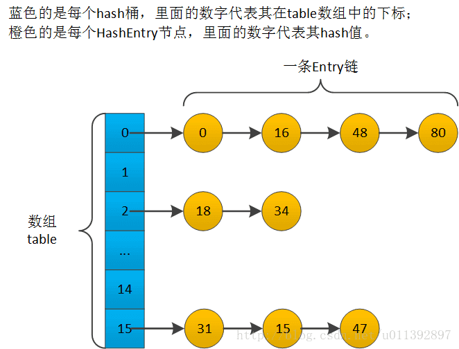
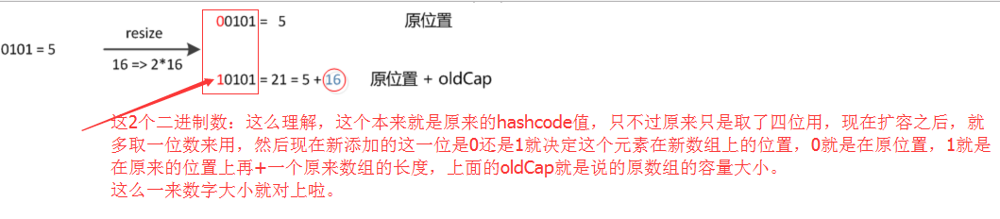
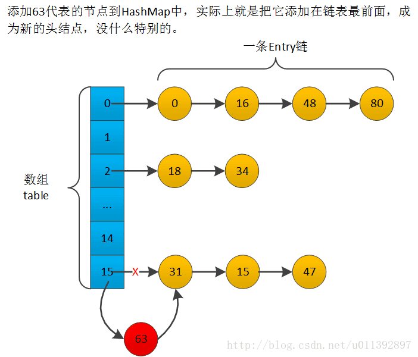
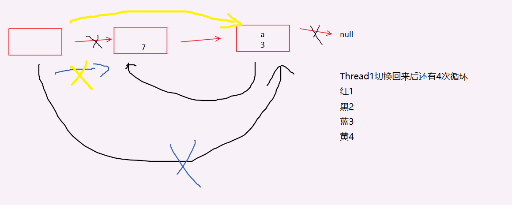

原文链接：https://blog.csdn.net/u011392897/article/details/60141790

# 一、基本性质

1. 基于哈希表的Map接口实现，使用链地址法处理hash冲突。如果hash函数绝对随机均匀，那么基本操作（get和put）的时间性能基本是恒定的。迭代操作所需的时间大致与HashMap的容量（hash桶的个数，table.length）和K-V对的数量（size）的 和 成正比，因此，如果迭代性能很重要，不要将初始容量设置得太高（或负载系数太低）。
2. HashMap有两个影响其性能的参数：初始容量initCapacity，和负载因子loadFactor。容量是哈希表中的hash桶的个数，initCapacity只是创建哈希表时的容量，loadFactor是衡量哈希表在扩容之前允许达到多少的量度。当哈希表中的条目数量超过loadFactor和当前容量capcity的乘积threshold时，哈希表会扩容为两倍的大小，并且进行重新散列（重建内部数据结构，各个K-V对重新存储到新的哈希表中）。默认负载因子0.75在时间成本和空间成本之间提供了良好的平衡。较高的值loadFactor会减少空间开销，但会增加查找成本（反映在HashMap类的大多数操作中，包括get和put）。在设置其初始容量时，应考虑映射中的预期条目数（size）及其负载因子（loadFactor），提前设置好。这样能尽量节省空间，并且减少扩容次数，提高HashMap整体存储效率。
3. 允许null key和null value，null key总是放在第一个hash桶中。
4. 非同步，可以使用Collections.synchronizedMap包装下进行同步，这样具体实现还是使用HashMap的实现；也可以使用Hashtable，它的方法是同步的，但是实现上可能和HashMap有区别；多数场景下，可以使用ConcurrentHashMap。
5. 跟ArrayList一样，HashMap的迭代器是fail-fast迭代器。
6. 实现Cloneable接口，可clone。
7. 实现Serializable接口，可序列化/反序列化。
8. HashMap中，Key的hash值（hashCode）会优先于 == 和 equals，这一点后面有解释。

基本结构的简单示意图，可以看下。



# 二、常量和变量

## 1、常量

```java
/** The default initial capacity - MUST be a power of two. */
static final int DEFAULT_INITIAL_CAPACITY = 16; // 数组table的默认初始化大小，容量必须是2^n形式的数
 
/**
 * The maximum capacity, used if a higher value is implicitly specified  by either of the constructors with arguments. 
 * MUST be a power of two <= 1<<30.
 */
static final int MAXIMUM_CAPACITY = 1 << 30; // hash桶最大数量（table数组的最大长度），size超过此数量之后无法再扩容了
 
/**  The load factor used when none specified in constructor. */ 
static final float DEFAULT_LOAD_FACTOR = 0.75f; // 默认加载因子
```

## 2、变量

```java
/** The table, resized as necessary. Length MUST Always be a power of two. */
transient Entry[] table; // 底层的hash桶数组，长度必须是2^n，容量不足时可以扩容
 
/** The number of key-value mappings contained in this map. */
transient int size; // K-V对的数量。注意，为了兼容size方法才使用int，HashMap的实际size可能会大于Integer.MAX_VALUE，理论上long类型才是比较好的值，实际中大多数int型也够用
 
/** The next size value at which to resize (capacity * load factor). */
int threshold; // 扩容阈值，一般值为table.length * loadFactor，不能扩容时使用Integer.MAX_VALUE来表示后续永远不会扩容
 
/** The load factor for the hash table. */
final float loadFactor; // 加载因子，注意，此值可以大于1
 
/**
 * The number of times this HashMap has been structurally modified
 * Structural modifications are those that change the number of mappings in
 * the HashMap or otherwise modify its internal structure (e.g.,
 * rehash).  This field is used to make iterators on Collection-views of
 * the HashMap fail-fast.  (See ConcurrentModificationException).
 */
transient volatile int modCount; // 大多数实现类都有的modCount，虽然是volatile，但是该类不考虑并发，因此不能保证很好的可见性
 
private transient Set<Map.Entry<K,V>> entrySet = null;
// keySet values继承使用AbstractMap的父类的属性
```

# 三、基本类

也就是每个K-V对的包装类，也叫作节点，比较基础的类。

```java
//	java.util.HashMap.Entry
static class Entry<K,V> implements Map.Entry<K,V> {
    final K key;
    V value;
    Entry<K,V> next;
    final int hash; // final的，扩容时hash值还是使用的旧值，只是重新计算索引再散列
 
    Entry(int h, K k, V v, Entry<K,V> n) {
        value = v;
        next = n;
        key = k;
        hash = h;
    }
 
    public final K getKey() {
        return key;
    }
 
    public final V getValue() {
        return value;
    }
 
    public final V setValue(V newValue) {
        V oldValue = value;
        value = newValue;
        return oldValue;
    }
 
    public final boolean equals(Object o) {
        if (!(o instanceof Map.Entry))
            return false;
        Map.Entry e = (Map.Entry)o;
        Object k1 = getKey();
        Object k2 = e.getKey();
        if (k1 == k2 || (k1 != null && k1.equals(k2))) {
            Object v1 = getValue();
            Object v2 = e.getValue();
            if (v1 == v2 || (v1 != null && v1.equals(v2)))
                return true;
        }
        return false;
    }
 
    public final int hashCode() {
        return (key==null   ? 0 : key.hashCode()) ^ (value==null ? 0 : value.hashCode());
    }
 
    public final String toString() {
        return getKey() + "=" + getValue();
    }
 
    // 提供给子类实现的方法，在LinkedHashMap中有实现
    void recordAccess(HashMap<K,V> m) {}
    void recordRemoval(HashMap<K,V> m) {}
}
```

# 四、构造方法与初始化

```java
// 1.6的构造方法是会真正初始化数组的，到了1.7就开始使用懒初始化，在第一次进行put/putAll等操作时才会真正初始化table数组
public HashMap(int initialCapacity, float loadFactor) {
    if (initialCapacity < 0)
        throw new IllegalArgumentException("Illegal initial capacity: " + initialCapacity);
    if (initialCapacity > MAXIMUM_CAPACITY)
        initialCapacity = MAXIMUM_CAPACITY;//最大容量
    if (loadFactor <= 0 || Float.isNaN(loadFactor))
        throw new IllegalArgumentException("Illegal load factor: " + loadFactor);
 
    // Find a power of 2 >= initialCapacity
    int capacity = 1;
    while (capacity < initialCapacity) // 用循环找出满足的2^n，实际的开辟的空间要大于等于传入的第一个参数的值
        capacity <<= 1;
 
    this.loadFactor = loadFactor;
    threshold = (int)(capacity * loadFactor);
    table = new Entry[capacity]; // 真正初始化table数组
    init(); // 这个方法里面什么都没做
}
 
public HashMap(int initialCapacity) {
    this(initialCapacity, DEFAULT_LOAD_FACTOR);
}
 
// 默认构造方法，相当于new HashMap(16, 0.75f)
public HashMap() {
    this.loadFactor = DEFAULT_LOAD_FACTOR;
    threshold = (int)(DEFAULT_INITIAL_CAPACITY * DEFAULT_LOAD_FACTOR);
    table = new Entry[DEFAULT_INITIAL_CAPACITY]; // 真正初始化数组
    init();
}
 
// loadFactor使用默认值0.75f，因为m是接口类型，可能没有loadFactor这个属性
public HashMap(Map<? extends K, ? extends V> m) {
    this(Math.max((int) (m.size() / DEFAULT_LOAD_FACTOR) + 1, DEFAULT_INITIAL_CAPACITY), DEFAULT_LOAD_FACTOR);
    putAllForCreate(m); // 因为m是一个空的map
}
 
void init() {
}
 
// 特化的一个put，使用createEntry而不是addEntry，不会触发扩容（容量已经设置好了），也不会修改modCount
private void putForCreate(K key, V value) {
    int hash = (key == null) ? 0 : hash(key.hashCode());
    int i = indexFor(hash, table.length);
 
    /**
     * Look for preexisting entry for key.  This will never happen forclone or deserialize.
     * It will only happen for construction if the input Map is a sorted map whose ordering is inconsistent w/ equals.
     */
    // 因为不同的Map实现中判别“相等”的方式可能不一样，因此HashMap这里需要用自己的方式再比较下
    for (Entry<K,V> e = table[i]; e != null; e = e.next) {
        Object k;
        if (e.hash == hash && ((k = e.key) == key || (key != null && key.equals(k)))) {
            e.value = value;
            return;
        }
    }
 
    createEntry(hash, key, value, i);
}
 
private void putAllForCreate(Map<? extends K, ? extends V> m) {
    for (Iterator<? extends Map.Entry<? extends K, ? extends V>> i = m.entrySet().iterator(); i.hasNext();) {
        Map.Entry<? extends K, ? extends V> e = i.next();
        putForCreate(e.getKey(), e.getValue());
    }
}
 
// 在初始化时使用的一个特化的添加节点的方法
void createEntry(int hash, K key, V value, int bucketIndex) {
    Entry<K,V> e = table[bucketIndex];
    table[bucketIndex] = new Entry<K,V>(hash, key, value, e);
    size++;
}
```

# 五、一些内部方法

## hash定位

```java
/**  Returns index for hash code h. */
// hash桶定位方法，利用length = 2^n的特性，使用位运算加快速度
static int indexFor(int h, int length) {
    return h & (length-1);
}
```

- 这个方法就是用来把hash值散列到table数组某个位置的方法。

  HashMap是利用哈希表来加速查找的集合类。它当中使用的hash值是一个32bit的整数，而HashMap的hash桶的初始数目为16，是无法跟全部整数一一对应的，因此需要根据hash值进行散列，使得不同Entry能均匀存储到所有hash桶中。最常见的散列方式就是用hash值对hash桶的数目进行取模。十进制中常用的取模方法是%，是用除法实现的。对于2^n这种数，可以利用位运算取模，具体的做法就是 & (2^n-1)。因为除以2^n相当于右移n位，%2^n相当于保留最低的n位，而(2^n-1)这种数的最低的n位1，%2^n就相当于 &(2^n-1)。(2^n-1)这种二进制中有效的1都是从最低位开始连续的1，跟网络中的子网掩码很像（子网掩码是从高位开始），有个比较高大上的说法叫做"低位hash掩码"。
  **Hashtable是利用取模运算**散列定位到hash桶的，虽然通用，但是效率比这HashMap低。

- **这个方法也是HashMap的容量一定要是2的整数次幂的一个原因。**

  length = capacity，length为2^n的话，h&(length-1)就相当于对length取模。同时(2^n - 1)这种数的所有bit为1的位都是连续的，这样进行 & 运算能够利用hash值中最低的n位中的所有位，也就是[0, 2^n - 1]所有值都能取到。& 运算的结果是这个hash桶在table数组的索引，因此也就能够利用table的所有空间 。如果不是2^n，那么hash掩码中最低n位就不全为1，会有0出现，这样进行 & 运算后这个0对应的位永远是0，就不能利用这一位的值，造成hash值散列到table中时不够均匀，table中会有无法被利用的空间。比如length为15，是个奇数，(length-1)为偶数14，最后一位为0，进行&运算后一定是偶数，造成所有table中所有奇数下标的位置无法被利用，浪费15 >> 1 = 7个空间，基本浪费了一半。

## hash函数

扰动函数

```java
/**
 * Applies a supplemental hash function to a given hashCode, which
 * defends against poor quality hash functions.  This is critical
 * because HashMap uses power-of-two length hash tables, that
 * otherwise encounter collisions for hashCodes that do not differ
 * in lower bits. Note: Null keys always map to hash 0, thus index 0.
 */
// HashMap自己的hash函数，是一个扰动函数，主要是为了避免hashCode方法设计的不够好导致hash冲突过多
// indexFor方法只能利用h的最低的n位的信息，因此使用移位来让低位能够附带一些高位的信息，充分利用hashCode的所有位的信息
static int hash(int h) {
    // This function ensures that hashCodes that differ only by
    // constant multiples at each bit position have a bounded
    // number of collisions (approximately 8 at default load factor).
    h ^= (h >>> 20) ^ (h >>> 12);
    return h ^ (h >>> 7) ^ (h >>> 4);
}
```

- 为什么HashMap不直接使用hashCode，非要自己写个hash函数呢？

  因为hashCode是个32bit数，存放到table数组中时，根据上面的table数组索引方法，可以知道只有最低n位（HashMap的容量为2^n）被利用到了，高位部分的信息都丢失了。假设直接使用hashCode，在节点很多，并且hashCode设计得比较好的情况下，低n位也会是随机且均匀分布的。但是在元素不太多、hashCode设计得很烂的情况下，低n位就不够随机均匀了，这让hash冲突变多，降低了各种方法的时间效率。
  HashMap中的hash算法基本就是把hashCode的高位与低位进行异或运算，让低位能够夹带一些高位的信息，尽量利用hashCode本身所有位的信息，来让indexFor方法的结果尽量随机均匀。多次进行这种运算，hashCode本身的影响就减少了，这也降低了hashCode设计得太差导致的不良影响 。

  这种函数一般叫作扰动函数，就是为了让数值本身的二进制信息变乱，某些位能够夹带一部分别的位的信息，得到一个bit位分布尽量随机均匀的新值，减少后续的hash散列冲突。

  如果是直接用%操作，并且除数尽量使用大的素数，就基本上能够利用hashCode的所有位了，让根据hash值散列到table数组时尽量均匀，这时候就不太依赖hash扰动函数了。Hashtable基本是就是这样做的（直接使用hashCode，中间多一个变符号操作），不过这样效率低，其他的一些使用length = 2^n特性的地方也会比HashMap慢不少。
  

# 六、扩容

jdk1.6的HashMap的扩容很简单，实现得很直接。两个步骤，先创建一个两倍长度的数组，然后把节点一个个重新散列定位一次。要说的都写注释了，其余的没什么单独好说的。

```java
// table数组扩容
void resize(int newCapacity) {
    Entry[] oldTable = table;
    int oldCapacity = oldTable.length;
    if (oldCapacity == MAXIMUM_CAPACITY) { // 数组达到最大长度时，不能再扩容了
        threshold = Integer.MAX_VALUE;
        return;
    }
 
    Entry[] newTable = new Entry[newCapacity];
    transfer(newTable); // 把旧数组上所有节点，重新移动到新数组上正确的地方
    table = newTable;
    threshold = (int)(newCapacity * loadFactor); // 重设阈值，注意这里有点问题。loadFactor可以大于1，newCapacity*loadFactor是个双精度浮点数double，
                                                 // 它可能大于Integer.MAX_VALUE，此时强转int后截取后几位后变小，造成后续马上再次扩容，浪费空间，有可能是接近1<<28、29的时候
}
 
// 基本思路是把旧数组的所有节点全都重新“添加”到新数组对应的hash桶中，经过rehash之后，元素的位置要么是在原位置，要么是在原位置再移动2次幂的位置。
// 1.6的实现很简单、直接、直观，后续版本有改良的实现
void transfer(Entry[] newTable) {
    Entry[] src = table;
    int newCapacity = newTable.length;
    for (int j = 0; j < src.length; j++) {
        Entry<K,V> e = src[j];
        if (e != null) {
            src[j] = null;
            // 这里是把原来的Entry链从头到尾一个个再“put”到新数组里面
            // jdk1.6的put是把新节点添加到Entry链的最前面，因此transfer执行后，还在同一条Entry链（只有两条可选，可以看下jdk1.8的注释，后面我也会说）上的节点的相对顺序会颠倒
            // 举个例子（数字为hash值，非真实值），扩容transfer前，table[0] = 16 -> 32 -> 48 -> 64 -> 80 -> 96，
            //     扩容新数组中变成两条了，一条是table[0] = 80 -> 48 -> 16，另一条是table[16] = 96 -> 64 -> 32
            // 16, 48, 80（32, 64, 96）还在同一条上，但是它们的相对顺序颠倒了，HashMap的整体的迭代顺序当然也变了，当然本身它ye不保证迭代顺序
            do {
                Entry<K,V> next = e.next;
                int i = indexFor(e.hash, newCapacity); // 没有重新计hash值，只是重新计算索引
                e.next = newTable[i];
                newTable[i] = e;
                e = next;
            } while (e != null);
        }
    }
}
```

# 七、常用方法

## get

get实现比较简单比较好理解，两个步骤，先indexFor定位到hash桶 -> 再进行链表遍历查找。

```java
public V get(Object key) {
    if (key == null) // key == null 的情况
        return getForNullKey();
    int hash = hash(key.hashCode());
    for (Entry<K,V> e = table[indexFor(hash, table.length)];  e != null;  e = e.next) { // indexFor定位hash桶
        Object k;
        if (e.hash == hash && ((k = e.key) == key || key.equals(k))) // 遍历链表查找
            return e.value;
    }
    return null;
}
 
// 处理 key == null 的情况
// 根据putForNullKey方法（后面说）可以知道，key == null的节点，一定放在index = 0的hash桶中，判断null要使用 "=="
private V getForNullKey() {
    for (Entry<K,V> e = table[0]; e != null; e = e.next) {
        if (e.key == null)
            return e.value;
    }
    return null;
}
```

这里专门说下get方法的一个疑问。那就是for循环中的这句代码：
    1.6的：`if (e.hash == hash && ((k = e.key) == key || key.equals(k)))`
后续版本也有：
    1.7的：`if (e.hash == hash && ((k = e.key) == key || (key != null && key.equals(k))))`
    1.8的：`if (e.hash == hash && ((k = e.key) == key || (key != null && key.equals(k))))`

- 个人关注的疑问是这个： e.hash == hash 这句是否多余？

  Java中equals和hashCode的通常规定：==为true ---> equals为true，equals为true ---> hashCode相等，==为true ---> hashCode相等（具体看api docs中Object类的说明）。后面的一个判断 ((k = e.key) == key || key.equals(k)) 就是判断key和e.key是否equals（就是通常意义上的“相等”，null使用==，非null使用equals，已经说了这里的key不可能为null）。那么如果后面的条件返回true，则有 == 或者 equals必定有一个返回true。再按照上面的通常规定，可以知道hashCode也是一样的，运算得到的hash也一样，那么e.hash == hash就不用比较了一定是true。
  这个e.hash == hash存在的比较合理的解释就是突出hashCode的作用，明确表示：**在HashMap（以及其他的HashXXX）中，Key的hash值**（hash值是根据hashCode算出来的，这里也可以理解为hashCode）**的优先于==和equals**。HashXXX中在查找key是否”相等“时，先使用hash值（可以理解为hashCode）判断一次，hash值相等时，再才使用==或者equals判断。如果一开始比较hash值就不相等，那么就是认为是不“相等”的对象，不再去管 == 或者equals。如果hash值相等，但是equals/==判断为不等，这种也视为“不相等”。

  虽然HashXXX中hashCode优先，但是平时还是不要用这一点，非常迷惑人。而在其他的大多数情况下，==和equals是优先于hashCode的，判断对象相等基本上都是直接使用 ==或者equals，根本不使用hashCode。 所以大家还是要尽量遵守equals和hashCode的通常规定，不要写出奇怪的equals和hashCode方法，同时尽**量避免修改已经放到HashXXX中的对象中会改变hashCode和equals结果的field**。大多数情况，使用不变类，比如String、Integer等，充当key是一个很好的选择。

- **例子**

  因为修改了，field，导致hash变化，实际上还是相同的对象，三个相同的key，前两个没用了。

  ```java
  // jdk1.8，请使用1.8运行，1.8的hash函数比较简单，容易构造数据
  // 需要用调试器才看得出来在同一条Entry链上，请使用调试器
  public class TestHashCode {
      public static void main(String[] args) {
          Key k = new Key();
          Map<Key, String> map = new HashMap<>();
          map.put(k, "1");
          k.i = 2; // 修改hashCode
          map.put(k, "2"); // 现在put了两个key "equals 且 ==" 的K-V对，hashCode不一样，实际hash值
          k.i = 16; // 修改hashCode
          map.put(k, "16"); // 现在put了三个key "equals 且 ==" 的K-V对，并且第三个跟第一个在同一条Entry链（index = 0）上，hashCode不一样，实际hash值也不一样
          System.err.println(map); // 现在这个HashMap有三个K-V对，它们的key都是 "equals 且 ==" 的 ，但是它们的hashCode各不同，算出来的hash值不一样，在HashMap中这"三个"key是不"相等"的
   
          Key newK = new Key();
          newK.i = 16;
          map.put(newK, "new16");
          System.err.println(map); // 又添加了一个，并且也在index = 0的Entry链上，它的hash值和第三个相等，但是equals判断不相等，所以在HashMap看来它跟第三个是不"相等"的
          // 因为Key的toString是直接使用Object.toString()，会用到hashCode，因此打印出来的结果中，四个K-V的key看上去都是一样的
      }
   
      static class Key {
          int i = 0;
          public int hashCode() {
              return i;
          }
      }
  }
  ```

  

## put

实现比较简单。四个步骤，先indexFor定位到hash桶 -> 再进行链表遍历查找，确定是否添加 -> 如果添加就添加在链表头 -> 扩容判断。要说的都写注释上面了。

```java
public V put(K key, V value) {
    if (key == null) // 处理 key == null 的情况，不能调用hash函数，所以设置特别设置为0
        return putForNullKey(value);
    int hash = hash(key.hashCode());
    int i = indexFor(hash, table.length); // 根据hash找出bucket在数组的位置，相当于int i = hash % Entry[].length，但更快，位和运算
    // 先确认是否添加了“相等”的key
    for (Entry<K,V> e = table[i]; e != null; e = e.next) {
        Object k;
        if (e.hash == hash && ((k = e.key) == key || key.equals(k))) { // “相等”是指满足此条件，上面的hash方法中说了
            V oldValue = e.value;
            e.value = value;
            e.recordAccess(this); // 此方法HashMap中是空方法，留给子类实现
            return oldValue;
        }
    }
 
    modCount++; // 先放在addEntry前面，不如放在后面更好保证可见性
    addEntry(hash, key, value, i); // 执行真正的添加操作
    return null; // 新添加的key，没有旧的value，返回null
}
 
// 处理 key == null 的情况，总是把它放在index = 0的hash桶中
private V putForNullKey(V value) {
    // 先确认是否已经添加了null key
    for (Entry<K,V> e = table[0]; e != null; e = e.next) {
        if (e.key == null) {
            V oldValue = e.value;
            e.value = value;
            e.recordAccess(this);
            return oldValue;
        }
    }
    modCount++;
    addEntry(0, null, value, 0); // 执行真正的添加操作
    return null;
}
 
// 在Entry链的头部插入新的节点，并检查是否需要扩容
void addEntry(int hash, K key, V value, int bucketIndex) {
    Entry<K,V> e = table[bucketIndex];
    table[bucketIndex] = new Entry<K,V>(hash, key, value, e); // 先把新的节点添加进去
    if (size++ >= threshold) // 然后判断是否要扩容，在把size加1
        resize(2 * table.length); // 把第(threshold + 1)个添加了再扩容为2倍大小（例如，默认构造的HashMap时，在执行put第13个key互不“相等”的K-V时扩容）
}
```



## putAll

```java
public void putAll(Map<? extends K, ? extends V> m) {
    int numKeysToBeAdded = m.size();
    if (numKeysToBeAdded == 0)
        return;

    	/* 根据m.size()决定是否resize
    	 *
         * Expand the map if the map if the number of mappings to be added
         * is greater than or equal to threshold.  This is conservative; the
         * obvious condition is (m.size() + size) >= threshold, but this
         * condition could result in a map with twice the appropriate capacity,
         * if the keys to be added overlap with the keys already in this map.
         * By using the conservative calculation, we subject ourself
         * to at most one extra resize.		因为已经处理了 m.size() 和threshold最多的情况，resize一次完全可以覆盖另一个
         */
    if (numKeysToBeAdded > threshold) {
        int targetCapacity = (int)(numKeysToBeAdded / loadFactor + 1); // 加1是为了有预留空间，避免下一次put就立即扩容
        if (targetCapacity > MAXIMUM_CAPACITY)
            targetCapacity = MAXIMUM_CAPACITY;
        int newCapacity = table.length;
        while (newCapacity < targetCapacity)
            newCapacity <<= 1;
        if (newCapacity > table.length)
            resize(newCapacity);
    }
 
    //添加过程最多resize一次
    for (Iterator<? extends Map.Entry<? extends K, ? extends V>> i = m.entrySet().iterator(); i.hasNext(); ) {
        Map.Entry<? extends K, ? extends V> e = i.next();
        put(e.getKey(), e.getValue());
    }
}
```


## remove

两个步骤，先indexFor定位hash桶 -> 然后遍历链表，找到“相等的就删除”。

```java
public V remove(Object key) {
    Entry<K,V> e = removeEntryForKey(key);
    return (e == null ? null : e.value);
}
 
// 就是链表中节点的删除，很简单
final Entry<K,V> removeEntryForKey(Object key) {
    int hash = (key == null) ? 0 : hash(key.hashCode()); // 计算hash值
    int i = indexFor(hash, table.length); // 定位hash桶
    Entry<K,V> prev = table[i];
    Entry<K,V> e = prev;
 
    while (e != null) { // 遍历链表寻找key“相等”的节点
        Entry<K,V> next = e.next;
        Object k;
        if (e.hash == hash && ((k = e.key) == key || (key != null && key.equals(k)))) {
            modCount++;
            size--;
            // 修改指针，删除节点
            if (prev == e)
                table[i] = next;
            else
                prev.next = next;
            e.recordRemoval(this); // 这个方法交给子类实现
            return e;
        }
        prev = e;
        e = next;
    }
 
    return e;
}
```

## 其他

都比较简单，也没什么好说的。

```java
public int size() {
    return size;
}
 
public boolean isEmpty() {
    return size == 0;
}
 
public boolean containsKey(Object key) {
    return getEntry(key) != null;
}
 
public void clear() {
    modCount++;
    Entry[] tab = table;
    for (int i = 0; i < tab.length; i++)
        tab[i] = null;
    size = 0;
}
 
// 分null、非null两种情况判断，也很好理解
public boolean containsValue(Object value) {
    if (value == null)
        return containsNullValue();
 
    Entry[] tab = table;
    for (int i = 0; i < tab.length ; i++)
        for (Entry e = tab[i] ; e != null ; e = e.next)
            if (value.equals(e.value))
                return true;
    return false;
}
 
// 处理null value的情况
private boolean containsNullValue() {
    Entry[] tab = table;
    for (int i = 0; i < tab.length ; i++)
        for (Entry e = tab[i] ; e != null ; e = e.next)
            if (e.value == null)
                return true;
    return false;
}
```

# 八、视图以及迭代器

## entrySet()

doc和其他的都很相似

Returns a **Set view** of the mappings contained in this map. The set is backed by the map, so changes to the map are reflected in the set, and vice-versa. 

If the map is modified while an iteration over the set is in progress (except through the iterator's own remove operation, or through the setValue operation on a map entry returned by the iterator) the results of the iteration are undefined. The set supports element removal, which removes the corresponding mapping from the map, via the `Iterator.remove, Set.remove, removeAll, retainAll and clear` operations. It does not support the add or addAll operations.

entrySet只是一个视图，每次迭代都是需要`new`一个`Iterator`

强一致性视图，并且再迭代过程中不能通过map的方法进行写，不然有可能修改modcount，不然会报错。

```java
//获取entrySet视图的iterator，进行for each循环

	public Set<Map.Entry<K,V>> entrySet() {
		return entrySet0();
    }

    private Set<Map.Entry<K,V>> entrySet0() {
        Set<Map.Entry<K,V>> es = entrySet;
        return es != null ? es : (entrySet = new EntrySet());
    }
	
	//具体的EntrySet类，私有的类
    private final class EntrySet extends AbstractSet<Map.Entry<K,V>> {
        //获取iterator
        public Iterator<Map.Entry<K,V>> iterator() {
            return newEntryIterator();
        }
        public boolean contains(Object o) {
            if (!(o instanceof Map.Entry))
                return false;
            Map.Entry<K,V> e = (Map.Entry<K,V>) o;
            Entry<K,V> candidate = getEntry(e.getKey());
            return candidate != null && candidate.equals(e);
        }
        public boolean remove(Object o) {
            return removeMapping(o) != null;
        }
        public int size() {
            return size;
        }
        public void clear() {
            HashMap.this.clear();
        }
    }
	//返回的iterator，for reach循环需要用到
    Iterator<Map.Entry<K,V>> newEntryIterator()   {
        return new EntryIterator();
    }
```

```java
//真正的iterator，还有父类HashIterator，里面实现的操作

    private final class EntryIterator extends HashIterator<Map.Entry<K,V>> {
        public Map.Entry<K,V> next() {
            return nextEntry();
        }
    }

    private abstract class HashIterator<E> implements Iterator<E> {
        Entry<K,V> next;	// next entry to return
        int expectedModCount;	// For fast-fail
        int index;		// current slot，从1开始算起
        Entry<K,V> current;	// current entry

        //构造器
        HashIterator() {
            expectedModCount = modCount;//volatile，可以保证一定的可见性，但是设计不好，很难
            if (size > 0) { // advance to first entry
                Entry[] t = table;
                while (index < t.length && (next = t[index++]) == null)//找到第一个非空的entry，准备输出
                    ;
            }
        }
		
        //是否有下一个
        public final boolean hasNext() {
            return next != null;
        }

        //调用nextEntry()后得到的entry设置current，并且找到下一个next
        final Entry<K,V> nextEntry() {
            if (modCount != expectedModCount) //快速失败机制，不能有并发修改
                throw new ConcurrentModificationException();
            Entry<K,V> e = next;
            if (e == null)//如果为null说明已经历尽，会报错，因此需要先调用hasNext()
                throw new NoSuchElementException();

            if ((next = e.next) == null) {//下一个非null的entry，链条没了就下一个slot
                Entry[] t = table;
                while (index < t.length && (next = t[index++]) == null)
                    ;
            }
	   		current = e;
            return e;
        }

        //该方法是删除当前已经得到的一个entry
        //解释：remove的是current，因此一开始至少需要调用一次nextEntry()得到current才可以remove；之后current重置为null，因此需要继续nextEntry()才可以得到current，不然报错
        public void remove() {
            if (current == null)
                throw new IllegalStateException();
            if (modCount != expectedModCount)
                throw new ConcurrentModificationException();
            Object k = current.key;
            current = null;
            HashMap.this.removeEntryForKey(k);
            expectedModCount = modCount;
        }

    }
```

# 死循环

https://coolshell.cn/articles/9606.html#comments

#### 问题的症状

从前我们的Java代码因为一些原因使用了HashMap这个东西，但是当时的程序是单线程的，一切都没有问题。后来，我们的程序性能有问题，所以需要变成多线程的，于是，变成多线程后到了线上，发现程序经常占了100%的CPU，查看堆栈，你会发现程序都Hang在了HashMap.get()这个方法上了，重启程序后问题消失。但是过段时间又会来。而且，这个问题在测试环境里可能很难重现。

我们简单的看一下我们自己的代码，我们就知道HashMap被多个线程操作。而Java的文档说HashMap是非线程安全的，应该用ConcurrentHashMap。

但是在这里我们可以来研究一下原因。


#### Hash表数据结构

我需要简单地说一下HashMap这个经典的数据结构。

HashMap通常会用一个指针数组（假设为table[]）来做分散所有的key，当一个key被加入时，会通过Hash算法通过key算出这个数组的下标i，然后就把这个<key, value>插到table[i]中，如果有两个不同的key被算在了同一个i，那么就叫冲突，又叫碰撞，这样会在table[i]上形成一个链表。

我们知道，如果table[]的尺寸很小，比如只有2个，如果要放进10个keys的话，那么碰撞非常频繁，于是一个O(1)的查找算法，就变成了链表遍历，性能变成了O(n)，这是Hash表的缺陷（可参看《[Hash Collision DoS 问题](https://coolshell.cn/articles/6424.html)》）。

所以，Hash表的尺寸和容量非常的重要。一般来说，Hash表这个容器当有数据要插入时，都会检查容量有没有超过设定的thredhold，如果超过，需要增大Hash表的尺寸，但是这样一来，整个Hash表里的无素都需要被重算一遍。这叫rehash，这个成本相当的大。

相信大家对这个基础知识已经很熟悉了。

#### HashMap的rehash源代码

下面，我们来看一下Java的HashMap的源代码。

Put一个Key,Value对到Hash表中：

```java
public V put(K key, V value)
{
    ......
    //算Hash值
    int hash = hash(key.hashCode());
    int i = indexFor(hash, table.length);
    //如果该key已被插入，则替换掉旧的value （链接操作）
    for (Entry<K,V> e = table[i]; e != null; e = e.next) {
        Object k;
        if (e.hash == hash && ((k = e.key) == key || key.equals(k))) {
            V oldValue = e.value;
            e.value = value;
            e.recordAccess(this);
            return oldValue;
        }
    }
    modCount++;
    //该key不存在，需要增加一个结点
    addEntry(hash, key, value, i);
    return null;
}
```

检查容量是否超标

```java
void addEntry(int hash, K key, V value, int bucketIndex)
{
    Entry<K,V> e = table[bucketIndex];
    table[bucketIndex] = new Entry<K,V>(hash, key, value, e);
    //查看当前的size是否超过了我们设定的阈值threshold，如果超过，需要resize
    if (size++ >= threshold)
        resize(2 * table.length);
}
```

新建一个更大尺寸的hash表，然后把数据从老的Hash表中迁移到新的Hash表中。

```java
void resize(int newCapacity)
{
    Entry[] oldTable = table;
    int oldCapacity = oldTable.length;
    ......
    //创建一个新的Hash Table
    Entry[] newTable = new Entry[newCapacity];
    //将Old Hash Table上的数据迁移到New Hash Table上
    transfer(newTable);
    table = newTable;
    threshold = (int)(newCapacity * loadFactor);
}
```

迁移的源代码，注意高亮处12-16：

```java
void transfer(Entry[] newTable)
{
    Entry[] src = table;
    int newCapacity = newTable.length;
    //下面这段代码的意思是：
    //  从OldTable里摘一个元素出来，然后放到NewTable中
    for (int j = 0; j < src.length; j++) {
        Entry<K,V> e = src[j];
        if (e != null) {
            src[j] = null;
            do {
                Entry<K,V> next = e.next;
                int i = indexFor(e.hash, newCapacity);
                e.next = newTable[i];
                newTable[i] = e;
                e = next;
            } while (e != null);
        }
    }
}
```

好了，这个代码算是比较正常的。而且没有什么问题。

#### 正常的ReHash的过程

画了个图做了个演示。

- 我假设了我们的hash算法就是简单的用key mod 一下表的大小（也就是数组的长度）。

- 最上面的是old hash 表，其中的Hash表的size=2, 所以key = 3, 7, 5，在mod 2以后都冲突在table[1]这里了。

- 接下来的三个步骤是Hash表 resize成4，然后所有的<key,value> 重新rehash的过程


#### 并发下的Rehash

**1）假设我们有两个线程。**我用红色和浅蓝色标注了一下。

我们再回头看一下我们的 transfer代码中的这个细节：

```java
do {
    Entry<K,V> next = e.next; // <--假设线程一执行到这里就被调度挂起了
    int i = indexFor(e.hash, newCapacity);
    e.next = newTable[i];
    newTable[i] = e;
    e = next;
} while (e != null);
```

而我们的线程二执行完成了。于是我们有下面的这个样子。


注意，**因为Thread1的 e 指向了key(3)，而next指向了key(7)，其在线程二rehash后，指向了线程二重组后的链表**。我们可以看到链表的顺序被反转后。

**2）线程一被调度回来执行。**

- **先是执行 newTalbe[i] = e;**
- **然后是e = next，导致了e指向了key(7)，**
- **而下一次循环的next = e.next导致了next指向了key(3)**


**3）一切安好。**

线程一接着工作。**把key(7)摘下来，放到newTable[i]的第一个，然后把e和next往下移**。


**4）环形链接出现。**

**e.next = newTable[i] 导致 key(3).next 指向了 key(7)**

**注意：此时的key(7).next 已经指向了key(3)， 环形链表就这样出现了。**


**于是，当我们的线程一调用到，HashTable.get(11)时，悲剧就出现了——Infinite Loop。**

#### **我的作图**



#### 其它

有人把这个问题报给了Sun，不过Sun不认为这个是一个问题。因为HashMap本来就不支持并发。要并发就用ConcurrentHashmap

http://bugs.sun.com/bugdatabase/view_bug.do?bug_id=6423457

我在这里把这个事情记录下来，只是为了让大家了解并体会一下并发环境下的危险。

参考：http://mailinator.blogspot.com/2009/06/beautiful-race-condition.html

### 问题

> 未解决

1、此处我觉得网友huxb23@126的一篇文章说的很好，分析多线程并发写HashMap线程被hang住的原因 ，因为是优秀的资源，此处我整理下搬到这儿。

以下内容转自博文：http://blog.163.com/huxb23@126/blog/static/625898182011211318854/ 

先看原问题代码：


```java
import java.util.HashMap;
 
public class TestLock {
 
	private HashMap map = new HashMap();
 
	public TestLock() {
		Thread t1 = new Thread() {
			public void run() {
				for (int i = 0; i < 50000; i++) {
					map.put(new Integer(i), i);
				}
				System.out.println("t1 over");
			}
		};
 
		Thread t2 = new Thread() {
			public void run() {
				for (int i = 0; i < 50000; i++) {
					map.put(new Integer(i), i);
				}
 
				System.out.println("t2 over");
			}
		};
 
		t1.start();
		t2.start();
 
	}
 
	public static void main(String[] args) {
		new TestLock();
	}
}
```


就是启了两个线程，不断的往一个非线程安全的HashMap中put内容，put的内容很简单，key和value都是从0自增的整数（这个put的内容做的并不好，以致于后来干扰了我分析问题的思路）。对HashMap做并发写操作，我原以为只不过会产生脏数据的情况，但反复运行这个程序，会出现线程t1、t2被hang住的情况，多数情况下是一个线程被hang住另一个成功结束，偶尔会两个线程都被hang住。说到这里，你如果觉得不好好学习ConcurrentHashMap而在这瞎折腾就手下留情跳过吧。
好吧，分析下HashMap的put函数源码看看问题出在哪，这里就罗列出相关代码（jdk1.6）：

```java
  public V put(K paramK, V paramV)
  {
    if (paramK == null)
      return putForNullKey(paramV);
    int i = hash(paramK.hashCode());
    int j = indexFor(i, this.table.length);
    for (Entry localEntry = this.table[j]; localEntry != null; localEntry = localEntry.next)
    {
      if (localEntry.hash == i) { java.lang.Object localObject1;
        if (((localObject1 = localEntry.key) == paramK) || (paramK.equals(localObject1))) {
          java.lang.Object localObject2 = localEntry.value;
          localEntry.value = paramV;
          localEntry.recordAccess(this);
          return localObject2;
        }
      }
    }
    this.modCount += 1;
    addEntry(i, paramK, paramV, j);
    return null;
  }
 
  private V putForNullKey(V paramV)
  {
    for (Entry localEntry = this.table[0]; localEntry != null; localEntry = localEntry.next)
      if (localEntry.key == null) {
        java.lang.Object localObject = localEntry.value;
        localEntry.value = paramV;
        localEntry.recordAccess(this);
        return localObject;
      }
 
    this.modCount += 1;
    addEntry(0, null, paramV, 0);
    return null;
  }
```


通过jconsole（或者thread dump），可以看到线程停在了transfer方法的while循环处。这个transfer方法的作用是，当Map中元素数超过阈值需要resize时，它负责把原Map中的元素映射到新Map中。我修改了HashMap，加上了@标记2和@标记3的代码片断，以打印出死循环时的状态，结果死循环线程总是出现类似这样的输出：“Thread-1,e==next:false,e==next.next:true,e:108928=108928,next:108928=108928,eq:true”。
这个输出表明：
1）这个Entry链中的两个Entry之间的关系是：e=e.next.next，造成死循环。
2）e.equals(e.next)，但e!=e.next。因为测试例子中两个线程put的内容一样，并发时可能同一个key被保存了多个value，这种错误是在addEntry函数产生的，但这和线程死循环没有关系。

接下来就分析transfer中那个while循环了。先所说这个循环正常的功能：src[j]保存的是映射成同一个hash值的多个Entry的链表，这个src[j]可能为null，可能只有一个Entry，也可能由多个Entry链接起来。假设是多个Entry，原来的链是(src[j]=a)->b（也就是src[j]=a,a.next=b,b.next=null），经过while处理后得到了(newTable[i]=b)->a。也就是说，把链表的next关系反向了。

再看看这个while中可能在多线程情况下引起问题的语句。针对两个线程t1和t2,这里它们可能的产生问题的执行序列做些个人分析：

1）假设同一个Entry列表[e->f->...]，t1先到，t2后到并都走到while中。t1执行“e.next = newTable[i];newTable[i] = e;”这使得e.next=null（初始的newTable[i]为null），newTable[i]指向了e。这时t2执行了“e.next = newTable[i];newTable[i] = e;”，这使得e.next=e，e死循环了。因为循环开始处的“final Entry next = e.next;”，尽管e自己死循环了，在最后的“e = next;”后，两个线程都会跳过e继续执行下去。

2）在while中逐个遍历Entry链表中的Entry而把next关系反向时，newTable[i]成为了被交换的引用，可疑的语句在于“e.next = newTable[i];”。假设链表e->f->g被t1处理成e<-f<-g，newTable[i]指向了g，这时t2进来了，它一执行“e.next = newTable[i];”就使得e->g，造成了死循环。所以，理论上来说，死循环的Entry个数可能很多。尽管产生了死循环，但是t1执行到了死循环的右边，所以是会继续执行下去的，而t2如果执行“final Entry next = e.next;”的next为null，则也会继续执行下去，否则就进入了死循环。

3）似乎情况会更复杂，因为即便线程跳出了死循环，它下一次做resize进入transfer时，有可能因为之前的死循环Entry链表而被hang住（似乎是一定会被hang住）。也有可能，在put检查Entry链表时（@标记1），因为Entry链表的死循环而被hang住。也似乎有可能，活着的线程和死循环的线程同时执行在while里后，两个线程都能活着出去。所以，可能两个线程平安退出，可能一个线程hang在transfer中，可能两个线程都被hang住而又不一定在一个地方。

4）我反复的测试，出现一个线程被hang住的情况最多，都是e=e.next.next造成的，这主要就是例子put两份增量数据造成的。我如果去掉@标记3的输出，有时也能复现两个线程都被hang住的情况，但加上后就很难复现出来。我又把put的数据改了下，比如让两个线程put范围不同的数据，就能复现出e=e.next，两个线程都被hang住的情况。

上面罗哩罗嗦了很多，一开始我简单的分析后觉得似乎明白了怎么回事，可现在仔细琢磨后似乎又不明白了许多。有一个细节是，每次死循环的key的大小也是有据可循的，我就不打哈了。感觉，如果样本多些，可能出现问题的原因点会很多，也会更复杂，我姑且不再蛋疼下去。至于有人提到ConcurrentHashMap也有这个问题，我觉得不大可能，因为它的put操作是加锁的，如果有这个问题就不叫线程安全的Map了。
————————————————
版权声明：本文为CSDN博主「终点」的原创文章，遵循 CC 4.0 BY-SA 版权协议，转载请附上原文出处链接及本声明。
原文链接：https://blog.csdn.net/zhangerqing/article/details/8193118


# 其他

### transient修饰Entry[] table

看一下`HashMap.get()/put()`知道, 读写Map是根据`Object.hashcode()`来确定从哪个`bucket`读/写. 而`Object.hashcode()`是`native`方法, 不同的JVM里可能是不一样的。

打个比方说, 向HashMap存一个entry, key为 字符串"STRING", 在第一个java程序里, "STRING"的hashcode()为1, 存入第1号bucket; 在第二个java程序里, "STRING"的hashcode()有可能就是2, 存入第2号bucket. 

如果用默认的串行化(Entry[] table不用transient), 那么这个HashMap从第一个java程序里通过串行化导入第二个java程序后, 其内存分布是一样的. 这就不对了. HashMap现在重写readObject和writeObject是把内容 输出/输入, 把HashMap重新生成出来.

重写的readObject和writeObject都是私有的。

# 最后

HashMap是重要的基础，HashSet/LingkedHashMap/LinkedHashSet/ConcurrentHashMap等等基本的集合类，都直接或者间接用到了HashMap。

之所以过来这么久，还要说1.6的，因为它简单清楚，把该说的都用尽量直接的方式说出来了。另外，也可以学习一下hash表这种数据结构，离开书本后hash表的学习的第一站，用HashMap是个很好的选择。

# 参考文献

[老生常谈，HashMap的死循环](https://www.jianshu.com/p/1e9cf0ac07f4)