https://blog.csdn.net/u011392897/article/details/60151323

https://blog.csdn.net/v123411739/article/details/78996181

https://blog.csdn.net/qq_36520235/article/details/82417949

# 零、主要改动

相对于1.7：
1. 处理hash冲突的方式变化，当一条链表太长时，转化为红黑树保存，提高hash冲突时的查找速度，也就提升了几个主要的方法的速度。
2. hashseed相关的都去掉了，Node（就是Entry）的hash又变回final了。
3. 一些方法、类的名称的变化，比如Entry变成Node。
4. Map接口1.8新增了几个普通的方法，完善了Map的操作。
5. 函数式编程、Stream相关的方法（这块就先不说了）。
6. 链表添加时，新节点会放在链表末尾，而不是像1.6/1.7一样放在头部；扩容操作也会尽量保证扩容后还在同一条链表上的节点之间的相对顺序不变。
7. 修复之前的一些小问题，加上其他的一些小改动。

# 提要

1. 本文中头节点指的是 table 表上索引位置的节点，也就是链表的头节点。

2. 根节点（root 节点）指的是红黑树最上面的那个节点，也就是没有父节点的节点。

3. 红黑树的根节点不一定是索引位置的头节点（也就是链表的头节点），HashMap 通过 moveRootToFront 方法来维持红黑树的根结点就是索引位置的头结点，但是在 removeTreeNode 方法中，当 movable 为 false 时，不会调用 moveRootToFront 方法，此时红黑树的根节点不一定是索引位置的头节点，该场景发生在 HashIterator 的 remove 方法中。

4. 转为红黑树节点后，链表的结构还存在，通过 next 属性维持，红黑树节点在进行操作时都会维护链表的结构，并不是转为红黑树节点，链表结构就不存在了。

5. 在红黑树上，叶子节点也可能有 next 节点，因为红黑树的结构跟链表的结构是互不影响的，不会因为是叶子节点就说该节点已经没有 next 节点。

6. 源码中一些变量定义：如果定义了一个节点 p，则 pl（p left）为 p 的左节点，pr（p right）为 p 的右节点，pp（p parent）为 p 的父节点，ph（p hash）为 p 的 hash 值，pk（p key）为 p 的 key 值，kc（key class）为 key 的类等等。源码中很喜欢在 if/for 等语句中进行赋值并判断，请注意。

7. 链表中移除一个节点只需如下图操作，其他操作同理。

   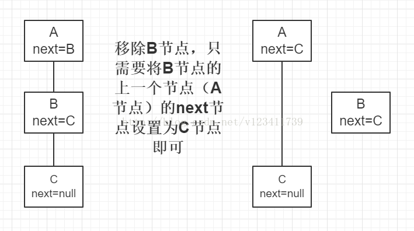

8. 红黑树在维护链表结构时，移除一个节点只需如下图操作（红黑树中增加了一个 prev 属性），其他操作同理。注：此处只是红黑树维护链表结构的操作，红黑树还需要单独进行红黑树的移除或者其他操作。

   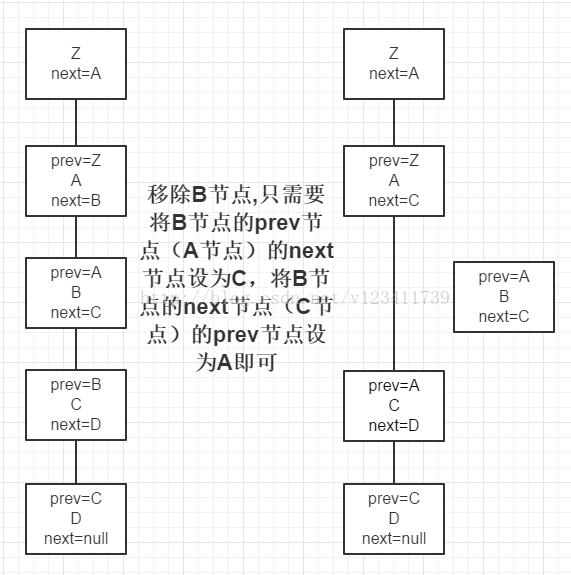

9. 源码中进行红黑树的查找时，会反复用到以下两条规则：1）如果目标节点的 hash 值小于 p 节点的 hash 值，则向 p 节点的左边遍历；否则向 p 节点的右边遍历。2）如果目标节点的 key 值小于 p 节点的 key 值，则向 p 节点的左边遍历；否则向 p 节点的右边遍历。这两条规则是利用了红黑树的特性（左节点 < 根节点 < 右节点）。

10. 源码中进行红黑树的查找时，会用 dir（direction）来表示向左还是向右查找，dir 存储的值是目标节点的 hash/key 与 p 节点的 hash/key 的比较结果。

# 一、基本性质

主要改动中，对实现影响最大的就是红黑树这块，这只影响结构和性能，不影响其他的使用，主要方法是整体逻辑基本没变化，其余的没什么改变。

整体结构和1.6/1.7的有些区别，多了红黑树这块的，下面简单画了个示意图。

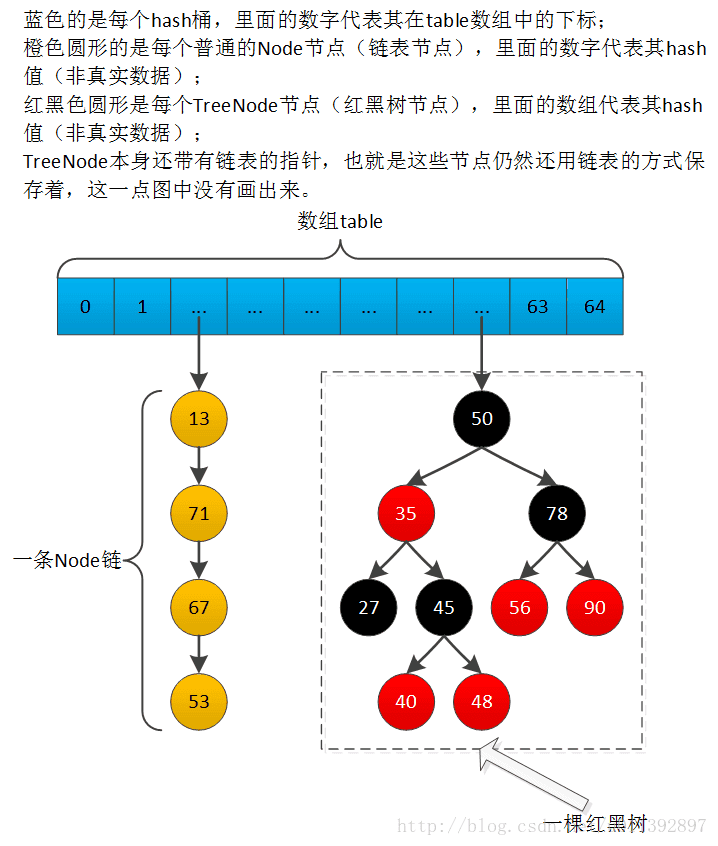

# 二、常量和变量

## 1、常量

新增红黑树有关的三个常量。

```java
static final int DEFAULT_INITIAL_CAPACITY = 1 << 4; // aka 16
static final int MAXIMUM_CAPACITY = 1 << 30;
static final float DEFAULT_LOAD_FACTOR = 0.75f;
 
// 如果一个hash桶中的节点达到这个值，下次添加新节点时，会把这个hash桶的所有节点用红黑树保存
// 如果数组table的长度不足64，那么也不转化为红黑树，改为扩容一次
static final int TREEIFY_THRESHOLD = 8;
 
// 如果一棵红黑树的节点减少到这个值，那么就把它退化为链表保存
static final int UNTREEIFY_THRESHOLD = 6;
 
// 转化为红黑树的另一个条件。table的长度不足这个值时，不转化为红黑树，改为扩容一次
static final int MIN_TREEIFY_CAPACITY = 64;
```

## 2、变量

没什么改变，跟1.7的同名属性一样。

```java
transient Node<K,V>[] table;
transient int size;
transient int modCount;
int threshold;
final float loadFactor;
transient Set<Map.Entry<K,V>> entrySet;
```

# 三、基本类

## Node

普通节点。它就是之前版本的Entry，hash又变回final了。

```java
// jdk1.6的HashMap.Entry改了个名字而已，其余一样
static class Node<K,V> implements Map.Entry<K,V> {
    final int hash; // hash值又变回final了，1.7的不是final的，1.6的是final的
    final K key;
    V value;
    Node<K,V> next;
 
    // 后面的方法一样
}
```

## TreeNode

红黑树节点。因为是重要改动，代码本身比较多，就放在后面了。

# 四、构造方法

本身比较简单，没什么好说的。

```java
/** Returns a power of two size for the given target capacity. */
// 求不小于cap的，满足2^n的数中最小的那个
// 这个方法的原型就是Integr.highestOneBit，1.7的版本中用过
static final int tableSizeFor(int cap) {
    int n = cap - 1;
    n |= n >>> 1;
    n |= n >>> 2;
    n |= n >>> 4;
    n |= n >>> 8;
    n |= n >>> 16;
    return (n < 0) ? 1 : (n >= MAXIMUM_CAPACITY) ? MAXIMUM_CAPACITY : n + 1;
}
 
public HashMap(int initialCapacity, float loadFactor) {
    if (initialCapacity < 0)
        throw new IllegalArgumentException("Illegal initial capacity: " + initialCapacity);
    if (initialCapacity > MAXIMUM_CAPACITY)
        initialCapacity = MAXIMUM_CAPACITY;
    if (loadFactor <= 0 || Float.isNaN(loadFactor))
        throw new IllegalArgumentException("Illegal load factor: " + loadFactor);
    this.loadFactor = loadFactor;
    this.threshold = tableSizeFor(initialCapacity); // 真正初始化时，使用的是threshold的值作为初始容量的记录，然后再把它设置成阈值
    // 懒初始化，在put -> putVal -> resize方法中进行真正的初始化
}
 
public HashMap(int initialCapacity) {
    this(initialCapacity, DEFAULT_LOAD_FACTOR);
}
 
public HashMap() {
    this.loadFactor = DEFAULT_LOAD_FACTOR; // all other fields defaulted
}
 
public HashMap(Map<? extends K, ? extends V> m) {
    this.loadFactor = DEFAULT_LOAD_FACTOR; // m可能没有loadFactor这个概念，所以使用默认值
    putMapEntries(m, false);
}
 
/**	
	Implements Map.putAll and Map constructor.
	Parameters:
	m - the map
	evict - false when initially constructing this map, else true (relayed to method afterNodeInsertion).
*/
final void putMapEntries(Map<? extends K, ? extends V> m, boolean evict) {
    int s = m.size();
    if (s > 0) {
        if (table == null) { // 1. pre-size 还未初始化时，设置一个初始化容量
            float ft = ((float)s / loadFactor) + 1.0F; //加入的m.size()对应的容量ft
            int t = ((ft < (float)MAXIMUM_CAPACITY) ? (int)ft : MAXIMUM_CAPACITY);//ft与MAXIMUM_CAPACITY比较取小
            if (t > threshold)
                threshold = tableSizeFor(t); // 真正初始化时，使用的是threshold的值作为初始容量，然后再把它设置成阈值
                // 在put -> putVal -> resize方法中进行真正的初始化，后续添加m中的K-V时，不用再扩容
        }
        else if (s > threshold)// 2. 已经初始化，根据新的m是否比现在的threshold大决定扩容
            resize(); // 每次只能扩容成2倍，因此可能不到位，后续可能还要扩容，1.6和1.7都是可以指定大小
        for (Map.Entry<? extends K, ? extends V> e : m.entrySet()) { // 3. 循环添加
            K key = e.getKey();
            V value = e.getValue();
            putVal(hash(key), key, value, false, evict);
        }
    }
}
```

# 五、一些内部方法

```java
// 因为使用了红黑树来保存冲突节点，冲突的代价变小了，因此hash函数也不用那么卖力了，只是简单的移位异或一次
static final int hash(Object key) {
    int h;
    return (key == null) ? 0 : (h = key.hashCode()) ^ (h >>> 16);
}
 
// 之前版本都有的indexFor方法，因为实现太简单了，所以就去掉了，直接使用其运算表达式，运算还是一样的。
 
// 红黑树有关的，放在后面说
static Class<?> comparableClassFor(Object x);
static int compareComparables(Class<?> kc, Object k, Object x);
 
// 上面一点说了
static final int tableSizeFor(int cap);
 
// 下面四个“构造”方法
// Create a regular (non-tree) node
Node<K,V> newNode(int hash, K key, V value, Node<K,V> next) {
    return new Node<>(hash, key, value, next);
}
 
// For conversion from TreeNodes to plain nodes
Node<K,V> replacementNode(Node<K,V> p, Node<K,V> next) {
    return new Node<>(p.hash, p.key, p.value, next);
}
 
// Create a tree bin node
TreeNode<K,V> newTreeNode(int hash, K key, V value, Node<K,V> next) {
    return new TreeNode<>(hash, key, value, next);
}
 
// For treeifyBin
TreeNode<K,V> replacementTreeNode(Node<K,V> p, Node<K,V> next) {
    return new TreeNode<>(p.hash, p.key, p.value, next);
}
```

# 六、扩容

先看代码。

```java
// jdk1.8版本的扩容
/**
 * Initializes or doubles table size.  If null, allocates in
 * accord with initial capacity target held in field threshold.
 * Otherwise, because we are using power-of-two expansion, the
 * elements from each bin must either stay at same index, or move
 * with a power of two offset in the new table.
 *
 * @return the table
 */
final Node<K,V>[] resize() {
    Node<K,V>[] oldTab = table;
    int oldCap = (oldTab == null) ? 0 : oldTab.length;
    int oldThr = threshold;
    int newCap, newThr = 0;
    // 下面两个if用于计算几个field的新值，看着复杂些是因为这里有处理第一次初始化时的情况，以及cap/threshold溢出的情况
    if (oldCap > 0) {// 此时oldCap * 2比Integer.MAX_VALUE大，因此无法进行重新分布，只是单纯的将阈值扩容到最大
        if (oldCap >= MAXIMUM_CAPACITY) {
            threshold = Integer.MAX_VALUE;
            return oldTab;
        }
        else if ((newCap = oldCap << 1) < MAXIMUM_CAPACITY && oldCap >= DEFAULT_INITIAL_CAPACITY)
            newThr = oldThr << 1; // double threshold 负数继续左移位可能会变成0，然后在下面的if中处理
    }
    else if (oldThr > 0) // initial capacity was placed in threshold
        newCap = oldThr;
    else {               // zero initial threshold signifies using defaults，初始化的时候没有指定initial capacity
        newCap = DEFAULT_INITIAL_CAPACITY;
        newThr = (int)(DEFAULT_LOAD_FACTOR * DEFAULT_INITIAL_CAPACITY);
    }
    if (newThr == 0) {
        float ft = (float)newCap * loadFactor;
        newThr = (newCap < MAXIMUM_CAPACITY && ft < (float)MAXIMUM_CAPACITY ?
                  (int)ft : Integer.MAX_VALUE);
    }
    
    threshold = newThr;
    @SuppressWarnings({"rawtypes","unchecked"})
    Node<K,V>[] newTab = (Node<K,V>[])new Node[newCap]; // 新建数组
    table = newTab;
    if (oldTab != null) { // oldTab不为null表示是扩容，否则就是初始化，初始化时直接执行return
        for (int j = 0; j < oldCap; ++j) {
            Node<K,V> e;
            if ((e = oldTab[j]) != null) {
                oldTab[j] = null;
                //1. 只有一个node
                if (e.next == null)
                    newTab[e.hash & (newCap - 1)] = e; // 这里的处理和1.6、1.7的indexFor一样，
                
                //2. 是treenode
                else if (e instanceof TreeNode)
                    ((TreeNode<K,V>)e).split(this, newTab, j, oldCap); // 处理红黑树这种情况，放在后面说
                
                //3. 普通node
                else { // preserve order ，这里会保留原来节点在链表中的相对顺序，和之前的1.6/1.7版本不一样
                    Node<K,V> loHead = null, loTail = null; // lo = low，表示低位0
                    Node<K,V> hiHead = null, hiTail = null; // hi = high，表示高位1
                    Node<K,V> next;
                    do { // 这个do-while中先把要迁移的节点根据它们迁移后的位置，按照原来在一条链表上的相对顺序，分为两队，然后一次性把一队整个放在新的hash桶中，这样就能保留节点之间的相对顺序
                        next = e.next;
                        if ((e.hash & oldCap) == 0) { // 原来二进制从右往左数第n位（从0开始）是低位0的所有Node，按照相对顺序依次在lo这条链表的尾部append
                            if (loTail == null)
                                loHead = e;
                            else
                                loTail.next = e;
                            loTail = e;
                        }
                        else { // 原来二进制从右往左数第n位（从0开始）是高位1的所有Node，按照相对顺序依次在hi这条链表的尾部append
                            if (hiTail == null)
                                hiHead = e;
                            else
                                hiTail.next = e;
                            hiTail = e;
                        }
                    } while ((e = next) != null);
                    if (loTail != null) { // 第n位（从0开始）是低位0的所有Node，它们重新散列后在数组中的newIndex = oldIndex，保持不变
                        loTail.next = null;//原来的链条的node的next可能有值，因此需要设置为null
                        newTab[j] = loHead;
                    }
                    if (hiTail != null) { // 第n位（从0开始）是高位1的所有Node，它们重新散列后在数组中的newIndex = oldIndex + oldCapacity
                        hiTail.next = null;
                        newTab[j + oldCap] = hiHead;
                    }
                }
            }
        }
    }
    return newTab;
}
```

看得出来，1.8的修改主要是两个地方：1、增加了红黑树情况的处理；2、节点迁移方式有变化，尽量保证相对顺序。
1.6和1.7的迁移节点的方式，是遍历链表，一个个重新添加到新链表的头部，这样会颠倒原来链表中节点之间的相对顺序；1.8的则是根据节点迁移后的位置，按照原来的相对顺序，分为两队，然后一队整个添加一次，这样能保留原来链表中节点之间的相对顺序。高低位那个，是个巧妙的设计，这个在jdk1.5出现的ConcurrentHashMap的Segment内部扩容中实际就有用到（只是没明说，1.8重新确立 hash值是final的，保证高低位是正确有效的，并且自带的英文注释明确说了）。
下面简单讲解下这个，因为码字不方便，就用图片代替。

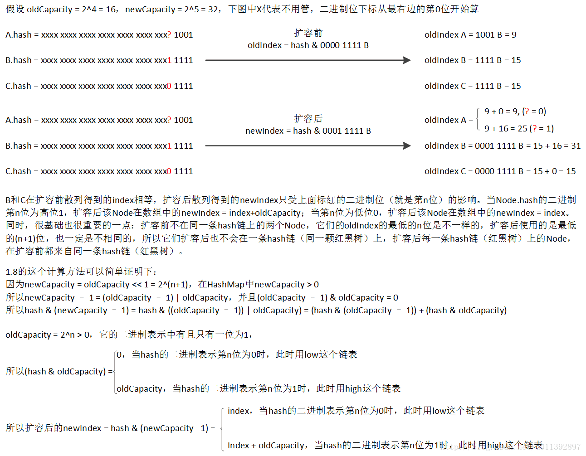

# 七、常用方法

## 1、读操作

本身流程比较简单，就不多说了。

### get

```java
 public V get(Object key) {
    Node<K,V> e;
    return (e = getNode(hash(key), key)) == null ? null : e.value;
}
 
final Node<K,V> getNode(int hash, Object key) {
    Node<K,V>[] tab; Node<K,V> first, e; int n; K k;
    //1.对table进行校验：table不为空 && table长度大于0 && table索引位置（使用indexFor{table.length - 1和hash值进行位与运算}的节点不为空 待解决：tab.length有可能为0吗？
    if ((tab = table) != null && (n = tab.length) > 0 && (first = tab[(n - 1) & hash]) != null) {
        // 2. always check first node，约定：hahs相等，然后equals，key相等，第1个是目标节点直接return
        if (first.hash == hash && ((k = first.key) == key || (key != null && key.equals(k))) 
            return first;
        // 3. 第1个不为目标节点且第2个不为null，开始遍历
        if ((e = first.next) != null) {
            if (first instanceof TreeNode) // 3.1 第1个是树节点就使用红黑树的方式进行查找
                return ((TreeNode<K,V>)first).getTreeNode(hash, key);
            do { // 3.2 不是树节点，那就使用是链表的方式进行查找查找
                if (e.hash == hash && ((k = e.key) == key || (key != null && key.equals(k))))// hahs相等，然后equals，key相等
                    return e;
            } while ((e = e.next) != null);
        }
    }// 4. 找不到目标节点的返回空
    return null;
}
            
// getOrDefault，1.8中Map接口新增的方法
@Override
public V getOrDefault(Object key, V defaultValue) {
    Node<K,V> e;
    return (e = getNode(hash(key), key)) == null ? defaultValue : e.value;
}
```

### contains

```java
public boolean containsKey(Object key) {
    return getNode(hash(key), key) != null;
}
 
public boolean containsValue(Object value) {
    Node<K,V>[] tab; V v;
    if ((tab = table) != null && size > 0) {
        for (int i = 0; i < tab.length; ++i) {
            for (Node<K,V> e = tab[i]; e != null; e = e.next) {//使用链表的方式迭代找出value相等的entry
                if ((v = e.value) == value || (value != null && value.equals(v)))
                    return true;
            }
        }
    }
    return false;
}
```

### 其他

```java
public int size() {
    return size;
}

public boolean isEmpty() {
    return size == 0;
}
```


## 2、写操作

### put

```java
public V put(K key, V value) {
    return putVal(hash(key), key, value, false, true);
}
 
// put的变化：1、添加红黑树变换的情况；2、新添加的Node放在链表的尾部；3、put判断是否扩容时的处理跟1.6一样，先添加Node再判断，跟1.7的不一样。
/**  Implements Map.put and related methods */
// onlyIfAbsent，key不存在才put，存在了什么也不做，也不会更改value，除非旧的value为null
// evict，区分是初始化构建还是普通的put
final V putVal(int hash, K key, V value, boolean onlyIfAbsent,  boolean evict) { 
    Node<K,V>[] tab; Node<K,V> p; int n, i; //  p为previous node；n为tab.length；i为hash桶的index
    if ((tab = table) == null || (n = tab.length) == 0) // 1. 处理table的初始化
        n = (tab = resize()).length;
    if ((p = tab[i = (n - 1) & hash]) == null) // 2. hash桶为空，直接放进去就行，将该索引位置的头节点赋值给p
        tab[i] = newNode(hash, key, value, null);
    else {//3. hash桶非null，可以添加或者替换node
        Node<K,V> e; K k;//e是existing相同的node，不需要添加，只需要替换value
        if (p.hash == hash &&  ((k = p.key) == key || (key != null && key.equals(k)))) // 3.1 比较第一个node，碰见“相等”的key，留给下面if替换
            e = p;
        else if (p instanceof TreeNode) // 3.2 红黑树节点就使用红黑树的方式进行添加
            e = ((TreeNode<K,V>)p).putTreeVal(this, tab, hash, key, value);
        else {
            for (int binCount = 0; ; ++binCount) {// 3.3 比较剩余的node
                if ((e = p.next) == null) {//3.3.1 如果p的next节点为空时，则代表找不到目标节点，newNode添加在链表的末尾
                    p.next = newNode(hash, key, value, null);  
                    if (binCount >= TREEIFY_THRESHOLD - 1) // -1 for 1st ，-1是链表的第一个，7就是链表的第8个，把第9个添加到链表后，变换为红黑树（treeifyBin里面判断第二个条件）
                        treeifyBin(tab, hash); 
                    break;
                }
                if (e.hash == hash &&  ((k = e.key) == key || (key != null && key.equals(k)))) // 碰见“相等”的key，留给下面if替换
                    break;
                p = e;
            }
        }
        //3.4 前两个else都没有替换同key value的功能，因此这里如果e非null，那么这里替换value
        if (e != null) { // existing mapping for key
            V oldValue = e.value;
            if (!onlyIfAbsent || oldValue == null)
                e.value = value;
            afterNodeAccess(e);  // 留给子类LinkedHashMap实现的方法
            return oldValue;
        }
    }
    //4. 添加node成功，注意resize
    ++modCount;
    if (++size > threshold) // 扩容这里跟1.6的一样，是先把Node添加进去，再判断是否扩容，跟1.7的不一样
        resize();
    afterNodeInsertion(evict); // 留给子类LinkedHashMap实现的方法
    return null;
}
 
public V putIfAbsent(K key, V value) {
    return putVal(hash(key), key, value, true, true);
}
```

### putAll

```java
public void putAll(Map<? extends K, ? extends V> m) {
    putMapEntries(m, true);
}
```

### replace

```java
// K-V都匹配时，把V替换成newValue
public boolean replace(K key, V oldValue, V newValue) {
    Node<K,V> e; V v;
    if ((e = getNode(hash(key), key)) != null && ((v = e.value) == oldValue || (v != null && v.equals(oldValue)))) {//判断
        e.value = newValue;
        afterNodeAccess(e);
        return true;
    }
    return false;
}
 
// K匹配时把V替换成value
public V replace(K key, V value) {
    Node<K,V> e;
    if ((e = getNode(hash(key), key)) != null) {
        V oldValue = e.value;
        e.value = value;
        afterNodeAccess(e);
        return oldValue;
    }
    return null;
}
```

### clear

```java
public void clear() {
    Node<K,V>[] tab;
    modCount++;
    if ((tab = table) != null && size > 0) {
        size = 0;
        for (int i = 0; i < tab.length; ++i)
            tab[i] = null;
    }
}
```

### remove

```java
public V remove(Object key) {
    Node<K,V> e;
    return (e = removeNode(hash(key), key, null, false, true)) == null ?  null : e.value; 
}
 
/**  Implements Map.remove and related methods */
// 1. value，这个和matchValue = true一起使用，matchValue = true时，只有key value全匹配才能remove；false时，key匹配就可以remove。
// 2. movable，true代表进行红黑树删除时，会把根节点变为hash桶直接引用的那个节点（通过调用一次moveRootToFront），这一点很正常，因为持有红黑树的根节点能够用最直接方便的形式操作红黑树
// 但是moveRootToFront还会把根节点变为链表形式的头结点，这会改变节点之间的迭代顺序，这对迭代操作有很大的影响
// 常见的remove相关的方法都应该设置为true；迭代器是使用链表的方式进行迭代，它的remove方法，需要避免remove时因为根节点改动而造成迭代顺序变化，
//     所以要设置为false，在迭代完成后由其他方法进行moveRootToFront操作。
final Node<K,V> removeNode(int hash, Object key, Object value,  boolean matchValue, boolean movable) { 
    Node<K,V>[] tab; Node<K,V> p; int n, index;//table；previous node；tab.length；
    // 1. 第一个节点非null才有下面的逻辑，p暂时为第一个node
    if ((tab = table) != null && (n = tab.length) > 0 &&
        (p = tab[index = (n - 1) & hash]) != null) { 
        Node<K,V> node = null, e; K k; V v;
        
        // 2. 找出匹配的node，key存在
        if (p.hash == hash &&  ((k = p.key) == key || (key != null && key.equals(k)))) // 判断第一个节点
            node = p;
        else if ((e = p.next) != null) {
            if (p instanceof TreeNode) // 树节点就进行红黑树查找
                node = ((TreeNode<K,V>)p).getTreeNode(hash, key);
            else {
                do { // do-while循环进行链表查找
                    if (e.hash == hash &&  ((k = e.key) == key || (key != null && key.equals(k)))) { 
                        node = e;
                        break;
                    }
                    p = e;//e变成previous node
                } while ((e = e.next) != null);
            }
        }
        
        //3. node存在并且value匹配，进行删除
        if (node != null && (!matchValue || (v = node.value) == value ||
                             (value != null && value.equals(v)))) {
            if (node instanceof TreeNode)
                ((TreeNode<K,V>)node).removeTreeNode(this, tab, movable); // 3.1 进行红黑树的删除
            else if (node == p) // 3.2 链表删除头结点，相等表示是头节点
                tab[index] = node.next;
            else // 3.3 链表删除非头节点
                p.next = node.next;
            ++modCount;
            --size;
            afterNodeRemoval(node); // 这个方法交给子类LinkedHashMap实现
            return node;
        }
    }
    return null;
}

// K-V都匹配的时才删除
public boolean remove(Object key, Object value) {
    return removeNode(hash(key), key, value, true, true) != null;
}
```

# 八、视图和迭代器

就1点要说的。
HashMap的红黑树结构，本身还保留有链表结构，红黑树中节点被删除时，要从两种结构中都删除它。
红黑树本身就保留有链表，因此为了方便简单，迭代器使用的是链表方式进行的迭代。这样做还有另外一个好处：链表中某个节点被删除不影响剩下节点之间的相对顺序，如果使用树的方式进行遍历，因为红黑树remove时可能会出现的树的旋转，会改变树方式进行遍历时节点的相对顺序，可能会造成节点重复遍历或者没有被遍历的情况。迭代器使用链表遍历，在红黑树节点删除时，就能够不受树旋转的影响。
同时迭代器的remove操作，不能在删除节点后进行moveRootToFront操作。这个操作会将红黑树的根节点移动到链表的最前面，同时让它也是链表的头节点，这会改变链表节点之间的顺序。迭代器进行remove后，有可能 table[i] 引用的不是红黑树的根节点，但是TreeNode额外提供了寻找根节点的方法，不影响其他操作。这个迭代器未完成的moveRootToFront的操作由迭代完成后的下一个写操作来执行。这一点前面说了。
其余的基本没什么改动。

# 九、红黑树相关

## 介绍

放在最后面，一起看下。
红黑树是一种自平衡的二叉搜索树，额外多五个性质
    性质1：节点是红色或黑色
    性质2：根节点是黑色
    性质3：NIL节点（null、空节点）是黑色的
    性质4：每个红色节点的两个子节点都是黑色（从每个NIL节点到根的所有路径上不能有两个连续的红色节点）
     性质5：从任一节点到其每个叶子的所有路径都包含相同数目的黑色节点
因为红黑树是二叉搜索树，二者的一些流程是一样的，下面的注释很多是针对二叉搜索树的操作写的。至于红黑树的平衡这块，暂时还不是特别熟悉，所以下面有4个方法先不看了，等以后再完善。后面TreeMap也是用红黑树实现的，到时候一起说。

## 外部方法

TreeNode外面有几个相关的方法。

#### treeifyBin

```java
// 把原来链表上的普通节点转化为树节点，用双向链表保存
final void treeifyBin(Node<K,V>[] tab, int hash) {
    int n, index; Node<K,V> e;
    // 1.如果table为空或者table的长度小于64, 调用resize方法进行扩容，不转化为树
    if (tab == null || (n = tab.length) < MIN_TREEIFY_CAPACITY)
        resize();
    // 2.转化链条，根据hash值计算索引值，将该索引位置的节点赋值给e，从e开始遍历该索引位置的链表
    else if ((e = tab[index = (n - 1) & hash]) != null) {
        TreeNode<K,V> hd = null, tl = null; // hd = head, tl = tail
        //2.1 把原来链表上的普通节点转化为树节点，用双向链表保存
        do {
            TreeNode<K,V> p = replacementTreeNode(e, null); // “构造”方法，将node转红treeNode
            if (tl == null)//如果是第一次遍历，tl为空代表为第一次循环，将头节点赋值给hd
                hd = p;
            else {   //如果不是第一次遍历，则处理当前节点的prev属性和上一个节点的next属性
                p.prev = tl;
                tl.next = p;
            }
            tl = p;
        } while ((e = e.next) != null);
        //2.2 将table该索引位置赋值为新转的TreeNode的头节点，如果该节点不为空，则以以头节点(hd)为根节点, 构建红黑树
        if ((tab[index] = hd) != null)
            hd.treeify(tab); 
    }
}
```

#### comparableClassFor

```java
// 因为红黑树是二叉搜索树，关键字如何比较大小很重要
// HashMap这里首先直接使用hash值比较大小，如果发生hash值相等，那么进行以下处理
//     如果Key实现了Comparable<Key>接口，那么调用其compareTo方法进行大小比较；
//     如果没实现，那么调用System.identityHashCode获取其bject.hashCode（指的是未被子类覆盖时hashCode的返回值），再使用这个hashCode进行比较
// 这里允许不同的节点的Key在红黑树中相等，因为这里是HashMap不是TreeMap，不需要严格的顺序
 
/** Returns x's Class if it is of the form "class C implements Comparable<C>", else null. */
static Class<?> comparableClassFor(Object x) {
    if (x instanceof Comparable) {
        Class<?> c; Type[] ts, as; Type t; ParameterizedType p;
        if ((c = x.getClass()) == String.class) // bypass checks
            return c;
        if ((ts = c.getGenericInterfaces()) != null) {
            for (int i = 0; i < ts.length; ++i) {
                if (((t = ts[i]) instanceof ParameterizedType) &&
                    ((p = (ParameterizedType)t).getRawType() ==
                     Comparable.class) &&
                    (as = p.getActualTypeArguments()) != null &&
                    as.length == 1 && as[0] == c) // type arg is c
                    return c;
            }
        }
    }
    return null;
}
```

#### compareComparables

```java
// 实现了Comparable接口就调用其compareTo方法进行大小比较
/** Returns k.compareTo(x) if x matches kc (k's screened comparable class), else 0. */
@SuppressWarnings({"rawtypes","unchecked"}) // for cast to Comparable
static int compareComparables(Class<?> kc, Object k, Object x) {
    return (x == null || x.getClass() != kc ? 0 :
            ((Comparable)k).compareTo(x));
}
```


## TreeNode

剩下的都在TreeNode中。

除了红黑树相关的，其余都有注释了，红黑树等理解了，和TreeMap一起说。


```java
// 红黑树节点TreeNode实际上还保存有链表的指针，因此也可以用链表的方式进行遍历读取操作
// 继承LinkedHashMap.Entry主要是为了子类的方便，减少子类的改动
static final class TreeNode<K,V> extends LinkedHashMap.Entry<K,V> {  // LinkedHashMap.Entry<K,V>  ： static class Entry<K,V> extends HashMap.Node<K,V> 
    TreeNode<K,V> parent;  // red-black tree links
    TreeNode<K,V> left;
    TreeNode<K,V> right;
    TreeNode<K,V> prev;    // needed to unlink next upon deletion 新添加的prev指针是为了删除方便，删除链表的非头节点的节点，都需要知道它的前一个节点才能进行删除，所以直接提供一个prev指针
    boolean red;
    TreeNode(int hash, K key, V val, Node<K,V> next) {
        super(hash, key, val, next);
    }
```

#### root

```java
    // 寻找根节点
    final TreeNode<K,V> root() {
        for (TreeNode<K,V> r = this, p;;) {
            if ((p = r.parent) == null)
                return r;
            r = p;
        }
    }
```

#### getTreeNode

```java
// 以真正的root节点为根节点开始遍历查找，this是树节点，但不一定是根节点，
final TreeNode<K,V> getTreeNode(int h, Object k) {
    // 1.首先找到红黑树的根节点；2.使用根节点调用find方法
    return ((parent != null) ? root() : this).find(h, k, null);
}
```

#### find

这个方法和puTreeVal找node的过程很相似

```java
/**
 * Finds the node starting at root p with the given hash and key.
 * The kc argument caches comparableClassFor(key) upon first use
 * comparing keys.
 */
//  this 不一定是根节点，但是我们以this为根节点开始遍历查找this的左右子树，根据hahs和key找到对应的node，
final TreeNode<K,V> find(int h, Object k, Class<?> kc) {//hash,key,keyClass
    TreeNode<K,V> p = this;
    // 1. 从this节点p开始遍历
    do {
        int ph, dir; K pk; // ph = parent.hash, dir = direction, pk = parent.key
        TreeNode<K,V> pl = p.left, pr = p.right, q;
        if ((ph = p.hash) > h)  // 2. 如果传入的hash值小于p节点的hash值，则往p节点的左边遍历，下一个循环
            p = pl;
        else if (ph < h)// 3. hash大于p.hahs，右边
            p = pr;
        else if ((pk = p.key) == k || (k != null && k.equals(pk)))//4. hash相等，key也相等，p是目标节点，return
            return p;           // 5. 以下是hash相等，key不相等，hash范围很大，可能性小，但也有可能
        else if (pl == null)  // 6. 下面两步，先不进行比较划分左右子树（可能剩下节点不多），直接筛选一个非null进行迭代
            p = pr;
        else if (pr == null)
            p = pl;
        else if ( // 7. 左右子树非空，需要比较划分，这里逻辑和putTreeVal相反
            	 (kc != null || (kc = comparableClassFor(k)) != null) &&  // 7.1 kc不为空代表k实现了Comparable
                 (dir = compareComparables(kc, k, pk)) != 0 // 7.2 并且comparable要有大小结果，不能相等
                )
            p = (dir < 0) ? pl : pr;
        else if ((q = pr.find(h, k, kc)) != null) //  8. 如果comparable没起作用，那么直接选右子树递归查找，（putTreeVal会调用最后规则进行比较，这里不知道为什么不用）
            return q;
        else // 9. 代码走到此处代表 8 的“pr.find(h, k, kc)”为空, 因此直接向左遍历
            p = pl; 
    } while (p != null);
    return null;
}
```
#### tieBreakOrder

```java
	 /**
      * Tie-breaking utility for ordering insertions when equal
      * hashCodes and non-comparable. We don't require a total
      * order, just a consistent insertion rule to maintain
      * equivalence across rebalancings. Tie-breaking further than
      * necessary simplifies testing a bit.
      */
	// 比较两个node的大小比较必须要有结果
    // 用于极端情况下，当equal hashCodes and non-comparable 时，最后使用的用于比较节点key大小的方法，优先级最低
    // System.identityHashCode：此方法的返回值和Object.hashCode没有被覆盖时的返回值一样，虚拟机尽量会保证这个值不重复（厂商实现，不一定内存地址），The hash code for the null reference is zero.
    static int tieBreakOrder(Object a, Object b) {
        int d;1. //1. 首先要保证 a,b非null才可以调用方法，并且用String的compareTo方法比较大小，如果是同一个类就直接认为key相等
        if (a == null || b == null || (d = a.getClass().getName().compareTo(b.getClass().getName())) == 0)
            d = (System.identityHashCode(a) <= System.identityHashCode(b) ? -1 : 1); //2. 如果a、b任何一个为null或者String的compareTo方法的结果也相同，那么直接调用本地方法System.identityHashCode()方法比较大小
        return d;
    }
```

#### putTreeVal

```java
// 用于实现HashMap.putVal
//两个node的比较方法有hash、==、equals，comparable、compareTo、native方法
final TreeNode<K,V> putTreeVal(HashMap<K,V> map, Node<K,V>[] tab, int h, K k, V v) {
    Class<?> kc = null;
    boolean searched = false;
    // 1.查找根节点, 索引位置的头节点并不一定为红黑树的根节点
    TreeNode<K,V> root = (parent != null) ? root() : this;
    //2. 从root根节点开始循环判断，赋值给p，直至找到相同的node直接返回node或者到叶子节点也不同return null表示需要插入
    for (TreeNode<K,V> p = root;;) {
        //3. 判断两个node的大小，必须要有结果
        int dir, ph; K pk; //direction，node的hash，node的key
        if ((ph = p.hash) > h) // a. 如果传入的hash值小于p节点的hash值，说明目标在左子树，将dir赋值为-1，代表向p的左边查找树
            dir = -1;
        else if (ph < h) // b. 如果传入的hash值大于p节点的hash值，说明目标在右子树，将dir赋值为1，代表向p的右边查找树
            dir = 1;
        else if ((pk = p.key) == k || (k != null && k.equals(pk)))// c. hash相等，key也相等，则p节点即为目标节点, 返回p节点
            return p;
        						// d. hash相等，key不相等（可能性极小）。  // d1. 如果实现了comparable接口并且在第二个判断比较结果，有大小，结束if else块
        else if ((kc == null && (kc = comparableClassFor(k)) == null) || (dir = compareComparables(kc, k, pk)) == 0) {
            if (!searched) {	// d2. 如果没有实现comparable接口或者实现了还是相等（步骤c决定此时两个node不应该相等），目标节点有可能在左右子树，从p节点的左节点和右节点分别调用find方法进行查找, 查找到目标节点并返回，如果找不到就不必再进入这一步（这一步就是为了找目标节点），因此可以设置searched = true；
                TreeNode<K,V> q, ch;
                searched = true;
                if (  
                    ((ch = p.left) != null && (q = ch.find(h, k, kc)) != null)	||
                    ((ch = p.right) != null && (q = ch.find(h, k, kc)) != null)
                   )
                    return q;
            }
            dir = tieBreakOrder(k, pk);// d3. 如果d2中左右子树也找不到目标节点，说明需要插入，因此步骤d2此时需要比较出大小并在左右子树中找到合适的node点插入，因此需要继续向下循环。
        } // 如果调用了d1或者d3得出大小，这个大小有可能完全和hash无关，因此有可能本应在左子树的hash小的节点出现在hash大的右子树上，也可能相反
 
        TreeNode<K,V> xp = p;//提前锁定p为xp，用于new node的parent
        //4. 来到这里说明暂时没有目标node，因此需要找出下一个子树节点，左还是右，如果对应的节点p（赋值后）为null，说明目标所在的子树还不存在，需要在该位置插入，插入需要修改：parent节点xp的left/right，next；子节点x的parent，next，pre；xp的原下一节点xpn的pre
        if ((p = (dir <= 0) ? p.left : p.right) == null) { // 二叉搜索树新insert的节点都是叶子节点
            Node<K,V> xpn = xp.next;
            TreeNode<K,V> x = map.newTreeNode(h, k, v, xpn);//4.1 新节点x
            if (dir <= 0) //4.2 修改xp的域
                xp.left = x;
            else
                xp.right = x;
            xp.next = x; 
            x.parent = x.prev = xp;//4.3 修改x的域
            if (xpn != null) ((TreeNode<K,V>)xpn).prev = x;//4.4 修改xpn的域
            moveRootToFront(tab, balanceInsertion(root, x)); // insert后红黑树再调整
            return null;
        }
    }
}

```
改善：d2、d3可以调转顺序，因为插入必须经过d3比较大小分配左右子树，因此查找的时候先分再进入子树比较快

对应d2、d3的可能情况


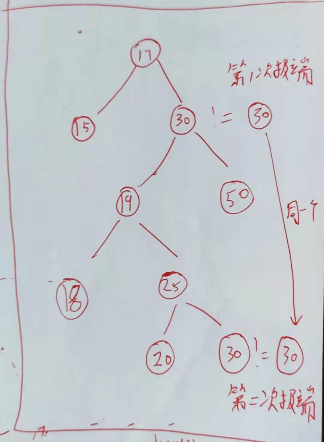

#### treeify

```java
    // 将双向链表转化为红黑树，链头为root，逐个构建为子节点，然后修正root
    // 红黑树是一种特殊的二叉搜索树，要保证二叉搜索树的基本性质：
    //     一个节点的关键字，不小于它的左边的子树上的所有节点的关键字，且不大于右边子树上的所有节点的关键字
    // 这里优先使用hash值当做关键字，hash值相同时，如果实现了Comparable接口，就使用Comparable.compareTo，否则使用 tieBreakOrder 方法进行比较
    final void treeify(Node<K,V>[] tab) {
        TreeNode<K,V> root = null;
        // 1.将调用此方法的节点赋值给x，以x作为起点，开始进行遍历链条，构建tree
        for (TreeNode<K,V> x = this, next; x != null; x = next) {
            next = (TreeNode<K,V>)x.next;//这个代码可以放在for循环的最后一个语句
            x.left = x.right = null; //设置为null
         	// 2.如果还没有根节点, 则将x设置为根节点
            if (root == null) {
                x.parent = null;
                x.red = false;
                root = x;
            }
            else {	
                // 3.如果当前节点x不是根节点, 则从根节点开始查找属于该节点的位置
                K k = x.key;
                int h = x.hash;
                Class<?> kc = null;
                for (TreeNode<K,V> p = root;;) { // 3.1 循环，遍历找到要插入的节点的parent节点
                    int dir, ph; // dir = direction, ph = parent.hash
                    K pk = p.key;
                    if ((ph = p.hash) > h) // 放在左边
                        dir = -1;
                    else if (ph < h) // 放在右边
                        dir = 1;
                    // 下面的else if 中处理hash相等的情况
                    // 如果实现了Comparable接口，就使用Comparable.compareTo判断方向，
                    else if ((kc == null && (kc = comparableClassFor(k)) == null) || (dir = compareComparables(kc, k, pk)) == 0)
                        dir = tieBreakOrder(k, pk); // 没实现Comparable接口或者结果==0（没有方向）调用这个方法
 
                    TreeNode<K,V> xp = p;
                    if ((p = (dir <= 0) ? p.left : p.right) == null) { // 3.2 根据dir的正负确定遍历方向，找到要插入的节点的parent节点
                        x.parent = xp;
                        if (dir <= 0)
                            xp.left = x;
                        else
                            xp.right = x;
                        root = balanceInsertion(root, x); //3.3 插入树节点，根据红黑树性质进行平衡化，保持平衡，(通过左旋、右旋和改变节点颜色来保证当前树符合红黑树的要求)，root会改变
                        break;
                    }
                }
            }
        }
        //4. 如果root节点不在table索引位置的头节点, 则将其调整为头节点
        moveRootToFront(tab, root);
    }
```

#### moveRootToFront

```java
    // 把根节点移动到前面，确保红黑树的根节点是第一个节点，即 tab[index] = root
    static <K,V> void moveRootToFront(Node<K,V>[] tab, TreeNode<K,V> root) {
        int n;
        //1. 检验
        if (root != null && tab != null && (n = tab.length) > 0) {
            int index = (n - 1) & root.hash;
            TreeNode<K,V> first = (TreeNode<K,V>)tab[index];
           // 2.root！= first 就可以开始移动节点
            if (root != first) {
                Node<K,V> rn;
                tab[index] = root; // 设置root为能遍历到的第一个Node
                // 下面几行，用于更改链表中节点的顺序，虽然使用了红黑树，但是迭代操作还是使用链表进行的。把root抽出来放在first起前面，缝合缺口，因此最多修改5个位置，但是为什么这么多非null判断，除了rn没必要，又不是并发操作
                TreeNode<K,V> rp = root.prev;
                if ((rn = root.next) != null)
                    ((TreeNode<K,V>)rn).prev = rp;
                if (rp != null)
                    rp.next = rn;
                if (first != null)
                    first.prev = root;
                root.next = first;
                root.prev = null;
            }
            assert checkInvariants(root);//3. 检查树是否正常，assert不执行的
        }
    }
```

#### checkInvariants

```java
// 递归检查一些关系，确保构造的是正确无误的红黑树
    static <K,V> boolean checkInvariants(TreeNode<K,V> t) {
        TreeNode<K,V> tp = t.parent, tl = t.left, tr = t.right, tb = t.prev, tn = (TreeNode<K,V>)t.next;
        if (tb != null && tb.next != t)
            return false;
        if (tn != null && tn.prev != t)
            return false;
        if (tp != null && t != tp.left && t != tp.right)
            return false;
        if (tl != null && (tl.parent != t || tl.hash > t.hash))
            return false;
        if (tr != null && (tr.parent != t || tr.hash < t.hash))
            return false;
        if (t.red && tl != null && tl.red && tr != null && tr.red)
            return false;
        if (tl != null && !checkInvariants(tl))
            return false;
        if (tr != null && !checkInvariants(tr))
            return false;
        return true;
    }
```

#### split

```java
    // 用于实现resize，跟链表的resize一样，也是使用高低位算法拆分成两个部分
    // 拆分后的部分如果长度小，就存储为普通的链表，长度满足就转化为新的红黑树存储
    final void split(HashMap<K,V> map, Node<K,V>[] tab, int index, int bit) {
        TreeNode<K,V> b = this;
        // 1. Relink into lo and hi lists, preserving order
        TreeNode<K,V> loHead = null, loTail = null;
        TreeNode<K,V> hiHead = null, hiTail = null;
        int lc = 0, hc = 0;
        for (TreeNode<K,V> e = b, next; e != null; e = next) {
            next = (TreeNode<K,V>)e.next;
            e.next = null;
            if ((e.hash & bit) == 0) {
                if ((e.prev = loTail) == null)
                    loHead = e;
                else
                    loTail.next = e;
                loTail = e;
                ++lc;
            }
            else {
                if ((e.prev = hiTail) == null)
                    hiHead = e;
                else
                    hiTail.next = e;
                hiTail = e;
                ++hc;
            }
        }
 		// 2. 分配到高低桶里面，注意转化
        if (loHead != null) {
            if (lc <= UNTREEIFY_THRESHOLD)
                tab[index] = loHead.untreeify(map);//太短
            else {
                tab[index] = loHead;
                if (hiHead != null) // (else is already treeified)，还是够长
                    loHead.treeify(tab);
            }
        }
        if (hiHead != null) {
            if (hc <= UNTREEIFY_THRESHOLD)
                tab[index + bit] = hiHead.untreeify(map);
            else {
                tab[index + bit] = hiHead;
                if (loHead != null)
                    hiHead.treeify(tab);
            }
        }
    }
```

#### untreeify

```java
    // 当节点数目太少不满足转化为红黑树条件时，转化为普通节点的链表
    final Node<K,V> untreeify(HashMap<K,V> map) {
        Node<K,V> hd = null, tl = null; //head ，tail
    	// 1.从调用该方法的节点, 即链表的头节点开始遍历, 将所有节点全转为链表节点
        for (Node<K,V> q = this; q != null; q = q.next) {
            Node<K,V> p = map.replacementNode(q, null);// 2.调用replacementNode方法构建链表节点
            if (tl == null)	// 3.如果tl为null, 则代表当前节点为第一个节点, 将hd赋值为该节点否则, 将尾节点的next属性设置为当前节点p
                hd = p;
            else
                tl.next = p;
            tl = p;
        }//4. 返回转换后的链表的头节点
        return hd;
    }
```

#### removeTreeNode

```java
    // 用于实现HashMap.removeNode(Map.remove)
	// 这块代码比较长，目的就是移除调用此方法的节点，也就是该方法中的 this 节点。移除包括链表的处理和红黑树的处理。
    final void removeTreeNode(HashMap<K,V> map, Node<K,V>[] tab, boolean movable) {
        
        //a. 链表的处理
        int n;
        if (tab == null || (n = tab.length) == 0)
            return;
        int index = (n - 1) & hash;
        TreeNode<K,V> first = (TreeNode<K,V>)tab[index], root = first, rl;
        TreeNode<K,V> succ = (TreeNode<K,V>)next, pred = prev;
        // 下面几行是用于在双向链表中删除这个节点
        if (pred == null)	//1. 如果是first节点
            tab[index] = first = succ;
        else				//2. 非first节点，同时缝合succ和pred
            pred.next = succ;
        if (succ != null)
            succ.prev = pred;
        if (first == null) // 只有一个节点，代表该索引位置已经没有节点则直接返回
            return;
        if (root.parent != null)
            root = root.root();
        if (root == null ||
				(movable &&
						(root.right == null || (rl = root.left) == null || rl.left == null)) {
            tab[index] = first.untreeify(map);  // too small 节点数目太少，恢复为普通的链表，因为已经在双向链表中删除了节点，所以不必再操作了，可以直接返回
            return;
        }
        
        //b. 红黑树的处理
        TreeNode<K,V> p = this, pl = left, pr = right, replacement; // replacement表示以节点为中心进行红黑树再调整，当p不是叶子节点是这也是p的实际继任节点
        // 下面的代码跟普通的二叉搜索树删除操作类似
        // 普通二叉搜索树删除节点有三种情况，画了个图，在后面
        // 1、p没有子树，直接删除就行
        // 2、p只有左子树或者右子树，用p的左子树或者右子树“替换”（p.parent.left/right = p.left/right）它。
        // 3、p 有非空的左右子树，把 p和s进行“内容替换”（互相交换各自的所有属性，然后引用交换），然后退化为情况1或者情况2再处理一次。这跟指针处理是一样的。
        // 先保证二叉搜索树的性质，在进行红黑树平衡调整保证是正确的红黑树
            
        // 1. 判断情况，并且简化情况3为情况2，设置replacement
        if (pl != null && pr != null) { // 情况3
            TreeNode<K,V> s = pr, sl;
            while ((sl = s.left) != null) // find successor 根据二叉搜索树的性质在右子树中寻找最“左”边的一个，也是不小于要删除的节点的最小节点，当做当前节点的实际继任节点
                s = sl;
            boolean c = s.red; s.red = p.red; p.red = c; // swap colors 交换颜色，保证其他部分是正确红黑树，不用调整
            TreeNode<K,V> sr = s.right;
            TreeNode<K,V> pp = p.parent;
            //下面是交换s和p，设置s和p附近节点的相关属性，考虑直接父子节点和非直接父子节点两种情况
            if (s == pr) { // p was s's direct parent
                p.parent = s;
                s.right = p;
            }
            else {
                TreeNode<K,V> sp = s.parent;
                if ((p.parent = sp) != null) {//想不到为null的情况
                    if (s == sp.left)
                        sp.left = p; // 肯定是左边啊，因为从左边迭代的
                    else
                        sp.right = p;
                }
                if ((s.right = pr) != null)
                    pr.parent = s;
            }
            p.left = null;
            if ((p.right = sr) != null)
                sr.parent = p;
            if ((s.left = pl) != null)
                pl.parent = s;
            if ((s.parent = pp) == null)//如果pp为空，则p节点为root节点, 交换后s成为新的root节点
                root = s;
            else if (p == pp.left)
                pp.left = s;
            else
                pp.right = s;
            //最后排查sr
            if (sr != null)
                replacement = sr; // p和s换位置后，p.left为空，如果这时候的p.right != null，就退化为情况2
            else
                replacement = p; // p和s换位置后，p.left为空，如果这时候的p.right == null，就退化为情况1
        }
        else if (pl != null) // 情况2，p.right为null，可以直接用p.left替换p
            replacement = pl;
        else if (pr != null) // 情况2，p.left为null，可以直接用p.right替换p
            replacement = pr;
        else                 // 情况1，p的左右都为null，后面直接删除p就行
            replacement = p;

        // 2. 处理情况2
        if (replacement != p) { // 情况2 或者 情况3退化为情况2时，删除节点p的操作，需要修改replacement、p、p.parent的属性
            TreeNode<K,V> pp = replacement.parent = p.parent; 	//a. replacement.parent 改变
            if (pp == null)		//b. 如果删除的p是root节点，那么replacement成为root
                root = replacement;
            else if (p == pp.left)		//c. parent的left或者right指向replacement
                pp.left = replacement;
            else
                pp.right = replacement;
            p.left = p.right = p.parent = null;		//d. p被删除后所有属性归null
        }
 
        TreeNode<K,V> r = p.red ? root : balanceDeletion(root, replacement); // 删除后重新平衡，删除红色节点不影响红黑树性质，可以不用再平衡
 		
        // 3. 处理情况1
        if (replacement == p) {  // detach 情况1 或者 情况3退化为情况1时，删除节点p的操作
            TreeNode<K,V> pp = p.parent;
            p.parent = null;//p的属性为null，删除后
            if (pp != null) {//parent不再引用p
                if (p == pp.left)
                    pp.left = null;
                else if (p == pp.right)
                    pp.right = null;
            }
        }
            
        // 4.调整root 
        if (movable)
            moveRootToFront(tab, r);
    }
```

下面简单说下二叉搜索树的一些操作，当作是帮助理解上面的一些代码，复习下二叉搜索树，也当是先预习下。红黑树的操作都是在完成二叉搜索树的操作后，再进行一次平衡，因此先理解下那四个方法外的二叉搜索树相关的东西。
put添加还算比较好理解，因为二叉搜索树新添加的节点都成为了新的叶子节点（非NIL的叶子节点），然后就是为了保证红黑树性质，对新添加的节点周围进行颜色检查，必要时更改颜色，保持平衡。

remove要复杂些，分三种情况考虑。为了帮助理解removeTreeNode，画了几张图，理解如何在二叉搜索树中删除一个节点（红左；蓝右；黑代表父节点，不用管左右）。

a、二叉搜索树删除节点中最简单的情况，直接删除，或者说使用 null（NIL节点）替换它 也行。

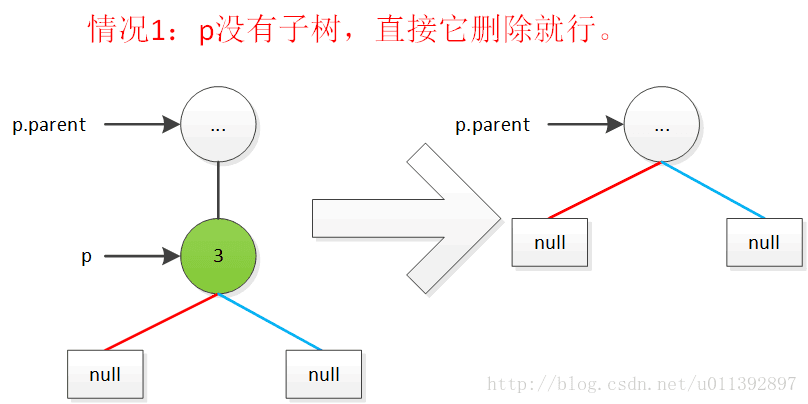

b、二叉搜索树删除节点中次简单的情况，直接使用非空子树替换它。

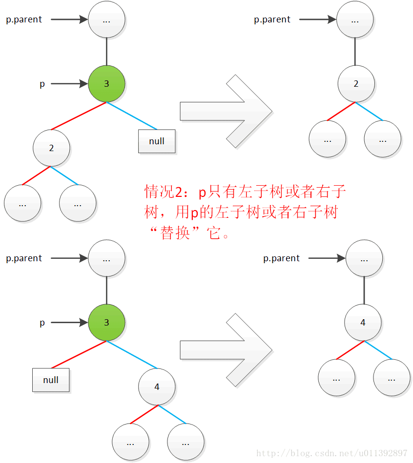

c、二叉搜索树删除节点中的一般情况：p和s进行“内容交换”后，退化为上面两种情况，再处理一次。

这种一般用指针描述比较直观，上面的代码中使用“内容交换”的方式反而绕一些，这样主要是为了让人知道，后续该围绕哪个节点来进行红黑树平衡化。一开始还没看懂，不过两者的确是等效的

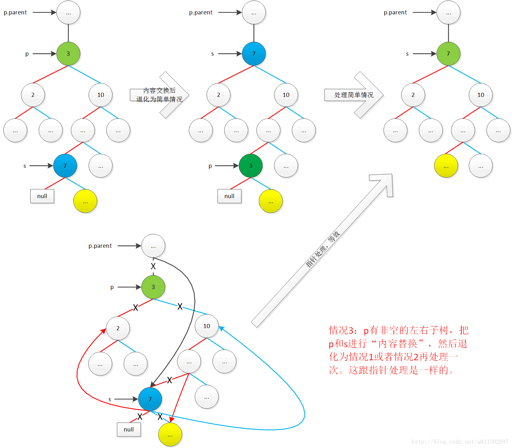

最后，红黑树那4个方法，这里就先 // TODO，以后到TreeMap时再补。毕竟，这篇的主要目的还是讲HashMap，不理解红黑树的实现对HashMap也没什么影响。网上有很多现成的红黑树相关的讲解，感兴趣的可以找来看看。

#### 红黑树算法

> 待解决：还没看

在 HashMap 中的应用：HashMap 在进行插入和删除时有可能会触发红黑树的插入平衡调整（balanceInsertion 方法）或删除平衡调整（balanceDeletion 方法），调整的方式主要有以下手段：左旋转（rotateLeft 方法）、右旋转（rotateRight 方法）、改变节点颜色（x.red = false、x.red = true），进行调整的原因是为了维持红黑树的数据结构。

```java
    /* ------------------------------------------------------------ */
    // 下面四个是经典的红黑树方法，改编自《算法导论》
    static <K,V> TreeNode<K,V> rotateLeft(TreeNode<K,V> root, TreeNode<K,V> p); // 左旋
    static <K,V> TreeNode<K,V> rotateRight(TreeNode<K,V> root, TreeNode<K,V> p); // 右旋
    static <K,V> TreeNode<K,V> balanceInsertion(TreeNode<K,V> root, TreeNode<K,V> x); // insert后保存平衡
    static <K,V> TreeNode<K,V> balanceDeletion(TreeNode<K,V> root, TreeNode<K,V> x); // delete后保存平衡
```

对比 AVL 树，AVL 要求每个节点的左右子树的高度之差的绝对值（平衡因子）最多为 1，而红黑树通过适当的放低该条件（红黑树限制从根到叶子的最长的可能路径不多于最短的可能路径的两倍长，结果是这个树大致上是平衡的），以此来减少插入/删除时的平衡调整耗时，从而获取更好的性能，而这虽然会导致红黑树的查询会比 AVL 稍慢，但相比插入/删除时获取的时间，这个付出在大多数情况下显然是值得的。
	

# 死循环

## 结束

HashMap 在 JDK 1.8 之后不再有死循环的问题，JDK 1.8 之前存在死循环的根本原因是在扩容后同一索引位置的节点顺序会反掉。

在 JDK 1.8 以前，Java 语言在并发情况下使用 HashMap 造成 Race Condition，从而导致死循环。程序经常占了 100% 的 CPU，查看堆栈，你会发现程序都 Hang 在了 “HashMap.get()” 这个方法上了，重启程序后问题消失。具体分析可以查看这篇文章：[疫苗：JAVA HASHMAP的死循环](https://coolshell.cn/articles/9606.html)，有人将这个问题当成一个 bug 提给了 Sun，但是 Sun 认为这并不是个 bug，因为HashMap 本来就不保证并发的线程安全性，在并发下，要用 ConcurrentHashMap 来代替。

那么，在JDK 1.8 的时候，这个问题解决了吗？

我们知道，JDK 1.8 以前，导致死循环的主要原因是扩容后，节点的顺序会反掉，如下图：扩容前节点 A 在节点 C 前面，而扩容后节点 C 在节点 A 前面。


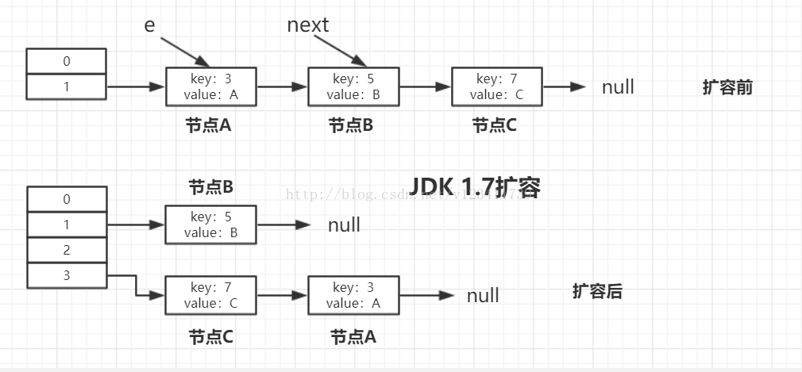

## JDK 1.8扩容过程

JDK1.8 普通链表的扩容代码，如下图所示，在上文已经分析过了：主要是在一个 do/while 中处理同一个位置的所有节点。

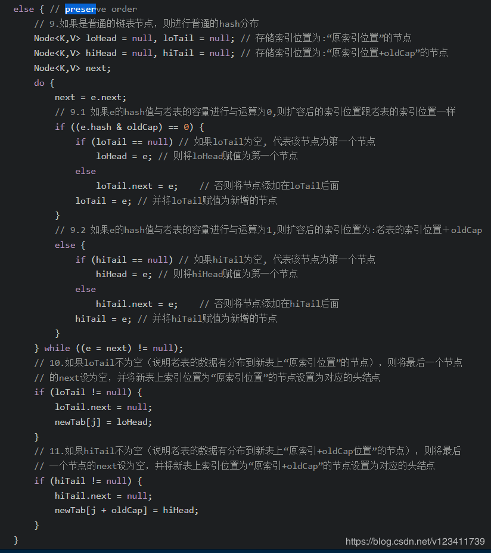

**举个例子**

**前提**：我们假设有3个节点，节点 A，节点 B，节点 C，并且假设他们的 hash 值等于 key 值，则按上图扩容的过程模拟如下。

先看下老表和新表计算索引位置的过程：（hash 计算省略前面 28 位 0，只看最后 4 位）

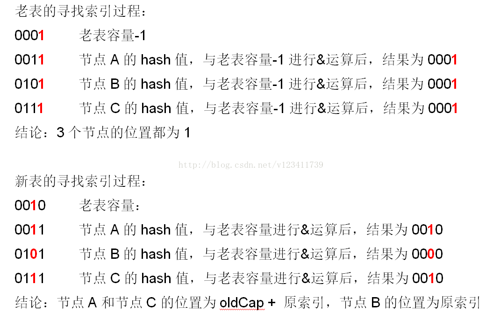

**具体扩容过程**：

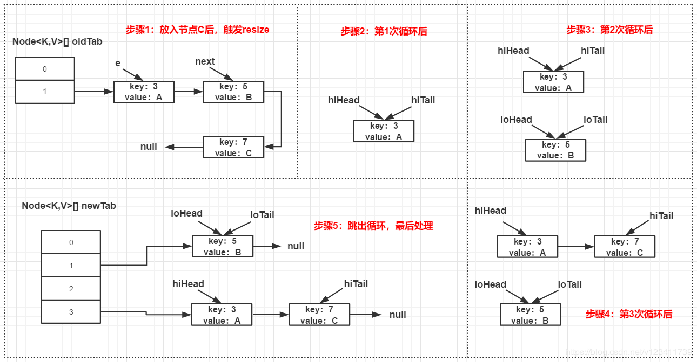

***\*结果：\****可以看出，扩容后，节点 A 和节点 C 的先后顺序跟扩容前是一样的。因此，即使此时有多个线程并发扩容，也不会出现死循环的情况，**但是循环还是得走一次**。当然，这仍然改变不了 HashMap 仍是非并发安全，在并发下，还是要使用 ConcurrentHashMap 来代替。

# 美团面试题

https://blog.csdn.net/qq_36520235/article/details/82417949

## 1.7和1.8有哪些区别

不同点：
（1）JDK1.7用的是头插法，而JDK1.8及之后使用的都是尾插法，那么他们为什么要这样做呢？因为JDK1.7是用单链表进行的纵向延伸，当采用头插法时会容易出现逆序且环形链表死循环问题。但是在JDK1.8之后是因为加入了红黑树使用尾插法，能够避免出现逆序且链表死循环的问题。

（2）扩容后数据存储位置的计算方式也不一样：1. 在JDK1.7的时候是直接用hash值和需要扩容的二进制数进行&（这里就是为什么扩容的时候为啥一定必须是2的多少次幂的原因所在，因为如果只有2的n次幂的情况时最后一位二进制数才一定是1，这样能最大程度减少hash碰撞）（hash值 & length-1）

2、而在JDK1.8的时候直接用了JDK1.7的时候计算的规律，也就是扩容前的原始位置+扩容的大小值=JDK1.8的计算方式，而不再是JDK1.7的那种异或的方法。但是这种方式就相当于只需要判断Hash值的新增参与运算的位是0还是1就直接迅速计算出了扩容后的储存方式。

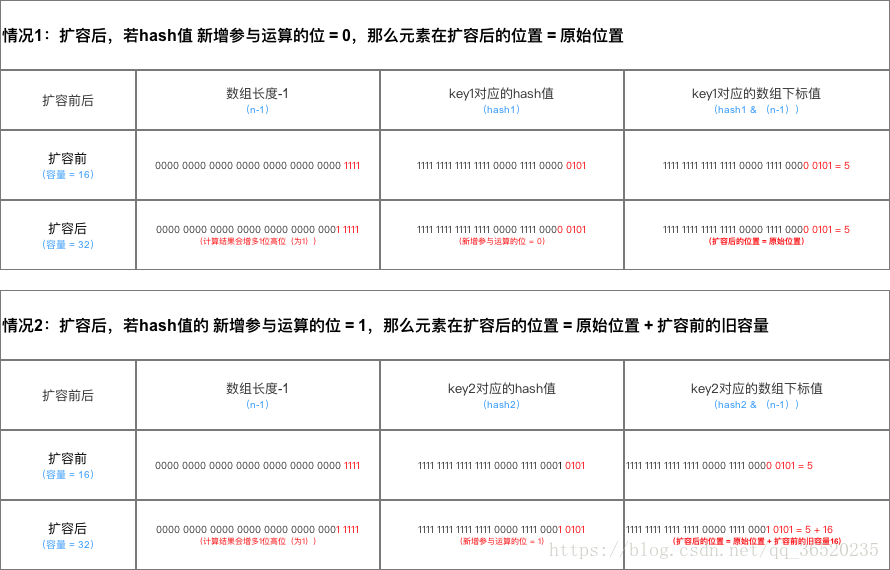

在计算hash值的时候，JDK1.7用了9次扰动处理=4次位运算+5次异或，而JDK1.8只用了2次扰动处理=1次位运算+1次异或。

扩容流程对比图：

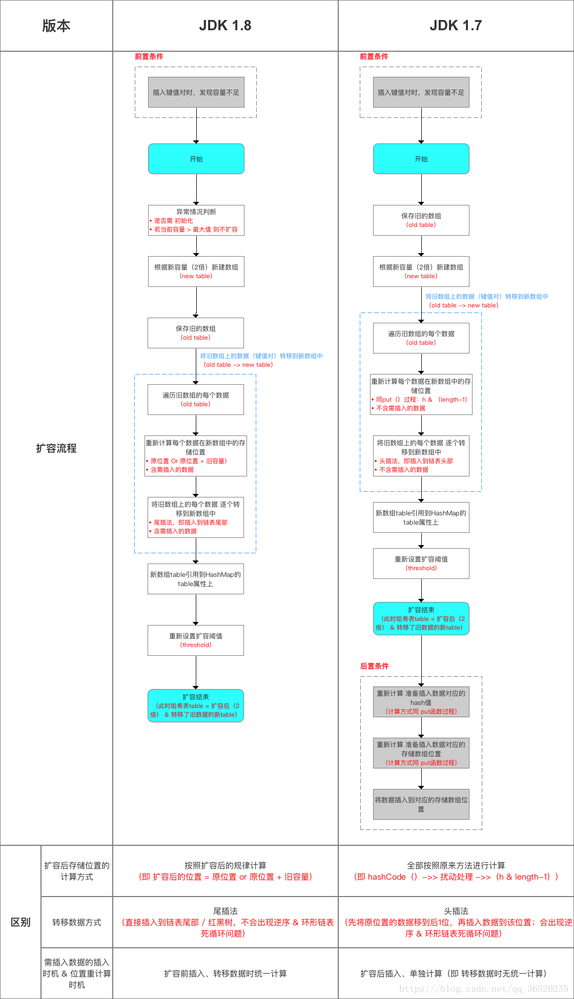

（3）JDK1.7的时候使用的是数组+ 单链表的数据结构。但是在JDK1.8及之后时，使用的是数组+链表+红黑树的数据结构（当链表的深度达到8的时候，也就是默认阈值，就会自动扩容把链表转成红黑树的数据结构来把时间复杂度从O（n）变成O（logN）提高了效率）

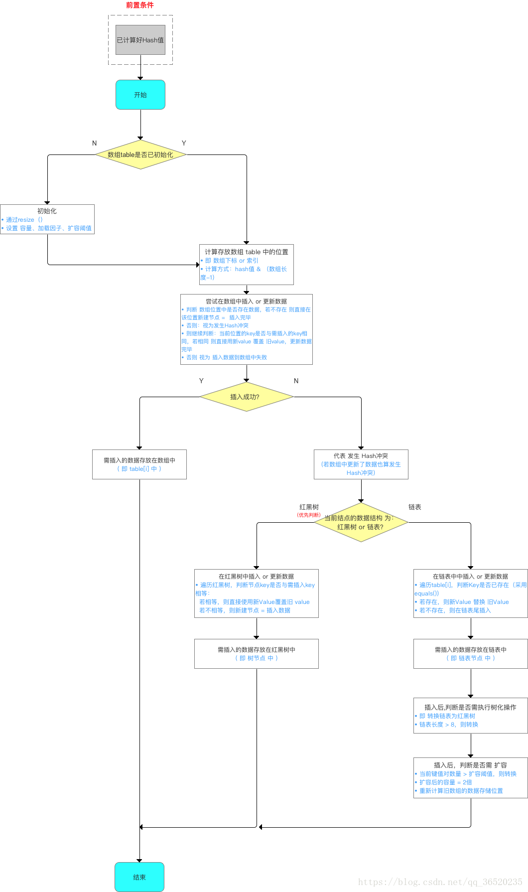

这里在重新进行补充两个问题：（2019-09-03）

（1）为什么在JDK1.7的时候是先进行扩容后进行插入，而在JDK1.8的时候则是先插入后进行扩容的呢？

```java
//其实就是当这个Map中实际插入的键值对的值的大小如果大于这个默认的阈值的时候（初始是16*0.75=12）的时候才会触发扩容，
//这个是在JDK1.8中的先插入后扩容
if (++size > threshold)
            resize();
```

其实这个问题也是JDK8对HashMap中，主要是因为对链表转为红黑树进行的优化，因为你插入这个节点的时候有可能是普通链表节点，也有可能是红黑树节点，但是为什么1.8之后HashMap变为先插入后扩容的原因，我也有点不是很理解？欢迎来讨论这个问题？

但是在JDK1.7中的话，是先进行扩容后进行插入的，就是当你发现你插入的桶是不是为空，如果不为空说明存在值就发生了hash冲突，那么就必须得扩容，但是如果不发生Hash冲突的话，说明当前桶是空的（后面并没有挂有链表），那就等到下一次发生Hash冲突的时候在进行扩容，但是当如果以后都没有发生hash冲突产生，那么就不会进行扩容了，减少了一次无用扩容，也减少了内存的使用

```java
void addEntry(int hash, K key, V value, int bucketIndex) {
		//这里当钱数组如果大于等于12（假如）阈值的话，并且当前的数组的Entry数组还不能为空的时候就扩容
    　　if ((size >= threshold) && (null != table[bucketIndex])) {
　　　　　　 //扩容数组，比较耗时
       　　 resize(2 * table.length);
        　　hash = (null != key) ? hash(key) : 0;
        　　bucketIndex = indexFor(hash, table.length);
    　　}

    　　createEntry(hash, key, value, bucketIndex);
　　}

 void createEntry(int hash, K key, V value, int bucketIndex) {
    　　Entry<K,V> e = table[bucketIndex];
　　　　//把新加的放在原先在的前面，原先的是e，现在的是new，next指向e
   　　 table[bucketIndex] = new Entry<>(hash, key, value, e);//假设现在是new
    　　size++;
　　}

```

（2）为什么在JDK1.8中进行对HashMap优化的时候，把链表转化为红黑树的阈值是8,而不是7或者不是20呢（面试蘑菇街问过）？

如果选择6和8（如果链表小于等于6树还原转为链表，大于等于8转为树），中间有个差值7可以有效防止链表和树频繁转换。假设一下，如果设计成链表个数超过8则链表转换成树结构，链表个数小于8则树结构转换成链表，如果一个HashMap不停的插入、删除元素，链表个数在8左右徘徊，就会频繁的发生树转链表、链表转树，效率会很低。
还有一点重要的就是由于treenodes的大小大约是常规节点的两倍，因此我们仅在容器包含足够的节点以保证使用时才使用它们，当它们变得太小（由于移除或调整大小）时，它们会被转换回普通的node节点，容器中节点分布在hash桶中的频率遵循泊松分布，桶的长度超过8的概率非常非常小。所以作者应该是根据概率统计而选择了8作为阀值

```java
	//Java中解释的原因
   * Because TreeNodes are about twice the size of regular nodes, we
     * use them only when bins contain enough nodes to warrant use
     * (see TREEIFY_THRESHOLD). And when they become too small (due to
     * removal or resizing) they are converted back to plain bins.  In
     * usages with well-distributed user hashCodes, tree bins are
     * rarely used.  Ideally, under random hashCodes, the frequency of
     * nodes in bins follows a Poisson distribution
     * (http://en.wikipedia.org/wiki/Poisson_distribution) with a
     * parameter of about 0.5 on average for the default resizing
     * threshold of 0.75, although with a large variance because of
     * resizing granularity. Ignoring variance, the expected
     * occurrences of list size k are (exp(-0.5) * pow(0.5, k) /
     * factorial(k)). The first values are:
     *
     * 0:    0.60653066
     * 1:    0.30326533
     * 2:    0.07581633
     * 3:    0.01263606
     * 4:    0.00157952
     * 5:    0.00015795
     * 6:    0.00001316
     * 7:    0.00000094
     * 8:    0.00000006
     * more: less than 1 in ten million

```

## 哈希表如何解决Hash冲突？

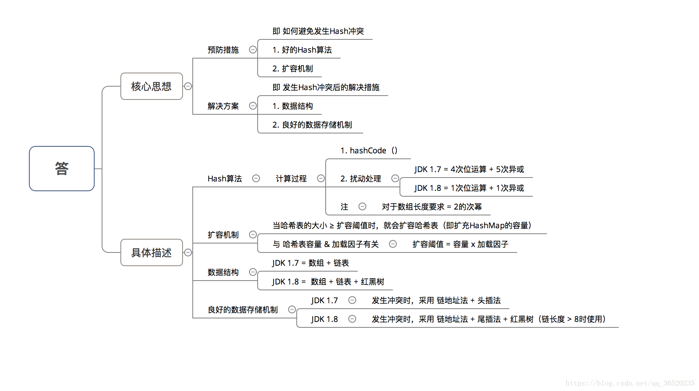

## 为什么HashMap具备下述特点

键-值（key-value）都允许为空、线程不安全、不保证有序、存储位置随时间变化


## 为什么 String、Integer 这样的包装类适合作为 key 键

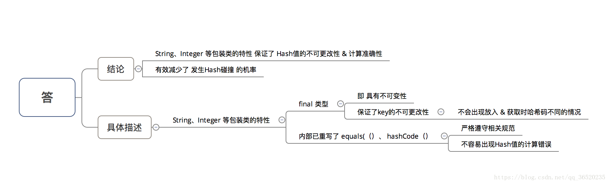

## HashMap 中的 key若 Object类型， 则需实现哪些方法？

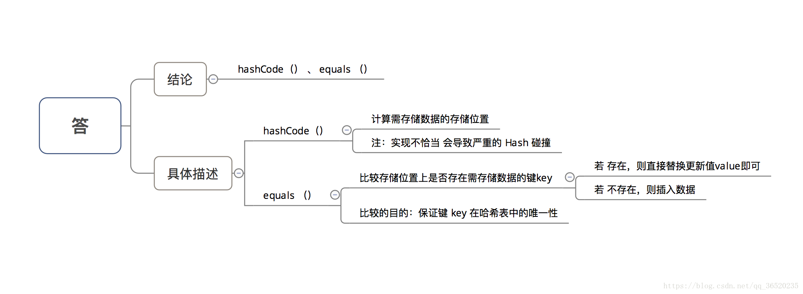

