# 集合

集合是java中提供的一种容器，可以用来存储多个数据。数组的长度是固定的。集合的长度是可变的。

数组中存储的是同一类型的元素，可以存储基本数据类型值。集合存储的都是对象。而且对象的类型可以不一致。在开发中一般当对象多的时候，使用集合进行存储。

**普通集合**：通常性能最高，但是不保证多线程的安全性和并发的可靠性。

**线程安全集合**：仅仅是给集合添加了 synchronized 同步锁，串行化，严重牺牲了性能，而且对并发的效率就更低了，

**并发集合**：则通过复杂的策略不仅保证了多线程的安全又提高的并发时的效率。  

# Collection

## 介绍

- 可以理解为只包含一组对象且不显式保存映射关系的抽象容器。jdk里面没有直接的实现类，通常是用它来当做某些方法的参数来增强便利性和普遍性，比如Collections.min/max/synchronizedCollection，以及工具包中常用的CollectionUtils.isEmpty等等。
- 其他工具包中会有提供这个接口的直接实现类，比如guava的Multiset，apache commons collections的Bag。multiset/bag可以看成是一种可以成功地重复添加元素的set，这里的成功指的是add操作能改变自身，set添加重复元素不会改变自身。具体有什么用，一个常见的使用multiset的场景就是计数器，比如我要统计接口访问次数，可以用HashMultiiSet<String>。这样子和直接使用HashMap<String, Integer>很像，的确，HashMultiiSet底层也是这样实现的，不过这样使用更直接，能够更好的表达程序逻辑。
  


## 接口方法

Collection是所有单列集合的父接口，因此在Collection中定义了单列集合(List和Set)通用的一些方法，这些方法可用于操作所有的单列集合。方法如下：

 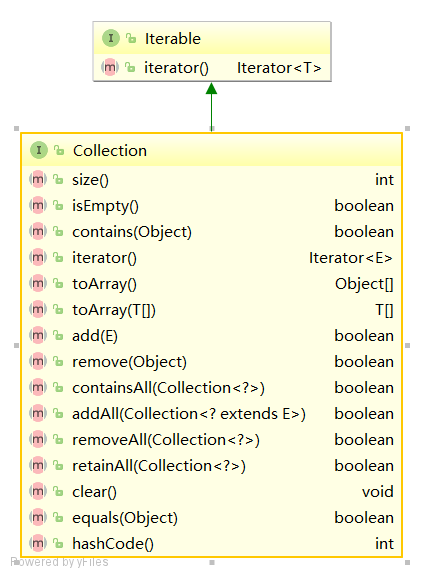

# List

## 介绍

`java.util.List`接口继承自`Collection`接口，是单列集合的一个重要分支，习惯性地会将实现了`List`接口的对象称为List集合。

**特点**

1. **存取有序**，即元素的存入顺序和取出顺序一致。
3. **带有索引**，通过索引就可以精确的操作集合中的元素（与数组的索引是一个道理），List的有序性是索引带来的
4. **可以重复**，通过元素的equals方法，来比较是否为重复的元素。

| 实现       | 操作特性                                                     | 成员要求                     |
| ---------- | ------------------------------------------------------------ | ---------------------------- |
| ArrayList  | 提供快速的基于索引的成员访问，对尾 部成员的增加和删除支持较好 | 成员可为任意Object子类的对象 |
| LinkedList | 对列表中任何位置的成员的增加和删除 支持较好，但对基于索引的成员访问支 持性能较差 | 成员可为任意Object子类的对象 |

## 接口方法

List作为Collection集合的子接口，不但继承了Collection接口中的全部方法，而且还增加了一些**根据元素索引**来操作集合的特有方法

 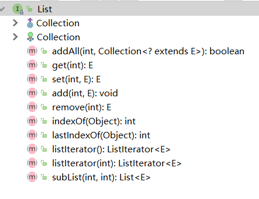

## ArrayList

### 介绍

`java.util.ArrayList`集合数据存储的结构是**数组结构**。元素增删慢，查找快，由于日常开发中使用最多的功能为**查询数据、遍历数据**，所以`ArrayList`是最常用的集合。

每次增删都会改变一次modCount

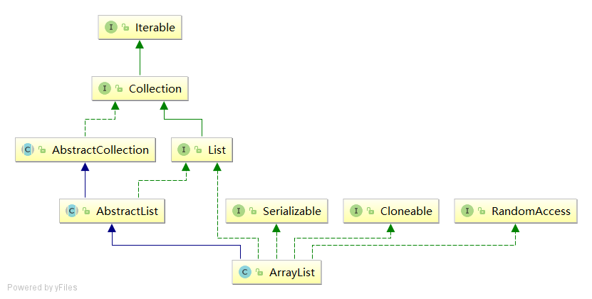 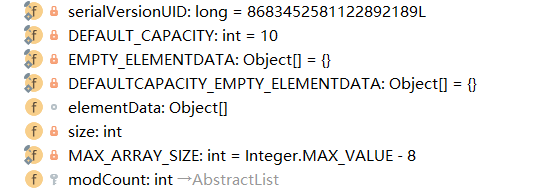 

### 构造器

```java
private transient Object[] elementData;
private int size;

public ArrayList(int paramInt){
    
    if (paramInt < 0)
        throw new IllegalArgumentException("Illegal Capacity: " + paramInt);

    this.elementData = new Object[paramInt];
}

public ArrayList()
{
    this(10);
}
```

此处elementData就是它底层用来存放数据的数组元素，仔细看一下，无论采用无参还有有参的构造函数，最终都归结于一句话：`this.elementData = new Object[paramInt]` 。

**注意**

`if (elementData.getClass() != Object[].class)` 的存在原因？

`elementData`虽然声明是 `Object[]` ，但是实际`class`类型取决于赋予的数组对象，如果`c.toArray()`没有返回`Object[]`类型的数组，那么后面就会出现数组增加对象就会出现问题。

所以需要强制转换为`Object[].class`

```java
public ArrayList(Collection<? extends E> c) {
    elementData = c.toArray();
    if ((size = elementData.length) != 0) {
        // c.toArray might (incorrectly) not return Object[] (see 6260652)
        if (elementData.getClass() != Object[].class)
            elementData = Arrays.copyOf(elementData, size, Object[].class);
    } else {
        // replace with empty array.
        this.elementData = EMPTY_ELEMENTDATA;
    }
}
```


### 扩容

数组进行扩容时，会将老数组中的元素重新拷贝一份到新的数组中，每次数组容量的增长大约是其原容量的1.5倍。

这种操作的代价是很高的，因此在实际使用时，我们应该尽量避免数组容量的扩张。

当我们可预知要保存的元素的多少时，要在构造ArrayList实例时，就指定其容量，以避免数组扩容的发生。

或者根据实际需求，通过调用ensureCapacity方法来手动增加ArrayList实例的容量。

```java
public void ensureCapacity(int paramInt)
  {
    this.modCount += 1;
    int i = this.elementData.length;
    if (paramInt > i) {
      Object[] arrayOfObject = this.elementData;
      int j = i * 3 / 2 + 1;
      if (j < paramInt)
        j = paramInt;
      this.elementData = Arrays.copyOf(this.elementData, j);
    }
  }

// 预先设置list的大小
//list.ensureCapacity(N);
```

### 减容

ArrayList还给我们提供了将底层数组的容量调整为当前列表保存的实际元素的大小的功能。它可以通过trimToSize方法来实现。

```java

public void trimToSize()
  {
    this.modCount += 1;
    int i = this.elementData.length;
    if (this.size < i)
      this.elementData = Arrays.copyOf(this.elementData, this.size);
  }
```

### iterator

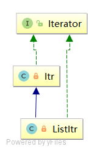

每次都创建一个iterator

```java
public Iterator<E> iterator() {
    return new Itr();
}
```

指针`cursor`指向下一个将要`next()` 返回的下标。强一致性，线程不安全

#### hasNext

```java
private class Itr implements Iterator<E> {
    int cursor;       // index of next element to return
    int lastRet = -1; // index of last element returned; -1 if no such
    int expectedModCount = modCount; //维护当前数组结构修改的次数，扩容减容都会出错。The modCount value that the iterator believes that the backing List should have.  If this expectation is violated, the iterator has detected concurrent modification.

    Itr() {}

    public boolean hasNext() {
        return cursor != size;//不相等
    }
    
}
```

#### next

这里体现了`ArrayList`是线程不安全的，`iterator`也是不安全的，强一致性iterator，不允许其他线程同时修改

```java
    //需要判断size，length，
    @SuppressWarnings("unchecked")
    public E next() {
        checkForComodification();)//1. 需要判断数组结构有没有改变，增加或者删除都会改变数组结构,抛出异常
        int i = cursor;
        
        if (i >= size)
            throw new NoSuchElementException();//2. 越界，不能拿到
        
        Object[] elementData = ArrayList.this.elementData;
        if (i >= elementData.length)
            throw new ConcurrentModificationException();//3. 判断数组缩小了，
        
        cursor = i + 1;  // cursor+1
        return (E) elementData[lastRet = i];//如果并发，这里也会发生越界
    }

    final void checkForComodification() {
            if (modCount != expectedModCount
                throw new ConcurrentModificationException();
    }
```

#### remove

```java
//需要重置各种参数，便于next比较
cursor = lastRet;
lastRet = -1;

public void remove() {
    if (lastRet < 0)
        throw new IllegalStateException();
    checkForComodification();

    try {
        ArrayList.this.remove(lastRet);
        cursor = lastRet;//cursor设为上一个
        lastRet = -1;//初始化为-1
        expectedModCount = modCount;//重新设置modcount
    } catch (IndexOutOfBoundsException ex) {
        throw new ConcurrentModificationException();
    }
}
```

#### ListItr

```java
//previous()方法是找到该cursor的上一个
int i = cursor - 1;
return (E) elementData[lastRet = i];
```

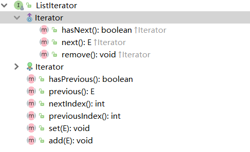

## LinkedList

### 介绍

`java.util.LinkedList`集合数据存储的结构是**双向循环链表**。方便元素添加、删除的集合。

我们还可以使用LinkedList来实现队列和栈。

虽然实现了`List`，但是根据index找元素需要一个个遍历，很慢。

  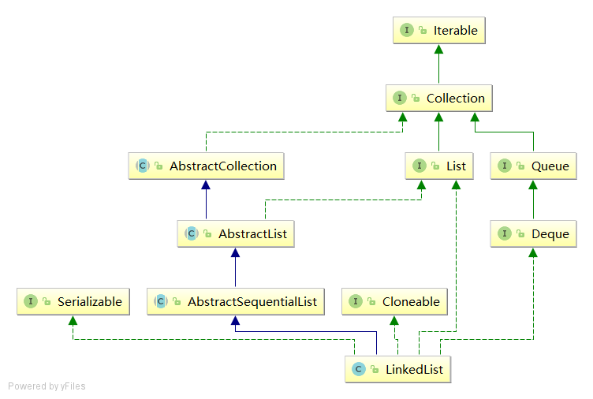


 

### Deque

实际开发中对一个集合元素的添加与删除经常涉及到**首尾操作**，而LinkedList继承的`Deque`接口提供了大量首尾操作的方法。这些方法我们作为了解即可：

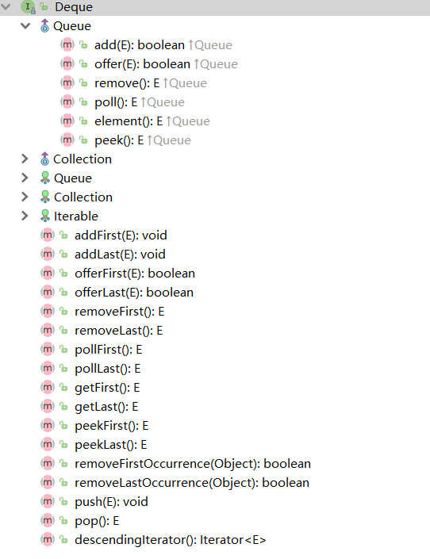 

### 双向

这是LinkedList的原始存储模型，因为是双向循环列表，我们可以回忆一下数据结构中双向列表是什么情况：一个数据data，两个指针，一个指向前一个节点，名为previous，一个指向下一个节点，名为next。

```java
//java6是entry
private static class Node<E> {
        E item;
        Node<E> next;
        Node<E> prev;

        Node(Node<E> prev, E element, Node<E> next) {
            this.item = element;
            this.next = next;
            this.prev = prev;
        }
    }
```

### 循环

头尾相等，就是说初始化的时候就已经设置成了循环的。

java8

```java
public class LinkedList ...{
    
    //首尾
    transient Node<E> first;
    transient Node<E> last;
    
    public LinkedList() {}//空构造器

    public boolean add(E e) {
        linkLast(e);
        return true;
    }

    /**
     * Links e as last element.
     */
    void linkLast(E e) {
        final Node<E> l = last;
        final Node<E> newNode = new Node<>(l, e, null);
        last = newNode;
        if (l == null)
            first = newNode;
        else
            l.next = newNode;
        size++;
        modCount++;
    }
}
```

java6

```java

public LinkedList() {
        header.next = header.previous = header;
}
//添加操作，循环，header的下一个是尾，尾的下一个是头	
private Entry<E> addBefore(E e, Entry<E> entry) {
		Entry<E> newEntry = new Entry<E>(e, entry, entry.previous);//-------1---------
		newEntry.previous.next = newEntry;
		newEntry.next.previous = newEntry;
		size++;
		modCount++;
		return newEntry;
	}
```

## Vector

### 介绍

**矢量队列**

1. 数组结构，思想和arraylist没区别
2. 线程安全，synchronized，效率低。
3. 数据增长：当需要增长时，Vector有一个`capacityIncrement`参数，非null就增加`capacityIncrement`，否则增长为原来2倍；而ArrayList却是原来的一半。
4. 已经被jdk抛弃

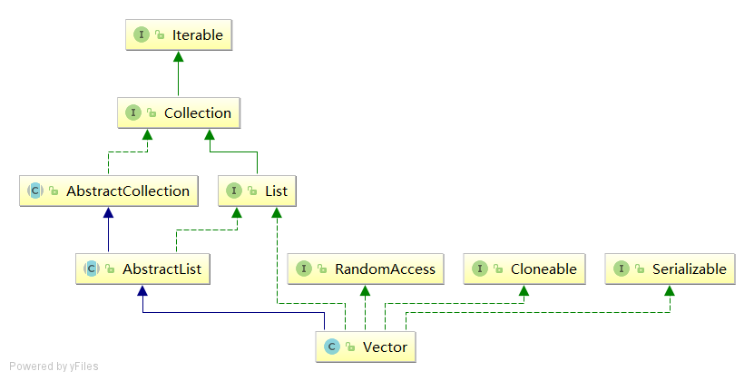  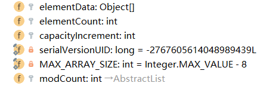 

## **Stack**

### 介绍

1. 继承于[Vector](http://www.cnblogs.com/skywang12345/p/3308833.html)(矢量队列)，数组方法实现的**栈结构**，基本没有修改，只是增加了stack的几个方法
2. 底层依赖`Vector`
3. 操作都是线程安全的，synchronized

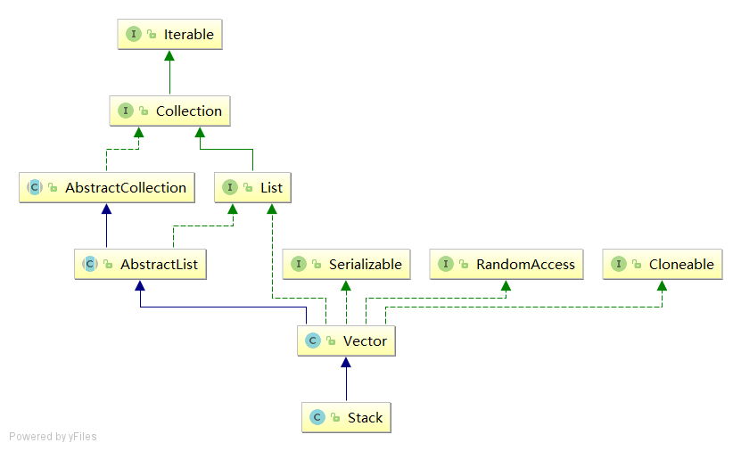 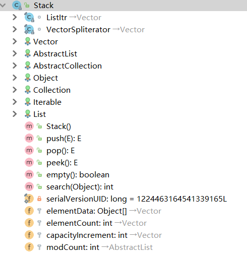 

### 源码

线程安全

```java
//空构造器
public Stack() { }

//push
public E push(E item) {
    addElement(item);

    return item;
}

//pop
public synchronized E pop() {
    E       obj;
    int     len = size();

    obj = peek();
    removeElementAt(len - 1);

    return obj;
}

//peek
public synchronized E peek() {
    int     len = size();

    if (len == 0)
        throw new EmptyStackException();
    return elementAt(len - 1);
}
```


# Set

## 介绍

2. **不能重复**，核心特征，严格遵守（符合常理的实现）java api docs中写的==、equals和hashCode以及几个别的接口比如Comparable等等的规范。
2. **元素无序**，无序性不是Set的硬性要求。

| 实现          | 操作特性                                                     | 成员要求                                                     |
| ------------- | ------------------------------------------------------------ | ------------------------------------------------------------ |
| HashSet       | 外部无序地遍历成员                                           | 成员可为任意Object子类的对象，但如果覆 盖了equals方法，同时注意修改hashCode 方法。 |
| TreeSet       | 外部有序地遍历成员；附加实现了 SortedSet, 支持子集等要求顺序的操作 | 成员要求实现caparable接口，或者使 用 Comparator构造TreeSet。成员一般 为同一类型。 |
| LinkedHashSet | 外部按成员的插入顺序遍历成员                                 | 成员与HashSet成员类似                                        |

## HashSet

### 介绍

1. 数据结构是**哈希表**，具有良好的存取和查找性能。

2. 底层的实现其实是一个`java.util.HashMap`支持。

   

### 初始化

依赖HashMap

```java
public int size() {
    return map.size();
}

public boolean add(E e) {
    return map.put(e, PRESENT)==null;
}

public HashSet(int initialCapacity, float loadFactor) {
    map = new HashMap<>(initialCapacity, loadFactor);
}
```

### 例子

#### 简单

~~~java
public class HashSetDemo {
    public static void main(String[] args) {
        //创建 Set集合
        HashSet<String>  set = new HashSet<String>();

        //添加元素
        set.add(new String("cba"));
        set.add("abc");
        set.add("bac"); 
        set.add("cba");  
        //遍历
        for (String name : set) {
            System.out.println(name);
        }
    }
}
//字符串"cba"只存储了一个，也就是说重复的元素set集合不存储。

/*
 cba
 abc
 bac
*/
~~~

#### HashSet存储自定义类型元素

给HashSet中存放自定义类型元素时，需要重写对象中的hashCode和equals方法，建立自己的比较方式，才能保证HashSet集合中的对象唯一

创建自定义Student类

~~~java
public class Student {
    private String name;
    private int age;

    public Student() {
    }

    public Student(String name, int age) {
        this.name = name;
        this.age = age;
    }

    public String getName() {
        return name;
    }

    public void setName(String name) {
        this.name = name;
    }

    public int getAge() {
        return age;
    }

    public void setAge(int age) {
        this.age = age;
    }

    @Override
    public boolean equals(Object o) {
        if (this == o)
            return true;
        if (o == null || getClass() != o.getClass())
            return false;
        Student student = (Student) o;
        return age == student.age &&
               Objects.equals(name, student.name);
    }

    @Override
    public int hashCode() {
        return Objects.hash(name, age);
    }
}
~~~

~~~java
public class HashSetDemo2 {
    public static void main(String[] args) {
        //创建集合对象   该集合中存储 Student类型对象
        HashSet<Student> stuSet = new HashSet<Student>();
        //存储 
        Student stu = new Student("于谦", 43);
        stuSet.add(stu);
        stuSet.add(new Student("郭德纲", 44));
        stuSet.add(new Student("于谦", 43));
        stuSet.add(new Student("郭麒麟", 23));
        stuSet.add(stu);

        for (Student stu2 : stuSet) {
            System.out.println(stu2);
        }
    }
}
执行结果：
Student [name=郭德纲, age=44]
Student [name=于谦, age=43]
Student [name=郭麒麟, age=23]
~~~


## LinkedHashSet

### 介绍

1. `HashSet`的子类
2. 底层依赖于`LinkedHashMap`
3. 存取有序
4. 几乎没有重写任何`HashSet`的任何方法，但是用了`HashSet`的一个默认权限的构造器
5. 线程不安全的，如果要使用线程安全可以Collections.synchronizedSet()

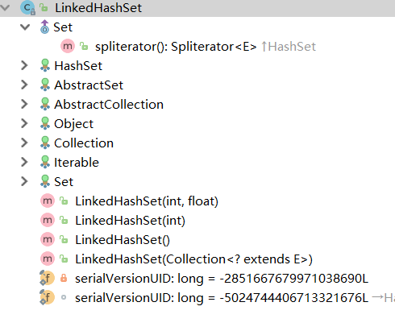 

### 构造器

调用HashSet的构造器，`HashSet`创建`LinkedHashMap`，具体操作还是`LinkedHashMap`里面的源码

```java
// java.util.LinkedHashSet#LinkedHashSet(int, float)
public LinkedHashSet(int initialCapacity, float loadFactor) {
    super(initialCapacity, loadFactor, true);
}

// java.util.HashSet#HashSet(int, float, boolean)
// This package private constructor is only used by LinkedHashSet.
HashSet(int initialCapacity, float loadFactor, boolean dummy) {
    map = new LinkedHashMap<>(initialCapacity, loadFactor);
}
```

演示代码如下:

~~~java
public class LinkedHashSetDemo {
	public static void main(String[] args) {
		Set<String> set = new LinkedHashSet<String>();
		set.add("bbb");
		set.add("aaa");
		set.add("abc");
		set.add("bbc");
        Iterator<String> it = set.iterator();
		while (it.hasNext()) {
			System.out.println(it.next());
		}
	}
}
结果：
  bbb
  aaa
  abc
  bbc
~~~

## TreeSet

### 介绍

1. 底层数据结构是红黑树
2. 必须进行自定义的大小顺序排序。
3. 性能慢
4. 依赖TreeMap

## 联系与区别

### 联系

1. `TreeSet`, `LinkedHashSet` and `HashSet` 在java中都是实现`Set`的数据结构
2. 线程不安全的，如果要使用线程安全可以`Collections.synchronizedSet()`

### 区别

1. `HashSet`插入数据最快，其次`LinkHashSet`，最慢的是`TreeSet`，因为内部实现排序
2. `null`：`HashSet`和`LinkHashSet`允许存在null数据，但是`TreeSet`中插入null数据时会报`NullPointerException`
3. `Ordering`: `HashSet`不保证有序，`LinkHashSet`保证`FIFO`即按插入顺序排序，**TreeSet安装内部实现排序，也可以自定义排序规则**

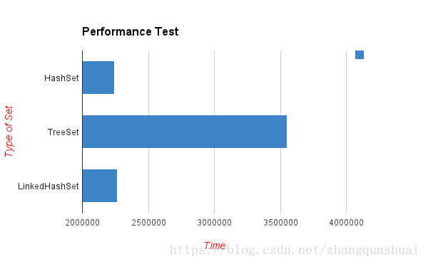 

# Queue

## 介绍

这个接口java api docs里面说得很详细，我就搬一下。

- 提供了两套用于普通队列操作的方法。普通队列就是只能在尾部添加元素、在头部删除/获取元素的队列。add这一条主要是保留Collection接口的风格习惯，Collection接口都是通过抛出异常来表明不能添加删除。

- 提供offer这套主要是因为Queue接口的实现类有个很重要的场景，那就是生产者消费者模型中任务队列，这时候应该有队列状态检查机制，返回特殊值的一套方法就利用特殊值来通知操作者队列处于特殊状态（队列空、队列满），无法完成操作。

- 当然这种队列状态检查也可以使用异常来间接完成，不用异常个人觉得有两点：1、因为队列处于特殊状态而不能添加成功应该是一种正常状态，不需要用异常；2、异常开销大。
- 返回特殊值：对于删除和获取元素这两个操作，一般是返回null作为特殊值表示删除失败；对于插入操作，一般是返回false表示删除失败。
  特别注意下add(e)这个方法，此方法是继承自Collection接口的，它是有返回值的。实际使用中根据规范来：如果是不继承Queue接口，比如Set，其add操作在add失败时可以返回false（Set中已经有equals一样的元素），也可以抛出异常（比如此Set实现不支持null元素）；如果有继承Queue这一支的几个接口，那么建议add方法实现成功返回true，失败时直接抛出异常，不处理return。


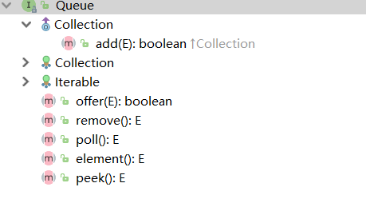

| 动作               | 抛出异常  | 返回特殊值 |
| ------------------ | --------- | ---------- |
| 插入               | add(e)    | offer(e)   |
| 删除头元素，并返回 | remove()  | poll()     |
| 获取头元素         | element() | peek()     |

# Deque

提供双端队列功能，双端队列是头部尾部都能进行添加、删除、获取操作的队列。双端队列还可以用于实现Stack这种结构，因此在Deque接口中额外提供了Stack有关的几个方法，建议是用Deque的实现类代替遗留的Stack类。
Deque接口特殊性质跟Queue接口一样，注意几套方法的区别就行。

|                    | 头部操作，抛出异常 | 头部操作，返回特殊值 | 尾部操作，抛出异常 | 尾部操作，返回特殊值 |
| ------------------ | ------------------ | -------------------- | ------------------ | -------------------- |
| 插入               | addFirst(e)        | offerFirst(e)        | addLast(e)         | offerLast(e)         |
| 删除头元素，并返回 | removeFirst()      | pollFirst()          | removeLast()       | pollLast()           |
| 获取头元素         | getFirst()         | peekFirst()          | getLast()          | peekLast()           |

- 双端队列Deque的功能包含了队列Queue的所有功能，但额外又引进了不同的方法，因此下面的方法在各种实现中强烈建议被实现为等价的，即：

  add(e)      <--->      addLast(e)
  offer(e)    <--->      offerLast(e)
  remove()    <--->      removeFirst()
  poll()      <--->      pollFirst()
  element()   <--->      getFirst()
  peek()      <--->      peekFirst()

- 对于栈操作，也是可以通过双端队列操作实现的，因此也建议下面的的方法实现为等价的，即：

  push(e)     <--->      addFirst(e)
  pop()       <--->      removeFirst()
  peek()      <--->      peekFirst()

- 此外还添加了几个别的方法：

  boolean removeFirstOccurrence(Object o)：从头部开始移除第一个等于o的元素e，这里的等于指的是o==null ? e==null : o.equals(e)。如果遍历完了还没有找到等于的元素，则不改变这个Deque；如果成功移除，则返回true。
  boolean removeLastOccurrence(Object o)：基本同上，方向为从尾部开始。
  Iterator<E> descendingIterator()：返回一个和iterator方法方向相反的迭代器。通常iterator方法是从头到尾迭代，descendingIterator是从尾到头迭代。


# Map

## 介绍

`java.util.Map`接口是负责key-value的，也就是映射。

* `Collection`是单列集合，元素是孤立存在的，向集合中存储元素采用一个个元素的方式存储。
* `Map`是双列集合，元素是成对存在的。每个元素由键与值两部分组成，通过键可以找对所对应的值。
* 需要注意的是，`Map`中的集合不能包含重复的键，值可以重复；每个键只能对应一个值。

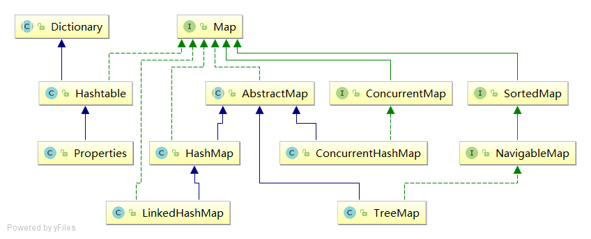

| 实现            | 操作特性                                                     | 成员要求                                                     |
| --------------- | ------------------------------------------------------------ | ------------------------------------------------------------ |
| HashMap         | 使用hash算法实现的map，数组+链表/树，能满足用户对Map的通用需求 | 键成员可为任意Object子类的对象，但如果 覆盖了equals方法，同时注意修改 hashCode方法。 |
| TreeMap         | 使用二叉树实现的map，支持对键有序地遍历，使用时建议先用 HashMap增加和删除成员，最后从 HashMap生成TreeMap；附加实现了 SortedMap接口，支持子Map等要求顺 序的操作 | 键成员要求实现caparable接口，或者使用 Comparator构造TreeMap。键成员一般为 同一类型。 |
| LinkedHashMap   | 保留键的插入顺序，用equals 方法检查 键和值的相等性           | 成员可为任意Object子类的对象，但如果覆 盖了equals方法，同时注意修改hashCode 方法。 |
| IdentityHashMap | 使用== 来检查键和值的相等性。                                | 成员使用的是严格相等                                         |
| WeakHashMap     | 其行为依赖于垃圾回收线程，没有绝对 理由则少用                |                                                              |


## 接口方法

**java1.6 和java1.8**

全部方法都是与key-value相关的,，还有获取key、value、entry集合的

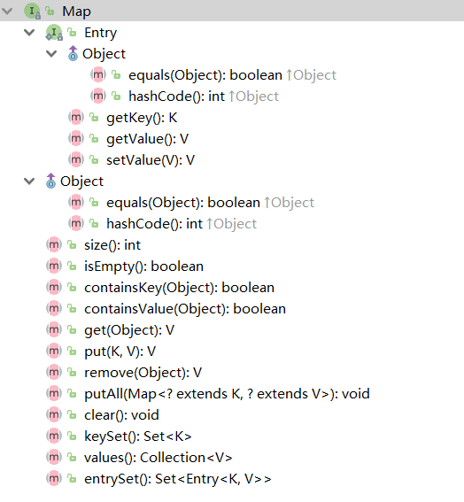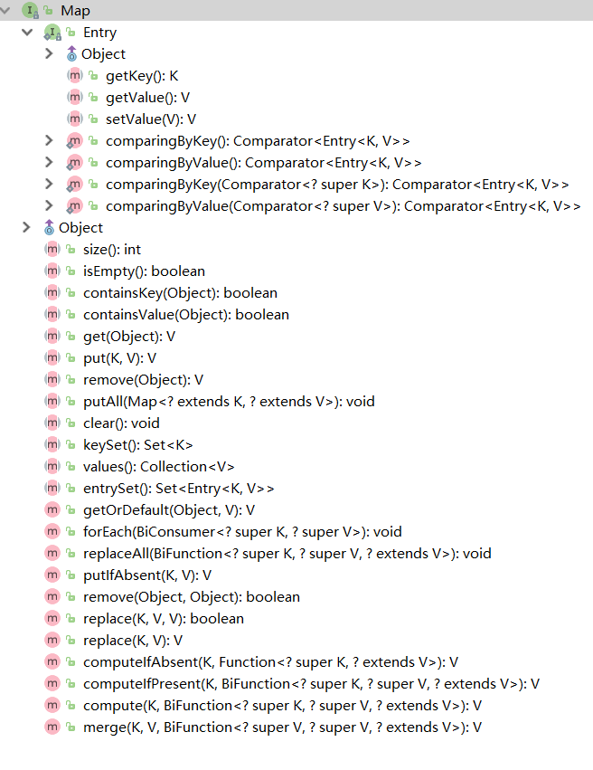 


> tips:
>
> 使用put方法时，若指定的键(key)在集合中没有，则没有这个键对应的值，返回null，并把指定的键值添加到集合中； 
>
> 若指定的键(key)在集合中存在，则返回值为集合中键对应的值（该值为替换前的值），并把指定键所对应的值，替换成指定的新值。 

## 遍历

### 遍历键找值

键找值方式：即通过元素中的键，获取键所对应的值

分析步骤：

1. 获取Map中所有的键，由于键是唯一的，所以返回一个Set集合存储所有的键。方法提示:`keyset()`
2. 遍历键的Set集合，得到每一个键。
3. 根据键，获取键所对应的值。方法提示:`get(K key)`

代码演示：

~~~java
public class MapDemo01 {
    public static void main(String[] args) {
        //创建Map集合对象 
        HashMap<String, String> map = new HashMap<String,String>();
        //添加元素到集合 
        map.put("胡歌", "霍建华");
        map.put("郭德纲", "于谦");
        map.put("薛之谦", "大张伟");

        //获取所有的键  获取键集
        Set<String> keys = map.keySet();
        // 遍历键集 得到 每一个键
        for (String key : keys) {
          	//key  就是键
            //获取对应值
            String value = map.get(key);
            System.out.println(key+"的CP是："+value);
        }  
    }
}
~~~

遍历图解：


### Entry键值对对象

我们已经知道，`Map`中存放的是两种对象，一种称为**key**(键)，一种称为**value**(值)，它们在在`Map`中是一一对应关系，这一对对象又称做`Map`中的一个`Entry(项)`。`Entry`将键值对的对应关系封装成了对象。即键值对对象，这样我们在遍历`Map`集合时，就可以从每一个键值对（`Entry`）对象中获取对应的键与对应的值。

 既然Entry表示了一对键和值，那么也同样提供了获取对应键和对应值得方法：

* `public K getKey()`：获取Entry对象中的键。
* `public V getValue()`：获取Entry对象中的值。

在Map集合中也提供了获取所有Entry对象的方法：

* `public Set<Map.Entry<K,V>> entrySet()`: 获取到Map集合中所有的键值对对象的集合(Set集合)。

### 遍历键值对

键值对方式：即通过集合中每个键值对(Entry)对象，获取键值对(Entry)对象中的键与值。

操作步骤与图解：

1.  获取Map集合中，所有的键值对(Entry)对象，以Set集合形式返回。方法提示:`entrySet()`。

2.  遍历包含键值对(Entry)对象的Set集合，得到每一个键值对(Entry)对象。
3.  通过键值对(Entry)对象，获取Entry对象中的键与值。  方法提示:`getkey() getValue()`     

~~~java
public class MapDemo02 {
    public static void main(String[] args) {
        // 创建Map集合对象 
        HashMap<String, String> map = new HashMap<String,String>();
        // 添加元素到集合 
        map.put("胡歌", "霍建华");
        map.put("郭德纲", "于谦");
        map.put("薛之谦", "大张伟");

        // 获取 所有的 entry对象  entrySet
        Set<Entry<String,String>> entrySet = map.entrySet();

        // 遍历得到每一个entry对象
        for (Entry<String, String> entry : entrySet) {
           	// 解析 
            String key = entry.getKey();
            String value = entry.getValue();  
            System.out.println(key+"的CP是:"+value);
        }
    }
}
~~~

遍历图解：


> tips：Map集合不能直接使用迭代器或者foreach进行遍历。但是转成Set之后就可以使用了。


## HashMap

1. 线程不安全，里面的EntrySet也是线程不安全的

2. 哈希表结构，元素的存取顺序不能保证一致。
3. 由于要保证key的唯一、不重复，需要重写key的hashCode()方法、equals()方法。

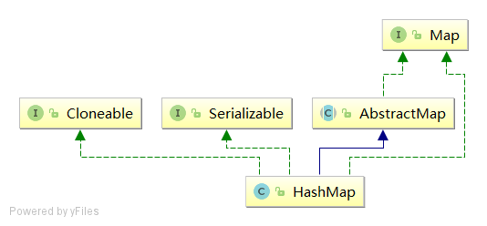


https://juejin.cn/post/6844903954774491144 | 为什么HashMap要自己实现writeObject和readObject方法？ - 掘金 

## Hashtable

### 介绍

1. HashTable和HashMap采用相同的存储机制，二者的实现基本一致，思想一致。
2. 线程安全，都是synchronized，
3. 键值都不允许null，在HashTable中调用put方法时，如果key为null，直接抛出NullPointerException。
4. 初始化大小是11.
5. 类名不是驼峰命令方法
6. Hashtable和Vector集合一样,在jdk1.2版本之后被更先进的集合(HashMap,ArrayList)取代了

 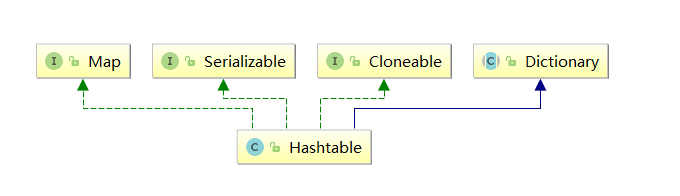

    Hashtable的子类Properties依然活跃在历史舞台
    Properties集合是一个唯一和IO流相结合的集合

### 同步

```java
//entrySet和keySet都加锁
public Set<Map.Entry<K,V>> entrySet() {
    if (entrySet==null)
        entrySet = Collections.synchronizedSet(new EntrySet(), this);//加锁
    return entrySet;
}

public Set<K> keySet() {
    if (keySet == null)
        keySet = Collections.synchronizedSet(new KeySet(), this);//加锁
    return keySet;
}
(// containsValue和size虽然是读操作，但是会批量读取到所有Segment，所以特殊处理
// 先不加锁尝试两次以获得比较近似的结果，如果contains就直接返回（因为有一个存在就是存在，不存在才需要遍历全部），不contains才继续，如果发现modCount被其他线程修改，就全部加锁再执行
// 不加锁读两次时，可能会碰见写操作的中间状态，也可能在循环到后面时有线程修改了前面，所以这个方法不是100%准确的
// 设计成这样主要是为了提高效率，很多业务还是可以接受这种误差，需要更强一致性的时候，可以自己写个方法
// 上面Segment的分析中指出了，put相同的key、replace方法不会修改modCount，但是会改变value，这一点使得后面检测modCount是否改变可能成为无用功，让containsValue方法的准确性降低了，1.7进行了修复
public boolean containsValue(Object value) {
    if (value == null)
        throw new NullPointerException();

final Segment<K,V>[] segments = this.segments;
int[] mc = new int[segments.length];

// 先不加锁执行RETRIES_BEFORE_LOCK = 2次
for (int k = 0; k < RETRIES_BEFORE_LOCK; ++k) {
    int sum = 0;
    int mcsum = 0;
    for (int i = 0; i < segments.length; ++i) {
        int c = segments[i].count; // 这个c没哪里用，意义不明
        mcsum += mc[i] = segments[i].modCount; // 就是 mc[i] = segments[i].count; mssum += mc[i]，临时保存一份modCount
        if (segments[i].containsValue(value)) // 碰见contains直接return
            return true;
    }
    boolean cleanSweep = true;
    // mcsum是modCount的和，为0可以认为遍历开始时没有任何put完成过任何HashEntry，即方法开始执行时不包含任何HashEntry，可以认为（近似认为，几率比较大）此时也不包含
    if (mcsum != 0) {
        for (int i = 0; i < segments.length; ++i) {
            int c = segments[i].count;
            if (mc[i] != segments[i].modCount) { // modCount改变，说明有其他线程修改了Segment的结构，退出循环。会有replace的问题，前面说了
                cleanSweep = false;
                break;
            }
        }
    }
    if (cleanSweep)
        return false;
}
// 如果连续两次都碰见modCount改变的情况，这时候一次性对全部Segment加锁，最大程度保证遍历时的一致性
// 因为是全部加锁后再遍历，遍历开始后没有线程可以修改任何Segment的结构，可以保证当前线程得到的是准确值
for (int i = 0; i < segments.length; ++i)
    segments[i].lock();
boolean found = false;
try {
    for (int i = 0; i < segments.length; ++i) {
        if (segments[i].containsValue(value)) {
            found = true;
            break;
        }
    }
} finally {
    for (int i = 0; i < segments.length; ++i)
        segments[i].unlock();
}
return found;

}

// 不是Map接口的方法，为了兼容Hashtable，等价于containsValue
public boolean contains(Object value) {
    return containsValue( value);
}

// 基本同containValue，但是只执行一次且不会加锁
public boolean isEmpty() {
    final Segment<K,V>[] segments = this.segments;
    int[] mc = new int[segments.length];
    int mcsum = 0;
    for (int i = 0; i < segments.length; ++i) {
        if (segments[i].count != 0)
            return false;
        else
            mcsum += mc[i] = segments[i].modCount;
    }
    if (mcsum != 0) {
        for (int i = 0; i < segments.length; ++i) {
            if (segments[i].count != 0 || mc[i] != segments[i].modCount)
                return false;
        }
    }
    return true;
}

// 跟containsValue差不多，但是size不会受put相同的key、replace方法的影响
// 注意最后一个int溢出处理，因为HashMap以及ConcurrentHashMap是个特殊的集合类，我们通常所说的容量是hash桶的数目，这并不是实际容量
// 因为使用链表解决hash冲突的原因，实际的可以容纳得更多，可能会远远超多Integer.MAX_VALUE，这这时返回值就是个错误的值，但还是尽量返回了一个“比较有用”的值。
// 这纯粹是历史原因造成的坑，返回个int，没考虑实际情况，1.8的新增了一个mappingCount方法，返回long型准确数字
public int size() {
    final Segment<K,V>[] segments = this.segments;
    long sum = 0;
    long check = 0;
    int[] mc = new int[segments.length];
    // 不加锁执行两次，如果两次数据不一样，或者碰到modCount++被修改了，就全部加锁在执行一次
    for (int k = 0; k < RETRIES_BEFORE_LOCK; ++k) {
        check = 0;
        sum = 0;
        int mcsum = 0;
        for (int i = 0; i < segments.length; ++i) {
            sum += segments[i].count;
            mcsum += mc[i] = segments[i].modCount;
        }
        if (mcsum != 0) {
            for (int i = 0; i < segments.length; ++i) {
                check += segments[i].count;
                if (mc[i] != segments[i].modCount) {
                    check = -1; // force retry
                    break;
                }
            }
        }
        if (check == sum)
            break;
    }
    if (check != sum) {
        sum = 0;
        for (int i = 0; i < segments.length; ++i)
            segments[i].lock();
        for (int i = 0; i < segments.length; ++i)
            sum += segments[i].count;
        for (int i = 0; i < segments.length; ++i)
            segments[i].unlock();
    }
    if (sum > Integer.MAX_VALUE) // int溢出处理，因此返回值可能会是错误的。
                                 // 并且因为兼容性的原因，这个还无法解决，只能新增一个方法，1.8的ConcurrentHashMap就是新增了一个返回long型的方法
        return Integer.MAX_VALUE;
    else
        return (int)sum;
}
```


————————————————

版权声明：本文为CSDN博主「十二页」的原创文章，遵循 CC 4.0 BY-SA 版权协议，转载请附上原文出处链接及本声明。

原文链接：https://blog.csdn.net/u011392897/article/details/60466665)

## properties

### 介绍

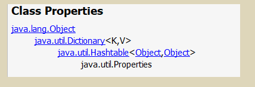

`java.util.Properties ` 继承于` Hashtable` ，来表示一个持久的属性集。它使用键值结构存储数据，每个键及其对应值都是一个字符串。该类也被许多Java类使用，比如获取系统属性时，`System.getProperties` 方法就是返回一个`Properties`对象。

### 构造方法

- `public Properties()` :创建一个空的属性列表。

### 基本的存储方法

- `public Object setProperty(String key, String value)` ： 保存一对属性。  
- `public String getProperty(String key) ` ：使用此属性列表中指定的键搜索属性值。
- `public Set<String> stringPropertyNames() ` ：所有键的名称的集合。

```java
public class ProDemo {
    public static void main(String[] args) throws FileNotFoundException {
        // 创建属性集对象
        Properties properties = new Properties();
        // 添加键值对元素
        properties.setProperty("filename", "a.txt");
        properties.setProperty("length", "209385038");
        properties.setProperty("location", "D:\\a.txt");
        // 打印属性集对象
        System.out.println(properties);
        // 通过键,获取属性值
        System.out.println(properties.getProperty("filename"));
        System.out.println(properties.getProperty("length"));
        System.out.println(properties.getProperty("location"));

        // 遍历属性集,获取所有键的集合
        Set<String> strings = properties.stringPropertyNames();
        // 打印键值对
        for (String key : strings ) {
          	System.out.println(key+" -- "+properties.getProperty(key));
        }
    }
}
输出结果：
{filename=a.txt, length=209385038, location=D:\a.txt}
a.txt
209385038
D:\a.txt
filename -- a.txt
length -- 209385038
location -- D:\a.txt
```

### 与流相关的方法load

- `public void load(InputStream inStream)`： 从字节输入流中读取键值对。 
- `public void load(Reader reader)` ：字符输入流,能读取含有中文的键值对  

> 注意:
> 1.存储键值对的文件中,键与值默认的连接符号可以使用=,空格(其他符号)
> 2.存储键值对的文件中,可以使用#进行注释,被注释的键值对不会再被读取
> 3.存储键值对的文件中,键与值默认都是字符串,不用再加引号  	

参数中使用了字节输入流，通过流对象，可以关联到某文件上，这样就能够加载文本中的数据了。文本数据格式:

```
filename=a.txt
length=209385038
location=D:\a.txt
```

加载代码演示：

```java
public class ProDemo2 {
    public static void main(String[] args) throws FileNotFoundException {
        // 创建属性集对象
        Properties pro = new Properties();
        // 加载文本中信息到属性集
        pro.load(new FileInputStream("read.txt"));
        // 遍历集合并打印
        Set<String> strings = pro.stringPropertyNames();
        for (String key : strings ) {
          	System.out.println(key+" -- "+pro.getProperty(key));
        }
     }
}
输出结果：
filename -- a.txt
length -- 209385038
location -- D:\a.txt
```

> 注意：文本中的数据，必须是键值对形式，可以使用空格、等号、冒号等符号分隔。

### 与流相关的方法store

- `void store(OutputStream out, String comments)` ：字节输出流,不能写入中文
- `void store(Writer writer, String comments)` ：字符输出流,可以写中文  

> 注意： 
>
> ​	String comments:注释,用来解释说明保存的文件是做什么用的
>
> ​	不能使用中文,会产生乱码,默认是Unicode编码。一般使用""空字符串  

```java
	private static void show02() throws IOException {
		//1.创建Properties集合对象,添加数据
		Properties prop = new Properties();
		prop.setProperty("赵丽颖", "168");
		prop.setProperty("迪丽热巴", "165");
		prop.setProperty("古力娜扎", "160");
		//2.创建字节输出流/字符输出流对象,构造方法中绑定要输出的目的地
		FileWriter fw = new FileWriter(".\\prop.txt");
		//3.使用Properties集合中的方法store,把集合中的临时数据,持久化写入到硬盘中存储
		prop.store(fw, "save data");
		//4.释放资源
		fw.close();
		//乱码
		//prop.store(new FileOutputStream(".\\prop2.txt"),"");
	}
```

#

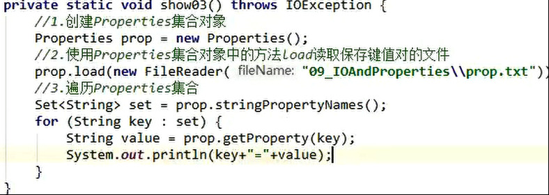

### **store存储**

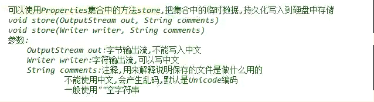

 


 

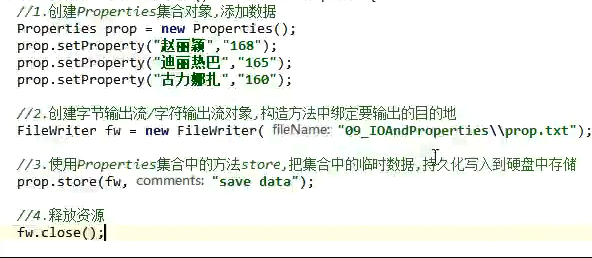

 


### **load加载**

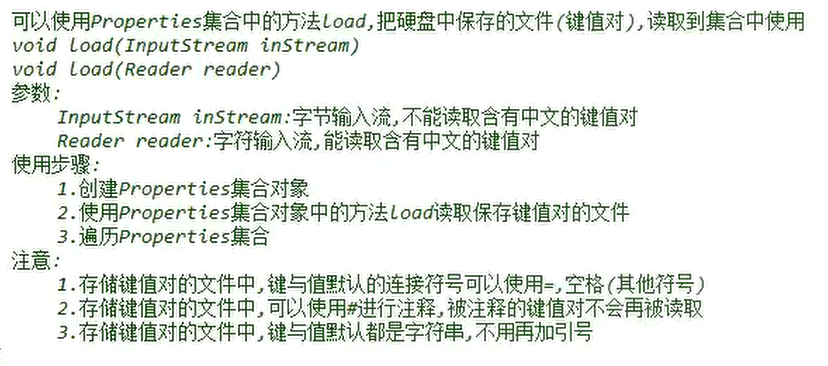

 


 


## ConcurrentHashMap

https://blog.csdn.net/a745233700/article/details/83123359 | Java集合篇：ConcurrentHashMap详解（JDK1.8）_resizestamp_张维鹏的博客-CSDN博客
https://my.oschina.net/pingpangkuangmo/blog/817973 | jdk1.8的HashMap和ConcurrentHashMap - 乒乓狂魔 - OSCHINA - 中文开源技术交流社区
https://blog.csdn.net/qq_41884976/article/details/89532816 | ConcurrentHashMap在jdk1.7和jdk1.8中的不同；_卓立苍穹的博客-CSDN博客
https://blog.csdn.net/u011392897/article/details/60479937 | Java集合类框架学习 5.3—— ConcurrentHashMap(JDK1.8)_十二页的博客-CSDN博客

https://blog.csdn.net/yjp198713/article/details/79004798#addcount%E6%96%B9%E6%B3%95 | Java集合类（十七）JUC中的集合--ConcurrentHashMap jdk1.8_keep_trying_gogo的博客-CSDN博客

## LinkedHashMap

https://blog.csdn.net/weixin_33894992/article/details/87958314

### 介绍

1. HashMap的子类，拥有HashMap的大部分特性，`LinkedHashMap`在实现时，就是重写override了几个方法。以满足其输出序列有序的需求。
2. 哈希表结构+双向链表结构，前者保证key的唯一、不重复。
3. **双向链表结构**，在每次**插入数据，或者访问、修改数据**时，**会增加节点、或调整链表的节点顺序**。以决定迭代时输出的顺序。
   - 默认情况，遍历时的顺序是**按照插入节点的顺序**。这也是其与`HashMap`最大的区别。
   - 也可以在构造时传入`accessOrder`参数，使得其遍历顺序**按照访问的顺序**输出。

多了几个field

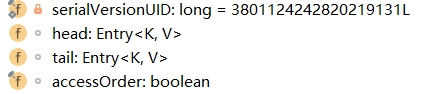 

### 初始化

```java
final boolean accessOrder; //The iteration ordering method for this linked hash map: true for access-order, false for insertion-order.

//功能最多的构造器
public LinkedHashMap(int initialCapacity,float loadFactor, boolean accessOrder) {
    super(initialCapacity, loadFactor);
    this.accessOrder = accessOrder;//多了一个accessOrder
}
```

### 节点

`LinkedHashMap`的节点`Entry`继承自`HashMap.Node`，在其基础上扩展了一下。改成了一个**双向链表**。

```java
transient LinkedHashMap.Entry<K,V> head;
transient LinkedHashMap.Entry<K,V> tail;

static class Entry<K,V> extends HashMap.Node<K,V> {
     Entry<K,V> before, after;
     Entry(int hash, K key, V value, Node<K,V> next) {
         super(hash, key, value, next);
     }
 }
```

### put

`LinkedHashMap`并没有重写任何put方法。但是其重写了构建新节点的`newNode()`方法.
`newNode()`会在`HashMap`的`putVal()`方法里被调用，`putVal()`方法会在批量插入数据`putMapEntries(Map m, boolean evict)`或者插入单个数据`public V put(K key, V value)`时被调用。

```java
    //在构建新节点时，构建的是`LinkedHashMap.Entry` 不再是`Node`.
    Node<K,V> newNode(int hash, K key, V value, Node<K,V> e) {
        LinkedHashMap.Entry<K,V> p =
            new LinkedHashMap.Entry<K,V>(hash, key, value, e);
        linkNodeLast(p);
        return p;
    }
    //将新增的节点，连接在链表的尾部
    private void linkNodeLast(LinkedHashMap.Entry<K,V> p) {
        LinkedHashMap.Entry<K,V> last = tail;
        tail = p;
        //集合之前是空的
        if (last == null)
            head = p;
        else {//将新节点连接在链表的尾部
            p.before = last;
            last.after = p;
        }
    }
```

以及`HashMap`专门预留给`LinkedHashMap`的`afterNodeAccess() afterNodeInsertion() afterNodeRemoval()` 方法。

```java
    // Callbacks to allow LinkedHashMap post-actions
    void afterNodeAccess(Node<K,V> p) { }
    void afterNodeInsertion(boolean evict) { }
    void afterNodeRemoval(Node<K,V> p) { }
```

```java
    //回调函数，新节点插入之后回调 ， 根据evict 和   判断是否需要删除最老插入的节点。如果实现LruCache会用到这个方法。
    void afterNodeInsertion(boolean evict) { // possibly remove eldest
        LinkedHashMap.Entry<K,V> first;
        //LinkedHashMap 默认返回false 则不删除节点
        if (evict && (first = head) != null && removeEldestEntry(first)) {
            K key = first.key;
            removeNode(hash(key), key, null, false, true);
        }
    }
    //LinkedHashMap 默认返回false 则不删除节点。 返回true 代表要删除最早的节点。通常构建一个LruCache会在达到Cache的上限是返回true
    protected boolean removeEldestEntry(Map.Entry<K,V> eldest) {
        return false;
    }
```

`void afterNodeInsertion(boolean evict)`以及`boolean removeEldestEntry(Map.Entry eldest)`是构建LruCache需要的回调，在`LinkedHashMap`里可以忽略它们。

### remove

`LinkedHashMap`也没有重写`remove()`方法，因为它的删除逻辑和`HashMap`并无区别。
但它重写了`afterNodeRemoval()`这个回调方法。该方法会在`Node removeNode(int hash, Object key, Object value, boolean matchValue, boolean movable)`方法中回调，`removeNode()`会在所有涉及到删除节点的方法中被调用，[上文](https://link.juejin.im/?target=http%3A%2F%2Fblog.csdn.net%2Fzxt0601%2Farticle%2Fdetails%2F77413921)分析过，是删除节点操作的真正执行者。

```java
    //在删除节点e时，同步将e从双向链表上删除
    void afterNodeRemoval(Node<K,V> e) { // unlink
        LinkedHashMap.Entry<K,V> p =
            (LinkedHashMap.Entry<K,V>)e, b = p.before, a = p.after;
        //待删除节点 p 的前置后置节点都置空
        p.before = p.after = null;
        //如果前置节点是null，则现在的头结点应该是后置节点a
        if (b == null)
            head = a;
        else//否则将前置节点b的后置节点指向a
            b.after = a;
        //同理如果后置节点时null ，则尾节点应是b
        if (a == null)
            tail = b;
        else//否则更新后置节点a的前置节点为b
            a.before = b;
    }复制代码
```

### 总结

`LinkedHashMap`相对于`HashMap`的源码比，是很简单的。因为大树底下好乘凉。它继承了`HashMap`，仅重写了几个方法，以**改变它迭代遍历时的顺序**。这也是其与`HashMap`相比最大的不同。
在每次**插入数据，或者访问、修改数据**时，**会增加节点、或调整链表的节点顺序**。以决定迭代时输出的顺序。

- `accessOrder` ,默认是false，则迭代时输出的顺序是**插入节点的顺序**。若为true，则输出的顺序是按照访问节点的顺序。为true时，可以在这基础之上构建一个`LruCache`.
- `LinkedHashMap`并没有重写任何put方法。但是其重写了构建新节点的`newNode()`方法.在每次构建新节点时，将**新节点链接在内部双向链表的尾部**
- `accessOrder=true`的模式下,在`afterNodeAccess()`函数中，会将当前**被访问**到的节点e，**移动**至内部的双向链表**的尾部**。值得注意的是，`afterNodeAccess()`函数中，会修改`modCount`,因此当你正在`accessOrder=true`的模式下,迭代`LinkedHashMap`时，如果同时查询访问数据，也会导致`fail-fast`，因为迭代的顺序已经改变。
- `nextNode()` 就是迭代器里的`next()`方法 。
  该方法的实现可以看出，迭代`LinkedHashMap`，就是从**内部维护的双链表的表头开始循环输出**。
  而双链表节点的顺序在`LinkedHashMap`的**增、删、改、查时都会更新。以满足按照插入顺序输出，还是访问顺序输出。**
- 它与`HashMap`比，还有一个小小的优化，重写了`containsValue()`方法，直接遍历内部链表去比对value值是否相等。
- 

那么，还有最后一个小问题？为什么它不重写`containsKey()`方法，也去循环比对内部链表的key是否相等呢？

### 例子

~~~java
public class LinkedHashMapDemo {
    public static void main(String[] args) {
        Map<String, String> map = new LinkedHashMap<>();
        map.put("1", "a");
        map.put("2", "b");
        map.put("3", "c");
        map.put("4", "d");
 
        Iterator<Map.Entry<String, String>> iterator = map.entrySet().iterator();
        while (iterator.hasNext()) {
            System.out.println(iterator.next());
        }
 
        System.out.println("以下是accessOrder=true的情况:");
 
        map = new LinkedHashMap<String, String>(10, 0.75f, true);
        map.put("1", "a");
        map.put("2", "b");
        map.put("3", "c");
        map.put("4", "d");
        map.get("2");//2移动到了内部的链表末尾
        map.get("4");//4调整至末尾
        map.put("3", "e");//3调整至末尾
        map.put(null, null);//插入两个新的节点 null
        map.put("5", null);//5
        
        iterator = map.entrySet().iterator();
        while (iterator.hasNext()) {
            System.out.println(iterator.next());
        }
    }
}
//输出
1=a
2=b
3=c
4=d
以下是accessOrder=true的情况:
1=a
2=b
4=d
3=e
null=null
5=null复制代码
~~~

### 参考文献

https://blog.csdn.net/u012860938/article/details/95613684 | LinkedHashMap详解_pjwtheking的博客-CSDN博客
https://blog.csdn.net/wang_8101/article/details/83067860 | LinkedHashMap基本用法&使用实现简单缓存_衣冠の禽兽的博客-CSDN博客
https://blog.csdn.net/qq_38293564/article/details/80704866 | Java集合之LinkedHashMap详解_java linkedhashmap put_DivineH的博客-CSDN博客
https://so.csdn.net/so/search?q=linkedhashmap&t=blog&o=&s=&l=&f=&viparticle= | linkedhashmap- CSDN搜索
https://blog.csdn.net/weixin_33894992/article/details/87958314 | 面试必备：LinkedHashMap源码解析（JDK8）_weixin_33894992的博客-CSDN博客

## TreeMap

### 介绍

1. 底层数据结构是红黑树
2. 必须进行自定义的大小顺序排序。
3. 性能慢


### 初始化

由于需要比较大小，形成红黑树，因此需要比较的方法。（二者必须选择一个）

1. 自然排序，元素实现 Comparable接口；
2. 比较器排序，创建一个Comparator

```java
//1. 实现Comparable
public TreeMap() {
     comparator = null;
 }


//2. 传入comparator
public TreeMap(Comparator<? super K> comparator) {
        this.comparator = comparator;
    }


public TreeMap(SortedMap<K, ? extends V> m) {
    comparator = m.comparator();
    try {
        buildFromSorted(m.size(), m.entrySet().iterator(), null, null);
    } catch (java.io.IOException cannotHappen) {
    } catch (ClassNotFoundException cannotHappen) {
    }
}

public TreeMap(Map<? extends K, ? extends V> m) {
    comparator = null;
    putAll(m);
}

```


### put

**每次插入都要比较大小，插入到节点的左子树或者右子树中。**

```java
public V put(K key, V value) {
        Entry<K,V> t = root;
        if (t == null) {
            compare(key, key); // type (and possibly null) check

            root = new Entry<>(key, value, null);
            size = 1;
            modCount++;
            return null;
        }
        int cmp;
        Entry<K,V> parent;
        // split comparator and comparable paths
        Comparator<? super K> cpr = comparator;
        if (cpr != null) {
            do {
                parent = t;
                cmp = cpr.compare(key, t.key);
                if (cmp < 0)
                    t = t.left;
                else if (cmp > 0)
                    t = t.right;
                else
                    return t.setValue(value);
            } while (t != null);
        }
        else {
            if (key == null)
                throw new NullPointerException();
            @SuppressWarnings("unchecked")
                Comparable<? super K> k = (Comparable<? super K>) key;//强制转换成Comparable
            do {
                parent = t;
                cmp = k.compareTo(t.key);
                if (cmp < 0)
                    t = t.left;
                else if (cmp > 0)
                    t = t.right;
                else
                    return t.setValue(value);
            } while (t != null);
        }
        Entry<K,V> e = new Entry<>(key, value, parent);
        if (cmp < 0)
            parent.left = e;
        else
            parent.right = e;
        fixAfterInsertion(e);
        size++;
        modCount++;
        return null;
    }
```

### fix

如何维持红黑树

```java
private void fixAfterInsertion(Entry<K,V> x) {
        x.color = RED;

        while (x != null && x != root && x.parent.color == RED) {
            if (parentOf(x) == leftOf(parentOf(parentOf(x)))) {
                Entry<K,V> y = rightOf(parentOf(parentOf(x)));
                if (colorOf(y) == RED) {
                    setColor(parentOf(x), BLACK);
                    setColor(y, BLACK);
                    setColor(parentOf(parentOf(x)), RED);
                    x = parentOf(parentOf(x));
                } else {
                    if (x == rightOf(parentOf(x))) {
                        x = parentOf(x);
                        rotateLeft(x);
                    }
                    setColor(parentOf(x), BLACK);
                    setColor(parentOf(parentOf(x)), RED);
                    rotateRight(parentOf(parentOf(x)));
                }
            } else {
                Entry<K,V> y = leftOf(parentOf(parentOf(x)));
                if (colorOf(y) == RED) {
                    setColor(parentOf(x), BLACK);
                    setColor(y, BLACK);
                    setColor(parentOf(parentOf(x)), RED);
                    x = parentOf(parentOf(x));
                } else {
                    if (x == leftOf(parentOf(x))) {
                        x = parentOf(x);
                        rotateRight(x);
                    }
                    setColor(parentOf(x), BLACK);
                    setColor(parentOf(parentOf(x)), RED);
                    rotateLeft(parentOf(parentOf(x)));
                }
            }
        }
        root.color = BLACK;
    }
```


## WeakHashMap

理解该集合类之前，建议先去了解Java的垃圾回收机制，WeakHashMap多用于缓存系统，就是说在系统内存紧张的时候可随时进行GC，但是如果内存不紧张则可以用来存放一些缓存数据。因为如果使用HashMap的话，它里面的值基本都是强引用，即使内存不足，它也不会进行GC，这样系统就会报异常。看一下WeakHashMap中Entry的实现：

```java
private static class Entry<K,V> extends WeakReference<K> implements Map.Entry<K,V> {
        private V value;
        private final int hash;
        private Entry<K,V> next;
 
        /**
         * Creates new entry.
         */
        Entry(K key, V value,
	      ReferenceQueue<K> queue,
              int hash, Entry<K,V> next) {
            super(key, queue);
            this.value = value;
            this.hash  = hash;
            this.next  = next;
        }......
```

Entry继承了WeakReference类，且在构造函数中构造了Key的弱引用，当进行put或者get操作时，都会调用一个函数叫expungeStaleEntries()，如下：

```java
    private void expungeStaleEntries() {
	Entry<K,V> e;
        while ( (e = (Entry<K,V>) queue.poll()) != null) {
            int h = e.hash;
            int i = indexFor(h, table.length);
 
            Entry<K,V> prev = table[i];
            Entry<K,V> p = prev;
            while (p != null) {
                Entry<K,V> next = p.next;
                if (p == e) {
                    if (prev == e)
                        table[i] = next;
                    else
                        prev.next = next;
                    e.next = null;  // Help GC
                    e.value = null; //  "   "
                    size--;
                    break;
                }
                prev = p;
                p = next;
            }
        }
    }
```

就是用来判断，如果key存在弱引用，则进行垃圾回收，所以这个就是WeakHashMap的工作原理。它与HashMap的区别就是：数据量大的时候，它可根据内存的情况，自动进行垃圾回收。如果手动将key置为强引用，那么它将和HashMap变得一样，失去其功能。


# 不可变集合

 Java 9，添加了几种集合工厂方法,更方便创建少量元素的集合、map实例。新的List、Set、Map的静态工厂方法可以更方便地创建集合的**不可变实例**。

例子：

~~~java
public class HelloJDK9 {  
    public static void main(String[] args) {  
        Set<String> str1=Set.of("a","b","c");  
        //str1.add("c");这里编译的时候不会错，但是执行的时候会报错，因为是不可变的集合  
        System.out.println(str1);  
        Map<String,Integer> str2=Map.of("a",1,"b",2);  
        System.out.println(str2);  
        List<String> str3=List.of("a","b");  
        System.out.println(str3);  
    }  
} 

~~~

需要注意以下两点：

> 1:of()方法只是Map，List，Set这三个接口的静态方法，其父类接口和子类实现并没有这类方法，比如    HashSet，ArrayList等待；
>
> 2:返回的集合是不可变的；


# 可变参数

在**JDK1.5**之后，如果我们定义一个方法需要接受多个参数，并且多个参数类型一致，我们可以对其简化成如下格式：

```
修饰符 返回值类型 方法名(参数类型... 形参名){  }
```

其实这个书写完全等价与

```
修饰符 返回值类型 方法名(参数类型[] 形参名){  }
```

只是后面这种定义，在调用时必须传递数组，而前者可以直接传递数据即可。

**JDK1.5**以后。出现了简化操作。**...** 用在参数上，称之为可变参数。

同样是代表数组，但是在调用这个带有可变参数的方法时，不用创建数组(这就是简单之处)，直接将数组中的元素作为实际参数进行传递，其实编译成的class文件，将这些元素先封装到一个数组中，在进行传递。这些动作都在编译.class文件时，自动完成了。

代码演示：    

```java
public class ChangeArgs {
    public static void main(String[] args) {
        int[] arr = { 1, 4, 62, 431, 2 };
        int sum = getSum(arr);
        System.out.println(sum);
        //  6  7  2 12 2121
        // 求 这几个元素和 6  7  2 12 2121
        int sum2 = getSum(6, 7, 2, 12, 2121);
        System.out.println(sum2);
    }

    /*
     * 完成数组  所有元素的求和 原始写法
     
      public static int getSum(int[] arr){
        int sum = 0;
        for(int a : arr){
            sum += a;
        }
        
        return sum;
      }
    */
    //可变参数写法
    public static int getSum(int... arr) {
        int sum = 0;
        for (int a : arr) {
            sum += a;
        }
        return sum;
    }
}
```

> tips: 上述add方法在同一个类中，只能存在一个。因为会发生调用的不确定性
>
> 注意：如果在方法书写时，这个方法拥有多参数，参数中包含可变参数，可变参数一定要写在参数列表的末尾位置。


# Collections

## 普通

```java
public static <T> boolean addAll(Collection<T> c, T... elements)  `:往集合中添加一些元素。
public static void shuffle(List<?> list) 打乱顺序`:打乱集合顺序。
public static <T> void sort(List<T> list)`:将集合中元素按照默认规则排序。
public static <T> void sort(List<T> list，Comparator<? super T> )`:将集合中元素按照指定规则排序。
```

## 生成单元素集合

Collections中的单元素集合指的是集合中只有一个元素而且集合只读。

```java
Collections.singletonList——用来生成只读的单一元素的List
Collections.singletonMap——用来生成只读的单Key和Value组成的Map
Collections.singleton——用来生成只读的单一元素的Set
    
//例子
public static void main(String[] args) {
		Map<Integer, Integer> map = Collections.singletonMap(1, 1);
		//map.put(2, 2);  ----------1-------------报错
		System.out.println(map.size());
}
```

## Checked

Checked集合具有检查插入集合元素类型的特性，例如当我们设定checkedList中元素的类型是String的时候，如果插入其他类型的元素就会抛出ClassCastExceptions异常，Collections中提供了以下生成Checked集合的方法checkedCollection，checkedList，checkedMap，checkedSet，checkedSortedMap，checkedSortedSet

## **同步集合**

Collections类提供一系列同步方法，为一些非线程安全的集合类提供同步机制。

```java
Collections.synchronizedCollection(c)
Collections.synchronizedList(list)
Collections.synchronizedMap(m)
Collections.synchronizedSet(s)
```

所有方法都被同步，监视器是集合本身this，而iterator没有被同步，调用方法时需要自己加   `synchronized (this) {...}`

```java
static class SynchronizedCollection<E> implements Collection<E>, Serializable {
        private static final long serialVersionUID = 3053995032091335093L;

        final Collection<E> c;  // Backing Collection
        final Object mutex;     // Object on which to synchronize

        SynchronizedCollection(Collection<E> c) {
            this.c = Objects.requireNonNull(c);
            mutex = this;
        }

        SynchronizedCollection(Collection<E> c, Object mutex) {
            this.c = Objects.requireNonNull(c);
            this.mutex = Objects.requireNonNull(mutex);
        }

        public int size() {
            synchronized (mutex) {return c.size();}
        }
        public boolean isEmpty() {
            synchronized (mutex) {return c.isEmpty();}
        }
        public boolean contains(Object o) {
            synchronized (mutex) {return c.contains(o);}
        }
        public Object[] toArray() {
            synchronized (mutex) {return c.toArray();}
        }
        public <T> T[] toArray(T[] a) {
            synchronized (mutex) {return c.toArray(a);}
        }

        public Iterator<E> iterator() {
            return c.iterator(); // Must be manually synched by user!
        }

        public boolean add(E e) {
            synchronized (mutex) {return c.add(e);}
        }
        public boolean remove(Object o) {
            synchronized (mutex) {return c.remove(o);}
        }

        public boolean containsAll(Collection<?> coll) {
            synchronized (mutex) {return c.containsAll(coll);}
        }
        public boolean addAll(Collection<? extends E> coll) {
            synchronized (mutex) {return c.addAll(coll);}
        }
        public boolean removeAll(Collection<?> coll) {
            synchronized (mutex) {return c.removeAll(coll);}
        }
        public boolean retainAll(Collection<?> coll) {
            synchronized (mutex) {return c.retainAll(coll);}
        }
        public void clear() {
            synchronized (mutex) {c.clear();}
        }
        public String toString() {
            synchronized (mutex) {return c.toString();}
        }
        // Override default methods in Collection
        @Override
        public void forEach(Consumer<? super E> consumer) {
            synchronized (mutex) {c.forEach(consumer);}
        }
        @Override
        public boolean removeIf(Predicate<? super E> filter) {
            synchronized (mutex) {return c.removeIf(filter);}
        }
        @Override
        public Spliterator<E> spliterator() {
            return c.spliterator(); // Must be manually synched by user!
        }
        @Override
        public Stream<E> stream() {
            return c.stream(); // Must be manually synched by user!
        }
        @Override
        public Stream<E> parallelStream() {
            return c.parallelStream(); // Must be manually synched by user!
        }
        private void writeObject(ObjectOutputStream s) throws IOException {
            synchronized (mutex) {s.defaultWriteObject();}
        }
    }
```


## 查找替换

```java
fill——使用指定元素替换指定列表中的所有元素。
frequency——返回指定 collection 中等于指定对象的元素数。
indexOfSubList—— 返回指定源列表中第一次出现指定目标列表的起始位置，如果没有出现这样的列表，则返回 -1。
lastIndexOfSubList——返回指定源列表中最后一次出现指定目标列表的起始位置，如果没有出现这样的列表，则返回-1。
max—— 根据元素的自然顺序，返回给定 collection 的最大元素。
min——根据元素的自然顺序 返回给定 collection 的最小元素。
replaceAll——使用另一个值替换列表中出现的所有某一指定值。
    
public static void main(String[] args) {
    
    List<Integer> list = new ArrayList<Integer>();
    list.add(1);
    list.add(2);

    for (Integer integer : list) {
        System.out.println(integer);
    }
    /*找出最大值*/
    int max = Collections.max(list);
    System.out.println("最大的为:"+max);

    /*用指定元素替换指定list中的元素*/
    Collections.fill(list, 6);
    System.out.println("替换后:");
    for (Integer integer : list) {
        System.out.println(integer);
    }

    /*找出某个list里某个元素的个数*/
    int count = Collections.frequency(list, 6);
    System.out.println("里面有6的个数:"+count);
    
}
```

## 集合排序

Collections还提供了集中对集合进行排序的方法。

```
reverse——对List中的元素进行转置
shuffle——对List中的元素随即排列
sort——对List中的元素排序
swap——交换List中某两个指定下标位元素在集合中的位置。
rotate——循环移动
```

### Comparator和Comparable

#### 介绍

一种情况是集合类本身自带排序功能，如前面说过的TreeSet、SortedSet、SortedMap等，另一种就是本身不带排序功能，我们通过为需要排序的类实现Comparable或者Comparator接口来实现。

**Comparator和Comparable用于不同的场景**

相同点：

    1、二者都可以实现对象的排序，不论用Arrays的方法还是用Collections的sort()方法。

不同点：

    1、实现Comparable接口的类，似乎是预先知道该类将要进行排序，需要排序的类实现Comparable接口，是一种“静态绑定排序”。
    
    2、实现Comparator的类不需要，设计者无需事先为需要排序的类实现任何接口。
    
    3、Comparator接口里有两个抽象方法compare()和equals()，而Comparable接口里只有一个方法：compareTo()。
    
    4、Comparator接口无需改变排序类的内部，也就是说实现算法和数据分离，是一个良好的设计，是一种“动态绑定排序”。
    
    5、Comparator接口可以使用多种排序标准，比如升序、降序等。
**comparable**

`public static <T> void sort(List<T> list)`：这个方法完成的排序，实际上要求了被排序的类型需要实现Comparable接口完成比较的功能。

**comparator**

` public int compare(String o1, String o2)`：  比较其两个参数的顺序。

> 两个对象比较的结果有三种：大于，等于，小于。
>
> 如果要按照升序排序，
> 则o1 小于o2，返回（负数），相等返回0，01大于02返回（正数）
> 如果要按照降序排序
> 则o1 小于o2，返回（正数），相等返回0，01大于02返回（负数）

#### 练习

Student 初始类

~~~java
public class Student{
    private String name;
    private int age;

    public Student() {
    }

    public Student(String name, int age) {
        this.name = name;
        this.age = age;
    }

    public String getName() {
        return name;
    }

    public void setName(String name) {
        this.name = name;
    }

    public int getAge() {
        return age;
    }

    public void setAge(int age) {
        this.age = age;
    }

    @Override
    public String toString() {
        return "Student{" +
               "name='" + name + '\'' +
               ", age=" + age +
               '}';
    }
}

~~~

无法排序

~~~java
public class Demo {

    public static void main(String[] args) {
        // 创建四个学生对象 存储到集合中
        ArrayList<Student> list = new ArrayList<Student>();

        list.add(new Student("rose",18));
        list.add(new Student("jack",16));
        list.add(new Student("abc",16));
        list.add(new Student("ace",17));
        list.add(new Student("mark",16));


        /*
          让学生 按照年龄排序 升序
         */
//        Collections.sort(list);//要求 该list中元素类型  必须实现比较器Comparable接口


        for (Student student : list) {
            System.out.println(student);
        }


    }
}

~~~

**实现comparable**

~~~java
public class Student implements Comparable<Student>{
    ....
    @Override
    public int compareTo(Student o) {
        return this.age-o.age;//升序
    }
}

//结果
Student{name='jack', age=16}
Student{name='abc', age=16}
Student{name='mark', age=16}
Student{name='ace', age=17}
Student{name='rose', age=18}
~~~

**使用comparator**

~~~java
Collections.sort(list, new Comparator<Student>() {
    @Override
    public int compare(Student o1, Student o2) {
        return o2.getAge()-o1.getAge();//以学生的年龄降序
        //可以自由扩展
    }
});
//结果
Student{name='rose', age=18}
Student{name='ace', age=17}
Student{name='jack', age=16}
Student{name='abc', age=16}
Student{name='mark', age=16}
~~~

# Iterator

## 介绍

**迭代**：即Collection集合元素的通用获取方式。在取元素之前先要判断集合中有没有元素，如果有，就把这个元素取出来，继续在判断，如果还有就再取出出来。一直把集合中的所有元素全部取出。这种取出方式专业术语称为迭代。

该对象是以内部类的形式存在于每个集合类的内部。

 java.util 包中的集合类都返回 fail-fast 迭代器，这意味着它们假设线程在集合内容中进行迭代时，集合不会更改它的内容。。如果 fail-fast 迭代器检测到在迭代过程中进行了更改操作，那么它会抛出 ConcurrentModificationException，这是不可控异常。

 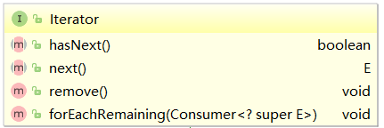

> 注意 ：
>
> 1. 在进行集合元素取出时，如果集合中已经没有元素了，还继续使用迭代器的next方法，将会发生java.util.NoSuchElementException没有集合元素的错误。
> 2. 如果调用remove之前没有调用next是不合法的，会抛出IllegalStateException

## Iterable

Jdk1.5之后添加的新接口, Collection的父接口。实现这个接口允许对象成为 For each 语句的目标。就可以通过For each语法遍历你的底层序列。

```java
public interface Collection<E> extends Iterable<E>
    
Package java.lang; 

import java.util.Iterator;
public  interface Iterable<T> { 
	Iterator<T> iterator();  
}
```

## for each

增强for循环(也称for each循环)是**JDK1.5**以后出来的一个高级for循环，专门用来遍历数组和集合的。

它的**内部原理其实是个Iterator迭代器**，所以在遍历的过程中，**不能对集合中的元素进行增删操作**，增删需要原来的Iterator方式。

格式：

~~~java
for(元素的数据类型  变量 : lterable接口实现类or数组){ 
  	//写操作代码
}
~~~

**例子**

~~~java
public class NBForDemo1 {
    public static void main(String[] args) {
		int[] arr = {3,5,6,87};
       	//使用增强for遍历数组
		for(int a : arr){//a代表数组中的每个元素
			System.out.println(a);
		}
	}
}

//反编译
while(var2.hasNext()) {
		     String s = (String)var2.next();
		     System.out.println(s);
}
~~~

## **增删**

- **for循环删除**

  一般调用删除和添加方法都是具体集合的方法，例如：

  List list = new ArrayList(); list.add(…); list.remove(…);

  但是，如果在循环的过程中调用集合的remove()方法，就会导致循环出错，**因为被删除元素的后面所有元素都向前排进一位**了，就导致了错误。可以使用如下方法：

  ```java
  for(int i = 0; i < list.size();i++){
    if(true){
  	list.remove(list.get(i));
  	--i;//remove的同时下标跟着减，因为List重构，下一位提前了
  	}
  }
  ```

- **Iterator删除**

  ```java
  public static void main(String[] args) {
      ArrayList<String> strings = new ArrayList<>();
      strings.add("1");
      strings.add("2");
      strings.add("3");
      strings.add("4");
  
      Iterator<String> iterator = strings.iterator();
      while (iterator.hasNext()) {
          String next = iterator.next();
          if (next.equals("1")) {
              iterator.remove();
          }
      }
  }
  ```

所以，**如果想在循环语句中删除集合中的某个元素，就要用迭代器iterator的remove()方法**，因为它的remove()方法不仅会删除元素，还会维护一个标志，用来记录目前是不是可删除状态，例如，你不能连续两次调用它的remove()方法，调用之前至少有一次next()方法的调用。

forEach就是为了让用iterator循环访问的形式简单，写起来更方便。当然功能不太全，所以但如有删除操作，还是要用它原来的形式。

## 效率

> 采用ArrayList对随机访问比较快，而for循环中的get()方法，采用的即是随机访问的方法，因此在ArrayList里，for循环较快
>
> 采用LinkedList则是顺序访问比较快，iterator中的next()方法，采用的即是顺序访问的方法，因此在LinkedList里，使用iterator较快
>
> 从数据结构角度分析,for循环适合访问顺序结构,可以根据下标快速获取指定元素.而Iterator 适合访问链式结构,因为迭代器是通过next()和Pre()来定位的.可以访问没有顺序的集合.

而使用 `Iterator` 的好处在于可以使用相同方式去遍历集合中元素，而不用考虑集合类的内部实现（只要它实现了 java.lang.Iterable 接口），如果使用 Iterator 来遍历集合中元素，一旦不再使用 List 转而使用 Set 来组织数据，那遍历元素的代码不用做任何修改，如果使用 for 来遍历，那所有遍历此集合的算法都得做相应调整,因为List有序,Set无序,结构不同,他们的访问算法也不一样。

##  强一致性

普通集合hashMap的iterate的过程中不能修改集合，因此需要**同步迭代过程和并发修改**。其他util包的集合也是。

```java
//问题在于 java.util.HashMap$ValueIterator.next();   modCount != expectedModCount;  throw new ConcurrentModificationException();
//ConcurrentHashMap的iterator不会报错

public class ConcurrentIteratorModify {
	public static void main(String[] args) {
		//初始化集合
		HashMap<String, String> map = new HashMap<String, String>();
		//Map<String, String> map = new ConcurrentHashMap<String, String>(); 
		for (int i = 0; i < 500; i++) {
			map.put("t" + i, "test" + i);
		}

		Iterator it = map.values().iterator();
		Thread modifyThread = new Thread(new ModifyMap(map));

		//另一线程修改集合
		modifyThread.start();

		//主线程迭代集合
		for (; it.hasNext(); ) {
			System.out.println(it.next());
		}
	}

	static class ModifyMap implements Runnable {
		Map<String, String> map;

		public ModifyMap(Map<String, String> map) {
			this.map = map;
		}

		public void run() {
			//以下任何一个方法都很大可能报错
			System.out.println(map.remove("t5"));
			System.out.println(map.put("t1000", "test5"));
		}
	}
}
```


# Enumeration

NOTE: 

1. The functionality of this interface is duplicated by the Iterator interface. In addition, Iterator adds an optional remove operation, and has shorter method names. 
2. New implementations should consider using Iterator in preference to Enumeration.


# 面试题

> 注意：
>
> ​		具体代码看项目

### HashMap 排序题

已知一个 HashMap<Integer， User>集合， User 有 name（String）和 age（int）属性。请写一个方法实现对HashMap 的排序功能，该方法接收 HashMap<Integer， User>为形参，返回类型为 HashMap<Integer， User>，要求对 HashMap 中的 User 的 age 倒序进行排序。排序时 key=value 键值对不得拆散。

注意：要做出这道题必须对集合的体系结构非常的熟悉。 HashMap 本身就是不可排序的，但是该道题偏偏让给HashMap 排序，那我们就得想在 API 中有没有这样的 Map 结构是有序的， LinkedHashMap，对的，就是他，他是Map 结构，也是链表结构，有序的，更可喜的是他是 HashMap 的子类，我们返回 LinkedHashMap<Integer,User>即可，还符合面向接口（父类编程的思想）。

但凡是对集合的操作，我们应该保持一个原则就是能用 JDK 中的 API 就有 JDK 中的 API，比如排序算法我们不应该去用冒泡或者选择，而是首先想到用 Collections 集合工具类。  

### 集合的安全性问题

请问 ArrayList、 HashSet、 HashMap 是线程安全的吗？如果不是我想要线程安全的集合怎么办？


在集合中 Vector 和 HashTable 倒是线程安全的。你打开源码会发现其实就是把各自核心方法添加上了synchronized 关键字。

Collections 工具类提供了相关的 API，可以让上面那 3 个不安全的集合变为安全的。

```java
 Collections.synchronizedCollection(c);
 Collections.synchronizedList(list);
 Collections.synchronizedMap(m);
 Collections.synchronizedSet(s);
```

上面几个函数都有对应的返回值类型，传入什么类型返回什么类型。打开源码其实实现原理非常简单，就是将集合的核心方法添加上了 synchronized 关键字。  

### ArrayList 和 LinkedList 之间应该怎么选择？

https://www.zhihu.com/question/563680801

**永远不要使用它。大多数时候使用 Array***

内存和速度都是arraylist完爆，即便是deque也是选择ArrayDeque

链表最常见的应用场景其是通过一个节点找它的兄弟节点，但这跟linkedlist的逻辑正好是反着来的，导致需要用链表的时候都不太适合用linkedlist

如果做的操作仅限于往List的头部插入数据，应该是LinkedList快，毕竟要查找的Node在头部

链表结构是直接操作内部node，例如锁的线程排队，linkedlist这种封装起来做list毫无用处

### hashtable 的key需要是定值，三个方法不要变化。

> Atomic classes are not general purpose replacements for `java.lang.Integer` and related classes. They do *not* define methods such as `equals`, `hashCode` and `compareTo`. (Because atomic variables are expected to be mutated, they are poor choices for hash table keys.)