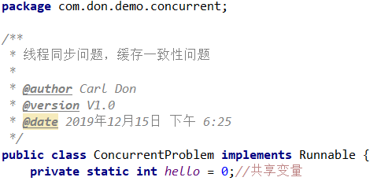

内部类中的this是的类是内部类，外部类.this才是外部类的对象


子类可以重写父类的具体方法为抽象方法。

接口可以重写Object类的方法为抽象方法。


# JDK8

反射创建对象加快了。


****

# 错误

## Java找不到或无法加载主类

1. java执行class文件是根据CLASSPATH指定的地方来找，不是我们理解当前目录。如果希望它查询当前目录，需要在CLASSPATH中加入`.;`,代表当前目录。

   ```bash
   java -classpath . HelloWorld
   .;%JAVA_HOME%\lib\tools.jar;%JAVA_HOME%\lib\dt.jar
   ```

   

2. java执行class文件对package的路径是强依赖的。它在执行的时候会严格以当前用户路径为基础，按照package指定的包路径转化为文件路径去搜索class文件。

   **java文件**

   

   **目录**

   

   **编译运行**

   

   

   

来自 <https://www.cnblogs.com/wangxiaoha/p/6293340.html> 


## JAVA 编译出现编码GBK的不可映射字符

### 原因

由于JDK是国际版的，在编译的时候，如果我们没有用-encoding参数指定我们的JAVA源程序的编码格式，则javac.exe首先获得我们**操作系统默认采用的编码格式**。

在编译java程序时，若我们不指定源程序文件的编码格式：

> 1. JDK首先获得操作系统的file.encoding参数(它保存的就是操作系统默认的编码格式，如WIN2k，它的值为GBK)
>
> 2. 然后JDK就把我们的java源程序从file.encoding编码格式转化为JAVA内部默认的UNICODE格式放入内存中。
> 3. 然后，javac把转换后的unicode格式的文件进行编译成.class类文件，此时.class文件是UNICODE编码的，它暂放在内存中

对我们来说，我们最终获得的.class文件是内容以**UNICODE**编码格式保存的类文件，它内部包含我们源程序中的中文字符串，只不过此时它己经由file.encoding格式转化为UNICODE格式了。当我们不加设置就编译时，相当于使用了参数：`javac -encoding gbk XX.java`，当然就会出现不兼容的情况。

### 解决方法

1. 使用-encoding 指定字符集

```bash
javac -encoding utf-8 xx.java
```


2. 把源文件编码修改成ASCII，使用`notepad++`就可以


