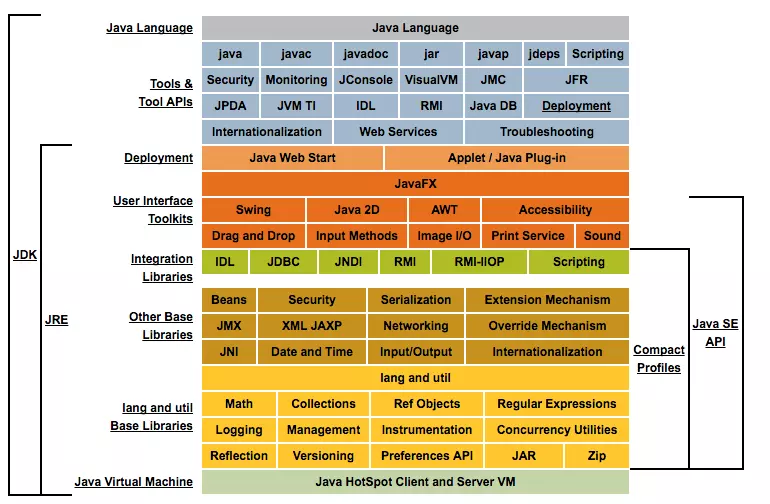
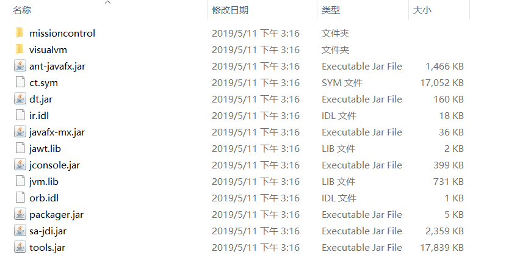
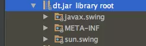
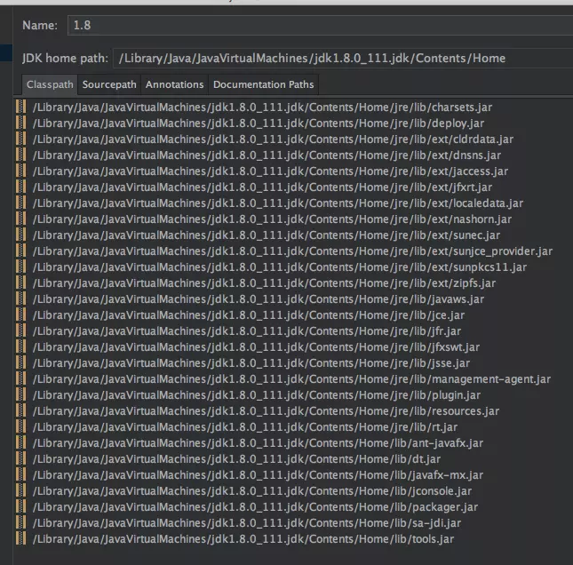
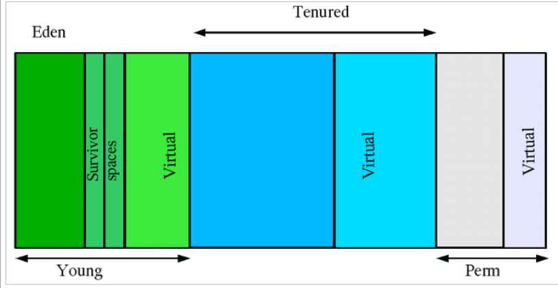
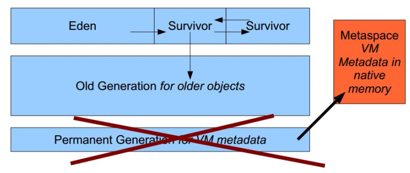
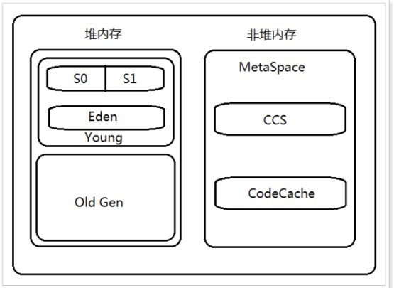
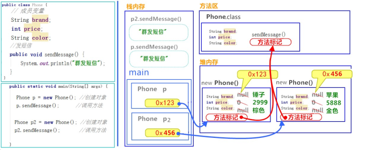
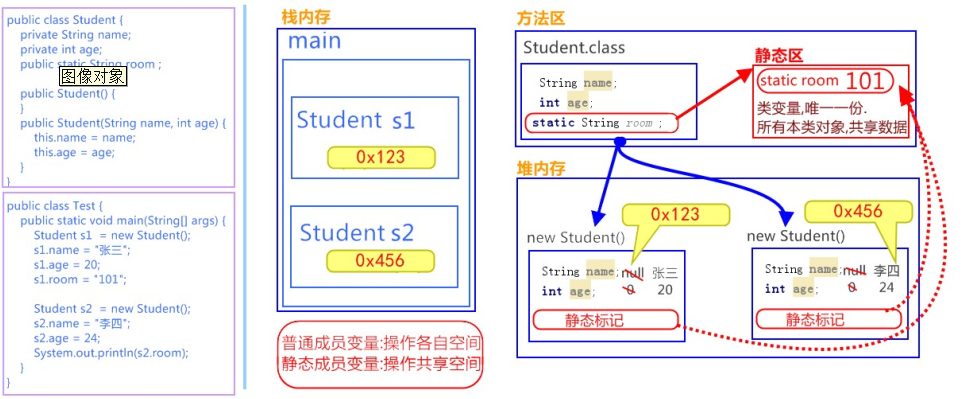
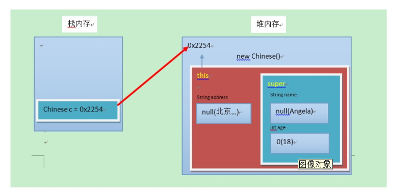

# JDK


### JDK，JRE，JVM

**JRE **

Java Runtime Environment，是Java程序的运行时环境，包含 JVM 和运行时所需要的 核心类库 。它为Java提供了运行环境，其中重要的一环就是通过JVM将字节码解释成可执行的机器码。

JRE由 JVM，Java运行时类库，动态链接库等组成

**JDK **

Java Development Kit，是Java程序开发工具包，包含 JRE 和开发人员使用的工具。  JDK的编译器Javac[.exe]，会将Java代码编译成字节码(.class文件)。编译出的字节码在任何平台上都一样的内容，所以我们说Java语言是门跨平台语言。

**JVM**

Java Virtual Machine，Java虚拟机，可以看做是一台*抽象化的计算机*，它有一套完整的体系架构，包括处理器、堆栈 、寄存器等。

在运行时环境，JVM会将Java字节码解释成机器码。机器码和平台相关的（不同硬件环境、不同操作系统，产生的机器码不同），所以JVM在不同平台有不同的实现。

目前JDK默认使用的实现是Hotspot VM。



### OpenJDK

我们平时所说的JDK，是指SUN公司（现在是Oracle公司的）的官方JDK，由于历史遗留问题，其本身采用的并不是开源协议。所以后来有了OpenJDK----JDK的开源版本。

OpenJDK和JDK有以下几点不同：

1. 授权协议不同。 前者采用 GPL 协议（允许商用），后者是 JRL 协议（供个人研究使用）
2. OpenJDK源代码不完整。其中最主要的部份就是JMX中的可选元件SNMP部份的代码。因此这些不能开放的源代码 将它作成plug，以供OpenJDK编译时使用，你也可以选择不要使用plug。
3. 部分源代码（不是SUN产权的源码）用开源替换
4. 只包含最精简的JDK，不包含其他软件包，比如Rhino Java DB JAXP

我们有时候会在Java源码中看到标记为`native`的方法，说明该方法是使用C代码实现的。可以通过OpenJDK来看一下是如何实现的。

 比如Object类的getClass方法：

```java
public final native Class<?> getClass();
```

相应的，在`OpenJDK/jdk/src/share/native`目录下，找到Object.c文件，可以看到具体的实现代码：

```kotlin
JNIEXPORT jclass JNICALL
Java_java_lang_Object_getClass(JNIEnv *env, jobject this)
{
    if (this == NULL) {
        JNU_ThrowNullPointerException(env, NULL);
        return 0;
    } else {
        return (*env)->GetObjectClass(env, this);
    }
}
```

### 下载选项

**DevepmentTools**

这是JDK的核心，包括编译Java程序必需的命令工具。实际上，这个选项里己经包含了运行Java程序的JRE，这个 JRE会安装在JDK安装目录的子目录里，这也是无须安装公共JRE的原因。

**公共JRE**

公共JRE是一个独立 JRE 系统，会单独装在系统的其他路径下。公共 JRE 向IE浏览器和系统中注册Java运行时环境。通过这种方式，系统中任何应用程序都可以使用公共JRE。由于在在网页上执行Applet的机会越来越少，而且完全可以选择使用JDK目录下的 JRE 运行Java程序，因此没有太大必要安装公共JRE。

**source Code**

安装java所有核心类库的源代码。

### **JDK目录结构**

#### 介绍


> bin目录：Java工具的可执行文件，包括: java、编译器javac、反编译javap、密钥管理工具keytool、Java文档工具javadoc等。
>
> COPYRIGHT文件：版权信息。
>
> db目录：Java实现的数据库。
>
> include目录：.h头文件，C语言开发时用到的头文件。比如`jni.h`是开发jni程序时必须引用的头文件。
>
> lib目录： Java类库，我们经常看到的`dt.jar`和`tools.jar`就在这个目录下。
>
> src.zip文件：Java类库源码，包括了rt.jar库中的关键部分；除了Java类库，还包含了启动器（launcher）的源码（C语言实现）。
>
> jre目录：Java运行环境。

#### lib目录



`dt.jar`包含了Swing包，是运行环境的类库。目前的发展趋势是Java越来越少的用作GUI开发，所以这个类库基本不会用到了。




`tools.jar`是工具类库，bin目录下的可执行程序，好多都会用到这个类库。比如javac[.exe]，javadoc[.exe]等。


平时我们经常会将这两个文件配置到CLASSPATH的当前目录（`.`）后面。

```bash
CLASSPATH=.:$JAVA_HOME/lib/dt.jar:$JAVA_HOME/lib/tools.jar
.;%JAVA_HOME%\lib\tools.jar;%JAVA_HOME%\lib\dt.jar (windows)
```

原因就是有些可执行程序在运行时是依赖这些类库的，比如javac[.exe]就依赖tools.jar类库的javac包。

#### jre目录


> bin目录：包含了java运行所需要的可执行文件，比如java[.exe]
> lib目录：包含了运行时依赖的java类库和动态链接库（.so或.dll或.dylib）。

##### jre/lib目录

- **amd64**

amd64目录下包含了程序运行所需的动态链接库，在amd64/server目录下，可以找到JVM库：`libjvm.so`。


- **rt.jar**

`rt.jar`文件是java运行时类库，是我们用到最多的基础类库，包括java.lang，java.io，java.net，java.util等。


`java.lang`：Java语言包，这个包下的文件不需要显式import。包括：Object类，数据类型相关的类（String，Long，Byte），Class类，线程相关类Thread，异常类Throwable，等。

`java.io`：I/O操作相关的类。包括：文件类File，FileReader，FileWriter，输入输出流InputStream/OutputStream，等。

`java.net`：网络相关类。包括：http连接类HttpURLConnection，socket类，等。

`java.util`：工具类。包括：数据结构相关的类ArrayList、Hashmap，日期类Date，随机数类Random，等。

我们平时用IDE在配置好JDK HOME后，IDE会默认将JDK的类库全部引用进来，供开发使用。以mac下的Itellij IDEA为例，看一下都有那些类：



# 字节码文件

[轻松看懂Java字节码]: https://juejin.im/post/5aca2c366fb9a028c97a5609


## 介绍

计算机只认识0和1。这意味着任何语言编写的程序最终都需要经过编译器编译成机器码才能被计算机执行。所以，我们所编写的程序在不同的平台上运行前都要经过重新编译才能被执行。 而Java刚诞生的时候曾经提过一个非常著名的宣传口号: **"一次编写，到处运行"**。

> Write Once, Run Anywhere.

为了实现该目的，Sun公司以及其他虚拟机提供商发布了**许多**可以运行在不同平台上的**JVM**，而这些虚拟机都拥有一个共同的功能，那就是可以载入和执行同一种与平台无关的字节码(ByteCode)。 于是，我们的源代码不再必须根据不同平台翻译成0和1，而是间接翻译成字节码，储存字节码的文件再交由运行于不同平台上的JVM虚拟机去读取执行，从而实现一次编写，到处运行的目的。 如今，JVM也不再只支持Java，由此衍生出了许多基于JVM的编程语言，如Groovy, Scala, Koltin等等。


源代码中的各种变量，关键字和运算符号的语义最终都会编译成多条字节码命令。而**字节码命令所能提供的语义描述能力是要明显强于Java本身的**，所以有其他一些同样基于JVM的语言能提供许多Java所不支持的语言特性。


## 例子

```java
package com.don.demo.jvm.ClassFileDecompiled;

public class Main {
    
	private String string = "string";

	private int m;

	private String neverUser = "goodbye";

	public int inc() {
		return m + 1;
	}

	public int inc2() {
		return inc();
	}

	//返回
	public int inc3() {
		return inc2() + 1 + m;
	}

	public int inc4() {
		System.out.println(string);
		System.out.println("13");
		System.out.println(Main.class.getName().getClass().getName());
		System.out.println(m);
		return inc3() + 1 + m;
	}

	//无限循环，
	public void inc5() {
		inc5();
	}

	//调用，没有返回
	public void inc46() {
		inc5();
	}
    
}
```

通过以下命令, 可以在当前所在路径下生成一个`Main.class`文件。

```powershell
javac Main.java
```

## 16进制版本

以文本的形式打开生成的class文件，内容如下:

```
cafe babe 0000 0034 0013 0a00 0400 0f09
0003 0010 0700 1107 0012 0100 016d 0100
0149 0100 063c 696e 6974 3e01 0003 2829
5601 0004 436f 6465 0100 0f4c 696e 654e
756d 6265 7254 6162 6c65 0100 0369 6e63
0100 0328 2949 0100 0a53 6f75 7263 6546
696c 6501 0009 4d61 696e 2e6a 6176 610c
0007 0008 0c00 0500 0601 0010 636f 6d2f
7268 7974 686d 372f 4d61 696e 0100 106a
6176 612f 6c61 6e67 2f4f 626a 6563 7400
2100 0300 0400 0000 0100 0200 0500 0600
0000 0200 0100 0700 0800 0100 0900 0000
1d00 0100 0100 0000 052a b700 01b1 0000
0001 000a 0000 0006 0001 0000 0003 0001
000b 000c 0001 0009 0000 001f 0002 0001
0000 0007 2ab4 0002 0460 ac00 0000 0100
0a00 0000 0600 0100 0000 0800 0100 0d00
.....
```

对于文件中的16进制代码，除了开头的`cafe babe`，剩下的内容大致可以翻译成: **啥玩意啊这是......**

文件开头的4个字节称之为 **魔数**，唯有以"cafe babe"开头的class文件方可被虚拟机所接受，这4个字节就是字节码文件的身份识别。 

目光右移，0000是编译器jdk版本的次版本号0，0034转化为十进制是52,是主版本号，java的版本号从45开始，除1.0和1.1都是使用45.x外,以后每升一个大版本，版本号加一。也就是说，编译生成该class文件的jdk版本为1.8.0。 通过`java -version`命令稍加验证, 可得结果。

```java
// 45 + n = 52, 1 + n =版本号
Java(TM) SE Runtime Environment (build 1.8.0_131-b11)
Java HotSpot(TM) 64-Bit Server VM (build 25.131-b11, mixed mode)
```

结果验证成立。

继续往下是常量池。

## 反编译

### javap

使用到java内置的一个反编译工具`javap`可以反编译字节码文件。 

字节码文件由四部分组成。

通过`javap -help`可了解javap的基本用法

```bash
用法: javap <options> <classes>
其中, 可能的选项包括:
  -help  --help  -?        输出此用法消息
  -version                 版本信息
  -v  -verbose             输出附加信息
  -l                       输出行号和本地变量表
  -public                  仅显示公共类和成员
  -protected               显示受保护的/公共类和成员
  -package                 显示程序包/受保护的/公共类
                           和成员 (默认)
  -p  -private             显示所有类和成员
  -c                       对代码进行反汇编
  -s                       输出内部类型签名
  -sysinfo                 显示正在处理的类的
                           系统信息 (路径, 大小, 日期, MD5 散列)
  -constants               显示最终常量
  -classpath <path>        指定查找用户类文件的位置
  -cp <path>               指定查找用户类文件的位置
  -bootclasspath <path>    覆盖引导类文件的位置
```

输入命令`javap -verbose -p Main.class`查看输出内容: **分为四部分**

```java
Classfile /D:/project/demo_code/composite-project/jvm/src/main/java/com/don/demo/jvm/ClassFileDecompiled/Main.class
  Last modified 2019-12-19; size 998 bytes
  MD5 checksum ae9c8d30ba07bf4996ea8d30709713ec
  Compiled from "Main.java"
public class com.don.demo.jvm.ClassFileDecompiled.Main
  minor version: 0
  major version: 52
  flags: ACC_PUBLIC, ACC_SUPER
Constant pool:
   #1 = Methodref          #16.#34        // java/lang/Object."<init>":()V
   #2 = String             #17            // word
   #3 = Fieldref           #10.#35        // com/don/demo/jvm/ClassFileDecompiled/Main.word:Ljava/lang/String;
   #4 = Fieldref           #10.#36        // com/don/demo/jvm/ClassFileDecompiled/Main.m:I
   #5 = Methodref          #10.#37        // com/don/demo/jvm/ClassFileDecompiled/Main.inc:()I
   #6 = Methodref          #10.#38        // com/don/demo/jvm/ClassFileDecompiled/Main.inc2:()I
   #7 = Fieldref           #39.#40        // java/lang/System.out:Ljava/io/PrintStream;
   #8 = Methodref          #41.#42        // java/io/PrintStream.println:(Ljava/lang/String;)V
   #9 = String             #43            // 13
  #10 = Class              #44            // com/don/demo/jvm/ClassFileDecompiled/Main
  #11 = Methodref          #45.#46        // java/lang/Class.getName:()Ljava/lang/String;
  #12 = Methodref          #16.#47        // java/lang/Object.getClass:()Ljava/lang/Class;
  #13 = Methodref          #41.#48        // java/io/PrintStream.println:(I)V
  #14 = Methodref          #10.#49        // com/don/demo/jvm/ClassFileDecompiled/Main.inc3:()I
  #15 = Methodref          #10.#50        // com/don/demo/jvm/ClassFileDecompiled/Main.inc5:()V
  #16 = Class              #51            // java/lang/Object
  #17 = Utf8               word
  #18 = Utf8               Ljava/lang/String;
  #19 = Utf8               m
  #20 = Utf8               I
  #21 = Utf8               <init>
  #22 = Utf8               ()V
  #23 = Utf8               Code
  #24 = Utf8               LineNumberTable
  #25 = Utf8               inc
  #26 = Utf8               ()I
  #27 = Utf8               inc2
  #28 = Utf8               inc3
  #29 = Utf8               inc4
  #30 = Utf8               inc5
  #31 = Utf8               inc46
  #32 = Utf8               SourceFile
  #33 = Utf8               Main.java
  #34 = NameAndType        #21:#22        // "<init>":()V
  #35 = NameAndType        #17:#18        // word:Ljava/lang/String;
  #36 = NameAndType        #19:#20        // m:I
  #37 = NameAndType        #25:#26        // inc:()I
  #38 = NameAndType        #27:#26        // inc2:()I
  #39 = Class              #52            // java/lang/System
  #40 = NameAndType        #53:#54        // out:Ljava/io/PrintStream;
  #41 = Class              #55            // java/io/PrintStream
  #42 = NameAndType        #56:#57        // println:(Ljava/lang/String;)V
  #43 = Utf8               13
  #44 = Utf8               com/don/demo/jvm/ClassFileDecompiled/Main
  #45 = Class              #58            // java/lang/Class
  #46 = NameAndType        #59:#60        // getName:()Ljava/lang/String;
  #47 = NameAndType        #61:#62        // getClass:()Ljava/lang/Class;
  #48 = NameAndType        #56:#63        // println:(I)V
  #49 = NameAndType        #28:#26        // inc3:()I
  #50 = NameAndType        #30:#22        // inc5:()V
  #51 = Utf8               java/lang/Object
  #52 = Utf8               java/lang/System
  #53 = Utf8               out
  #54 = Utf8               Ljava/io/PrintStream;
  #55 = Utf8               java/io/PrintStream
  #56 = Utf8               println
  #57 = Utf8               (Ljava/lang/String;)V
  #58 = Utf8               java/lang/Class
  #59 = Utf8               getName
  #60 = Utf8               ()Ljava/lang/String;
  #61 = Utf8               getClass
  #62 = Utf8               ()Ljava/lang/Class;
  #63 = Utf8               (I)V
{
  private java.lang.String word;
    descriptor: Ljava/lang/String;
    flags: ACC_PRIVATE

  private int m;
    descriptor: I
    flags: ACC_PRIVATE

  public com.don.demo.jvm.ClassFileDecompiled.Main();
    descriptor: ()V
    flags: ACC_PUBLIC
    Code:
      stack=2, locals=1, args_size=1
         0: aload_0
         1: invokespecial #1                  // Method java/lang/Object."<init>":()V
         4: aload_0
         5: ldc           #2                  // String word
         7: putfield      #3                  // Field word:Ljava/lang/String;
        10: return
      LineNumberTable:
        line 10: 0
        line 11: 4

  public int inc();
    descriptor: ()I
    flags: ACC_PUBLIC
    Code:
      stack=2, locals=1, args_size=1
         0: aload_0
         1: getfield      #4                  // Field m:I
         4: iconst_1
         5: iadd
         6: ireturn
      LineNumberTable:
        line 16: 0

  public int inc2();
    descriptor: ()I
    flags: ACC_PUBLIC
    Code:
      stack=1, locals=1, args_size=1
         0: aload_0
         1: invokevirtual #5                  // Method inc:()I
         4: ireturn
      LineNumberTable:
        line 20: 0

  public int inc3();
    descriptor: ()I
    flags: ACC_PUBLIC
    Code:
      stack=2, locals=1, args_size=1
         0: aload_0
         1: invokevirtual #6                  // Method inc2:()I
         4: iconst_1
         5: iadd
         6: aload_0
         7: getfield      #4                  // Field m:I
        10: iadd
        11: ireturn
      LineNumberTable:
        line 25: 0

  public int inc4();
    descriptor: ()I
    flags: ACC_PUBLIC
    Code:
      stack=2, locals=1, args_size=1
         0: getstatic     #7                  // Field java/lang/System.out:Ljava/io/PrintStream;
         3: aload_0
         4: getfield      #3                  // Field word:Ljava/lang/String;
         7: invokevirtual #8                  // Method java/io/PrintStream.println:(Ljava/lang/String;)V
        10: getstatic     #7                  // Field java/lang/System.out:Ljava/io/PrintStream;
        13: ldc           #9                  // String 13
        15: invokevirtual #8                  // Method java/io/PrintStream.println:(Ljava/lang/String;)V
        18: getstatic     #7                  // Field java/lang/System.out:Ljava/io/PrintStream;
        21: ldc           #10                 // class com/don/demo/jvm/ClassFileDecompiled/Main
        23: invokevirtual #11                 // Method java/lang/Class.getName:()Ljava/lang/String;
        26: invokevirtual #12                 // Method java/lang/Object.getClass:()Ljava/lang/Class;
        29: invokevirtual #11                 // Method java/lang/Class.getName:()Ljava/lang/String;
        32: invokevirtual #8                  // Method java/io/PrintStream.println:(Ljava/lang/String;)V
        35: getstatic     #7                  // Field java/lang/System.out:Ljava/io/PrintStream;
        38: aload_0
        39: getfield      #4                  // Field m:I
        42: invokevirtual #13                 // Method java/io/PrintStream.println:(I)V
        45: aload_0
        46: invokevirtual #14                 // Method inc3:()I
        49: iconst_1
        50: iadd
        51: aload_0
        52: getfield      #4                  // Field m:I
        55: iadd
        56: ireturn
      LineNumberTable:
        line 29: 0
        line 30: 10
        line 31: 18
        line 32: 35
        line 33: 45

  public void inc5();
    descriptor: ()V
    flags: ACC_PUBLIC
    Code:
      stack=1, locals=1, args_size=1
         0: aload_0
         1: invokevirtual #15                 // Method inc5:()V
         4: return
      LineNumberTable:
        line 38: 0
        line 39: 4

  public void inc46();
    descriptor: ()V
    flags: ACC_PUBLIC
    Code:
      stack=1, locals=1, args_size=1
         0: aload_0
         1: invokevirtual #15                 // Method inc5:()V
         4: return
      LineNumberTable:
        line 43: 0
        line 44: 4
}
SourceFile: "Main.java"
```

### 1. class文件信息

开头的7行信息包括：Class文件当前所在位置，最后修改时间，文件大小，MD5值，编译自哪个文件，类的全限定名，jdk次版本号，主版本号。 然后紧接着的是该类的访问标志：**ACC_PUBLIC**, **ACC_SUPER**，访问标志的含义如下:

| 标志名称           | 标志值 |                             含义                             |
| :----------------- | :----: | :----------------------------------------------------------: |
| **ACC_PUBLIC**     | 0x0001 |                       是否为Public类型                       |
| **ACC_FINAL**      | 0x0010 |              是否被声明为final，只有类可以设置               |
| **ACC_SUPER**      | 0x0020 |        是否允许使用invokespecial字节码指令的新语义．         |
| **ACC_INTERFACE**  | 0x0200 |                       标志这是一个接口                       |
| **ACC_ABSTRACT**   | 0x0400 | 是否为abstract类型，对于接口或者抽象类来说， 次标志值为真，其他类型为假 |
| **ACC_SYNTHETIC**  | 0x1000 |                 标志这个类并非由用户代码产生                 |
| **ACC_ANNOTATION** | 0x2000 |                       标志这是一个注解                       |
| **ACC_ENUM **      | 0x4000 |                       标志这是一个枚举                       |

### 2. 常量池

#### 介绍

`Constant pool`意为常量池。 常量池可以理解成Class文件中的资源仓库。主要存放的是两大类常量：

1. **字面量(Literal)**：类似于java中的常量概念，如文本字符串，final常量等。
2. **符号引用(Symbolic References)**：则属于编译原理方面的概念，包括以下三种
   - 类和接口的全限定名(Fully Qualified Name)
   - 字段的名称和描述符号(Descriptor)
   - 方法的名称和描述符

不同于C/C++**，JVM是在加载Class文件的时候才进行的动态链接，也就是说这些字段和方法符号引用只有在运行期转换后才能获得真正的内存入口地址。**当虚拟机运行时，需要从常量池获得对应的符号引用，再在类创建或运行时解析并翻译到具体的内存地址中。

#### method引用

方法引用是有`()`

如果在源文件中只有定义一个方法，却没有在类中使用，那么这个方法是不在符号引用中的，因为不需要引用。该例子中没有`inc6()`的引用。

```shell
#1 = Methodref          #4.#18         // java/lang/Object."<init>":()V
#4 = Class              #21            // java/lang/Object
#7 = Utf8               <init>
#8 = Utf8               ()V
#18 = NameAndType        #7:#8          // "<init>":()V
#21 = Utf8               java/lang/Object
```

第一个常量是一个方法定义，指向了第4和第18个常量。以此类推查看第4和第18个常量。最后可以拼接成第一个常量右侧的注释内容:

```java
java/lang/Object."<init>":()V
```

这段可以理解为该类的实例构造器的声明，由于Main类没有重写构造方法，所以调用的是父类的构造方法。此处也说明了Main类的直接父类是Object。 该方法默认返回值是V, 也就是void，无返回值。

#### Fieldref	

field引用是没有`()`

```shell
#2 = Fieldref           #3.#19         // com/rhythm7/Main.m:I
#3 = Class              #20            // com/rhythm7/Main
#5 = Utf8               m
#6 = Utf8               I
#19 = NameAndType        #5:#6          // m:I
#20 = Utf8               com/rhythm7/Main
```

此处声明了一个字段m，类型为I, I即是int类型。

- **field类型**

| 标识字符 |                    含义                    |
| :------: | :----------------------------------------: |
|    B     |                基本类型byte                |
|    C     |                基本类型char                |
|    D     |               基本类型double               |
|    F     |               基本类型float                |
|    I     |                基本类型int                 |
|    J     |                基本类型long                |
|    S     |               基本类型short                |
|    Z     |              基本类型boolean               |
|    V     |                特殊类型void                |
|    L     | 对象类型，以分号结尾，如Ljava/lang/Object; |

对于数组类型，每一位使用一个前置的"["字符来描述，如定义一个java.lang.String[][]类型的二维数组，将被记录为"[[Ljava/lang/String;"

### 3. 方法表集合

在常量池之后的是对类内部的方法描述，在字节码中以表的集合形式表现，暂且不管字节码文件的16进制文件内容如何，我们直接看反编译后的内容。

#### field

```java
 private java.lang.String string;
    descriptor: Ljava/lang/String;
    flags: ACC_PRIVATE

  private int m;
    descriptor: I
    flags: ACC_PRIVATE

  private java.lang.String neverUser;
    descriptor: Ljava/lang/String;
    flags: ACC_PRIVATE
```

第2个私有变量m，类型为int，返回值为int

#### method

##### 简单例子

```java
//原来的Main.java
public class Main {
    
    private int m;
    
    public int inc() {
        return m + 1;
    }
}

//字节码部分
public com.rhythm7.Main();
   descriptor: ()V
   flags: ACC_PUBLIC
   Code:
     stack=1, locals=1, args_size=1
        0: aload_0
        1: invokespecial #1                  // Method java/lang/Object."<init>":()V
        4: return
     LineNumberTable:
       line 3: 0
     LocalVariableTable:
       Start  Length  Slot  Name   Signature
           0       5     0  this   Lcom/rhythm7/Main;

```

这里是构造方法：Main()，返回值为void, 公开方法。 code内的主要属性为:

- **stack** 最大操作数栈，JVM运行时会根据这个值来分配栈帧(Frame)中的操作栈深度,此处为1。**应该是静态的**，没运行时的栈的深度，现在最大看到2。

- **locals:** 局部变量所需的存储空间，单位为Slot, Slot是虚拟机为局部变量分配内存时所使用的最小单位，为4个字节大小。方法参数(包括实例方法中的隐藏参数this)，显示异常处理器的参数(try catch中的catch块所定义的异常)，方法体中定义的局部变量都需要使用局部变量表来存放。值得一提的是，locals的大小并不一定等于所有局部变量所占的Slot之和，因为局部变量中的Slot是可以重用的。

- **args_size:** 方法参数的个数，这里是1，**因为每个实例方法都会有一个隐藏参数this**

- **attribute_info** 方法体内容，0,1,4为字节码（.class文件）"行号"，该段代码的意思是将第一个引用类型本地变量（this）推送至栈顶，然后执行该类型的实例方法，也就是常量池存放的第一个变量，也就是注释里的"java/lang/Object."":()V", 然后执行返回语句，结束方法。

- **LineNumberTable** 该属性的作用是描述源码行号与字节码行号(字节码偏移量)之间的对应关系。可以使用 -g:none 或-g:lines选项来取消或要求生成这项信息，如果选择不生成LineNumberTable，当程序运行异常时将无法获取到发生异常的源码行号，也无法按照源码的行数来调试程序。

- **LocalVariableTable** 该属性的作用是描述**帧栈**中局部变量与源码中定义的变量之间的关系。可以使用 -g:none 或 -g:vars来取消或生成这项信息，如果没有生成这项信息，那么当别人引用这个方法时，将无法获取到参数名称，取而代之的是arg0, arg1这样的占位符。 start 表示该局部变量在哪一行开始可见，length表示可见行数，Slot代表所在帧栈位置，Name是变量名称，然后是类型签名。

- **栈顶变化**：调用了`getfield`，`invoke`之类的方法后可能是把方法需要的、在栈顶的变量、常量pop出，传入方法，然后return回栈顶。新一行的代码都需要`load`进去栈顶。

  ```java
  public int inc() {
      m = m + 1;
      m = m + 1;
      return m;
  }
  
  public int inc();
      descriptor: ()I
      flags: ACC_PUBLIC
      Code:
        stack=3, locals=1, args_size=1
           // m = m + 1;
           0: aload_0
           1: aload_0
           2: getfield      #2                  // Field m:I
           5: iconst_1
           6: iadd
           7: putfield      #2                  // Field m:I
          
          // m = m + 1;
          10: aload_0
          11: aload_0
          12: getfield      #2                  // Field m:I
          15: iconst_1
          16: iadd
          17: putfield      #2                  // Field m:I
             
          // return m;
          20: aload_0
          21: getfield      #2                  // Field m:I
          24: ireturn
              
        LineNumberTable:
          line 18: 0
          line 19: 10
          line 20: 20
  ```

  

##### 赋值构造器

`aload0`是this，`aload1`...是参数（如果有）

```java
public com.don.demo.jvm.ClassFileDecompiled.Main();
    descriptor: ()V
    flags: ACC_PUBLIC
    Code:
      stack=2, locals=1, args_size=1
          // 父类构造器
         0: aload_0
         1: invokespecial #1                  // Method java/lang/Object."<init>":()V
             
          // String field 赋值
         4: aload_0
         5: ldc           #2                  // String string
         7: putfield      #3                  // Field string:Ljava/lang/String;
             
          //  String field 赋值  
        10: aload_0
        11: ldc           #4                  // String goodbye
        13: putfield      #5                  // Field neverUser:Ljava/lang/String;
            
          // return
        16: return
      LineNumberTable:
        line 10: 0
        line 11: 4
        line 15: 10
```

调用父类Obejct构造器后还需要给引用类型的field赋值。

构造方法会将普通常量和普通代码块整合到其构造器字节块中，每个构造方法都会拼凑一份。

初始化有三步（粗略）：根据对象大小分配内存空间；调用初始化`init()`初始化各种field；把内存地址的值赋值出去

- **ldc**：   int、float或String型常量从常量池推送至栈顶
- **putfield**：给对象的字段赋值

##### 复杂method

```java
 public int inc4();
    descriptor: ()I
    flags: ACC_PUBLIC
    Code:
      stack=2, locals=1, args_size=1
          
         //System.out.println(string);
         0: getstatic     #9                  // Field java/lang/System.out:Ljava/io/PrintStream;
         3: aload_0
         4: getfield      #3                  // Field string:Ljava/lang/String;
         7: invokevirtual #10                 // Method java/io/PrintStream.println:(Ljava/lang/String;)V
        
        //System.out.println("13");
        10: getstatic     #9                  // Field java/lang/System.out:Ljava/io/PrintStream;
        13: ldc           #11                 // String 13
        15: invokevirtual #10                 // Method java/io/PrintStream.println:(Ljava/lang/String;)V
            
        //System.out.println(Main.class.getName().getClass().getName());    
        18: getstatic     #9                  // Field java/lang/System.out:Ljava/io/PrintStream;
        21: ldc           #12                 // class com/don/demo/jvm/ClassFileDecompiled/Main
        23: invokevirtual #13                 // Method java/lang/Class.getName:()Ljava/lang/String;
        26: invokevirtual #14                 // Method java/lang/Object.getClass:()Ljava/lang/Class;
        29: invokevirtual #13                 // Method java/lang/Class.getName:()Ljava/lang/String;
        32: invokevirtual #10                 // Method java/io/PrintStream.println:(Ljava/lang/String;)V
        35: getstatic     #9                  // Field java/lang/System.out:Ljava/io/PrintStream;
            
        //System.out.println(m);    
        38: aload_0
        39: getfield      #6                  // Field m:I
        42: invokevirtual #15                 // Method java/io/PrintStream.println:(I)V
            
        //return inc3() + 1 + m;    
        45: aload_0
        46: invokevirtual #16                 // Method inc3:()I
        49: iconst_1
        50: iadd
        51: aload_0
        52: getfield      #6                  // Field m:I
        55: iadd
        56: ireturn
      LineNumberTable:
        line 31: 0
        line 32: 10
        line 33: 18
        line 34: 35
        line 35: 45
```


##### 一般method

```java
  public int inc2();
    descriptor: ()I
    flags: ACC_PUBLIC
    Code:
      stack=1, locals=1, args_size=1
         0: aload_0
         1: invokevirtual #7                  // Method inc:()I
         4: ireturn
      LineNumberTable:
        line 22: 0

  public int inc3();
    descriptor: ()I
    flags: ACC_PUBLIC
    Code:
      stack=2, locals=1, args_size=1
         0: aload_0
         1: invokevirtual #8                  // Method inc2:()I
         4: iconst_1
         5: iadd
         6: aload_0
         7: getfield      #6                  // Field m:I
        10: iadd
        11: ireturn
      LineNumberTable:
        line 27: 0
        
  public void inc5();
    descriptor: ()V
    flags: ACC_PUBLIC
    Code:
      stack=1, locals=1, args_size=1
         0: aload_0
         1: invokevirtual #17                 // Method inc5:()V
         4: return
      LineNumberTable:
        line 40: 0
        line 41: 4

  public void inc46();
    descriptor: ()V
    flags: ACC_PUBLIC
    Code:
      stack=1, locals=1, args_size=1
         0: aload_0
         1: invokevirtual #17                 // Method inc5:()V
         4: return
      LineNumberTable:
        line 45: 0
        line 46: 4
```

都没有区别。`return`和`ireturn`的区别，前者仅仅是结束方法，后者`return int`。`inc3()`调用了很多两次加法。

### 4. SourceFile

源码文件名称

------

### 实战

#### 分析try-catch-finally

通过以上一个最简单的例子，可以大致了解源码被编译成字节码后是什么样子的。 下面利用所学的知识点来分析一些Java问题:

```java
public class TestCode {
    public int foo() {
        int x;
        try {
            x = 1;
            return x;
        } catch (Exception e) {
            x = 2;
            return x;
        } finally {
            x = 3;
        }
    }
}
```

试问当不发生异常和发生异常的情况下，foo()的返回值分别是多少。 使出老手段

```shell
javac TestCode.java
javap -verbose TestCode.class
```

查看字节码的foo方法内容:

```java
public int foo();
    descriptor: ()I
    flags: ACC_PUBLIC
    Code:
      stack=1, locals=5, args_size=1
         // x = 1; 
         0: iconst_1
         1: istore_1 
        
         // 1. 没有异常
         	// 先把要return的int型结果值store到新的局部变量
         2: iload_1 
         3: istore_2      
          	// 执行finally
         4: iconst_3 
         5: istore_1              
          	// return保存的那个局部变量
         6: iload_2 
         7: ireturn 
             
          // 2. 有异常
         8: astore_2 // ->局部3=Exception
            // 执行catch
         9: iconst_2 
        10: istore_1 
            // 同样，先把要return的int型结果值store到新的局部变量
        11: iload_1 
        12: istore_3
        	// finally
        13: iconst_3
        14: istore_1
            // return
        15: iload_3 
        16: ireturn 
        
          // 3. 其他程序反编译的文件没有这种代码，why？
        17: astore        4 //将栈顶引用型数值存入第五个局部变量=any  ？不明白
        19: iconst_3 
        20: istore_1
        21: aload         4 //将局部第五个局部变量(引用型)推送至栈顶
        23: athrow //将栈顶的异常抛出
      Exception table:
         from    to  target type
             0     4     8   Class java/lang/Exception //0到4行对应的异常，对应#8中储存的异常
             0     4    17   any //Exeption之外的其他异常
             8    13    17   any
            17    19    17   any
```

在字节码的4,5，以及13,14中执行的是同一个操作，就是将int型的3入操作数栈顶，并存入第二个局部变量。这正是我们源码在finally语句块中内容。也就是说，JVM在处理异常时，会在每个可能的分支都将finally语句重复执行一遍。 通过一步步分析字节码，可以得出最后的运行结果是：

- 不发生异常时: return 1
- 发生异常时: return 2
- 发生非Exception及其子类的异常，抛出异常，不返回值

以上例子来自于《深入理解Java虚拟机 JVM高级特性与最佳实践》 关于虚拟机字节码指令表，也可以在《深入理解Java虚拟机 JVM高级特性与最佳实践-附录B》中获取。

#### kotlin 函数扩展的实现

kotlin提供了扩展函数的语言特性，借助这个特性，我们可以给任意对象添加自定义方法。 以下示例为Object添加"sayHello"方法

```
//SayHello.kt
package com.rhythm7

fun Any.sayHello() {
    println("Hello")
}
```

编译后，使用javap查看生成SayHelloKt.class文件的字节码。

```
Classfile /E:/JavaCode/TestProj/out/production/TestProj/com/rhythm7/SayHelloKt.class
Last modified 2018-4-8; size 958 bytes
 MD5 checksum 780a04b75a91be7605cac4655b499f19
 Compiled from "SayHello.kt"
public final class com.rhythm7.SayHelloKt
 minor version: 0
 major version: 52
 flags: ACC_PUBLIC, ACC_FINAL, ACC_SUPER
Constant pool:
    //省略常量池部分字节码
{
 public static final void sayHello(java.lang.Object);
   descriptor: (Ljava/lang/Object;)V
   flags: ACC_PUBLIC, ACC_STATIC, ACC_FINAL
   Code:
     stack=2, locals=2, args_size=1
        0: aload_0
        1: ldc           #9                  // String $receiver
        3: invokestatic  #15                 // Method kotlin/jvm/internal/Intrinsics.checkParameterIsNotNull:(Ljava/lang/Object;Ljava/lang/String;)V
        6: ldc           #17                 // String Hello
        8: astore_1
        9: getstatic     #23                 // Field java/lang/System.out:Ljava/io/PrintStream;
       12: aload_1
       13: invokevirtual #28                 // Method java/io/PrintStream.println:(Ljava/lang/Object;)V
       16: return
     LocalVariableTable:
       Start  Length  Slot  Name   Signature
           0      17     0 $receiver   Ljava/lang/Object;
     LineNumberTable:
       line 4: 6
       line 5: 16
   RuntimeInvisibleParameterAnnotations:
     0:
       0: #7()
}
SourceFile: "SayHello.kt"
复制代码
```

观察头部发现,koltin为文件SayHello生成了一个类，类名"com.rhythm7.SayHelloKt". 由于我们一开始编写SayHello.kt时并不希望SayHello是一个可实例化的对象类，所以，SayHelloKt是无法被实例化的，SayHelloKt并没有任何一个构造器。 再观察唯一的一个方法：发现`Any.sayHello()`的具体实现是静态不可变方法的形式:

```
public static final void sayHello(java.lang.Object);
复制代码
```

所以当我们在其他地方使用`Any.sayHello()`时，事实上等同于调用java的`SayHelloKt.sayHello(Object)`方法。 顺便一提的是，当扩展的方法为Any时，意味着Any是non-null的，这时，编译器会在方法体的开头检查参数的非空，即调用 `kotlin.jvm.internal.Intrinsics.checkParameterIsNotNull(Object value, String paramName)` 方法来检查传入的Any类型对象是否为空。如果我们扩展的函数为`Any?.sayHello()`，那么在编译后的文件中则不会有这段字节码的出现。


## 字节码指令

### 介绍

Java虚拟机采用基于栈的架构，其指令由操作码和操作数组成。

- 操作码：一个字节长度(0~255)，意味着指令集的操作码个数不能操作256条。
- 操作数：一条指令可以有零或者多个操作数，且操作数可以是1个或者多个字节。编译后的代码没有采用操作数长度对齐方式，比如16位无符号整数需使用两个字节储存(假设为byte1和byte2)，那么真实值是 `(byte1 << 8) | byte2`。

放弃操作数对齐操作数对齐方案：

- 优势：可以省略很多填充和间隔符号，从而减少数据量，具有更高的传输效率；Java起初就是为了面向网络、智能家具而设计的，故更加注重传输效率。
- 劣势：运行时从字节码里构建出具体数据结构，需要花费部分CPU时间，从而导致解释执行字节码会损失部分性能。

大多数指令包含了其操作所对应的数据类型信息，比如iload，表示从局部变量表中加载int型的数据到操作数栈；而fload表示加载float型数据到操作数栈。由于操作码长度只有1Byte，因此Java虚拟机的指令集对于特定操作只提供有限的类型相关指令，并非为每一种数据类型都有相应的操作指令。必要时，有些指令可用于将不支持的类型转换为可被支持的类型。

对于byte,short,char,boolean类型，往往没有单独的操作码，通过编译器在编译期或者运行期将其扩展。对于byte,short采用带符号扩展，chart,boolean采用零位扩展。相应的数组也是采用类似的扩展方式转换为int类型的字节码来处理。 下面分门别类来介绍Java虚拟机指令，都以int类型的数据操作为例。

栈是指操作数栈

### 2.1 栈操作相关

#### load和store

- load 命令：用于将局部变量表的指定位置的相应类型变量加载到栈顶；
- store命令：用于将栈顶的相应类型数据保入局部变量表的指定位置；

| 变量进栈 | 含义                  | 变量保存 | 含义                          |
| :------- | :-------------------- | :------- | :---------------------------- |
| iload    | 第1个int型变量进栈    | istore   | 栈顶int数值存入第1局部变量    |
| iload_0  | 第1个int型变量进栈    | istore_0 | 栈顶int数值存入第1局部变量    |
| iload_1  | 第2个int型变量进栈    | istore_1 | 栈顶int数值存入第2局部变量    |
| iload_2  | 第3个int型变量进栈    | istore_2 | 栈顶int数值存入第3局部变量    |
| iload_3  | 第4个int型变量进栈    | istore_3 | 栈顶int数值存入第4局部变量    |
|          |                       |          |                               |
| lload    | 第1个long型变量进栈   | lstore   | 栈顶long数值存入第1局部变量   |
| fload    | 第1个float型变量进栈  | fstore   | 栈顶float数值存入第1局部变量  |
| dload    | 第1个double型变量进栈 | dstore   | 栈顶double数值存入第1局部变量 |
| aload    | 第1个ref型变量进栈    | astore   | 栈顶ref对象存入第1局部变量    |

#### const、push和ldc

- const、push：将相应类型的常量放入栈顶
- ldc:则是从常量池中将常量

| 常量进栈    | 含义              |
| :---------- | :---------------- |
| aconst_null | null进栈          |
| iconst_m1   | int型常量-1进栈   |
| iconst_0    | int型常量0进栈    |
| iconst_1    | int型常量1进栈    |
| iconst_2    | int型常量2进栈    |
| iconst_3    | int型常量3进栈    |
| iconst_4    | int型常量4进栈    |
| iconst_5    | int型常量5进栈    |
|             |                   |
| lconst_0    | long型常量0进栈   |
| fconst_0    | float型常量0进栈  |
| dconst_0    | double型常量0进栈 |
|             |                   |
| bipush      | byte型常量进栈    |
| sipush      | short型常量进栈   |

| 常量池操作 | 含义                                                 |
| :--------- | :--------------------------------------------------- |
| ldc        | int、float、String型常量、class从常量池推送至栈顶    |
| ldc_w      | int、float或String型常量从常量池推送至栈顶（宽索引） |
| ldc2_w     | long或double型常量从常量池推送至栈顶（宽索引）       |

#### pop和dup

- pop用于栈顶数值出栈操作；
- dup用于赋值栈顶的指定个数的数值，并将其压入栈顶指定次数；

| 栈顶操作 | 含义                                    |
| :------- | :-------------------------------------- |
| pop      | 栈顶数值出栈(不能是long/double)         |
| pop2     | 栈顶数值出栈(long/double型1个，其他2个) |
|          |                                         |
| dup      | 复制栈顶数值，并压入栈顶                |
| dup_x1   | 复制栈顶数值，并压入栈顶2次             |
| dup_x2   | 复制栈顶数值，并压入栈顶3次             |
| dup2     | 复制栈顶2个数值，并压入栈顶             |
| dup2_x1  | 复制栈顶2个数值，并压入栈顶2次          |
| dup2_x2  | 复制栈顶2个数值，并压入栈顶3次          |
|          |                                         |
| swap     | 栈顶的两个数值互换，且不能是long/double |

**注意：dup2**对于long、double类型的数据就是一个，对于其他类型的数据，才是真正的两个，这个的2代表的是2个slot的数据。

### 2.2 对象相关

#### 字段调用

| 字段调用  | 含义                             |
| :-------- | :------------------------------- |
| getstatic | 获取类的静态字段，将其值压入栈顶 |
| putstatic | 给类的静态字段赋值               |
| getfield  | 获取对象的字段，将其值压入栈顶   |
| putfield  | 给对象的字段赋值                 |

#### 方法调用

| 方法调用        | 作用               | 解释                                   |
| :-------------- | :----------------- | :------------------------------------- |
| invokevirtual   | 调用实例方法       | 虚方法分派                             |
| invokestatic    | 调用类方法         | static方法                             |
| invokeinterface | 调用接口方法       | 运行时搜索合适方法调用                 |
| invokespecial   | 调用特殊实例方法   | 包括实例初始化方法、父类方法           |
| invokedynamic   | 由用户引导方法决定 | 运行时动态解析出调用点限定符所引用方法 |

#### 方法返回·

| 方法返回 | 含义               |
| :------- | :----------------- |
| ireturn  | 当前方法返回int    |
| lreturn  | 当前方法返回long   |
| freturn  | 当前方法返回float  |
| dreturn  | 当前方法返回double |
| areturn  | 当前方法返回ref    |

#### 对象和数组

- 创建类实例： new
- 创建数组：newarray、anewarray、multianewarray
- 数组元素 加载到 操作数栈：xaload (x可为b,c,s,i,l,f,d,a)
- 操作数栈的值 存储到数组元素： xastore (x可为b,c,s,i,l,f,d,a)
- 数组长度：arraylength
- 类实例类型：instanceof、checkcast

### 2.3 运算指令

运算指令是用于对操作数栈上的两个数值进行某种运算，并把结果重新存入到操作栈顶。Java虚拟机只支持整型和浮点型两类数据的运算指令，所有指令如下：

| 运算 | int  | long | float | double |
| :--- | :--- | :--- | :---- | :----- |
| 加法 | iadd | ladd | fadd  | dadd   |
| 减法 | isub | lsub | fsub  | dsub   |
| 乘法 | imul | lmul | fmul  | dmul   |
| 除法 | idiv | ldiv | fdiv  | ddiv   |
| 求余 | irem | lrem | frem  | drem   |
| 取反 | ineg | lneg | fneg  | dneg   |

**其他运算：**

- 位移：ishl,ishr,iushr,lshl,lshr,lushr

- 按位或： ior,lor

- 按位与： iand, land

- 按位异或： ixor, lxor

- 自增：iinc

  ```java
  iinc          1, 1  // 局部变量自增1
  ```

- 比较：dcmpg,dcmpl,fcmpg,fcmpl,lcmp

### 2.4 类型转换

类型转换用于将两种不同类型的数值进行转换。

(1) 对于宽化类型转换(小范围向大范围转换)，无需显式的转换指令，并且是安全的操作。各种范围从小到大依次排序： int, long, float, double。

(2)对于窄化类型转换，必须显式地调用类型转换指令，并且该过程很可能导致精度丢失。转换规则中需要特别注意的是当浮点值为NaN, 则转换结果为int或long的0。虽然窄化运算可能会发生上/下限溢出和精度丢失等情况，但虚拟机规范明确规定窄化转换U不可能导致虚拟机抛出异常。

类型转换指令：`i2b, i2c,f2i`等等。

### 2.5 流程控制

控制指令是指有条件或无条件地修改PC寄存器的值，从而达到控制流程的目标

- 条件分支：ifeq、iflt、ifnull、ifnonnull等
- 复合分支：tableswitch、lookupswitch
- 无条件分支：goto、goto_w、jsr、jsr_w、ret

- **`if_icmpge 43`** : *if_icmpge* 指令的意思是如果一个值大于或等于另外一个值，在本例中就是如果 *i$* 大于或等于 *len$* ，那么执行会从被标记为 43 的语句执行。如果没有满足条件，则循环继续执行下一个迭代。

  

### 2.6 同步与异常

**异常：**

Java程序显式抛出异常： athrow指令。在Java虚拟机中，处理异常(catch语句)不是由字节码指令来实现，而是采用异常表来完成。

**同步：**

方法级的同步和方法内部分代码的同步，都是依靠管程(Monitor)来实现的。

Java语言使用synchronized语句块，那么Java虚拟机的指令集中通过monitorenter和monitorexit两条指令来完成synchronized的功能。为了保证monitorenter和monitorexit指令一定能成对的调用（不管方法正常结束还是异常结束），编译器会自动生成一个异常处理器，该异常处理器的主要目的是用于执行monitorexit指令。

### 2.7 小结

在基于堆栈的的虚拟机中，指令的主战场便是操作数栈，除了load是从局部变量表加载数据到操作数栈以及store储存数据到局部变量表，其余指令基本都是用于操作数栈的。

# 一 ： java内存模型

原文链接：https://blog.csdn.net/Rainnnbow/article/details/50541079

参考：
《深入理解Java虚拟机-JVM高级特性与最佳实践》第二版 周志明著


## java数据类型

1.  基础数据类型:boolean、byte、short、char、int、long、float、double

2.  引用数据类型:类、接口、数组

   

## **前言**

Java程序的运行是通过JVM来实现的。通过类加载器将class字节码文件加载进JVM，然后根据预定的规则执行。Java虚拟机在执行Java程序的过程中会把它所管理的内存划分为若干个不同的数据区域。这些内存区域被统一叫做**运行时数据区**。Java运行时数据区大致可以划分为5个部分。如下图所示。在这里要特别指出，我们现在说的JVM内存划分是**概念模型**。具体到每个JVM的具体实现可能会有所不同。具体JVM的实现我只会提到**HotSpot虚拟机**的实现细节。


## **1. 程序计数器**

程序计数器是一块较小的内存空间，它可以看成是当前线程所执行的字节码的**行号指示器**。如果是native方法，则计数器值为空。

- **存储**

程序计数器记录线程当前**要执行的下一条字节码指令的地址**。

由于Java是多线程的，所以为了多线程之间的切换与恢复，**每一个线程都需要单独的程序计数器**，各线程之间互不影响。这类内存区域被称为“线程私有”的内存区域。
由于程序计数器只存储一个字节码指令地址，故此内存区域没有规定任何OutOfMemoryError情况。

## 2. 虚拟机栈

Java虚拟机栈也是线程私有的，它的生命周期与线程相同。

- **存储**

虚拟机栈描述的是**Java方法执行的内存模型**：**每个方法在执行时都会创建一个栈帧（Stack Frame）**用于存储**局部变量表（this，形参，局部变量）、操作数栈、动态链接、方法出口**等信息。

*一个栈帧就代表了一个方法执行的内存模型*，虚拟机栈中存储的就是当前执行的所有方法的栈帧（包括正在执行的和等待执行的）。每一个方法从调用直至执行完成的过程，就对应着一个栈帧在虚拟机中入栈到出栈的过程。

我们平时所说的“局部变量存储在栈中”就是指**方法中的局部变量存储在代表该方法的栈帧的局部变量表**中。

而方法的执行正是从局部变量表中获取数据，放至操作数栈上，然后在操作数栈上进行运算，再将运算结果放入局部变量表中，最后将操作数栈顶的数据返回给方法的调用者的过程。（关于栈帧和基于栈的方法执行，我会在之后写两篇文章专门介绍。敬请期待☺）

虚拟机栈可能出现两种异常：由线程请求的**栈深度过大**超出虚拟机所允许的深度而引起的StackOverflowError异常；以及由虚拟机栈无法提供足够的内存而引起的OutOfMemoryError异常。

## 3. 本地方法栈

本地方法栈与虚拟机栈类似，他们的区别在于：本地方法栈用于执行本地方法（Native方法）；虚拟机栈用于执行普通的Java方法。在HotSpot虚拟机中，就将本地方法栈与虚拟机栈做在了一起。
本地方法栈可能抛出的异常同虚拟机栈一样。


## 4. 堆

Java堆是Java虚拟机所管理的内存中最大的一块。Java堆是被所有线程共享的一块内存区域，在虚拟机启动时创建。

### 4.1 存储

此内存区域的唯一目的就是**存放对象、数组实例**：所有的对象实例以及数组都要在堆上分配（The heap is the runtime data area from which memory for all class instances and arrays is allocated）。但**Class对象比较特殊，它虽然是对象，但是存放在方法区里**。在下面的方法区一节会介绍。

Java堆是垃圾收集器（GC）管理的主要区域。现在的收集器基本都采用分代收集算法：新生代和老年代。而对于不同的”代“采用的垃圾回收算法也不一样。一般新生代使用复制算法；老年代使用标记整理算法。对于不同的”代“，一般使用不同的垃圾收集器，新生代垃圾收集器和老年代垃圾收集器配合工作。(关于垃圾收集算法、垃圾收集器以及堆中具体的分代等知识，我之后会专门写几篇博客来介绍。再次敬请期待☺)

Java堆可以是物理上不连续的内存空间，只要**逻辑上连续即可**。Java堆可能抛出OutOfMemoryError异常。

### 4.2 两种定义

1. JVM规范对抽象的“Java heap”的定义是“存储Java对象的地方”，也就是说Java对象在哪里，哪里就是Java heap。
2. 堆指GC heap。

### 4.3 java7

- **Young 年轻区（代）**

Young区被划分为三部分，Eden区和两个大小严格相同的Survivor区，其中，Survivor区间中，某一时刻只有其中一个是被使用的，另外一个留做垃圾收集时复制对象用，始终保证一个survivor是空的。在Eden区间变满的时候， GC就会将存活的对象移到空闲的Survivor区间中，根据JVM的策略，在经过几次垃圾收集后，任然存活于Survivor的对象将被移动到Tenured区间。

- **Tenured 年老区**

Tenured区主要保存生命周期长的对象，一般是一些老的对象，当一些对象在Young复制转移一定的次数以后，对象就会被转移到Tenured区，一般如果系统中用了application级别的缓存，缓存中的对象往往会被转移到这一区间。

- **Perm 永久区**

Perm代主要保存class,method,filed对象，这部份的空间一般不会溢出，除非一次性加载了很多的类，不过在涉及到热部署的应用服务器的时候，有时候会遇到java.lang.OutOfMemoryError : PermGen space 的错误，造成这个错误的很大原因就有可能是每次都重新部署，但是重新部署后，类的class没有被卸载掉，这样就造成了大量的class对象保存在了perm中，这种情况下，一般重新启动应用服务器可以解决问题。

- **Virtual**

最大内存和初始内存的差值，就是Virtual区 



### 4.4 java8

java8的内存模型是由2部分组成，年轻代 + 年老代。
年轻代：Eden + 2*Survivor
年老代：OldGen
在jdk1.8中变化最大的Perm区，用Metaspace（元数据空间）进行了替换。
需要特别说明的是：Metaspace所占用的内存空间不是在虚拟机内部，而是在本地内存空间中，这也是与1.7的永久代最大的区别所在。 





## 5. 方法区

**方法区（method area）**只是**JVM规范**中定义的一个概念，具体放在哪里，不同的实现可以放在不同的地方。而**永久代**是**Hotspot**虚拟机特有的概念，是方法区的一种实现，别的JVM都没有这个东西。

方法区与Java堆一样，是各个线程共享的内存区域。

### 5.1. 存储

它用于存储已**被虚拟机加载的类信息（元数据）、常量信息、静态变量、即时编译器编译后的代码等数据**。所有的字节码被加载之后，字节码中的信息：类信息、类中的方法信息、常量信息、类中的静态变量（引用）等都会存放在方法区。正如其名字一样：方法区中存放的就是类和方法的所有信息。此外，如果一个类被加载了，就会在方法区生成一个代表该类的Class对象（唯一一种不在堆上生成的对象实例）该对象将作为程序访问方法区中该类的信息的外部接口。有了该对象的存在，才有了反射的实现。

------


### 5.2. 本地内存与堆外内存

`Native memory：本地内存，也称为C-Heap，是供JVM自身进程使用的。`

**判断**：永久代是Hotspot虚拟机特有的概念，是方法区的一种实现，属于本地内存（堆外内存）的一部分。别的JVM都没有这个东西。

1. 而永久代是Hotspot虚拟机特有的概念，是方法区的一种实现------------这个正确

2. 属于本地内存（堆外内存）的一部分-------------------------这个需要定义简写为“堆”的概念在上下文中的定义。

> 如果“堆”是说Java heap，那么这个也对也错。因为JVM规范对抽象的“Java heap”的定义是“存储Java对象的地方”，也就是说Java对象在哪里，哪里就是Java heap。HotSpot的PermGen里是会存储部分Java对象的，例如说一些java.lang.String实例。这些String实例占的部分就得算是Java heap。
>
> 如果“堆”是说GC heap，那么这个错误。PermGen是HotSpot的GC heap的一部分。
>
> 一般说“native memory”都是跟GC heap相对的，所以一般取上述后者的定义，于是这个“属于堆外内存”的说法就不对。

3. 别的JVM都没有这个东西。

> 嗯…虽然不一定有PermGen，但确实存在许多其它JVM是把元数据放在GC heap里的。


------


### 5.3. java7之前

> 在Java 6中，方法区中包含的数据，除了JIT编译生成的代码存放在**native memory的CodeCache区域**（不直接由GC收集），其他都存放在永久代。
>
> 永久代和堆相互隔离，体现在永久代的大小在启动JVM时可以设置一个固定值，不可变。
>
> 在Java7之前，HotSpot虚拟机中将GC分代收集扩展到了方法区，使用永久代来实现了方法区（permgen的任务不止于此）。这个区域的内存回收目标主要是针对常量池的回收和对类型的卸载。但是在之后的HotSpot虚拟机实现中，逐渐开始将方法区从永久代移除。
>
> - **Perm Gen**
>
> Perm Gen全称是Permanent Generation space，是指内存的永久保存区域，因而称之为永久代。这个内存区域用于存放Class和Meta的信息，Class在被 Load的时候被放入这个区域。因为Perm里存储的东西**有一部分**永远不会被JVM垃圾回收的，所以如果你的应用程序LOAD很多CLASS的话，就很可能出现PermGen space错误。默认大小为物理内存的1/64。
>
> - **CodeCache**
>
> CodeCache代码缓冲区的大小在client模式下默认最大是32m，在server模式下默认是48m，这个值也是可以设置的，它所对应的JVM参数为ReservedCodeCacheSize 和 InitialCodeCacheSize。
>
> CodeCache缓存区是可能被充满的，当CodeCache满时，后台会收到CodeCache is full的警告信息，如下所示：“CompilerThread0” java.lang.OutOfMemoryError: requested 2854248 bytes for Chunk::new. Out of swap space?
>
>
> GC heap区又分为：
>
> - Eden Space（伊甸园）
> - Survivor Space(幸存者区)
> - Old Gen（老年代）
> - Perm Gen（永久代）
>
> 非GC heap区又分：
>
> - Code Cache(代码缓存区)
> - Jvm Stack(java虚拟机栈)
> - Local Method Statck(本地方法栈)*

------

### 5.4. java7

> 在Java 7中，存储在永久代的部分数据就已经转移到Java Heap或者Native memory。但永久代仍存在于JDK 1.7中，并没有完全移除。
>
> 1. 符号引用**Symbol的存储**从PermGen移动到了native memory；
> 2. 字符串常量池(interned strings)转移到了Java heap，
> 3. 并且把静态变量从instanceKlass末尾（位于PermGen内）移动到了java.lang.Class对象的末尾（位于普通Java heap内）；
>
> **判断**：Java7中已经将运行时常量池从永久代移除，在Java 堆（Heap）中开辟了一块区域存放运行时常量池。---------不对！
>
> “常量池”如果说的是SymbolTable / StringTable，这俩table自身原本就一直在native memory里，是它们所引用的东西在哪里更有意思。上面说了，java7是把SymbolTable引用的Symbol移动到了native memory，而StringTable引用的java.lang.String实例则从PermGen移动到了普通Java heap。
>
> StringTable的长度可以通过参数-XX:StringTableSize指定。
>
> Symbols在JDK7和JDK8里都在native memory里，但不在Metaspace里。
> Symbols在native memory里通过引用计数管理，同时有个全局的SymbolTable管理着所有Symbol。请参考 [jdk7u/jdk7u/hotspot: 2cd3690f644c src/share/vm/oops/symbol.hpp](http://link.zhihu.com/?target=http%3A//hg.openjdk.java.net/jdk7u/jdk7u/hotspot/file/2cd3690f644c/src/share/vm/oops/symbol.hpp)

**在JDK1.7中, 已经把原本放在永久代的字符串常量池移出, 放在堆中. 为什么这样做呢?**

> 因为使用永久代来实现方法区不是个好主意, 很容易遇到内存溢出的问题. 我们通常使用PermSize和MaxPermSize设置永久代的大小, 这个大小就决定了永久代的上限, 但是我们不是总是知道应该设置为多大的, 如果使用默认值容易遇到OOM错误。
>
> 类的元数据, 字符串池, 类的静态变量将会从永久代移除, 放入Java heap或者native memory。其中建议JVM的实现中将类的元数据放入 native memory, 将字符串池和类的静态变量放入java堆中. 这样可以加载多少类的元数据就不再由MaxPermSize控制, 而由系统的实际可用空间来控制.
>
> 为什么这么做呢? 减少OOM只是表因, 更深层的原因还是要合并HotSpot和JRockit的代码, JRockit从来没有一个叫永久代的东西, 但是运行良好, 也不需要开发运维人员设置这么一个永久代的大小。当然不用担心运行性能问题了, 在覆盖到的测试中, 程序启动和运行速度降低不超过1%, 但是这一点性能损失换来了更大的安全保障。

------

### 5.5. java8

> 而在Java8中，已经彻底没有了永久代，将方法区直接放在一个与堆不相连的本地内存区域，这个区域被叫做元空间Metaspace，基本上机器有多少内存就可以多大。关于元空间的更多信息，请参考：[Java永久代去哪儿了](http://www.infoq.com/cn/articles/Java-PERMGEN-Removed?utm_campaign=infoq_content&)
>
> ‑XX:MaxPermSize 参数失去了意义，取而代之的是-XX:MaxMetaspaceSize。

**为什么移除永久代**
1、字符串存在永久代中，容易出现性能问题和内存溢出。
2、永久代大小不容易确定，PermSize指定太小容易造成永久代OOM
3、永久代会为 GC 带来不必要的复杂度，并且回收效率偏低。
4、Oracle 可能会将HotSpot 与 JRockit 合二为一。


## 6. 运行时常量池

运行时常量池是方法区的一部分，关于运行时常量池的介绍，请参考我的另一篇博文：[String放入运行时常量池的时机与String.intern()方法解惑](http://blog.csdn.net/rainnnbow/article/details/50461303)。我还是花了些时间在理解运行时常量池上的。

## 7. 直接内存（还没熟悉）

原文链接：https://blog.csdn.net/leaf_0303/article/details/78961936

博文：<https://www.cnblogs.com/xing901022/p/5243657.html>

**概述**

直接内存并不是虚拟机运行时数据区的一部分，也不是Java 虚拟机规范中农定义的内存区域。在JDK1.4 中新加入了NIO(New Input/Output)类，引入了一种基于通道(Channel)与缓冲区（Buffer）的I/O 方式，它可以使用native 函数库直接分配堆外内存，然后通脱一个存储在Java堆中的DirectByteBuffer 对象作为这块内存的引用进行操作。这样能在一些场景中显著提高性能，因为避免了在Java堆和Native堆中来回复制数据。

- 本机直接内存的分配不会受到Java 堆大小的限制，受到本机总内存大小限制

- 配置虚拟机参数时，不要忽略直接内存 防止出现OutOfMemoryError异常


**直接内存（堆外内存）与堆内存比较**

1. 直接内存申请空间耗费更高的性能，当频繁申请到一定量时尤为明显
2. 直接内存IO读写的性能要优于普通的堆内存，在多次读写操作的情况下差异明显

> 如上文介绍的：Java8以及之后的版本中方法区已经从原来的JVM运行时数据区中被开辟到了一个称作元空间的直接内存区域。

## 8. 内存图

### 1. 对象内存图



对象调用方法时，根据对象中方法标记（地址值），去类中寻找方法信息。这样哪怕是多个对象，方法信息
只保存一份，节约内存空间 

### 2. 静态原理内存图解 

​	**`static` 修饰的内容**：

- 是随着类的加载而加载的，且只加载一次。

- 存储于一块固定的内存区域（静态区），所以，可以直接被类名调用。

- 它优先于对象存在，所以，可以被所有对象共享。 



### 3. super和this内存图 

- **super和this的含义**

super ：代表父类的存储空间标识(可以理解为父亲的引用)。
this ：代表当前对象的引用(谁调用就代表谁)。 

- **父类空间优先于子类对象产生**

在每次创建子类对象时，先初始化父类空间，再创建其子类对象本身。目的在于子类对象中包含了其对应的父类空
间，便可以包含其父类的成员，如果父类成员非private修饰，则子类可以随意使用父类成员。代码体现在子类的构造方法调用时，一定先调用父类的构造方法。理解图解如下： 




# 二 ：String问题


## 1. String str = new String("abc")内存分配问题

```java
String str = new String("abc");
```

1. 首先将这行代码分成String str、=、"abc"和new String()四部分来看待。String str只是定义了一个名为str的String类型的变量，因此它并没有创建对象；**=是对变量str进行初始化，将某个对象的引用（或者叫句柄）赋值给它**，显然也没有创建对象；现在只剩下new String(“abc”)了。先看一下new String()构造函数：

```java
 public String(String original) {
    // other code
 }
```

2. 我们是使用new调用了String类的上面那个构造器方法创建了一个对象，并将它的引用赋值给了str变量。但是发现该构造函数的参数是一个String类型的，我们要知道String本身就是一个对象。而该对象正是“abc”。

所以得出结论，**这行代码一共创建了两个对象**（运行时常量池不存在“abc”的情况下），一个是str引用所指向在堆内存中的对象，一个是常量池中的“abc”；

该行代码内存分配问题，可以参考这篇文章：https://blog.csdn.net/qq_28082757/article/details/89886132

## 2. String类为什么是不可变的

- final的出现就是为了为了不想改变，而不想改变的理由有两点：**设计(安全)或者效率**。

final 修饰的类是不被能继承的，所以 final 修饰的类是不能被篡改的。内部数组私有。
了解了这一点，我们再看看问题：

1. 从设计安全)上讲， 
   1)、确保它们不会在子类中改变语义。String类是final类，这意味着不允许任何人定义String的子类。

2)、String 一旦被创建是不能被修改的，内部通过多种机制确定，不只是final。可以暴力破解不可变。

2. 从效率上讲： 
   1)、设计成final，JVM才不用对相关方法在虚函数表中查询，而直接定位到String类的相关方法上，提高了执行效率。 
   2)、Java设计者认为共享带来的效率更高。

————————————————

版权声明：本文为CSDN博主「李学凯」的原创文章，遵循 CC 4.0 BY-SA 版权协议，转载请附上原文出处链接及本声明。
原文链接：https://blog.csdn.net/qq_27093465/article/details/52190915dfg 

------

- **hashSet使用可变类作key**

```java
class Test {
    public static void main(String[] args) {
        HashSet<StringBuilder> hs = new HashSet<StringBuilder>();
        StringBuilder sb1 = new StringBuilder("aaa");
        StringBuilder sb2 = new StringBuilder("aaabbb");
        hs.add(sb1);
        hs.add(sb2); //这时候HashSet里是{"aaa","aaabbb"}
        StringBuilder sb3 = sb1;
        sb3.append("bbb"); //这时候HashSet里是{"aaabbb","aaabbb"}
        System.out.println(hs);
    }
}
//Output:
//[aaabbb, aaabbb]
```

StringBuilder型变量sb1和sb2分别指向了堆内的字面量"aaa"和"aaabbb"。把他们都插入一个HashSet。到这一步没问题。但如果后面我把变量sb3也指向sb1的地址，再改变sb3的值，因为StringBuilder没有不可变性的保护，sb3直接在原先"aaa"的地址上改。导致sb1的值也变了。这时候，HashSet上就出现了两个相等的键值"aaabbb"。**破坏了HashSet键值的唯一性**。所以**千万不要用可变类型做HashMap和HashSet键值。**

## 3. String test **=** "a" **+** "b" **+** "c"在字符串常量池中保存几个引用

```java
`String test = "a" + "b" + "c"; `
```

答案是只创建了一个对象，在常量池中也只保存一个引用。我们使用javap反编译看一下即可得知。

```java
`17:02 $ javap -c TestInternedPoolGC Compiled from "TestInternedPoolGC.java" public class TestInternedPoolGC extends java.lang.Object{ public TestInternedPoolGC();   Code:    0:  aload_0    1:  invokespecial    #1; //Method java/lang/Object."<init>":()V    4:  return  public static void main(java.lang.String[])   throws java.lang.Exception;   Code:    0:  ldc  #2; //String abc    2:  astore_1    3:  return `
```

看到了么，实际上在编译期间，已经将这三个字面量合成了一个。这样做实际上是一种优化，避免了创建多余的字符串对象，也没有发生字符串拼接问题。

# 三 ： 基本类型包装类常量池

## 简述

java中基本类型的包装类的大部分都实现了常量池技术,即除了两种浮点数类型外的其余六种：Character,Byte,Short,Integer,Long,Boolean.但是需要注意，除了Boolean之外的五种封装类只有在[-128,127]范围内才在常量池内有对象。

## 1. Integer

```java
public class test {  
    public static void main(String[] args) {      
        objPoolTest();  
    }  
  
    public static void objPoolTest() {  
        int i = 40;  
        int i0 = 40;  
        Integer i1 = 40;  
        Integer i2 = 40;  
        Integer i3 = 0;  
        Integer i4 = new Integer(40);  
        Integer i5 = new Integer(40);  
        Integer i6 = new Integer(0);  
        Double d1=1.0;  
        Double d2=1.0;  
          
        System.out.println("i=i0\t" + (i == i0));  
        System.out.println("i1=i2\t" + (i1 == i2));  
        System.out.println("i1=i2+i3\t" + (i1 == i2 + i3));  
        System.out.println("i4=i5\t" + (i4 == i5));  
        System.out.println("i4=i5+i6\t" + (i4 == i5 + i6));      
        System.out.println("d1=d2\t" + (d1==d2));   
         
        System.out.println();          
    }  
}  
i=i0    true  
i1=i2   true  
i1=i2+i3        true  
i4=i5   false  
i4=i5+i6        true  
d1=d2   false  
————————————————
版权声明：本文为CSDN博主「buder得儿得儿以得儿以得儿得儿」的原创文章，遵循 CC 4.0 BY-SA 版权协议，转载请附上原文出处链接及本声明。
原文链接：https://blog.csdn.net/cpcpcp123/article/details/51285312
```

**结果分析**：

1. i和i0均是普通类型(int)的变量，所以数据直接存储在栈中，而栈有一个很重要的特性：**栈中的数据可以共享**。当我们定义了int i = 40;，再定义int i0 = 40;这时候会自动检查栈中是否有40这个数据，如果有，i0会直接指向i的40，不会再添加一个新的40。

2. i1和i2均是引用类型，在栈中存储指针，因为Integer是包装类。由于**Integer包装类实现了常量池技术**，因此i1、i2的40均是从常量池中获取的，均指向同一个地址，因此i1=12。

3. 很明显这是一个加法运算，Java的数学运算都是在栈中进行的，Java会自动对i1、i2进行**拆箱操作转化成整型**，因此i1在数值上等于i2+i3。

4. i4和i5均是引用类型，在栈中存储指针，因为Integer是包装类。但是由于他们各自都是new出来的，因此不再从常量池寻找数据，而是从堆中各自new一个对象，然后各自保存指向对象的指针，所以i4和i5不相等，因为**Java中【==】比较的是两个对象是否是同一个引用（即比较内存地址）**，他们所存指针不同，所指向对象不同。

5. 这也是一个加法运算，和3同理。

6. d1和d2均是引用类型，在栈中存储指针，因为Double是包装类。但**Double包装类没有实现常量池技术**，因此Doubled1=1.0;相当于Double d1=new Double(1.0);，是从堆new一个对象，d2同理。因此d1和d2存放的指针不同，指向的对象不同，所以不相等。

## 2. 面试问题

> 问：两个new Integer 128相等吗？
>
> 答：不。因为Integer缓存池默认是-127-128；

> 问：可以修改Integer缓存池范围吗？如何修改？
>
> 答：可以。使用`-Djava.lang.Integer.IntegerCache.high=300`设置Integer缓存池大小

> 问：Integer缓存机制使用了哪种设计模式？
>
> 答：亨元模式；

> 问：Integer是如何获取你设置的缓存池大小？
>
> 答：`sun.misc.VM.getSavedProperty("java.lang.Integer.IntegerCache.high");`

> 问：`sun.misc.VM.getSavedProperty`和`System.getProperty`有啥区别？
>
> 答：唯一的区别是，`System.getProperty`只能获取非内部的配置信息；例如`java.lang.Integer.IntegerCache.high`、`sun.zip.disableMemoryMapping`、`sun.java.launcher.diag`、`sun.cds.enableSharedLookupCache`等不能获取，这些只能使用`sun.misc.VM.getSavedProperty`获取

后续还有	https://article.itxueyuan.com/vkm172

# 四 ：符号引用

符号引用，顾名思义，就是一个符号，符号引用被使用的时候，才会解析这个符号。如果熟悉linux或unix系统的，可以把这个符号引用看作一个文件的软链接，当使用这个**软连接**的时候，**才会真正解析它，展开它找到实际的文件**

对于符号引用，在**类加载**层面上讨论比较多，源码级别只是一个形式上的讨论。

当一个类被加载时，该类所用到的别的类的符号引用都会保存在常量池，实际代码执行的时候，首次遇到某个别的类时，JVM会对常量池的该类的符号引用展开，转为直接引用，这样下次再遇到同样的类型时，JVM就不再解析，而直接使用这个已经被解析过的直接引用。

除了上述的类加载过程的符号引用说法，对于**源码级别**来说，就是依照引用的解析过程来区别代码中某些数据属于符号引用还是直接引用，如，System.out.println("test" +"abc");//这里发生的效果相当于直接引用，而假设某个Strings = "abc"; System.out.println("test" + s);//这里的发生的效果相当于符号引用，即把s展开解析，也就相当于s是"abc"的一个符号链接，也就是说在编译的时候，class文件并没有直接展看s，而把这个s看作一个符号，在实际的代码执行时，才会展开这个。


# 常量池

## 简述

在class文件中存在一个常量池，里面主要放的字面量和符号引用

方法区中有一个常量池叫做运行时常量池

native memory有个常量池叫做字符串常量池（StringTable），是全局共享的。

> 加载class文件时，class文件中的常量池中的大部分东东会进入运行时常量池，但String是“进入”字符串常量池。这个进入为什么要加引号呢，最上面已经说了，**字符串本身是在堆中**（和其他一般对象一个鸟样，刚出来的时候很大可能是在eden中），然后在StringTable中有指向它的引用。


> 作者：匿名用户链接：https://www.zhihu.com/question/55328596/answer/144027981来源：知乎著作权归作者所有。商业转载请联系作者获得授权，非商业转载请注明出处。

## 1、string literal pool

Java中字符串对象创建有两种形式，一种为字面量形式，如`String str = "droid";`，另一种就是使用**new**这种标准的构造对象的方法，如`String str = new String("droid");`，这两种方式我们在代码编写时都经常使用，尤其是字面量的方式。然而这两种实现其实存在着一些性能和内存占用的差别。这一切都是源于JVM为了减少字符串对象的重复创建，其维护了一个特殊的内存，这段内存被成为字符串常量池或者字符串字面量池。

### 工作原理

当代码中出现字面量形式创建字符串对象时，JVM首先会对这个字面量进行检查，如果字符串常量池中存在相同内容的字符串对象的引用，则将这个引用返回，否则新的字符串对象被创建，然后将这个引用放入字符串常量池，并返回该引用。

------

### 举例说明

- **字面量创建形式**

```JAVA
`String str1 = "droid"; `
```

JVM检测这个字面量，这里我们认为没有内容为`droid`的对象存在。JVM通过字符串常量池查找不到内容为`droid`的字符串对象存在，那么会创建这个字符串对象，然后将刚创建的对象的引用放入到字符串常量池中,并且将引用返回给变量str1。

如果接下来有这样一段代码

```JAVA
`String str2 = "droid"; `
```

同样JVM还是要检测这个字面量，JVM通过查找字符串常量池，发现内容为”droid”字符串对象存在，于是将已经存在的字符串对象的引用返回给变量str2。注意这里不会重新创建新的字符串对象。

验证是否为str1和str2是否指向同一对象，我们可以通过这段代码

```JAVA
`System.out.println(str1 == str2);`

```

- **使用new创建**

```java
`String str3 = new String("droid"); `

```

当我们使用了new来构造字符串对象的时候，不管字符串常量池中有没有相同内容的对象的引用，新的字符串对象都会创建。因此我们使用下面代码测试一下，

```java
`String str3 = new String("droid"); System.out.println(str1 == str3); `

```

结果如我们所想，为`false`，表明这两个变量指向的为不同的对象。

### intern

对于上面使用new创建的字符串对象，如果想将这个对象的引用加入到字符串常量池，可以使用intern方法。

调用intern后，首先检查字符串常量池中是否有该对象的引用，如果存在，则将这个引用返回给变量，否则将引用加入并返回给变量。

```java
`String str4 = str3.intern(); System.out.println(str4 == str1); `

```

输出的结果为`true`。

**主要作用是使堆内存中不需要保留太多字符串对象，今早GC。**

------


### 优缺点

字符串常量池的好处就是减少相同内容字符串的创建，节省内存空间。

如果硬要说弊端的话，就是牺牲了CPU计算时间来换空间。CPU计算时间主要用于在字符串常量池中查找是否有内容相同对象的引用。不过其内部实现为HashTable，所以计算成本较低。

## 2、class constant pool（字节码常量池）


**Constant pool** 意为常量池。 常量池可以理解成Class文件中的资源仓库。主要存放的是两大类常量：

`字面量(Literal)`和`符号引用(Symbolic References)`。

字面量类似于java中的常量概念，如文本字符串，final常量等，而符号引用则属于编译原理方面的概念，包括以下三种:

- 类和接口的全限定名(Fully Qualified Name)

- 字段的名称和描述符号(Descriptor)

- 方法的名称和描述符

不同于C/C++, JVM是在加载Class文件的时候才进行的**动态链接**，也就是说**这些字段和方法符号引用只有在**
**运行期转换后才能获得真正的内存入口地址**。当虚拟机运行时，需要从常量池获得对应的符号引用，再在类
创建或运行时解析并翻译到具体的内存地址中。 

直接通过反编译文件来查看字节码内容： 


第一个常量是一个方法定义，指向了第4和第18个常量。以此类推查看第4和第18个常量。最后可以拼接成第
一个常量右侧的注释内容: 

```java
java/lang/Object."<init>":()V 

```

这段可以理解为该类的实例构造器的声明，由于Main类没有重写构造方法，所以调用的是父类的构造方法。
此处也说明了Main类的直接父类是Object。 该方法默认返回值是V, 也就是void，无返回值。

------

JVM中的**运行时常量池**中的字符串常量，是在Java应用启动时，由于JVM会加载类，并且由于class文件中有常量池。所以会把所有被加载的类中定义的字面量加载进运行时常量池中。（那部分呢？String那部分orutf-8那部分？）关于字面量，详情参考Java SE Specifications


## 3、runtime constant pool

- 运行时常量池以前位于永久代，jdk1.8 移除了永久代，取而代之的是元空间，位于 native memory。
- 在类加载的时候，class文件常量池中的大部分数据都会进入到运行时常量池
- CONSTANT_Utf8 类型对应的是一个 Symbol 类型的 C++ 对象，内容是跟 Class 文件同样格式的UTF-8编码的字符串
- CONSTANT_String 类型对应的是一个实际的 Java 对象的引用，C++ 类型是 oop
- CONSTANT_Utf8 类型对应的 Symbol 对象在类加载时候就已经创建了
- CONSTANT_String 则是 lazy resolve 的，例如说在第一次引用该项的 `ldc` 指令被第一次执行到的时候才会 resolve。
  那么在尚未 resolve 的时候，HotSpot VM 把它的类型叫做 JVM_CONSTANT_UnresolvedString，内容跟Class文件里一样只是一个index；
  等到 resolve 过后这个项的常量类型就会变成最终的 JVM_CONSTANT_String，而内容则变成实际的那个 oop。


# 常量折叠

常量折叠是Java在编译期做的一个优化，简单的来说，在编译期就把一些表达式计算好，不需要在运行时进行计算。 

并不是所有的常量都会进行折叠，必须是编译期常量之间进行运算才会进行常量折叠，编译器常量就是编译时就能确定其值的常量，这个定义很严格，需要满足以下条件:

> 1. 字面量是编译期常量（数字字面量，字符串字面量等）。
>
> 2. 编译期常量进行简单运算的结果也是编译期常量，如1+2，”a”+”b”。
>
> 3. 被编译器常量赋值的 final 的基本类型和字符串变量也是编译期常量 
>
> 

比如: int a = 1 + 2 ，经过常量折叠后就变成了 int a = 3 。 （内存中没有1、2，只有3）

我们举个例子: 

```java
public static void main(String[] args) {
            String s1 = "a" + "bc";
            String s2 = "ab" + "c";
            System.out.println(s1 == s2);
}
//执行结果为true。 
//此时常量池中没有"a","bc","ab","c";只有"abc"
//var1和var2的值都是常量池中的”abc”，是同一个引用，所以会相等。

```


# 参考网页

[借助HotSpot SA来一窥PermGen上的对象](https://link.zhihu.com/?target=http%3A//rednaxelafx.iteye.com/blog/730461)

方法区的Class信息,又称为永久代,是否属于Java堆？https://www.zhihu.com/question/49044988eeeww