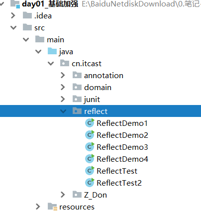

#  介绍

[一文读懂java中的反射，边学边实战！ - 知乎](https://zhuanlan.zhihu.com/p/530294439) https://zhuanlan.zhihu.com/p/530294439 

反射机制
Class类
如何获取一个class的class实例
instanceof
动态加载
访问字段
获取字段值
setAccessible
SecurityManager 
设置字段值

> Java的反射API提供的 Field 类封装了字段的所有信息：  通过 Class 实例的方法可以获取 Field 实例： getField() ， getFields() ， getDeclaredField()， getDeclaredFields() ；  通过Field实例可以获取字段信息： getName() ， getType() ， getModifiers() ；  通过Field实例可以读取或设置某个对象的字段，如果存在访问限制，要首先调用setAccessible(true) 来访问非 public 字段。  通过反射读写字段是一种非常规方法，它会破坏对象的封装。

>  Java的反射API提供的Method对象封装了方法的所有信息：  通过 Class 实例的方法可以获取 Method 实例： getMethod() ， getMethods() ， getDeclaredMethod() ， getDeclaredMethods() ；  通过 Method 实例可以获取方法信息： getName() ， getReturnType() ， getParameterTypes() ， getModifiers() ；  通过 Method 实例可以调用某个对象的方法： Object invoke(Object instance, Object… parameters) ；  通过设置 setAccessible(true) 来访问非 public 方法；  通过反射调用方法时，仍然遵循多态原则。

调用方法
获取 Method
调用方法
调用静态方法
调用非public方法
多态
调用构造方法
获取继承关系
获取父类的Class
获取interface

框架设计的灵魂

	* 框架：半成品软件。可以在框架的基础上进行软件开发，简化编码
	* 反射：将类的各个组成部分封装为其他对象，这就是反射机制
		* 好处：
			1. 可以在程序运行过程中，操作这些对象。
			2. 可以解耦，提高程序的可扩展性。


# Classs


```java
* 获取Class对象的方式：
	1. Class.forName("全类名")：将字节码文件加载进内存，返回Class对象
		* 多用于配置文件，将类名定义在配置文件中。读取文件，加载类
	2. 类名.class：通过类名的属性class获取
		* 多用于参数的传递
	3. 对象.getClass()：getClass()方法在Object类中定义着。
		* 多用于对象的获取字节码的方式

	* 结论：
		同一个字节码文件(*.class)在一次程序运行过程中，只会被加载一次，不论通过哪一种方式获取的Class对象都是同一个。
```


```java
* Class对象功能：
	* 获取功能：
		1. 获取成员变量们
			* Field[] getFields() ：获取所有public修饰的成员变量
			* Field getField(String name)   获取指定名称的 public修饰的成员变量

			* Field[] getDeclaredFields()  获取所有的成员变量，不考虑修饰符
			* Field getDeclaredField(String name)  
		2. 获取构造方法们
			* Constructor<?>[] getConstructors()  
			* Constructor<T> getConstructor(类<?>... parameterTypes)  

			* Constructor<T> getDeclaredConstructor(类<?>... parameterTypes)  
			* Constructor<?>[] getDeclaredConstructors()  
		3. 获取成员方法们：
			* Method[] getMethods()  
			* Method getMethod(String name, 类<?>... parameterTypes)  

			* Method[] getDeclaredMethods()  
			* Method getDeclaredMethod(String name, 类<?>... parameterTypes)  

		4. 获取全类名	
			* String getName()  
    
    	5. newInstance() //创建新对象
```

# Field


```java
* Field：成员变量
	* 操作：
		1. 设置值
			* void set(Object obj, Object value)  
		2. 获取值
			* get(Object obj) 

		3. 忽略访问权限修饰符的安全检查
			* setAccessible(true):暴力反射
```

# Constructor

```java
* Constructor:构造方法
	* 创建对象：
		* T newInstance(Object... initargs)  

		* 如果使用空参数构造方法创建对象，操作可以简化：Class对象的newInstance方法
```

# Method


```java
* Method：方法对象
	* 执行方法：
		* Object invoke(Object obj, Object... args)  

	* 获取方法名称：
		* String getName:获取方法名
```


	* 案例：
		* 需求：写一个"框架"，不能改变该类的任何代码的前提下，可以帮我们创建任意类的对象，并且执行其中任意方法
			* 实现：
				1. 配置文件
				2. 反射
			* 步骤：
				1. 将需要创建的对象的全类名和需要执行的方法定义在配置文件中
				2. 在程序中加载读取配置文件
				3. 使用反射技术来加载类文件进内存
				4. 创建对象
				5. 执行方法

# 例子



# 泛型的反射

这是出现在集合中的一个方法，获取class和泛型类别

```java
/**
 * Returns x's Class if it is of the form "class C implements Comparable<C> ,else null
 * hashmap1.8的方法
 * <p>
 * Type是一种类型：“ interface java.lang.Iterable ”
 * ParameterizedTypes是泛型类“ java.lang.Comparable<com.don.demo.reflect.GenericTest> ”，是Type的子类
 *
 * @author Carl Don
 * @version V1.0
 * @date 2020年01月04日 下午 3:00
 */
public class GenericTest extends ArrayList implements Iterable, Comparable<GenericTest>, FunctionalInterface {

	static Class<?> comparableClassFor(Object x) {
		// 1.判断x是否实现了Comparable接口
		if (x instanceof Comparable) {
			Class<?> c;
			Type[] ts, as;
			Type t;
			ParameterizedType p;
			// 2.校验x是否为String类型
			if ((c = x.getClass()) == String.class) // bypass checks
				return c;
			if ((ts = c.getGenericInterfaces()) != null) {
				// 3.遍历x实现的所有接口
				for (int i = 0; i < ts.length; ++i) {
					// 4.如果x实现了Comparable接口，则返回x的Class
					if (((t = ts[i]) instanceof ParameterizedType) &&
							((p = (ParameterizedType) t).getRawType() ==
									Comparable.class) &&
							(as = p.getActualTypeArguments()) != null && // 泛型参数是什么<...>
							as.length == 1 && as[0] == c) // type arg is c ，和自己比较
						return c;
				}
			}
		}
		return null;
	}

	public static void main(String[] args) {
		comparableClassFor(new GenericTest());
		System.out.println();
	}

	public Iterator iterator() {
		return null;
	}

	public Class<? extends Annotation> annotationType() {
		return null;
	}

	@Override
	public int compareTo(GenericTest o) {
		return 0;
	}
}
```

# [JavaBean的内省与BeanUtils库](https://www.cnblogs.com/pony1223/p/7450837.html)

# 参考文献

[JAVA中反射机制六（java.lang.reflect包）](https://www.cnblogs.com/pony1223/p/7470382.html)

[聊聊Java内省Introspector](https://www.throwx.cn/2019/12/25/java-introspector-usage/)

# constructor

[reflectionFactory.newConstructorForSerialization原理](https://zhuanlan.zhihu.com/p/158978955)


  

[从Class源码看反射](https://zhuanlan.zhihu.com/p/257319746)


  

# 