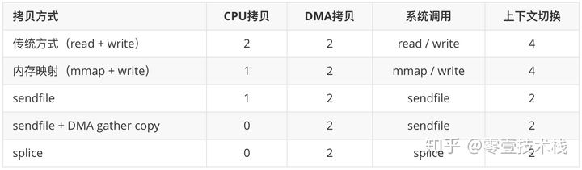

# 用户态和内核态

[从根上理解用户态与内核态](https://segmentfault.com/a/1190000039774784)

> C P U 指令集权限 
>
> 每一条汇编语句都对应了一条 `C P U 指令`，而非常非常多的 `C P U 指令` 在一起，可以组成一个、甚至多个集合，指令的集合叫 `C P U 指令集`。
>
> Inter把 `C P U 指令集` 操作的权限由高到低划为4级：
>
> 用户态与内核态的概念就是C P U 指令集权限的区别，进程中要读写 `I O`，必然会用到 ring 0 级别的 `C P U 指令集`，而此时 C P U 的指令集操作权限只有 ring 3，为了可以操作ring 0 级别的 `C P U 指令集`， C P U 切换指令集操作权限级别为 ring 0，C P U再执行相应的ring 0 级别的 `C P U 指令集`（内核代码），执行的内核代码会使用当前进程的内核栈。
>
> PS：每个进程都有两个栈，分别是用户栈与内核栈，对应用户态与内核态的使用。
>
> - 用户态：只能操作 `0-3G` 范围的低位虚拟空间地址
> - 内核态：`0-4G` 范围的虚拟空间地址都可以操作，尤其是对 `3-4G` 范围的高位虚拟空间地址必须由内核态去操作
> - 补充：`3G-4G` 部分大家是共享的（指所有进程的内核态逻辑地址是共享同一块内存地址），是内核态的地址空间，这里存放在整个内核的代码和所有的内核模块，以及内核所维护的数据
>
> 每个进程的 `4G` 虚拟空间地址，高位 `1G` 都是一样的，即内核空间。只有剩余的 `3G` 才归进程自己使用，换句话说就是， 高位 `1G` 的内核空间是被所有进程共享的！
>
> 最后做个小结，我们通过指令集权限区分用户态和内核态，还限制了内存资源的使用，操作系统为用户态与内核态划分了两块内存空间，给它们对应的指令集使用
>
> 用户态与内核态的切换
>
> > - 保留用户态现场（上下文、寄存器、用户栈等）
> >
> > - 复制用户态参数，用户栈切到内核栈，进入内核态
> >
> > - 额外的检查（因为内核代码对用户不信任）
> >
> > - 执行内核态代码
> >
> > - 复制内核态代码执行结果，回到用户态
> >
> > - 恢复用户态现场（上下文、寄存器、用户栈等）
> >
> >   
>
> 系统调用将Linux整个体系分为用户态和内核态，为了使应用程序访问到内核的资源，如CPU、内存、I/O，内核必须提供一组通用的访问接口，这些接口就叫系统调用。
>
> 库函数就是屏蔽这些复杂的底层实现细节，减轻程序员的负担，从而更加关注上层的逻辑实现，它对系统调用进行封装，提供简单的基本接口给程序员。
>
> Shell顾名思义，就是外壳的意思，就好像把内核包裹起来的外壳，它是一种特殊的应用程序，俗称命令行。Shell也是可编程的，它有标准的Shell 语法，符合其语法的文本叫Shell脚本，很多人都会用Shell脚本实现一些常用的功能，可以提高工作效率。
>
> 什么情况会导致用户态到内核态切换
>
> > - 系统调用：用户态进程主动切换到内核态的方式，用户态进程通过系统调用向操作系统申请资源完成工作，例如 fork（）就是一个创建新进程的系统调用，系统调用的机制核心使用了操作系统为用户特别开放的一个中断来实现，如Linux 的 int 80h 中断，也可以称为软中断
> > - 异常：当 C P U 在执行用户态的进程时，发生了一些没有预知的异常，这时当前运行进程会切换到处理此异常的内核相关进程中，也就是切换到了内核态，如缺页异常
> > - 中断：当 C P U 在执行用户态的进程时，外围设备完成用户请求的操作后，会向 C P U 发出相应的中断信号，这时 C P U 会暂停执行下一条即将要执行的指令，转到与中断信号对应的处理程序去执行，也就是切换到了内核态。如硬盘读写操作完成，系统会切换到硬盘读写的中断处理程序中执行后边的操作等。

[原来 8 张图，就可以搞懂「零拷贝」了](https://www.cnblogs.com/xiaolincoding/p/13719610.html)

[深入剖析Linux IO原理和几种零拷贝机制的实现](https://zhuanlan.zhihu.com/p/83398714)

> 零拷贝（Zero-copy）技术指在计算机执行操作时，CPU 不需要先将数据从一个内存区域复制到另一个内存区域，从而可以减少上下文切换以及 CPU 的拷贝时间。它的作用是在数据报从网络设备到用户程序空间传递的过程中，减少数据拷贝次数，减少系统调用，实现 CPU 的零参与，彻底消除 CPU 在这方面的负载。实现零拷贝用到的最主要技术是 DMA 数据传输技术和内存区域映射技术。
>
> - 零拷贝机制可以减少数据在内核缓冲区和用户进程缓冲区之间反复的 I/O 拷贝操作。
> - 零拷贝机制可以减少用户进程地址空间和内核地址空间之间因为上下文切换而带来的 CPU 开销。

[内存映射为何能提升IO读取速率？](https://www.codenong.com/cs109393789/)

[Java直接内存原理](https://juejin.cn/post/6844903822091878408)

[Java直接内存与堆内存](https://www.cnblogs.com/z-sm/p/6235157.html)

[深入剖析Linux IO原理和几种零拷贝机制的实现，重点](https://zhuanlan.zhihu.com/p/83398714)

1. 物理内存  

2. 虚拟内存

3. 页表

4. 用户进程

5. 磁盘存储空间

6. 内核空间和用户空间

7. Linux的内部层级结构

8. 3种主要的Linux I/O读写方式

9. I/O中断原理

10. dma传输原理

11. 传统的io

    > 整个过程涉及 2 次 CPU 拷贝、2 次 DMA 拷贝总共 4 次拷贝，以及 4 次上下文切换，

12. 用户态直接io

13. 减少数据拷贝次数

14. 写时复制技术

15. mmap + write

16. Sendfile

17. sendfile + DMA      gather copy

18. Splice

19. 写时复制

20. 缓冲区共享

21. Linux零拷贝对比

    

22.  Java NIO零拷贝实现

23. MappedByteBuffer

    > MappedByteBuffer 是 NIO 基于内存映射（mmap）这种零拷贝方式的提供的一种实现

24. DirectByteBuffer

25. FileChannel

    > transferTo() 和 transferFrom() 底层都是基于 sendfile 实现数据传输的。
    >
    > FileChannelImpl 首先执行 transferToDirectly() 方法，以 sendfile 的零拷贝方式尝试数据拷贝。如果系统内核不支持 sendfile，进一步执行 transferToTrustedChannel() 方法，以 mmap 的零拷贝方式进行内存映射，这种情况下目的通道必须是 FileChannelImpl 或者 SelChImpl 类型。如果以上两步都失败了，则执行 transferToArbitraryChannel() 方法，基于传统的 I/O 方式完成读写，具体步骤是初始化一个临时的 DirectBuffer，将源通道 FileChannel 的数据读取到 DirectBuffer，再写入目的通道 WritableByteChannel 里面。

26. RocketMQ和Kafka对比

    > RocketMQ 选择了 mmap + write 这种零拷贝方式，适用于业务级消息这种小块文件的数据持久化和传输；而 Kafka 采用的是 sendfile 这种零拷贝方式，适用于系统日志消息这种高吞吐量的大块文件的数据持久化和传输。但是值得注意的一点是，Kafka 的索引文件使用的是 mmap + write 方式，数据文件使用的是 sendfile 方式。

mmap使用的是非阻塞式IO，基于多路复用处理，适用于小数据块/高频率的IO传输，大块数据会阻塞多路复用线程，sendfile使用的是阻塞式IO，适用于大数据块/低频率的IO传输。


linux里面的虚拟内存是内核管理内存的一个抽象，windows里面的虚拟内存才是说的把硬盘空间当内存使，linux里面实现同样功能的是交换空间。

估计是作者被”虚拟内存“这个名词搞混了，准确翻译过来应该是内存虚拟化才对。

而虚拟内存则是指将硬盘的一块区域划分来作为内存”个人觉得这句话说得有问题 你这句话应该是对内存映射文件技术的解释

# 直接内存

```
"A direct byte buffer may be created by invoking the allocateDirect factory method of this class. The buffers returned by this method typically have somewhat higher allocation and deallocation costs than non-direct buffers. The contents of direct buffers may reside outside of the normal garbage-collected heap, and so their impact upon the memory footprint of an application might not be obvious. It is therefore recommended that direct buffers be allocated primarily for large, long-lived buffers that are subject to the underlying system's native I/O operations. In general it is best to allocate direct buffers only when they yield a measureable gain in program performance."
```

[JVM源码分析之堆外内存完全解读](http://lovestblog.cn/blog/2015/05/12/direct-buffer/)

> 资料已保存
>
> 真正的内存分配是使用的Bits.reserveMemory方法
>
> - 堆外内存默认是多大
> - 为什么要主动调用System.gc()
> - 为什么要使用堆外内存
> - 为什么不能大面积使用堆外内存
>
> 最大堆外内存的值来自于`directMemory = Runtime.getRuntime().maxMemory()`，不是64m
>
> 如果有大量的DirectByteBuffer对象移到了old，但是又一直没有做cms gc或者full gc，而只进行ygc，那么我们的物理内存可能被慢慢耗光，但是我们还不知道发生了什么，因为heap明明剩余的内存还很多(前提是我们禁用了System.gc)。

[Java-直接内存 DirectMemory 详解](https://cloud.tencent.com/developer/article/1586341)

> 设计逻辑
>
> 间接垃圾回收
>
> 为什么需要 DirectByteBuffer ：调用 IO 操作的 C 类库时，规定了写入时地址不能失效；减少拷贝，内存映射
>
> 内存分配：-XX:MaxDirectMemorySize

深入理解 Java 虚拟机 第三版

> - Direct Memory 并不是虚拟机运行时数据区的一部分；
> - 由于在 JDK 1.4 中引入了 NIO 机制，为此实现了一种通过 native 函数直接分配对外内存的，而这一切是通过以下两个概念实现的： 
>   - 通道（Channel）;
>   - 缓冲区（Buffer）;
> - 通过存储在 Java 堆里面的 DirectByteBuffer **对象**对这块内存的引用进行操作；
> - 因避免了 Java 堆和 Native 堆（native heap）中来回复制数据，所以在一些场景中显著提高了性能；
> - 直接内存出现 OutOfMemoryError 异常的原因是物理机器的内存是受限的，但是我们通常会忘记需要为直接内存在物理机中预留相关内存空间；

[What is the purpose to use direct memory in Java?](https://stackoverflow.com/questions/52769633/what-is-the-purpose-to-use-direct-memory-in-java)

> 页面已收集
>
> what, why , when ,how to use direct memory.

[Java-直接内存 DirectMemory 详解](https://cloud.tencent.com/developer/article/1586341)

> 《深入理解 Java 虚拟机 第三版》2.2.7 小节 关于 Java 直接内存的描述。
>
> 直接内存出现 OutOfMemoryError 异常的原因是物理机器的内存是受限的。
>
> JNI（Java Native Inteface）在调用 IO 操作的 C 类库时，规定了写入时地址不能失效，这就导致了不能在 heap 上直接进行 IO 操作。
>
> 直接内存的最大大小可以通过 `-XX:MaxDirectMemorySize` 来设置，默认是 64M。
>
> 
>
> DirectByteBuffer 这种申请堆外内存的方式比堆内申请内存效率低，这主要是因为前者需要向物理机申请堆外内存，这是额外的开销。

### 如何分配

C++的标准库std::malloc()

堆内存怎么往外写：

java堆内存首先拷贝到了直接内存，然后再把地址传给I/O函数。
 java GC三大类算法，除了标记清除，标记整理和复制算法都会移动对象，并且如果直接把java堆地址传给I/O函数则需要保证I/O操作过程中该块内存不变化，则需要暂停GC，所以JDK实现使用拷贝的方式。

[Java直接内存原理](https://juejin.cn/post/6844903822091878408)

# native heap, direct memory 

[Java直接内存是属于内核态还是用户态？](https://www.zhihu.com/question/376317973)

> DirectByteBuffer属于user space,也就是用户态。
>
> 平时说的[java内存](https://www.zhihu.com/search?q=java内存&search_source=Entity&hybrid_search_source=Entity&hybrid_search_extra={"sourceType"%3A"answer"%2C"sourceId"%3A1054580772})普遍指的是jvm中的堆内存，但是一个java进程的内存大小一般约等于堆内存+堆外内存(native memory)。
>
> > -XX:MaxDirectMemorySize 参数来设置大小，不设置的情况下会使用
> >
> > -Xmx:HeapMaxMemorySize 参数的大小
>
> jvm启动的时候会在用户态申请一块内存，申请的这块内存中有一部分会被称为堆，一般我我们申请的对象就会放在这个堆上，堆上的对象是受gc管理的。
>
> 在堆外内存中如果我们是通过Java的directbuffer申请的，那么这块内存其实也是间接受gc管理的，而如果我们通过jni直接调用c函数申请一块堆外内存，那么这块内存就只能我们自己手动管理了。
>
> 为什么DirectByteBuffer是如何优化io性能？
>
> > 其实本质是减少内存之间拷贝的次数，因为DirectMemory直接分配的是用户空间的内存，所以不再需要用户空间和jvm的heap之间的拷贝，所以少了一次拷贝，节省了时间。然而这只是用户态上的空间优化，
> >
> > 那么用户态和内核态之间是否又被优化了呢。
> >
> > > 用户态和内核态之间的拷贝其实也被优化了，本质上是因为用户态的[逻辑地址](https://www.zhihu.com/search?q=逻辑地址&search_source=Entity&hybrid_search_source=Entity&hybrid_search_extra={"sourceType"%3A"answer"%2C"sourceId"%3A1054580772})和内核态的逻辑地址使用的是同一个物理空间，所以相当于用户态和内核态也不存在拷贝。
> > >
> > > DirectByteBuffer继承了MappedByteBuffer，MappedByteBuffer使用了操作系统的虚拟内存技术，使得java进程（用户进程）持有的虚拟地址跟内核持有的虚拟地址（它们各自的虚拟地址，是不同的）经过MMU转换后，得到了同一个物理地址。也就是说，通过使用MappedByteBuffer，可以让java进程与内核共享同一块物理内存（实际上不是连续的物理），进而避免了用户态缓冲和内核态缓冲之间的内存拷贝（因为现在这两块缓冲根本就是同一个）。
>
> 当我们在Java中发起一个文件读操作会发生什么呢？首先内核会将数据从磁盘读到内存，再从内核拷贝到用户态的堆外内存(这部分是jvm实现)，然后再将数据从堆外拷贝到堆内。拷贝到堆内其实就是我们在Java中自己手动申请的byte数组中。
>
> 以上是Java传统io的方式，我们发现经过了俩次内存拷贝，而nio中只需要使用directbuffer，就不必将数据从堆外拷贝到堆内了，减少了一次内存拷贝，降低了内存的占用，减轻了gc的压力。直接将数据写到堆外内存中，然后堆内内存中有个引用地址来操作这个堆外内存。
>
> Java中的零拷贝其实是直接调用的Linux系统调用，直接在内核态进行设备间的内存操作，二不必拷贝到用户态中

[搞懂IO](https://zhuanlan.zhihu.com/p/100014103)

> linux操作系统内核尚未实现aio(windows 实现了aio)。
>
> 网络io就是对网卡的读写。
>
> 有人说，传统的bio也有buffer的，比如bufferxxx类，但是传统的buffer操作还是没法和nio的buffer相比。
>
> 在jdk1.4之后的transferTo方法就是零拷贝的实现。
> 所以下次两个文件之间的复制，或者文件到socket的复制，应该想到使用transferTo方法

[What is the difference between off-heap, native heap, direct memory and native memory?](https://stackoverflow.com/questions/30622818/what-is-the-difference-between-off-heap-native-heap-direct-memory-and-native-m)

> 1) **Heap memory**: memory within the JVM process that is used to hold Java Objects and is maintained by the JVMs Garbage Collector.
>
> 2) **Native memory/Off-heap**: is memory allocated within the processes address space that is not within the heap and thus is not freed up by the Java Garbage Collector.
>
> 3) **Direct memory**: is similar to native, but also implies that an underlying buffer within the hardware is being shared. For example, a buffer within the network adapter or graphics display. The goal here is to reduce the number of times the same bytes is being copied about in memory.
>
> a lot of high performant server application which run on JVM have use off-heap memory to increase performance of server such as Apache Cassandra.

# native memory

[Native memory perspective](https://www.ibm.com/docs/en/mon-diag-tools?topic=collected-native-memory-perspective)

Native memory is the memory provided to the application process by the operating system. The memory is used for heap storage and other purposes. 

# 元空间与直接内存的关系

[元空间与直接内存的关系](https://blog.csdn.net/Ethan_199402/article/details/110431404?spm=1001.2101.3001.6650.3&utm_medium=distribute.pc_relevant.none-task-blog-2%7Edefault%7ECTRLIST%7ERate-3.pc_relevant_default&depth_1-utm_source=distribute.pc_relevant.none-task-blog-2%7Edefault%7ECTRLIST%7ERate-3.pc_relevant_default&utm_relevant_index=6)

> 元空间：DK1.8以前的HotSpot JVM有方法区，也叫永久代(permanent generation)。（永久代是针对hotspot虚拟机来说的）
>
> 方法区用于存放已被虚拟机加载的类信息、常量、静态变量，即编译器编译后的代码。
>
> 方法区是一片连续的堆空间，通过-XX:MaxPermSize来设定永久代最大可分配空间，当JVM加载的类信息容量超过了这个值，会报OOM:PermGen错误。
>
> JDK1.7开始了方法区的部分移除：符号引用(Symbols)移至native heap，字面量(interned strings)和静态变量(class statics)移至java heap。
>
> 为什么要用Metaspace替代永久代？
>
> > 随着动态类加载的情况越来越多，这块内存变得不太可控，如果设置小了，系统运行过程中就容易出现内存溢出，设置大了又浪费内存。
>
> 默认情况下，元空间的大小仅受本地内存限制，但可以通过以下参数来指定元空间的大小：
>
> > XX:MetaspaceSize，初始空间大小，达到该值就会触发垃圾收集进行类型卸载，同时GC会对该值进行调整：如果释放了大量的空间，就适当降低该值；如果释放了很少的空间，那么在不超过MaxMetaspaceSize时，适当提高该值。
> >
> > -XX:MaxMetaspaceSize，最大空间，默认是没有限制的。
> > 　　除了上面两个指定大小的选项以外，还有两个与 GC 相关的属性：
> >
> > > 1）-XX:MinMetaspaceFreeRatio，在GC之后，最小的Metaspace剩余空间容量的百分比，减少为分配空间所导致的垃圾收集
> > > 2）　-XX:MaxMetaspaceFreeRatio，在GC之后，最大的Metaspace剩余空间容量的百分比，减少为释放空间所导致的垃圾收集
> > >
> > > -verbose参数是为了获取类型加载和卸载的信息
>
> Metaspace内存管理
>
> > 在metaspace中，类和其元数据的生命周期与其对应的类加载器相同，只要类的类加载器是存活的，在Metaspace中的类元数据也是存活的，不能被回收。
> > 每个加载器有单独的存储空间。
> > 省掉了GC扫描及压缩的时间。
> > 当GC发现某个类加载器不再存活了，会把对应的空间整个回收。

直接内存的回收

> 需注意堆外内存并不直接控制于JVM，这些内存只有在DirectByteBuffer回收掉之后才有机会被回收，而 Young GC 的时候只会将年轻代里不可达的DirectByteBuffer对象及其直接内存回收，如果这些对象大部分都晋升到了年老代，那么只能等到Full GC的时候才能彻底地回收DirectByteBuffer对象及其关联的堆外内存。因此，堆外内存的回收依赖于 Full GC
>
> Full GC一般发生在年老代垃圾回收或者代码调用System.gc的时候，依靠年老代垃圾回收触发 Full GC，进而实现堆外内存的回收显然具有太大的不确定性。如果年老代一直不进行垃圾回收，那么堆外内存就得不到回收，机器的物理内存可能就会被慢慢耗光。为了避免这种情况发生，可以通过参数-XX:MaxDirectMemorySize来指定最大的直接内存大小，当其使用达到了阈值的时候将调用System.gc来做一次Full GC，从而完成可控的堆外内存回收。这样做的问题在于，堆外内存的回收依赖于代码调用 System.gc，先捕获到异常，再在Catch块里面通过System.gc()命 令来触发垃圾收集。但如果Java虚拟机再打开了-XX：+DisableExplicitGC开关，禁止了人工触发垃圾 收集的话，根本不会触发Full GC，这样在使用Netty等 NIO 框架时需注意是否会因为这个参数导致直接内存的泄露
>
> 直接内存出现OutOfMemoryError的原因是对该区域进行内存分配时，其内存与其他内存加起来超过最大物理内存限制（包括物理的和操作系统级的限制），从而导致OutOfMemoryError。
> 　　另外，若我们通过参数“-XX:MaxDirectMemorySize”指定了直接内存的最大值，其超过指定的最大值时，也会抛出内存溢出异常。
> 　　
> -XX:MaxDirectMemorySize 参数没有指定的话，那么根据directMemory = Runtime.getRuntime().maxMemory()最大直接内存的值和堆内存大小差不多，即与堆内存大小一致

错误

> 错误有几个。
>
> jvm=堆内内存+堆外内存。受限于本机总内存（RAM及SWAP区或者分页文件）大小以及处理器寻址空间的限制（最常见的就是32位/64位CPU的最大寻址空间限制不同）
>
> DirectByteBuffer **省掉一次从堆内拷贝到堆外的操作**属于用户态优化。用户态到内核态的优化是因为用户态的逻辑地址和内核态的逻辑地址使用的是同一个物理空间

# [堆内内存还是堆外内存？](https://www.infoq.cn/news/2014/12/external-memory-heap-memory/)

对于内存池，Lawery 认为它主要用于两类对象。第一类是生命周期较短，且结构简单的对象，在内存池中重复利用这些对象能增加 CPU 缓存的命中率，从而提高性能。第二种情况是加载含有大量重复对象的大片数据，此时使用内存池能减少垃圾回收的时间。对此，Lawery 还以[ StringInterner ](https://github.com/OpenHFT/Java-Lang/blob/master/lang/src/main/java/net/openhft/lang/pool/StringInterner.java)为例进行了说明。

最后 Lawery 分析了堆外内存，它和内存池一样，也能缩短垃圾回收时间，但是它适用的对象和内存池完全相反。内存池往往适用于生命期较短的可变对象，而生命期中等或较长的对象，正是堆外内存要解决的。堆外内存有以下特点：

- 对于大内存有良好的伸缩性
- 对垃圾回收停顿的改善可以明显感觉到
- 在进程间可以共享，减少虚拟机间的复制

Lawery 还提到对外内存最重要的还不是它能改进性能，而是它的确定性。

当然堆外内存也有它自己的问题，最大的问题就是你的数据结构变得不那么直观，如果数据结构比较复杂，就要对它进行串行化（serialization），而串行化本身也会影响性能。另一个问题是由于你可以使用更大的内存，你可能开始担心虚拟内存（即硬盘）的速度对你的影响了。

Lawery 还介绍了 OpenHFT 公司提供三个开源库：[ Chronicle Queue ](http://openhft.net/products/chronicle-queue/)、[ Chronicle Map ](http://openhft.net/products/chronicle-map/)和[ Thread Affinity ](http://openhft.net/products/thread-affinity/)，这些库可以帮助开发人员使用堆外内存来保存数据。

# 为什么要使用堆外内存

DirectByteBuffer在创建的时候会通过Unsafe的native方法来直接使用malloc分配一块内存，这块内存是heap之外的，那么自然也不会对gc造成什么影响(System.gc除外)，因为gc耗时的操作主要是操作heap之内的对象，对这块内存的操作也是直接通过Unsafe的native方法来操作的，相当于DirectByteBuffer仅仅是一个壳，还有我们通信过程中如果数据是在Heap里的，最终也还是会copy一份到堆外，然后再进行发送，所以为什么不直接使用堆外内存呢。对于需要频繁操作的内存，并且仅仅是临时存在一会的，都建议使用堆外内存，并且做成缓冲池，不断循环利用这块内存。

# 为什么不能大面积使用堆外内存

如果我们大面积使用堆外内存并且没有限制，那迟早会导致内存溢出，毕竟程序是跑在一台资源受限的机器上，因为这块内存的回收不是你直接能控制的，当然你可以通过别的一些途径，比如反射，直接使用Unsafe接口等，但是这些务必给你带来了一些烦恼，Java与生俱来的优势被你完全抛弃了—开发不需要关注内存的回收，由gc算法自动去实现。另外上面的gc机制与堆外内存的关系也说了，如果一直触发不了cms gc或者full gc，那么后果可能很严重。

# gc

[Understanding the Java Memory Model and Garbage Collection](https://dzone.com/articles/understanding-the-java-memory-model-and-the-garbag)

> Here, the JVM itself is a process, and the memory allocated to that process includes the Heap, Meta Space, JIT code cache, thread stacks, and shared libraries. We call this native memory. “***Native Memory***” is the memory provided to the process by the operating system. How much memory the operating system allocates to the Java process depends on the operating system, processor, and the JRE. 
>
> gc process detail

# 使用直接内存

**Heap-Offloading** 

减少堆大小，减缓gc压力，'offload' parts of the objects to the non-java heap 

[fast-serialization - QuickStartHeapOff.wiki](https://code.google.com/archive/p/fast-serialization/wikis/QuickStartHeapOff.wiki)

> In order to save arbitrary objects into unmanaged memory, the most viable solution is the use of Serialization.

# 例子

[Native Memory — The Silent JVM Killer](https://medium.com/swlh/native-memory-the-silent-jvm-killer-595913cba8e7#:~:text=Native%20memory%20is%20memory%20allocated,methods%20in%20certain%20Java%20classes.&text=When%20you%20get%20a%20heap,heap%2C%20as%20the%20name%20implies.)

> 已保存图片
>
> The Linux OOM-Killer
>
> `rss` 
>
> [jemalloc](https://github.com/jemalloc/jemalloc/wiki/Use-Case%3A-Heap-Profiling) 
>
> `DeflaterOutputStream`  `Deflater`  not close
>
> always remember to close resource.

# 参考文献

[从进程的角度再看Java内存](https://www.history-of-my-life.com/archives/570)