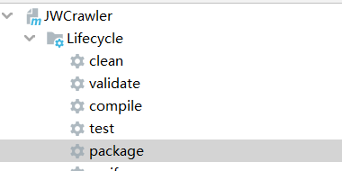

# 安装

## jre

仅仅需要设置bin的path位置，当然直接写命令的完整路径也是可以的。path就是为了方便检索java命令的位置

# java命令

## idea运行java程序命令解析

```bash
"C:\Program Files\Java\jdk1.8.0_202\bin\java.exe" 
-agentlib:jdwp=transport=dt_socket,address=127.0.0.1:59726,suspend=y,server=n  #jvm properties
-XX:TieredStopAtLevel=1 
-noverify 
-Dspring.profiles.active=dev  #使用的配置文件
-Dspring.output.ansi.enabled=always 
-Dcom.sun.management.jmxremote 
-Dspring.jmx.enabled=true 
-Dspring.liveBeansView.mbeanDomain 
-Dspring.application.admin.enabled=true 
-javaagent:C:\Users\TJR_S\.IntelliJIdea2019.3\system\captureAgent\debugger-agent.jar 
-Dfile.encoding=UTF-8  #与java读写使用的编码有关
-classpath ".;...很多绝对路径jar包" 
com.dc.crawl.CrawlApplication # 入口main类
sd df fd #program arguments
```

> 注意：PowerShell需要把命令的各个分支用""包含起来，cmd则不需要。

## idea运行参数设置

vm options：jvm properties

program arguments : `public static void main(String[] args){}`中的数组

environment variables ：临时修改系统环境参数


## jvm properteis

system properties

-D=value


Set a system property value. If value is a string that contains spaces, you must enclose the string in double quotes:

如果value中有空格，则需要用双引号将该值括起来，如：-Dname=”kazaf f”。

该参数通常用于设置系统级全局变量值，如配置文件路径，保证该属性在程序中任何地方都可访问。

**注意事项**

（1）需要设置的是JVM参数而不是program参数；
（2）使用此参数的参数优先级最高，会覆盖项目中配置的此项；

```cmd
 -Ddubbo.reference.com.foo.BarService.check=false
 -Ddubbo.reference.check=false
 -Ddubbo.consumer.check=false 
 -Ddubbo.registry.check=false
 -Djdk.http.auth.tunneling.disabledSchemes="" 
 -Djdk.http.auth.proxying.disabledSchemes="" 
```

在虚拟机的系统属性中设置属性名/值对，运行在此虚拟机上的应用程序可用：

```
 System.setProperty("jdk.http.auth.tunneling.disabledSchemes", "");
System.getProperty("属性名")
```

#### **-Dfile.encoding=UTF-8**

It sets a property which defines in which encoding will Java save and read files by default. It must be set at JVM startup.

There are multiple encodings - ways to represent characters on computers. UTF-8 is one of the best to use, as it contains all special characters in many languages.

Once you don't have this property, Java might save files in a different encoding which might lead to strange characters when opening the file with text editor. You can avoid this issue by manually setting the desired encoding to your `OutputStream`

This can be overridden on runtime.

在自己读写文件的demo类就很能体现出来。


```
System.getProperty(key);
System.getenv(key);
```

# jar

JAR（Java Archive，Java 归档文件）是与平台无关的文件格式，它允许将许多文件组合成一个压缩文件，可以使用Java软件打开。

为 J2EE 应用程序创建的 JAR 文件是 EAR 文件（企业 JAR 文件）。

JAR 文件格式以流行的 ZIP 文件格式为基础。

与 ZIP 文件不同的是，JAR 文件不仅用于压缩和发布，而且还用于部署和封装库、组件和插件程序，并可被像编译器和 JVM 这样的工具直接使用。

在 JAR 中包含特殊的文件，如 manifests 和部署描述符，用来指示工具如何处理特定的 JAR。

> **jar的目录entry**
>
> 这种默认方式（eclipse）生成的jar包中，只含有class文件，而并没有我们大众所知的文件夹目录结构。可能我们大多数人认为**com.test.Student类，Student类文件就应该在com文件夹下的test文件夹里**，这其实是片面的，是一个误区！
>
> com.test真正的含义是package**包域名**，就好比.net里的命名空间，它只是为了区分、汇总、唯一标识不同的类而提出的概念，跟文件夹目录层次结构是两回事，我们只是习惯上用文件夹目录来展示package而已。但package却不一定非要用过文件夹目录来展示。

## 启动jar包

```java
java -jar demo.jar
    
```

## maven创建jar包

```xml
<plugin>
    <groupId>org.apache.maven.plugins</groupId>
    <artifactId>maven-compiler-plugin</artifactId>
    <configuration>
        <target>1.8</target>
        <source>1.8</source>
        <encoding>UTF-8</encoding>
        <showWarnings>true</showWarnings>
    </configuration>
</plugin>
```

直接package只是一个jar包，没有main函数入口，并且不会把依赖的包打进去，只会打入pom文件，也就是路径，这种jar包需要配合maven插件使用。运行的时候再查找jar具体依赖jar包。




打包的时候打入具体的依赖，并且运行

```xml
  <build>
        <plugins>
            <plugin>
                <groupId>org.apache.maven.plugins</groupId>
                <artifactId>maven-compiler-plugin</artifactId>
                <configuration>
                    <target>1.8</target>
                    <source>1.8</source>
                    <encoding>UTF-8</encoding>
                    <showWarnings>true</showWarnings>
                </configuration>
            </plugin>
            <plugin>
                <groupId>org.apache.maven.plugins</groupId>
                <artifactId>maven-assembly-plugin</artifactId>
                <configuration>
                    <archive>
                        <manifest>
                            <mainClass>com.dc.mall.JWCrawler</mainClass>
                        </manifest>
                    </archive>
                    <descriptorRefs>
                        <descriptorRef>
                            jar-with-dependencies
                        </descriptorRef>
                    </descriptorRefs>
                </configuration>
            </plugin>
        </plugins>
    </build>
```


## 创建

https://zq99299.github.io/java-tutorial/deployment/jar/

https://docs.oracle.com/javase/tutorial/deployment/index.html

最简单的

```java
jar cvfm jar-file manifest-addition input-file(s)
```

```java
c : 创建 jar 文件
f : 输出到一个 jar 文件中
m : 希望把指定文件中的信息合并到默认清单文件中
jar-file : 输出的 jar 名称
manifest-addition : 指定文件名称或路径，该文件的内容要添加到 JAR 文件清单的内容中。（必须是 utf-8 编码）
input-file(s) : 空格分隔的一个或多个要加入到jar中的文件
```

# cmd执行乱码

```bash
# 把cmd控制台设置为utf-8编码
chcp 65001
# 把java 程序使用的编码设置为utf-8 
java -Dfile.encoding=utf-8 -jar project.jar
```

# jconsole

## 介绍

JConsole是JDK自带的Java性能分析器，用来监听Java应用程序性能和跟踪代码。默认安装在JDK的bin目录（例如：C:\Program Files\Java\jdk1.8.0_144\bin），直接双击运行即可。
 JConsole可以监听本地的应用，也可以监听远程的应用。在新建连接界面上选择本地应用，或者输入远程连接地址，格式是ip:port，**注意这个port是监听端口不是服务端口**。

```shell
java 
-Djava.rmi.server.hostname=111.111.111.111 　　　　　// 远程ip地址， 本地输入时用, 注意要能够访问
-Dcom.sun.management.jmxremote 　　　　　　　　　　　　// 　　
-Dcom.sun.management.jmxremote.port=9090 　　　　　　// 监听的端口, 本地输入, 注意防火墙
-Dcom.sun.management.jmxremote.ssl=false 　　　　　　
-Dcom.sun.management.jmxremote.authenticate=true 　// 使用密码, 如果写成false， 下面一句就不用了, 后面的配置密码也不用了
-Dcom.sun.management.jmxremote.password.file=/usr/java/jdk1.6.0_43/jre/lib/management/jmxremote.password // 很明显, 配置密码的地儿
-jar 
app-1.0.jar
```

同时还需要注意服务器的端口是否被屏蔽，hosts是否配置了实际IP。可以使用hostname -i命令来查询ip是否生效。例如实际ip是10.10.10.101，计算机名是mycomputer。hosts配置如下：

```java
10.10.10.101   mycomputer
10.10.10.101   localhost localhost.localdomain localhost4 localhost4.localdomain4
```

配置访问用户名和口令

转到： /usr/java/jdk1.6.0_43/jre/lib/management/ （安装JDK的目录）

编辑jmxremote.access文件, 在最后加上

```
1 userName      readwrite \
2               create javax.management.monitor.*,javax.management.timer.* \
3               unregister
```

userName随便写， 就是你连接时需要 用到的

编辑jmxremote.password, 复制jmxremote.password.template, 改名去掉template

在最后添加

```
1 userName    userPassword
```

这里就是在设置密码。

## 参考文献

https://www.cnblogs.com/harvard/articles/2993125.html

## 问题

[JConsole is not showing any local processes ： probably have a permission issue](http://jtuts.com/2017/02/04/jconsole-not-showing-local-processes/)

C:\Users\Username\AppData\Local\Temp

# jhat

## 参考文献

https://blog.gceasy.io/2015/08/28/jhat-heap-dump-analysis/

https://docs.oracle.com/javase/8/docs/technotes/tools/unix/jhat.html

[JAVA8-线上内存泄漏分析](https://www.jianshu.com/p/09778780338a)

# javac编译

javac会检查要编译的类所引用的类是否在类路径，一定程度上表明你写的symbol都是正确有效的。在一定程度上保证你写的项目和类是正确的（要引用的符号和类都是存在的，可以找到的）。

[Ignore unresolved symbols when compiling java with javac](https://stackoverflow.com/questions/35865108/ignore-unresolved-symbols-when-compiling-java-with-javac)

> Java isn't memory aware, there's no static allocation so no need what data are we talking about. After all, all ArrayLists are just `List<Object>` and the actual `<Something>` is not important at compile time. Do not mistake Java for other languages that actually do something during compilation.
>
> 

错误: 找不到符号


test1依赖2，2依赖3，我编译2需要3，编译好了之后，把3删除，只要你不用3，就可以编译1成功。1可以用2，这个可以编译成功。


所以可以编译成功，只要你不引用spring-boot中的红色的类就可以编译成功

[javac错误: 找不到符号或程序包XXX不存在](https://blog.csdn.net/gao_zhennan/article/details/118612051)

[关于Javac命令和类文件之间的依赖问题](https://blog.csdn.net/octopusflying/article/details/53791661)

[maven的scope值runtime是干嘛用的?](https://www.zhihu.com/question/338722003)

> provided用于中间jar包，不最终打包，runtime用于解耦

# Client Server

[JVM学习笔记之Client Server端区别](https://segmentfault.com/a/1190000038153507)

