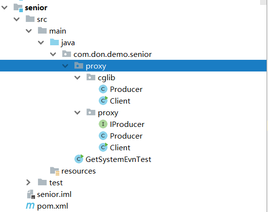
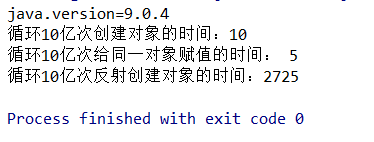
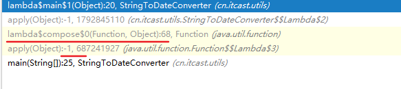

# 字节码操作

字节码随用随创建，随用随加载。
它与静态代理的区别也在于此。因为静态代理是字节码一上来就创建好，并完成加载。
装饰者模式就是静态代理的一种体现  

## 动态代理  

提供者： JDK 官方的 Proxy 类。
要求：被代理类最少实现一个接口。  

```java
public class Client {

	public static void main(String[] args) {
		final Producer producer = new Producer();

		/**
		 *  如何创建代理对象：
		 *      使用Proxy类中的newProxyInstance方法
		 *  创建代理对象的要求：
		 *      被代理类最少实现一个接口，如果没有则不能使用
		 *  newProxyInstance方法的参数：
		 *      ClassLoader：类加载器
		 *          它是用于加载代理对象字节码的。和被代理对象使用相同的类加载器。固定写法。
		 *      Class[]：字节码数组
		 *          它是用于让代理对象和被代理对象有相同方法。固定写法。
		 *      InvocationHandler：用于提供增强的代码
		 *          它是让我们写如何代理。我们一般都是写一个该接口的实现类，通常情况下都是匿名内部类，但不是必须的。
		 *          此接口的实现类都是谁用谁写。
		 */
		IProducer proxyProducer = (IProducer) Proxy.newProxyInstance(producer.getClass().getClassLoader(),
				producer.getClass().getInterfaces(),
				new InvocationHandler() {
					/**
					 * 作用：执行被代理对象的任何接口方法都会经过该方法
					 * 方法参数的含义
					 * @param proxy   代理对象的引用
					 * @param method  当前执行的方法
					 * @param args    当前执行方法所需的参数
					 * @return 和被代理对象方法有相同的返回值
					 * @throws Throwable
					 */
					@Override
					public Object invoke(Object proxy, Method method, Object[] args) throws Throwable {
						//提供增强的代码
						Object returnValue = null;

						//1.获取方法执行的参数
						Float money = (Float) args[0];
						//2.判断当前方法是不是销售
						if ("saleProduct".equals(method.getName())) {
							returnValue = method.invoke(producer, money * 0.8f);
						}
						return returnValue;
					}
				});
		proxyProducer.saleProduct(10000f);
	}
}

```

[JDK动态代理[4\]----ProxyGenerator生成代理类的字节码文件解析](https://www.cnblogs.com/liuyun1995/p/8144706.html)

[Java 学习：WeakCache 类](https://blog.csdn.net/dilixinxixitong2009/article/details/88362066)

## 字节码增强

提供者：第三方的 CGLib，如果报 asmxxxx 异常，需要导入 asm.jar。
要求：被代理类不能用 final 修饰的类（最终类）。  


```xml
   <dependencies>
        <dependency>
            <groupId>cglib</groupId>
            <artifactId>cglib</artifactId>
            <version>2.1_3</version>
        </dependency>
    </dependencies>
```


```java
/**
 * 基于子类的动态代理
 */
public class Client {

	public static void main(String[] args) {
		final Producer producer = new Producer();

		/**
		 *  如何创建代理对象：
		 *      使用Enhancer类中的create方法
		 *  创建代理对象的要求：
		 *      被代理类不能是最终类
		 *  create方法的参数：
		 *      Class：字节码
		 *          它是用于指定被代理对象的字节码。
		 *
		 *      Callback：用于提供增强的代码
		 *          它是让我们写如何代理。我们一般都是些一个该接口的实现类，通常情况下都是匿名内部类，但不是必须的。
		 *          此接口的实现类都是谁用谁写。
		 *          我们一般写的都是该接口的子接口实现类：MethodInterceptor
		 */
		Producer cglibProducer = (Producer) Enhancer.create(producer.getClass(), new MethodInterceptor() {
			/**
			 * 执行北地阿里对象的任何方法都会经过该方法
			 *    以上三个参数和基于接口的动态代理中invoke方法的参数是一样的
			 * @param methodProxy ：当前执行方法的代理对象
			 */
			@Override
			public Object intercept(Object proxy, Method method, Object[] args, MethodProxy methodProxy) throws Throwable {
				//提供增强的代码
				Object returnValue = null;

				//1.获取方法执行的参数
				Float money = (Float) args[0];
				//2.判断当前方法是不是销售
				if ("saleProduct".equals(method.getName())) {
					returnValue = method.invoke(producer, money * 0.8f);
				}
				return returnValue;
			}
		});
		cglibProducer.saleProduct(12000f);
	}
}

```


## 代码



# ClassLoader

[java类加载器不完整分析](https://blog.csdn.net/yangcheng33/article/details/52464898)

[真正理解线程上下文类加载器（多案例分析）](https://blog.csdn.net/yangcheng33/article/details/52631940)

[tomcat类加载机制了解一下](https://cloud.tencent.com/developer/article/1687353)

[深入探究JVM之类加载与双亲委派机制](https://www.cnblogs.com/yewy/p/13414144.html)

# JDK8

反射创建对象加快了。


****

# 错误

## Java找不到或无法加载主类

1. java执行class文件是根据CLASSPATH指定的地方来找，不是我们理解当前目录。如果希望它查询当前目录，需要在CLASSPATH中加入`.;`,代表当前目录。

   ```bash
   java -classpath . HelloWorld
   .;%JAVA_HOME%\lib\tools.jar;%JAVA_HOME%\lib\dt.jar
   ```

   

2. java执行class文件对package的路径是强依赖的。它在执行的时候会严格以当前用户路径为基础，按照package指定的包路径转化为文件路径去搜索class文件。

   **java文件**

   

   **目录**

   

   **编译运行**

   

   

   

来自 <https://www.cnblogs.com/wangxiaoha/p/6293340.html> 


## JAVA 编译出现编码GBK的不可映射字符

### 原因

由于JDK是国际版的，在编译的时候，如果我们没有用-encoding参数指定我们的JAVA源程序的编码格式，则javac.exe首先获得我们**操作系统默认采用的编码格式**。

在编译java程序时，若我们不指定源程序文件的编码格式：

> 1. JDK首先获得操作系统的file.encoding参数(它保存的就是操作系统默认的编码格式，如WIN2k，它的值为GBK)
>
> 2. 然后JDK就把我们的java源程序从file.encoding编码格式转化为JAVA内部默认的UNICODE格式放入内存中。
> 3. 然后，javac把转换后的unicode格式的文件进行编译成.class类文件，此时.class文件是UNICODE编码的，它暂放在内存中

对我们来说，我们最终获得的.class文件是内容以**UNICODE**编码格式保存的类文件，它内部包含我们源程序中的中文字符串，只不过此时它己经由file.encoding格式转化为UNICODE格式了。当我们不加设置就编译时，相当于使用了参数：`javac -encoding gbk XX.java`，当然就会出现不兼容的情况。

### 解决方法

1. 使用-encoding 指定字符集

```bash
javac -encoding utf-8 xx.java
```


2. 把源文件编码修改成ASCII，使用`notepad++`就可以

# 线程变量

线程传入的变量不会消失，尤其是内部类，从gc dump中可以看到属于线程变量。

> 主要对象不会消失，有可能发生内存泄露，因此需要设为null，或者注意线程的生命周期。

```java
// object[0]外部传进来，不会消失
new Thread() {
            public void run() {
                while (isRun) {
                    Object obj = null;
                    try {
                        obj = referenceQueue.remove();
                    } catch (InterruptedException e) {
                        e.printStackTrace();
                    }
                    if (obj != null) {
                        try {
                            Field rereferent = Reference.class
                                    .getDeclaredField("referent");
                            rereferent.setAccessible(true);
                            Object result = rereferent.get(obj);
                            System.out.println("gc will collect："
                                    + result.getClass() + "@"
                                    + result.hashCode() + "\t"
                                    + result);

                            //线程对象，复活PhantomReference引用对象
                            object[0] = result;
                        } catch (Exception e) {
                            e.printStackTrace();
                        }
                    } else {
                        System.out.println("没有");
                        try {
                            Thread.sleep(1000);
                        } catch (InterruptedException e) {
                        }
                    }
                }
            }
        }.start();
```

# 桥接方法

因为jvm的重写方法是返回类型和参数和方法名字一致，桥接方法是编译器生成的重写方法，原因有多种多样，结果都是为了代理给其他目标方法。

因为在 JVM 方法中，返回类型也是方法签名的一部分，

[Java底层知识：什么是 “桥接方法” ？](https://www.51cto.com/article/703055.html)

桥接方法被用于“改变”基类可见性。

> 这种桥接方法似乎是由于这个 bug （在 Java 6 被修复）才引入的。这意味着在 Java 6 之前是不会生成这样桥接方法的，那么 C#foo 就不能够在它所在包之外使用反射调用，以致于下面这样的代码在 Java 版本小于 1.6 时会报 IllegalAccessException 异常。
>
> ```
> package samplefive;
> ...
> SampleFour.C.class.getMethod("foo").invoke(new SampleFour.C());
> ...
> ```
>
> 代码不使用反射机制，正常调用的话是起作用的。
>
> 作者：kezhenxu94
> 链接：https://juejin.cn/post/6844903603723829255
> 来源：稀土掘金
> 著作权归作者所有。商业转载请联系作者获得授权，非商业转载请注明出处。

[如何查找桥接方法的实际方法](https://www.cnblogs.com/heihaozi/p/14142671.html)

> 桥接方法只能反射的时候检测到。绝对不可能，因为桥接方法不是自己写的，绝对不会自己检测自己，检测函数肯定写在自己的方法内部，而不是桥接方法体内

## lambda中的桥接方法

每一个lambda都会生成一个桥接方法。

生成lambda的地方使用`invokeDynamic`这个命令。


之后执行的时候先进入lambda，然后进入桥接方法，然后就是执行我们的代码了，桥接方法的参数要满足执行所需参数。lamda对应的line是-1，不存在的，桥接方法是我们写的代码的开始地方

