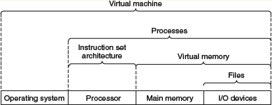

# 1. 

# 2. 

 Unsigned encodings

Two's-complement encodings

 Floating-point encodings

Floating-point arithmetic is not associative due to the finite precision of the representation.

# 参考文献

https://www.zhihu.com/question/29893650

https://www.zhihu.com/question/20402534

http://www.cs.cmu.edu/~213/index.html

http://csapp.cs.cmu.edu/3e/curriculum.html