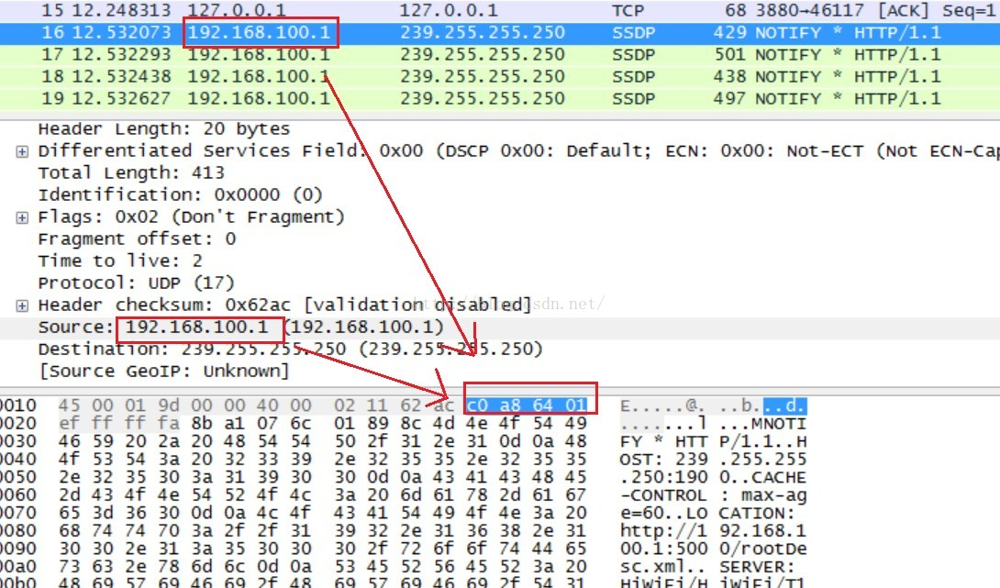
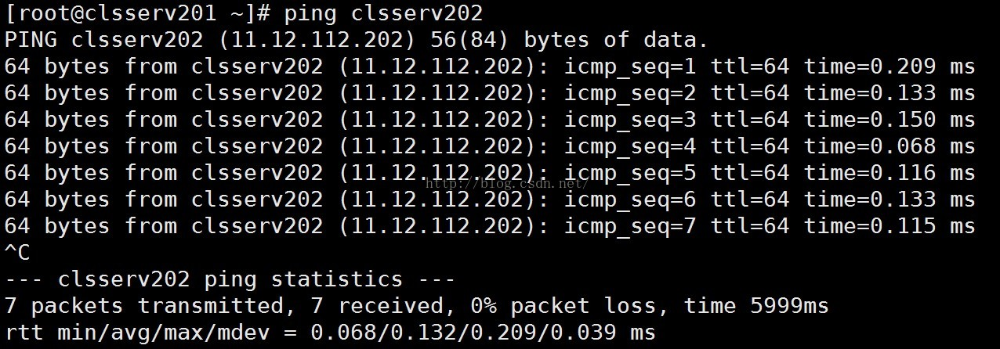
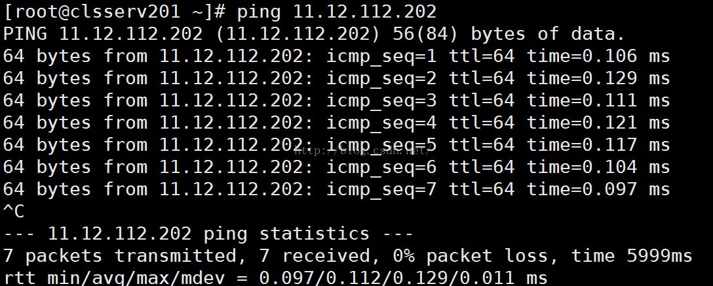
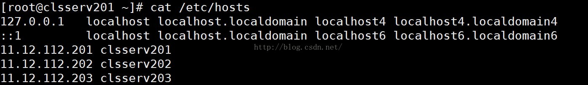

在网络通信中，每个IP可唯一标识一台主机，在多网卡或者路由器等的情况下，每个主机可以有多个IP，通过哪个IP都可以找到该主机；但是IP地址是一个32位的数字，为了便于记忆，我们通常把按每字节划分，然后用10进制表示出来，即我们通常说的点分十进制（在IPV6的中采用的是冒号分十六进制）。如下图的网络抓包，可以看到一个我们常见的IP地址：192.168.100.1的实际存在形式用16进制就是：c0 a8 64 01 ，用二进制表示就是：

11000000 10101000 01100100 00000001

备注：

| 十进制 | 十六进制 | 二进制   |
| ------ | -------- | -------- |
| 192    | c0       | 11000000 |
| 168    | a8       | 10101000 |
| 100    | 64       | 01100100 |
| 1      | 1        | 00000001 |

 

可以看到IP地址的可读性非常差，虽然用点分十进制表示之后，可读性有所提升，但是依然难以记忆，尤其是对于数字不敏感的老外，因此他们就想用易读的单词来代替这些纯数字，于是就诞生了主机名和域名。

在局域网中，每台主机都有一个主机名，可以使用英文字母或者单词组成的主机名来代替该主机的IP地址（这里假设主机只有一个网卡一个IP），这样就非常方便记忆，例如我们局域网中有一个主机名为：clsserv202的服务器，它的IP地址是：11.12.112.202，我们在使用IP地址11.12.112.202的地方使用clsserv202来代替它，例如我们要ping该主机，则可以执行命令：

ping clsserv202

该命令的执行情况如下图所示：

Ping 主机名

 

跟ping ip地址是一样的效果，如下图：

Ping ip地址

 

**这内部发生了什么事情呢？**

在实际开发过程中，我们通常使用gethostbyname和gethostbyaddr这两个系统函数，其中gethostbyname表示通过主机名来查询IP地址，即传入一个主机名或域名，它就给你返回一个IP地址；gethostbyaddr表示通过IP地址来查询主机名；

在ping命令的源码中可以看到它就调用了gethostbyname函数将主机名转换成IP地址，然后才进行的ping操作。

**Hosts文件**

在linux系统中有个hosts文件来记录本机所在局域网中的主机的IP地址和对应的主机名，如下图所示：

 

可以看到host文件由一行行的IP和主机名的对应关系组成，其中每行的开始是一个IP地址，紧接着IP地址（隔着空格）的就是该IP对应的主机名；

优先级 ： dns缓存 > hosts > dns服务

 

如果局域网内的所有主机都想使用主机名来代替IP进行通信，那么要求该局域网中每个主机上的hosts文件都要把本局域网中的所有主机的主机名和IP的对应关系都存起来。当局域网内的主机非常多的时候，维护起来就非常麻烦，例如IP有变更的时候就需要挨个把所有的主机的hosts文件都更新一遍。

那么有没有更好的办法来解决这个问题呢？方法就是通过搭建内网DNS服务来完成主机名和IP的映射；

域名

域名可以认为是主机在公网环境中的标识，在在公网下，对应一个唯一的IP，例如我们访问百度的主页：www.baidu.com

主机名和域名的区别

实质上，主机名的含义是机器本身的名字，域名是方面记录IP地址才做的一种IP映射；通过上述介绍可以看到，二者有共性：都能对应到一个唯一的IP上，从应用场景上可以这么简单理解二者的区别：

主机名用于局域网中；域名用于公网中，优先级低于hosts文件中内容。

 

来自 <https://blog.csdn.net/houjixin/article/details/52604941> 

 