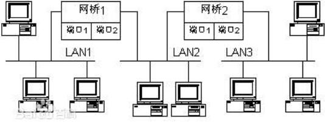
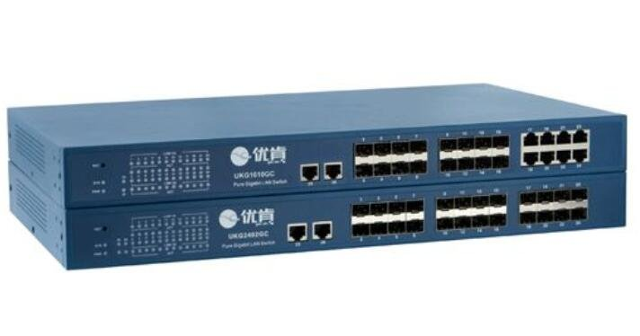

## [网络基础知识1：集线器，网桥，交换机](https://www.cnblogs.com/hyddd/archive/2009/01/18/NetWorking.html)

## 路由器和交换机的不同之处有哪些？https://www.zhihu.com/question/20465477

## 　　网桥概述

　　网桥（Bridge）是早期的两端口二层网络设备。网桥的两个端口分别有一条独立的交换信道，不是共享一条背板总线，可隔离冲突域。网桥比集线器（Hub）性能更好，集线器上各端口都是共享同一条背板总线的。后来，网桥被具有更多端口、同时也可隔离冲突域的交换机（Switch）所取代。

　　网桥（Bridge）像一个聪明的中继器。中继器从一个网络电缆里接收信号， 放大它们，将其送入下一个电缆。相比较而言，网桥对从关卡上传下来的信息更敏锐一些。网桥是一种对帧进行转发的技术，根据MAC分区块，可隔离碰撞。网桥将网络的多个网段在数据链路层连接起来。

　　网桥也叫桥接器，是连接两个局域网的一种存储/转发设备，它能将一个大的LAN分割为多个网段，或将两个以上的LAN互联为一个逻辑LAN，使LAN上的所有用户都可访问服务器。

## 　　交换机概述

　　交换机（Switch）意为“开关”是一种用于电（光）信号转发的网络设备。它可以为接入交换机的任意两个网络节点提供独享的电信号通路。最常见的交换机是以太网交换机。其他常见的还有电话语音交换机、光纤交换机等。

　　交换是按照通信两端传输信息的需要，用人工或设备自动完成的方法，把要传输的信息送到符合要求的相应路由上的技术的统称。交换机根据工作位置的不同，可以分为广域网交换机和局域网交换机。广域的交换机就是一种在通信系统中完成信息交换功能的设备，它应用在数据链路层。交换机有多个端口，每个端口都具有桥接功能，可以连接一个局域网或一台高性能服务器或工作站。实际上，交换机有时被称为多端口网桥。

　　网络交换机，是一个扩大网络的器材，能为子网络中提供更多的连接端口，以便连接更多的计算机。随着通信业的发展以及国民经济信息化的推进，网络交换机市场呈稳步上升态势。它具有性价比高、高度灵活、相对简单和易于实现等特点。以太网技术已成为当今最重要的一种局域网组网技术，网络交换机也就成为了最普及的交换机。

## 　　网桥和交换机的区别

　　局域网交换机的基本功能与网桥一样，具有帧转发、帧过滤和生成树算法功能。但是，交换机与网桥相比还是存在以下不同：

　　1、交换机工作时，实际上允许许多组端口间的通道同时工作。所以，交换机的功能体现出不仅仅是一个网桥的功能，而是多个网桥功能的集合。即网桥一般分有两个端口，而交换机具有高密度的端口。

　　2、分段能力的区别

　　由于交换机能够支持多个端口，因此可以把网络系统划分成为更多的物理网段，这样使得整个网络系统具有更高的带宽。而网桥仅仅支持两个端口，所以，网桥划分的物理网段是相当有限的。

　　3、传输速率的区别

　　交换机与网桥数据信息的传输速率相比，交换机要快于网桥。

　　4、数据帧转发方式的区别

　　网桥在发送数据帧前，通常要接收到完整的数据帧并执行帧检测序列FCS后，才开始转发该数据帧。交换机具有存储转发和直接转发两种帧转发方式。直接转发方式在发送数据以前，不需要在接收完整个数据帧和经过32bit循环冗余校验码CRC的计算检查后的等待时间。