# http代理

主要用於存取網頁，可過濾網頁內容和快取網頁。若在瀏覽器上設置 HTTP 代理伺服器，瀏覽器上所有的流量都會透過這個代理伺服器進行路由。

## HTTP 代理原理及实现（一）

参考： https://imququ.com/post/web-proxy.html

Web 代理是一种存在于网络中间的实体，提供各式各样的功能。现代网络系统中，Web 代理无处不在。我之前有关 HTTP 的博文中，多次提到了代理对 HTTP 请求及响应的影响。今天这篇文章，我打算谈谈 HTTP 代理本身的一些原理，以及如何用 Node.js 快速实现代理。

HTTP 代理存在两种形式，分别简单介绍如下：

第一种是 [RFC 7230 - HTTP/1.1: Message Syntax and Routing](http://tools.ietf.org/html/rfc7230)（即修订后的 RFC 2616，HTTP/1.1 协议的第一部分）描述的普通代理。这种代理扮演的是「中间人」角色，对于连接到它的客户端来说，它是服务端；对于要连接的服务端来说，它是客户端。它就负责在两端之间来回传送 HTTP 报文。

第二种是 [Tunneling TCP based protocols through Web proxy servers](https://tools.ietf.org/html/draft-luotonen-web-proxy-tunneling-01)（通过 Web 代理服务器用隧道方式传输基于 TCP 的协议）描述的隧道代理。它通过 HTTP 协议正文部分（Body）完成通讯，以 HTTP 的方式实现任意基于 TCP 的应用层协议代理。这种代理使用 HTTP 的 CONNECT 方法建立连接，但 CONNECT 最开始并不是 RFC 2616 - HTTP/1.1 的一部分，直到 2014 年发布的 HTTP/1.1 修订版中，才增加了对 CONNECT 及隧道代理的描述，详见 [RFC 7231 - HTTP/1.1: Semantics and Content](https://tools.ietf.org/html/rfc7231#section-4.3.6)。实际上这种代理早就被广泛实现。

本文描述的第一种代理，对应《HTTP 权威指南》一书中第六章「代理」；第二种代理，对应第八章「集成点：网关、隧道及中继」中的 8.5 小节「隧道」。

### 普通代理

第一种 Web 代理原理特别简单：

> HTTP 客户端向代理发送请求报文，代理服务器需要正确地处理请求和连接（例如正确处理 Connection: keep-alive），同时向服务器发送请求，并将收到的响应转发给客户端。

下面这张图片来自于《HTTP 权威指南》，直观地展示了上述行为：

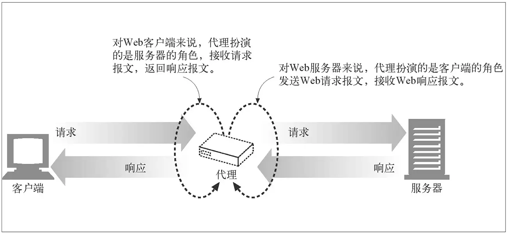

假如我通过代理访问 A 网站，对于 A 来说，它会把代理当做客户端，完全察觉不到真正客户端的存在，这实现了隐藏客户端 IP 的目的。当然代理也可以修改 HTTP 请求头部，通过 `X-Forwarded-IP` 这样的自定义头部告诉服务端真正的客户端 IP。但服务器无法验证这个自定义头部真的是由代理添加，还是客户端修改了请求头，所以从 HTTP 头部字段获取 IP 时，需要格外小心。这部分内容可以参考我之前的《[HTTP 请求头中的 X-Forwarded-For](https://imququ.com/post/x-forwarded-for-header-in-http.html)》这篇文章。

给浏览器显式的指定代理，需要手动修改浏览器或操作系统相关设置，或者指定 PAC（Proxy Auto-Configuration，自动配置代理）文件自动设置，还有些浏览器支持 WPAD（Web Proxy Autodiscovery Protocol，Web 代理自动发现协议）。显式指定浏览器代理这种方式一般称之为正向代理，浏览器启用正向代理后，会对 HTTP 请求报文做一些修改，来规避老旧代理服务器的一些问题，这部分内容可以参考我之前的《[Http 请求头中的 Proxy-Connection](https://imququ.com/post/the-proxy-connection-header-in-http-request.html)》这篇文章。

还有一种情况是访问 A 网站时，实际上访问的是代理，代理收到请求报文后，再向真正提供服务的服务器发起请求，并将响应转发给浏览器。这种情况一般被称之为反向代理，它可以用来隐藏服务器 IP 及端口。一般使用反向代理后，需要通过修改 DNS 让域名解析到代理服务器 IP，这时浏览器无法察觉到真正服务器的存在，当然也就不需要修改配置了。反向代理是 Web 系统最为常见的一种部署方式，例如本博客就是使用 Nginx 的 `proxy_pass` 功能将浏览器请求转发到背后的 Node.js 服务。

了解完第一种代理的基本原理后，我们用 Node.js 实现一下它。只包含核心逻辑的代码如下：

```js
JSvar http = require('http');
var net = require('net');
var url = require('url');

function request(cReq, cRes) {
    var u = url.parse(cReq.url);

    var options = {
        hostname : u.hostname, 
        port     : u.port || 80,
        path     : u.path,       
        method     : cReq.method,
        headers     : cReq.headers
    };

    var pReq = http.request(options, function(pRes) {
        cRes.writeHead(pRes.statusCode, pRes.headers);
        pRes.pipe(cRes);
    }).on('error', function(e) {
        cRes.end();
    });

    cReq.pipe(pReq);
}

http.createServer().on('request', request).listen(8888, '0.0.0.0');
```

以上代码运行后，会在本地 `8888` 端口开启 HTTP 代理服务，这个服务从请求报文中解析出请求 URL 和其他必要参数，新建到服务端的请求，并把代理收到的请求转发给新建的请求，最后再把服务端响应返回给浏览器。修改浏览器的 HTTP 代理为 `127.0.0.1:8888` 后再访问 HTTP 网站，代理可以正常工作。

但是，使用我们这个代理服务后，HTTPS 网站完全无法访问，这是为什么呢？答案很简单，这个代理提供的是 HTTP 服务，根本没办法承载 HTTPS 服务。那么是否把这个代理改为 HTTPS 就可以了呢？显然也不可以，因为这种代理的本质是中间人，而 HTTPS 网站的证书认证机制是中间人劫持的克星。普通的 HTTPS 服务中，服务端不验证客户端的证书，中间人可以作为客户端与服务端成功完成 TLS 握手；但是中间人没有证书私钥，无论如何也无法伪造成服务端跟客户端建立 TLS 连接。当然如果你拥有证书私钥，代理证书对应的 HTTPS 网站当然就没问题了。

HTTP 抓包神器 Fiddler 的工作原理也是在本地开启 HTTP 代理服务，通过让浏览器流量走这个代理，从而实现显示和修改 HTTP 包的功能。如果要让 Fiddler 解密 HTTPS 包的内容，需要先将它自带的根证书导入到系统受信任的根证书列表中。一旦完成这一步，浏览器就会信任 Fiddler 后续的「伪造证书」，从而在浏览器和 Fiddler、Fiddler 和服务端之间都能成功建立 TLS 连接。而对于 Fiddler 这个节点来说，两端的 TLS 流量都是可以解密的。

如果我们不导入根证书，Fiddler 的 HTTP 代理还能代理 HTTPS 流量么？实践证明，不导入根证书，Fiddler 只是无法解密 HTTPS 流量，HTTPS 网站还是可以正常访问。这是如何做到的，这些 HTTPS 流量是否安全呢？这些问题将在下一节揭晓。

### 隧道代理

第二种 Web 代理的原理也很简单：

> HTTP 客户端通过 CONNECT 方法请求隧道代理创建一条到达任意目的服务器和端口的 TCP 连接，并对客户端和服务器之间的后继数据进行盲转发。

下面这张图片同样来自于《HTTP 权威指南》，直观地展示了上述行为：


假如我通过代理访问 A 网站，浏览器首先通过 CONNECT 请求，让代理创建一条到 A 网站的 TCP 连接；一旦 TCP 连接建好，代理无脑转发后续流量即可。所以这种代理，理论上适用于任意基于 TCP 的应用层协议，HTTPS 网站使用的 TLS 协议当然也可以。这也是这种代理为什么被称为隧道的原因。对于 HTTPS 来说，客户端透过代理直接跟服务端进行 TLS 握手协商密钥，所以依然是安全的，下图中的抓包信息显示了这种场景：

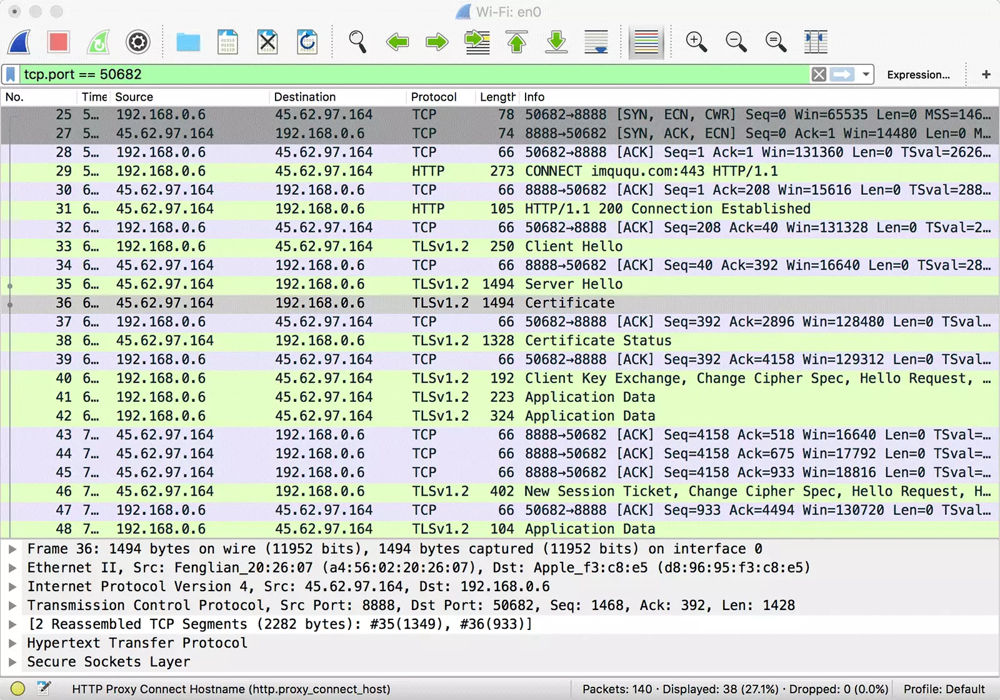

可以看到，浏览器与代理进行 TCP 握手之后，发起了 CONNECT 请求，报文起始行如下：

```
CONNECT imququ.com:443 HTTP/1.1
```

对于 CONNECT 请求来说，只是用来让代理创建 TCP 连接，所以只需要提供服务器域名及端口即可，并不需要具体的资源路径。代理收到这样的请求后，需要与服务端建立 TCP 连接，并响应给浏览器这样一个 HTTP 报文：

```
HTTP/1.1 200 Connection Established
```

浏览器收到了这个响应报文，就可以认为到服务端的 TCP 连接已经打通，后续直接往这个 TCP 连接写协议数据即可。通过 Wireshark 的 Follow TCP Steam 功能，可以清楚地看到浏览器和代理之间的数据传递：

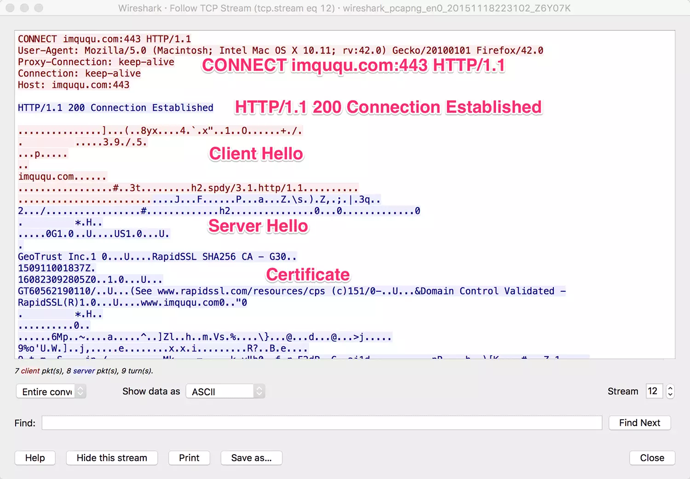

可以看到，浏览器建立到服务端 TCP 连接产生的 HTTP 往返，完全是明文，这也是为什么 CONNECT 请求只需要提供域名和端口：如果发送了完整 URL、Cookie 等信息，会被中间人一览无余，降低了 HTTPS 的安全性。HTTP 代理承载的 HTTPS 流量，应用数据要等到 TLS 握手成功之后通过 Application Data 协议传输，中间节点无法得知用于流量加密的 master-secret，无法解密数据。而 CONNECT 暴露的域名和端口，对于普通的 HTTPS 请求来说，中间人一样可以拿到（IP 和端口很容易拿到，请求的域名可以通过 DNS Query 或者 TLS Client Hello 中的 Server Name Indication 拿到），所以这种方式并没有增加不安全性。

了解完原理后，再用 Node.js 实现一个支持 CONNECT 的代理也很简单。核心代码如下：

```js
JSvar http = require('http');
var net = require('net');
var url = require('url');

function connect(cReq, cSock) {
    var u = url.parse('http://' + cReq.url);

    var pSock = net.connect(u.port, u.hostname, function() {
        cSock.write('HTTP/1.1 200 Connection Established\r\n\r\n');
        pSock.pipe(cSock);
    }).on('error', function(e) {
        cSock.end();
    });

    cSock.pipe(pSock);
}

http.createServer().on('connect', connect).listen(8888, '0.0.0.0');
```

以上代码运行后，会在本地 `8888` 端口开启 HTTP 代理服务，这个服务从 CONNECT 请求报文中解析出域名和端口，创建到服务端的 TCP 连接，并和 CONNECT 请求中的 TCP 连接串起来，最后再响应一个 Connection Established 响应。修改浏览器的 HTTP 代理为 `127.0.0.1:8888` 后再访问 HTTPS 网站，代理可以正常工作。

最后，将两种代理的实现代码合二为一，就可以得到全功能的 Proxy 程序了，全部代码在 50 行以内（当然异常什么的基本没考虑，这是我博客代码的一贯风格）：

```js
JSvar http = require('http');
var net = require('net');
var url = require('url');

function request(cReq, cRes) {
    var u = url.parse(cReq.url);

    var options = {
        hostname : u.hostname, 
        port     : u.port || 80,
        path     : u.path,       
        method     : cReq.method,
        headers     : cReq.headers
    };

    var pReq = http.request(options, function(pRes) {
        cRes.writeHead(pRes.statusCode, pRes.headers);
        pRes.pipe(cRes);
    }).on('error', function(e) {
        cRes.end();
    });

    cReq.pipe(pReq);
}

function connect(cReq, cSock) {
    var u = url.parse('http://' + cReq.url);

    var pSock = net.connect(u.port, u.hostname, function() {
        cSock.write('HTTP/1.1 200 Connection Established\r\n\r\n');
        pSock.pipe(cSock);
    }).on('error', function(e) {
        cSock.end();
    });

    cSock.pipe(pSock);
}

http.createServer()
    .on('request', request)
    .on('connect', connect)
    .listen(8888, '0.0.0.0');
```

需要注意的是，大部分浏览器显式配置了代理之后，只会让 HTTPS 网站走隧道代理，这是因为建立隧道需要耗费一次往返，能不用就尽量不用。但这并不代表 HTTP 请求不能走隧道代理，我们用 Node.js 写段程序验证下（先运行前面的代理服务）：

```js
JSvar http = require('http');

var options = {
    hostname : '127.0.0.1',
    port     : 8888,
    path     : 'imququ.com:80',
    method     : 'CONNECT'
};

var req = http.request(options);

req.on('connect', function(res, socket) {
    socket.write('GET / HTTP/1.1\r\n' +
                 'Host: imququ.com\r\n' +
                 'Connection: Close\r\n' +
                 '\r\n');

    socket.on('data', function(chunk) {
        console.log(chunk.toString());
    });

    socket.on('end', function() {
        console.log('socket end.');
    });
});

req.end();
```

这段代码运行完，结果如下：

```http
HTTP/1.1 301 Moved Permanently
Server: nginx
Date: Thu, 19 Nov 2015 15:57:47 GMT
Content-Type: text/html
Content-Length: 178
Connection: close
Location: https://imququ.com/

<html>
<head><title>301 Moved Permanently</title></head>
<body bgcolor="white">
<center><h1>301 Moved Permanently</h1></center>
<hr><center>nginx</center>
</body>
</html>

socket end.
```

可以看到，通过 CONNECT 让代理打开到目标服务器的 TCP 连接，用来承载 HTTP 流量也是完全没问题的。

最后，HTTP 的认证机制可以跟代理配合使用，使得必须输入正确的用户名和密码才能使用代理，这部分内容比较简单，这里略过。在本文第二部分，我打算谈谈如何把今天实现的代理改造为 HTTPS 代理，也就是如何让浏览器与代理之间的流量走 HTTPS 安全机制。注：已经写完了，[点这里查看](https://imququ.com/post/web-proxy-2.html)。

## HTTP 代理原理及实现（二）

在上篇《[HTTP 代理原理及实现（一）](https://imququ.com/post/web-proxy.html)》里，我介绍了 HTTP 代理的两种形式，并用 Node.js 实现了一个可用的普通 / 隧道代理。普通代理可以用来承载 HTTP 流量；隧道代理可以用来承载任何 TCP 流量，包括 HTTP 和 HTTPS。今天这篇文章介绍剩余部分：如何将浏览器与代理之间的流量传输升级为 HTTPS。

上篇文章中实现的代理，是一个标准的 HTTP 服务，针对浏览器的普通请求和 `CONNECT` 请求，进行不同的处理。Node.js 为创建 HTTP 或 HTTPS Server 提供了高度一致的接口，要将 HTTP 服务升级为 HTTPS 特别方便，只有一点点准备工作要做。

我们知道 TLS 有三大功能：内容加密、身份认证和数据完整性。其中内容加密依赖于密钥协商机制；数据完整性依赖于 MAC（Message authentication code）校验机制；而身份认证则依赖于证书认证机制。一般操作系统或浏览器会维护一个受信任根证书列表，包含在列表之中的证书，或者由列表中的证书签发的证书都会被客户端信任。

提供 HTTPS 服务的证书可以自己生成，然后手动加入到系统根证书列表中。但是对外提供服务的 HTTPS 网站，不可能要求每个用户都手动导入你的证书，所以更常见的做法是向 CA（Certificate Authority，证书颁发机构）申请。根据证书的不同级别，CA 会进行不同级别的验证，验证通过后 CA 会用他们的证书签发网站证书，这个过程通常是收费的（有免费的证书，最近免费的 [Let's Encrypt](https://letsencrypt.org/) 也很火，这里不多介绍）。由于 CA 使用的证书都是由广泛内置在各系统中的根证书签发，所以从 CA 获得的网站证书会被绝大部分客户端信任。

通过 CA 申请证书很简单，本文为了方便演示，采用自己签发证书的偷懒办法。现在广泛使用的证书是 x509.v3 格式，使用以下命令可以创建：

```bash
openssl genrsa -out private.pem 2048
openssl req -new -x509 -key private.pem -out public.crt -days 99999
```

第二行命令运行后，需要填写一些证书信息。需要注意的是 `Common Name` 一定要填写后续提供 HTTPS 服务的域名或 IP。例如你打算在本地测试，`Common Name` 可以填写 `127.0.0.1`。证书创建好之后，再将 `public.crt` 添加到系统受信任根证书列表中。为了确保添加成功，可以用浏览器验证一下：

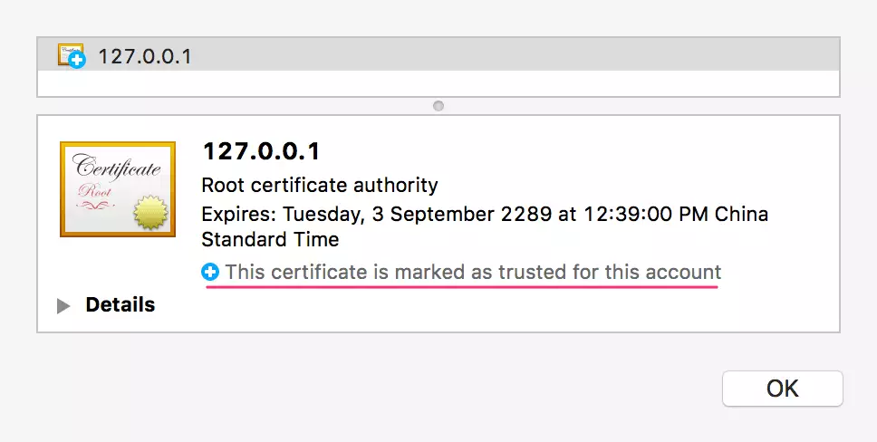

接着，可以改造之前的 Node.js 代码了，需要改动的地方不多：

```js
JSvar http = require('http');
var https = require('https');
var fs = require('fs');
var net = require('net');
var url = require('url');

function request(cReq, cRes) {
    var u = url.parse(cReq.url);

    var options = {
        hostname : u.hostname, 
        port     : u.port || 80,
        path     : u.path,       
        method     : cReq.method,
        headers     : cReq.headers
    };

    var pReq = http.request(options, function(pRes) {
        cRes.writeHead(pRes.statusCode, pRes.headers);
        pRes.pipe(cRes);
    }).on('error', function(e) {
        cRes.end();
    });

    cReq.pipe(pReq);
}

function connect(cReq, cSock) {
    var u = url.parse('http://' + cReq.url);

    var pSock = net.connect(u.port, u.hostname, function() {
        cSock.write('HTTP/1.1 200 Connection Established\r\n\r\n');
        pSock.pipe(cSock);
    }).on('error', function(e) {
        cSock.end();
    });

    cSock.pipe(pSock);
}

var options = {
    key: fs.readFileSync('./private.pem'),
    cert: fs.readFileSync('./public.crt')
};

https.createServer(options)
    .on('request', request)
    .on('connect', connect)
    .listen(8888, '0.0.0.0');
```

可以看到，除了将 `http.createServer` 换成 `https.createServer`，增加证书相关配置之外，这段代码没有任何改变。这也是引入 TLS 层的妙处，应用层不需要任何改动，就能获得诸多安全特性。

运行服务后，只需要将浏览器的代理设置为 `HTTPS 127.0.0.1:8888` 即可，功能照旧。这样改造，只是将浏览器到代理之间的流量升级为了 HTTPS，代理自身逻辑、与服务端的通讯方式，都没有任何变化。

最后，还是写段 Node.js 代码验证下这个 HTTPS 代理服务：

```js
JSvar https = require('https');

var options = {
    hostname : '127.0.0.1',
    port     : 8888,
    path     : 'imququ.com:80',
    method     : 'CONNECT'
};

//禁用证书验证，不然自签名的证书无法建立 TLS 连接
process.env.NODE_TLS_REJECT_UNAUTHORIZED = "0";

var req = https.request(options);

req.on('connect', function(res, socket) {
    socket.write('GET / HTTP/1.1\r\n' +
                 'Host: imququ.com\r\n' +
                 'Connection: Close\r\n' +
                 '\r\n');

    socket.on('data', function(chunk) {
        console.log(chunk.toString());
    });

    socket.on('end', function() {
        console.log('socket end.');
    });
});

req.end();
```

这段代码和上篇文章最后那段的区别只是 `http.request` 换成了 `https.request`，运行结果完全一样，这里就不贴了。本文所有代码可以从这个仓库获得：[proxy-demo](https://github.com/qgy18/proxy-demo)。

本文就写到这里，大家有什么问题欢迎给我评论留言。

本文链接：https://imququ.com/post/web-proxy-2.html，[参与评论 »](https://imququ.com/post/web-proxy-2.html#comments)


## 工具

ssr

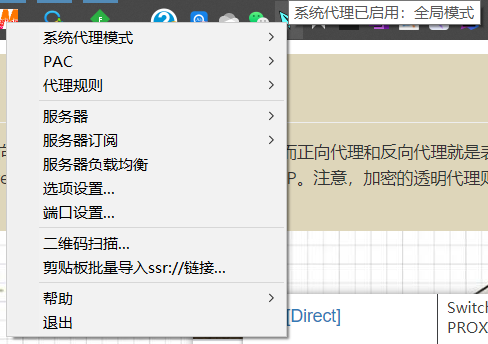

SwitchyOmega


fiddler

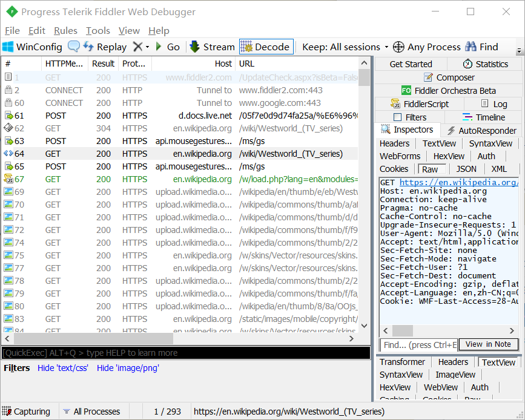

## fiddler https 抓包原理

客户端(浏览器)与服务器之间通过建立TCP连接以HTTP协议进行通信，浏览器默认通过自己发送HTTP请求到服务器。而Fiddler是c#开发的http代理服务器，fiddler工作于[七层](https://www.cnblogs.com/sunsky303/p/10647255.html)中的**应用层**，能够捕获到通过的http(s)请求。fiddler启动后会自动将代理服务器设置为本机，端口8888。 启动之后，会看到： 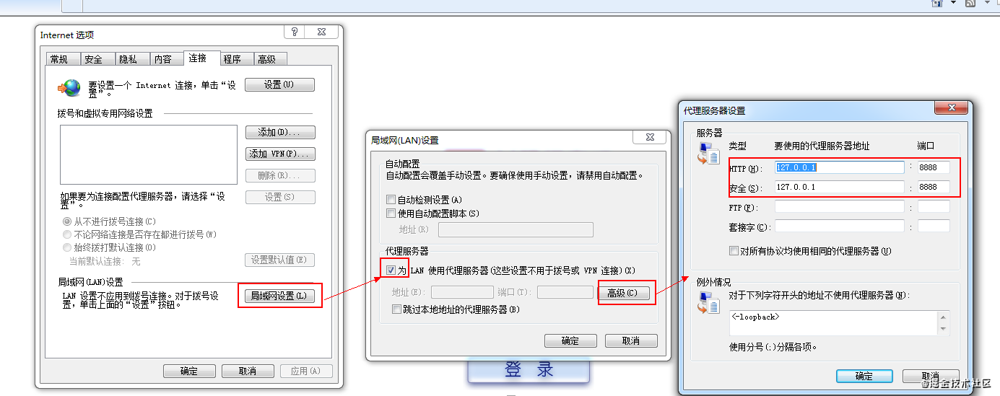

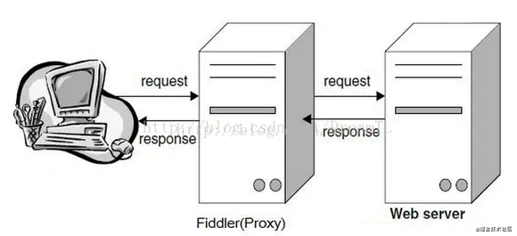

抓包其中涉及三个角色： 客户端 、 代理、 目标服务器

原本正常访问网页或App路径是：

- 客户端 ---> 目标服务器
- 抓包，其实就加入了一个代理，即：客户端 ---> 媒人（代理）-->目标服务器
- 只有这三者产生一定的联系，才能进行拦截/抓取一些东西，客户端先访问媒人，媒人把客户端的信息记录下来，媒人再去联系目标服务器，进而返回给客户端。

Fiddler 抓取https 报文过程： 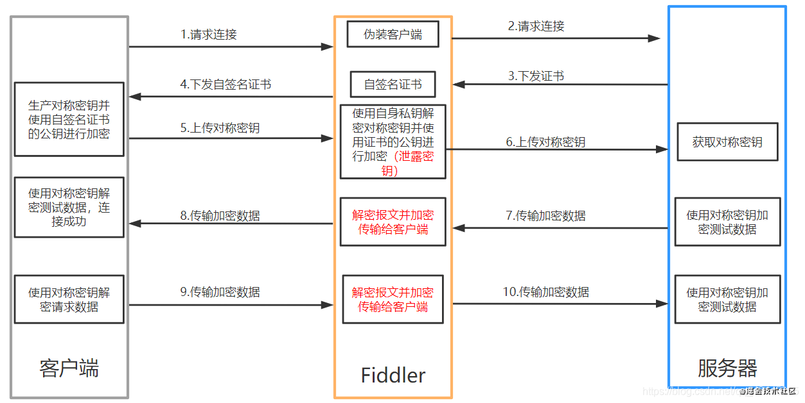

详细过程解析：

```
+ 客户端请求建立HTTPS连接，发送客户端支持的加密协议和版本列表等信息给服务器；
+ Fiddler接受客户端的请求并伪装成客户端发送相同的请求给Web服务器；
+ Web服务器收到Fiddler的请求后，从请求中筛选出合适的加密协议并返回服务器CA证书，证书中包含公钥信息；
+ Fiddler收到服务器响应之后，保存服务器证书并自签名一个证书，伪装成服务器将该证书下发给客户端；
+ 客户端验证证书的合法性（Fiddler能否抓取到HTTPS报文关键就看这一步了）（证书都是由CA组织下认可的根证书Root签发的）；
+ 客户端生产对称密钥并使用自签名证书的公钥进行加密，发送给服务器；
+ Fiddler拦截客户端的请求之后，使用私钥解密该报文，获取对称密钥并使用CA证书的公钥加密，再发送给Web服务器；
+ Web服务器接收到客户端加密后的对称密钥，采用私钥解密，并使用对称密钥解密测试数据传给客户端；
+ Fiddler使用前面获取的对称密钥解密报文；
+ 客户端验证数据无误后，HTTPS连接建立完成，此时客户端开始向服务器发送使用对称密钥加密的业务数据；
+ Fiddler使用前面获取的对称密钥解密客户端发送的数据并重新加密转发给客户端。
复制代码
```

https基本原理，是用非对称密钥协商出对称密钥，再用对称密钥来加密业务数据。

### 简述密钥协商、握手步骤。

- 客户端请求连接服务器，发送客户端支持的加密协议和版本列表等信息给服务器
- 服务端确认加密方法，并发送CA证书（证书中包含公钥）给客户端
- 客户端验证证书的可靠性（是否有效？是否合法？），并从CA证书中取出公钥，然后生成一个随机密钥K, 并用公钥加密得到K'发送给服务端。
- 服务端收到 k' 后用自己的私钥解密得到 k。
- 此时双方都得到了密钥 k，接下来就用密钥k数据传输，协商完成。

### 软件下载：

[Fiddler官方下载地址](https://www.telerik.com/download/fiddler)：（Fiddler安装包 → FiddlerSetup.exe）

[Willow插件官方下载地址](https://github.com/QzoneTouch/commonWidget/releases)：（Willow插件安装包 → WillowSetup-1.5.2.zip）

作者：昭光
链接：https://juejin.cn/post/6902235732304527374
来源：掘金
著作权归作者所有。商业转载请联系作者获得授权，非商业转载请注明出处。

# 代理分类

### HTTP 代理按匿名功能分类(是否具有隐藏 IP 的功能)

- 非匿名代理：不具有匿名功能。
- 匿名代理。使用此种代理时，虽然被访问的网站不能知道你的 IP 地址，但仍然可 以知道你在使用代理，有些侦测 IP 的网页也仍然可以查到你的 IP。
- 高度匿名代理：使用此种代理时，被访问的网站不知道你的 IP 地址，也不知道你在使用代理进行访问。此种代理的隐藏 IP 地址的功能最强。

### 按请求信息的安全性分类

- 全匿名代理：不改变你的 request fields（报文），使服务器端看来就像有个真正的客户浏览器在访问它。当然，你的真实 IP 是隐藏起来的。服务器的网管不会认为你使用了代理。
- 普通匿名代理：能隐藏你的真实 IP，但会更改你的 request fields，有可能会被认为使用了代理，但仅仅是可能，一般说来是没问题的。不过不要受它的名字的误导， 其安全性可能比全匿名代理更高，有的代理会剥离你的部分信息（就好比防火墙的stealth mode），使服务器端探测不到你的操作系统版本和浏览器版本。
- elite 代理：匿名隐藏性更高，可隐藏系统及浏览器资料信息等。此种代理安全性特强。
- 透明代理（简单代理）：透明代理的意思是客户端根本不需要知道有代理服务器的存在，它改编你的 request fields（报文），并会传送真实 IP。注意，加密的透明代理则是属于匿名代理，意思是不用设置使用代理了，例如 Garden 2 程序。

### 从代理服务器划分：

- HTTP代理：能够代理客户机的HTTP访问，主要是代理浏览器访问网页，它的端口一般为80、8080；
- FTP代理：能够代理客户机上的FTP软件访问FTP服务器，它的端口一般为21；
- SOCKS代理：SOCKS代理与其他类型的代理不同，它只是简单地传递数据包，而并不关心是何种应用协议，既可以是HTTP请求，所以SOCKS代理服务器比其他类型的代理服务器速度要快得多。
- SOCKS代理又分为SOCKS4和SOCKS5，二者不同的是SOCKS4代理只支持TCP协议（即传输控制协议），而SOCKS5代理则既支持TCP协议又支持UDP协议（即用户数据包协议），还支持各种身份验证机制、服务器端域名解析等。
- SOCK4能做到的SOCKS5都可得到，但SOCKS5能够做到的SOCK4则不一定能做到，比如我们常用的聊天工具QQ在使用代理时就要求用SOCKS5代理，因为它需要使用UDP协议来传输数据。

##  正向代理

一般情况下，如果没有特别说明，代理技术默认说的是正向代理技术。关于正向代理的概念如下： 正 向代理(forward)是一个位于客户端【用户A】和原始服务器(origin server)【服务器B】之间的服务器【代理服务器Z】，为了从原始服务器取得内容，用户A向代理服务器Z发送一个请求并指定目标(服务器B)，然后代 理服务器Z向服务器B转交请求并将获得的内容返回给客户端。客户端必须要进行一些特别的设置才能使用正向代理。如下图

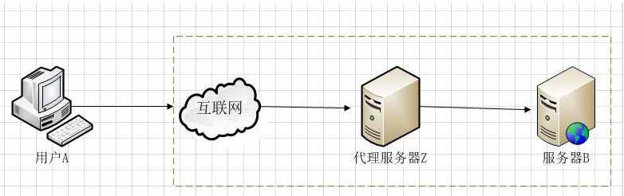

从上面的概念中，我们看出，文中所谓的正向代理就是代理服务器替代访问方【用户A】去访问目标服务器【服务器B】

这就是正向代理的意义所在。而为什么要用代理服务器去代替访问方【用户A】去访问服务器B呢？这就要从代理服务器使用的意义说起。

使用正向代理服务器作用主要有以下几点：

1. 访问本无法访问的服务器B，如下图1.2

   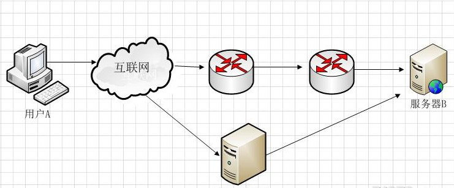

   我们抛除复杂的网络路由情节来看图1.2，假设图中路由器从左到右命名为R1,R2假 设最初用户A要访问服务器B需要经过R1和R2路由器这样一个路由节点，如果路由器R1或者路由器R2发生故障，那么就无法访问服务器B了。但是如果用户 A让代理服务器Z去代替自己访问服务器B，由于代理服务器Z没有在路由器R1或R2节点中，而是通过其它的路由节点访问服务器B，那么用户A就可以得到服 务器B的数据了。现实中的例子就是“翻墙”。不过自从VPN技术被广泛应用外，“翻墙”不但使用了传统的正向代理技术，有的还使用了VPN技术。

   

2. 加速访问服务器B

   这种说法目前不像以前那么流行了，主要是带宽流量的飞速发展。早期的正向代理中，很多人使用正向代理就是提速。还是如图1.2 假设用户A到服务器B，经过R1路由器和R2路由器，而R1到R2路由器的链路是一个低带宽链路。而用户A到代理服务器Z，从代理服务器Z到服务器B都是高带宽链路。那么很显然就可以加速访问服务器B了。

   

3. Cache作用
   Cache（缓存）技术和代理服务技术是紧密联系的（不光是正向代理，反向代理也使用了Cache（缓存）技术。还如上图所示，如果在用户A访问服务器B某数据J之前，已经有人通过代理服务器Z访问过服务器B上得数据J，那么代理服务器Z会把数据J保存一段时间，如果有人正好取该数据J，那么代理服务器Z不再访问服务器B，而把缓存的数据J直接发给用户A。这一技术在Cache中术语就叫Cache命中。如果有更多的像用户A的用户来访问代理服务器Z，那么这些用户都可以直接从代理服务器Z中取得数据J，而不用千里迢迢的去服务器B下载数据了。

   

4. 客户端访问授权
   这方面的内容现今使用的还是比较多的，例如一些公司采用ISA SERVER做为正向代理服务器来授权用户是否有权限访问互联网，挼下图1.3 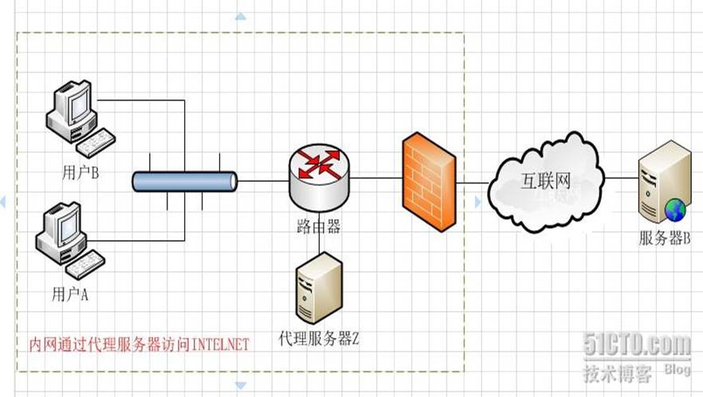

   图 1.3防火墙作为网关，用来过滤外网对其的访问。假设用户A和用户B都设置了代理服务器，用户A允许访问互联网，而用户B不允许访问互联网（这个在代理服 务器Z上做限制）这样用户A因为授权，可以通过代理服务器访问到服务器B，而用户B因为没有被代理服务器Z授权，所以访问服务器B时，数据包会被直接丢 弃。

5. 隐藏访问者的行踪

   如下图1.4 我们可以看出服务器B并不知道访问自己的实际是用户A，因为代理服务器Z代替用户A去直接与服务器B进行交互。如果代理服务器Z被用户A完全控制（或不完全控制），会惯以“肉鸡”术语称呼。 

   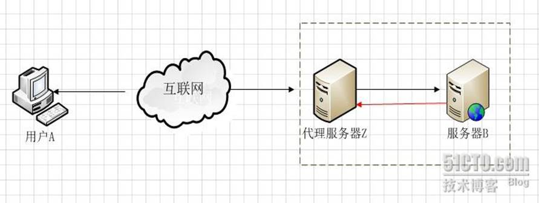

   我 们总结一下 正向代理是一个位于客户端和原始服务器(origin server)之间的服务器，为了从原始服务器取得内容，客户端向代理发送一个请求并指定目标(原始服务器)，然后代理向原始服务器转交请求并将获得的内 容返回给客户端。客户端必须设置正向代理服务器，当然前提是要知道正向代理服务器的IP地址，还有代理程序的端口。

## 反向代理

reverse proxy

反向代理正好与正向代理相反，对于客户端而言代理服务器就像是原始服务器，并且客户端不需要进行任何特别的设置。客户端向反向代理的命名空间(name-space)中的内容发送普通请求，接着反向代理将判断向何处(原始服务器)转交请求，并将获得的内容返回给客户端。 使用反向代理服务器的作用如下：

1. 保护和隐藏原始资源服务器如下图2.1 

   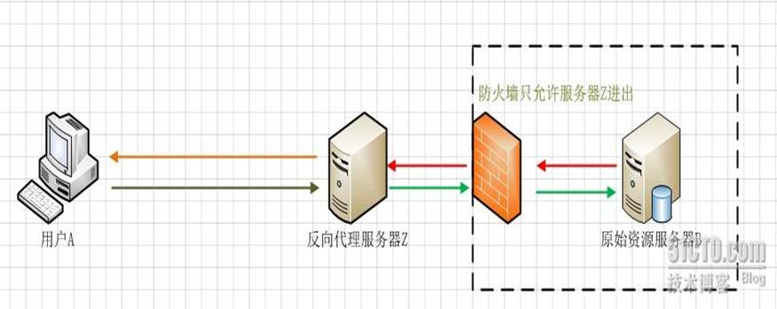

   用户A始终认为它访问的是原始服务器B而不是代理服务器Z，但实用际上反向代理服务器接受用户A的应答，从原始资源服务器B中取得用户A的需求资源，然后发送给用户A。由于防火墙的作用，只允许代理服务器Z访问原始资源服务器B。尽管在这个虚拟的环境下，防火墙和反向代理的共同作用保护了原始资源服务器B，但用户A并不知情。

2. 负载均衡如下图2.2 

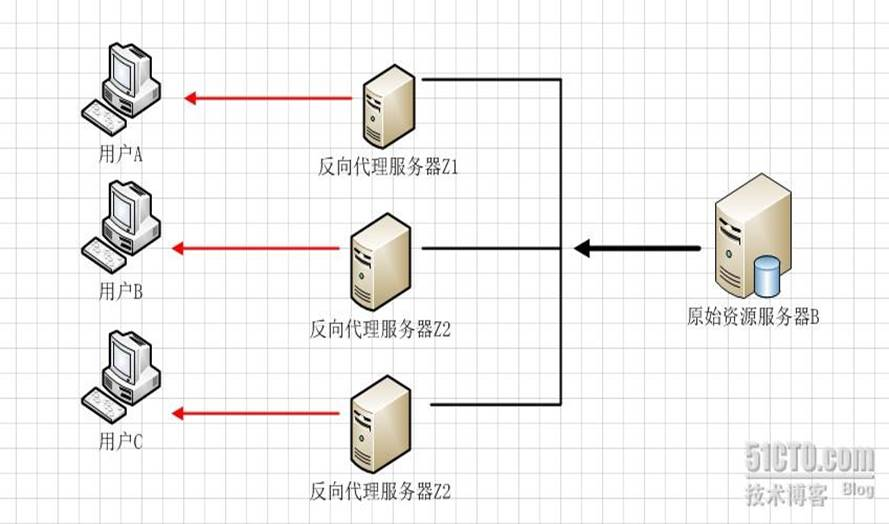

（图2.2）

当反向代理服务器不止一个的时候，我们甚至可以把它们做成集群，当更多的用户访问资源服务器B的时候，让不同的代理服务器Z（x）去应答不同的用户，然后发送不同用户需要的资源。

当然反向代理服务器像正向代理服务器一样拥有CACHE的作用，它可以缓存原始资源服务器B的资源，而不是每次都要向原始资源服务器B请求数据，特别是一些静态的数据，比如图片和文件，如果这些反向代理服务器能够做到和用户X来自同一个网络，那么用户X访问反向代理服务器X，就会得到很高质量的速度。这正是CDN技术的核心。如下图2.3


（图2.3）

我们并不是讲解CDN，所以去掉了CDN最关键的核心技术智能DNS。只是展示CDN技术实际上利用的正是反向代理原理这块。

 

反向代理结论与正向代理正好相反，对于客户端而言它就像是原始服务器，并且客户端不需要进行任何特别的设置。客户端向反向代理的命名空间(name-space)中的内容发送普通请求，接着反向代理将判断向何处(原始服务器)转交请求，并将获得的内容返回给客户端，就像这些内容原本就是它自己的一样。


 基本上，网上做正反向代理的程序很多，能做正向代理的软件大部分也可以做反向代理。开源软件中最流行的就是squid，既可以做正向代理，也有很多人用来做反向代理的前端服务器。另外MS ISA也可以用来在WINDOWS平台下做正向代理。反向代理中最主要的实践就是WEB服务，近些年来最火的就是Nginx了。网上有人说NGINX不能做正向代理，其实是不对的。NGINX也可以做正向代理，不过用的人比较少了。

 

## 透明代理

如果把正向代理、反向代理和透明代理按照人类血缘关系来划分的话。那么正向代理和透明代理是很明显堂亲关系，而正向代理和反向代理就是表亲关系了 。
   透明代理的意思是客户端根本不需要知道有代理服务器的存在，它改编你的request fields（报文），并会传送真实IP。注意，加密的透明代理则是属于匿名代理，意思是不用设置使用代理了。 透明代理实践的例子就是时下很多公司使用的行为管理软件。

這類型的網路代理通常用於監控使用者的網路活動，並阻止使用者存取特定的網站，而使用者通常不會知道這類網路代理的存在。通透式代理常用於公司網管或家庭的網路控管、餐廳或酒店用於對公共無線網路進行身份認證。公司或家庭也可以設置這種網路代理來節省頻寬。

如下图3.1

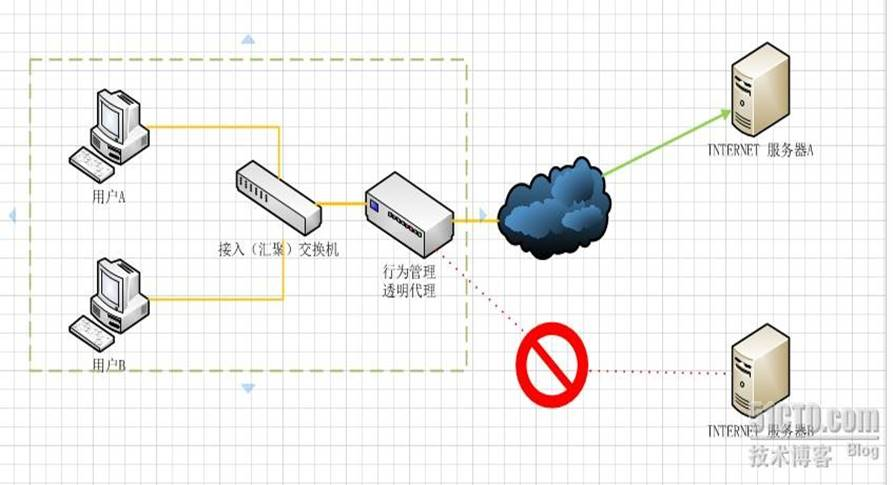

用户A和用户B并不知道行为管理设备充当透明代理行为，当用户A或用户B向服务器A或服务器B提交请求的时候，透明代理设备根据自身策略拦截并修改用户A或B的报文，并作为实际的请求方，向服务器A或B发送请求，当接收信息回传，透明代理再根据自身的设置把允许的报文发回至用户A或B，如上图，如果透明代理设置不允许访问服务器B，那么用户A或者用户B就不会得到服务器B的数据。

# socks代理

网址：https://zh.wikipedia.org/wiki/SOCKS 介绍，报文结构

## 介绍

SOCKS是"Sockets”的缩写，SOCKS是个电路级的底层网关，是DavidKoblas在1990年开发的，此后就一直作为Internet RFC标准的开放标准。采用SOCKS协议的代理服务器就是SOCKS服务器。**是一种通用的代理服务器。**

什么是socks代理：相应的，采用socks协议的代理服务器就是SOCKS服务器，是一种通用的代理服务器。Socks是个电路级的底层网关，是DavidKoblas在1990年开发的，此后就一直作为Internet RFC标准的开放标准。Socks 不要求应用程序遵循特定的操作系统平台，Socks 代理与应用层代理、 HTTP 层代理不同，**Socks 代理只是简单地传递数据包，而不必关心是何种应用协议（比如FTP、HTTP和NNTP请求）**。所以，Socks代理比其他应用层代理要快得多。它通常绑定在代理服务器的1080端口上。如果您在企业网或校园网上，需要透过防火墙或通过代理服务器访问 Internet就可能需要使用SOCKS。一般情况下，对于拨号上网用户都不需要使用它。注意，浏览网页时常用的代理服务器通常是专门的http代理，它和SOCKS是不同的。因此，您能浏览网页不等于 您一定可以通过SOCKS访问Internet。 常用的防火墙，或代理软件都支持SOCKS，

在实际应用中SOCKS代理可以用作为：电子邮件、新闻组软件、网络传呼ICQ、网络聊天MIRC和使用代理服务器上联众打游戏等等各种游戏应用软件当中。

**根据[OSI模型](https://zh.wikipedia.org/wiki/OSI模型)，SOCKS是[会话层](https://zh.wikipedia.org/wiki/会话层)的协议，位于[表示层](https://zh.wikipedia.org/wiki/表示层)与[传输层](https://zh.wikipedia.org/wiki/传输层)之间。**

## 与HTTP代理的对比[[编辑](https://zh.wikipedia.org/w/index.php?title=SOCKS&action=edit&section=1)]

*SOCKS*工作在比[HTTP代理](https://zh.wikipedia.org/wiki/代理服务器)更低的层次：SOCKS使用握手协议来通知代理软件其客户端试图进行的SOCKS连接，然后尽可能透明地进行操作，而常规代理可能会解释和重写报头（例如，使用另一种底层协议，例如[FTP](https://zh.wikipedia.org/wiki/文件传输协议)；然而，HTTP代理只是将HTTP请求转发到所需的HTTP服务器）。虽然HTTP代理有不同的使用模式，[HTTP CONNECT](https://zh.wikipedia.org/wiki/超文本传输协议)方法允许转发TCP连接；然而，SOCKS代理还可以转发[UDP](https://zh.wikipedia.org/wiki/用户数据报协议)流量（仅SOCKS5），而HTTP代理不能。HTTP代理通常更了解HTTP协议，执行更高层次的过滤（虽然通常只用于GET和POST方法，而不用于CONNECT方法）。

### SOCKS[[编辑](https://zh.wikipedia.org/w/index.php?title=SOCKS&action=edit&section=2)]

Bill希望通过互联网与Jane沟通，但他们的网络之间存在一个[防火墙](https://zh.wikipedia.org/wiki/防火墙)，Bill不能直接与Jane沟通。所以，Bill连接到他的网络上的SOCKS代理，告知它他想要与Jane创建连接；SOCKS代理打开一个能穿过防火墙的连接，并促进Bill和Jane之间的通信。

有关SOCKS协议的技术细节的更多信息，请参阅下面的部分。

### HTTP[[编辑](https://zh.wikipedia.org/w/index.php?title=SOCKS&action=edit&section=3)]

Bill希望从Jane的Web服务器下载一个网页。Bill不能直接连接到Jane的服务器，因为在他的网络上设置了防火墙。为了与该服务器通信，Bill连接到其网络的HTTP代理。他的网页浏览器与代理通信的方式与他直接连接Jane的服务器的方式相同；也就是说，网页浏览器会发送一个标准的HTTP请求头。HTTP代理连接到Jane的服务器，然后将Jane的服务器返回的任何数据传回Bill。[[1\]](https://zh.wikipedia.org/wiki/SOCKS#cite_note-2)

## HTTP、SOCK、FTP代理的区别

- 浏览器用HTTP或SOCK代理。
- 下载软件用HTTP或SOCK代理。
- 上传软件用FTP或SOCK代理。
- 其他的一般用SOCK代理。（聊天，MUD游戏等）

SOCKS代理使用范围很广，而SOCKS代理又分为SOCKS4和SOCKS5，当防火墙后的客户端要访问外部的服务器时，就跟SOCKS代理服务器连接。这个代理服务器控制客户端访问外网的资格，允许的话，就将客户端的请求发往外部的服务器。

其中SOCKS4只支持TCP协议；SOCKS5支持TCP和UDP协议，还支持身份验证、服务器端域名解释等。SOCKS4能干的SOCKS5都可以干，反过来就不行。我们常用的聊天软件（如QQ），用的是TCP和UDP协议的，所以QQ只能用SOCKS5的代理。

## Shadowsocks 和 SSR

Shadowsocks 是一種以 SOCKS5 代理開發的加密傳輸軟體，最初由中國開發者開發，[在中國大陸](https://nordvpn.com/zh-tw/blog/zhongguo-vpn/)境內被當作 SOCKS Proxy 翻牆，以使用被阻擋的網路服務。後來被中國當局要求停止維護，GitHub 上的程式碼也被刪除。但仍有許多 VPN 廠商採用這種技術。

Shadowsocks 最初只設計用來在中國大陸境內翻牆，安全性不夠完善。在 Shadowsocks 停止維護後，網路上出現了 Shadowsocks 程式碼的分支 ShadowsocksR（簡稱 SSR），在 Shadowsocks 的基礎上加上一些資料混淆方式，提供了部分的安全性。

目前 SSR 成了中國大陸常見的翻牆工具，主要是當作 SOCKS5 代理伺服器來突破防火長城 GFW 的限制。SSR 會混淆傳輸資料，藉此突破防火牆的封包偵測，來達到翻牆的目的，但安全性不高。

#  VPN

VPN 全名為「虛擬私人網路」（virtual private network），作用是在網際網路上的兩個端點之間建立通道，以存取另一端點內的網路資源，可以將其視為虛擬的企業內部專線。如同 Proxy 一樣，[VPN](https://nordvpn.com/zh-tw/download/) 也是透過遠端的伺服器進行路由，並能隱藏客戶端真實 IP 位址。

VPN 通常用於連接到私有網路，常見的應用是從外網透過 VPN 遠端連線到公司的內網，這樣就能在任何可以連上網際網路的地方，存取公司內部的網路資源，就像在公司內部使用區域網路一樣。另一種應用場景是公司在不同地點設有辦公室，則可以透過 VPN 將各地辦公室的內網連接在一起。

VPN 除了可以連接內網，有些國外網站或服務有地區限制，只有特定國家可以使用，此時可以透過 VPN 連線改變 IP 位址，使其認為使用者從不同地點上網，這樣可以規避這些服務的 IP 位址過濾機制，順利使用服務。此外，由於中國限制境內海外網站的存取，中國境內的民眾通常會使用 VPN 作為跳板，「翻牆」瀏覽境外網站。

VPN 可以對資料進行加密，確保連線過程的安全性，如同一個架設在網際網路的虛擬加密資料通道。這表示即使網路服務供應商（ISP）監控使用者的網路活動，但 ISP 只知道使用者連上 VPN，無法看到使用者存取的網站內容。這種加密技術可以確保客戶端不被監控和追蹤，提供了[線上隱私和安全](https://nordvpn.com/zh-tw/)的保障。

## VPN 和 Proxy 之間的主要區別

**辩证地看，有些功能取决于软件如何实现，当然代理和vpn所处的层不同**

- VPN 能進行[加密傳輸](https://nordvpn.com/zh-tw/features/next-generation-encryption/)，因此較為安全。VPN 可以保護使用者不受到追蹤、監控和攻擊。而一般 Proxy 不具加密功能。建議不要用 Proxy 瀏覽敏感資訊。
- 使用 Proxy 和 VPN 都可能遇到效能問題。不過 Proxy 只處理 HTTP 請求，連線速度比 VPN 快。相較之下，VPN 會對數據進行加密，因此連線速度比 Proxy 慢。
- Proxy 提供快取網頁的功能，能提高網頁瀏覽速度。
- VPN 屬於作業系統層級，連上 VPN 之後，整台設備都會受影響，包含瀏覽器及其他所有連接到網際網路的應用程式，所有流量都會重新路由。而 Proxy 的作用是局部的，只適用於指定的應用程式。
- VPN 通常需要付費，有不同國家的伺服器可以選擇，而市面上許多 Proxy 伺服器是免費的。但不要過於信任免費服務，因為這些服務通常會限制流量、降低連線速度，而且可能有資料洩露的風險。
- VPN 連線較為穩定可靠，而 Proxy 連線較容易斷線。
- VPN 通常用於解決外網連線內網的問題，Proxy 則是處理內網連線外網的問題。

# 免費代理的風險

儘管代理服務的營運成本不高，但仍然有成本花費，因此應該避免使用免費的代理服務。原因如下：

- **效能不佳：**免費代理服務的技術支援不夠完善，可能有較少的設置選項或較差的基礎設施。這些都會讓服務變得慢又不安全。免費代理服務甚至可能降速或隱藏功能，以吸引用戶成為付費客戶。
- **隱私問題：**為了營運，免費代理服務可能會監控流量，並將數據出售給第三方或提供廣告，從而引發隱私方面的問題。