# 网络模型

## 7层

7层是指OSI七层协议模型，主要是：应用层（Application）、表示层（Presentation）、会话层（Session）、传输层（Transport）、网络层（Network）、数据链路层（Data Link）、物理层（Physical）。

各层的作用及描述，以及对应的协议如下图（好东西啊，不过本文图是盗图，懒得重画了，仅供各位学习使用）：

## 5层

5层只是OSI和TCP/IP的综合，是业界产生出来的非官方协议模型，但是很多具体的应用。实际应用还是TCP/IP的四层结构。为了方便可以把下两层称为网络接口层。五层体系结构包括：应用层、运输层、网络层、数据链路层和物理层。 

5层模型不展开讲解，内容和功能参照7层的，这里把3者做一个综合的对应，如下图：

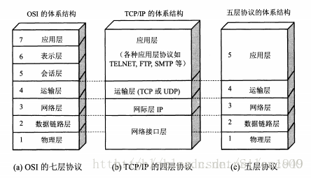

## 4层

4层是指 TCP/IP 四层模型 ，主要包括：应用层、运输层、网际层 和 网络接口层。

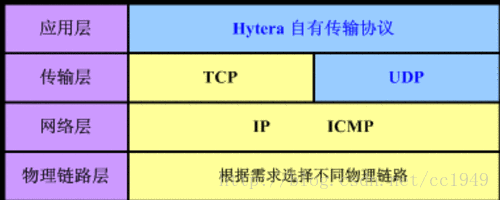

4层协议 和 对应的标准7层协议的关系如下图：

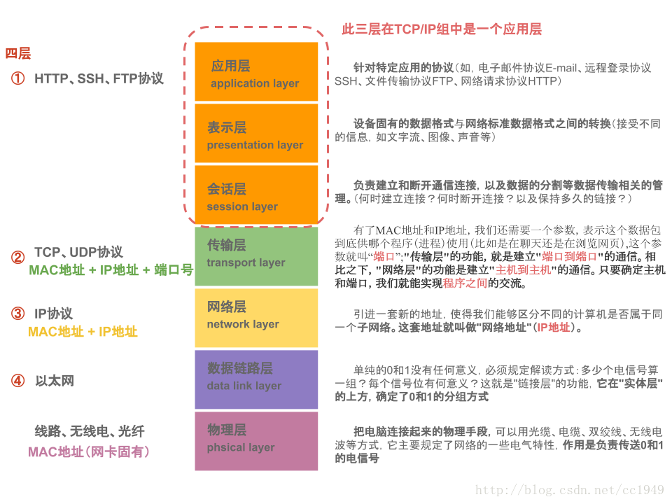

TCP/IP通讯协议采用了4层的层级结构，每一层都呼叫它的下一层所提供的网络来完成自己的需求。这4层分别为：

应用层：应用程序间沟通的层，应用层对应于OSI参考模型的高层，为用户提供所需要的各种服务，例如：FTP、Telnet、DNS、SMTP等.

传输层： 传输层对应于OSI参考模型的传输层，为应用层实体提供端到端的通信功能，保证了数据包的顺序传送及数据的完整性。该层定义了两个主要的协议：传输控制协议（TCP）和用户数据报协议（UDP).TCP和UDP给数据包加入传输数据并把它传输到下一层中，这一层负责传送数据，并且确定数据已被送达并接收。
TCP协议提供的是一种可靠的、通过“三次握手”来连接的数据传输服务；而UDP协议提供的则是不保证可靠的（并不是不可靠）、无连接的数据传输服务.

互连网络层：网际互联层对应于OSI参考模型的网络层，负责提供基本的数据封包传送功能，主要解决主机到主机的通信问题。它所包含的协议设计数据包在整个网络上的逻辑传输。注重重新赋予主机一个IP地址来完成对主机的寻址，它还负责数据包在多种网络中的路由。该层有三个主要协议：网际协议（IP）、互联网组管理协议（IGMP）和互联网控制报文协议（ICMP）

网络接口层：对实际的网络媒体的管理，定义如何使用实际网络（如Ethernet、Serial Line等）来传送数据。网络接入层与OSI参考模型中的物理层和数据链路层相对应。它负责监视数据在主机和网络之间的交换。事实上，TCP/IP本身并未定义该层的协议，而由参与互连的各网络使用自己的物理层和数据链路层协议，然后与TCP/IP的网络接入层进行连接。地址解析协议（ARP）工作在此层，即OSI参考模型的数据链路层。
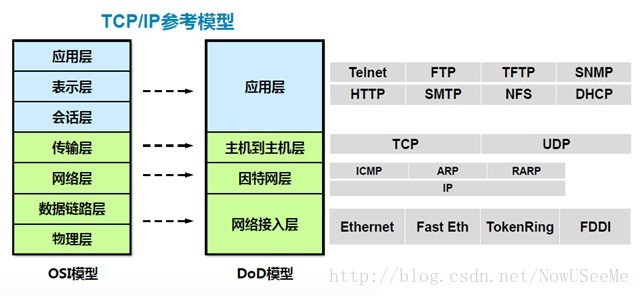

## 数据包

从上往下，每经过一层，协议就会在包头上面做点手脚，加点东西，传送到接收端，再层层解套出来，如下示意图：

————————————————
版权声明：本文为CSDN博主「陈 超」的原创文章，遵循 CC 4.0 BY-SA 版权协议，转载请附上原文出处链接及本声明。
原文链接：https://blog.csdn.net/cc1949/article/details/79063439

# 网络连接

## TCP连接

TCP协议可以对上层网络提供接口，使上层网络数据的传输建立在“无差别”的网络之上。

TCP连接需要经过“三次握手”，断开连接需要经过“四次挥手”。

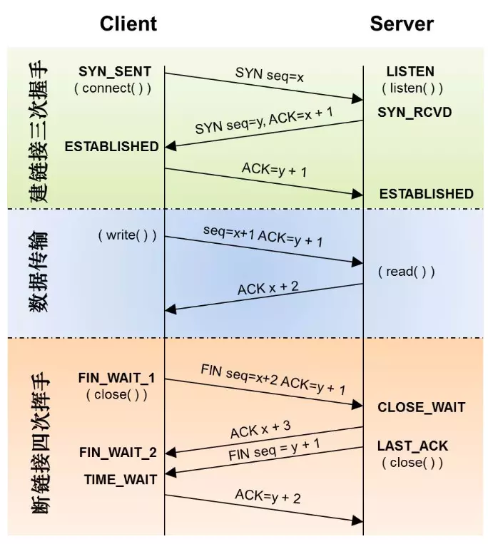

## HTTP

Hyper Text Transfer Protocol 超文本传输协议。

HTTP属于应用层协议，在传输层使用TCP协议，在网络层使用IP协议。IP协议主要解决网络路由和寻址问题，TCP协议主要解决如何在IP层之上可靠的传递数据包，使在网络上的另一端收到发端发出的所有包，并且顺序与发出顺序一致。TCP有可靠，面向连接的特点。

防火墙默认放过http协议。

Http协议负责如何包装数据，而TCP协议负责如何传输数据。

HTTP连接最显著的特点**是客户端发送的每次请求都需要服务器回送响应，在请求结束后，会主动释放连接**。从建立连接到关闭连接的过程称为“一次连接”。基于请求/响应模型的：一次请求对应一次响应。

HTTP连接是无状态的：每次请求之间相互独立，不能交互数据。

* HTTP 1.0：短连接：在HTTP 1.0中，客户端的每次请求都要求建立一次单独的连接，在处理完本次请求后，就自动释放连接，这是一种“短连接”。
* HTTP 1.1：在HTTP 1.1中则可以在一次连接中处理多个请求，并且多个请求可以重叠进行，不需要等待一个请求结束后再发送下一个请求，这是一种“长连接”。在Http 1.1 中只需要在请求头配置`keep-alive : true`即可实现长连接。此时，服务端返回的请求头中会有 `connection : keep-alive` 表明这是一个长连接。

### Http长连接和TCP长连接的区别

Http长连接 和 TCP长连接的区别在于: **TCP 的长连接需要自己去维护一套心跳策略。**而Http只需要在请求头加入`keep-alive:true`即可实现长连接。

###  手写一次TCP长连接

（1） 服务端就只需要编写一个读线程，不断读取来自客户端的消息，并打印出来即可 （2） 客户端需要开启两个定时器，一个是用来模拟发送普通消息，一个用来模拟发送心跳包 （3） 服务端和客户端之间有协议，用来标识什么情况下，这个数据表示的是普通消息，什么情况下，这个数据表示的是心跳消息。

步骤一：定义协议，表明什么情况下表示普通消息，什么情况下表示心跳消息，在这里，我们用前四位用来区分普通消息和心跳消息

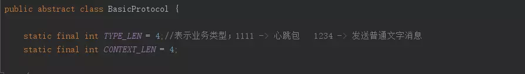

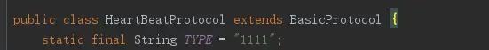

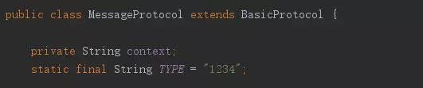

步骤二：定义一个方法，按照协议内容包装内容

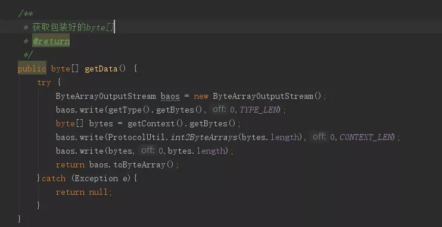

[完整代码](https://juejin.im/post/5b010591518825673564cb50#comment)

## Socket

Socket，即套接字，是支持TCP/IP协议的网络通信的基本操作单元。它是**网络通信过程中端点的抽象表示**。

Socket其实并不是一个协议，而是为了方便使用TCP或UDP而抽象出来的一层，是位于应用层和传输控制层之间的一组接口。

> “Socket是应用层与TCP/IP协议族通信的中间软件抽象层，它是一组接口，提供一套调用TCP/IP协议的API。在设计模式中，Socket其实就是一个门面模式，它把复杂的TCP/IP协议族隐藏在Socket接口后面，对用户来说，一组简单的接口就是全部，让Socket去组织数据，以符合指定的协议。”

当两台主机通信时，必须通过Socket连接，Socket则利用TCP/IP协议建立TCP连接。TCP连接则更依靠于底层的IP协议，IP协议的连接则依赖于链路层等更低层次。

应用层通过传输层进行数据通信时，TCP会遇到同时为多个应用程序进程提供并发服务的问题。多个TCP连接或多个应用程序进程可能需要通过同一个 TCP协议端口传输数据。为了区别不同的应用程序进程和连接，**许多计算机操作系统为应用程序与TCP／IP协议交互提供了套接字(Socket)接口**。应用层可以和传输层通过Socket接口，区分来自不同应用程序进程或网络连接的通信，实现数据传输的并发服务。

### socket连接

建立Socket连接至少需要一对套接字，其中一个运行于客户端，称为ClientSocket ，另一个运行于服务器端，称为ServerSocket 。

套接字之间的连接过程分为三个步骤：服务器监听，客户端请求，连接确认。

- 服务器监听：服务器端套接字并不定位具体的客户端套接字，而是处于等待连接的状态，实时监控网络状态，等待客户端的连接请求。
- 客户端请求：指客户端的套接字提出连接请求，要连接的目标是服务器端的套接字。为此，客户端的套接字必须首先描述它要连接的服务器的套接字，指出服务器端套接字的地址和端口号，然后就向服务器端套接字提出连接请求。
- 连接确认：当服务器端套接字监听到或者说接收到客户端套接字的连接请求时，就响应客户端套接字的请求，建立一个新的线程，把服务器端套接字的描述发给客户端，一旦客户端确认了此描述，双方就正式建立连接。而服务器端套接字继续处于监听状态，继续接收其他客户端套接字的连接请求。

### Socket连接和TCP连接的关系

创建Socket连接时，可以指定使用的传输层协议，Socket可以支持不同的传输层协议（TCP或UDP），当**使用TCP协议进行连接时，该Socket连接就是一个TCP连接**。

> 总结：socket是对TCP/IP协议的封装和应用（程序员层面上）,它提供了一组基本的函数接口（比如：create、listen、accept等），使得程序员更方便地使用TCP/IP协议栈。

> TCP/IP只是一个协议栈，就像操作系统的运行机制一样，必须要具体实现，同时还要提供对外的操作接口。

### Socket连接和Http连接的关系

Socket连接一般情况下都是TCP连接，因此Socket连接一旦建立，通信双方就可以进行**互相发送内容**。但在实际网络应用中，客户端到服务器之间的通信往往需要穿越多个中间节点，例如路由器、网关、防火墙等，大部分防火墙默认会关闭长时间处于非活跃状态的连接而导致 Socket 连接断连，因此需要通过轮询告诉网络，该连接处于活跃状态。（**这也就是常说的“心跳策略”**）

Http连接是**“请求-响应”**的方式，不仅在请求时需要先建立连接，而且需要客户端向服务器发出请求后，服务器端才能回复数据。

> 总结：如果建立的是Socket连接，服务器可以直接将数据传送给客户端；如果方建立的是HTTP连接，则服务器需要等到客户端发送一次请求后才能将数据传回给客户端。

## Websocket

### HTTP缺陷

- **全双工模式**

  全双工： [1] 指可以同时（瞬时）进行信号的双向传输（A→B且B→A）。指A→B的同时B→A，是瞬时同步的。

  半双工：指一个时间内只有一个方向的信号传输（A→B或B→A）。

  举例说明其原理：一座桥的两头分别有车要过桥，如果桥比较宽，就可以来左去右，互不影响，这就是全双工；如果桥窄，只能先过一边的车，然后再过另一边的车，这就是半双工。

  在通信产品中，对讲机就是半双工的典型例子；电话是全双工的应用。

- **现实中的挑战**	

  当今 Web 应用要求可靠、近乎零延迟的实时通讯。不仅需要广播，还需要双向通讯

  现实中的案例：股票交易系统、社交网络、线上游戏

  如何通过Web实现企业级实时通信 CS应用呢？

- **为什么不用HTTP**	

  - HTTP 起初被设计为文本传输协议
  - HTTP 是半双工，一次单向通讯
  - HTTP的限制，实现实时、双向Web通讯非常麻烦
  - HTTP 请求头和响应头信息造成不必要的通讯负载

- **HTTP 曾付出的努力**	

  - AJAX（Asynchronous JavaScript and XML）

    - 特征
      页面修改无需整体刷新
      用户体验上，感觉低延迟，实际上没有区别

    - 不足
      仍采用拉的模式，服务端无法发push
      无法避免HTTP头负载的问题

  - Polling

    - 特征
      接近于实时
      使用Ajax 应用模拟实施通讯
      浏览器发送规律的间隔的请求

    - 不足
      在消息低频的情况，
      太多的连接没必要地被打开和关闭

  - Long Polling

    - 特征
      又称为异步 Polling
      浏览器发送请求到服务器，
      服务器保持请求开打一段时间

    - 不足
      HTTP 头通常造成大量的网络堵塞
      消息高频情况，导致连续的拉循环

  - Stream
    - 特征
      效率更高

    - 不足
      时常问题频发
      代理和防火墙可能引起的复杂性，websocket也有
      响应必须周期性的构建和flush
      浏览器跨域连接限制，websocket也有

- **Comet**

  一种长期持有的 HTTP 请求Web 应用模型，允许Web 服务器向浏览器推送数据。

  Comet 是一个整体的术语（Umbrella term），包括多种技术完成交互。包括 Ajax Push、Reverse Ajax、 Two-way-web、HTTP Streaming and HTTP server push

  tomcat8.5移除了。

### WebSocket

WebSocket是HTML5规范提出的一种协议；目前除了完犊子的IE浏览器，其他浏览器都基本支持。他是一种协议，万变不离其宗，也是基于TCP协议的；和HTTP协议是并存的两种协议。
WebSocket是HTML5中的协议。HTML5 Web Sockets规范定义了Web Sockets API，支持页面使用Web Socket协议与远程主机进行全双工的通信。它引入了WebSocket接口并且定义了一个全双工的通信通道，通过一个单一的套接字在Web上进行操作。HTML5 Web Sockets以最小的开销高效地提供了Web连接。相较于经常需要使用推送实时数据到客户端甚至通过维护两个HTTP连接来模拟全双工连接的旧的轮询或长轮询（Comet）来说，这就极大的减少了不必要的网络流量与延迟。
要使用HTML5 Web Sockets从一个Web客户端连接到一个远程端点，你要创建一个新的WebSocket实例并为之提供一个URL来表示你想要连接到的远程端点。该规范定义了ws://以及wss://模式来分别表示WebSocket和安全WebSocket连接,这就跟http:// 以及https:// 的区别是差不多的。一个WebSocket连接是在客户端与服务器之间HTTP协议的初始握手阶段将其升级到Web Socket协议来建立的，其底层仍是TCP/IP连接。

### WebSocket与Socket

Socket其实并不是一个协议，而是为了方便使用TCP或UDP而抽象出来的一层，是位于应用层和传输控制层之间的一组接口。

> “Socket是应用层与TCP/IP协议族通信的中间软件抽象层，它是一组接口，提供一套调用TCP/IP协议的API。在设计模式中，Socket其实就是一个门面模式，它把复杂的TCP/IP协议族隐藏在Socket接口后面，对用户来说，一组简单的接口就是全部，让Socket去组织数据，以符合指定的协议。”

当两台主机通信时，必须通过Socket连接，Socket则利用TCP/IP协议建立TCP连接。TCP连接则更依靠于底层的IP协议，IP协议的连接则依赖于链路层等更低层次。

WebSocket就像HTTP一样，则是一个典型的应用层协议。

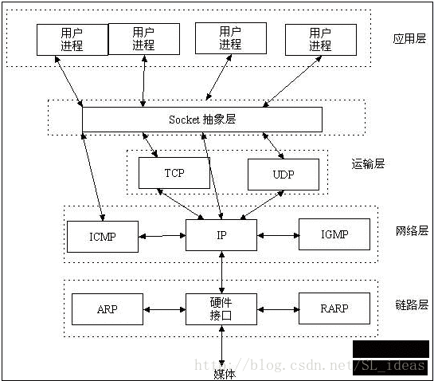

**总结**：Socket是传输控制层接口，WebSocket是应用层协议。

### WebSocket与HTTP

关系图：

- **相同点**

1. 都是一样基于TCP的，都是可靠性传输协议。
2. 都是应用层协议。

- **不同点**

  1. WebSocket是双向通信协议，模拟Socket协议，可以双向发送或接受信息。HTTP是单向的。
  2. WebSocket是需要浏览器和服务器握手进行建立连接的。而http是浏览器发起向服务器的连接，服务器预先并不知道这个连接。

- **联系**

  WebSocket在建立握手时，数据是通过HTTP传输的。但是建立之后，在真正传输时候是不需要HTTP协议的。

- **总结**
  在WebSocket中，只需要服务器和浏览器通过HTTP协议进行一个握手的动作，然后单独建立一条TCP的通信通道进行数据的传送。

  > WebSocket连接的过程是：
  >
  > 首先，客户端发起http请求，经过3次握手后，建立起TCP连接；http请求里存放WebSocket支持的版本号等信息，如：Upgrade、Connection、WebSocket-Version等；
  > 然后，服务器收到客户端的握手请求后，同样采用HTTP协议回馈数据；
  > 最后，客户端收到连接成功的消息后，开始借助于TCP传输信道进行全双工通信。

# 稳定连接

## 影响TCP连接寿命的因素

1、NAT超时

大部分移动无线网络运营商都在链路一段时间没有数据通讯时，会淘汰 NAT 表中的对应项，造成链路中断（NAT超时的更多描述见附录6.1）。NAT超时是影响TCP连接寿命的一个重要因素(尤其是国内)，所以客户端自动测算NAT超时时间，来动态调整心跳间隔，是一个重要的优化点。

2、DHCP的租期（lease time）

目前测试发现安卓系统对DHCP的处理有Bug，DHCP租期到了不会主动续约并且会继续使用过期IP，这个问题会造成TCP长连接偶然的断连。（租期问题的具体描述见附录6.2）。

3、网络状态变化

手机网络和WIFI网络切换、网络断开和连上等情况有网络状态的变化，也会使长连接变为无效连接，需要监听响应的网络状态变化事件，重新建立Push长连接。

## 7. 不同网络状态下的心跳策略

**稳定的网络状态下：**

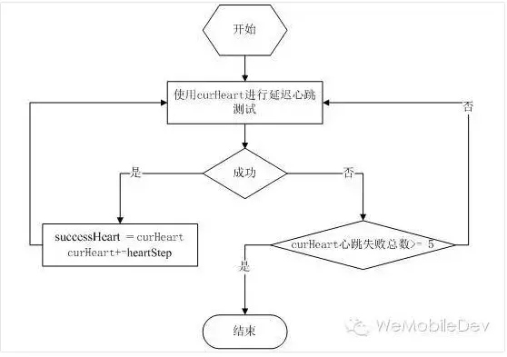

其中：

- [MinHeart，MaxHeart]——心跳可选区间。
- successHeart——当前成功心跳，初始为MinHeart
- curHeart——当前心跳初始值为successHeart
- heartStep——心跳增加步长
- successStep——稳定期后的探测步长

**如何判断网络状态稳定？**

> 答：使用 短心跳连续成功三次，此时认为网络相对稳定。

## 8. 各平台Push策略研究

以下内容来自于微信分享的关于心跳策略的[文章](https://cloud.tencent.com/developer/article/1030660)。

### 8.1 WhatsApp的Push策略

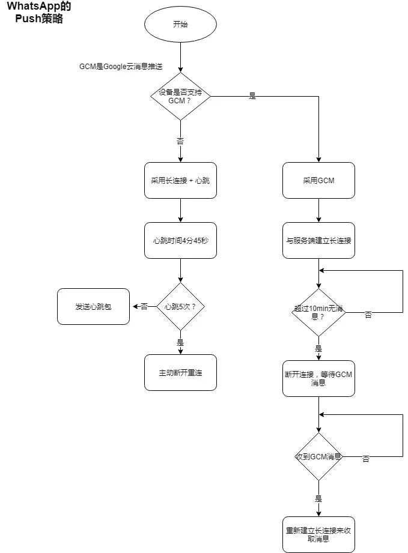

### 8.2 Line的Push策略

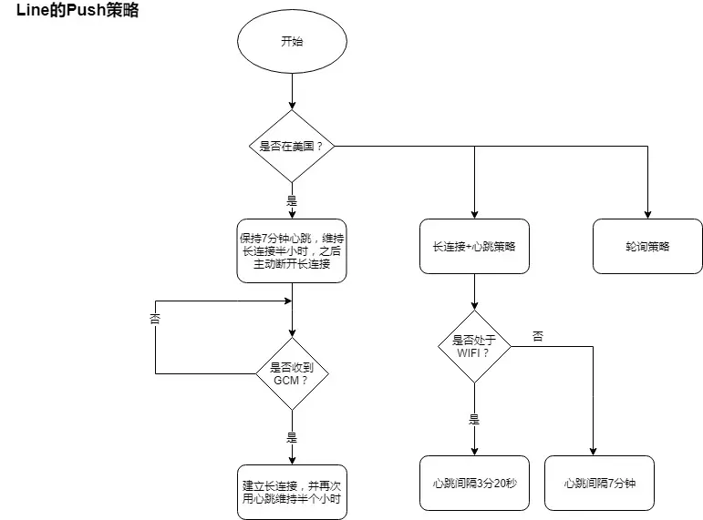

### 8.3 微信的Push策略

微信没有使用GCM，自己维护TCP长连接，使用固定心跳。

心跳典型值为：

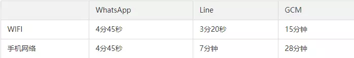

# URL、URI

URI = Uniform Resource Identifier 统一资源**标志符**

URL = Uniform Resource Locator 统一资源**定位符**
URN = Uniform Resource Name 统一资源**名称**

**大白话，就是**URI是抽象的定义，不管用什么方法表示，只要能定位一个资源，就叫URI，本来设想的的使用两种方法定位：1，URL，用地址定位；2，URN 用名称定位。

举个例子：去村子找个具体的人（URI），如果用地址：某村多少号房子第几间房的主人 就是URL， 如果用身份证号+名字 去找就是URN了。

结果就是 目前WEB上就URL流行开了，平常见得URI 基本都是URL。

作者：封火星
链接：https://www.zhihu.com/question/21950864/answer/158161453
来源：知乎
著作权归作者所有。商业转载请联系作者获得授权，非商业转载请注明出处。

# 参考文献

 [WebSocket与http长连接的区别](https://segmentfault.com/a/1190000015122195)

[Comet：基于 HTTP 长连接的“服务器推”技术](https://www.ibm.com/developerworks/cn/web/wa-lo-comet/index.html)

[http和comet](https://www.google.com/search?sxsrf=ACYBGNSISA2EZLz7x92k6fFyulqa6Piz-A%3A1581037737752&ei=qbg8Xr_JLc_i-AbknrL4DA&q=http%E5%92%8Ccomet&oq=http%E5%92%8Ccomet&gs_l=psy-ab.3...2724.3868..5100...0.0..0.170.877.9j1......0....1..gws-wiz.......35i39j0j0i67j0i203j0i12.7Gdv3da7qNk&ved=0ahUKEwj_wfDFoL7nAhVPMd4KHWSPDM8Q4dUDCAs&uact=5) 

https://www.jianshu.com/p/3fc3646fad80

[网络7层协议，4层，5层？理清容易混淆的几个概念](https://blog.csdn.net/cc1949/article/details/79063439)