# 介绍

## request 报文

```http
GET / HTTP/1.1
Host: localhost:8080
Connection: keep-alive
Cache-Control: max-age=0
Upgrade-Insecure-Requests: 1
User-Agent: Mozilla/5.0 (Windows NT 10.0; Win64; x64) AppleWebKit/537.36 (KHTML, like Gecko) Chrome/79.0.3945.130 Safari/537.36
Sec-Fetch-User: ?1
Accept: text/html,application/xhtml+xml,application/xml;q=0.9,image/webp,image/apng,*/*;q=0.8,application/signed-exchange;v=b3;q=0.9 
Sec-Fetch-Site: none
Sec-Fetch-Mode: navigate
Accept-Encoding: gzip, deflate, br
Accept-Language: zh-CN,zh;q=0.9,en;q=0.8,sm;q=0.7,ja;q=0.6
Cookie: Webstorm-7e350cb7=5ecded85-15c0-4720-9e95-78df57eb10a9; Idea-9f509e1e=c1c1689f-0813-459f-a389-de8f617da5a9; _ga=GA1.1.394677635.1563411189; UM_distinctid=16d07800f811-0d1a2383f996c-5373e62-144000-16d07800f822a0; CNZZDATA1253090893=1433151247-1567788709-%7C1567788709
Upgrade-Insecure-Requests: 1
		
username=zhangsan

```

Accept：可以接收哪几种数据格式，通常一个请求都是很多种的，尤其请求首页

```
	1. 请求行
		请求方式 请求url 请求协议/版本
		GET /login.html	HTTP/1.1

		* 请求方式：
			* HTTP协议有7中请求方式，常用的有2种
				* GET：
					1. 请求参数在请求行中，在url后。
					2. 请求的url长度有限制的
					3. 不太安全
				* POST：
					1. 请求参数在请求体中
					2. 请求的url长度没有限制的
					3. 相对安全
	2. 请求头：客户端浏览器告诉服务器一些信息
		请求头名称: 请求头值
		* 常见的请求头：
			1. User-Agent：浏览器告诉服务器，我访问你使用的浏览器版本信息
				* 可以在服务器端获取该头的信息，解决浏览器的兼容性问题

			2. Referer：http://localhost/login.html
				* 告诉服务器，我(当前请求)从哪里来？
					* 作用：
						1. 防盗链：
						2. 统计工作：
	3. 请求空行
		空行，就是用于分割POST请求的请求头，和请求体的。
	4. 请求体(正文)：
		* 封装POST请求消息的请求参数的
```

## response 报文

```http
HTTP/1.1 200 OK
Date: Fri, 28 Aug 2020 06:15:02 GMT
Etag: W/"1d7hs"
Expires: Fri, 28 Aug 2020 06:15:04 GMT
Cache-Control: public, max-age=300, s-maxage=300
Vary: Accept-Encoding
Server: ATS/8.0.8
X-Content-Type-Options: nosniff
X-Request-Id: 893f9926-0033-4ef6-8591-534d2956a64b
Content-Type: text/javascript; charset=utf-8
X-Cache: cp5008 hit, cp5009 hit/8523
X-Cache-Status: hit-front
Server-Timing: cache;desc="hit-front"
Strict-Transport-Security: max-age=106384710; includeSubDomains; preload
X-Client-IP: 210.61.119.188
Age: 0
Accept-Ranges: bytes
Content-Length: 66966
Connection: keep-alive

function isCompatible(ua){return!!((function(){'use strict';return!this&&Function.prototype
```

```
		1. 响应行
			1. 组成：协议/版本 响应状态码 状态码描述
			2. 响应状态码：服务器告诉客户端浏览器本次请求和响应的一个状态。
				1. 状态码都是3位数字 
				2. 分类：
					1. 1xx：服务器就收客户端消息，但没有接受完成，等待一段时间后，发送1xx多状态码
					2. 2xx：成功。代表：200
					3. 3xx：重定向。代表：302(重定向)，304(访问缓存)
					4. 4xx：客户端错误。
						* 代表：
							* 404（请求路径没有对应的资源） 
							* 405：请求方式没有对应的doXxx方法
					5. 5xx：服务器端错误。代表：500(服务器内部出现异常)
		2. 响应头：
			1. 格式：头名称： 值
			2. 常见的响应头：
				1. Content-Type：服务器告诉客户端本次响应体数据格式以及编码格式
				2. Content-disposition：服务器告诉客户端以什么格式打开响应体数据
					* 值：
						* in-line:默认值,在当前页面内打开
						* attachment;filename=xxx：以附件形式打开响应体。文件下载
		3. 响应空行
		4. 响应体:传输的数据
```

# postman

其他工具：fiddler，控制台，proxy

### 1、form-data:

#### 介绍

    就是http请求中的multipart/form-data,它会将表单的数据处理为一条消息，以标签为单元，用分隔符分开。既可以上传键值对，也可以上传文件。当上传的字段是文件时，会有Content-Type来说明文件类型；content-disposition，用来说明字段的一些信息；
    
    由于有boundary隔离，所以multipart/form-data既可以上传文件，也可以上传键值对，它采用了键值对的方式，所以可以上传多个文件。

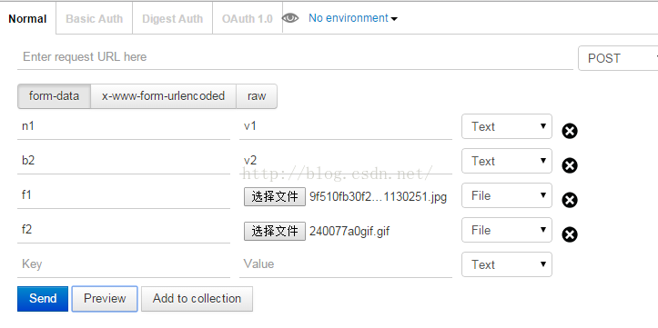


#### springmvc接收

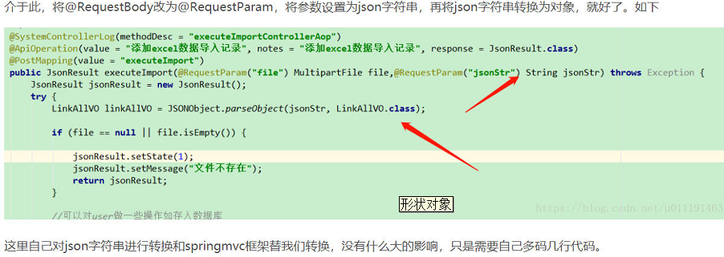

#### 细节

##### raw方式传输

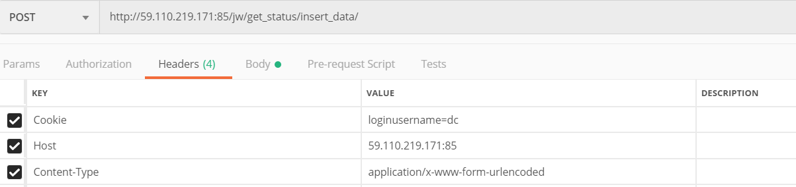

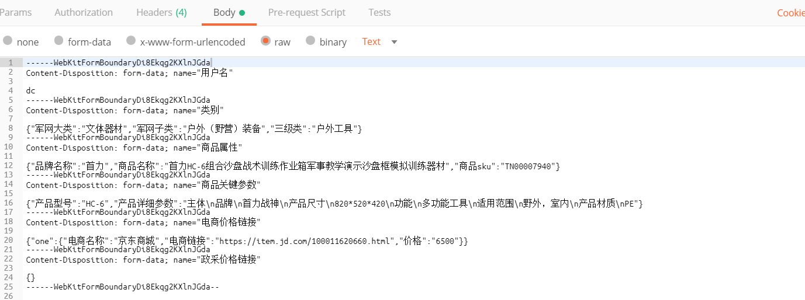

##### multipart 方式

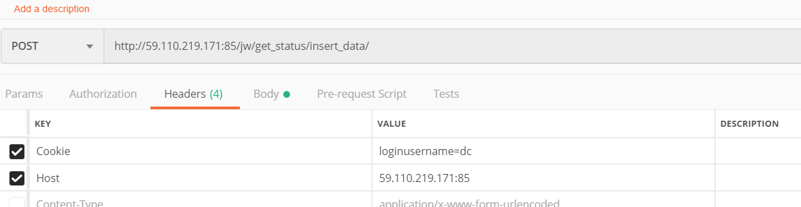

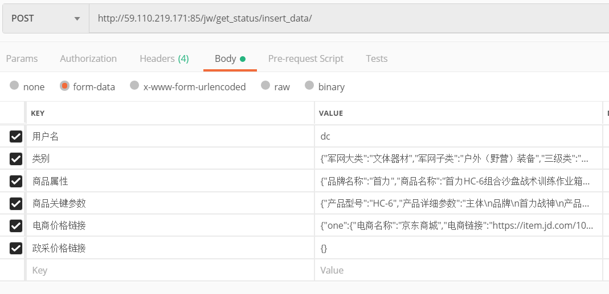

#### 重点

空行不是/n，而是/r/n，复制的时候会丢失/r，因此需要replace字符串，不然报错，有可能无法解析


##### http报文

```http
POST http://59.110.219.171:85/jw/get_status/insert_data/ HTTP/1.1
Cookie: loginusername=dc
Host: 59.110.219.171:85
Content-Type: multipart/form-data; boundary=----WebKitFormBoundaryDi8Ekqg2KXlnJGda
cache-control: no-cache
User-Agent: PostmanRuntime/7.6.0
Accept: */*
accept-encoding: gzip, deflate
content-length: 1193
Connection: keep-alive  {下面一空行是请求空行，请求空行下面是请求体}

------WebKitFormBoundaryDi8Ekqg2KXlnJGda
Content-Disposition: form-data; name="用户名"

dc
------WebKitFormBoundaryDi8Ekqg2KXlnJGda
Content-Disposition: form-data; name="类别"

{"军网大类":"文体器材","军网子类":"户外（野营）装备","三级类":"户外工具"}
------WebKitFormBoundaryDi8Ekqg2KXlnJGda
Content-Disposition: form-data; name="商品属性"

{"品牌名称":"首力","商品名称":"首力HC-6组合沙盘战术训练作业箱军事教学演示沙盘框模拟训练器材","商品sku":"TN00007940"}
------WebKitFormBoundaryDi8Ekqg2KXlnJGda
Content-Disposition: form-data; name="商品关键参数"

{"产品型号":"HC-6","产品详细参数":"主体\n品牌\n首力战神\n产品尺寸\n820*520*420\n功能\n多功能工具\n适用范围\n野外，室内\n产品材质\nPE"}
------WebKitFormBoundaryDi8Ekqg2KXlnJGda
Content-Disposition: form-data; name="电商价格链接"

{"one":{"电商名称":"京东商城","电商链接":"https://item.jd.com/100011620660.html","价格":"6500"}}
------WebKitFormBoundaryDi8Ekqg2KXlnJGda
Content-Disposition: form-data; name="政采价格链接"

{}
------WebKitFormBoundaryDi8Ekqg2KXlnJGda--

```

##### okhttp

```java
OkHttpClient client = new OkHttpClient();

MediaType mediaType = MediaType.parse("multipart/form-data; boundary=----WebKitFormBoundaryDi8Ekqg2KXlnJGda");
RequestBody body = RequestBody.create(mediaType, "------WebKitFormBoundaryDi8Ekqg2KXlnJGda\r\nContent-Disposition: form-data; name=\"用户名\"\r\n\r\ndc\r\n------WebKitFormBoundaryDi8Ekqg2KXlnJGda\r\nContent-Disposition: form-data; name=\"类别\"\r\n\r\n{\"军网大类\":\"文体器材\",\"军网子类\":\"户外（野营）装备\",\"三级类\":\"户外工具\"}\r\n------WebKitFormBoundaryDi8Ekqg2KXlnJGda\r\nContent-Disposition: form-data; name=\"商品属性\"\r\n\r\n{\"品牌名称\":\"首力\",\"商品名称\":\"首力HC-6组合沙盘战术训练作业箱军事教学演示沙盘框模拟训练器材\",\"商品sku\":\"TN00007940\"}\r\n------WebKitFormBoundaryDi8Ekqg2KXlnJGda\r\nContent-Disposition: form-data; name=\"商品关键参数\"\r\n\r\n{\"产品型号\":\"HC-6\",\"产品详细参数\":\"主体\\n品牌\\n首力战神\\n产品尺寸\\n820*520*420\\n功能\\n多功能工具\\n适用范围\\n野外，室内\\n产品材质\\nPE\"}\r\n------WebKitFormBoundaryDi8Ekqg2KXlnJGda\r\nContent-Disposition: form-data; name=\"电商价格链接\"\r\n\r\n{\"one\":{\"电商名称\":\"京东商城\",\"电商链接\":\"https://item.jd.com/100011620660.html\",\"价格\":\"6500\"}}\r\n------WebKitFormBoundaryDi8Ekqg2KXlnJGda\r\nContent-Disposition: form-data; name=\"政采价格链接\"\r\n\r\n{}\r\n------WebKitFormBoundaryDi8Ekqg2KXlnJGda--\r\n");
Request request = new Request.Builder()
  .url("http://59.110.219.171:85/jw/get_status/insert_data/")
  .post(body)
  .addHeader("Content-Type", "multipart/form-data; boundary=----WebKitFormBoundaryDi8Ekqg2KXlnJGda")
  .addHeader("Cookie", "loginusername=dc")
  .addHeader("Host", "59.110.219.171:85")
  .addHeader("cache-control", "no-cache")
  .build();

Response response = client.newCall(request).execute();
```


### **2、x-www-form-urlencoded：**


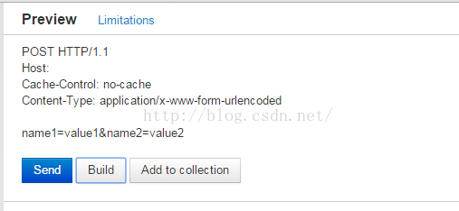

### **3、raw**

​      可以上传任意格式的文本，可以上传text、json、xml、html等

其实上面两种方法底层也是raw，只不过自动转化，并且添加content-type，方便很多

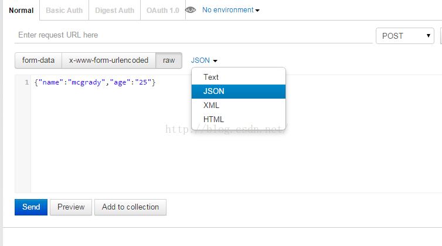

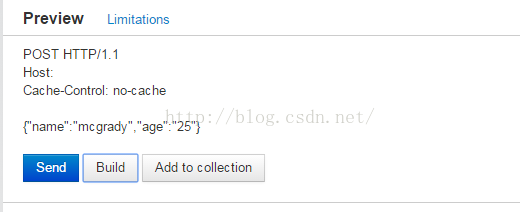

### 4、binary

          相当于Content-Type:application/octet-stream,从字面意思得知，只可以上传二进制数据，通常用来上传文件，由于没有键值，所以，一次只能上传一个文件。

 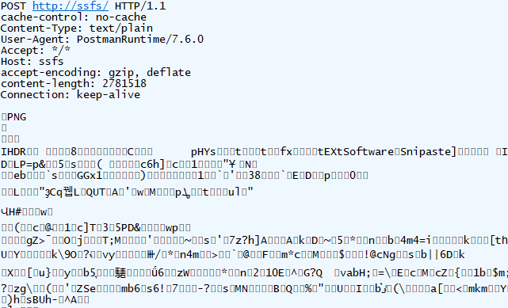


### multipart/form-data与x-www-form-urlencoded区别

               multipart/form-data：既可以上传文件等二进制数据，也可以上传表单键值对，只是最后会转化为一条信息；
    
               x-www-form-urlencoded：只能上传键值对，并且键值对都是间隔分开的。


# content-length

`Content-Length`, HTTP消息长度, 用**十进制数字**表示的**八位字节的数目**. 一般情况下, 很多工作都被框架完成, 我们很少去关注这部分内容, 但少数情况下发生了`Content-Length`与实际消息长度不一致, 程序可能会发生比较奇怪的异常, 如:

- 无响应直到超时.
- 请求被截断, 而且下一个请求解析出现错乱.

`Content-Length`是HTTP消息长度, 用**十进制数字**表示的**八位字节的数目**, 是Headers中常见的一个字段. `Content-Length`应该是精确的, 否则就会导致异常 (特别地, HTTP1.0中这个字段可有可无).

`Content-Length`首部指示出报文中实体主体的字节大小. 这个大小是包含了所有内容编码的, 比如, 对文本文件进行了`gzip`压缩的话, `Content-Length`首部指的就是压缩后的大小而不是原始大小.

### Content-Length是如何工作的

`Content-Length`使用十进制的数字表示了消息的长度, 服务端/客户端通过它来得知后续要读取消息的长度.

[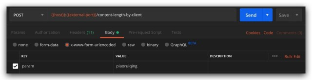](https://image.fundebug.com/2019-09-10-01.jpg)

[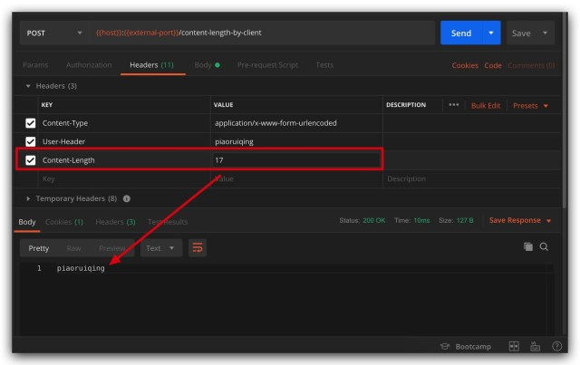](https://image.fundebug.com/2019-09-10-02.jpg)

如果这个长度不正确, 会发生如下情况:

### Content-Length > 实际长度

如果Content-Length比实际的长度大, 服务端/客户端读取到消息结尾后, 会等待下一个字节, 自然会无响应直到超时.

[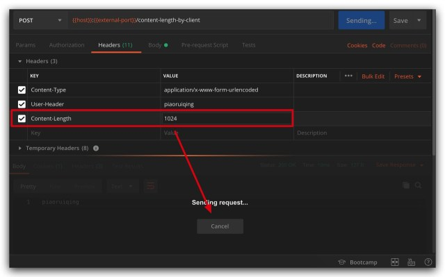](https://image.fundebug.com/2019-09-10-03.jpg)

同样地, 在响应消息中`Content-Length`超过实际长度也是一样的效果:

[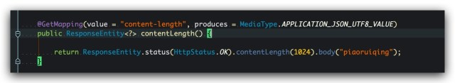](https://image.fundebug.com/2019-09-10-04.jpg)

[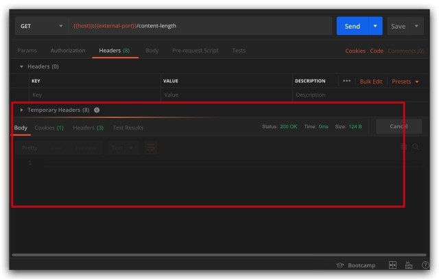](https://image.fundebug.com/2019-09-10-05.jpg)

### Content-Length < 实际长度

如果这个长度小于实际长度, 首次请求的消息会被截取, 比如参数为`param=piaoruiqing`, `Content-Length`为10, 那么这次请求的消息会被截取为: `param=piao`, 如图所示:

[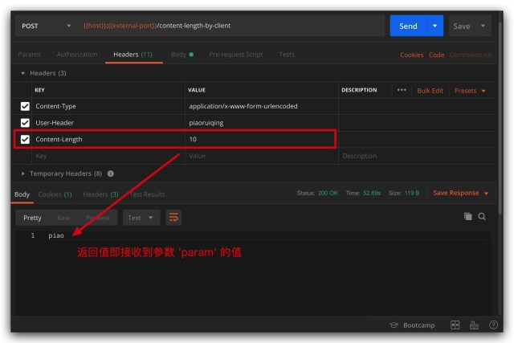](https://image.fundebug.com/2019-09-10-06.jpg)

[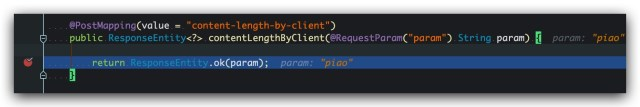](https://image.fundebug.com/2019-09-10-07.jpg)

但, 仅仅是如此吗, 当然不, 我们再来看看第二次请求会发生什么让人意外的事情, 如图:

[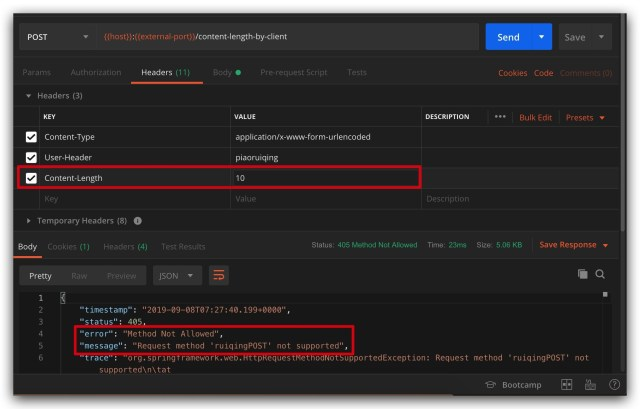](https://image.fundebug.com/2019-09-10-08.jpg)

连续的两次请求, 第一次消息被截断, 而第二次没有发生预期的截断, 而是服务端抛出了异常: `Request method 'ruiqingPOST' not supported`.刺不刺激 (ﾉ)ﾟДﾟ( )

那 `ruiqingPOST`是个什么神仙方法??? 此时, 凭着多年开发(DEBUG)经验练就的敏感度, 我们大致可以猜出, 上一次请求被截取剩下的消息, 在这次请求出现了. 掏出wireshark来验证一下, 如图:

[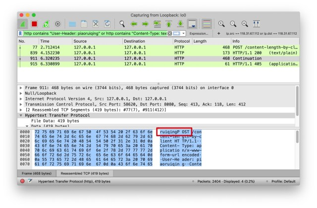](https://image.fundebug.com/2019-09-10-09.jpg)

导致这种情况的原因就是开启了`Connection:keep-alive`, 如果使用`Connection:close`, 所产生的现象就是每一次的请求都被截断, 但不会产生解析混乱(如将上一次剩下的消息拼接到后续的请求消息中).

### 不确定Content-Length的值怎么办

Content-Length`首部指示出报文中实体主体的字节大小. 但如在请求处理完成前无法获取消息长度, 我们就无法明确指定`Content-Length`, 此时应该使用`Transfer-Encoding: chunked

### 什么是Transfer-Encoding: chunked

数据以一系列分块的形式进行发送. `Content-Length` 首部在这种情况下不被发送. 在每一个分块的开头需要添加当前分块的长度, 以十六进制的形式表示，后面紧跟着 `\r\n` , 之后是分块本身, 后面也是`\r\n`. 终止块是一个常规的分块, 不同之处在于其长度为0.

### Transfer-Encoding: chunked是如何工作的

接下来我们用一个下载文件的例子, 来探讨`Transfer-Encoding: chunked`是如何工作的. 服务端代码如下:

[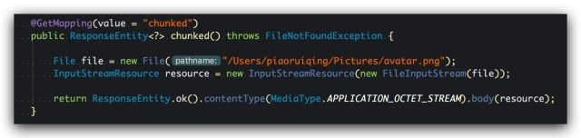](https://image.fundebug.com/2019-09-10-10.jpg)

使用postman发起请求, wireshark抓包查看, 如图:

[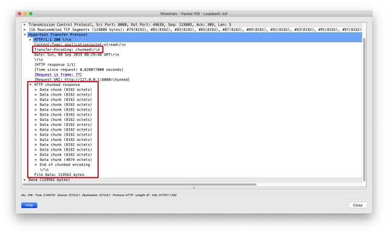](https://image.fundebug.com/2019-09-10-11.jpg)

在wireshark中可以很清晰地看到chunked的数据, 其结构大致是: 返回的消息被分为多个数据块, 每个数据块有两部分, `长度` + `数据`, 这两部分都以CRLF(即`\r\n`)结尾. 而终止块是一个特殊的数据块, 其长度为0, 如图:

[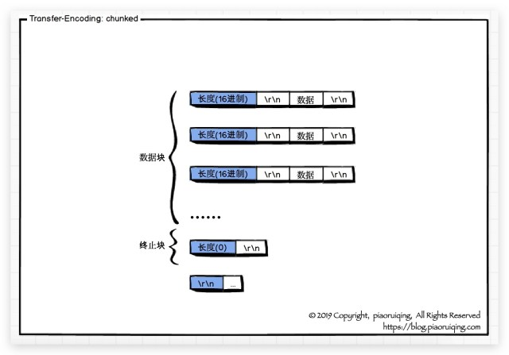](https://image.fundebug.com/2019-09-10-12.jpg)

如此, 即完成了分块编码. 其主要应用于如下场景, 即要传输大量的数据, 但是在请求在没有被处理完之前响应的长度是无法获得的. 例如, 当需要用从数据库中查询获得的数据生成一个大的HTML表格、需要传输大量的图片等.

- `Content-Length`如果存在且生效, 必须是正确的, 否则会发生异常.(大于实际值会超时, 小于实际值会截断并可能导致后续的数据解析混乱)
- 如果报文中包含`Transfer-Encoding: chunked`首部, 那么`Content-Length`将被忽略.


# \r\n

每个Header一行一个，换行符是\r\n

注意：当遇到连续两个\r\n时，Header部分结束，后面的数据全部是Body。

再次注意：HTTP响应如果包含body，也是通过\r\n\r\n来分隔的。

请再次注意，Body的数据类型由Content-Type头来确定，如果是网页，Body就是文本，如果是图片，Body就是图片的二进制数据。

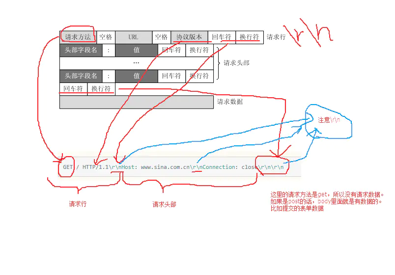

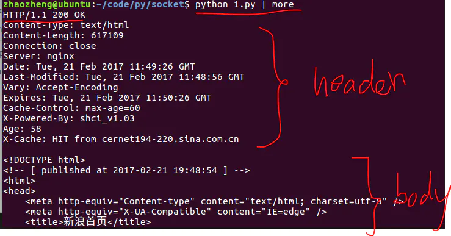

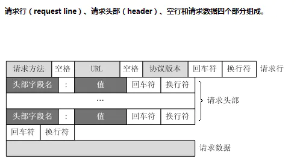

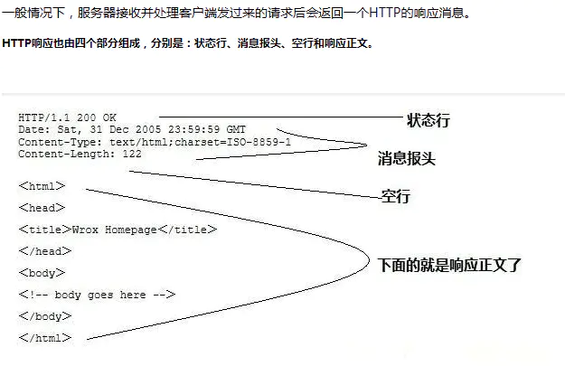

# https

https的ssl就是为了传输共享密钥和各自签名私钥密钥，一共两对加1。分别用来加密（防止偷窥）

签名（防篡改）

按需使用，通常防篡改一定要使用

ssl开始部分使用不对称性加密，后面对称性

证书是为了证明公钥的合法性

# 协商缓存

 Etag和Last-Modified

### 特性

- ETag和If-None-Match是一对；Last-Modified和If-Modified-Since是一对
- 它们都属于协商缓存，对内容的有效性进行验证，具体看这里
- 验证的过程是类似（以Etag为例）：首次请求，如果response header含有Etag值，则下一次请求，request header 就会带上If-None-Match，它的值为上次接收到服务器发来的Etag的值。服务器接收到这个值和自身现在的Etag比较，来判断内容是否有变化。如果没变化则返回请求头304，有变化则重新从服务器获取内容，成功的话返回200和内容。这个过程是浏览器自动完成的。
- 生成值的方法不同： Etag的值通常为文件内容的哈希值；而Last-Modified为最后修改的时间。

### ETag特点

1. Last-Modified只能精确到秒，秒之内的内容更新Etag才能检测
2. 文件有时会定时重新生成相同内容，Last-Modified不能很好辨别
3. etag每次服务端生成都需要进行读写操作，而last-modified只需要读取操作，etag的消耗是更大的

### Etag/If-None-Match例子

1. 第一次请求

   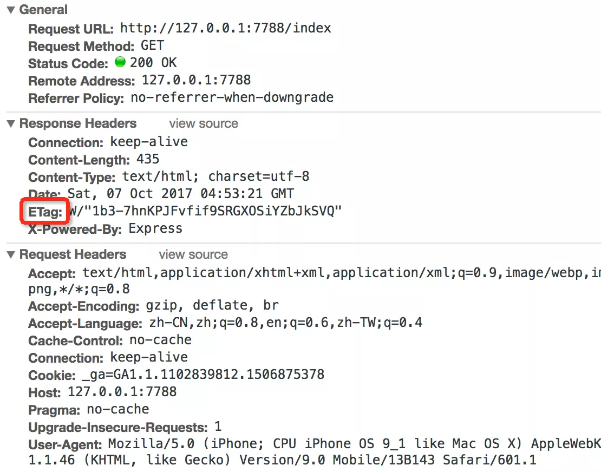

2. 第二次请求

   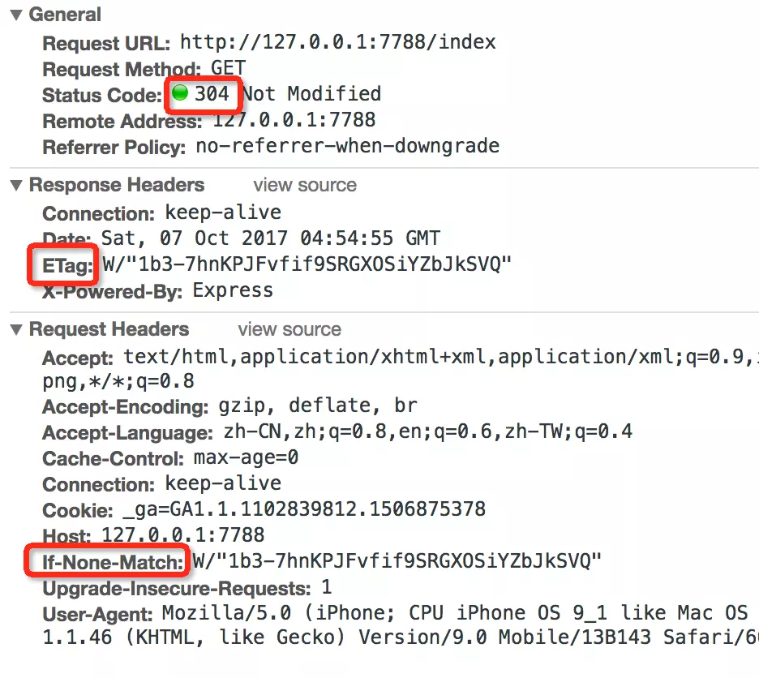

### Last-Modified/If-Modified-Since

类似

### 304

如上面所示，304状态码出现在协商缓存，进行缓存内容有效性验证的时候。如果缓存内容被服务端认定没有变化，则只返回response header，并把状态码设置为304，并不返回response body，浏览器再收到304的时候，从本地的缓存中读取内容。如果内容有变，则返回新的header和body。可见，304在缓存中的作用最后体现在少返回了一次内容上。

### 区别

暂时不知道，两者应该是互补关系，因为文件哈市

### 不使用缓存

chrome可以设置不适用缓存，也可以使用无痕模式

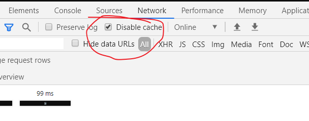

# Cookie

 *Cookie的有效期*

1. 1. 如果maxAge属性为正数，则表示该Cookie会在maxAge秒之后自动失效。浏览器会将maxAge为正数的Cookie持久化，即写到对应的Cookie文件中。无论客户关闭了浏览器还是电脑，只要还在maxAge秒之前，登录网站时该Cookie仍然有效。下面代码中的Cookie信息将永远有效。cookie.setMaxAge(Integer.MAX_VALUE); 
   2. 如果maxAge为负数，则表示该Cookie仅在本浏览器窗口以及本窗口打开的子窗口内有效，关闭窗口后该Cookie即失效。maxAge为负数的Cookie，为临时性Cookie，不会被持久化，不会被写到Cookie文件中。Cookie信息保存在浏览器内存中，因此关闭浏览器该Cookie就消失了。Cookie默认的maxAge值为-1。
   3. 如果maxAge为0，则表示删除该Cookie。Cookie机制没有提供删除Cookie的方法，因此通过设置该Cookie即时失效实现删除Cookie的效果。失效的Cookie会被浏览器从Cookie文件或者内存中删除，
   4. 想修改Cookie只能使用一个同名的Cookie来覆盖原来的Cookie，达到修改的目的。删除时只需要把maxAge修改为0即可。

2. cookie属性注意：从客户端读取Cookie时，包括maxAge在内的其他属性都是不可读的，也不会被提交。浏览器提交Cookie时只会提交name与value属性。maxAge属性只被浏览器用来判断Cookie是否过期。

3. ```java
       /**
        * 设置cookie
        *
        * @param response
        * @param name     cookie名字
        * @param value    cookie值
        * @param maxAge   cookie生命周期 以秒为单位
        */
       public static void addCookie(HttpServletResponse response,
                                    String domain,String path,
                                    String name, String value,
                                    int maxAge,boolean httpOnly) {
           Cookie cookie = new Cookie(name, value);
           cookie.setDomain(domain);
           cookie.setPath(path);
           cookie.setMaxAge(maxAge);//有效时间
           cookie.setHttpOnly(httpOnly);
           response.addCookie(cookie);
       }
   
   
   
       /**
        * 根据cookie名称读取cookie
        * @param request
        * @param cookieNames
        * @return Map<String,String>
        */
       public static Map<String,String> readCookie(HttpServletRequest request,String ... cookieNames) {
           Map<String,String> cookieMap = new HashMap<String,String>();
               Cookie[] cookies = request.getCookies();
               if (cookies != null) {
                   for (Cookie cookie : cookies) {
                       String cookieName = cookie.getName();
                       String cookieValue = cookie.getValue();
                       for(int i=0;i<cookieNames.length;i++){
                           if(cookieNames[i].equals(cookieName)){
                               cookieMap.put(cookieName,cookieValue);
                           }
                       }
                   }
               }
           return cookieMap;
   
       }
   ```


# user-agent

```js
user-agent: Mozilla/5.0 (Windows NT 10.0; Win64; x64) AppleWebKit/537.36 (KHTML, like Gecko) Chrome/89.0.4389.90 Safari/537.36
```

### 介绍

User Agent中文名为用户代理，简称 UA，它是一个特殊字符串头，使得服务器能够识别客户使用的操作系统及版本、CPU 类型、浏览器及版本、浏览器渲染引擎、浏览器语言、浏览器插件等。

### 查看

1、通过JS事件来查询
在浏览器地址栏中输入以下代码：

```js
javascript:alert(navigator.userAgent)
```

2、如果您用的是Chrome谷歌浏览器，还可以在地址栏中输入：

```
about:version
```

3、还有一种比较麻烦的用chrome开发者模式查询的方法：
	network查看request的请求头

这个方法的好处是你可以找到不同设备的user-agent，因为chrome开发者模式可以模拟不同设备，点击左上角这个图标

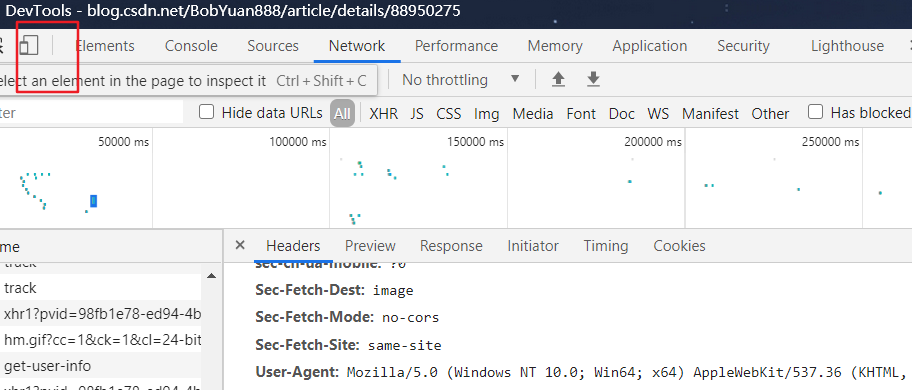

# 编码

socket是没有协议编码一说的。http可能是规定“iso-8859-1”编码，默认情况下整个报文都是用“iso-8859-1”编码。

一般只有url和特殊header和body才会有“iso-8859-1”编码字符集以外的字符（中文韩文。。）。

url一般使用urlEncode转化；header（下载中文文件名）也是，但看user-agent；body就是先拿到header分析content-type后再决定

# 域名

顶级域名就是一级域名，比如 .com .org .cn
N级域名就是在N-1级域名前追加一级。
比如二级域名是在一级域名前加一级，二级域名示例：[http://baidu.com](https://link.zhihu.com/?target=http%3A//baidu.com) http://zhihu.com [http://qq.com](https://link.zhihu.com/?target=http%3A//qq.com)

注： 有些人会说 [http://baidu.com](https://link.zhihu.com/?target=http%3A//baidu.com)http://zhihu.com[http://qq.com](https://link.zhihu.com/?target=http%3A//qq.com) 是一级域名，虽然是错误的-但可以理解(说的人多了也就是对的了……)，这是站在使用者/购买者角度看的，对于购买域名者来说 [http://xxx.com](https://link.zhihu.com/?target=http%3A//xxx.com)[http://xxx.com.cn](https://link.zhihu.com/?target=http%3A//xxx.com.cn)就相当一级域名，但是从真正的域名分级看，它们俩分别是二级域名、三级域名。

# 问题

**Provisional headers are shown**

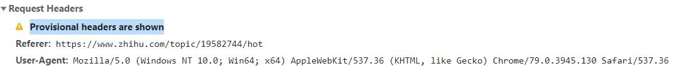

https://stackoverflow.com/questions/21177387/caution-provisional-headers-are-shown-in-chrome-debugger

https://juejin.im/post/5c00980751882518805add83 很有启发，有可能使跨域，也有可能是其他，因为我关闭AdBlock并没有起作用

> The resource could be being blocked by an extension (AdBlock in my case).
>
> The message is there **because the request to retrieve that resource was never made**, so the headers being shown are not the real thing. As explained in the issue you referenced, the real headers are updated when the server responds, but there is no response if the request was blocked.

解决：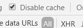


# 文献

图解http那本书

[用了这么久HTTP, 你是否了解Content-Length和Transfer-Encoding ?](https://blog.piaoruiqing.com/blog/2019/09/08/你是否了解content-length/)