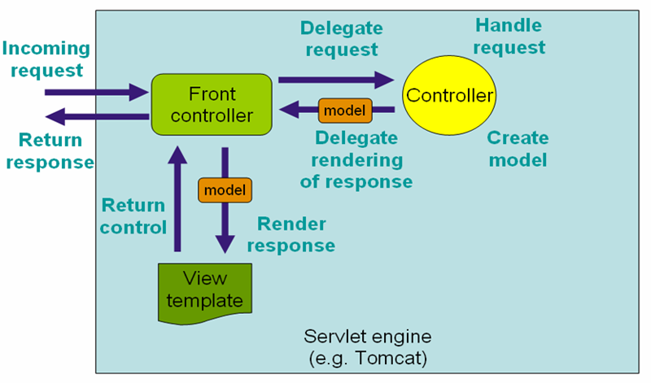
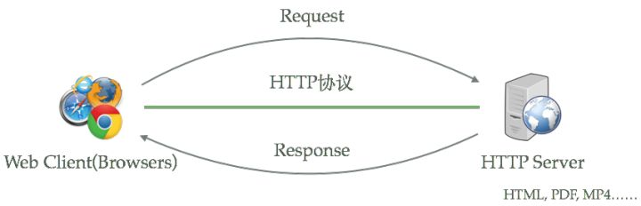
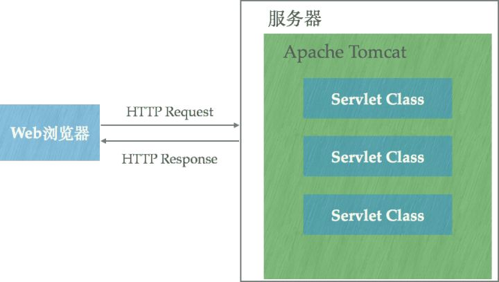
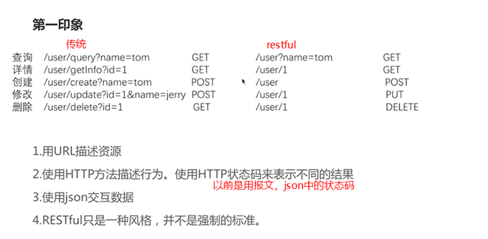

# 介绍

## 软件架构

1. C/S：客户端/服务器端
2. B/S：浏览器/服务器端

## 资源分类

1. 静态资源：所有用户访问后，得到的结果都是一样的，称为静态资源.静态资源可以直接被浏览器解析
	* 如： html,css,JavaScript
2. 动态资源:每个用户访问相同资源后，得到的结果可能不一样。称为动态资源。动态资源被访问后，需要先转换为静态资源，在返回给浏览器
	* 如：servlet/jsp,php,asp....

## 网络通信三要素

1. IP：电子设备(计算机)在网络中的唯一标识。
2. 端口：应用程序在计算机中的唯一标识。 0~65536
3. 传输协议：规定了数据传输的规则
	1. 基础协议：
		1. tcp:安全协议，三次握手。 速度稍慢
		2. udp：不安全协议。 速度快

# 静态 Web 内容

 HTTP 请求内容由Web 服务器文件系统直接提供，常见静态Web内容如：HTML、CSS、JS、JPEG、Flash等等

#### 特点

计算类型：I/O 类型，网络IO、文件系统IO

交互方式：单一

资源内容：相同（基本）

资源路劲：物理路径（文件、目录）也就是不只是显示网页，也可以显示目录

请求方法：GET（主要）

#### 常见使用场景

信息展示
样式文件（CSS）
脚本文件（JS）
图片（JPEG、GIF）
多媒体（Flash、Movie）
文件下载：和content-Type有关，如何不能识别只能下载，每个浏览器的渲染器都不一样

#### 常见Web服务器

Apache HTTP Server
Nginx
Microsoft IIS
GWS

**市场份额**

#### 为什么 Java Web Server 不是常用 Web Server？

 Java Web Server实际上使Application Server，动态处理请求。

- 内存占用，包装了C++，强类型

  类型：int本身就很大，4个字节
  分配

- 垃圾回收	

  被动回收，无法控制
  停顿，内存不够，FullGC，全部线程停

- 并发处理，css、js、html、ajax、img全部请求web Serve很占用资源。
  线程池
  线程开销

#### 标准优化技术

- 资源变化
  相应头：Last-Modified
  请求头：If-Modified-Since

- 资源缓存
  相应头：ETag
  请求头：If-None-Match

# 动态 Web 内容

#### 基本解释

​	与静态 Web 内容不同，请求内容通过服务器计算而来

#### 特点

计算类型：混合类型（I/O【文件传输、cache】、CPU、内存等）
交互方式：丰富（用户输入、客户端特征等）**前端的问题**
资源内容：多样性（非静态资源）
资源路径：逻辑路径（虚拟）
请求方法：GET、HEAD、PUT、POST等

#### 常见使用场景

页面渲染
表单交互（Form）
AJAX（json）
XML
JSON/JSONP
Web Services(SOAP、WSDL)
WebSocket

#### 流行 Java Web 服务器

Servlet 容器（Tomcat、Jetty）
非 Servlet容器（Undertow）

#### 请求

资源定位（URI）不包括参数
请求协议（Protocol）
请求方法（Method）
请求参数（Parameter）
请求主体（Body）
请求头（Header）
Cookie

#### 响应

响应头（Header）
响应主体（Body）

#### 技术/架构演变

由早到晚

- **CGI（Common Gateway Interface）**

- **Servlet（request、response）**

- **JSP（Java Server Page，因为Servlet很麻烦)**

- **Model 1（JSP + Servlet + JavaBeans）JaveEE规范**

  

- **Model 2（MVC）**model不仅包括模型，而且包括业务逻辑，view层只是渲染model结果（springMVC很多种视图，html、jsp...）

  

- **Spring Web MVC** （Model2的一种实现。找controller有一个map url的过程，Controller有些地方叫做Command）

  

- **Model 2 与 MVC的细微差异**

  Model 2 为面向 Web 服务的架构，MVC 则是面向所有应用场景（比如：PC应用、无线应用）

  相对于MVC，Model 2 中 Controller 细化为 Front Controller（FC）和Application Controller（AC)，前者（FC)负责路由后者（AC)，后者（AC）负责跳转视图（View）。

#### **三层架构**

在 B/S 架构中，系统标准的三层架构包括：表现层、业务层、持久层。三层架构在我们的实际开发中使用的非常多，所以我们课程中的案例也都是基于三层架构设计的。三层架构中，每一层各司其职，接下来我们就说说每层都负责哪些方面：

- **表现层**

  也就是我们常说的web层。它负责接收客户端请求，向客户端响应结果，通常客户端使用http协议请求web 层， web 需要接收 http 请求，完成 http 响应。

  表现层包括展示层和控制层：控制层负责接收请求，展示层负责结果的展示。

  表现层依赖业务层，接收到客户端请求一般会调用业务层进行业务处理，并将处理结果响应给客户端。

  **表现层的设计一般都使用 MVC 模型**。（MVC 是表现层的设计模型，和其他层没有关系）

- **业务层**

  也就是我们常说的 service 层。它负责业务逻辑处理，和我们开发项目的需求息息相关。 web 层依赖业务层，但是业务层不依赖 web 层。

  业务层在业务处理时可能会依赖持久层，如果要对数据持久化需要保证事务一致性。（也就是我们说的，事务应该放到业务层来控制）

- **持久层**
  也就是我们是常说的 dao 层。负责数据持久化，包括数据层即数据库和数据访问层，数据库是对数据进行持久化的载体，数据访问层是业务层和持久层交互的接口，业务层需要通过数据访问层将数据持久化到数据库中。通俗的讲，持久层就是和数据库交互，对数据库表进行曾删改查的。  

# 模板引擎

前后端分离为为什么还需要模板引擎？

因为数据量发得比较多的话，比如说报表之类的话，js可能崩溃？

JSP

Velocity

Thymeleaf

# Web Server、Application Server

（web容器）

**静态页面和动态页面**

### web应用服务器

应用服务器，则是一个应用执行的容器。它首先需要支持开发语言的 Runtime（对于 Tomcat 来说，就是 Java），保证应用能够在应用服务器上正常运行。其次，需要支持应用相关的规范，例如类库、安全方面的特性。对于 Tomcat 来说，就是需要提供 JSP/Sevlet 运行需要的标准类库、Interface 等。为了方便，应用服务器往往也会集成 HTTP Server 的功能，但是不如专业的 HTTP Server 那么强大，所以应用服务器往往是运行在 HTTP Server 的背后，执行应用，将动态的内容转化为静态的内容之后，通过 HTTP Server 分发到客户端。

在java web开发时，最早接触的web服务器是tomcat，其实tomcat是web应用服务器，任何的 web项目资源文件如果没有部署 在tomcat应用服务器中（资源文件没有放在tomcat安装目录中），都将不能访问得到。
类似的web应用服务器还有 weblogic 和 jetty等。

* webLogic：oracle公司，大型的JavaEE服务器，支持所有的JavaEE规范，收费的。
* webSphere：IBM公司，大型的JavaEE服务器，支持所有的JavaEE规范，收费的。
* JBOSS：JBOSS公司的，大型的JavaEE服务器，支持所有的JavaEE规范，收费的。
* Tomcat：Apache基金组织，中小型的JavaEE服务器，仅仅支持少量的JavaEE规范servlet/jsp。开源的，免费的。

### web服务器

Web Server 的概念太宽泛了。
严格的来说，Apache/Nginx 应该叫做「HTTP Server」；而 Tomcat 则是一个「Application Server」，或者更准确的来说，是一个「Servlet/JSP」应用的容器（Ruby/Python 等其他语言开发的应用也无法直接运行在 Tomcat 上）。

一个 HTTP Server 关心的是 HTTP 协议层面的传输和访问控制，所以在 Apache/Nginx 上你可以看到代理、负载均衡等功能。客户端通过 HTTP Server 访问服务器上存储的资源（HTML 文件、图片文件等等）。通过 CGI 技术，也可以将处理过的内容通过 HTTP Server 分发，但是一个 HTTP Server 始终只是把服务器上的文件如实的通过 HTTP 协议传输给客户端。

常见的web服务器有： nginx ， nginx 是Apache 提供的web服务器，nginx是一款高性能、轻量级的web服务器和反向代理服务器以及邮件代理服务器。支持高并发，并发量50000 。nginx不能解析动态的jsp页面。

### aphche

Apache，指的应该是Apache软件基金会下的一个项目——[Apache HTTP Server Project](https://link.zhihu.com/?target=https%3A//httpd.apache.org/)；Nginx同样也是一款开源的HTTP服务器软件（当然它也可以作为邮件代理服务器、通用的TCP代理服务器）。

HTTP服务器本质上也是一种应用程序——它**通常运行在服务器之上，绑定服务器的IP地址并监听某一个tcp端口来接收并处理HTTP请求**，这样客户端（一般来说是IE, Firefox，Chrome这样的浏览器）就能够通过HTTP协议来获取服务器上的网页（HTML格式）、文档（PDF格式）、音频（MP4格式）、视频（MOV格式）等等资源。下图描述的就是这一过程：

不仅仅是Apache HTTP Server和Nginx，绝大多数编程语言所包含的类库中也都实现了简单的HTTP服务器方便开发者使用：

- [HttpServer (Java HTTP Server )](https://link.zhihu.com/?target=https%3A//docs.oracle.com/javase/8/docs/jre/api/net/httpserver/spec/com/sun/net/httpserver/HttpServer.html)
- [Python SimpleHTTPServer](https://link.zhihu.com/?target=https%3A//docs.python.org/2/library/simplehttpserver.html)

使用这些类库能够非常容易的运行一个HTTP服务器，它们都能够通过绑定IP地址并监听tcp端口来提供HTTP服务。

### Tomcat

[Apache Tomcat](https://link.zhihu.com/?target=http%3A//tomcat.apache.org/)则是Apache基金会下的另外一个项目，与Apache HTTP Server相比，Tomcat能够**动态**的生成资源并返回到客户端。Apache HTTP Server和Nginx都能够将某一个文本文件的内容通过HTTP协议返回到客户端，但是这个文本文件的内容是固定的——也就是说无论何时、任何人访问它得到的内容都是完全相同的，这样的资源我们称之为**静态**资源。动态资源则与之相反，在不同的时间、不同的客户端访问得到的内容是不同的，例如：

- 包含显示当前时间的页面
- 显示当前IP地址的页面

Apache HTTP Server和Nginx本身不支持生成动态页面，但它们可以通过其他模块来支持（例如通过Shell、PHP、Python脚本程序来动态生成内容）。
如果想要使用Java程序来动态生成资源内容，使用这一类HTTP服务器很难做到。[Java Servlet](https://link.zhihu.com/?target=http%3A//www.tianmaying.com/tutorial/servlet-intro)技术以及衍生的[Java Server Pages](https://link.zhihu.com/?target=http%3A//www.tianmaying.com/tutorial/jsp-intro)技术可以让Java程序也具有处理HTTP请求并且返回内容（由程序动态控制）的能力，Tomcat正是支持运行Servlet/JSP应用程序的容器（Container）:

Tomcat运行在JVM之上，它和HTTP服务器一样，绑定IP地址并监听TCP端口，同时还包含以下指责：

管理Servlet程序的生命周期

将URL映射到指定的Servlet进行处理

与Servlet程序合作处理HTTP请求——根据HTTP请求生成HttpServletResponse对象并传递给Servlet进行处理，将Servlet中的HttpServletResponse对象生成的内容返回给浏览器

### nginx

虽然Tomcat也可以认为是HTTP服务器，但通常它仍然会和Nginx配合在一起使用：

- 动静态资源分离——运用Nginx的反向代理功能分发请求：所有动态资源的请求交给Tomcat，而静态资源的请求（例如图片、视频、CSS、JavaScript文件等）则直接由Nginx返回到浏览器，这样能大大减轻Tomcat的压力。
- 负载均衡，当业务压力增大时，可能一个Tomcat的实例不足以处理，那么这时可以启动多个Tomcat实例进行水平扩展，而Nginx的负载均衡功能可以把请求通过算法分发到各个不同的实例进行处理

### 区别：

**web服务器只能解析静态页面，即html页面，它请求的路径是固定的。
而web应用服务器可以解析动态的jsp页面，即它请求的路径是动态生成的，负责的是请求的逻辑处理。**

所以一般在web项目开发 中，apache+tomcat+nginx联合使用，访问静态资源时用apache解析，访问动态资源时用tomcat解析，nginx作为反向代理服务器，同时支持高并发。

# Servlet容器

## 传统 Servlet 容器

### Eclipse Jetty

The Jetty Web Server provides an HTTP server and Servlet container capable of serving static and dynamic content either from a standalone or embedded instantiations. From jetty-7 on, the jetty web-server and other core components are hosted by the Eclipse Foundation. The project provides:

- Asynchronous HTTP Server
- Standards based Servlet Container
- websocket server
- http/2 server
- Asynchronous Client (http/1.1, http/2, websocket)
- OSGI, JNDI, JMX, JASPI, AJP support

### Apache Tomcat

Tomcat是由Apache软件基金会下属的Jakarta项目开发的一个Servlet容器，按照Sun Microsystems提供的技术规范，实现了对Servlet和JavaServer Page（JSP）的支持，并提供了作为Web服务器的一些特有功能，如Tomcat管理和控制平台、安全域管理和Tomcat阀等。由于Tomcat本身也内含了一个HTTP服务器，它也可以被视作一个单独的Web服务器。

标准实现：

- Servlet
- JSP
- Expression Language
- WebSocket

## Spring Boot 嵌入式Web容器

### Servlet 容器

Embedded Jetty

#### Embedded Tomcat

静态资源处理

欢迎页面（Welcome file list）
JSP处理
类加载（Classloading）
连接器（Connectors）

### 非 Servlet 容器

Undertow

# Restful

## 理论基础

- **基本概念**
  REST = RESTful = Representational State Transfer，is one way of providing interoperability between computer systems on the Internet.

  就是一种可以在不同计算机系统都能交互（先识别）的方式，比如304都知道是使用缓存，不然使用各种报文会使得外人看不懂。

- **历史**
  REST 来自于Roy Thomas Fielding 2000年的博士论文 - 《Architectural Styles and the Design of Network-based Software Architectures》

- **类似形式**
  Web Services：WSDL、SOAP

- **架构属性**
  性能（Performance）
  可伸缩性（Scalability）
  统一接口简化性（Simplicity of a uniform Interface）
  组件可修改性（Modifiability of components）
  组件通讯可见性（Visibility of communication between components）
  组件可移植性（Portability of component）
  可靠性（Reliability）

- **架构约束**
  C/S架构（Client-Server）
  无状态（Stateless）：http协议无状态（连接并不是保持长期连接，除非是socket）
  可缓存（Cachexable）：304状态码
  分层系统（Layered System）：MVC
  按需代码（Code on demand）
  统一接口（Uniform interface) ：看下面

## 统一接口

- 资源识别（Identification of resources）
  URI（Uniform Resource Identifier ）

- 资源操作（Manipulation of resources through representations）
  HTTP verbs：GET（拿）、PUT（更新）、POST、DELETE

- 自描述消息（Self-descriptive messages）
  Content-Type
  MIME-Type
  Media Type： application/javascript、 text/html

  HTTP status code

- 超媒体（HATEOAS）
  Hypermedia As The Engine Of Application State

## REST 成熟度模型

## REST 服务端实践

### Spring Boot REST

### HATEOAS

Hypermedia As The Engine Of Application State

对比技术
Web Services ：WSDL

### REST文档生成

Spring Boot /mappings endpoint

Spring RestDocs

Swagger

## REST 客户端实践

Web 浏览器

Apache HttpClient

Spring RestTemplate

