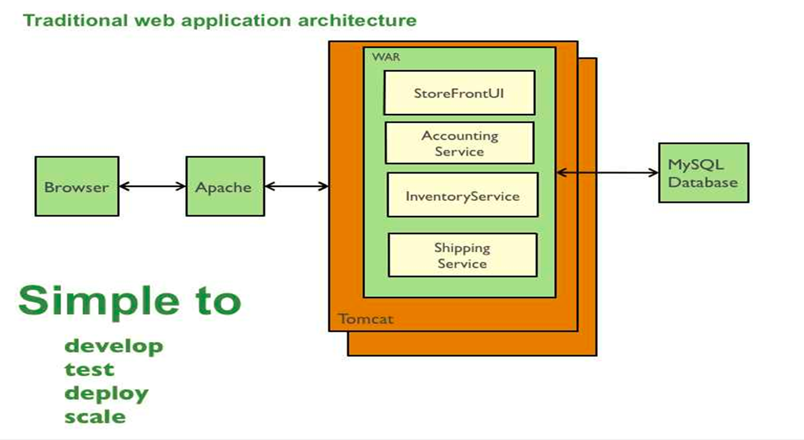
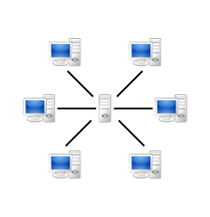
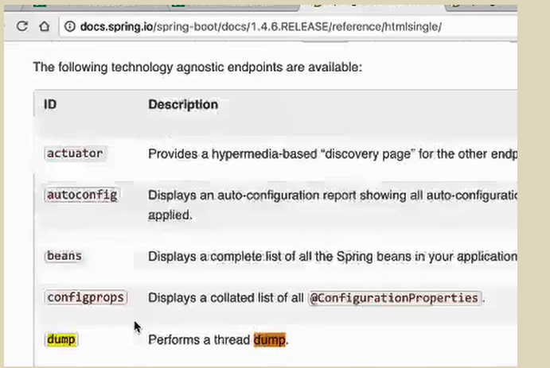

### 介绍

#### 概念

Microseicrorvices are a more concrete and modern interpretation of service-oriented architectures (SOA) used to build distributed software systems（Source:wikipedia）

#### 目的

解决单体应用（Monolithic Application）规模增加时所带来的问题

#### 关键字

Monolithic、SOA、架构、分布式系统

### Monolithic

这里是java描述，但是微服务不局限于java；说得比较片面，因为软件越大，都不simple了。



### Monolithic VS Microseicrorvices


#### 优势

开发（ Development ）：单体应用的方法都在一个程序里，微服务的拓扑结构从环状变成星状
稳定（ Stability ）：进程级别的方法调用方便；微服务有序列化和反序列化、网络带宽和稳定性的开销
性能（Performance）
部署（Deployment）

#### 不足

中心化（ Centralization ）：模块代码都在一起，github地址，耦合度越来越高，
耦合（ Coupling ）
学习成本（Learning Cost）: 项目太大，不知道去哪里找代码 
伸缩（Scale）：瓶颈在于性能最差的模块，微服务可以相应改善
持续交付（Continuous Delivery）

### Service-oriented architecture

Service-oriented architecture

一切都是服务


### SOA VS  MS

- 类同

  面向服务（ Service-Oriented ）
  松耦合（Loose-Coupling）jar包和一个模块变成一个服务，改成rpc
  模块化（Modular）
  分布式计算（Distributed Computing）
  平台无关性（Independent Platform）：http协议，json本文

- 差异

  “原子性”（Atomic）
  领域驱动设计（DDD）：领域要切分，但实践比较小
  开发运维体系（DevOps）


### 进程间通讯

Inter-Process Communication

- 近端通讯（Local ）：一条放服务器上的

  文件（File)
  消息队列(Message)
  共享内存（Shared Memory）
  其他（Pipe、MMF）

- 远端通讯（ Remote ）

  套接字（Socket）
  远程过程调用（RPC）：rpc也是socket的一种应用；rpc面向接口、服务，但socket更加面向底层，rpc底层数据，面向协议


### 分布式计算

 Distributed Computing

- 模型（Model）b/s也属于c/s的一种特殊形式

  客户端-服务端（Client-Server）

  

  点对点（Peer To Peer） 

  

- 分类（Type）：看业务需求

  同步（ Synchronous ）
  异步（ Asynchronous ）

- 通讯协议（Communication Protocol）：不是指tcp协议，是指顶层协议

  HTTP（ Hypertext Transfer Protocol ）
  自定义协议（ User-Defined Protocol ）

- 传输介质（Media）
  文本（Text）
  二进制（Binary）

### SOA

 Service-oriented architecture

- 层次划分
  消费接口（Consumer Interface）
  业务处理（Business Process）
  服务组件（Services Component）
  
- 技术
  SOAP
  CORBA
  RMI
  REST ：可以使用json，html，xml；json比较快，html太松散
  ESB
  
  #### ESB

企业服务总线（ Enterprise Service Bus ）

soa才用，传统项目比较多。

mulesoft

API网关可以理解为一个轻量的ESB总线能力实现。

[怎样给不懂技术的人解释ESB是做什么的？](https://www.zhihu.com/question/23939186)

现在很少有关于SOA的讨论，是因为大家觉得这个东西过时了，还是觉得已经成熟了没有什么好谈的了？ - QI Towne的回答 - 知乎
https://www.zhihu.com/question/19641298/answer/69911968

ESB主要是为了解决多个应用系统互联所面临的的复杂性，减低集成和维护成本。

举个例子，比如医疗业务系统可分为很多子系统，包括HIS、LIS、EMR等等，如果这些业务系统可能是由多个供应商开发的，可能会有构建语言的不同、通信协议的不同、数据传输格式的不同等问题，那么如何把这些系统用一条线串起来呢？就是ESB。ESB就是把服务的集成从系统层面提升到了平台层面，通过中间件调用各系统服务，以实现各系统通信。它需要保证多个应用系统的服务接入，协议转换，提供可靠的消息传输，数据格式转换，基于内容路由等功能。

有人可能会有疑问，应用A发送消息给ESB，ESB再将消息转换给应用B，那么应用A直接通过SOAP协议发送给B，效率不是应该更高吗？而且如果这些IT系统都在一个网络中，提供的WebService都在统一命名空间下，就可以相互通信，为什么还要加上这一层？有两点需要考虑。第一点。点对点做服务的时候，通常需要考虑日志记录，服务访问安全、传输安全、数据安全、路由分发等一系列问题，而这些完全可以统一管理，统一验证，灵活配置；如果应用A调用了应用B，再调用了应用C等具有逻辑流程的调用时，还可以在ESB上实现流程引擎；第二点，ESB是一个中间件平台，包含了消息中间件的全部功能，有异步消息处理机制，可以实现业务系统之间真正的松耦合的结构。
————————————————
版权声明：本文为CSDN博主「歆格」的原创文章，遵循CC 4.0 BY-SA版权协议，转载请附上原文出处链接及本声明。
原文链接：https://blog.csdn.net/weixin_29048309/article/details/112143372

[微服务为什么不需要esb？](https://www.zhihu.com/question/268178590)

### 技术挑战

注册与发现（Registry and Discovery）
路由（Routing）：负载均衡，版本
可靠性（ Reliability ）
延迟（Latency ）：网络延迟
热点（Hotspot）：使用负载均衡解决
短路（ Circuit Break ）：某些服务太慢，暂时关掉
伸缩（Scale）
异步（Async）
监控（Monitoring）
配置（Configuration）
数据同步（Data Sync）：CAP原则，分布式：数据要不要分，如何分
安全（Security）

### Java 微服务实践

#### 元编程

Meta Programming

> 面向过程，面向对象，面向切面，面向元编程

在Java编程语言中，元编程是一种新型的变成模式，目的是减少代码行数，得到事半功倍的效果。

- 主要模式
  注解驱动（Annotation-Driven）
  反射驱动（Reflection-Driven）
  表达式驱动（Expression-Driven）：依赖反射
  Lambda（Java 8 Introduced）
  Script On JVM（Groovy、JavaScript等）
- 接口编程（Interface Programming）
  又称之为契约编程，在OOP语言中，其契约范围包括方法名称、方法入参（类型和顺序）、方法返回值（类型）以及异常情况等元数据。


#### 监控

- Monitoring And Control

DevOps  =  Dev  + Ops  

Dev In Spring Boot  = Services 

Ops  In Spring Boot = Management

Management = Endpoints

Endpoints = Monitoring And Control

- JVM

  通用（General）
  线程（Threading）
  内存（Memory）
  日志（Logging）

- 指标（Metrics）

  Counter: 计数器, 事件发生的总次数, 会员登录的总次数, cache请求的总次数等.
  Gauge: 计量表, 某一时刻的数据,如仪表盘上的温度,速度等,网络上如内存,cpu,网络等
  Meters: 事件发生的频率, 如1分钟,5分钟和15分钟总共发生多少次. 如1分钟我们消费了多少消息, 5分钟发送了多少消息, 如linux下的uptime和top工具.
  Histogram: 柱状图, 主要是处理事件值的区间值, 如最大,最小,平均, 95%的标准偏差. 通常和处理的时长或个数有关联,如处理某一类任务耗费的事件,单位事件处理的任务数等.
  Timers: timer是发生频率和柱状图的组合,如QPS,我们要统计请求的频率,同时在统计每次请求的时间等.

- 使用

```xml
		//例如访问http://localhost:8081/trace
		//配置，基本都是json信息，显示程序的运行信息
		management.port = 8081
		//依赖
		<dependency>
			<groupId>org.springframework.boot</groupId>
			<artifactId>spring-boot-starter-actuator</artifactId>
		</dependency>
```

- 文档

  查找EndPoint




## 分布式服务框架

微服务的具体实施方式

rpc框架加服务治理

spring-cloud那一套

netflex，dubbo，spring-cloud-alibaba

## **SOA架构和微服务架构的区别**

微服务是更细的soa架构。

*微服务架构 = 80%的SOA服务架构思想 + 100%的组件化架构思想 + 80%的领域建模思想*

当然，技术上是有个自己的实现，不过soa泛指旧的那一套。

[面试官问我：SOA架构和微服务架构的区别是什么？我居然答错了...](https://zhuanlan.zhihu.com/p/88095798)

[Dubbo与Nacos的区别两者是不是有重叠?](https://www.zhihu.com/question/451932038)

Nacos 主要功能集中在 动态服务发现、服务配置、服务元数据及流量管理。你可以把他简单的理解为是一个注册中心和配置中心。

Dubbo 是一款高性能、轻量级的开源 Java 服务框架。 主要功能点在于 RPC 框架。

# 云原生

云原生就是微服务，容器和上云那一套，如果是后面入行的基本一开始接触的都是云原生。最大优势在于运维更简单，大公司帮你运维，有钱就可以弹性伸缩。

云原生就是追求动态扩容启停，无缝故障切换，所以容器启动速度很重要

**总而言之，符合云原生架构的应用程序应该是：采用开源堆栈（K8S+Docker）进行容器化，基于微服务架构提高灵活性和可维护性，借助敏捷方法、DevOps支持持续迭代和运维自动化，利用云平台设施实现弹性伸缩、动态调度、优化资源利用率。**

云原生的基础是容器化，基于容器化的应用，发布，部署，微服务，CICD就叫云原生。

什么是云原生？这回终于有人讲明白了 - 华为云开发者联盟的文章 - 知乎
https://zhuanlan.zhihu.com/p/150190166